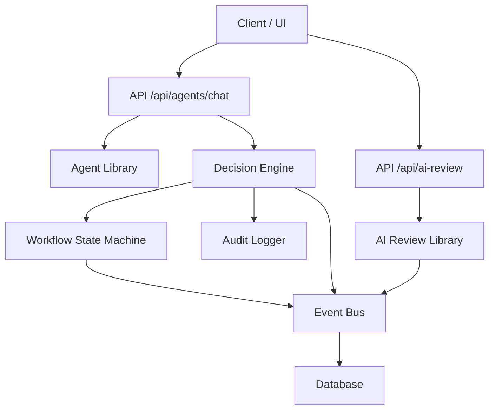
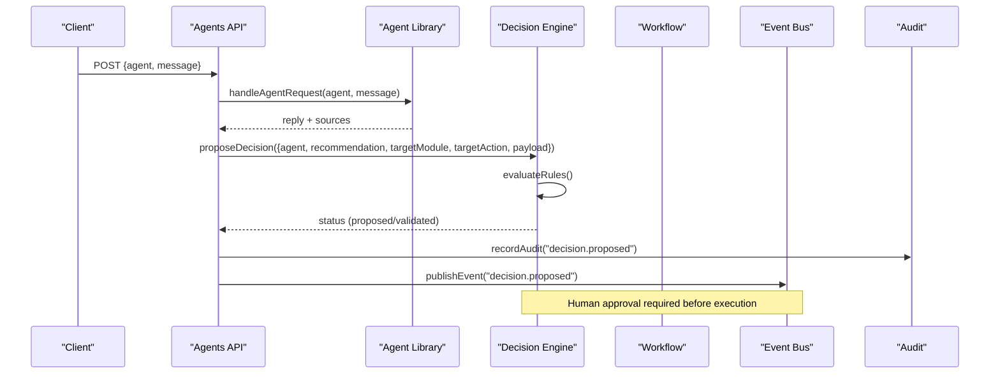
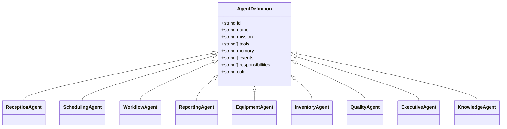
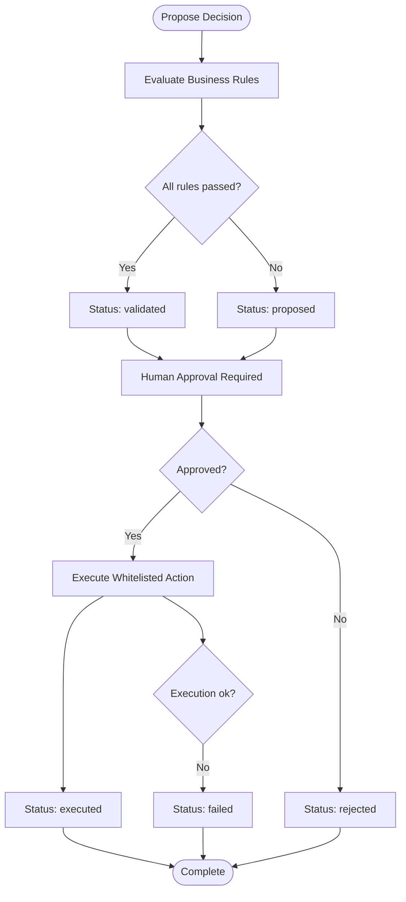
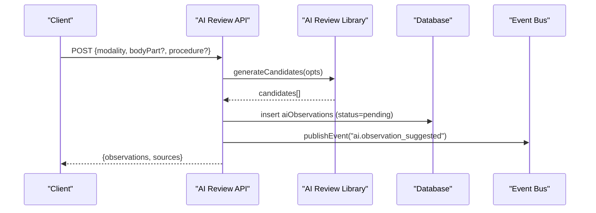
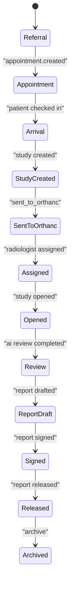
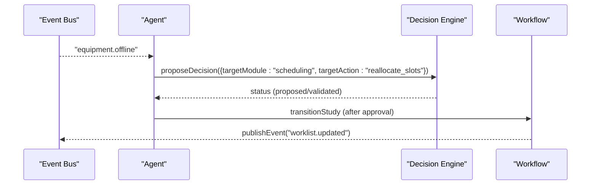
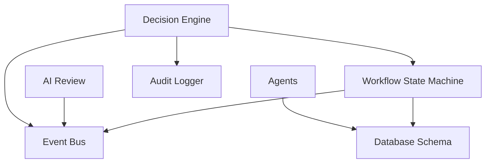

# AI & Intelligence

<cite>
**Referenced Files in This Document**
- [agents.ts](file://src/lib/agents.ts)
- [decision-engine.ts](file://src/lib/decision-engine.ts)
- [ai-review.ts](file://src/lib/ai-review.ts)
- [events.ts](file://src/lib/events.ts)
- [workflow.ts](file://src/lib/workflow.ts)
- [audit.ts](file://src/lib/audit.ts)
- [route.ts (Agents Chat)](file://src/app/api/agents/chat/route.ts)
- [route.ts (AI Review)](file://src/app/api/ai-review/route.ts)
- [orchestration.py](file://backend/app/agents/orchestration.py)
- [langgraph_agent.py](file://services/langgraph_agent.py)
- [schema.ts](file://src/db/schema.ts)
- [decision-engine.test.ts](file://__tests__/lib/decision-engine.test.ts)
- [ai-review.test.ts](file://__tests__/lib/ai-review.test.ts)
</cite>

## Table of Contents
1. [Introduction](#introduction)
2. [Project Structure](#project-structure)
3. [Core Components](#core-components)
4. [Architecture Overview](#architecture-overview)
5. [Detailed Component Analysis](#detailed-component-analysis)
6. [Dependency Analysis](#dependency-analysis)
7. [Performance Considerations](#performance-considerations)
8. [Troubleshooting Guide](#troubleshooting-guide)
9. [Conclusion](#conclusion)

## Introduction
This document explains GeraldOS AI and intelligence systems with a focus on:
- The multi-agent architecture with nine specialized agents, their missions, tools, memory scopes, and event subscriptions.
- The decision engine that enforces a strict flow for all AI actions: recommendation → business rules → validation → approval → execution → audit.
- The AI review assistant that provides multi-modal image analysis support, confidence scoring, literature integration, and auditable candidate observations.
- Practical examples of agent communication patterns and decision validation workflows.
- Both conceptual overviews for beginners and technical implementation details for experienced developers.

## Project Structure
GeraldOS implements AI capabilities across the Next.js application layer and optional LangGraph orchestration services:
- Agent definitions and live-data responses are defined server-side and exposed via API routes.
- The decision engine centralizes policy enforcement and safe execution through whitelisted actions.
- The AI review assistant generates candidate observations per modality and persists them for radiologist review.
- An event bus decouples modules and ensures durable logging even when Redis is unavailable.
- A workflow state machine governs study progression with strict guards and notifications.

**Diagram sources**
- [route.ts (Agents Chat):1-85](file://src/app/api/agents/chat/route.ts#L1-L85)
- [route.ts (AI Review):1-109](file://src/app/api/ai-review/route.ts#L1-L109)
- [agents.ts:1-374](file://src/lib/agents.ts#L1-L374)
- [decision-engine.ts:1-245](file://src/lib/decision-engine.ts#L1-L245)
- [ai-review.ts:1-221](file://src/lib/ai-review.ts#L1-L221)
- [events.ts:1-158](file://src/lib/events.ts#L1-L158)
- [workflow.ts:1-246](file://src/lib/workflow.ts#L1-L246)
- [audit.ts:1-25](file://src/lib/audit.ts#L1-L25)

**Section sources**
- [route.ts (Agents Chat):1-85](file://src/app/api/agents/chat/route.ts#L1-L85)
- [route.ts (AI Review):1-109](file://src/app/api/ai-review/route.ts#L1-L109)
- [agents.ts:1-374](file://src/lib/agents.ts#L1-L374)
- [decision-engine.ts:1-245](file://src/lib/decision-engine.ts#L1-L245)
- [ai-review.ts:1-221](file://src/lib/ai-review.ts#L1-L221)
- [events.ts:1-158](file://src/lib/events.ts#L1-L158)
- [workflow.ts:1-246](file://src/lib/workflow.ts#L1-L246)
- [audit.ts:1-25](file://src/lib/audit.ts#L1-L25)

## Core Components
- Multi-Agent System: Nine specialized agents with explicit missions, tool sets, memory scopes, and event subscriptions. Each agent returns decision support only; no direct state mutation.
- Decision Engine: Enforces policy via business rules, requires human approval before execution, and executes only whitelisted actions with full audit and events.
- AI Review Assistant: Generates candidate observations per modality with confidence scores, suggested differentials, literature references, and technical quality checks. All candidates require radiologist acceptance or rejection.
- Event Bus: Publishes domain events to Redis Streams and persists to an event log table for durability.
- Workflow State Machine: Governs study lifecycle transitions with strict forward-only rules, required context, audit logging, and notifications.

**Section sources**
- [agents.ts:1-374](file://src/lib/agents.ts#L1-L374)
- [decision-engine.ts:1-245](file://src/lib/decision-engine.ts#L1-L245)
- [ai-review.ts:1-221](file://src/lib/ai-review.ts#L1-L221)
- [events.ts:1-158](file://src/lib/events.ts#L1-L158)
- [workflow.ts:1-246](file://src/lib/workflow.ts#L1-L246)

## Architecture Overview
The system uses an event-driven, layered architecture:
- API Layer: Routes handle requests, validate inputs, and delegate to libraries.
- Agent Layer: Specialized agents provide operational insights and propose decisions.
- Decision Layer: Central policy enforcement and safe execution via whitelisted actions.
- Workflow Layer: Strict state machine for clinical studies.
- Observability: Audit logs and event bus ensure traceability and resilience.

**Diagram sources**
- [route.ts (Agents Chat):1-85](file://src/app/api/agents/chat/route.ts#L1-L85)
- [agents.ts:1-374](file://src/lib/agents.ts#L1-L374)
- [decision-engine.ts:1-245](file://src/lib/decision-engine.ts#L1-L245)
- [events.ts:1-158](file://src/lib/events.ts#L1-L158)
- [audit.ts:1-25](file://src/lib/audit.ts#L1-L25)

## Detailed Component Analysis

### Multi-Agent Architecture
Nine agents operate independently with clear responsibilities:
- Reception: Patient registration, consent, queue management.
- Scheduling: Slot optimization, conflict detection, priority allocation.
- Workflow: Study progression monitoring, bottleneck detection, escalation.
- Reporting: Template recommendations, draft structuring, quality scoring.
- Equipment: Calibration/maintenance tracking, downtime impact estimation.
- Inventory: Stock thresholds, expiry monitoring, consumption forecasting.
- Quality Assurance: Image/study completeness scoring, AI observation audits.
- Executive Intelligence: KPI summaries, trend models, revenue-at-risk alerts.
- Knowledge: Answers from approved internal documentation only.

Each agent defines its mission, tools, memory scope, and event subscriptions. Responses are advisory; any state changes must go through the decision engine.

**Diagram sources**
- [agents.ts:1-374](file://src/lib/agents.ts#L1-L374)

**Section sources**
- [agents.ts:1-374](file://src/lib/agents.ts#L1-L374)

### Decision Engine
The decision engine enforces a strict pipeline:
- Recommendation: Agents propose actions with rationale and priority.
- Business Rules: Server-side evaluation blocks unsafe actions (e.g., auto-signing reports, autonomous diagnosis).
- Validation: If rules pass, status moves to validated; otherwise remains proposed.
- Approval: Explicit human approval required before execution.
- Execution: Only whitelisted actions execute safely (e.g., workflow stage advancement, equipment status updates, staff notifications).
- Audit: Every step records an audit entry and publishes an event.

**Diagram sources**
- [decision-engine.ts:1-245](file://src/lib/decision-engine.ts#L1-L245)

**Section sources**
- [decision-engine.ts:1-245](file://src/lib/decision-engine.ts#L1-L245)
- [decision-engine.test.ts:1-152](file://__tests__/lib/decision-engine.test.ts#L1-L152)

### AI Review Assistant
The AI review assistant supports multiple modalities and produces candidate observations:
- Modality Coverage: X-Ray, CT, MRI, Ultrasound, Mammography, DEXA, Dental, Nuclear Medicine, PET-CT, Fluoroscopy.
- Candidate Generation: Produces findings, normal confirmations, and technical quality assessments with confidence scores.
- Literature Integration: Provides references aligned with modality-specific guidelines.
- Technical Quality Checks: Weighted checklists per modality to assess image quality.
- Persistence: Candidates stored as pending until radiologist accepts or rejects.

**Diagram sources**
- [route.ts (AI Review):1-109](file://src/app/api/ai-review/route.ts#L1-L109)
- [ai-review.ts:1-221](file://src/lib/ai-review.ts#L1-L221)
- [events.ts:1-158](file://src/lib/events.ts#L1-L158)

**Section sources**
- [route.ts (AI Review):1-109](file://src/app/api/ai-review/route.ts#L1-L109)
- [ai-review.ts:1-221](file://src/lib/ai-review.ts#L1-L221)
- [ai-review.test.ts:1-141](file://__tests__/lib/ai-review.test.ts#L1-L141)

### Workflow State Machine
The workflow state machine governs study progression with strict rules:
- Forward-Only Transitions: Studies move from referral to archive without backward steps.
- Context Requirements: Certain stages require specific context (e.g., radiologist assignment, DICOM studyInstanceUid).
- Audit and Events: Every transition records an audit entry and publishes relevant events.
- Notifications: Clinically significant handoffs trigger notifications.

**Diagram sources**
- [workflow.ts:1-246](file://src/lib/workflow.ts#L1-L246)

**Section sources**
- [workflow.ts:1-246](file://src/lib/workflow.ts#L1-L246)

### Agent Communication Patterns
Agents communicate through:
- Event Subscriptions: Each agent reacts to domain events (e.g., patient.registered, appointment.delayed, equipment.offline).
- Decision Proposals: Agents propose decisions that flow through the decision engine for approval and execution.
- Live Data Snapshots: Agents query current operational data to provide contextual responses.

**Diagram sources**
- [agents.ts:1-374](file://src/lib/agents.ts#L1-L374)
- [decision-engine.ts:1-245](file://src/lib/decision-engine.ts#L1-L245)
- [workflow.ts:1-246](file://src/lib/workflow.ts#L1-L246)
- [events.ts:1-158](file://src/lib/events.ts#L1-L158)

**Section sources**
- [agents.ts:1-374](file://src/lib/agents.ts#L1-L374)
- [events.ts:1-158](file://src/lib/events.ts#L1-L158)

### Conceptual Overview
For beginners:
- Agents are like specialized assistants, each focused on a specific task (e.g., scheduling, reporting).
- The decision engine acts as a safety gate, ensuring no AI action happens without proper checks and human approval.
- The AI review assistant helps radiologists by suggesting possible findings but never makes diagnoses.
- The workflow state machine ensures studies progress in a controlled, auditable manner.

For experienced developers:
- Agents use a snapshot-based approach to gather live data and respond contextually.
- The decision engine enforces policy via server-side rules and whitelisted executors.
- The AI review assistant generates candidate observations with confidence scores and literature references.
- The event bus provides resilient, decoupled communication between components.

[No sources needed since this section provides conceptual guidance]

## Dependency Analysis
Key dependencies and relationships:
- Agents depend on database schemas for live data snapshots.
- Decision engine depends on workflow state machine and audit/event systems.
- AI review assistant depends on modality-specific logic and event publishing.
- Workflow state machine depends on database schemas and notification systems.

**Diagram sources**
- [agents.ts:1-374](file://src/lib/agents.ts#L1-L374)
- [decision-engine.ts:1-245](file://src/lib/decision-engine.ts#L1-L245)
- [ai-review.ts:1-221](file://src/lib/ai-review.ts#L1-L221)
- [workflow.ts:1-246](file://src/lib/workflow.ts#L1-L246)
- [schema.ts:1-200](file://src/db/schema.ts#L1-L200)

**Section sources**
- [agents.ts:1-374](file://src/lib/agents.ts#L1-L374)
- [decision-engine.ts:1-245](file://src/lib/decision-engine.ts#L1-L245)
- [ai-review.ts:1-221](file://src/lib/ai-review.ts#L1-L221)
- [workflow.ts:1-246](file://src/lib/workflow.ts#L1-L246)
- [schema.ts:1-200](file://src/db/schema.ts#L1-L200)

## Performance Considerations
- Event Bus Resilience: Events are persisted to both Redis Streams and database tables to ensure durability even if Redis is unavailable.
- Agent Snapshots: Live data snapshots are optimized with targeted queries to minimize database load.
- Decision Engine Efficiency: Business rules are evaluated server-side with minimal overhead.
- Workflow State Machine: Forward-only transitions reduce complexity and improve performance.
- AI Review Generation: Candidate generation is lightweight and deterministic for local simulation.

[No sources needed since this section provides general guidance]

## Troubleshooting Guide
Common issues and solutions:
- Agent Communication Failures: Check event bus connectivity and database availability.
- Decision Engine Blocks: Review business rules and ensure proposals comply with policy constraints.
- AI Review Errors: Verify modality support and input parameters for candidate generation.
- Workflow Transition Errors: Ensure required context (e.g., radiologist assignment, DICOM studyInstanceUid) is provided.

**Section sources**
- [events.ts:1-158](file://src/lib/events.ts#L1-L158)
- [decision-engine.ts:1-245](file://src/lib/decision-engine.ts#L1-L245)
- [ai-review.ts:1-221](file://src/lib/ai-review.ts#L1-L221)
- [workflow.ts:1-246](file://src/lib/workflow.ts#L1-L246)

## Conclusion
GeraldOS AI and intelligence systems provide a robust, secure, and scalable foundation for medical imaging operations. The multi-agent architecture enables specialized handling of diverse tasks, while the decision engine ensures all AI actions are properly vetted and approved. The AI review assistant enhances radiologist productivity with evidence-based suggestions, and the workflow state machine maintains clinical integrity throughout the study lifecycle. Together, these components create a comprehensive platform that balances automation with human oversight, ensuring safety, compliance, and operational efficiency.

[No sources needed since this section summarizes without analyzing specific files]