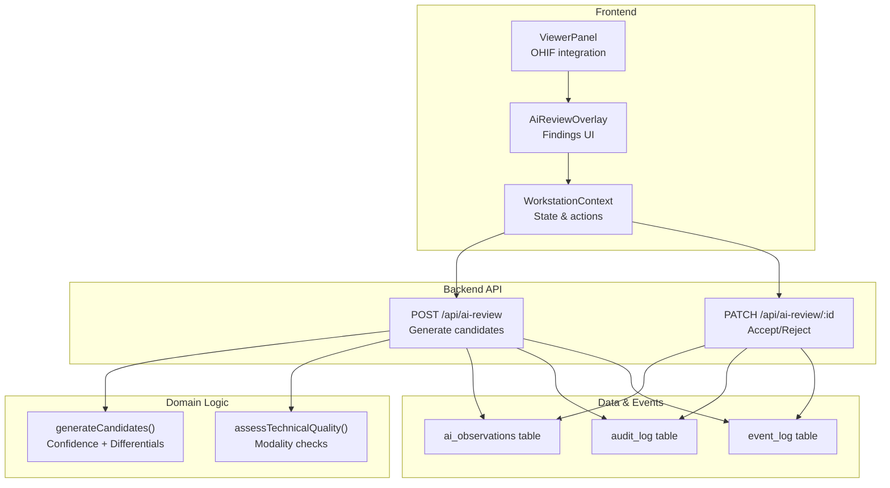
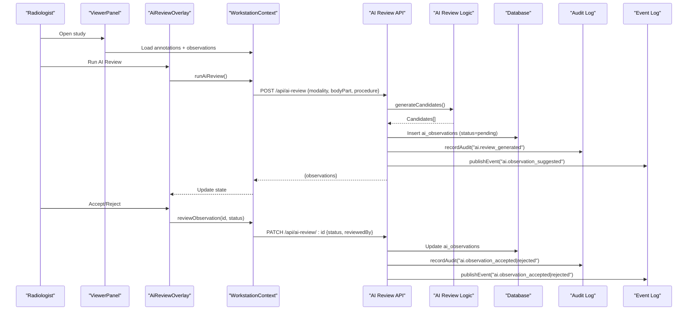
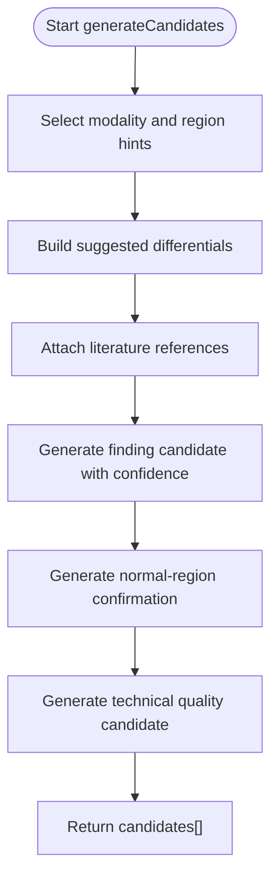
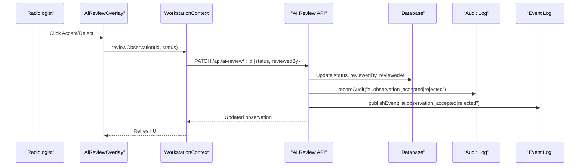
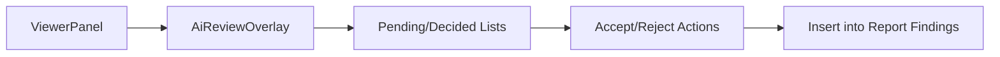
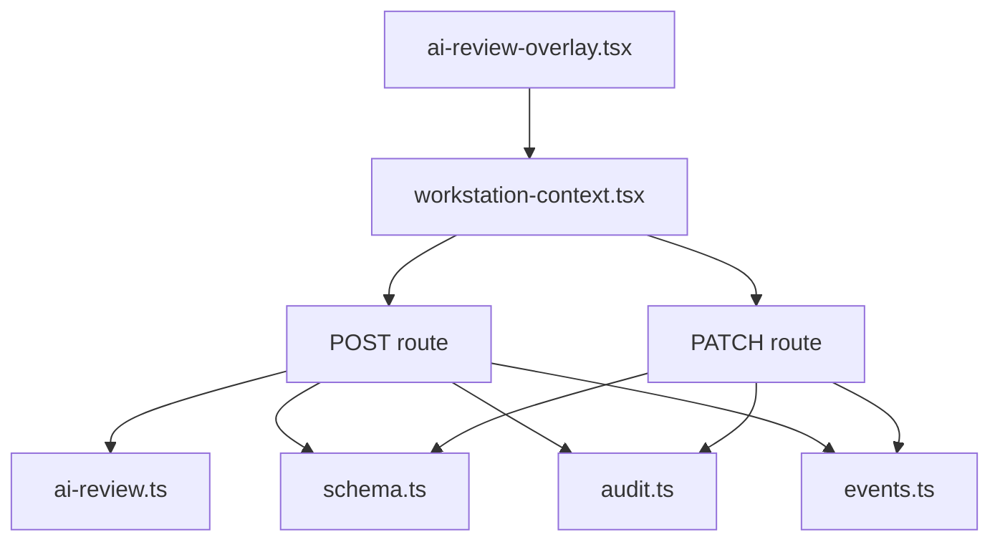

# AI Review Assistant

<cite>
**Referenced Files in This Document**
- [ai-review.ts](file://src/lib/ai-review.ts)
- [ai-review-overlay.tsx](file://src/components/workstation/ai-review-overlay.tsx)
- [viewer-panel.tsx](file://src/components/workstation/viewer-panel.tsx)
- [workstation-context.tsx](file://src/components/workstation/workstation-context.tsx)
- [route.ts (AI review POST)](file://src/app/api/ai-review/route.ts)
- [route.ts (AI review PATCH by id)](file://src/app/api/ai-review/[id]/route.ts)
- [schema.ts](file://src/db/schema.ts)
- [audit.ts](file://src/lib/audit.ts)
- [events.ts](file://src/lib/events.ts)
- [ai-review.test.ts](file://__tests__/lib/ai-review.test.ts)
</cite>

## Table of Contents
1. [Introduction](#introduction)
2. [Project Structure](#project-structure)
3. [Core Components](#core-components)
4. [Architecture Overview](#architecture-overview)
5. [Detailed Component Analysis](#detailed-component-analysis)
6. [Dependency Analysis](#dependency-analysis)
7. [Performance Considerations](#performance-considerations)
8. [Troubleshooting Guide](#troubleshooting-guide)
9. [Conclusion](#conclusion)
10. [Appendices](#appendices)

## Introduction
This document explains the GeraldOS AI Review Assistant: a multi-modal image analysis feature that generates candidate observations with confidence scores, integrates clinical literature references, and enforces a strict radiologist-in-the-loop workflow. The assistant never makes diagnostic decisions autonomously; every finding is presented as a candidate for acceptance or rejection, with full audit logging and event-driven integration.

Key capabilities include:
- Multi-modality support across X-Ray, CT, MRI, Ultrasound, Mammography, DEXA, Dental, Nuclear Medicine, PET-CT, and Fluoroscopy.
- Candidate generation with confidence scoring, suggested differentials, literature references, and optional bounding boxes.
- Technical quality assessment per modality to flag coverage, artefacts, exposure, and protocol adequacy.
- Observation acceptance/rejection workflow with audit trails and real-time events.
- Integration with the radiologist workstation overlay to present findings alongside the viewer.
- Safety guardrails ensuring no autonomous diagnosis and explicit human approval before any action.

## Project Structure
The AI Review Assistant spans frontend components, backend API routes, domain logic, database schema, and eventing/auditing utilities.

**Diagram sources**
- [viewer-panel.tsx:257-680](file://src/components/workstation/viewer-panel.tsx#L257-L680)
- [ai-review-overlay.tsx:46-177](file://src/components/workstation/ai-review-overlay.tsx#L46-L177)
- [workstation-context.tsx:622-652](file://src/components/workstation/workstation-context.tsx#L622-L652)
- [route.ts (AI review POST):52-108](file://src/app/api/ai-review/route.ts#L52-L108)
- [route.ts (AI review PATCH by id):16-51](file://src/app/api/ai-review/[id]/route.ts#L16-L51)
- [ai-review.ts:168-220](file://src/lib/ai-review.ts#L168-L220)
- [schema.ts:358-380](file://src/db/schema.ts#L358-L380)
- [audit.ts:4-24](file://src/lib/audit.ts#L4-L24)
- [events.ts:101-131](file://src/lib/events.ts#L101-L131)

**Section sources**
- [viewer-panel.tsx:257-680](file://src/components/workstation/viewer-panel.tsx#L257-L680)
- [ai-review-overlay.tsx:46-177](file://src/components/workstation/ai-review-overlay.tsx#L46-L177)
- [workstation-context.tsx:622-652](file://src/components/workstation/workstation-context.tsx#L622-L652)
- [route.ts (AI review POST):52-108](file://src/app/api/ai-review/route.ts#L52-L108)
- [route.ts (AI review PATCH by id):16-51](file://src/app/api/ai-review/[id]/route.ts#L16-L51)
- [ai-review.ts:168-220](file://src/lib/ai-review.ts#L168-L220)
- [schema.ts:358-380](file://src/db/schema.ts#L358-L380)
- [audit.ts:4-24](file://src/lib/audit.ts#L4-L24)
- [events.ts:101-131](file://src/lib/events.ts#L101-L131)

## Core Components
- Candidate generation: Produces structured observation candidates with confidence scores, suggested differentials, literature references, and optional bounding boxes. Includes technical quality assessment tailored to each modality.
- Workstation integration: Provides an overlay panel where radiologists can view, accept, reject, and insert accepted findings into the report.
- API layer: Persists candidates and updates their status on accept/reject, while emitting events and recording audits.
- Data model: Stores AI observations with fields for region, category, confidence, differential suggestions, literature refs, similar cases, and review metadata.
- Eventing and auditing: Ensures every interaction is recorded in both the event log and audit log for traceability.

**Section sources**
- [ai-review.ts:10-220](file://src/lib/ai-review.ts#L10-L220)
- [ai-review-overlay.tsx:46-177](file://src/components/workstation/ai-review-overlay.tsx#L46-L177)
- [workstation-context.tsx:622-652](file://src/components/workstation/workstation-context.tsx#L622-L652)
- [route.ts (AI review POST):52-108](file://src/app/api/ai-review/route.ts#L52-L108)
- [route.ts (AI review PATCH by id):16-51](file://src/app/api/ai-review/[id]/route.ts#L16-L51)
- [schema.ts:358-380](file://src/db/schema.ts#L358-L380)
- [audit.ts:4-24](file://src/lib/audit.ts#L4-L24)
- [events.ts:101-131](file://src/lib/events.ts#L101-L131)

## Architecture Overview
The system follows an event-driven architecture with clear separation between UI, API, domain logic, and persistence.

**Diagram sources**
- [viewer-panel.tsx:257-680](file://src/components/workstation/viewer-panel.tsx#L257-L680)
- [ai-review-overlay.tsx:46-177](file://src/components/workstation/ai-review-overlay.tsx#L46-L177)
- [workstation-context.tsx:622-652](file://src/components/workstation/workstation-context.tsx#L622-L652)
- [route.ts (AI review POST):52-108](file://src/app/api/ai-review/route.ts#L52-L108)
- [route.ts (AI review PATCH by id):16-51](file://src/app/api/ai-review/[id]/route.ts#L16-L51)
- [ai-review.ts:168-220](file://src/lib/ai-review.ts#L168-L220)
- [audit.ts:4-24](file://src/lib/audit.ts#L4-L24)
- [events.ts:101-131](file://src/lib/events.ts#L101-L131)

## Detailed Component Analysis

### Candidate Generation and Confidence Scoring
- Modality-specific regions and differentials are used to tailor candidate generation.
- Confidence scores are generated within a safe range to avoid overconfidence; critical findings may be flagged when confidence is high but still require human validation.
- Technical quality assessment runs per modality using weighted checklists to evaluate coverage, artefacts, exposure, and protocol appropriateness.

**Diagram sources**
- [ai-review.ts:168-220](file://src/lib/ai-review.ts#L168-L220)

**Section sources**
- [ai-review.ts:21-89](file://src/lib/ai-review.ts#L21-L89)
- [ai-review.ts:105-167](file://src/lib/ai-review.ts#L105-L167)
- [ai-review.ts:168-220](file://src/lib/ai-review.ts#L168-L220)

### Observation Acceptance/Rejection Workflow
- The radiologist reviews each candidate and explicitly accepts or rejects it.
- On accept/reject, the system updates the observation status, records who reviewed it, timestamps the decision, emits an event, and logs an audit entry.
- Accepted observations can be inserted into the report findings via a custom event mechanism.

**Diagram sources**
- [ai-review-overlay.tsx:179-339](file://src/components/workstation/ai-review-overlay.tsx#L179-L339)
- [workstation-context.tsx:641-652](file://src/components/workstation/workstation-context.tsx#L641-L652)
- [route.ts (AI review PATCH by id):16-51](file://src/app/api/ai-review/[id]/route.ts#L16-L51)
- [audit.ts:4-24](file://src/lib/audit.ts#L4-L24)
- [events.ts:101-131](file://src/lib/events.ts#L101-L131)

**Section sources**
- [ai-review-overlay.tsx:179-339](file://src/components/workstation/ai-review-overlay.tsx#L179-L339)
- [workstation-context.tsx:641-652](file://src/components/workstation/workstation-context.tsx#L641-L652)
- [route.ts (AI review PATCH by id):16-51](file://src/app/api/ai-review/[id]/route.ts#L16-L51)

### Radiologist Workstation Integration
- The AI Review Overlay is embedded in the viewer panel and toggled via toolbar.
- Observations are grouped into pending and decided states, with summaries showing counts and statuses.
- Accepted findings can be inserted into the report findings through a custom event dispatched to the reporting workspace.

**Diagram sources**
- [viewer-panel.tsx:334-340](file://src/components/workstation/viewer-panel.tsx#L334-L340)
- [ai-review-overlay.tsx:46-177](file://src/components/workstation/ai-review-overlay.tsx#L46-L177)

**Section sources**
- [viewer-panel.tsx:334-340](file://src/components/workstation/viewer-panel.tsx#L334-L340)
- [ai-review-overlay.tsx:46-177](file://src/components/workstation/ai-review-overlay.tsx#L46-L177)

### Clinical Literature Integration
- Each candidate includes literature references relevant to the modality and suggested differentials.
- References are attached during candidate generation and displayed in the overlay for transparency and education.

**Section sources**
- [ai-review.ts:153-164](file://src/lib/ai-review.ts#L153-L164)
- [ai-review-overlay.tsx:309-319](file://src/components/workstation/ai-review-overlay.tsx#L309-L319)

### Quality Assurance Checks
- Technical quality assessment uses modality-specific checklists with weights to compute an overall pass percentage.
- A technical candidate is always included in the output to highlight coverage, artefacts, and exposure issues.

**Section sources**
- [ai-review.ts:34-103](file://src/lib/ai-review.ts#L34-L103)
- [ai-review.ts:208-217](file://src/lib/ai-review.ts#L208-L217)

### Examples of AI-Generated Observations
- Finding candidate: Suggests an area of interest with moderate confidence and multiple differentials.
- Normal confirmation: Indicates no abnormality modelled in a specific region, emphasizing visual verification.
- Technical quality: Summarizes coverage and artefact checks with an overall pass score.

These examples are produced by the candidate generator and validated by tests asserting safety boundaries.

**Section sources**
- [ai-review.ts:183-217](file://src/lib/ai-review.ts#L183-L217)
- [ai-review.test.ts:65-119](file://__tests__/lib/ai-review.test.ts#L65-L119)

### Confidence Threshold Handling
- Confidence scores are intentionally bounded to avoid overconfidence; tests assert that very high confidence values are not auto-accepted.
- Critical categories may be assigned based on confidence thresholds, but all remain candidates requiring radiologist validation.

**Section sources**
- [ai-review.ts:185-195](file://src/lib/ai-review.ts#L185-L195)
- [ai-review.test.ts:85-96](file://__tests__/lib/ai-review.test.ts#L85-L96)
- [ai-review.test.ts:122-128](file://__tests__/lib/ai-review.test.ts#L122-L128)

### Clinical Safety Guardrails
- The assistant never diagnoses; descriptions use advisory language and require direct verification.
- No autonomous acceptance occurs; every candidate must be explicitly accepted or rejected by the radiologist.
- All interactions are audited and evented for traceability.

**Section sources**
- [ai-review.ts:1-8](file://src/lib/ai-review.ts#L1-L8)
- [ai-review.ts:185-217](file://src/lib/ai-review.ts#L185-L217)
- [ai-review.test.ts:111-119](file://__tests__/lib/ai-review.test.ts#L111-L119)
- [route.ts (AI review POST):46-51](file://src/app/api/ai-review/route.ts#L46-L51)
- [route.ts (AI review PATCH by id):10-15](file://src/app/api/ai-review/[id]/route.ts#L10-L15)

### Configuration Guidance
- Configure modalities and technical checklists by extending the modality registry and adding weighted checks per modality.
- Customize observation types by adjusting categories and region hints; ensure differentials and literature references align with institutional standards.
- Integrate additional imaging modalities by adding entries to the modality list and corresponding technical checklists and region hints.

**Section sources**
- [ai-review.ts:21-32](file://src/lib/ai-review.ts#L21-L32)
- [ai-review.ts:34-89](file://src/lib/ai-review.ts#L34-L89)
- [ai-review.ts:105-117](file://src/lib/ai-review.ts#L105-L117)

## Dependency Analysis
The AI Review Assistant depends on several core modules:

**Diagram sources**
- [ai-review.ts:168-220](file://src/lib/ai-review.ts#L168-L220)
- [ai-review-overlay.tsx:46-177](file://src/components/workstation/ai-review-overlay.tsx#L46-L177)
- [workstation-context.tsx:622-652](file://src/components/workstation/workstation-context.tsx#L622-L652)
- [route.ts (AI review POST):52-108](file://src/app/api/ai-review/route.ts#L52-L108)
- [route.ts (AI review PATCH by id):16-51](file://src/app/api/ai-review/[id]/route.ts#L16-L51)
- [schema.ts:358-380](file://src/db/schema.ts#L358-L380)
- [audit.ts:4-24](file://src/lib/audit.ts#L4-L24)
- [events.ts:101-131](file://src/lib/events.ts#L101-L131)

**Section sources**
- [ai-review.ts:168-220](file://src/lib/ai-review.ts#L168-L220)
- [ai-review-overlay.tsx:46-177](file://src/components/workstation/ai-review-overlay.tsx#L46-L177)
- [workstation-context.tsx:622-652](file://src/components/workstation/workstation-context.tsx#L622-L652)
- [route.ts (AI review POST):52-108](file://src/app/api/ai-review/route.ts#L52-L108)
- [route.ts (AI review PATCH by id):16-51](file://src/app/api/ai-review/[id]/route.ts#L16-L51)
- [schema.ts:358-380](file://src/db/schema.ts#L358-L380)
- [audit.ts:4-24](file://src/lib/audit.ts#L4-L24)
- [events.ts:101-131](file://src/lib/events.ts#L101-L131)

## Performance Considerations
- Candidate generation is lightweight and deterministic for simulation; in production, connect to a real inference service to replace simulated scores.
- Technical quality checks are computed locally; ensure modality-specific weights reflect clinical priorities.
- Event publishing is best-effort to Redis with durable fallback to the event log; this avoids blocking workflows on external dependencies.
- UI rendering uses memoization for pending/decided lists to minimize re-renders.

[No sources needed since this section provides general guidance]

## Troubleshooting Guide
- If AI observations do not appear, verify the POST request includes a valid modality and that the study context is loaded.
- If accept/reject does not update the UI, confirm the PATCH request includes a valid status and reviewer identity.
- Check the activity panel and audit log for emitted events and recorded actions to trace failures.
- Ensure OHIF and Orthanc are configured correctly if overlays or images fail to load.

**Section sources**
- [route.ts (AI review POST):52-108](file://src/app/api/ai-review/route.ts#L52-L108)
- [route.ts (AI review PATCH by id):16-51](file://src/app/api/ai-review/[id]/route.ts#L16-L51)
- [events.ts:101-131](file://src/lib/events.ts#L101-L131)
- [audit.ts:4-24](file://src/lib/audit.ts#L4-L24)

## Conclusion
The GeraldOS AI Review Assistant provides a robust, safety-first framework for multi-modal image analysis. It generates candidate observations with confidence scores and literature integration, enforces explicit radiologist acceptance/rejection, and maintains comprehensive audit trails and event streams. The design ensures clinical safety by never making autonomous diagnostic decisions and by keeping the radiologist in control throughout the workflow.

[No sources needed since this section summarizes without analyzing specific files]

## Appendices

### Data Model Summary
- ai_observations: Stores candidate observations with modality, region, category, description, confidence, bounding box, suggested differentials, literature references, similar case IDs, status, reviewer metadata, and model version.

**Section sources**
- [schema.ts:358-380](file://src/db/schema.ts#L358-L380)

### API Endpoints Summary
- POST /api/ai-review: Generates and persists candidate observations; emits events and records audits.
- PATCH /api/ai-review/:id: Updates observation status to accepted or rejected; emits events and records audits.
- GET /api/ai-review: Retrieves observations filtered by studyId, orthancStudyId, or status.

**Section sources**
- [route.ts (AI review POST):11-44](file://src/app/api/ai-review/route.ts#L11-L44)
- [route.ts (AI review POST):46-108](file://src/app/api/ai-review/route.ts#L46-L108)
- [route.ts (AI review PATCH by id):10-51](file://src/app/api/ai-review/[id]/route.ts#L10-L51)

### Testing Highlights
- Validates modality coverage and technical checklist weights.
- Confirms candidate generation produces required fields and appropriate categories.
- Enforces safety boundaries: no auto-acceptance and advisory language only.

**Section sources**
- [ai-review.test.ts:11-41](file://__tests__/lib/ai-review.test.ts#L11-L41)
- [ai-review.test.ts:43-63](file://__tests__/lib/ai-review.test.ts#L43-L63)
- [ai-review.test.ts:65-119](file://__tests__/lib/ai-review.test.ts#L65-L119)
- [ai-review.test.ts:122-139](file://__tests__/lib/ai-review.test.ts#L122-L139)