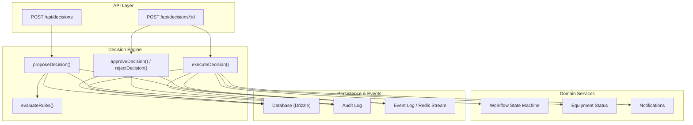
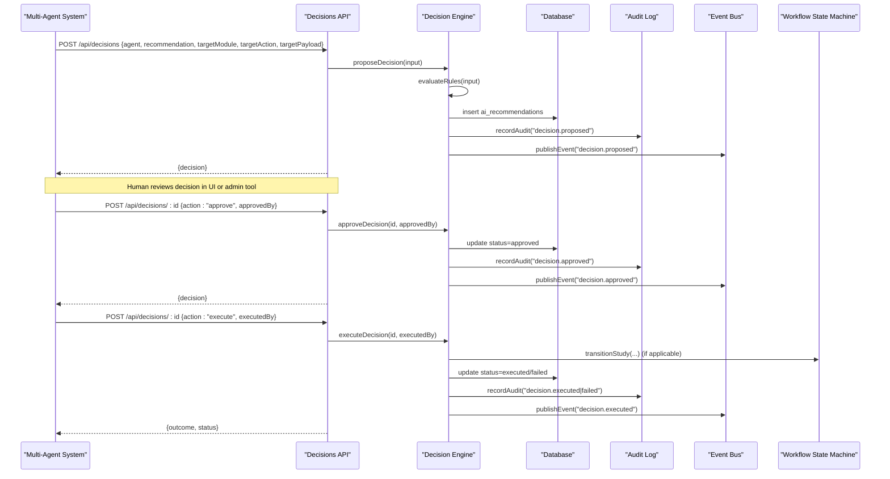
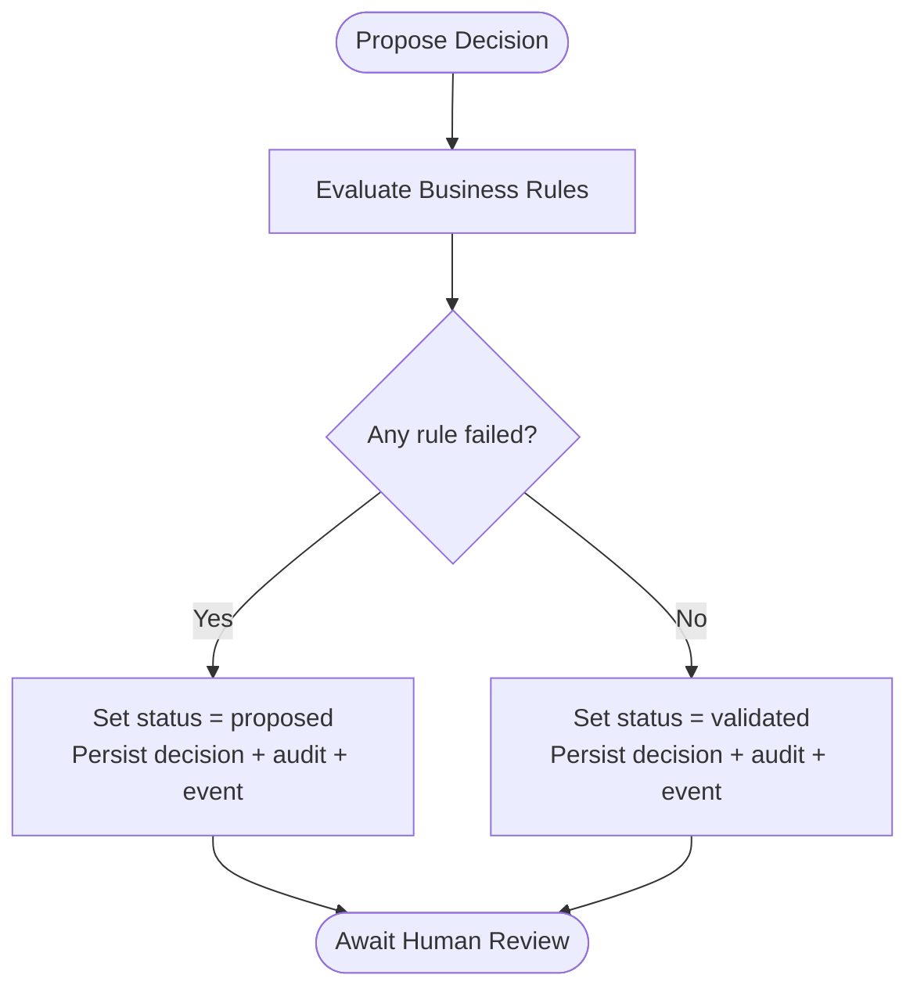
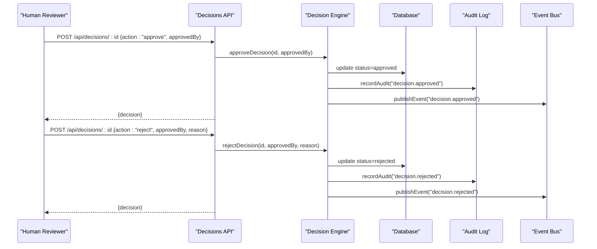
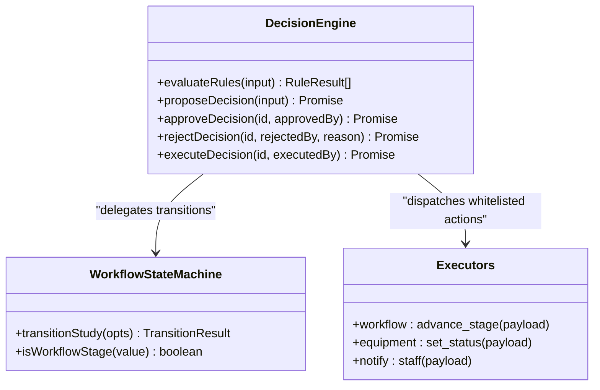
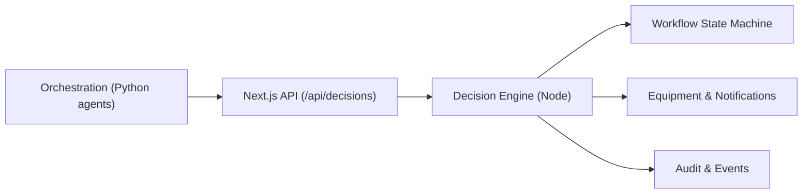
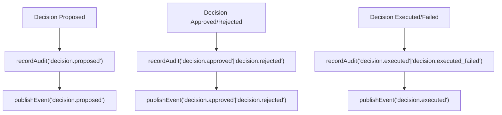
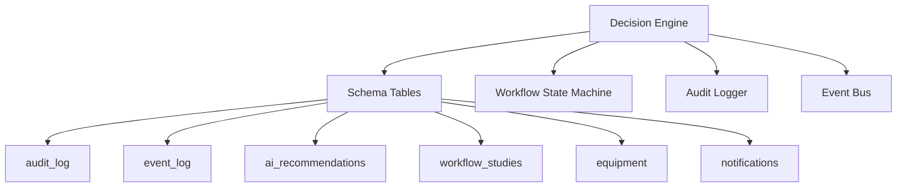
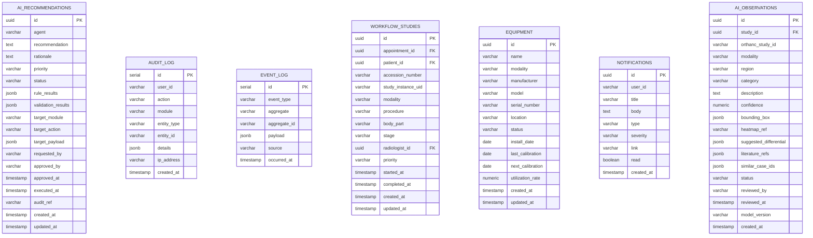

# Decision Engine

<cite>
**Referenced Files in This Document**
- [decision-engine.ts](file://src/lib/decision-engine.ts)
- [audit.ts](file://src/lib/audit.ts)
- [events.ts](file://src/lib/events.ts)
- [workflow.ts](file://src/lib/workflow.ts)
- [schema.ts](file://src/db/schema.ts)
- [route.ts (decisions)](file://src/app/api/decisions/route.ts)
- [route.ts (decisions by id)](file://src/app/api/decisions/[id]/route.ts)
- [ai-review.ts](file://src/lib/ai-review.ts)
- [orchestration.py](file://backend/app/agents/orchestration.py)
- [decision-engine.test.ts](file://__tests__/lib/decision-engine.test.ts)
</cite>

## Table of Contents
1. [Introduction](#introduction)
2. [Project Structure](#project-structure)
3. [Core Components](#core-components)
4. [Architecture Overview](#architecture-overview)
5. [Detailed Component Analysis](#detailed-component-analysis)
6. [Dependency Analysis](#dependency-analysis)
7. [Performance Considerations](#performance-considerations)
8. [Troubleshooting Guide](#troubleshooting-guide)
9. [Conclusion](#conclusion)
10. [Appendices](#appendices)

## Introduction
This document explains the GeraldOS Decision Engine, which enforces a strict pipeline for all AI-driven actions: recommendation → business rules → validation → approval → execution → audit. It ensures that no autonomous AI action executes directly in clinical environments. The engine validates agent recommendations against safety-critical business rules, requires explicit human approval before any change, and records every step in an immutable audit trail with event emissions. It integrates with the multi-agent system to gate agent suggestions through this pipeline and connects to workflow state transitions, scheduling, equipment management, and notifications via whitelisted executors.

## Project Structure
The decision engine is implemented as a server-side library with REST endpoints that expose proposal, approval, rejection, and execution operations. It persists decisions, audits, and events to the database and optionally streams events to Redis.

**Diagram sources**
- [route.ts (decisions):1-39](file://src/app/api/decisions/route.ts#L1-L39)
- [route.ts (decisions by id):1-45](file://src/app/api/decisions/[id]/route.ts#L1-L45)
- [decision-engine.ts:86-235](file://src/lib/decision-engine.ts#L86-L235)
- [workflow.ts:102-234](file://src/lib/workflow.ts#L102-L234)
- [audit.ts:1-25](file://src/lib/audit.ts#L1-L25)
- [events.ts:101-131](file://src/lib/events.ts#L101-L131)

**Section sources**
- [route.ts (decisions):1-39](file://src/app/api/decisions/route.ts#L1-L39)
- [route.ts (decisions by id):1-45](file://src/app/api/decisions/[id]/route.ts#L1-L45)
- [decision-engine.ts:1-245](file://src/lib/decision-engine.ts#L1-L245)

## Core Components
- Business rule evaluation: Enforces safety policies such as preventing autonomous report signing or diagnosis, restricting STAT priority to appropriate contexts, and requiring context for slot reallocation.
- Decision lifecycle: Propose, validate, approve/reject, execute, and record outcomes.
- Whitelisted executors: Only pre-approved module-action pairs can run after approval (e.g., workflow stage transitions, equipment status updates, staff notifications).
- Audit and events: Every step writes an audit entry and publishes domain events for observability and downstream reactions.

Key responsibilities:
- Ensure AI never executes actions directly.
- Provide a human-in-the-loop approval gate.
- Maintain compliance with clinical safety standards.
- Offer extensibility points for new rules and executors.

**Section sources**
- [decision-engine.ts:19-84](file://src/lib/decision-engine.ts#L19-L84)
- [decision-engine.ts:91-130](file://src/lib/decision-engine.ts#L91-L130)
- [decision-engine.ts:142-169](file://src/lib/decision-engine.ts#L142-L169)
- [decision-engine.ts:171-235](file://src/lib/decision-engine.ts#L171-L235)

## Architecture Overview
The decision engine sits between agents and operational systems. Agents propose actions; the engine evaluates rules, persists decisions, and waits for human approval. Approved decisions are executed only through a whitelist of safe actions. All steps emit events and create audit records.

**Diagram sources**
- [route.ts (decisions):17-38](file://src/app/api/decisions/route.ts#L17-L38)
- [route.ts (decisions by id):14-44](file://src/app/api/decisions/[id]/route.ts#L14-L44)
- [decision-engine.ts:91-130](file://src/lib/decision-engine.ts#L91-L130)
- [decision-engine.ts:142-169](file://src/lib/decision-engine.ts#L142-L169)
- [decision-engine.ts:212-235](file://src/lib/decision-engine.ts#L212-L235)
- [workflow.ts:102-234](file://src/lib/workflow.ts#L102-L234)
- [audit.ts:1-25](file://src/lib/audit.ts#L1-L25)
- [events.ts:101-131](file://src/lib/events.ts#L101-L131)

## Detailed Component Analysis

### Business Rule Validation System
The engine evaluates a fixed set of safety rules on every proposed decision. If any rule fails, the decision remains in “proposed” until a human reviewer addresses the issue. Rules include:
- No automatic report finalization by agents.
- No autonomous diagnosis setting.
- STAT priority allowed only in scheduling/workflow contexts.
- Slot reallocation must include equipment or appointment context.

These rules ensure clinical safety by blocking high-risk actions unless explicitly reviewed and approved.

**Diagram sources**
- [decision-engine.ts:45-89](file://src/lib/decision-engine.ts#L45-L89)
- [decision-engine.ts:91-130](file://src/lib/decision-engine.ts#L91-L130)

**Section sources**
- [decision-engine.ts:45-89](file://src/lib/decision-engine.ts#L45-L89)
- [decision-engine.test.ts:58-115](file://__tests__/lib/decision-engine.test.ts#L58-L115)

### Approval Workflows and Human-in-the-Loop
Human approval is mandatory before execution. The API exposes approve and reject actions tied to a specific decision ID. Approving moves the decision to “approved”; rejecting moves it to “rejected.” Both actions are audited and published as events.

**Diagram sources**
- [route.ts (decisions by id):14-44](file://src/app/api/decisions/[id]/route.ts#L14-L44)
- [decision-engine.ts:142-169](file://src/lib/decision-engine.ts#L142-L169)
- [audit.ts:1-25](file://src/lib/audit.ts#L1-L25)
- [events.ts:101-131](file://src/lib/events.ts#L101-L131)

**Section sources**
- [route.ts (decisions by id):14-44](file://src/app/api/decisions/[id]/route.ts#L14-L44)
- [decision-engine.ts:142-169](file://src/lib/decision-engine.ts#L142-L169)

### Safety Mechanisms and Whitelisted Executions
Only whitelisted module-action combinations can execute after approval. Current executors include:
- Workflow stage transitions via the workflow state machine.
- Equipment status updates within allowed values.
- Staff notifications creation.

Executors perform their own validations (e.g., valid stages, allowed statuses) and return outcomes that determine success/failure states.

**Diagram sources**
- [decision-engine.ts:171-235](file://src/lib/decision-engine.ts#L171-L235)
- [workflow.ts:102-234](file://src/lib/workflow.ts#L102-L234)

**Section sources**
- [decision-engine.ts:171-235](file://src/lib/decision-engine.ts#L171-L235)
- [workflow.ts:102-234](file://src/lib/workflow.ts#L102-L234)

### Integration with Multi-Agent System
Agents propose decisions rather than executing them. The backend orchestration layer demonstrates agent roles (inventory, executive, workflow), while the decision engine enforces policy and approval gates. Agents supply structured inputs (agent name, recommendation, rationale, priority, target module/action/payload) to the API, which routes through the decision engine.

**Diagram sources**
- [orchestration.py:69-94](file://backend/app/agents/orchestration.py#L69-L94)
- [route.ts (decisions):17-38](file://src/app/api/decisions/route.ts#L17-L38)
- [decision-engine.ts:91-130](file://src/lib/decision-engine.ts#L91-L130)

**Section sources**
- [orchestration.py:69-94](file://backend/app/agents/orchestration.py#L69-L94)
- [route.ts (decisions):17-38](file://src/app/api/decisions/route.ts#L17-L38)
- [decision-engine.ts:91-130](file://src/lib/decision-engine.ts#L91-L130)

### Audit Trail Generation and Compliance Checking
Every decision lifecycle step creates an immutable audit record and emits an event. The audit log captures user identity, action type, module, entity references, and details. Events persist to both Redis Streams (when available) and the event_log table, ensuring durability even if Redis is down.

**Diagram sources**
- [decision-engine.ts:114-127](file://src/lib/decision-engine.ts#L114-L127)
- [decision-engine.ts:152-153](file://src/lib/decision-engine.ts#L152-L153)
- [decision-engine.ts:166-167](file://src/lib/decision-engine.ts#L166-L167)
- [decision-engine.ts:228-229](file://src/lib/decision-engine.ts#L228-L229)
- [audit.ts:1-25](file://src/lib/audit.ts#L1-L25)
- [events.ts:101-131](file://src/lib/events.ts#L101-L131)

**Section sources**
- [audit.ts:1-25](file://src/lib/audit.ts#L1-L25)
- [events.ts:101-131](file://src/lib/events.ts#L101-L131)
- [decision-engine.ts:114-127](file://src/lib/decision-engine.ts#L114-L127)
- [decision-engine.ts:152-153](file://src/lib/decision-engine.ts#L152-L153)
- [decision-engine.ts:166-167](file://src/lib/decision-engine.ts#L166-L167)
- [decision-engine.ts:228-229](file://src/lib/decision-engine.ts#L228-L229)

### Example Decision Scenarios

#### Patient Registration Validation
- Scenario: An agent proposes creating or updating patient data.
- Flow: Proposal triggers rule evaluation (e.g., required fields, consent flags), persists decision, awaits human approval, then executes registration logic via a whitelisted executor or workflow transition.
- Safety: Ensures patient data changes are reviewed and audited; prevents autonomous modifications to sensitive records.

#### Scheduling Conflicts Resolution
- Scenario: An agent suggests reallocating slots due to equipment downtime or urgent cases.
- Flow: Proposal includes target payload with equipmentId or appointmentIds; rule “reallocation_requires_equipment_context” validates context; upon approval, executor may adjust schedules and notify staff.
- Safety: Requires explicit context and approval; logs all changes.

#### Report Quality Assurance
- Scenario: AI review assistant surfaces candidate observations and technical quality checks.
- Flow: Observations remain candidates; radiologist accepts/rejects; any automated reporting actions require human sign-off per “no_auto_finalise_reports” rule.
- Safety: Prevents autonomous diagnosis or report finalization; maintains radiologist oversight.

[No sources needed since these scenarios synthesize existing components without quoting code]

### Extending the Decision Engine
To add new business rules:
- Add a rule object to the RULES array with a check function returning RuleResult.
- Ensure tests cover pass/fail conditions.

To add new executors:
- Add a keyed executor in EXECUTORS mapping module-action to a function that performs safe, validated work.
- Include input validation, error handling, and outcome reporting.
- Ensure audit and event emission occur on success/failure.

Guidelines:
- Keep executors idempotent where possible.
- Validate inputs strictly.
- Always record audit and publish events.
- Avoid direct side effects outside whitelisted executors.

**Section sources**
- [decision-engine.ts:45-84](file://src/lib/decision-engine.ts#L45-L84)
- [decision-engine.ts:171-235](file://src/lib/decision-engine.ts#L171-L235)
- [decision-engine.test.ts:58-115](file://__tests__/lib/decision-engine.test.ts#L58-L115)

## Dependency Analysis
The decision engine depends on:
- Database schema for ai_recommendations, audit_log, event_log, workflow studies, equipment, notifications.
- Workflow state machine for study transitions.
- Audit logger for immutable records.
- Event bus for durable event persistence and optional Redis streaming.

**Diagram sources**
- [schema.ts:182-468](file://src/db/schema.ts#L182-L468)
- [decision-engine.ts:13-17](file://src/lib/decision-engine.ts#L13-L17)
- [workflow.ts:23-27](file://src/lib/workflow.ts#L23-L27)
- [audit.ts:1-25](file://src/lib/audit.ts#L1-L25)
- [events.ts:10-13](file://src/lib/events.ts#L10-L13)

**Section sources**
- [schema.ts:182-468](file://src/db/schema.ts#L182-L468)
- [decision-engine.ts:13-17](file://src/lib/decision-engine.ts#L13-L17)
- [workflow.ts:23-27](file://src/lib/workflow.ts#L23-L27)
- [audit.ts:1-25](file://src/lib/audit.ts#L1-L25)
- [events.ts:10-13](file://src/lib/events.ts#L10-L13)

## Performance Considerations
- Rule evaluation is lightweight and synchronous; keep rules simple and deterministic.
- Database writes are minimal per decision step; batch operations are not used here but could be considered for high-volume scenarios.
- Event publishing is best-effort to Redis; failures do not block core flows and are persisted to event_log for durability.
- Executor functions should be efficient and avoid long-running tasks; consider offloading heavy work to background jobs if needed.

[No sources needed since this section provides general guidance]

## Troubleshooting Guide
Common issues and resolutions:
- Decision not found: Ensure the decision ID exists and is accessible; verify database connectivity.
- Invalid workflow stage: Check stage names against the canonical list; use provided helpers to validate stages.
- Missing required fields: Validate request payloads at the API layer; ensure targetPayload contains necessary identifiers.
- Redis unavailability: Events still persist to event_log; monitor event counts and reconcile later if needed.
- Audit write failures: Audit logging catches errors; investigate database write permissions and disk space.

**Section sources**
- [route.ts (decisions by id):14-44](file://src/app/api/decisions/[id]/route.ts#L14-L44)
- [workflow.ts:102-165](file://src/lib/workflow.ts#L102-L165)
- [events.ts:101-131](file://src/lib/events.ts#L101-L131)
- [audit.ts:1-25](file://src/lib/audit.ts#L1-L25)

## Conclusion
The GeraldOS Decision Engine enforces a robust, compliant pipeline for all AI-driven actions in clinical environments. By separating recommendation from execution, enforcing business rules, requiring human approval, and recording comprehensive audit trails, it ensures safety and accountability. The modular design allows extension with new rules and executors while maintaining clinical safety standards.

[No sources needed since this section summarizes without analyzing specific files]

## Appendices

### Data Model Overview

**Diagram sources**
- [schema.ts:182-468](file://src/db/schema.ts#L182-L468)

[No additional sources needed since this diagram maps schema definitions]