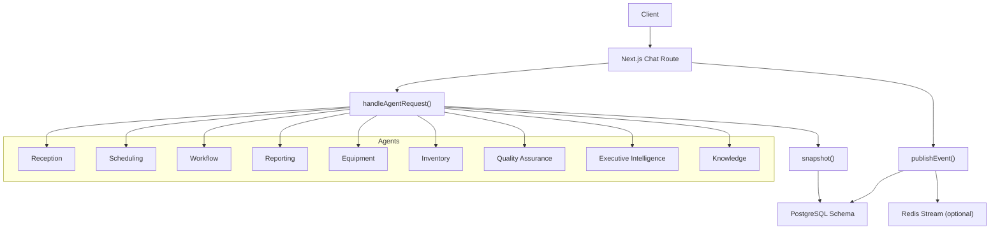
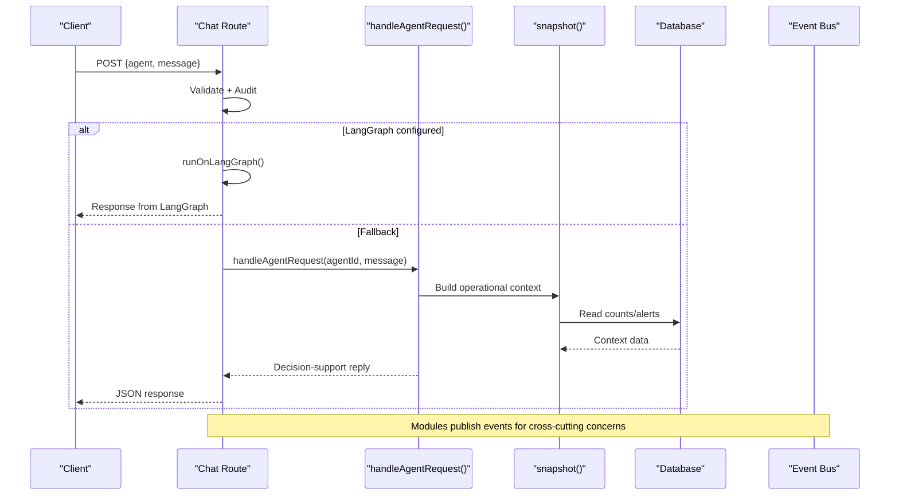
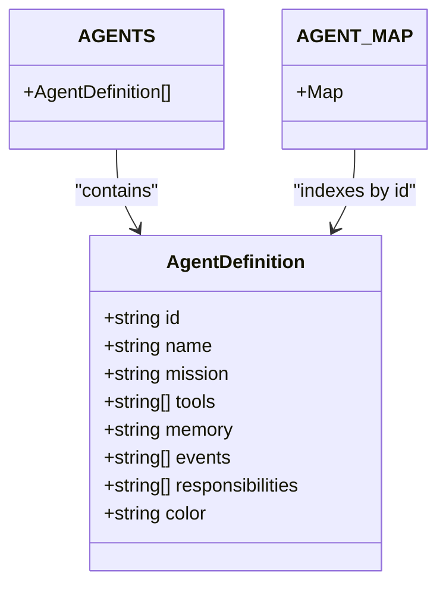
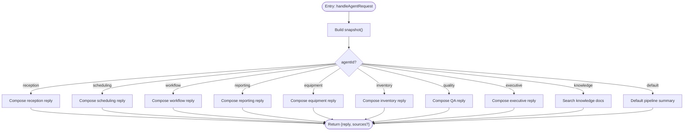
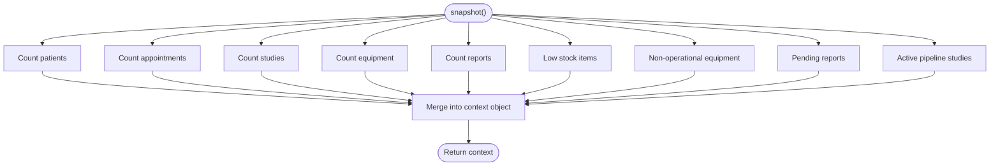
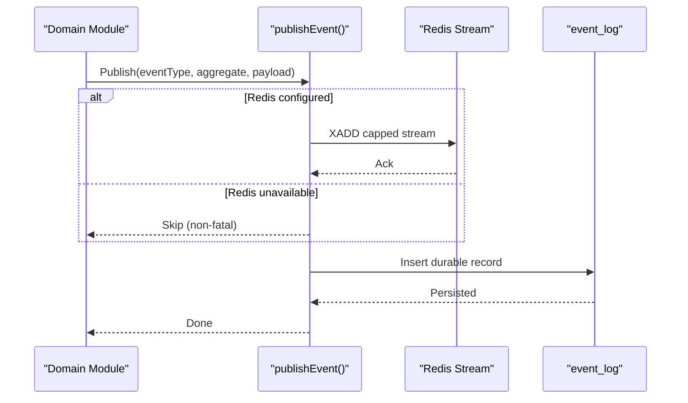
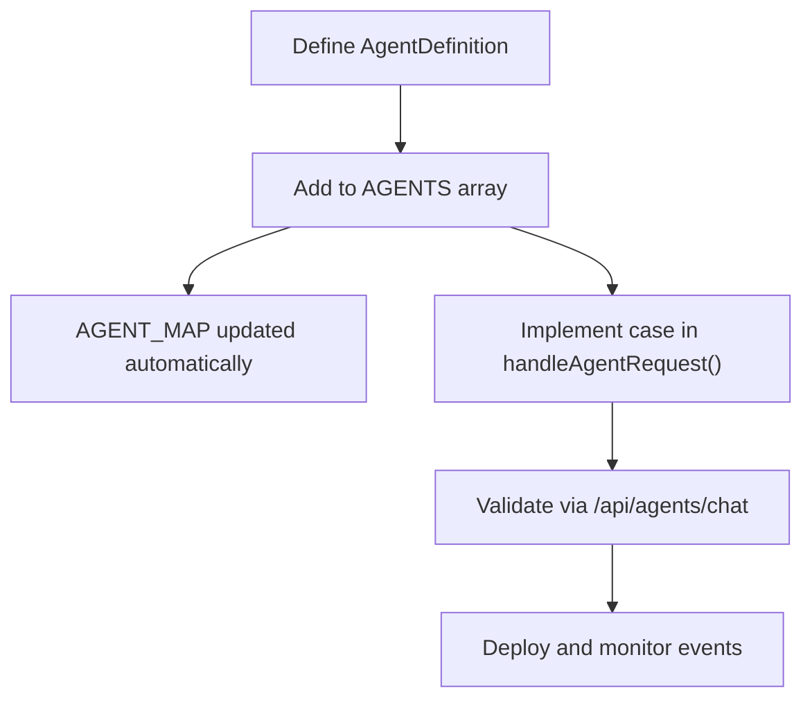
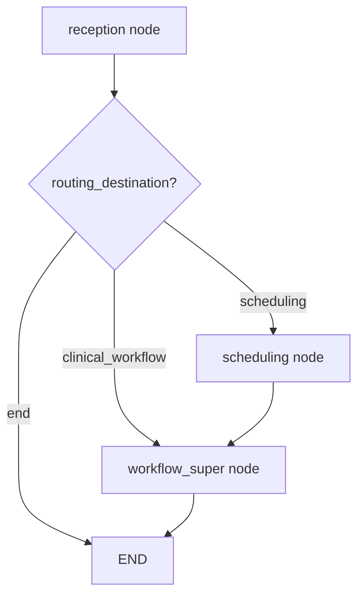
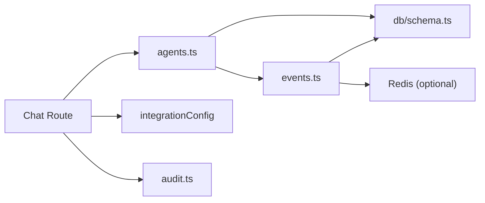
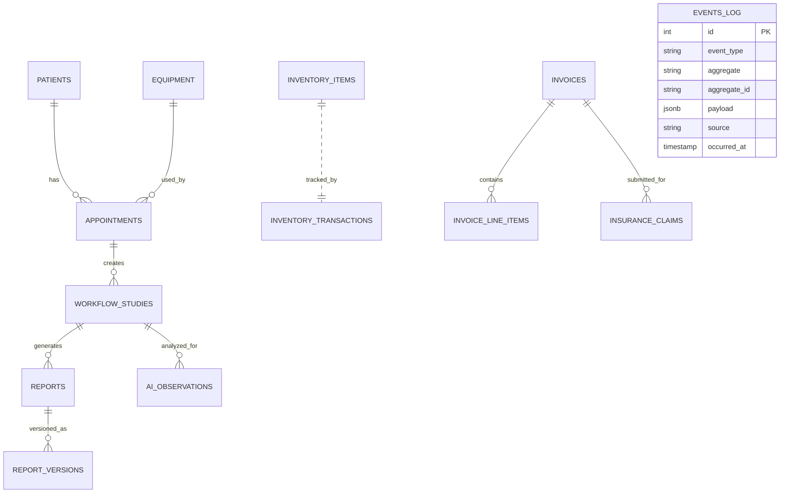

# Agent Architecture & Framework

<cite>
**Referenced Files in This Document**
- [agents.ts](file://src/lib/agents.ts)
- [events.ts](file://src/lib/events.ts)
- [route.ts](file://src/app/api/agents/chat/route.ts)
- [schema.ts](file://src/db/schema.ts)
- [orchestration.py](file://backend/app/agents/orchestration.py)
</cite>

## Table of Contents
1. [Introduction](#introduction)
2. [Project Structure](#project-structure)
3. [Core Components](#core-components)
4. [Architecture Overview](#architecture-overview)
5. [Detailed Component Analysis](#detailed-component-analysis)
6. [Dependency Analysis](#dependency-analysis)
7. [Performance Considerations](#performance-considerations)
8. [Troubleshooting Guide](#troubleshooting-guide)
9. [Conclusion](#conclusion)
10. [Appendices](#appendices)

## Introduction
This document explains the GeraldOS multi-agent architecture framework. It covers:
- The AgentDefinition interface and its properties (id, name, mission, tools, memory, events, responsibilities, color).
- The agent dispatch mechanism in handleAgentRequest() that routes messages to appropriate agents based on context.
- The shared operational context provided by snapshot(), which exposes real-time data about patients, appointments, studies, equipment, reports, inventory levels, and workflow status.
- How agents communicate indirectly through events and shared database state rather than direct coupling.
- The event-driven communication pattern where agents subscribe to specific events such as patient.registered, appointment.created, study.uploaded, etc.
- How to add new agents by extending the AGENTS array and implementing their logic in the switch statement within handleAgentRequest().

## Project Structure
GeraldOS organizes agent-related logic across several layers:
- API layer: Next.js route for agent chat interactions.
- Agent core: Agent definitions, dispatching, and live-data snapshot.
- Event bus: Centralized event publishing and persistence.
- Database schema: Shared tables used by agents to read/write operational state.
- Optional orchestration: LangGraph-based workflow for advanced routing when configured.

**Diagram sources**
- [route.ts:40-84](file://src/app/api/agents/chat/route.ts#L40-L84)
- [agents.ts:216-373](file://src/lib/agents.ts#L216-L373)
- [events.ts:101-131](file://src/lib/events.ts#L101-L131)
- [schema.ts:17-468](file://src/db/schema.ts#L17-L468)

**Section sources**
- [route.ts:40-84](file://src/app/api/agents/chat/route.ts#L40-L84)
- [agents.ts:216-373](file://src/lib/agents.ts#L216-L373)
- [events.ts:101-131](file://src/lib/events.ts#L101-L131)
- [schema.ts:17-468](file://src/db/schema.ts#L17-L468)

## Core Components
- AgentDefinition interface defines each agent’s identity and behavior contract: id, name, mission, tools, memory, events, responsibilities, color.
- AGENTS array enumerates all operational agents with their missions, tool sets, memory scope, subscribed events, and responsibilities.
- handleAgentRequest(agentId, message, ctx) is the central dispatcher that:
  - Builds a rich operational snapshot via snapshot().
  - Routes the request to the correct agent using a switch on agentId.
  - Returns decision-support text; no direct state changes are executed here.
- snapshot() queries multiple tables to provide current counts and alerts:
  - Patients, appointments, studies, equipment, reports.
  - Low stock items and non-operational equipment.
  - Pending reports and active pipeline studies.
- Event bus (events.ts) provides publishEvent() to emit domain events to Redis Streams (when available) and persist them to event_log for durability.
- API route (route.ts) validates input, records audit, optionally runs LangGraph, and falls back to local agent handling.

**Section sources**
- [agents.ts:25-39](file://src/lib/agents.ts#L25-L39)
- [agents.ts:41-177](file://src/lib/agents.ts#L41-L177)
- [agents.ts:186-210](file://src/lib/agents.ts#L186-L210)
- [agents.ts:216-373](file://src/lib/agents.ts#L216-L373)
- [events.ts:18-60](file://src/lib/events.ts#L18-L60)
- [events.ts:101-131](file://src/lib/events.ts#L101-L131)
- [route.ts:40-84](file://src/app/api/agents/chat/route.ts#L40-L84)

## Architecture Overview
The system uses an event-driven, loosely coupled design:
- Agents do not call each other directly. Instead, they react to events and observe shared database state.
- The API route accepts user requests, dispatches to the appropriate agent, and returns decision support responses.
- When configured, requests can be routed to LangGraph for advanced orchestration; otherwise, the local handler processes them.
- All significant actions publish events, ensuring auditability and decoupled reactions.

**Diagram sources**
- [route.ts:9-37](file://src/app/api/agents/chat/route.ts#L9-L37)
- [route.ts:40-84](file://src/app/api/agents/chat/route.ts#L40-L84)
- [agents.ts:186-210](file://src/lib/agents.ts#L186-L210)
- [agents.ts:216-373](file://src/lib/agents.ts#L216-L373)
- [events.ts:101-131](file://src/lib/events.ts#L101-L131)

## Detailed Component Analysis

### AgentDefinition Interface and Agent Registry
- AgentDefinition specifies:
  - id: Unique identifier used for routing.
  - name: Human-readable label.
  - mission: Purpose statement guiding agent behavior.
  - tools: Capabilities or subsystems the agent interacts with.
  - memory: Scope of persistent or contextual data relevant to the agent.
  - events: List of event types the agent reacts to.
  - responsibilities: Explicit duties and constraints.
  - color: UI-friendly color tag for visualization.
- AGENTS array registers nine specialized agents: reception, scheduling, workflow, reporting, equipment, inventory, quality assurance, executive intelligence, knowledge.
- AGENT_MAP provides O(1) lookup by agent id for validation and routing.

**Diagram sources**
- [agents.ts:25-39](file://src/lib/agents.ts#L25-L39)
- [agents.ts:41-177](file://src/lib/agents.ts#L41-L177)
- [agents.ts:179-179](file://src/lib/agents.ts#L179-L179)

**Section sources**
- [agents.ts:25-39](file://src/lib/agents.ts#L25-L39)
- [agents.ts:41-177](file://src/lib/agents.ts#L41-L177)
- [agents.ts:179-179](file://src/lib/agents.ts#L179-L179)

### Agent Dispatch Mechanism: handleAgentRequest()
- Receives agentId and message, builds operational context via snapshot().
- Uses a switch statement to route to the correct agent implementation.
- Each case composes a decision-support reply grounded in current database state.
- No direct writes occur here; all state changes funnel through the decision engine and event bus.

**Diagram sources**
- [agents.ts:216-373](file://src/lib/agents.ts#L216-L373)

**Section sources**
- [agents.ts:216-373](file://src/lib/agents.ts#L216-L373)

### Shared Operational Context: snapshot()
- Reads counts and statuses from key tables:
  - patients, appointments, workflowStudies, equipment, reports.
  - Filters low-stock inventory items and non-operational equipment.
  - Counts pending reports and active pipeline studies.
- Provides a unified view of operational health for agents to base decisions on.

**Diagram sources**
- [agents.ts:186-210](file://src/lib/agents.ts#L186-L210)

**Section sources**
- [agents.ts:186-210](file://src/lib/agents.ts#L186-L210)

### Event-Driven Communication Pattern
- EVENT_TYPES centralizes all domain events (e.g., patient.registered, appointment.created, study.uploaded, report.signed, equipment.offline, inventory.low_stock).
- publishEvent() writes to Redis Streams when available and always persists to event_log for durability.
- Agents declare events they react to in their AgentDefinition.events arrays, enabling indirect communication without direct calls.
- The event log supports activity feeds and auditing.

**Diagram sources**
- [events.ts:18-60](file://src/lib/events.ts#L18-L60)
- [events.ts:101-131](file://src/lib/events.ts#L101-L131)
- [schema.ts:446-455](file://src/db/schema.ts#L446-L455)

**Section sources**
- [events.ts:18-60](file://src/lib/events.ts#L18-L60)
- [events.ts:101-131](file://src/lib/events.ts#L101-L131)
- [schema.ts:446-455](file://src/db/schema.ts#L446-L455)

### Adding New Agents
To add a new agent:
- Extend the AGENTS array with a new AgentDefinition entry including id, name, mission, tools, memory, events, responsibilities, and color.
- Implement the agent-specific logic inside handleAgentRequest() by adding a new case in the switch statement.
- Optionally, integrate with the event bus by publishing or subscribing to relevant events defined in EVENT_TYPES.
- Ensure any required database reads/writes use the existing schema tables or extend schema if necessary.

**Diagram sources**
- [agents.ts:41-177](file://src/lib/agents.ts#L41-L177)
- [agents.ts:179-179](file://src/lib/agents.ts#L179-L179)
- [agents.ts:216-373](file://src/lib/agents.ts#L216-L373)

**Section sources**
- [agents.ts:41-177](file://src/lib/agents.ts#L41-L177)
- [agents.ts:179-179](file://src/lib/agents.ts#L179-L179)
- [agents.ts:216-373](file://src/lib/agents.ts#L216-L373)

### Optional Orchestration: LangGraph Integration
- When LangGraph is configured, the chat route attempts to run the request through LangGraph before falling back to the local handler.
- The backend orchestration module defines nodes for reception, scheduling, equipment, inventory, executive, and workflow agents, with conditional routing.

**Diagram sources**
- [orchestration.py:19-94](file://backend/app/agents/orchestration.py#L19-L94)
- [orchestration.py:100-133](file://backend/app/agents/orchestration.py#L100-L133)

**Section sources**
- [orchestration.py:19-94](file://backend/app/agents/orchestration.py#L19-L94)
- [orchestration.py:100-133](file://backend/app/agents/orchestration.py#L100-L133)

## Dependency Analysis
- API route depends on:
  - Agent registry and dispatcher (agents.ts).
  - Integration configuration for optional LangGraph.
  - Audit logging for compliance.
- Agents depend on:
  - Database schema for reading/writing operational state.
  - Event bus for publishing domain events.
- Event bus depends on:
  - Integration configuration for Redis.
  - Database schema for durable event_log entries.

**Diagram sources**
- [route.ts:1-84](file://src/app/api/agents/chat/route.ts#L1-L84)
- [agents.ts:10-23](file://src/lib/agents.ts#L10-L23)
- [events.ts:10-13](file://src/lib/events.ts#L10-L13)
- [schema.ts:17-468](file://src/db/schema.ts#L17-L468)

**Section sources**
- [route.ts:1-84](file://src/app/api/agents/chat/route.ts#L1-L84)
- [agents.ts:10-23](file://src/lib/agents.ts#L10-L23)
- [events.ts:10-13](file://src/lib/events.ts#L10-L13)
- [schema.ts:17-468](file://src/db/schema.ts#L17-L468)

## Performance Considerations
- snapshot() performs multiple database queries per request; consider caching or batching if latency becomes critical.
- Event publishing to Redis is best-effort; ensure event_log writes remain robust under load.
- LangGraph integration adds network overhead; fallback ensures availability but may reduce responsiveness.
- Knowledge agent searches use ILIKE patterns; ensure proper indexing on title, summary, content, and tags for performance.

[No sources needed since this section provides general guidance]

## Troubleshooting Guide
- Unknown agent error:
  - Occurs when agentId is not present in AGENT_MAP.
  - Resolution: Ensure agentId matches a registered agent in AGENTS.
- Empty or invalid JSON:
  - API returns 400 if request body is malformed.
  - Resolution: Validate client payloads before sending.
- LangGraph failures:
  - If thread creation or run fails, the route falls back to local handling.
  - Check integration configuration and service availability.
- Event bus issues:
  - Redis unavailability does not block event persistence to event_log.
  - Monitor event_log for completeness and investigate Redis connectivity if streams are expected.

**Section sources**
- [route.ts:40-84](file://src/app/api/agents/chat/route.ts#L40-L84)
- [events.ts:72-99](file://src/lib/events.ts#L72-L99)
- [events.ts:101-131](file://src/lib/events.ts#L101-L131)

## Conclusion
GeraldOS implements a robust, event-driven multi-agent framework where agents operate independently and communicate indirectly through shared database state and events. The AgentDefinition interface standardizes agent metadata, while handleAgentRequest() provides centralized dispatching backed by a rich operational snapshot. The event bus ensures decoupling and auditability, and the optional LangGraph integration enables advanced orchestration when available. Extending the system involves registering new agents and implementing their logic in the dispatcher, adhering to the established patterns for safety and clarity.

[No sources needed since this section summarizes without analyzing specific files]

## Appendices

### Key Data Models Used by Agents
- Patients, Appointments, Workflow Studies, Equipment, Reports, Inventory Items, Invoices, Insurance Claims, Knowledge Documents, AI Observations, Event Log, Notifications.

**Diagram sources**
- [schema.ts:17-468](file://src/db/schema.ts#L17-L468)

[No additional sources needed beyond diagram mapping]