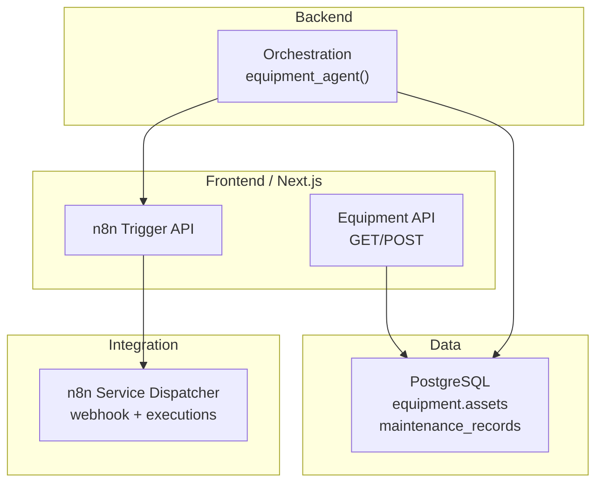
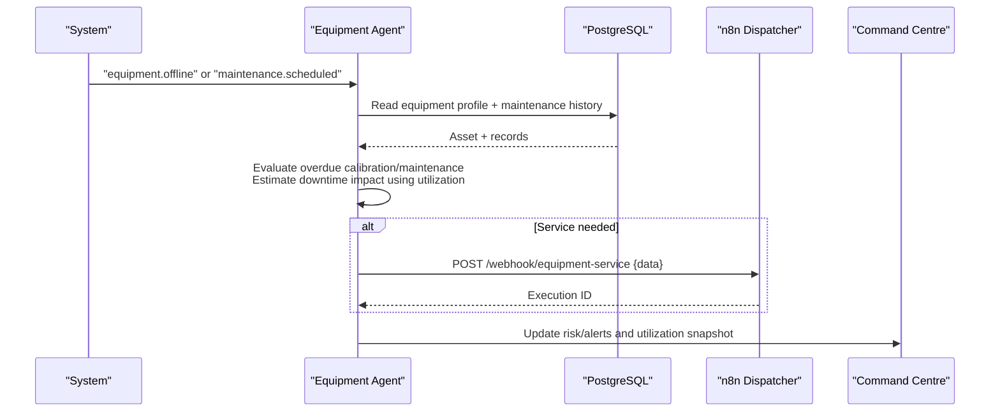
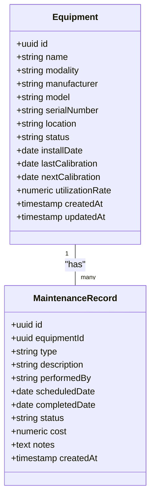
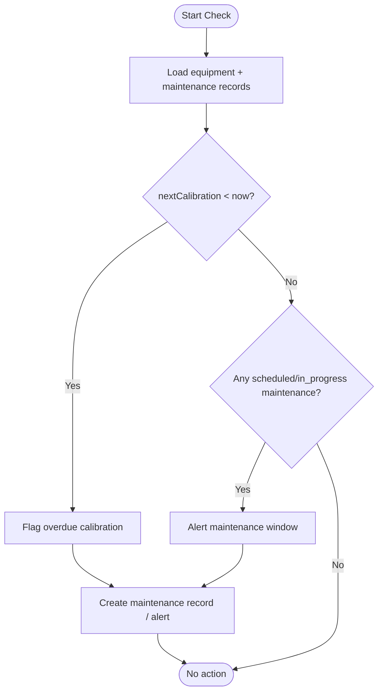
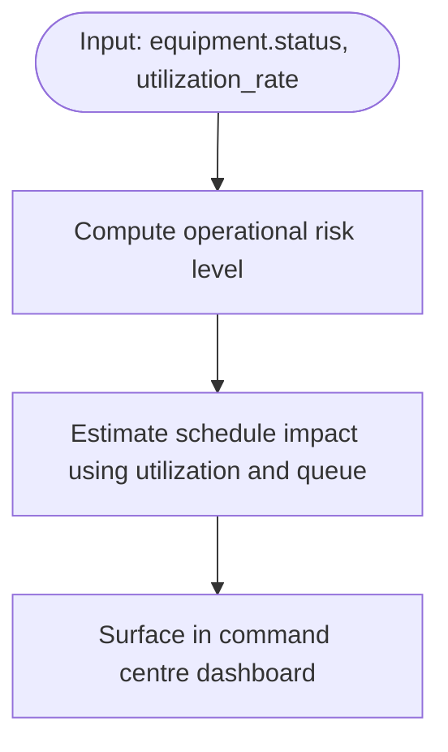
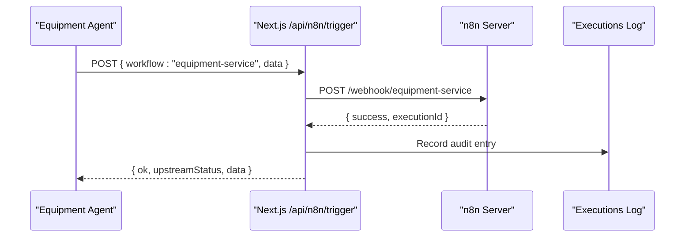
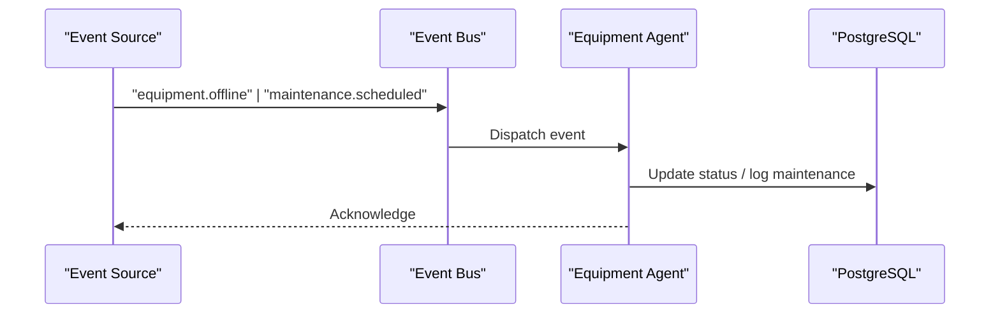
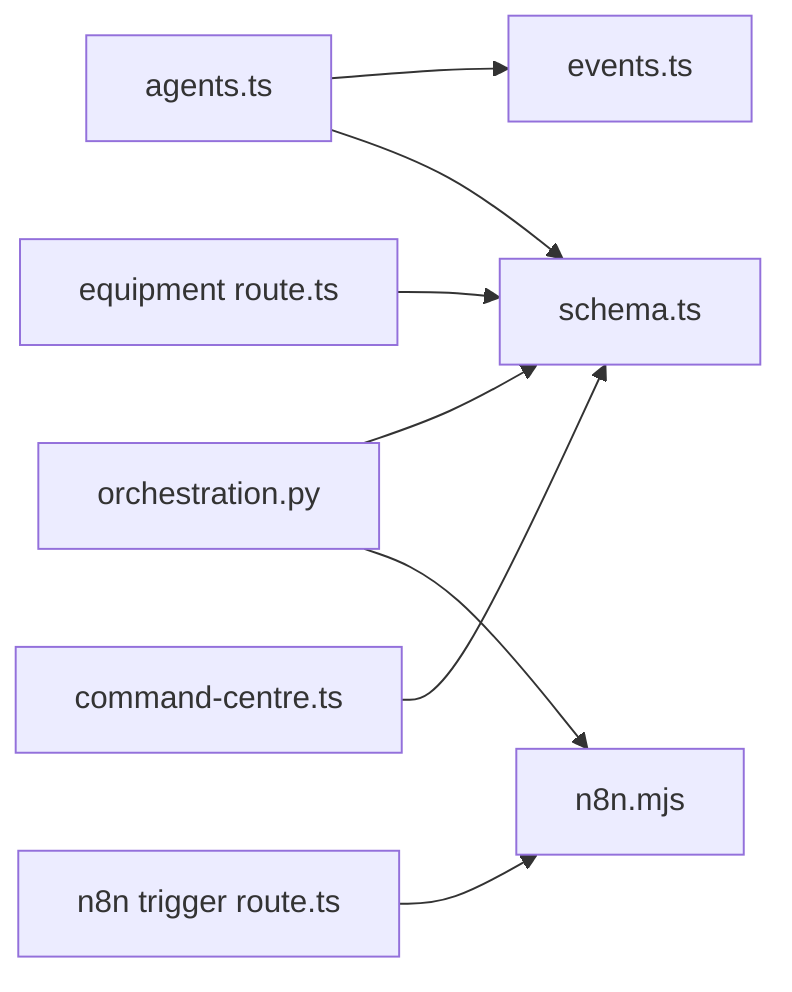

# Equipment Agent

<cite>
**Referenced Files in This Document**
- [agents.ts](file://src/lib/agents.ts)
- [events.ts](file://src/lib/events.ts)
- [schema.ts](file://src/db/schema.ts)
- [route.ts (equipment)](file://src/app/api/equipment/route.ts)
- [init-schemas.sql](file://docker/postgres/init-schemas.sql)
- [main.py](file://backend/app/main.py)
- [orchestration.py](file://backend/app/agents/orchestration.py)
- [n8n.mjs](file://services/n8n.mjs)
- [route.ts (n8n trigger)](file://src/app/api/n8n/trigger/route.ts)
- [command-centre.ts](file://src/lib/command-centre.ts)
</cite>

## Table of Contents
1. Introduction
2. Project Structure
3. Core Components
4. Architecture Overview
5. Detailed Component Analysis
6. Dependency Analysis
7. Performance Considerations
8. Troubleshooting Guide
9. Conclusion

## Introduction
The Equipment Agent is an autonomous agent designed to maximize fleet uptime through proactive health monitoring. It uses a defined tool set, maintains memory of calibration and maintenance history plus utilization rates, subscribes to key equipment events, and executes four core responsibilities: flagging overdue calibration/maintenance windows, estimating downtime impact on schedules, dispatching service requests via n8n, and tracking equipment lifecycle and utilization.

## Project Structure
The Equipment Agent spans multiple layers:
- Agent definition and event subscriptions are declared in the agents registry and event constants.
- Data persistence for equipment assets and maintenance records is modeled in the database schema and SQL initialization scripts.
- API endpoints expose equipment CRUD operations and integrate with n8n for workflow automation.
- Backend orchestration includes an equipment agent function that coordinates checks and logs.
- The command centre aggregates operational metrics including machine utilization and maintenance alerts.

**Diagram sources**
- [route.ts (equipment):6-23](file://src/app/api/equipment/route.ts#L6-L23)
- [route.ts (n8n trigger):1-46](file://src/app/api/n8n/trigger/route.ts#L1-L46)
- [orchestration.py:60-67](file://backend/app/agents/orchestration.py#L60-L67)
- [schema.ts:53-68](file://src/db/schema.ts#L53-L68)
- [schema.ts:122-134](file://src/db/schema.ts#L122-L134)
- [init-schemas.sql:76-98](file://docker/postgres/init-schemas.sql#L76-L98)
- [n8n.mjs:20-41](file://services/n8n.mjs#L20-L41)

**Section sources**
- [agents.ts:102-116](file://src/lib/agents.ts#L102-L116)
- [events.ts:55-57](file://src/lib/events.ts#L55-L57)
- [schema.ts:53-68](file://src/db/schema.ts#L53-L68)
- [schema.ts:122-134](file://src/db/schema.ts#L122-L134)
- [init-schemas.sql:76-98](file://docker/postgres/init-schemas.sql#L76-L98)
- [route.ts (equipment):6-23](file://src/app/api/equipment/route.ts#L6-L23)
- [route.ts (n8n trigger):1-46](file://src/app/api/n8n/trigger/route.ts#L1-L46)
- [orchestration.py:60-67](file://backend/app/agents/orchestration.py#L60-L67)
- [n8n.mjs:20-41](file://services/n8n.mjs#L20-L41)

## Core Components
- Equipment registry: Centralized model of devices with identity, modality, location, status, install date, calibration dates, and utilization rate.
- Calibration tracker: Tracks last and next calibration dates; used to detect overdue windows.
- Service dispatcher (n8n): Sends automated service requests to vendor workflows via webhook endpoints.
- Downtime impact model: Uses schedule and utilization data to estimate how equipment downtime affects patient flow and throughput.

Memory scope:
- Calibration and maintenance history: persisted in maintenance records and reflected in equipment profiles.
- Utilization rates: stored per equipment and surfaced in operational dashboards.

Event subscriptions:
- equipment.online
- equipment.offline
- maintenance.scheduled

Responsibilities:
- Flag overdue calibration and maintenance windows
- Estimate downtime impact on the schedule
- Dispatch service requests through n8n
- Track equipment lifecycle and utilization

**Section sources**
- [agents.ts:102-116](file://src/lib/agents.ts#L102-L116)
- [events.ts:55-57](file://src/lib/events.ts#L55-L57)
- [schema.ts:53-68](file://src/db/schema.ts#L53-L68)
- [schema.ts:122-134](file://src/db/schema.ts#L122-L134)

## Architecture Overview
The Equipment Agent orchestrates monitoring and actions across data, APIs, and external automation:
- Inbound events (online/offline/scheduled) drive state changes and triggers.
- The agent evaluates calibration and maintenance due dates against current time and utilization to prioritize actions.
- When service is required, it calls the n8n trigger endpoint to start vendor workflows.
- Operational dashboards consume aggregated metrics to visualize risks and utilization.

**Diagram sources**
- [events.ts:55-57](file://src/lib/events.ts#L55-L57)
- [schema.ts:53-68](file://src/db/schema.ts#L53-L68)
- [schema.ts:122-134](file://src/db/schema.ts#L122-L134)
- [route.ts (n8n trigger):1-46](file://src/app/api/n8n/trigger/route.ts#L1-L46)
- [n8n.mjs:20-41](file://services/n8n.mjs#L20-L41)
- [command-centre.ts:154-172](file://src/lib/command-centre.ts#L154-L172)

## Detailed Component Analysis

### Equipment Registry and Lifecycle Tracking
- The equipment table stores asset identity, modality, manufacturer/model, serial number, location, status, install date, calibration dates, and utilization rate.
- The backend also exposes a legacy endpoint to create equipment entries into a separate schema namespace.
- Lifecycle tracking is supported by status transitions and maintenance records.

**Diagram sources**
- [schema.ts:53-68](file://src/db/schema.ts#L53-L68)
- [schema.ts:122-134](file://src/db/schema.ts#L122-L134)

**Section sources**
- [schema.ts:53-68](file://src/db/schema.ts#L53-L68)
- [schema.ts:122-134](file://src/db/schema.ts#L122-L134)
- [init-schemas.sql:76-98](file://docker/postgres/init-schemas.sql#L76-L98)
- [main.py:202-227](file://backend/app/main.py#L202-L227)

### Calibration Tracker and Overdue Detection
- Calibration windows are derived from last and next calibration dates.
- The agent flags overdue calibration when next calibration is before the current date/time.
- Maintenance records provide historical context and completion status.

**Diagram sources**
- [schema.ts:53-68](file://src/db/schema.ts#L53-L68)
- [schema.ts:122-134](file://src/db/schema.ts#L122-L134)

**Section sources**
- [schema.ts:53-68](file://src/db/schema.ts#L53-L68)
- [schema.ts:122-134](file://src/db/schema.ts#L122-L134)

### Downtime Impact Model
- Uses equipment status and utilization_rate to estimate schedule impact.
- Command centre aggregates machine utilization and surfaces operational risks when equipment is offline or in maintenance.
- Appointment delays and queue counts help quantify downstream effects.

**Diagram sources**
- [command-centre.ts:154-172](file://src/lib/command-centre.ts#L154-L172)
- [schema.ts:53-68](file://src/db/schema.ts#L53-L68)

**Section sources**
- [command-centre.ts:154-172](file://src/lib/command-centre.ts#L154-L172)
- [schema.ts:53-68](file://src/db/schema.ts#L53-L68)

### Service Dispatcher (n8n Integration)
- The platform exposes a secure trigger endpoint that forwards payloads to configured n8n webhooks.
- The local n8n mock server seeds an equipment-service workflow and records executions.
- Audit logging captures upstream responses and workflow names.

**Diagram sources**
- [route.ts (n8n trigger):1-46](file://src/app/api/n8n/trigger/route.ts#L1-L46)
- [n8n.mjs:20-41](file://services/n8n.mjs#L20-L41)

**Section sources**
- [route.ts (n8n trigger):1-46](file://src/app/api/n8n/trigger/route.ts#L1-L46)
- [n8n.mjs:20-41](file://services/n8n.mjs#L20-L41)

### Event Subscriptions and Orchestration
- Events for equipment online/offline and maintenance scheduling are defined as constants and consumed by the system.
- The backend orchestration layer includes an equipment_agent function that logs activity and can be extended to coordinate checks and dispatches.

**Diagram sources**
- [events.ts:55-57](file://src/lib/events.ts#L55-L57)
- [orchestration.py:60-67](file://backend/app/agents/orchestration.py#L60-L67)

**Section sources**
- [events.ts:55-57](file://src/lib/events.ts#L55-L57)
- [orchestration.py:60-67](file://backend/app/agents/orchestration.py#L60-L67)

## Dependency Analysis
- The Equipment Agent depends on:
  - Database schemas for equipment and maintenance records
  - API endpoints for equipment management and n8n integration
  - Event constants for subscription handling
  - Command centre for operational visibility

**Diagram sources**
- [agents.ts:102-116](file://src/lib/agents.ts#L102-L116)
- [events.ts:55-57](file://src/lib/events.ts#L55-L57)
- [schema.ts:53-68](file://src/db/schema.ts#L53-L68)
- [schema.ts:122-134](file://src/db/schema.ts#L122-L134)
- [route.ts (equipment):6-23](file://src/app/api/equipment/route.ts#L6-L23)
- [route.ts (n8n trigger):1-46](file://src/app/api/n8n/trigger/route.ts#L1-L46)
- [n8n.mjs:20-41](file://services/n8n.mjs#L20-L41)
- [command-centre.ts:154-172](file://src/lib/command-centre.ts#L154-L172)

**Section sources**
- [agents.ts:102-116](file://src/lib/agents.ts#L102-L116)
- [events.ts:55-57](file://src/lib/events.ts#L55-L57)
- [schema.ts:53-68](file://src/db/schema.ts#L53-L68)
- [schema.ts:122-134](file://src/db/schema.ts#L122-L134)
- [route.ts (equipment):6-23](file://src/app/api/equipment/route.ts#L6-L23)
- [route.ts (n8n trigger):1-46](file://src/app/api/n8n/trigger/route.ts#L1-L46)
- [n8n.mjs:20-41](file://services/n8n.mjs#L20-L41)
- [command-centre.ts:154-172](file://src/lib/command-centre.ts#L154-L172)

## Performance Considerations
- Batch queries for command centre snapshots reduce round-trips and improve dashboard responsiveness.
- Using numeric utilization_rate enables efficient aggregation and filtering for impact estimation.
- n8n webhook calls should be timed out and retried where appropriate to avoid blocking agent flows.
- Indexing equipment fields such as status, next_calibration, and modality can speed up overdue detection and reporting.

[No sources needed since this section provides general guidance]

## Troubleshooting Guide
- If equipment cannot be created or listed, verify the equipment API endpoints and database connectivity.
- If n8n triggers fail, check configuration for the webhook base URL and ensure the n8n service is reachable.
- For missing maintenance alerts, confirm that maintenance records exist and statuses are correctly set.
- Use the command centre to identify operational risks and correlate them with equipment status and utilization.

**Section sources**
- [route.ts (equipment):6-23](file://src/app/api/equipment/route.ts#L6-L23)
- [route.ts (n8n trigger):1-46](file://src/app/api/n8n/trigger/route.ts#L1-L46)
- [command-centre.ts:154-172](file://src/lib/command-centre.ts#L154-L172)

## Conclusion
The Equipment Agent integrates equipment registries, calibration tracking, service dispatch via n8n, and downtime impact modeling to proactively maintain fleet uptime. By subscribing to key events and leveraging persistent memory of calibration/maintenance history and utilization rates, it automates critical operational tasks and surfaces actionable insights for operators.

[No sources needed since this section summarizes without analyzing specific files]