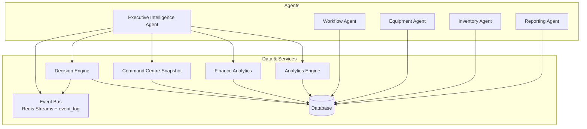
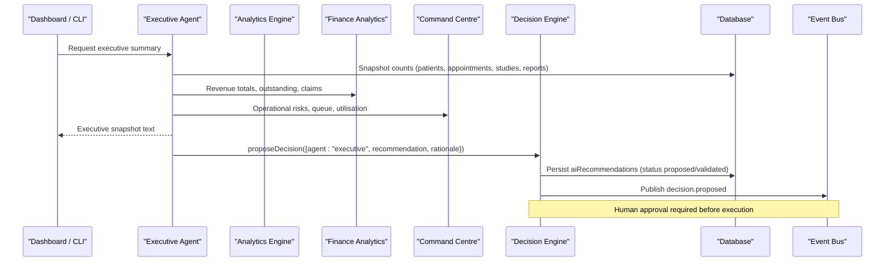
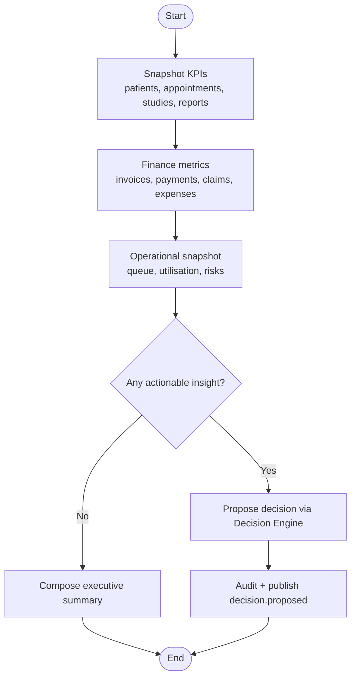
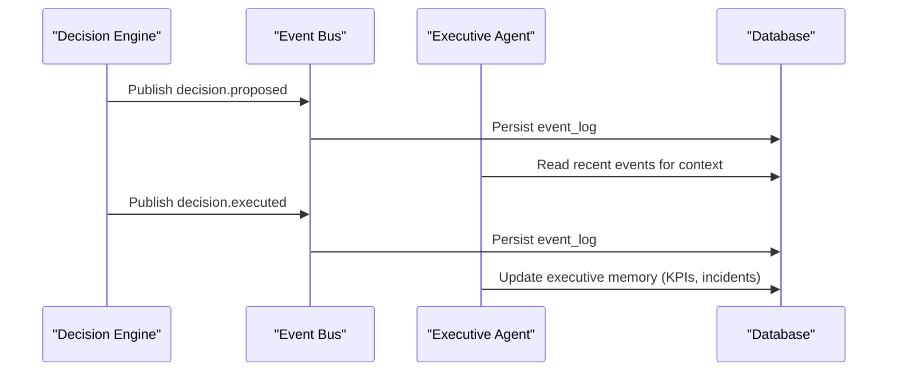
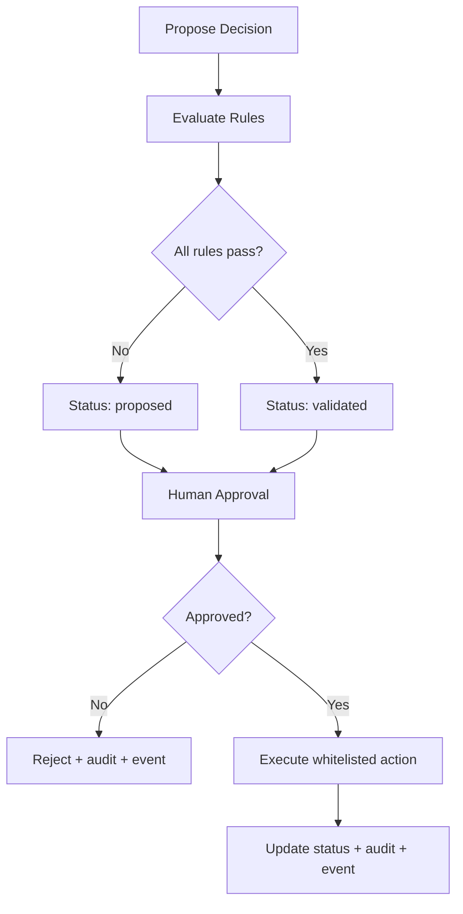
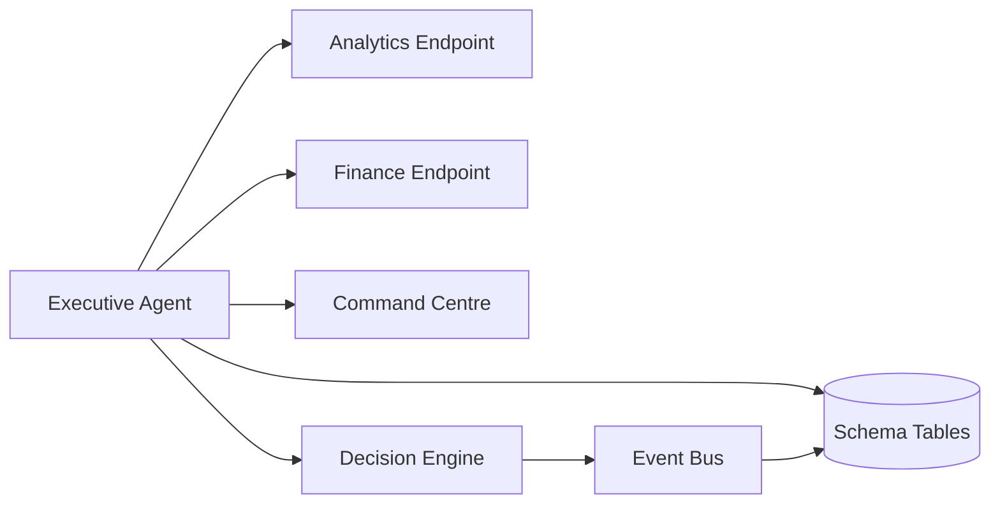

# Executive Intelligence Agent

<cite>
**Referenced Files in This Document**
- [agents.ts](file://src/lib/agents.ts)
- [decision-engine.ts](file://src/lib/decision-engine.ts)
- [events.ts](file://src/lib/events.ts)
- [finance.ts](file://src/lib/finance.ts)
- [reporting.ts](file://src/lib/reporting.ts)
- [analytics route.ts](file://src/app/api/analytics/route.ts)
- [finance analytics route.ts](file://src/app/api/finance/analytics/route.ts)
- [events API route.ts](file://src/app/api/events/route.ts)
- [command-centre.ts](file://src/lib/command-centre.ts)
- [schema.ts](file://src/db/schema.ts)
</cite>

## Table of Contents
1. [Introduction](#introduction)
2. [Project Structure](#project-structure)
3. [Core Components](#core-components)
4. [Architecture Overview](#architecture-overview)
5. [Detailed Component Analysis](#detailed-component-analysis)
6. [Dependency Analysis](#dependency-analysis)
7. [Performance Considerations](#performance-considerations)
8. [Troubleshooting Guide](#troubleshooting-guide)
9. [Conclusion](#conclusion)
10. [Appendices](#appendices)

## Introduction
The Executive Intelligence Agent turns operational data into concise, decision-ready intelligence for leadership. It aggregates KPIs across patients, appointments, studies, reports, equipment, inventory, finance, and events to produce daily summaries, detect bottlenecks and revenue-at-risk, compare modality performance and utilization, and propose decisions for human approval. It never auto-executes actions; all changes flow through the Decision Engine with explicit human approval and audit trails.

## Project Structure
The agent is part of a multi-agent system where each agent has a mission, tools, memory scope, event subscriptions, and responsibilities. The Executive Intelligence Agent sits alongside Reception, Scheduling, Workflow, Reporting, Equipment, Inventory, Quality Assurance, and Knowledge agents.

**Diagram sources**
- [agents.ts:148-161](file://src/lib/agents.ts#L148-L161)
- [decision-engine.ts:92-130](file://src/lib/decision-engine.ts#L92-L130)
- [events.ts:102-131](file://src/lib/events.ts#L102-L131)
- [analytics route.ts:6-57](file://src/app/api/analytics/route.ts#L6-L57)
- [finance analytics route.ts:6-71](file://src/app/api/finance/analytics/route.ts#L6-L71)
- [command-centre.ts:54-206](file://src/lib/command-centre.ts#L54-L206)

**Section sources**
- [agents.ts:1-177](file://src/lib/agents.ts#L1-L177)

## Core Components
- Tools: Analytics engine, Finance analytics, Integration health (via command centre), Trend models (derived from historical queries).
- Memory scope: Historical KPIs, revenue trends, incident records (persisted via database tables and event log).
- Event subscriptions: decision.proposed, decision.executed, report.signed, equipment.offline.
- Responsibilities: Daily executive summaries; detect bottlenecks and revenue-at-risk; compare modality performance/utilization; propose decisions for human approval (never auto-executes).

**Section sources**
- [agents.ts:148-161](file://src/lib/agents.ts#L148-L161)
- [events.ts:19-60](file://src/lib/events.ts#L19-L60)
- [decision-engine.ts:92-130](file://src/lib/decision-engine.ts#L92-L130)

## Architecture Overview
The Executive Intelligence Agent reads from multiple domain tables to build snapshots and trend views, then proposes decisions through the Decision Engine. Events are published for every lifecycle stage of a decision and persist to both Redis Streams (best-effort) and the durable event_log table.

**Diagram sources**
- [agents.ts:299-319](file://src/lib/agents.ts#L299-L319)
- [analytics route.ts:6-57](file://src/app/api/analytics/route.ts#L6-L57)
- [finance analytics route.ts:6-71](file://src/app/api/finance/analytics/route.ts#L6-L71)
- [command-centre.ts:54-206](file://src/lib/command-centre.ts#L54-L206)
- [decision-engine.ts:92-130](file://src/lib/decision-engine.ts#L92-L130)
- [events.ts:102-131](file://src/lib/events.ts#L102-L131)

## Detailed Component Analysis

### Executive Intelligence Agent Definition and Flow
- Mission: Turn operational data into concise, decision-ready intelligence.
- Tools: Analytics engine, Finance analytics, Integration health, Trend models.
- Memory: Historical KPIs, revenue trends, incident records.
- Events: decision.proposed, decision.executed, report.signed, equipment.offline.
- Responsibilities: Produce daily executive summaries; detect bottlenecks and revenue-at-risk; compare modality performance and utilization; propose decisions for human approval (never auto-executes).

**Diagram sources**
- [agents.ts:299-319](file://src/lib/agents.ts#L299-L319)
- [decision-engine.ts:92-130](file://src/lib/decision-engine.ts#L92-L130)

**Section sources**
- [agents.ts:148-161](file://src/lib/agents.ts#L148-L161)
- [agents.ts:299-319](file://src/lib/agents.ts#L299-L319)

### Analytics Engine
Aggregates core operational metrics used by the Executive Agent and dashboards:
- Counts: patients, appointments, studies, equipment, reports.
- Low stock items count.
- Equipment status distribution.
- Studies by stage and modality.

These metrics feed daily summaries and bottleneck detection.

**Section sources**
- [analytics route.ts:6-57](file://src/app/api/analytics/route.ts#L6-L57)

### Finance Analytics
Provides financial insights for executive summaries and trend analysis:
- Total invoiced, total paid, invoice count.
- Outstanding balances excluding paid/written-off.
- Invoices grouped by status with totals.
- Payments grouped by method with totals.
- Insurance claims grouped by status with totals.
- Expenses totals and counts.
- Revenue by day (last 14 days) for trend modeling.

**Section sources**
- [finance analytics route.ts:6-71](file://src/app/api/finance/analytics/route.ts#L6-L71)
- [finance.ts:1-35](file://src/lib/finance.ts#L1-L35)

### Integration Health (via Command Centre)
The Command Centre snapshot provides integration health signals:
- Equipment operational vs offline/maintenance counts.
- Inventory alerts below minimum stock.
- Appointment delays and pending reports.
- Live AI recommendations awaiting attention.
- Operational risks aggregated with severity levels.

This underpins “Integration health” for the Executive Agent’s tool set.

**Section sources**
- [command-centre.ts:54-206](file://src/lib/command-centre.ts#L54-L206)

### Trend Models
Trend models are derived from historical queries exposed by the analytics and finance endpoints:
- Revenue-by-day series for short-term trend visualization.
- Modality-wise study counts for utilization trends.
- Equipment status distributions for uptime trends.
- Claims-by-status for cashflow forecasting inputs.

These time-series and groupings enable simple moving averages or threshold-based alerts when integrated with dashboard logic.

**Section sources**
- [finance analytics route.ts:45-66](file://src/app/api/finance/analytics/route.ts#L45-L66)
- [analytics route.ts:27-41](file://src/app/api/analytics/route.ts#L27-L41)

### Event Subscriptions and Lifecycle
The Executive Agent reacts to:
- decision.proposed: When any agent proposes an action.
- decision.executed: After human approval and successful execution.
- report.signed: To update KPIs and quality metrics.
- equipment.offline: To trigger bottleneck and revenue-at-risk detection.

Events are persisted durably and optionally streamed via Redis.

**Diagram sources**
- [events.ts:102-131](file://src/lib/events.ts#L102-L131)
- [events API route.ts:6-38](file://src/app/api/events/route.ts#L6-L38)
- [decision-engine.ts:114-127](file://src/lib/decision-engine.ts#L114-L127)
- [decision-engine.ts:228-230](file://src/lib/decision-engine.ts#L228-L230)

**Section sources**
- [events.ts:19-60](file://src/lib/events.ts#L19-L60)
- [events.ts:102-131](file://src/lib/events.ts#L102-L131)
- [events API route.ts:6-38](file://src/app/api/events/route.ts#L6-L38)

### Decision Engine Guardrails
The Executive Agent proposes decisions but never executes them directly:
- Business rules prevent autonomous diagnosis and automatic report finalisation.
- STAT priority restricted to scheduling/workflow contexts.
- Slot reallocation requires equipment or appointment context.
- All decisions require explicit human approval before execution.
- Execution uses whitelisted actions with audit logging and event publication.

**Diagram sources**
- [decision-engine.ts:46-89](file://src/lib/decision-engine.ts#L46-L89)
- [decision-engine.ts:92-130](file://src/lib/decision-engine.ts#L92-L130)
- [decision-engine.ts:143-169](file://src/lib/decision-engine.ts#L143-L169)
- [decision-engine.ts:213-235](file://src/lib/decision-engine.ts#L213-L235)

**Section sources**
- [decision-engine.ts:46-89](file://src/lib/decision-engine.ts#L46-L89)
- [decision-engine.ts:92-130](file://src/lib/decision-engine.ts#L92-L130)
- [decision-engine.ts:143-169](file://src/lib/decision-engine.ts#L143-L169)
- [decision-engine.ts:213-235](file://src/lib/decision-engine.ts#L213-L235)

### Practical Examples

#### Executive Dashboard Generation
- Pull KPIs: patient count, appointment count, active studies, pending reports, equipment counts.
- Pull finance: invoices total, collected, outstanding, pending claims.
- Pull operational: low stock alerts, equipment offline/maintenance, queue lengths, utilisation rates.
- Compose a concise summary highlighting risks and opportunities.

Implementation references:
- Operational snapshot and KPI aggregation: [command-centre.ts:54-206](file://src/lib/command-centre.ts#L54-L206)
- Analytics metrics: [analytics route.ts:6-57](file://src/app/api/analytics/route.ts#L6-L57)
- Financial metrics: [finance analytics route.ts:6-71](file://src/app/api/finance/analytics/route.ts#L6-L71)
- Executive reply composition: [agents.ts:299-319](file://src/lib/agents.ts#L299-L319)

**Section sources**
- [command-centre.ts:54-206](file://src/lib/command-centre.ts#L54-L206)
- [analytics route.ts:6-57](file://src/app/api/analytics/route.ts#L6-L57)
- [finance analytics route.ts:6-71](file://src/app/api/finance/analytics/route.ts#L6-L71)
- [agents.ts:299-319](file://src/lib/agents.ts#L299-L319)

#### Financial Trend Analysis
- Use revenue-by-day series to compute rolling averages or detect drops.
- Track outstanding balances and claims-by-status to forecast cashflow.
- Compare payment methods and expense categories for cost control.

Implementation references:
- Revenue-by-day query: [finance analytics route.ts:45-66](file://src/app/api/finance/analytics/route.ts#L45-L66)
- Invoice/payment/claims grouping: [finance analytics route.ts:22-39](file://src/app/api/finance/analytics/route.ts#L22-L39)
- Outstanding calculation: [finance analytics route.ts:16-20](file://src/app/api/finance/analytics/route.ts#L16-L20)

**Section sources**
- [finance analytics route.ts:16-66](file://src/app/api/finance/analytics/route.ts#L16-L66)

#### Operational Bottleneck Detection Algorithms
- Identify bottlenecks by:
  - High queue length per equipment/modality.
  - Low equipment utilisation combined with high waiting counts.
  - Offline/maintenance equipment impacting schedule.
  - Pending reports exceeding thresholds.
  - Low stock items causing potential scan delays.
- Surface risks with severity levels for prioritization.

Implementation references:
- Queue and utilisation computation: [command-centre.ts:72-96](file://src/lib/command-centre.ts#L72-L96)
- Operational risk aggregation: [command-centre.ts:154-165](file://src/lib/command-centre.ts#L154-L165)
- Equipment status and offline detection: [agents.ts:197-200](file://src/lib/agents.ts#L197-L200)

**Section sources**
- [command-centre.ts:72-96](file://src/lib/command-centre.ts#L72-L96)
- [command-centre.ts:154-165](file://src/lib/command-centre.ts#L154-L165)
- [agents.ts:197-200](file://src/lib/agents.ts#L197-L200)

#### Modality Performance and Utilization Comparison
- Group studies by modality to compare throughput.
- Map equipment utilisation rates to identify underused or overloaded modalities.
- Correlate with equipment status to explain variances.

Implementation references:
- Studies by modality: [analytics route.ts:35-41](file://src/app/api/analytics/route.ts#L35-L41)
- Utilisation rates: [command-centre.ts:167-172](file://src/lib/command-centre.ts#L167-L172)
- Equipment status: [analytics route.ts:19-25](file://src/app/api/analytics/route.ts#L19-L25)

**Section sources**
- [analytics route.ts:19-41](file://src/app/api/analytics/route.ts#L19-L41)
- [command-centre.ts:167-172](file://src/lib/command-centre.ts#L167-L172)

#### Proposing Decisions for Human Approval
- When insights indicate actionable changes (e.g., reallocating slots due to equipment offline), propose a decision with rationale and target payload.
- The Decision Engine validates business rules and persists the proposal.
- Human approval is mandatory before execution.

Implementation references:
- Proposal creation and rule evaluation: [decision-engine.ts:92-130](file://src/lib/decision-engine.ts#L92-L130)
- Rule constraints: [decision-engine.ts:46-89](file://src/lib/decision-engine.ts#L46-L89)
- Approval and execution: [decision-engine.ts:143-169](file://src/lib/decision-engine.ts#L143-L169), [decision-engine.ts:213-235](file://src/lib/decision-engine.ts#L213-L235)

**Section sources**
- [decision-engine.ts:46-89](file://src/lib/decision-engine.ts#L46-L89)
- [decision-engine.ts:92-130](file://src/lib/decision-engine.ts#L92-L130)
- [decision-engine.ts:143-169](file://src/lib/decision-engine.ts#L143-L169)
- [decision-engine.ts:213-235](file://src/lib/decision-engine.ts#L213-L235)

## Dependency Analysis
The Executive Intelligence Agent depends on:
- Database schema for entities: patients, appointments, workflow_studies, equipment, inventory_items, reports, invoices, insurance_claims, expenses, ai_recommendations, event_log.
- Analytics and finance endpoints for aggregated metrics.
- Command Centre for operational health and risk signals.
- Decision Engine for safe, audited proposals and executions.
- Event Bus for durable event persistence and optional streaming.

**Diagram sources**
- [schema.ts:18-468](file://src/db/schema.ts#L18-L468)
- [analytics route.ts:6-57](file://src/app/api/analytics/route.ts#L6-L57)
- [finance analytics route.ts:6-71](file://src/app/api/finance/analytics/route.ts#L6-L71)
- [command-centre.ts:54-206](file://src/lib/command-centre.ts#L54-L206)
- [decision-engine.ts:92-130](file://src/lib/decision-engine.ts#L92-L130)
- [events.ts:102-131](file://src/lib/events.ts#L102-L131)

**Section sources**
- [schema.ts:18-468](file://src/db/schema.ts#L18-L468)

## Performance Considerations
- Prefer server-side aggregations using SQL GROUP BY and SUM/COUNT to minimize client-side processing.
- Cache frequent snapshots (e.g., daily KPIs) if dashboards refresh frequently.
- Use pagination and limits for large datasets (e.g., event logs, recommendations).
- Ensure indexes on frequently filtered columns such as status, issue_date, stage, and equipment_id to optimize queries.
- Avoid synchronous coupling between modules; rely on events for decoupled reactions.

## Troubleshooting Guide
- If executive summaries lack financial data, verify invoice/payment/claim tables have values and that finance endpoint queries succeed.
- If bottleneck detection misses issues, check equipment status and queue computations in the Command Centre snapshot.
- If decisions do not execute, confirm they are approved and that target actions exist in the whitelisted executor map.
- If events are missing, ensure event_log writes succeed even when Redis is unavailable; inspect error logs for write failures.

**Section sources**
- [finance analytics route.ts:6-71](file://src/app/api/finance/analytics/route.ts#L6-L71)
- [command-centre.ts:54-206](file://src/lib/command-centre.ts#L54-L206)
- [decision-engine.ts:213-235](file://src/lib/decision-engine.ts#L213-L235)
- [events.ts:102-131](file://src/lib/events.ts#L102-L131)

## Conclusion
The Executive Intelligence Agent synthesizes cross-domain operational and financial data into actionable intelligence while enforcing strict governance through the Decision Engine. It produces daily summaries, detects bottlenecks and revenue-at-risk, compares modality performance and utilization, and proposes decisions for human approval. Its architecture leverages robust analytics, finance analytics, integration health signals, and event-driven persistence to ensure reliability and auditability.

## Appendices

### Data Model Highlights Relevant to Executive Intelligence
- Patients, Appointments, Workflow Studies, Equipment, Reports drive operational KPIs.
- Invoices, Payments, Insurance Claims, Expenses drive financial KPIs and trends.
- AI Recommendations capture proposed decisions with status transitions and audit trails.
- Event Log captures all major actions for auditing and replay.

**Section sources**
- [schema.ts:18-468](file://src/db/schema.ts#L18-L468)