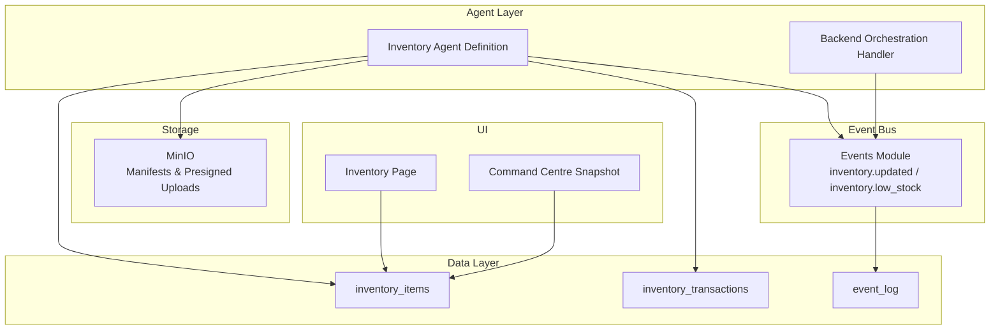
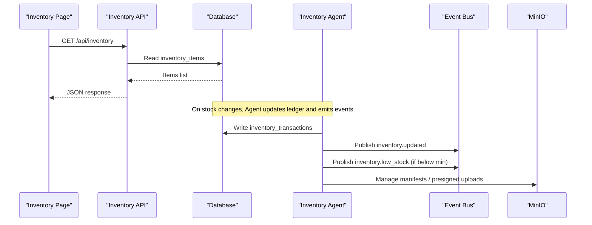
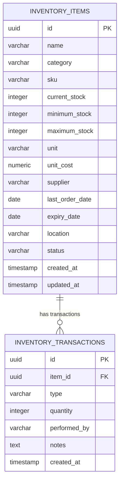
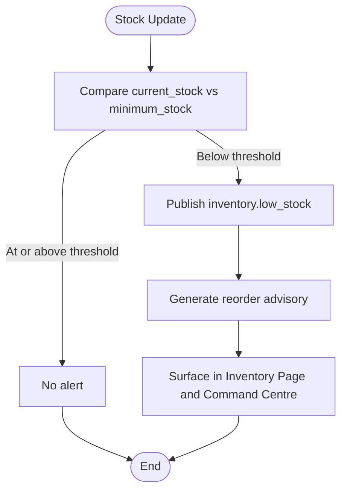
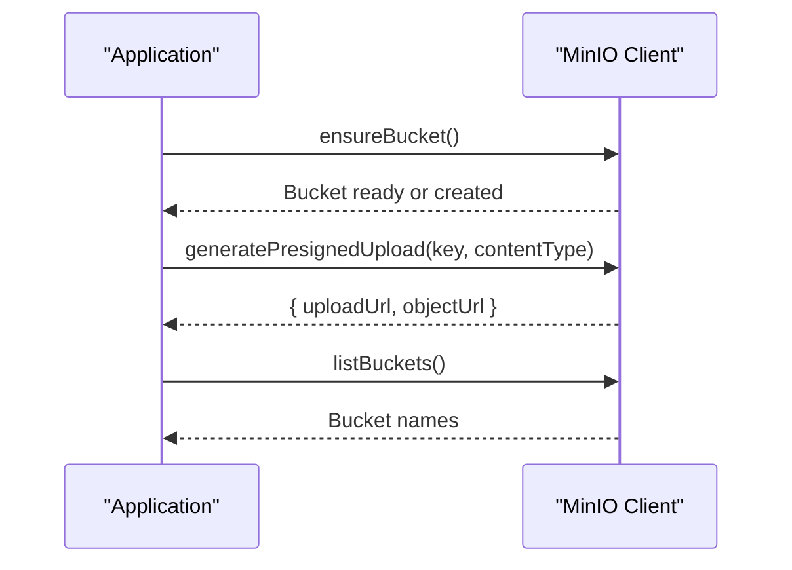
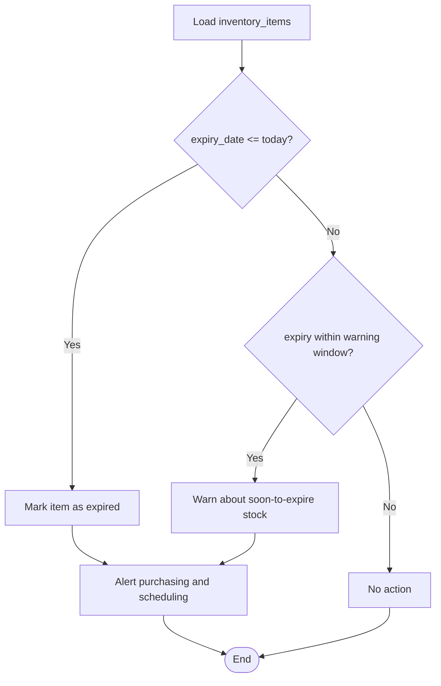
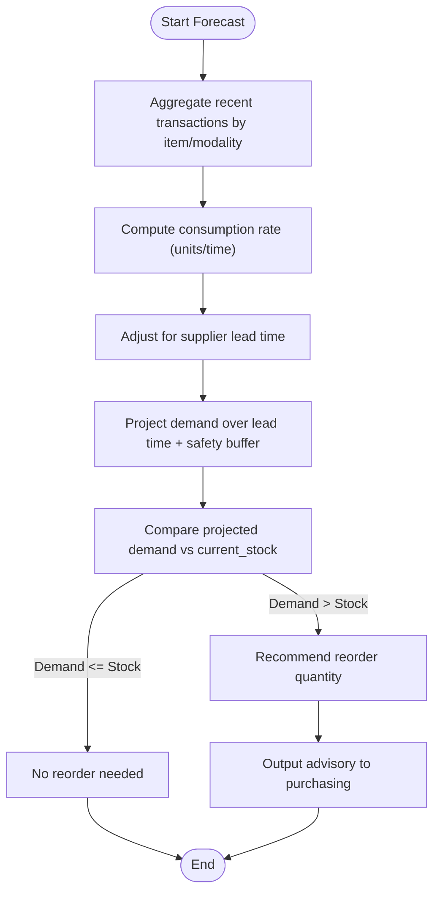
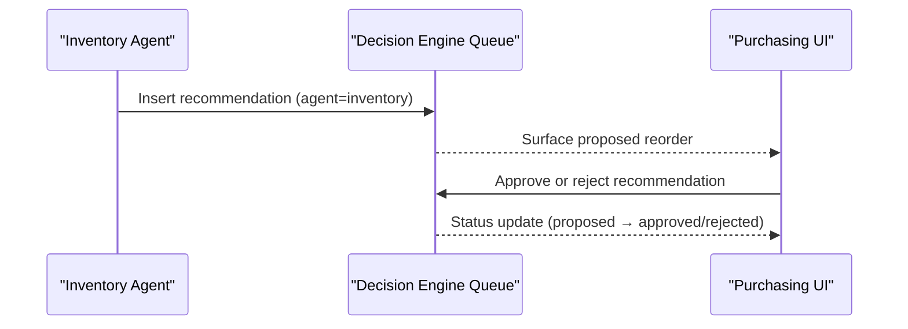
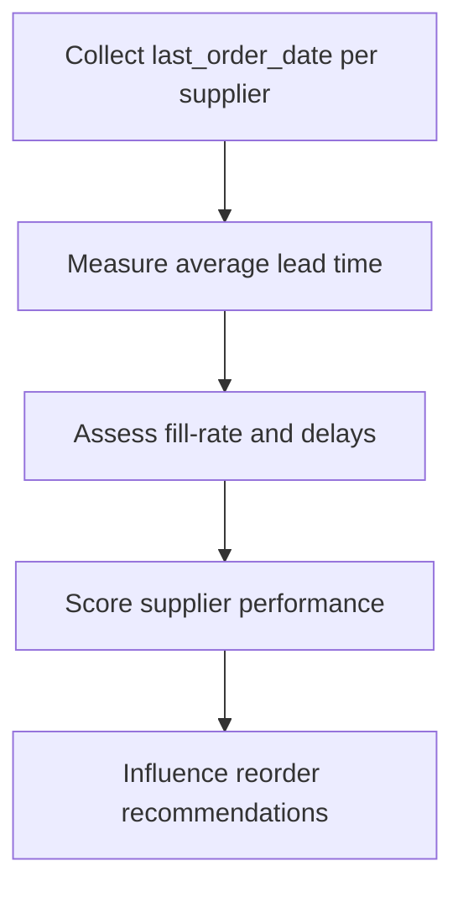
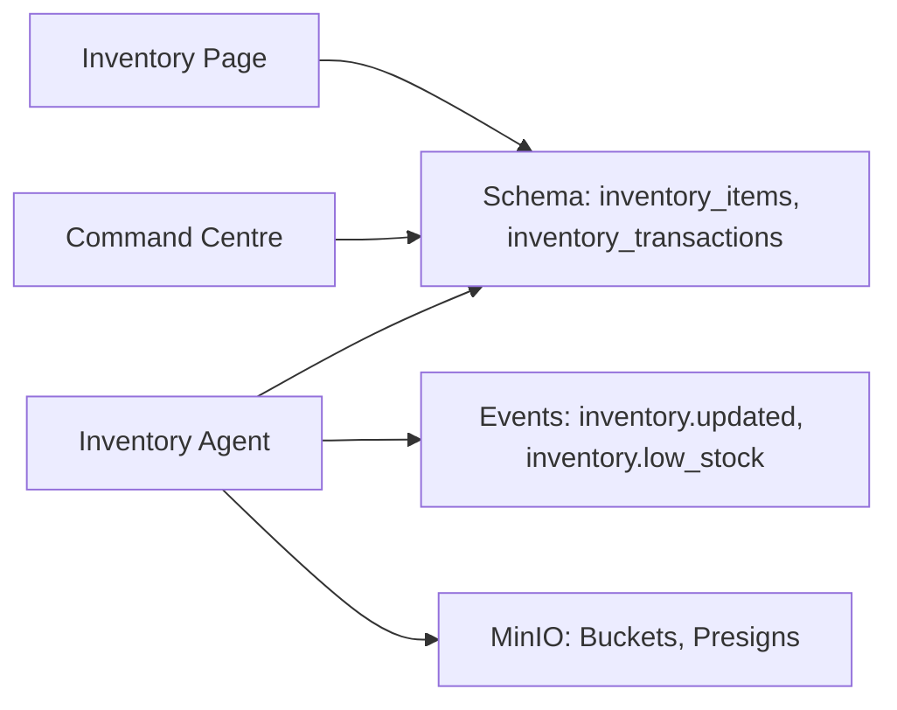

# Inventory Agent

<cite>
**Referenced Files in This Document**
- [agents.ts](file://src/lib/agents.ts)
- [events.ts](file://src/lib/events.ts)
- [schema.ts](file://src/db/schema.ts)
- [route.ts](file://src/app/api/inventory/route.ts)
- [minio.ts](file://src/lib/integrations/minio.ts)
- [page.tsx](file://src/app/inventory/page.tsx)
- [command-centre.ts](file://src/lib/command-centre.ts)
- [orchestration.py](file://backend/app/agents/orchestration.py)
- [seed-new-modules.ts](file://src/lib/seed-new-modules.ts)
</cite>

## Table of Contents
1. [Introduction](#introduction)
2. [Project Structure](#project-structure)
3. [Core Components](#core-components)
4. [Architecture Overview](#architecture-overview)
5. [Detailed Component Analysis](#detailed-component-analysis)
6. [Dependency Analysis](#dependency-analysis)
7. [Performance Considerations](#performance-considerations)
8. [Troubleshooting Guide](#troubleshooting-guide)
9. [Conclusion](#conclusion)

## Introduction
The Inventory Agent ensures critical consumables are never out of stock at scan time by combining real-time stock visibility, consumption forecasting, expiry monitoring, and automated reorder advisories. It integrates with the platform’s event bus to react to inventory changes and low-stock conditions, persists all state in the database, and exposes a user-facing inventory workspace for purchasing and operations teams.

## Project Structure
The Inventory Agent spans several layers:
- Agent definition and runtime behavior live in the agents module.
- Event types and publishing utilities enable reactive workflows.
- Database schema defines inventory items, transactions, and audit logs.
- API routes expose inventory data to the UI.
- MinIO integration supports manifests and storage-backed records.
- The inventory page provides operational dashboards and alerts.
- Command centre aggregates low-stock risks into executive views.
- Backend orchestration includes an example agent handler for inventory tasks.

**Diagram sources**
- [agents.ts:117-131](file://src/lib/agents.ts#L117-L131)
- [events.ts:53-54](file://src/lib/events.ts#L53-L54)
- [schema.ts:136-164](file://src/db/schema.ts#L136-L164)
- [minio.ts:15-60](file://src/lib/integrations/minio.ts#L15-L60)
- [page.tsx:44-77](file://src/app/inventory/page.tsx#L44-L77)
- [command-centre.ts:27-52](file://src/lib/command-centre.ts#L27-L52)
- [orchestration.py:69-76](file://backend/app/agents/orchestration.py#L69-L76)

**Section sources**
- [agents.ts:117-131](file://src/lib/agents.ts#L117-L131)
- [events.ts:53-54](file://src/lib/events.ts#L53-L54)
- [schema.ts:136-164](file://src/db/schema.ts#L136-L164)
- [minio.ts:15-60](file://src/lib/integrations/minio.ts#L15-L60)
- [page.tsx:44-77](file://src/app/inventory/page.tsx#L44-L77)
- [command-centre.ts:27-52](file://src/lib/command-centre.ts#L27-L52)
- [orchestration.py:69-76](file://backend/app/agents/orchestration.py#L69-L76)

## Core Components
- Stock ledger: Tracks current stock levels and transaction history for every item.
- Reorder thresholds: Minimum and maximum stock levels per item drive advisory logic.
- MinIO manifests: Storage-backed records (e.g., batch manifests) via presigned uploads and bucket management.
- Expiry monitor: Per-item expiry dates used to flag soon-to-expire or expired consumables.

Memory scope:
- Consumption rates: Derived from historical transactions to forecast usage per modality.
- Supplier lead times: Informed by last order dates and supplier fields to estimate replenishment windows.
- Expiry records: Stored per item to trigger expiry warnings and prevent use of expired stock.

Event subscriptions:
- inventory.updated: Triggered when stock levels change; enables reforecasting and alert checks.
- inventory.low_stock: Published when stock falls below minimum; triggers reorder advisories.

Responsibilities:
- Trigger reorder advisories below minimum stock.
- Monitor expiry dates for contrast media and consumables.
- Forecast monthly consumption per modality.
- Track supplier performance through order timing and reliability signals.

**Section sources**
- [schema.ts:136-164](file://src/db/schema.ts#L136-L164)
- [agents.ts:117-131](file://src/lib/agents.ts#L117-L131)
- [events.ts:53-54](file://src/lib/events.ts#L53-L54)
- [minio.ts:15-60](file://src/lib/integrations/minio.ts#L15-L60)
- [page.tsx:76-81](file://src/app/inventory/page.tsx#L76-L81)

## Architecture Overview
The Inventory Agent operates as an event-driven component that reads and writes to the stock ledger, publishes events on state changes, and surfaces actionable insights to users and other agents.

**Diagram sources**
- [route.ts:6-23](file://src/app/api/inventory/route.ts#L6-L23)
- [events.ts:101-131](file://src/lib/events.ts#L101-L131)
- [schema.ts:136-164](file://src/db/schema.ts#L136-L164)
- [minio.ts:15-60](file://src/lib/integrations/minio.ts#L15-L60)

## Detailed Component Analysis

### Stock Ledger and Transactions
The stock ledger is implemented via two tables:
- inventory_items: Holds current stock, thresholds, unit cost, supplier, location, and expiry date.
- inventory_transactions: Records each stock movement with type, quantity, performer, and notes.

This design supports accurate consumption calculations and auditability.

**Diagram sources**
- [schema.ts:136-164](file://src/db/schema.ts#L136-L164)

**Section sources**
- [schema.ts:136-164](file://src/db/schema.ts#L136-L164)

### Reorder Thresholds and Low-Stock Alerts
Reorder logic compares current stock against minimum_stock. The UI highlights low-stock items and the command centre aggregates them into operational risk summaries.

**Diagram sources**
- [page.tsx:76-81](file://src/app/inventory/page.tsx#L76-L81)
- [command-centre.ts:27-52](file://src/lib/command-centre.ts#L27-L52)
- [events.ts:53-54](file://src/lib/events.ts#L53-L54)

**Section sources**
- [page.tsx:76-81](file://src/app/inventory/page.tsx#L76-L81)
- [command-centre.ts:27-52](file://src/lib/command-centre.ts#L27-L52)
- [events.ts:53-54](file://src/lib/events.ts#L53-L54)

### MinIO Manifests and Storage Integration
MinIO provides object storage capabilities used for manifests and batch records. The integration supports listing buckets, generating presigned upload URLs, and ensuring a default bucket exists.

**Diagram sources**
- [minio.ts:15-60](file://src/lib/integrations/minio.ts#L15-L60)

**Section sources**
- [minio.ts:15-60](file://src/lib/integrations/minio.ts#L15-L60)

### Expiry Monitor
Expiry dates are stored per item and surfaced in the inventory workspace. Monitoring can be extended to flag items nearing expiry or already expired, preventing their use during scans.

**Diagram sources**
- [schema.ts:136-164](file://src/db/schema.ts#L136-L164)
- [page.tsx:23-37](file://src/app/inventory/page.tsx#L23-L37)

**Section sources**
- [schema.ts:136-164](file://src/db/schema.ts#L136-L164)
- [page.tsx:23-37](file://src/app/inventory/page.tsx#L23-L37)

### Consumption Forecasting Algorithms
Forecasting uses historical consumption derived from inventory transactions to project future needs per modality. The agent’s memory scope includes consumption rates and supplier lead times to refine forecasts and advise optimal reorder quantities.

[No diagram sources since this section describes algorithmic flow without mapping to specific code lines]

**Section sources**
- [agents.ts:117-131](file://src/lib/agents.ts#L117-L131)
- [schema.ts:136-164](file://src/db/schema.ts#L136-L164)

### Automated Reorder Workflow Generation
Reorder advisories are proposed to purchasing and integrated with the decision engine. They are never auto-ordered, preserving human oversight.

**Diagram sources**
- [seed-new-modules.ts:193-220](file://src/lib/seed-new-modules.ts#L193-L220)
- [agents.ts:280-283](file://src/lib/agents.ts#L280-L283)

**Section sources**
- [seed-new-modules.ts:193-220](file://src/lib/seed-new-modules.ts#L193-L220)
- [agents.ts:280-283](file://src/lib/agents.ts#L280-L283)

### Supplier Performance Tracking
Supplier performance can be inferred from last_order_date and transaction patterns to evaluate reliability and lead time adherence. This informs reorder decisions and vendor selection.

[No diagram sources since this section describes conceptual workflow without mapping to specific code lines]

**Section sources**
- [schema.ts:136-164](file://src/db/schema.ts#L136-L164)

## Dependency Analysis
The Inventory Agent depends on:
- Database schema for inventory items and transactions.
- Event bus for reactive updates and low-stock alerts.
- MinIO for storage-backed manifests and presigned uploads.
- UI components for visualization and operational actions.
- Command centre for aggregated risk reporting.

**Diagram sources**
- [agents.ts:117-131](file://src/lib/agents.ts#L117-L131)
- [events.ts:53-54](file://src/lib/events.ts#L53-L54)
- [schema.ts:136-164](file://src/db/schema.ts#L136-L164)
- [minio.ts:15-60](file://src/lib/integrations/minio.ts#L15-L60)
- [page.tsx:44-77](file://src/app/inventory/page.tsx#L44-L77)
- [command-centre.ts:27-52](file://src/lib/command-centre.ts#L27-L52)

**Section sources**
- [agents.ts:117-131](file://src/lib/agents.ts#L117-L131)
- [events.ts:53-54](file://src/lib/events.ts#L53-L54)
- [schema.ts:136-164](file://src/db/schema.ts#L136-L164)
- [minio.ts:15-60](file://src/lib/integrations/minio.ts#L15-L60)
- [page.tsx:44-77](file://src/app/inventory/page.tsx#L44-L77)
- [command-centre.ts:27-52](file://src/lib/command-centre.ts#L27-L52)

## Performance Considerations
- Keep event publishing resilient: Redis Streams are best-effort; durable persistence in event_log ensures no loss of audit trail.
- Avoid heavy synchronous processing in event handlers; prefer background jobs for forecasting and reorder generation.
- Use indexes on frequently queried columns (e.g., category, status, expiry_date) to optimize dashboard loads and alert checks.
- Batch transaction writes where possible to reduce database load during high-volume consumption events.

[No sources needed since this section provides general guidance]

## Troubleshooting Guide
Common issues and resolutions:
- MinIO connectivity failures: Ensure endpoint and credentials are configured; check bucket existence and network reachability.
- Event bus unavailability: Events still persist to event_log; verify Redis configuration if using streams for real-time consumers.
- Low-stock alerts not appearing: Confirm current_stock and minimum_stock values are correct; validate that inventory.updated and inventory.low_stock events are published on stock changes.
- Forecast inaccuracies: Review transaction history completeness and adjust safety buffers based on supplier lead time variability.

**Section sources**
- [events.ts:72-131](file://src/lib/events.ts#L72-L131)
- [minio.ts:15-60](file://src/lib/integrations/minio.ts#L15-L60)
- [page.tsx:76-81](file://src/app/inventory/page.tsx#L76-L81)

## Conclusion
The Inventory Agent provides robust, event-driven inventory management tailored for healthcare imaging environments. By combining a reliable stock ledger, configurable reorder thresholds, MinIO-backed manifests, and expiry monitoring, it ensures critical consumables remain available at scan time. Its responsibilities—triggering reorder advisories, monitoring expiry, forecasting consumption per modality, and tracking supplier performance—are grounded in persistent data and reactive events, with clear pathways for human approval before any ordering occurs.