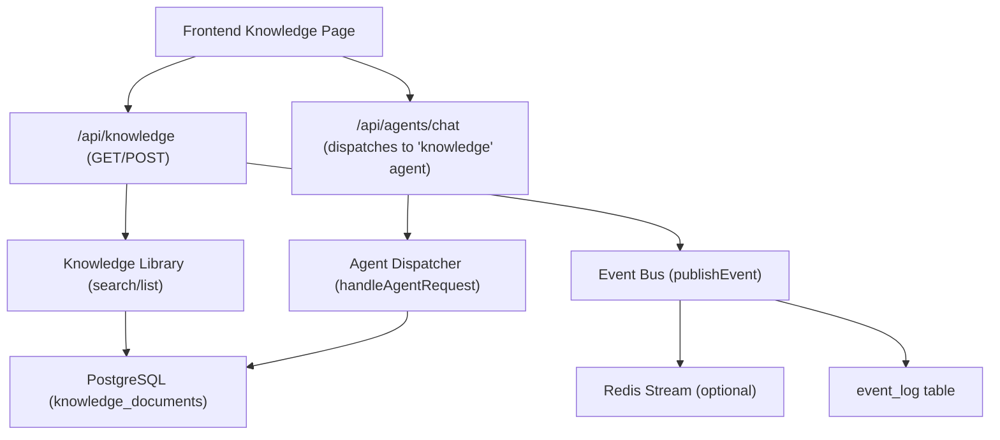
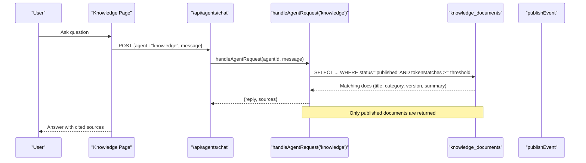
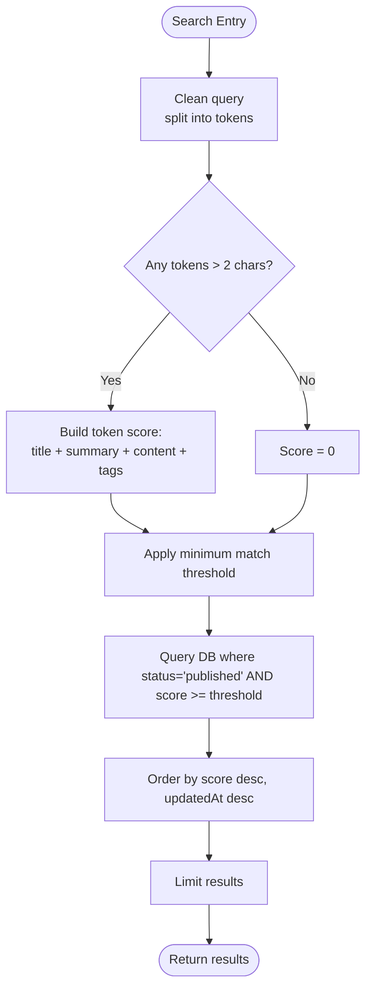
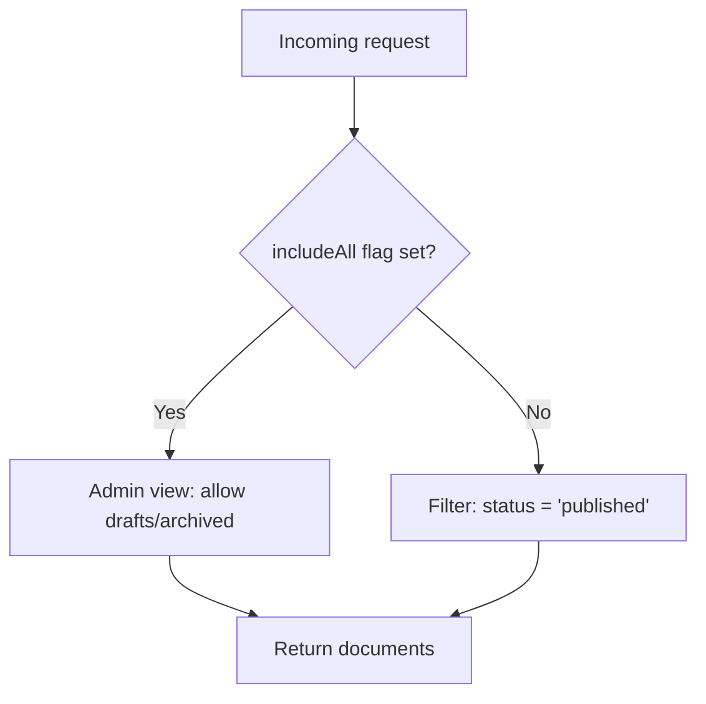
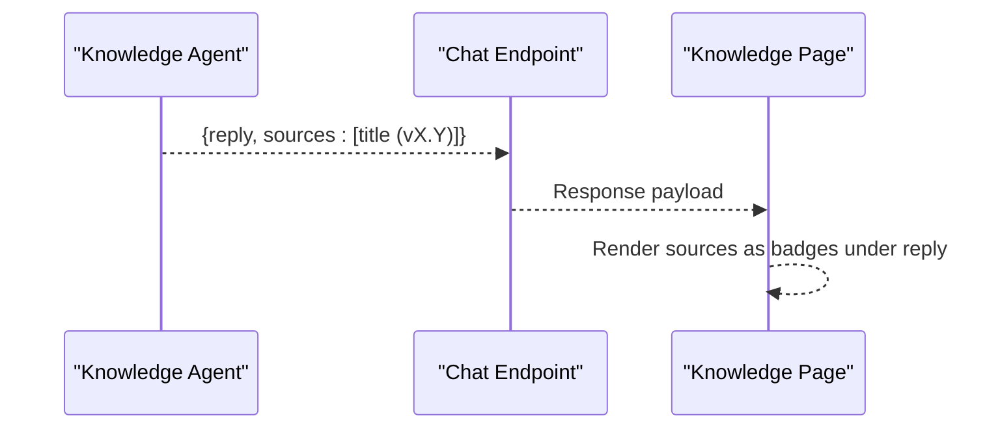
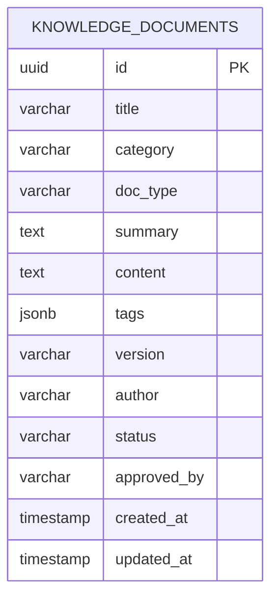
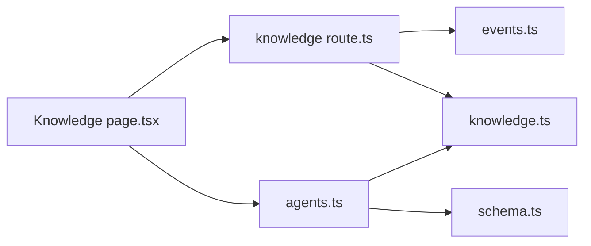

# Knowledge Agent

<cite>
**Referenced Files in This Document**
- [agents.ts](file://src/lib/agents.ts)
- [knowledge.ts](file://src/lib/knowledge.ts)
- [knowledge-categories.ts](file://src/lib/knowledge-categories.ts)
- [schema.ts](file://src/db/schema.ts)
- [events.ts](file://src/lib/events.ts)
- [knowledge route.ts](file://src/app/api/knowledge/route.ts)
- [knowledge [id] route.ts](file://src/app/api/knowledge/[id]/route.ts)
- [Knowledge page.tsx](file://src/app/knowledge/page.tsx)
</cite>

## Table of Contents
1. Introduction
2. Project Structure
3. Core Components
4. Architecture Overview
5. Detailed Component Analysis
6. Dependency Analysis
7. Performance Considerations
8. Troubleshooting Guide
9. Conclusion

## Introduction
The Knowledge Agent is a specialized agent that answers questions exclusively from approved internal documentation. It provides:
- Knowledge base search across SOPs, protocols, manuals, and standards
- Retrieval of the correct protocol for a requested procedure
- Version-aware citations to exact documents and versions
- Strict refusal to answer from unapproved or external sources

Its security model ensures only published, approved documents are accessible through the agent interface.

## Project Structure
The Knowledge Agent spans server-side logic (Next.js API routes and libraries), database schema, event publishing, and a frontend knowledge workspace.



**Diagram sources**
- [Knowledge page.tsx:90-153](file://src/app/knowledge/page.tsx#L90-L153)
- [knowledge route.ts:10-26](file://src/app/api/knowledge/route.ts#L10-L26)
- [knowledge.ts:31-59](file://src/lib/knowledge.ts#L31-L59)
- [events.ts:101-131](file://src/lib/events.ts#L101-L131)
- [agents.ts:321-363](file://src/lib/agents.ts#L321-L363)

**Section sources**
- [Knowledge page.tsx:90-153](file://src/app/knowledge/page.tsx#L90-L153)
- [knowledge route.ts:10-26](file://src/app/api/knowledge/route.ts#L10-L26)
- [knowledge.ts:31-59](file://src/lib/knowledge.ts#L31-L59)
- [events.ts:101-131](file://src/lib/events.ts#L101-L131)
- [agents.ts:321-363](file://src/lib/agents.ts#L321-L363)

## Core Components
- Knowledge library: tokenized search over title, summary, content, and tags; category filtering; limit control; strict status filter to published documents.
- Agent dispatcher: implements the Knowledge Agent’s mission, tools, memory scope, events, and responsibilities; performs tokenized matching with approval gating.
- Event bus: publishes knowledge.published when documents are created or updated to published; persists events durably even if Redis is unavailable.
- Frontend: document browser, category filters, chat interface to ask the Knowledge Agent, and creation flow that publishes documents as approved.

**Section sources**
- [knowledge.ts:31-71](file://src/lib/knowledge.ts#L31-L71)
- [agents.ts:163-176](file://src/lib/agents.ts#L163-L176)
- [events.ts:101-131](file://src/lib/events.ts#L101-L131)
- [Knowledge page.tsx:108-153](file://src/app/knowledge/page.tsx#L108-L153)

## Architecture Overview
The Knowledge Agent enforces a secure, event-driven architecture:
- All user queries are routed to the “knowledge” agent via the chat endpoint.
- The agent executes a tokenized search restricted to published documents.
- Results include version metadata and source citations.
- Publishing new or updated documents emits a knowledge.published event for downstream consumers.



**Diagram sources**
- [Knowledge page.tsx:135-153](file://src/app/knowledge/page.tsx#L135-L153)
- [agents.ts:321-363](file://src/lib/agents.ts#L321-L363)
- [knowledge.ts:31-59](file://src/lib/knowledge.ts#L31-L59)

## Detailed Component Analysis

### Knowledge Agent Definition and Responsibilities
- Mission: Answer exclusively from approved internal documentation.
- Tools: Knowledge base search, SOP/protocol retrieval, version control.
- Memory: Document index, categories, approval status.
- Events: Subscribes to knowledge.published to refresh or react to new approvals.
- Responsibilities:
  - Answer questions citing approved SOPs, protocols, and manuals
  - Refuse to answer from unapproved or external sources
  - Suggest the right protocol for a requested procedure
  - Point staff to the exact document and version

```mermaid
classDiagram
class AgentDefinition {
+string id
+string name
+string mission
+string[] tools
+string memory
+string[] events
+string[] responsibilities
+string color
}
class KnowledgeAgent {
+mission : "Answer exclusively from approved internal documentation."
+tools : ["Knowledge base search","SOP/protocol retrieval","Version control"]
+memory : "Document index, categories, approval status"
+events : ["knowledge.published"]
+responsibilities : [
"Answer questions citing approved SOPs, protocols and manuals",
"Refuse to answer from unapproved or external sources",
"Suggest the right protocol for a requested procedure",
"Point staff to the exact document and version"
]
}
AgentDefinition <|-- KnowledgeAgent
```

**Diagram sources**
- [agents.ts:30-39](file://src/lib/agents.ts#L30-L39)
- [agents.ts:163-176](file://src/lib/agents.ts#L163-L176)

**Section sources**
- [agents.ts:163-176](file://src/lib/agents.ts#L163-L176)

### Tokenized Document Search Algorithm
- Query tokens are extracted by splitting on whitespace and filtering out short tokens.
- A composite score counts matches across title, summary, content, and tags using ILIKE.
- Minimum match threshold ensures relevance (at least two tokens must match).
- Results are ordered by descending score and then by most recently updated.
- Status filter restricts results to published documents only.



**Diagram sources**
- [knowledge.ts:31-59](file://src/lib/knowledge.ts#L31-L59)
- [agents.ts:321-346](file://src/lib/agents.ts#L321-L346)

**Section sources**
- [knowledge.ts:31-59](file://src/lib/knowledge.ts#L31-L59)
- [agents.ts:321-346](file://src/lib/agents.ts#L321-L346)

### Approval Status Filtering and Security Model
- All search endpoints enforce status = 'published'.
- The Knowledge Agent’s dispatcher explicitly filters by published status before returning any result.
- The editor can include drafts/archived via an explicit flag for administrative use; default behavior excludes them.
- This ensures the agent interface never exposes unapproved content.



**Diagram sources**
- [knowledge route.ts:10-26](file://src/app/api/knowledge/route.ts#L10-L26)
- [knowledge.ts:50-58](file://src/lib/knowledge.ts#L50-L58)
- [agents.ts:339-346](file://src/lib/agents.ts#L339-L346)

**Section sources**
- [knowledge route.ts:10-26](file://src/app/api/knowledge/route.ts#L10-L26)
- [knowledge.ts:50-58](file://src/lib/knowledge.ts#L50-L58)
- [agents.ts:339-346](file://src/lib/agents.ts#L339-L346)

### Source Citation Mechanism
- The Knowledge Agent returns a list of sources including document titles and versions.
- The frontend displays these sources alongside the assistant’s reply for traceability.
- This supports auditability and directs users to the exact current version.



**Diagram sources**
- [agents.ts:355-362](file://src/lib/agents.ts#L355-L362)
- [Knowledge page.tsx:141-153](file://src/app/knowledge/page.tsx#L141-L153)

**Section sources**
- [agents.ts:355-362](file://src/lib/agents.ts#L355-L362)
- [Knowledge page.tsx:141-153](file://src/app/knowledge/page.tsx#L141-L153)

### Event Subscription for knowledge.published
- When a document is created or updated to published, the system publishes a knowledge.published event.
- The Knowledge Agent’s definition declares it reacts to this event type.
- The event bus writes to Redis Streams (if configured) and persists to event_log for durability.

```mermaid
sequenceDiagram
participant Editor as "Editor"
participant API as "Knowledge API"
participant Events as "Event Bus"
participant DB as "event_log"
Editor->>API : POST/PATCH document (status=published)
API->>Events : publishEvent({type : "knowledge.published", aggregateId})
Events->>DB : Insert event record
Note over Events,DB : Redis write is best-effort; DB is durable
```

**Diagram sources**
- [knowledge route.ts:28-65](file://src/app/api/knowledge/route.ts#L28-L65)
- [knowledge [id] route.ts:17-40](file://src/app/api/knowledge/[id]/route.ts#L17-L40)
- [events.ts:101-131](file://src/lib/events.ts#L101-L131)
- [agents.ts:163-176](file://src/lib/agents.ts#L163-L176)

**Section sources**
- [knowledge route.ts:28-65](file://src/app/api/knowledge/route.ts#L28-L65)
- [knowledge [id] route.ts:17-40](file://src/app/api/knowledge/[id]/route.ts#L17-L40)
- [events.ts:101-131](file://src/lib/events.ts#L101-L131)
- [agents.ts:163-176](file://src/lib/agents.ts#L163-L176)

### Data Model for Knowledge Documents
- Fields include title, category, docType, summary, content, tags, version, author, status, approvedBy, timestamps.
- Status values include draft, published, archived.
- Categories and doc types are defined centrally for consistency.



**Diagram sources**
- [schema.ts:406-421](file://src/db/schema.ts#L406-L421)

**Section sources**
- [schema.ts:406-421](file://src/db/schema.ts#L406-L421)
- [knowledge-categories.ts:6-22](file://src/lib/knowledge-categories.ts#L6-L22)

## Dependency Analysis
- The Knowledge Agent depends on:
  - Database schema for knowledge_documents
  - Knowledge library for search and listing
  - Event bus for publishing knowledge.published
  - Frontend for user interaction and display of sources
- Coupling is minimal: the agent uses SQL-level tokenization and status filtering; events are decoupled via the event bus.



**Diagram sources**
- [agents.ts:321-363](file://src/lib/agents.ts#L321-L363)
- [knowledge.ts:31-59](file://src/lib/knowledge.ts#L31-L59)
- [knowledge route.ts:10-26](file://src/app/api/knowledge/route.ts#L10-L26)
- [events.ts:101-131](file://src/lib/events.ts#L101-L131)
- [Knowledge page.tsx:90-153](file://src/app/knowledge/page.tsx#L90-L153)

**Section sources**
- [agents.ts:321-363](file://src/lib/agents.ts#L321-L363)
- [knowledge.ts:31-59](file://src/lib/knowledge.ts#L31-L59)
- [knowledge route.ts:10-26](file://src/app/api/knowledge/route.ts#L10-L26)
- [events.ts:101-131](file://src/lib/events.ts#L101-L131)
- [Knowledge page.tsx:90-153](file://src/app/knowledge/page.tsx#L90-L153)

## Performance Considerations
- Tokenized search uses ILIKE patterns; consider adding indexes on frequently searched columns (title, summary, content) and tags for large datasets.
- Limiting results prevents heavy payloads; adjust limits based on UI needs.
- Event bus writes are best-effort to Redis; ensure event_log remains consistent for auditability.
- Avoid unnecessary includeAll usage in production; it bypasses published-only filtering for admin/editor workflows.

[No sources needed since this section provides general guidance]

## Troubleshooting Guide
- No results returned:
  - Ensure at least two meaningful tokens exist in the query.
  - Verify documents have status = 'published'.
  - Check that content/tags contain relevant terms.
- Unexpected drafts appearing:
  - Confirm includeAll is not set to true in client requests.
- Event not received:
  - Check Redis availability; events still persist to event_log.
  - Validate that PATCH/POST sets status to 'published' to emit knowledge.published.

**Section sources**
- [knowledge.ts:31-59](file://src/lib/knowledge.ts#L31-L59)
- [knowledge route.ts:10-26](file://src/app/api/knowledge/route.ts#L10-L26)
- [events.ts:101-131](file://src/lib/events.ts#L101-L131)

## Conclusion
The Knowledge Agent provides a secure, version-aware, and auditable way to retrieve approved internal documentation. Its tokenized search, strict approval filtering, and event-driven publishing ensure that staff always receive accurate, current, and compliant answers. The design emphasizes safety by refusing unapproved or external sources and by pointing users to exact documents and versions.

[No sources needed since this section summarizes without analyzing specific files]