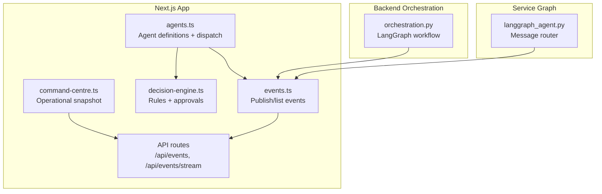
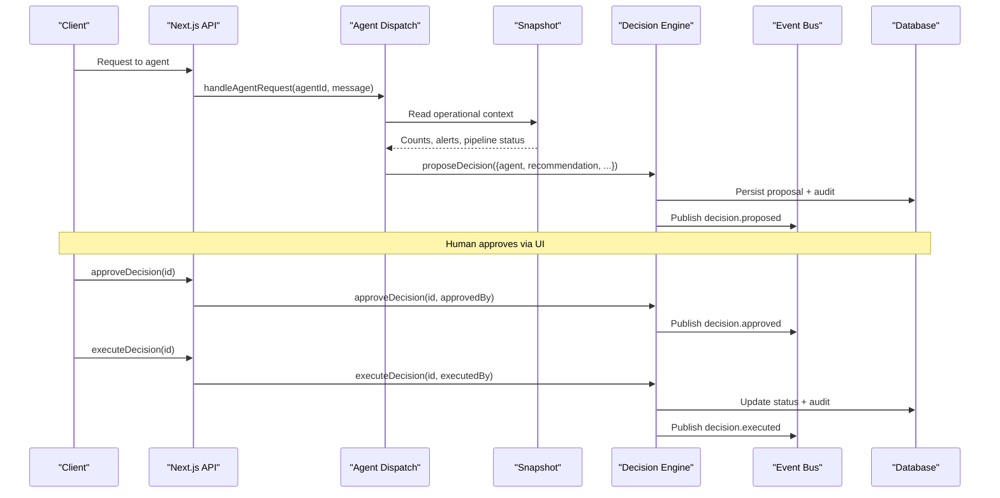
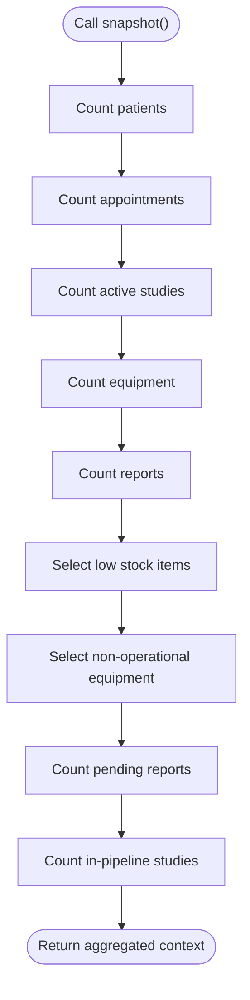
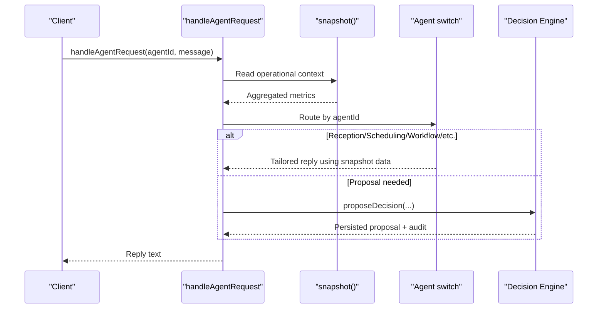
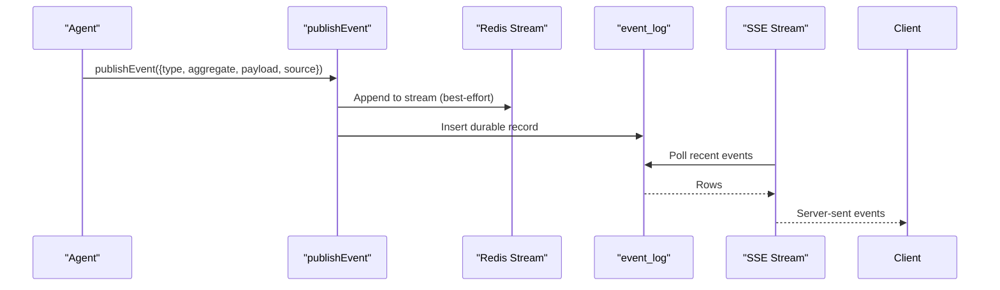
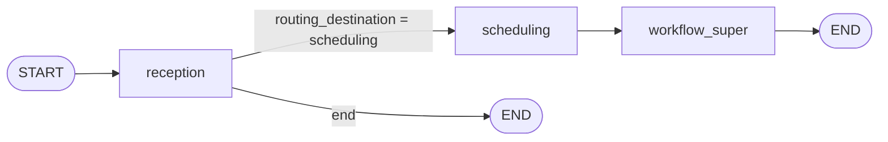
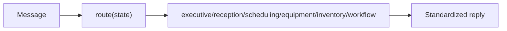
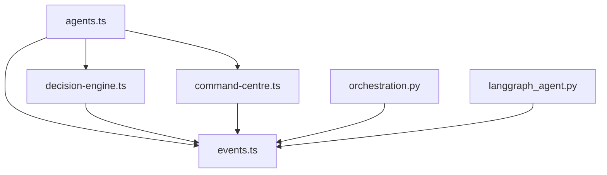

# Multi-Agent System

<cite>
**Referenced Files in This Document**
- [agents.ts](file://src/lib/agents.ts)
- [command-centre.ts](file://src/lib/command-centre.ts)
- [decision-engine.ts](file://src/lib/decision-engine.ts)
- [events.ts](file://src/lib/events.ts)
- [route.ts (events)](file://src/app/api/events/route.ts)
- [route.ts (events stream)](file://src/app/api/events/stream/route.ts)
- [orchestration.py](file://backend/app/agents/orchestration.py)
- [langgraph_agent.py](file://services/langgraph_agent.py)
</cite>

## Table of Contents
1. [Introduction](#introduction)
2. [Project Structure](#project-structure)
3. [Core Components](#core-components)
4. [Architecture Overview](#architecture-overview)
5. [Detailed Component Analysis](#detailed-component-analysis)
6. [Dependency Analysis](#dependency-analysis)
7. [Performance Considerations](#performance-considerations)
8. [Troubleshooting Guide](#troubleshooting-guide)
9. [Conclusion](#conclusion)
10. [Appendices](#appendices)

## Introduction
This document explains the GeraldOS multi-agent system that coordinates nine specialized agents across a healthcare imaging workflow: reception, scheduling, workflow, reporting, equipment, inventory, quality, executive, and knowledge. Agents collaborate through an event-driven architecture and shared operational context rather than direct coupling. The system provides both conceptual guidance for understanding AI agent concepts and technical details for developers extending or integrating with the agent system.

## Project Structure
The multi-agent system spans frontend APIs, backend orchestration, and service-level graphs:
- Agent definitions, dispatch, and shared snapshot logic live in the Next.js application layer.
- A LangGraph-based orchestrator defines a clinical workflow graph for end-to-end routing between agents.
- An alternative LangGraph service demonstrates message-based routing to individual agents.
- Events are published to Redis streams and persisted to the database; a server-sent events endpoint streams them to clients.
- The decision engine enforces safety rules and human approval before any state-changing action is executed.

**Diagram sources**
- [agents.ts:187-210](file://src/lib/agents.ts#L187-L210)
- [command-centre.ts:54-206](file://src/lib/command-centre.ts#L54-L206)
- [decision-engine.ts:91-130](file://src/lib/decision-engine.ts#L91-L130)
- [events.ts:102-131](file://src/lib/events.ts#L102-L131)
- [route.ts (events):1-37](file://src/app/api/events/route.ts#L1-L37)
- [route.ts (events stream):38-93](file://src/app/api/events/stream/route.ts#L38-L93)
- [orchestration.py:106-133](file://backend/app/agents/orchestration.py#L106-L133)
- [langgraph_agent.py:27-34](file://services/langgraph_agent.py#L27-L34)

**Section sources**
- [agents.ts:1-374](file://src/lib/agents.ts#L1-L374)
- [command-centre.ts:1-208](file://src/lib/command-centre.ts#L1-L208)
- [decision-engine.ts:1-245](file://src/lib/decision-engine.ts#L1-L245)
- [events.ts:62-147](file://src/lib/events.ts#L62-L147)
- [route.ts (events):1-37](file://src/app/api/events/route.ts#L1-L37)
- [route.ts (events stream):38-93](file://src/app/api/events/stream/route.ts#L38-L93)
- [orchestration.py:1-134](file://backend/app/agents/orchestration.py#L1-L134)
- [langgraph_agent.py:1-35](file://services/langgraph_agent.py#L1-L35)

## Core Components
- Nine specialized agents define mission, tools, memory scope, events, responsibilities, and color-coded identity.
- Shared operational snapshot aggregates counts and alerts from multiple tables for consistent context.
- Event publishing persists durable records and optionally streams via Redis for real-time reactions.
- Decision engine validates proposals against business rules and requires explicit human approval before execution.
- Two orchestration layers:
  - LangGraph workflow orchestrates a sequential clinical path (reception → scheduling → workflow).
  - Message router selects an agent by ID and returns a standardized reply.

**Section sources**
- [agents.ts:41-177](file://src/lib/agents.ts#L41-L177)
- [agents.ts:187-210](file://src/lib/agents.ts#L187-L210)
- [events.ts:102-131](file://src/lib/events.ts#L102-L131)
- [decision-engine.ts:45-130](file://src/lib/decision-engine.ts#L45-L130)
- [orchestration.py:106-133](file://backend/app/agents/orchestration.py#L106-L133)
- [langgraph_agent.py:12-34](file://services/langgraph_agent.py#L12-L34)

## Architecture Overview
GeraldOS uses an event-driven, decoupled design:
- Agents read shared snapshots and propose decisions; they never execute state changes directly.
- The decision engine applies safety rules and gates execution behind human approval.
- Events provide asynchronous communication channels for agents to react to system changes without tight coupling.
- Orchestration can be either a directed workflow (LangGraph) or a simple message router depending on use case.

**Diagram sources**
- [agents.ts:216-374](file://src/lib/agents.ts#L216-L374)
- [decision-engine.ts:91-235](file://src/lib/decision-engine.ts#L91-L235)
- [events.ts:102-131](file://src/lib/events.ts#L102-L131)

## Detailed Component Analysis

### Agent Definitions and Responsibilities
Each agent has a clear mission, tool set, memory scope, event subscriptions, and responsibilities. They collaborate by reading shared snapshots and proposing decisions rather than calling each other directly.

- Reception: patient registration, eligibility, consent, queue positioning.
- Scheduling: slot allocation, conflict detection, priority handling, radiographer balancing.
- Workflow: study progression monitoring, bottleneck detection, escalation.
- Reporting: structured templates, terminology consistency, quality scoring, critical findings flags.
- Equipment: calibration/maintenance tracking, downtime impact estimation, service dispatch.
- Inventory: stock thresholds, expiry monitoring, consumption forecasting, supplier performance.
- Quality: image/study completeness, AI observation audit, report quality scores, accreditation compliance.
- Executive: KPI summaries, revenue insights, trend analysis, decision proposals.
- Knowledge: answers exclusively from approved internal documents, protocol suggestions, versioned references.

```mermaid
classDiagram
class AgentDefinition {
+string id
+string name
+string mission
+string[] tools
+string memory
+string[] events
+string[] responsibilities
+string color
}
class ReceptionAgent {
+mission : "frictionless patient journey"
+tools : ["Patient registry","HAPI FHIR Coverage lookup","Consent tracker","Queue board"]
+memory : "contact/insurance history, consent status, wait times"
+events : ["patient.registered","appointment.checked_in","referral.received"]
+responsibilities : ["Verify identity/eligibility","Manage consent","Estimate wait times","Surface blockers"]
}
class SchedulingAgent {
+mission : "optimize machine/radiographer allocation"
+tools : ["Appointment ledger","Equipment calendar","Radiographer roster","Priority rules"]
+memory : "slot utilisation, conflicts, no-show patterns"
+events : ["appointment.created","appointment.delayed","equipment.offline","equipment.online"]
+responsibilities : ["Detect double-booking","Apply STAT→urgent→routine","Reallocate slots","Balance workload"]
}
class WorkflowAgent {
+mission : "keep studies moving"
+tools : ["Stage tracker","TAT thresholds","n8n escalation","Assignment board"]
+memory : "per-study stage history, TAT"
+events : ["study.uploaded","study.started","study.completed","report.approved"]
+responsibilities : ["Monitor progression","Detect bottlenecks","Suggest assignment","Escalate urgent"]
}
class ReportingAgent {
+mission : "assist radiologist with structured reports"
+tools : ["Structured templates","Prior-study comparison","Measurement extraction","Quality scoring"]
+memory : "report versions, template preferences, terminology"
+events : ["report.started","report.drafted","report.versioned","report.signed"]
+responsibilities : ["Recommend template","Draft structure","Flag critical/incomplete","Score draft quality"]
}
class EquipmentAgent {
+mission : "maximize fleet uptime"
+tools : ["Equipment registry","Calibration tracker","Service dispatcher","Downtime model"]
+memory : "calibration/maintenance history, utilization"
+events : ["equipment.online","equipment.offline","maintenance.scheduled"]
+responsibilities : ["Flag overdue calibration","Estimate downtime impact","Dispatch service","Track lifecycle"]
}
class InventoryAgent {
+mission : "guarantee consumables availability"
+tools : ["Stock ledger","Reorder thresholds","MinIO manifests","Expiry monitor"]
+memory : "consumption rates, lead times, expiry"
+events : ["inventory.updated","inventory.low_stock"]
+responsibilities : ["Trigger reorder advisories","Monitor expiry","Forecast consumption","Track suppliers"]
}
class QualityAgent {
+mission : "protect clinical quality"
+tools : ["Checklists","AI observation audit","Report scoring","Accreditation standards"]
+memory : "QA history per study/technician/modality"
+events : ["study.completed","report.drafted","ai.observation_accepted"]
+responsibilities : ["Score completeness","Verify AI observations","Track report quality","Flag deviations"]
}
class ExecutiveAgent {
+mission : "decision-ready intelligence"
+tools : ["Analytics engine","Finance analytics","Integration health","Trend models"]
+memory : "KPIs, revenue trends, incidents"
+events : ["decision.proposed","decision.executed","report.signed","equipment.offline"]
+responsibilities : ["Daily summaries","Detect bottlenecks","Compare modality performance","Propose decisions"]
}
class KnowledgeAgent {
+mission : "answer from approved docs"
+tools : ["Knowledge base search","SOP/protocol retrieval","Version control"]
+memory : "document index, categories, approval status"
+events : ["knowledge.published"]
+responsibilities : ["Answer from SOPs","Refuse unapproved sources","Suggest protocols","Point to exact version"]
}
AgentDefinition <|-- ReceptionAgent
AgentDefinition <|-- SchedulingAgent
AgentDefinition <|-- WorkflowAgent
AgentDefinition <|-- ReportingAgent
AgentDefinition <|-- EquipmentAgent
AgentDefinition <|-- InventoryAgent
AgentDefinition <|-- QualityAgent
AgentDefinition <|-- ExecutiveAgent
AgentDefinition <|-- KnowledgeAgent
```

**Diagram sources**
- [agents.ts:41-177](file://src/lib/agents.ts#L41-L177)

**Section sources**
- [agents.ts:41-177](file://src/lib/agents.ts#L41-L177)

### Shared Operational Context via snapshot()
Agents share a consistent view of the system through a snapshot function that aggregates key metrics:
- Patient and appointment counts
- Active studies and pending reports
- Low-stock inventory items
- Non-operational equipment
- Pipeline counts for studies not yet released/archived

This snapshot ensures agents respond with accurate, up-to-date information without tight coupling.

**Diagram sources**
- [agents.ts:187-210](file://src/lib/agents.ts#L187-L210)

**Section sources**
- [agents.ts:187-210](file://src/lib/agents.ts#L187-L210)

### Agent Dispatch Mechanism
The dispatch mechanism routes messages to the appropriate agent based on the agentId parameter and returns text-only responses. All state changes must go through the decision engine.

**Diagram sources**
- [agents.ts:216-374](file://src/lib/agents.ts#L216-L374)
- [decision-engine.ts:91-130](file://src/lib/decision-engine.ts#L91-L130)

**Section sources**
- [agents.ts:216-374](file://src/lib/agents.ts#L216-L374)

### Event-Driven Communication Patterns
Agents communicate asynchronously through events:
- Events are published with type, aggregate, aggregateId, payload, and source.
- Events are stored durably in the database and optionally streamed via Redis.
- Clients can poll or subscribe to a server-sent events stream for real-time updates.

**Diagram sources**
- [events.ts:102-131](file://src/lib/events.ts#L102-L131)
- [route.ts (events):1-37](file://src/app/api/events/route.ts#L1-L37)
- [route.ts (events stream):38-93](file://src/app/api/events/stream/route.ts#L38-L93)

**Section sources**
- [events.ts:102-131](file://src/lib/events.ts#L102-L131)
- [route.ts (events):1-37](file://src/app/api/events/route.ts#L1-L37)
- [route.ts (events stream):38-93](file://src/app/api/events/stream/route.ts#L38-L93)

### Orchestration Layers
Two orchestration approaches exist:
- LangGraph workflow: a directed sequence starting at reception, conditionally routing to scheduling or ending, then proceeding to workflow supervision.
- Message router: a simple graph that routes a message to a specific agent by ID and returns a standardized response.

**Diagram sources**
- [orchestration.py:106-133](file://backend/app/agents/orchestration.py#L106-L133)

**Diagram sources**
- [langgraph_agent.py:12-34](file://services/langgraph_agent.py#L12-L34)

**Section sources**
- [orchestration.py:100-133](file://backend/app/agents/orchestration.py#L100-L133)
- [langgraph_agent.py:12-34](file://services/langgraph_agent.py#L12-L34)

### Practical Examples of Agent Interactions
- Reception receives a new patient referral, verifies eligibility, and proposes scheduling adjustments if insurance is pending.
- Scheduling detects a machine offline event, reallocates affected appointments, and proposes a reschedule plan for approval.
- Workflow monitors a study stuck in preparation, escalates to command centre, and suggests radiologist assignment.
- Reporting assists with template selection, flags incomplete sections, and scores draft quality.
- Equipment tracks calibration due dates and triggers service requests via n8n.
- Inventory forecasts consumption and proposes reorder actions when thresholds are breached.
- Quality audits AI observations and ensures report quality meets accreditation standards.
- Executive synthesizes daily KPIs and proposes operational decisions for management review.
- Knowledge answers queries by citing approved SOPs and protocols, refusing external sources.

These interactions rely on shared snapshots and events, ensuring agents remain loosely coupled while contributing to a cohesive healthcare workflow.

**Section sources**
- [agents.ts:231-374](file://src/lib/agents.ts#L231-L374)
- [command-centre.ts:54-206](file://src/lib/command-centre.ts#L54-L206)
- [decision-engine.ts:45-235](file://src/lib/decision-engine.ts#L45-L235)

## Dependency Analysis
Agent dependencies are intentionally minimal:
- Agents depend on shared snapshots and event infrastructure.
- The decision engine depends on database schema and audit/event utilities.
- Orchestration layers depend on LangGraph components and optional Redis integration.
- Command centre aggregates multiple domain tables to present operational insights.

**Diagram sources**
- [agents.ts:1-374](file://src/lib/agents.ts#L1-L374)
- [decision-engine.ts:1-245](file://src/lib/decision-engine.ts#L1-L245)
- [events.ts:1-147](file://src/lib/events.ts#L1-L147)
- [command-centre.ts:1-208](file://src/lib/command-centre.ts#L1-L208)
- [orchestration.py:1-134](file://backend/app/agents/orchestration.py#L1-L134)
- [langgraph_agent.py:1-35](file://services/langgraph_agent.py#L1-L35)

**Section sources**
- [agents.ts:1-374](file://src/lib/agents.ts#L1-L374)
- [decision-engine.ts:1-245](file://src/lib/decision-engine.ts#L1-L245)
- [events.ts:1-147](file://src/lib/events.ts#L1-L147)
- [command-centre.ts:1-208](file://src/lib/command-centre.ts#L1-L208)
- [orchestration.py:1-134](file://backend/app/agents/orchestration.py#L1-L134)
- [langgraph_agent.py:1-35](file://services/langgraph_agent.py#L1-L35)

## Performance Considerations
- Snapshot queries aggregate multiple tables; consider indexing frequently filtered columns such as status, stage, and timestamps.
- Event publishing uses best-effort Redis streaming; ensure graceful degradation when Redis is unavailable.
- Decision engine rule evaluation is lightweight but should be extended carefully to avoid complex checks.
- Command centre snapshot performs many queries; batch operations or materialized views may improve responsiveness under load.
- LangGraph workflows compile once and reuse compiled graphs; keep node functions efficient and state transitions minimal.

[No sources needed since this section provides general guidance]

## Troubleshooting Guide
Common issues and resolutions:
- Redis unavailable: Event publishing falls back to database persistence; check logs for Redis connection errors and ensure retry/backoff behavior is functioning.
- Unknown event types: The events API validates event types; only known types or custom prefixed types are accepted.
- Decision not actionable: Approve or reject decisions explicitly; only allowed states can be acted upon.
- Invalid executor target: Ensure targetModule and targetAction match whitelisted executors; otherwise execution becomes a no-op.
- Snapshot inconsistencies: Verify database connectivity and query conditions; ensure indexes exist for high-frequency filters.

**Section sources**
- [events.ts:72-99](file://src/lib/events.ts#L72-L99)
- [route.ts (events):18-37](file://src/app/api/events/route.ts#L18-L37)
- [decision-engine.ts:132-169](file://src/lib/decision-engine.ts#L132-L169)
- [decision-engine.ts:212-235](file://src/lib/decision-engine.ts#L212-L235)

## Conclusion
GeraldOS implements a robust multi-agent system where nine specialized agents collaborate through shared snapshots and event-driven communication. The decision engine ensures safety and human oversight, while orchestration layers support both directed workflows and flexible message routing. This design enables scalable, maintainable, and auditable healthcare operations with clear separation of concerns and strong governance over automated actions.

[No sources needed since this section summarizes without analyzing specific files]

## Appendices

### Agent Quick Reference
- Reception: identity/eligibility, consent, queue optimization.
- Scheduling: conflict detection, priority allocation, reallocation.
- Workflow: stage monitoring, bottleneck detection, escalation.
- Reporting: template recommendations, quality scoring, critical flags.
- Equipment: calibration/maintenance, downtime impact, service dispatch.
- Inventory: stock thresholds, expiry monitoring, consumption forecasting.
- Quality: completeness scoring, AI observation audit, accreditation compliance.
- Executive: KPI synthesis, revenue insights, decision proposals.
- Knowledge: approved documentation answers, protocol suggestions.

**Section sources**
- [agents.ts:41-177](file://src/lib/agents.ts#L41-L177)