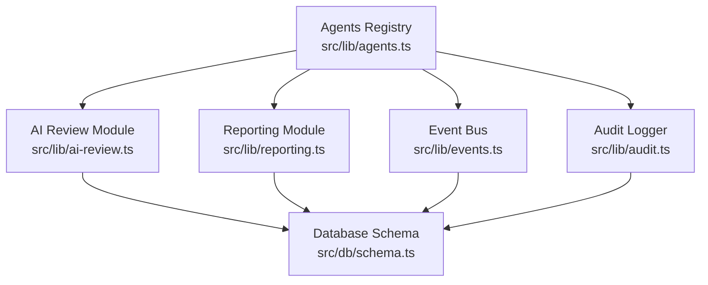
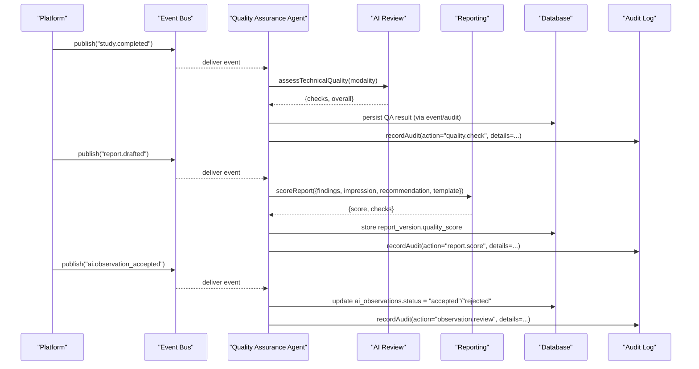
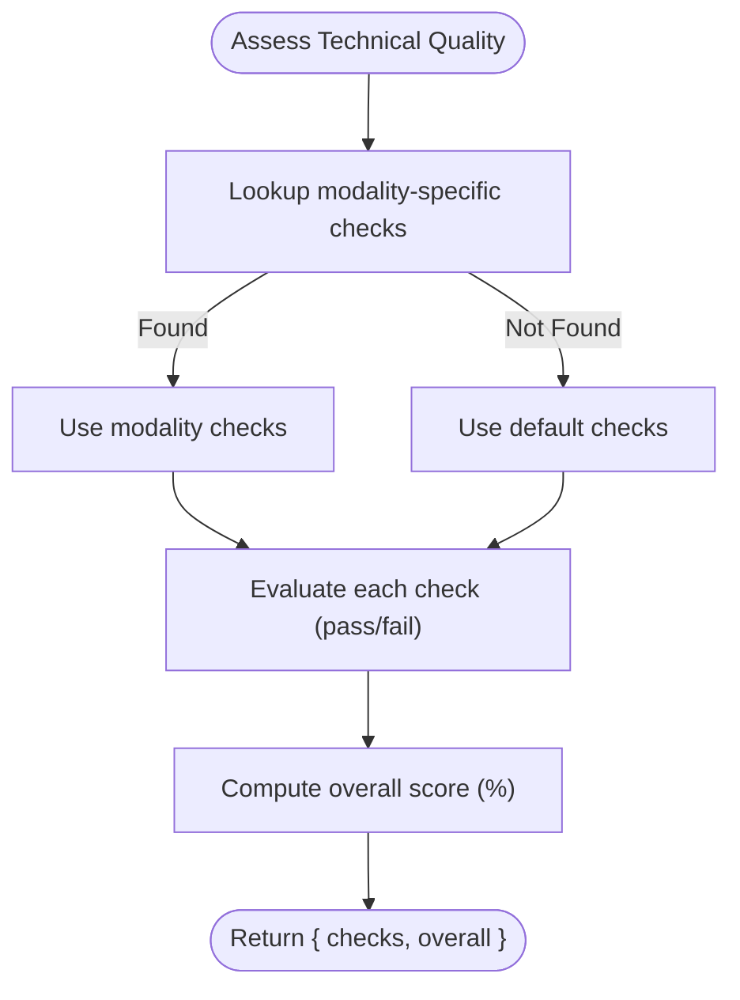
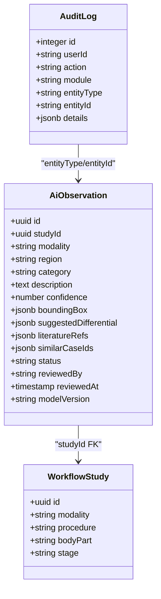
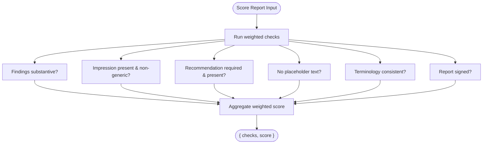
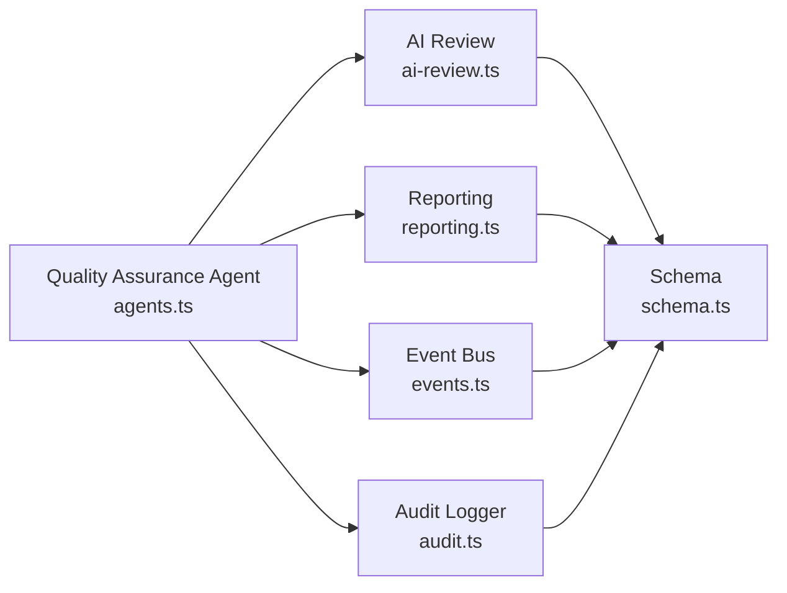
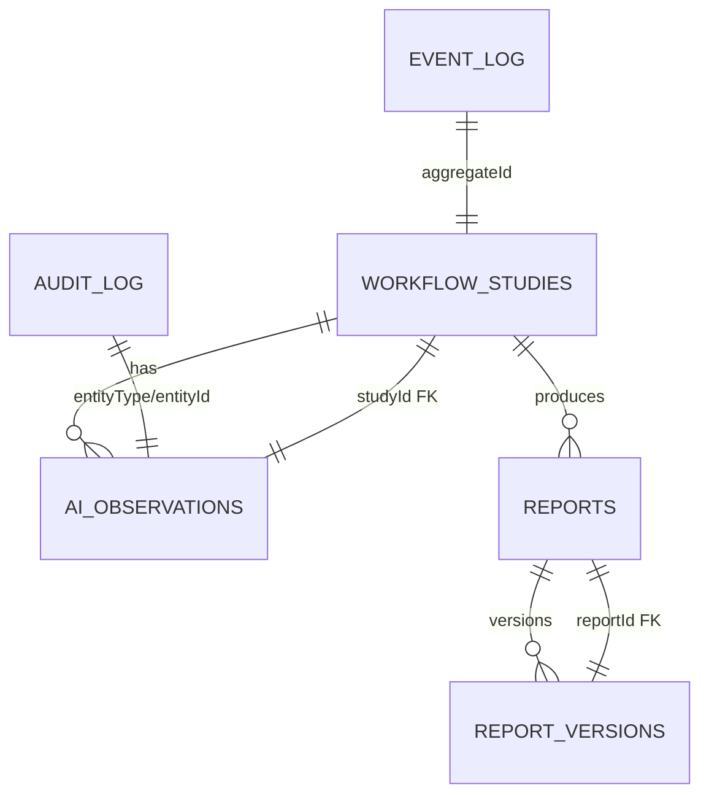

# Quality Assurance Agent

<cite>
**Referenced Files in This Document**
- [agents.ts](file://src/lib/agents.ts)
- [ai-review.ts](file://src/lib/ai-review.ts)
- [reporting.ts](file://src/lib/reporting.ts)
- [events.ts](file://src/lib/events.ts)
- [audit.ts](file://src/lib/audit.ts)
- [schema.ts](file://src/db/schema.ts)
- [ai-review.test.ts](file://__tests__/lib/ai-review.test.ts)
- [reporting.test.ts](file://__tests__/lib/reporting.test.ts)
- [events.test.ts](file://__tests__/lib/events.test.ts)
</cite>

## Table of Contents
1. [Introduction](#introduction)
2. [Project Structure](#project-structure)
3. [Core Components](#core-components)
4. [Architecture Overview](#architecture-overview)
5. [Detailed Component Analysis](#detailed-component-analysis)
6. [Dependency Analysis](#dependency-analysis)
7. [Performance Considerations](#performance-considerations)
8. [Troubleshooting Guide](#troubleshooting-guide)
9. [Conclusion](#conclusion)
10. [Appendices](#appendices)

## Introduction
The Quality Assurance (QA) Agent protects clinical quality by performing structured, audited checks across imaging studies and reports. It enforces modality-specific technical quality, ensures AI observation decisions are reviewed and recorded, scores report quality, and flags deviations from accreditation standards. The agent is event-driven and integrates with the platform’s audit and event systems to maintain a complete, traceable record of every QA action.

## Project Structure
The QA capability spans several modules:
- Agent definition and event subscriptions live in the agents registry.
- Technical quality scoring and AI candidate generation are implemented in the AI review module.
- Report drafting assistance, terminology consistency, and report quality scoring are implemented in the reporting module.
- Event publishing and durable logging are provided by the event bus.
- Audit logging is handled by the audit utility.
- All persistent entities (studies, reports, AI observations, events, audit logs) are defined in the database schema.

**Diagram sources**
- [agents.ts:133-146](file://src/lib/agents.ts#L133-L146)
- [ai-review.ts:34-103](file://src/lib/ai-review.ts#L34-L103)
- [reporting.ts:258-326](file://src/lib/reporting.ts#L258-L326)
- [events.ts:18-60](file://src/lib/events.ts#L18-L60)
- [audit.ts:4-24](file://src/lib/audit.ts#L4-L24)
- [schema.ts:166-455](file://src/db/schema.ts#L166-L455)

**Section sources**
- [agents.ts:133-146](file://src/lib/agents.ts#L133-L146)
- [ai-review.ts:34-103](file://src/lib/ai-review.ts#L34-L103)
- [reporting.ts:258-326](file://src/lib/reporting.ts#L258-L326)
- [events.ts:18-60](file://src/lib/events.ts#L18-L60)
- [audit.ts:4-24](file://src/lib/audit.ts#L4-L24)
- [schema.ts:166-455](file://src/db/schema.ts#L166-L455)

## Core Components
- Quality checklists: Modality-specific technical checks with weights for coverage, artefacts, exposure/parameters, and completeness.
- AI observation audit trail: Every AI-suggested observation must be accepted or rejected; actions are persisted and auditable.
- Report quality scoring: Weighted checks on findings, impression, recommendation presence, placeholder text, terminology consistency, and sign-off state.
- Accreditation standards: Built-in templates and checklists aligned with modality standards; knowledge documents include accreditation-aligned policies.

Key data models used by the QA Agent:
- workflowStudies: study context (modality, procedure, body part, stage).
- ai_observations: AI candidate observations with status and review metadata.
- reports and report_versions: report content, status, and quality score per version.
- event_log: durable event history for study.completed, report.drafted, ai.observation_accepted.
- audit_log: immutable audit trail for QA actions.

**Section sources**
- [ai-review.ts:34-103](file://src/lib/ai-review.ts#L34-L103)
- [reporting.ts:258-326](file://src/lib/reporting.ts#L258-L326)
- [schema.ts:102-119](file://src/db/schema.ts#L102-L119)
- [schema.ts:166-180](file://src/db/schema.ts#L166-L180)
- [schema.ts:330-380](file://src/db/schema.ts#L330-L380)
- [schema.ts:446-455](file://src/db/schema.ts#L446-L455)
- [schema.ts:182-193](file://src/db/schema.ts#L182-L193)

## Architecture Overview
The QA Agent reacts to three core events:
- study.completed: triggers image/study completeness scoring against modality checklists.
- report.drafted: triggers report quality scoring and checklist reminders.
- ai.observation_accepted: verifies acceptance/rejection decisions and records an audit entry.

**Diagram sources**
- [events.ts:18-60](file://src/lib/events.ts#L18-L60)
- [agents.ts:133-146](file://src/lib/agents.ts#L133-L146)
- [ai-review.ts:91-103](file://src/lib/ai-review.ts#L91-L103)
- [reporting.ts:273-290](file://src/lib/reporting.ts#L273-L290)
- [audit.ts:4-24](file://src/lib/audit.ts#L4-L24)
- [schema.ts:330-380](file://src/db/schema.ts#L330-L380)
- [schema.ts:446-455](file://src/db/schema.ts#L446-L455)

## Detailed Component Analysis

### Quality Checklists and Image Completeness Scoring
- Modality-specific checklists define weighted criteria such as coverage, artefacts, exposure/parameters, and completeness.
- The technical quality assessment returns pass/fail per check and an overall percentage.
- Unknown modalities fall back to default checks to ensure consistent evaluation.

**Diagram sources**
- [ai-review.ts:34-103](file://src/lib/ai-review.ts#L34-L103)

Practical example references:
- Modality check definitions and weights: [ai-review.ts:34-83](file://src/lib/ai-review.ts#L34-L83)
- Default fallback checks: [ai-review.ts:85-89](file://src/lib/ai-review.ts#L85-L89)
- Assessment function returning checks and overall: [ai-review.ts:91-103](file://src/lib/ai-review.ts#L91-L103)

**Section sources**
- [ai-review.ts:34-103](file://src/lib/ai-review.ts#L34-L103)
- [ai-review.test.ts:25-63](file://__tests__/lib/ai-review.test.ts#L25-L63)

### AI Observation Audit Trail
- AI generates candidate observations with confidence and suggested differentials; radiologists accept or reject each.
- Accepted/rejected decisions are persisted in ai_observations with reviewer identity and timestamps.
- The QA Agent subscribes to ai.observation_accepted to verify decisions and log audits.

**Diagram sources**
- [schema.ts:358-380](file://src/db/schema.ts#L358-L380)
- [schema.ts:182-193](file://src/db/schema.ts#L182-L193)
- [schema.ts:102-119](file://src/db/schema.ts#L102-L119)

Practical example references:
- Candidate generation and categories: [ai-review.ts:168-220](file://src/lib/ai-review.ts#L168-L220)
- Status transitions and review fields: [schema.ts:358-380](file://src/db/schema.ts#L358-L380)
- Audit recording: [audit.ts:4-24](file://src/lib/audit.ts#L4-L24)

**Section sources**
- [ai-review.ts:168-220](file://src/lib/ai-review.ts#L168-L220)
- [schema.ts:358-380](file://src/db/schema.ts#L358-L380)
- [audit.ts:4-24](file://src/lib/audit.ts#L4-L24)

### Report Quality Scoring and Turnaround Compliance
- Report scoring evaluates findings length, impression quality, recommendation presence, placeholder detection, terminology consistency, and sign-off state.
- Incomplete reports are flagged via isIncomplete for gating workflows.
- Measurements extraction and critical finding detection support downstream QA analytics.

**Diagram sources**
- [reporting.ts:273-290](file://src/lib/reporting.ts#L273-L290)

Practical example references:
- Scoring logic and weights: [reporting.ts:273-290](file://src/lib/reporting.ts#L273-L290)
- Incomplete report flagging: [reporting.ts:292-300](file://src/lib/reporting.ts#L292-L300)
- Measurement extraction: [reporting.ts:302-306](file://src/lib/reporting.ts#L302-L306)
- Critical finding detection: [reporting.ts:308-312](file://src/lib/reporting.ts#L308-L312)
- Terminology drift detection: [reporting.ts:314-326](file://src/lib/reporting.ts#L314-L326)

**Section sources**
- [reporting.ts:273-326](file://src/lib/reporting.ts#L273-L326)
- [reporting.test.ts:60-167](file://__tests__/lib/reporting.test.ts#L60-L167)

### Accreditation Standards Monitoring
- Built-in templates and checklists align with modality best practices and accreditation expectations.
- Knowledge documents include accreditation-aligned policies (e.g., radiation safety, dose reference levels).
- The QA Agent uses these standards to flag deviations during study completion and report drafting.

Practical example references:
- Template structures and checklists: [reporting.ts:25-173](file://src/lib/reporting.ts#L25-L173)
- Accreditation-aligned policy content: [seed-new-modules.ts:98-111](file://src/lib/seed-new-modules.ts#L98-L111)

**Section sources**
- [reporting.ts:25-173](file://src/lib/reporting.ts#L25-L173)
- [seed-new-modules.ts:98-111](file://src/lib/seed-new-modules.ts#L98-L111)

### Memory Scope and Event Subscriptions
- Memory scope: QA history per study, technician, and modality.
- Event subscriptions: study.completed, report.drafted, ai.observation_accepted.
- These enable continuous monitoring and retrospective analysis of quality trends.

Practical example references:
- Agent definition with memory and events: [agents.ts:133-146](file://src/lib/agents.ts#L133-L146)
- Event types including study.completed, report.drafted, ai.observation_accepted: [events.ts:18-60](file://src/lib/events.ts#L18-L60)

**Section sources**
- [agents.ts:133-146](file://src/lib/agents.ts#L133-L146)
- [events.ts:18-60](file://src/lib/events.ts#L18-L60)

## Dependency Analysis
The QA Agent depends on:
- AI Review module for technical quality assessment and candidate generation.
- Reporting module for draft assistance, terminology checks, and quality scoring.
- Event bus for durable event persistence and optional Redis streaming.
- Audit logger for immutable action records.
- Database schema for all persistent entities.

**Diagram sources**
- [agents.ts:133-146](file://src/lib/agents.ts#L133-L146)
- [ai-review.ts:34-103](file://src/lib/ai-review.ts#L34-L103)
- [reporting.ts:258-326](file://src/lib/reporting.ts#L258-L326)
- [events.ts:18-60](file://src/lib/events.ts#L18-L60)
- [audit.ts:4-24](file://src/lib/audit.ts#L4-L24)
- [schema.ts:166-455](file://src/db/schema.ts#L166-L455)

**Section sources**
- [agents.ts:133-146](file://src/lib/agents.ts#L133-L146)
- [ai-review.ts:34-103](file://src/lib/ai-review.ts#L34-L103)
- [reporting.ts:258-326](file://src/lib/reporting.ts#L258-L326)
- [events.ts:18-60](file://src/lib/events.ts#L18-L60)
- [audit.ts:4-24](file://src/lib/audit.ts#L4-L24)
- [schema.ts:166-455](file://src/db/schema.ts#L166-L455)

## Performance Considerations
- Event publishing is resilient: if Redis is unavailable, events are still persisted to the database, ensuring no loss of auditability.
- Technical quality assessment and report scoring are lightweight computations over arrays and strings; complexity is linear in the number of checks and text length.
- Avoid repeated heavy queries by batching QA checks within event handlers and caching modality-specific checklists where appropriate.

[No sources needed since this section provides general guidance]

## Troubleshooting Guide
Common issues and resolutions:
- Missing modality-specific checks: Ensure the modality key exists in the technical checks map; otherwise, default checks apply.
- Low report quality scores: Validate findings length, ensure impression is not generic or copied verbatim, confirm recommendation presence when required, and remove placeholders.
- Terminology drift: Use terminology drift detection to normalize terms to British English and avoid US variants.
- Event persistence failures: Confirm database connectivity; event_log writes are best-effort but essential for audit trails.
- Redis unavailability: The system continues to function without Redis; events are stored in the database.

**Section sources**
- [ai-review.ts:34-103](file://src/lib/ai-review.ts#L34-L103)
- [reporting.ts:273-326](file://src/lib/reporting.ts#L273-L326)
- [events.ts:72-131](file://src/lib/events.ts#L72-L131)
- [events.test.ts:54-75](file://__tests__/lib/events.test.ts#L54-L75)

## Conclusion
The Quality Assurance Agent enforces clinical quality through modality-specific checklists, robust AI observation auditing, comprehensive report quality scoring, and alignment with accreditation standards. Its event-driven design ensures timely reactions to study completion, report drafting, and AI observation decisions, while its audit and event systems provide durable, traceable records for compliance and continuous improvement.

[No sources needed since this section summarizes without analyzing specific files]

## Appendices

### Data Model Relationships Relevant to QA

**Diagram sources**
- [schema.ts:102-119](file://src/db/schema.ts#L102-L119)
- [schema.ts:166-180](file://src/db/schema.ts#L166-L180)
- [schema.ts:330-380](file://src/db/schema.ts#L330-L380)
- [schema.ts:446-455](file://src/db/schema.ts#L446-L455)
- [schema.ts:182-193](file://src/db/schema.ts#L182-L193)