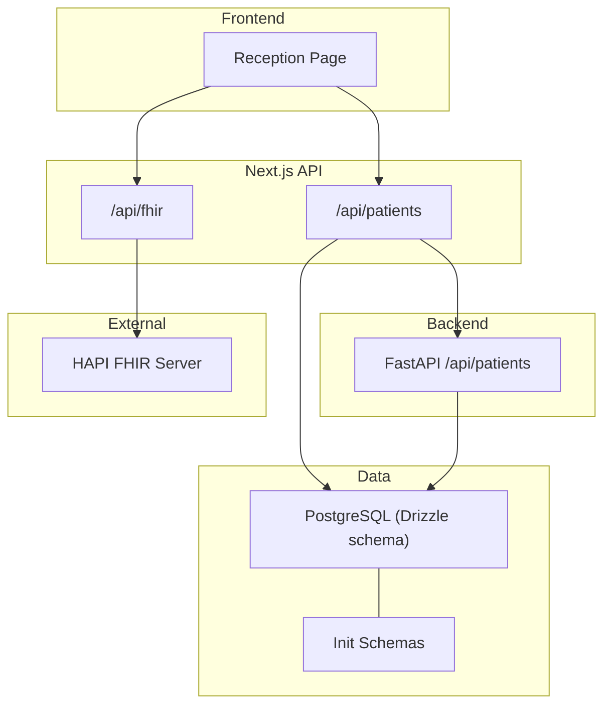
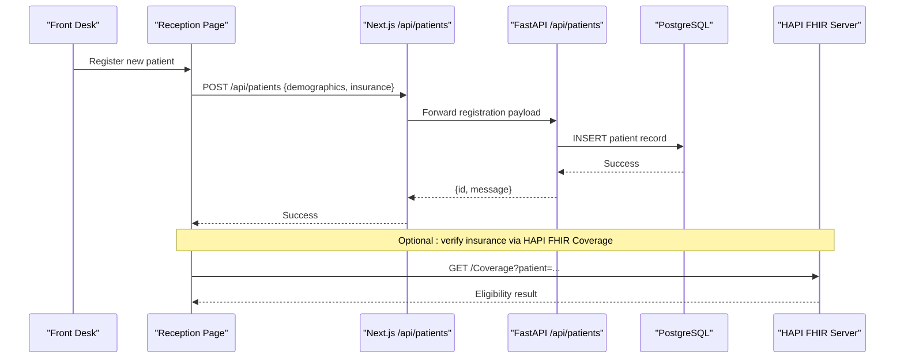
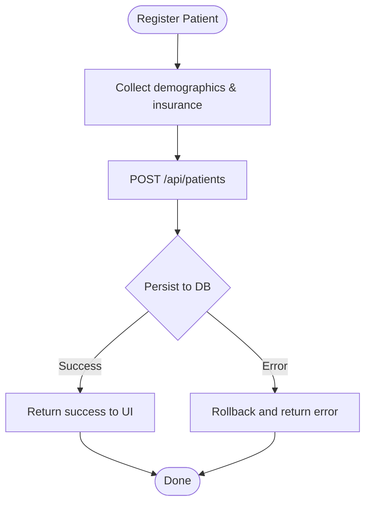
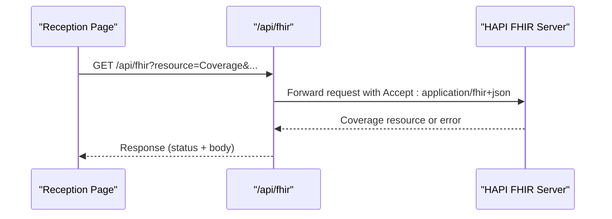
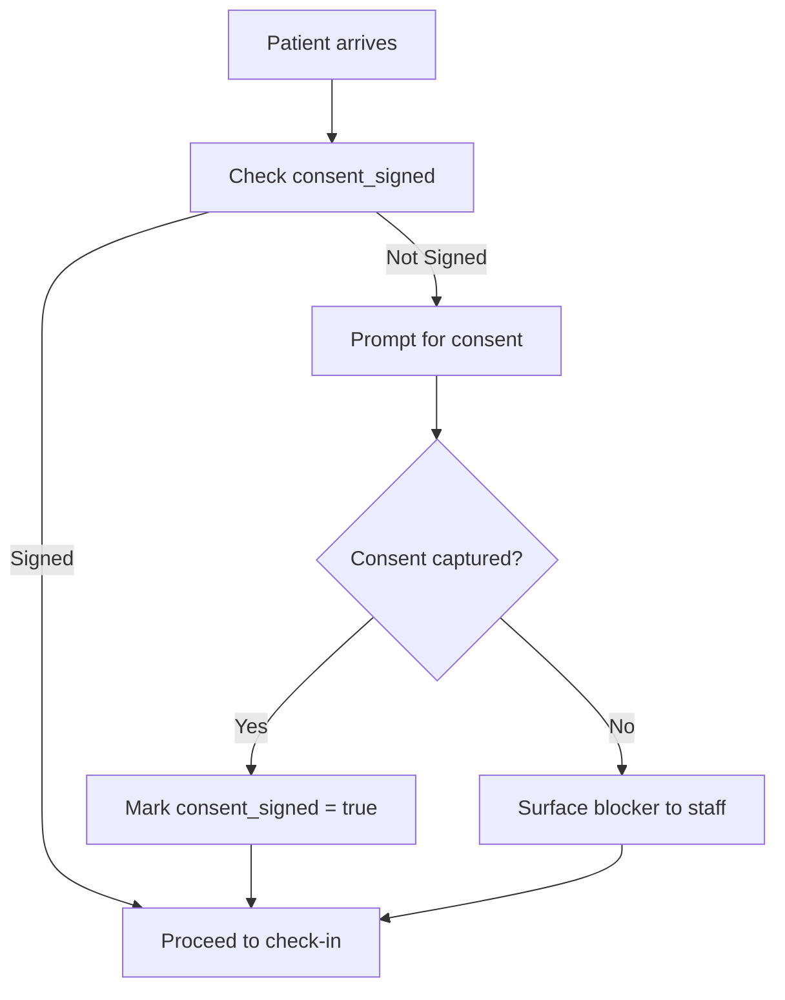
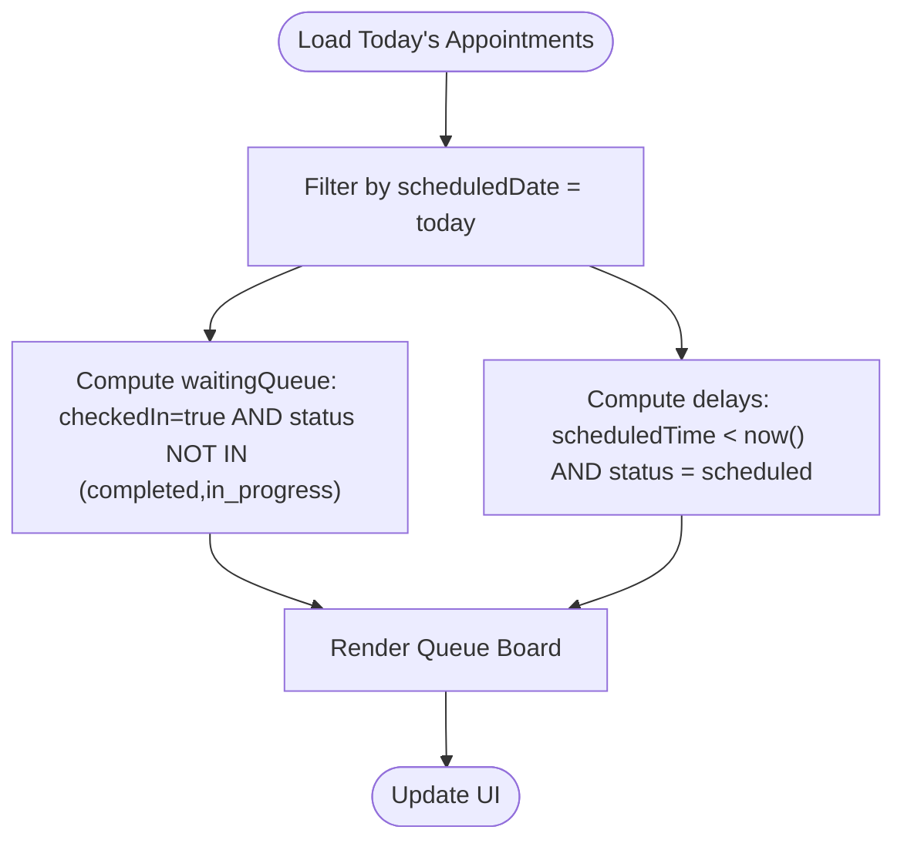
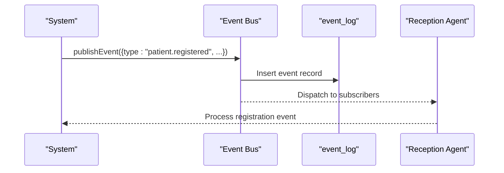
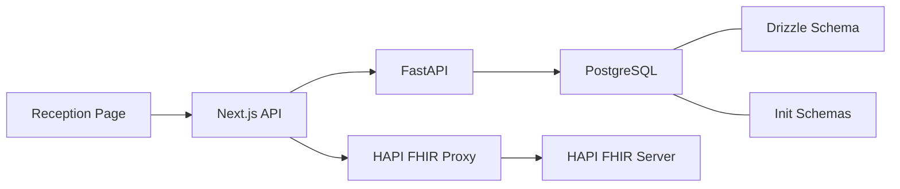

# Reception Agent

<cite>
**Referenced Files in This Document**
- [agents.ts](file://src/lib/agents.ts)
- [events.ts](file://src/lib/events.ts)
- [reception/page.tsx](file://src/app/reception/page.tsx)
- [fhir/route.ts](file://src/app/api/fhir/route.ts)
- [main.py](file://backend/app/main.py)
- [schema.ts](file://src/db/schema.ts)
- [command-centre.ts](file://src/lib/command-centre.ts)
- [init-schemas.sql](file://docker/postgres/init-schemas.sql)
</cite>

## Table of Contents
1. [Introduction](#introduction)
2. [Project Structure](#project-structure)
3. [Core Components](#core-components)
4. [Architecture Overview](#architecture-overview)
5. [Detailed Component Analysis](#detailed-component-analysis)
6. [Dependency Analysis](#dependency-analysis)
7. [Performance Considerations](#performance-considerations)
8. [Troubleshooting Guide](#troubleshooting-guide)
9. [Conclusion](#conclusion)

## Introduction
The Reception Agent orchestrates a frictionless patient journey from registration to the first appointment. It coordinates identity and insurance verification, consent capture, queue management, and blocker surfacing for front desk staff. Its tool set includes the Patient registry, HAPI FHIR Coverage lookup, Consent tracker, and Queue board. It maintains memory of patient contact and insurance history, consent status, and wait-time records, and reacts to key events such as patient.registered, appointment.checked_in, and referral.received.

## Project Structure
The Reception Agent spans several layers:
- Frontend reception UI for registration and queue visibility
- API endpoints for patient registration and FHIR proxying
- Backend FastAPI endpoints for patient and scheduling operations
- Database schemas defining patients, appointments, referrals, and event logs
- Event bus definitions for domain events used by agents

**Diagram sources**
- [reception/page.tsx:59-100](file://src/app/reception/page.tsx#L59-L100)
- [fhir/route.ts:10-38](file://src/app/api/fhir/route.ts#L10-L38)
- [main.py:32-70](file://backend/app/main.py#L32-L70)
- [schema.ts:18-100](file://src/db/schema.ts#L18-L100)
- [init-schemas.sql:22-37](file://docker/postgres/init-schemas.sql#L22-L37)

**Section sources**
- [reception/page.tsx:53-100](file://src/app/reception/page.tsx#L53-L100)
- [fhir/route.ts:10-38](file://src/app/api/fhir/route.ts#L10-L38)
- [main.py:32-70](file://backend/app/main.py#L32-L70)
- [schema.ts:18-100](file://src/db/schema.ts#L18-L100)
- [init-schemas.sql:22-37](file://docker/postgres/init-schemas.sql#L22-L37)

## Core Components
- Tools
  - Patient registry: create and search patients; store demographics, insurance, consent flag
  - HAPI FHIR Coverage lookup: proxy to upstream FHIR server to verify coverage eligibility
  - Consent tracker: persist consent status per patient
  - Queue board: display today’s appointments, waiting queue, and priority
- Memory scope
  - Patient contact and insurance history via patient records
  - Consent status via boolean flags and timestamps where applicable
  - Wait-time records derived from appointment times and statuses
- Events
  - patient.registered
  - appointment.checked_in
  - referral.received
- Responsibilities
  - Verify patient identity and insurance eligibility
  - Manage consent forms and capture patient history
  - Estimate wait times and optimize queue position
  - Surface registration blockers to front desk staff

**Section sources**
- [agents.ts:41-56](file://src/lib/agents.ts#L41-L56)
- [events.ts:19-60](file://src/lib/events.ts#L19-L60)
- [schema.ts:18-100](file://src/db/schema.ts#L18-L100)

## Architecture Overview
The Reception Agent integrates frontend workflows with backend services and external systems:
- Registration flow: Frontend collects patient data, calls Next.js API, which delegates to FastAPI to persist into PostgreSQL.
- Insurance verification: Frontend or agent logic can call the FHIR proxy to query Coverage resources on the HAPI FHIR server.
- Queue management: The reception page queries appointments and filters today’s schedule and waiting queue; command centre utilities compute delays and per-equipment queues.

**Diagram sources**
- [reception/page.tsx:79-100](file://src/app/reception/page.tsx#L79-L100)
- [main.py:32-70](file://backend/app/main.py#L32-L70)
- [fhir/route.ts:10-38](file://src/app/api/fhir/route.ts#L10-L38)

**Section sources**
- [reception/page.tsx:79-100](file://src/app/reception/page.tsx#L79-L100)
- [main.py:32-70](file://backend/app/main.py#L32-L70)
- [fhir/route.ts:10-38](file://src/app/api/fhir/route.ts#L10-L38)

## Detailed Component Analysis

### Patient Registry
- Purpose: Create and search patient records; store demographics, insurance provider and policy number, and consent status.
- Key fields: MRN, name, DOB, gender, phone, email, insurance provider/policy, consent flag, status, timestamps.
- Operations:
  - Register patient via POST /api/patients (Next.js) -> FastAPI -> PostgreSQL
  - Search patients via GET /api/patients with optional query filter
- UI integration: Reception page form submits registration and refreshes patient list.

**Diagram sources**
- [reception/page.tsx:79-100](file://src/app/reception/page.tsx#L79-L100)
- [main.py:32-70](file://backend/app/main.py#L32-L70)
- [schema.ts:18-36](file://src/db/schema.ts#L18-L36)

**Section sources**
- [reception/page.tsx:79-100](file://src/app/reception/page.tsx#L79-L100)
- [main.py:32-70](file://backend/app/main.py#L32-L70)
- [schema.ts:18-36](file://src/db/schema.ts#L18-L36)

### HAPI FHIR Coverage Lookup
- Purpose: Verify insurance eligibility using HAPI FHIR Coverage resources.
- Implementation: Next.js endpoint proxies requests to configured FHIR URL with Accept header; returns upstream responses or errors.
- Usage: Triggered during registration or check-in to validate coverage before proceeding.

**Diagram sources**
- [fhir/route.ts:10-38](file://src/app/api/fhir/route.ts#L10-L38)

**Section sources**
- [fhir/route.ts:10-38](file://src/app/api/fhir/route.ts#L10-L38)

### Consent Tracker
- Purpose: Track whether a patient has signed consent; surface pending consents as blockers.
- Storage: Boolean consent_signed field on patient record; optional timestamp in backend schema.
- Workflow: During registration, prompt for consent; mark as signed when confirmed; show status in registry view.

**Diagram sources**
- [schema.ts:18-36](file://src/db/schema.ts#L18-L36)
- [init-schemas.sql:22-37](file://docker/postgres/init-schemas.sql#L22-L37)

**Section sources**
- [schema.ts:18-36](file://src/db/schema.ts#L18-L36)
- [init-schemas.sql:22-37](file://docker/postgres/init-schemas.sql#L22-L37)

### Queue Board and Wait-Time Estimation
- Purpose: Display today’s appointments, identify waiting queue, and estimate delays.
- Logic:
  - Filter today’s appointments by scheduled date
  - Identify waiting queue as checked-in but not completed/in_progress
  - Compute delay minutes for overdue scheduled appointments
  - Show per-equipment waiting and in-progress counts
- UI: Reception page tabs for Patient Registry and Today’s Queue; badges for priority and status.

**Diagram sources**
- [reception/page.tsx:102-112](file://src/app/reception/page.tsx#L102-L112)
- [command-centre.ts:72-132](file://src/lib/command-centre.ts#L72-L132)

**Section sources**
- [reception/page.tsx:102-112](file://src/app/reception/page.tsx#L102-L112)
- [command-centre.ts:72-132](file://src/lib/command-centre.ts#L72-L132)

### Event Subscriptions
- The platform defines an event bus that persists events to both Redis Streams (when available) and a durable event_log table.
- Relevant event types include patient.registered, appointment.checked_in, and referral.received.
- Agents declare their reactions to these events; the Reception Agent is defined to react to these three events.

**Diagram sources**
- [events.ts:19-60](file://src/lib/events.ts#L19-L60)
- [events.ts:101-131](file://src/lib/events.ts#L101-L131)
- [agents.ts:41-56](file://src/lib/agents.ts#L41-L56)

**Section sources**
- [events.ts:19-60](file://src/lib/events.ts#L19-L60)
- [events.ts:101-131](file://src/lib/events.ts#L101-L131)
- [agents.ts:41-56](file://src/lib/agents.ts#L41-L56)

### Practical Examples

#### Example 1: Patient Registration Workflow
- Steps:
  - Front desk opens the Reception page and clicks Register Patient
  - Enters required demographics and optional insurance details
  - Submits form to POST /api/patients
  - Next.js forwards to FastAPI, which inserts into PostgreSQL
  - UI refreshes patient list and shows new entry
- Blockers:
  - If consent is missing, prompt and capture before proceeding
  - If insurance verification fails via FHIR, alert staff to resolve coverage issues

**Section sources**
- [reception/page.tsx:79-100](file://src/app/reception/page.tsx#L79-L100)
- [main.py:32-70](file://backend/app/main.py#L32-L70)
- [schema.ts:18-36](file://src/db/schema.ts#L18-L36)

#### Example 2: Insurance Verification Through HAPI FHIR Integration
- Steps:
  - After registration or at check-in, trigger a Coverage lookup
  - Call GET /api/fhir?resource=Coverage with relevant parameters
  - Receive eligibility response from HAPI FHIR server
  - Use result to confirm or block further processing based on coverage status
- Error handling:
  - If FHIR is unreachable, return appropriate error and notify staff

**Section sources**
- [fhir/route.ts:10-38](file://src/app/api/fhir/route.ts#L10-L38)

#### Example 3: Queue Management Optimization
- Steps:
  - Load today’s appointments and compute waiting queue
  - Identify delayed appointments by comparing scheduled time to current time
  - Display per-equipment waiting and in-progress counts
  - Prioritize STAT and urgent patients visually with badges
- Actions:
  - Move STAT patients forward in queue
  - Alert staff about overdue appointments and equipment downtime

**Section sources**
- [reception/page.tsx:102-112](file://src/app/reception/page.tsx#L102-L112)
- [command-centre.ts:72-132](file://src/lib/command-centre.ts#L72-L132)

## Dependency Analysis
- Frontend depends on:
  - Next.js API routes for patient operations and FHIR proxy
  - UI components for tables, dialogs, and badges
- Backend depends on:
  - PostgreSQL via SQLAlchemy sessions
  - CORS middleware for cross-origin requests
- Data layer depends on:
  - Drizzle ORM schema definitions
  - Init SQL scripts for multi-schema setup
- External dependencies:
  - HAPI FHIR server for Coverage lookups
  - Optional Redis for event streaming

**Diagram sources**
- [reception/page.tsx:59-100](file://src/app/reception/page.tsx#L59-L100)
- [fhir/route.ts:10-38](file://src/app/api/fhir/route.ts#L10-L38)
- [main.py:32-70](file://backend/app/main.py#L32-L70)
- [schema.ts:18-100](file://src/db/schema.ts#L18-L100)
- [init-schemas.sql:22-37](file://docker/postgres/init-schemas.sql#L22-L37)

**Section sources**
- [reception/page.tsx:59-100](file://src/app/reception/page.tsx#L59-L100)
- [fhir/route.ts:10-38](file://src/app/api/fhir/route.ts#L10-L38)
- [main.py:32-70](file://backend/app/main.py#L32-L70)
- [schema.ts:18-100](file://src/db/schema.ts#L18-L100)
- [init-schemas.sql:22-37](file://docker/postgres/init-schemas.sql#L22-L37)

## Performance Considerations
- Minimize redundant queries by caching today’s appointments and patient lists in the UI state
- Use efficient filtering on the client side for waiting queue computation
- Ensure FHIR proxy timeouts are reasonable to avoid blocking user interactions
- Leverage database indexes on frequently queried fields like scheduled_date and status for faster queue computations

[No sources needed since this section provides general guidance]

## Troubleshooting Guide
- Registration failures:
  - Check FastAPI error responses and database constraints
  - Validate input fields and ensure required data is present
- FHIR connectivity issues:
  - Verify FHIR_URL configuration and network reachability
  - Inspect proxy error messages for upstream unavailability
- Queue anomalies:
  - Confirm appointment statuses and checked-in flags
  - Review delay calculations against current time and scheduled times
- Event persistence:
  - Ensure event_log writes succeed even if Redis is unavailable
  - Audit recent events to trace workflow steps

**Section sources**
- [main.py:32-70](file://backend/app/main.py#L32-L70)
- [fhir/route.ts:10-38](file://src/app/api/fhir/route.ts#L10-L38)
- [events.ts:101-131](file://src/lib/events.ts#L101-L131)

## Conclusion
The Reception Agent provides a cohesive, event-driven foundation for managing patient registration, insurance verification, consent tracking, and queue optimization. By integrating the Patient registry, HAPI FHIR Coverage lookup, Consent tracker, and Queue board, it ensures a smooth experience from arrival to first appointment while surfacing blockers to front desk staff for timely resolution.

[No sources needed since this section summarizes without analyzing specific files]