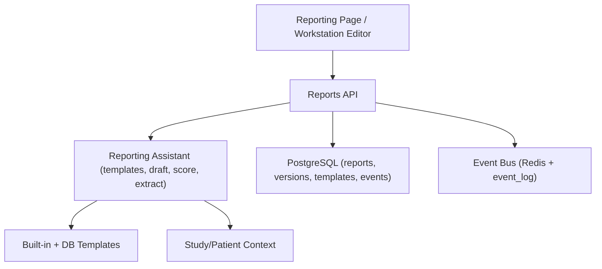
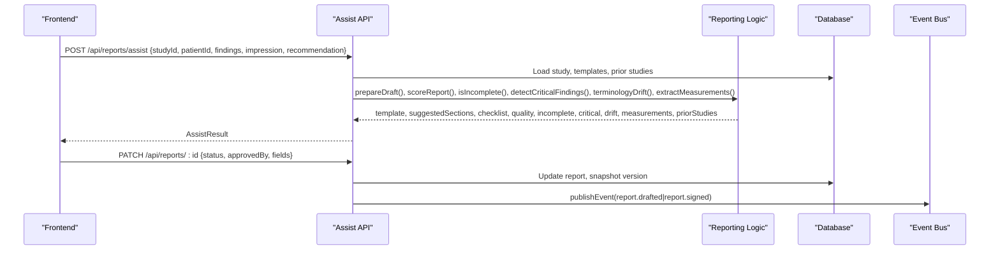
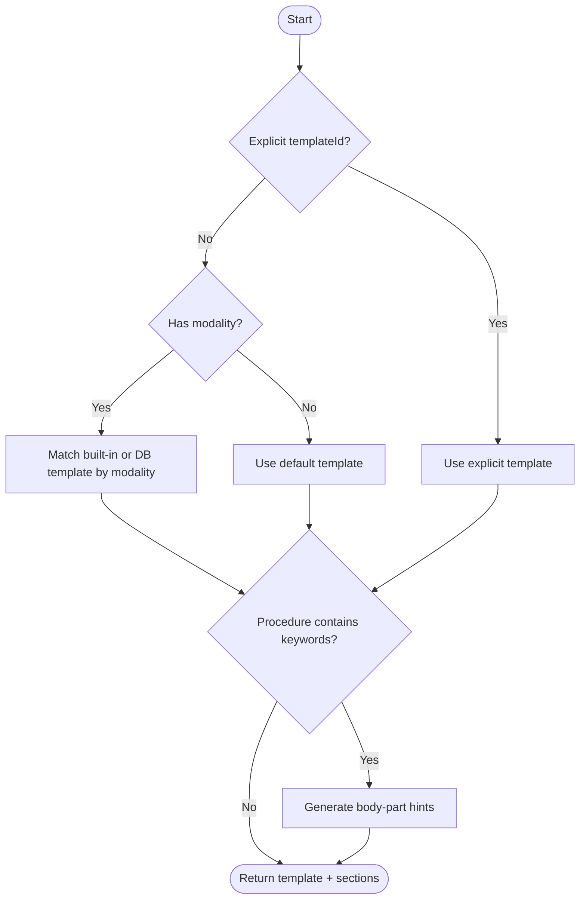
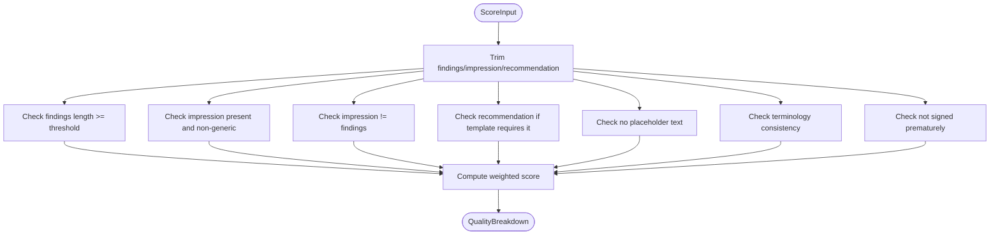
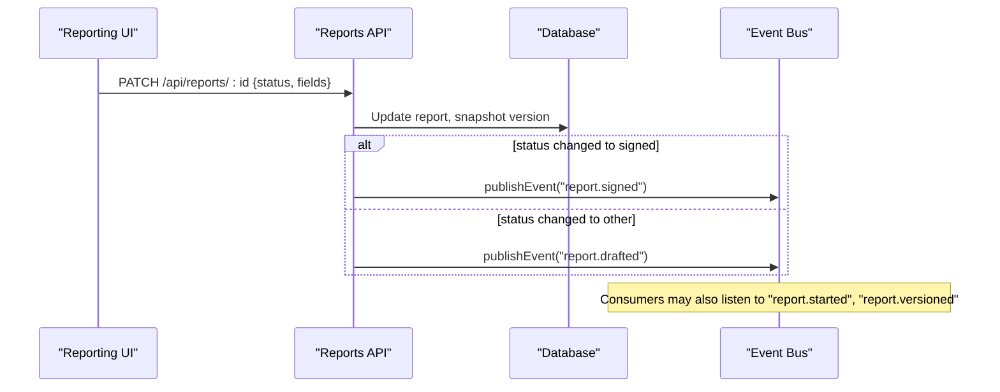
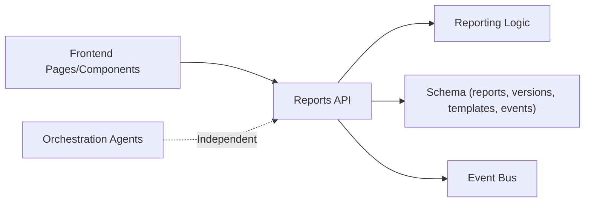
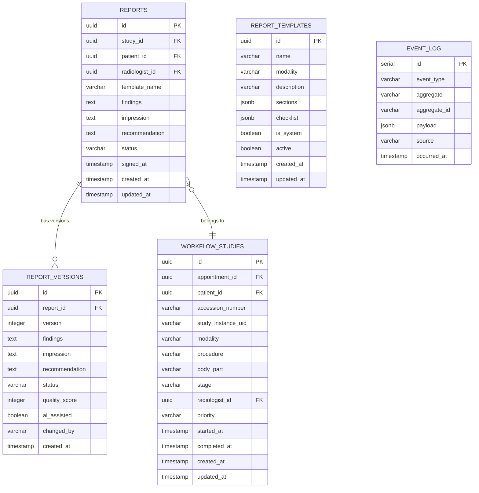

# Reporting Agent

<cite>
**Referenced Files in This Document**
- [reporting.ts](file://src/lib/reporting.ts)
- [events.ts](file://src/lib/events.ts)
- [assist route.ts](file://src/app/api/reports/assist/route.ts)
- [templates route.ts](file://src/app/api/reports/templates/route.ts)
- [reports route.ts](file://src/app/api/reports/route.ts)
- [report detail route.ts](file://src/app/api/reports/[id]/route.ts)
- [versions route.ts](file://src/app/api/reports/[id]/versions/route.ts)
- [schema.ts](file://src/db/schema.ts)
- [reporting page.tsx](file://src/app/reporting/page.tsx)
- [report editor.tsx](file://src/components/workstation/report-editor.tsx)
- [orchestration.py](file://backend/app/agents/orchestration.py)
- [langgraph_agent.py](file://services/langgraph_agent.py)
- [reporting.test.ts](file://__tests__/lib/reporting.test.ts)
</cite>

## Table of Contents
1. Introduction
2. Project Structure
3. Core Components
4. Architecture Overview
5. Detailed Component Analysis
6. Dependency Analysis
7. Performance Considerations
8. Troubleshooting Guide
9. Conclusion
10. Appendices

## Introduction
The Reporting Agent is a decision-support tool for radiologists that assists with structured, consistent, high-quality reports without issuing diagnoses or finalising reports. It provides:
- Structured templates tailored to modalities and procedures
- Prior-study comparison context
- Measurement extraction from free text
- Quality scoring and checklist reminders
- Critical finding detection and terminology consistency enforcement

It operates under strict guardrails: every AI suggestion requires radiologist confirmation; the agent never signs or releases a report automatically.

## Project Structure
The Reporting Agent spans frontend UI, backend APIs, domain logic, database schema, and event infrastructure:
- Domain logic: template selection, drafting assistance, quality scoring, measurement extraction, critical findings detection, terminology drift checks
- API layer: assist endpoint, templates listing, report CRUD, version history
- Persistence: reports, versions, templates, events
- Event bus: durable event log and optional Redis stream for real-time consumers
- Frontend: reporting workspace and workstation editor integrating assist, versions, prior reports, audit, and sign-off flows

**Diagram sources**
- [reporting.ts:25-173](file://src/lib/reporting.ts#L25-L173)
- [assist route.ts:29-116](file://src/app/api/reports/assist/route.ts#L29-L116)
- [schema.ts:167-356](file://src/db/schema.ts#L167-L356)
- [events.ts:101-131](file://src/lib/events.ts#L101-L131)

**Section sources**
- [reporting.ts:1-326](file://src/lib/reporting.ts#L1-L326)
- [assist route.ts:1-117](file://src/app/api/reports/assist/route.ts#L1-L117)
- [schema.ts:167-356](file://src/db/schema.ts#L167-L356)
- [events.ts:1-158](file://src/lib/events.ts#L1-L158)

## Core Components
- Template engine: built-in modality-specific templates merged with active DB-defined templates
- Draft assistant: recommends matching templates and prepares structured shells with body-part hints
- Quality scorer: weighted checks across findings, impression, recommendation, placeholders, terminology, and completeness
- Measurement extractor: pulls numeric measurements with units from free text
- Critical findings detector: flags urgent terms for visual highlighting
- Terminology normaliser: detects non-canonical terms and suggests British English equivalents
- Versioning and audit: snapshots previous content on updates; logs actions and status transitions
- Event publishing: emits report lifecycle events for downstream consumers

**Section sources**
- [reporting.ts:25-173](file://src/lib/reporting.ts#L25-L173)
- [reporting.ts:233-326](file://src/lib/reporting.ts#L233-L326)
- [assist route.ts:45-116](file://src/app/api/reports/assist/route.ts#L45-L116)
- [report detail route.ts:47-124](file://src/app/api/reports/[id]/route.ts#L47-L124)
- [schema.ts:167-356](file://src/db/schema.ts#L167-L356)
- [events.ts:19-60](file://src/lib/events.ts#L19-L60)

## Architecture Overview
The Reporting Agent follows an event-driven, layered architecture:
- Frontend components call the assist API to receive recommendations, quality metrics, and contextual data
- The assist API resolves study context, selects templates, runs quality checks, extracts measurements, detects critical terms, and returns prior studies
- Report mutations update the current report and persist a version snapshot; status changes emit events
- Consumers can subscribe to report lifecycle events via the event bus

**Diagram sources**
- [assist route.ts:29-116](file://src/app/api/reports/assist/route.ts#L29-L116)
- [reporting.ts:233-326](file://src/lib/reporting.ts#L233-L326)
- [report detail route.ts:47-124](file://src/app/api/reports/[id]/route.ts#L47-L124)
- [events.ts:101-131](file://src/lib/events.ts#L101-L131)

## Detailed Component Analysis

### Template Recommendation Algorithm
- Explicit template ID takes precedence
- Otherwise matches by modality using built-in templates first, then active DB templates
- If no match, falls back to default template
- Procedure keywords generate body-part hints to guide review focus

**Diagram sources**
- [assist route.ts:45-64](file://src/app/api/reports/assist/route.ts#L45-L64)
- [reporting.ts:233-256](file://src/lib/reporting.ts#L233-L256)

**Section sources**
- [reporting.ts:233-256](file://src/lib/reporting.ts#L233-L256)
- [assist route.ts:45-64](file://src/app/api/reports/assist/route.ts#L45-L64)

### Draft Assistance and Structured Sections
- Returns recommended template, suggested sections, checklist, body-part hints, and a reminder that this is decision support only
- Integrates with prior-study list retrieval when patientId is provided

**Section sources**
- [reporting.ts:215-256](file://src/lib/reporting.ts#L215-L256)
- [assist route.ts:78-91](file://src/app/api/reports/assist/route.ts#L78-L91)

### Quality Scoring Mechanism
- Weighted checks evaluate:
  - Findings length threshold
  - Impression presence and non-generic content
  - Impression not identical to findings
  - Recommendation present when required by template
  - No placeholder text left behind
  - Terminology consistency (British English)
  - Report not signed prematurely
- Produces a percentage score and per-check pass/fail details

**Diagram sources**
- [reporting.ts:273-290](file://src/lib/reporting.ts#L273-L290)

**Section sources**
- [reporting.ts:258-290](file://src/lib/reporting.ts#L258-L290)
- [reporting.test.ts:60-93](file://__tests__/lib/reporting.test.ts#L60-L93)

### Incomplete Report Flagging
- Reuses scoring checks to list specific issues preventing completion
- Used by the UI to highlight missing or insufficient sections

**Section sources**
- [reporting.ts:292-300](file://src/lib/reporting.ts#L292-L300)

### Measurement Extraction
- Extracts numeric measurements with units (mm, cm, mL) from free text
- Deduplicates results and limits output size

**Section sources**
- [reporting.ts:302-306](file://src/lib/reporting.ts#L302-L306)
- [reporting.test.ts:95-116](file://__tests__/lib/reporting.test.ts#L95-L116)

### Critical Findings Detection
- Scans combined draft text for critical terms to prompt verification before signing
- Highlights detected terms in the UI

**Section sources**
- [reporting.ts:198-213](file://src/lib/reporting.ts#L198-L213)
- [reporting.ts:308-312](file://src/lib/reporting.ts#L308-L312)
- [reporting.test.ts:118-138](file://__tests__/lib/reporting.test.ts#L118-L138)

### Terminology Consistency Enforcement
- Detects non-canonical terms and suggests canonical forms (e.g., US to British English)
- Uses word-boundary matching to avoid false positives

**Section sources**
- [reporting.ts:177-196](file://src/lib/reporting.ts#L177-L196)
- [reporting.ts:314-325](file://src/lib/reporting.ts#L314-L325)
- [reporting.test.ts:140-156](file://__tests__/lib/reporting.test.ts#L140-L156)

### Memory Scope: Report Version History, Template Preferences, Terminology
- Version history: each save snapshots previous content into report_versions with metadata including quality score and change author
- Template preferences: templates are selected per study/report; UI allows manual override; assist auto-selects based on modality
- Terminology consistency: enforced at assist time and reflected in quality scoring; suggestions are presented but not auto-applied

**Section sources**
- [schema.ts:331-356](file://src/db/schema.ts#L331-L356)
- [versions route.ts:8-21](file://src/app/api/reports/[id]/versions/route.ts#L8-L21)
- [reporting page.tsx:151-168](file://src/app/reporting/page.tsx#L151-L168)
- [reporting page.tsx:461-479](file://src/app/reporting/page.tsx#L461-L479)

### Event Subscriptions: report.started, report.drafted, report.versioned, report.signed
- Event types are defined centrally and include report lifecycle events
- Status transitions emit report.drafted and report.signed; versioning is persisted and queryable
- report.started and report.versioned are available for consumers to subscribe to

**Diagram sources**
- [events.ts:19-60](file://src/lib/events.ts#L19-L60)
- [report detail route.ts:107-124](file://src/app/api/reports/[id]/route.ts#L107-L124)

**Section sources**
- [events.ts:19-60](file://src/lib/events.ts#L19-L60)
- [report detail route.ts:107-124](file://src/app/api/reports/[id]/route.ts#L107-L124)

### Four Core Responsibilities
- Recommend matching structured templates for studies: implemented via template resolution and procedure-based hints
- Draft findings/impression structure for radiologist editing: returns suggested sections and checklist; UI renders editable fields
- Flag critical findings and incomplete sections: critical term detection and incomplete check aggregation
- Score draft quality while reminding about checklists: weighted scoring and checklist display

**Section sources**
- [reporting.ts:233-326](file://src/lib/reporting.ts#L233-L326)
- [assist route.ts:64-116](file://src/app/api/reports/assist/route.ts#L64-L116)
- [reporting page.tsx:553-659](file://src/app/reporting/page.tsx#L553-L659)

### Practical Examples
- Template recommendation algorithm: see flow above and implementation paths
- Quality scoring mechanism: weighted checks produce a percentage and per-check status
- Terminology consistency enforcement: detects non-canonical terms and suggests canonical forms

**Section sources**
- [reporting.ts:233-326](file://src/lib/reporting.ts#L233-L326)
- [reporting.test.ts:60-156](file://__tests__/lib/reporting.test.ts#L60-L156)

## Dependency Analysis
- Frontend depends on:
  - Reports API for assist, templates, report CRUD, and version history
  - Reporting logic indirectly via API responses
- Backend depends on:
  - Database schema for reports, versions, templates, events
  - Event bus for durable event logging and optional Redis streaming
- Orchestration agents (LangGraph) exist separately and do not directly depend on reporting logic in this codebase

**Diagram sources**
- [assist route.ts:1-117](file://src/app/api/reports/assist/route.ts#L1-L117)
- [schema.ts:167-356](file://src/db/schema.ts#L167-L356)
- [events.ts:101-131](file://src/lib/events.ts#L101-L131)
- [orchestration.py:1-134](file://backend/app/agents/orchestration.py#L1-L134)
- [langgraph_agent.py:1-35](file://services/langgraph_agent.py#L1-L35)

**Section sources**
- [assist route.ts:1-117](file://src/app/api/reports/assist/route.ts#L1-L117)
- [schema.ts:167-356](file://src/db/schema.ts#L167-L356)
- [events.ts:101-131](file://src/lib/events.ts#L101-L131)
- [orchestration.py:1-134](file://backend/app/agents/orchestration.py#L1-L134)
- [langgraph_agent.py:1-35](file://services/langgraph_agent.py#L1-L35)

## Performance Considerations
- Template resolution is O(n) over built-in and active DB templates; acceptable given small template sets
- Quality scoring performs constant-time checks over fixed thresholds; efficient
- Measurement extraction uses regex scanning; limited to top results to avoid heavy processing
- Event publishing is best-effort for Redis with durable fallback to event_log; minimizes blocking
- Version snapshots occur on updates; ensure indexing on report_id for fast version queries

[No sources needed since this section provides general guidance]

## Troubleshooting Guide
- Assist API returns invalid body: validate request payload includes required fields like studyId or patientId when needed
- Signing fails without approvedBy: ensure radiologist role and explicit approval are provided
- No prior studies returned: verify patientId is passed and workflow_studies has records for the patient
- Quality score low: check findings length, impression uniqueness, recommendation presence, placeholder text, and terminology consistency
- Terminology drift warnings: replace flagged terms with canonical forms suggested by the assistant

**Section sources**
- [assist route.ts:29-31](file://src/app/api/reports/assist/route.ts#L29-L31)
- [report detail route.ts:55-72](file://src/app/api/reports/[id]/route.ts#L55-L72)
- [reporting.ts:273-326](file://src/lib/reporting.ts#L273-L326)

## Conclusion
The Reporting Agent provides robust decision support for radiologists through structured templates, draft assistance, quality scoring, measurement extraction, critical findings detection, and terminology consistency. It enforces safety by requiring explicit radiologist confirmation for any finalisation and maintains full auditability via versioning and event logging.

[No sources needed since this section summarizes without analyzing specific files]

## Appendices

### Data Models Relevant to Reporting

**Diagram sources**
- [schema.ts:167-356](file://src/db/schema.ts#L167-L356)
- [schema.ts:447-455](file://src/db/schema.ts#L447-L455)