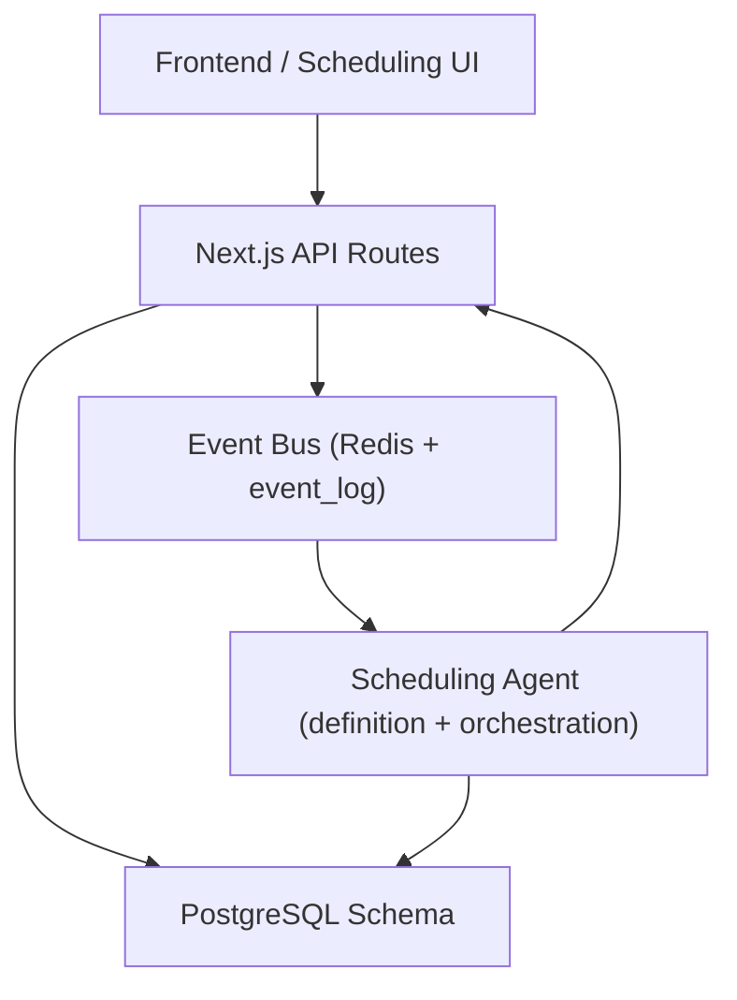
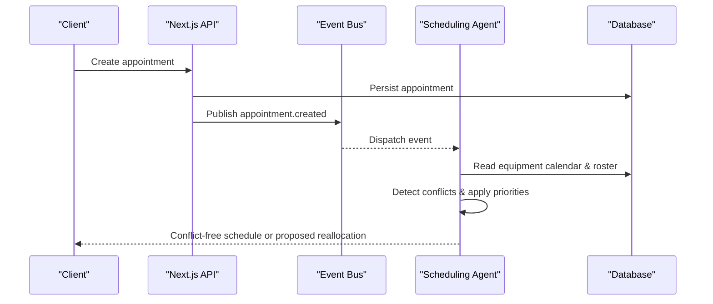
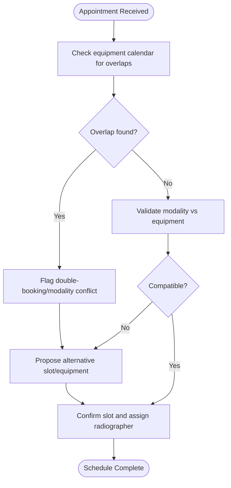
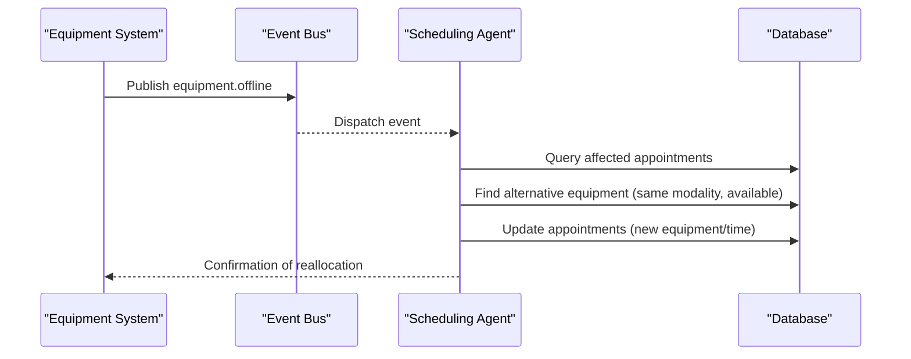
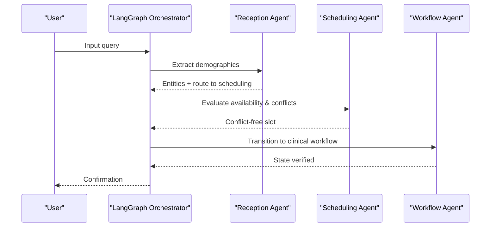
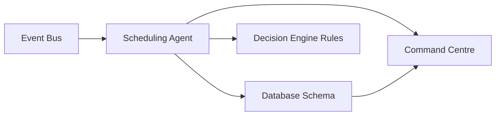

# Scheduling Agent

<cite>
**Referenced Files in This Document**
- [agents.ts](file://src/lib/agents.ts)
- [events.ts](file://src/lib/events.ts)
- [orchestration.py](file://backend/app/agents/orchestration.py)
- [main.py](file://backend/app/main.py)
- [schema.ts](file://src/db/schema.ts)
- [init-schemas.sql](file://docker/postgres/init-schemas.sql)
- [route.ts (appointments)](file://src/app/api/appointments/route.ts)
- [route.ts (events)](file://src/app/api/events/route.ts)
- [decision-engine.ts](file://src/lib/decision-engine.ts)
- [command-centre.ts](file://src/lib/command-centre.ts)
- [seed route.ts](file://src/app/api/seed/route.ts)
</cite>

## Table of Contents
1. [Introduction](#introduction)
2. [Project Structure](#project-structure)
3. [Core Components](#core-components)
4. [Architecture Overview](#architecture-overview)
5. [Detailed Component Analysis](#detailed-component-analysis)
6. [Dependency Analysis](#dependency-analysis)
7. [Performance Considerations](#performance-considerations)
8. [Troubleshooting Guide](#troubleshooting-guide)
9. [Conclusion](#conclusion)

## Introduction
This document specifies the Scheduling Agent, an operational agent dedicated to optimizing machine and radiographer allocation so that no appointment slot is wasted. It defines the agent’s tool set, memory scope, event subscriptions, and four core responsibilities: detecting double-booking and modality conflicts, applying priority-based allocation (STAT → urgent → routine), reallocating slots when equipment goes offline, and balancing radiographer workload across sessions. It also provides practical examples for conflict resolution, priority scheduling algorithms, and dynamic reassignment workflows.

## Project Structure
The Scheduling Agent spans multiple layers:
- Definition and routing: agent metadata and dispatch logic
- Event bus: durable event publishing and consumption
- Backend API: appointment creation and persistence
- Database schema: appointments, equipment, staff, and workflow tables
- Decision engine: business rules governing reallocation and STAT usage
- Command centre: operational risk signals used by the agent

**Diagram sources**
- [agents.ts:57-70](file://src/lib/agents.ts#L57-L70)
- [events.ts:101-131](file://src/lib/events.ts#L101-L131)
- [main.py:75-102](file://backend/app/main.py#L75-L102)
- [schema.ts:82-100](file://src/db/schema.ts#L82-L100)

**Section sources**
- [agents.ts:57-70](file://src/lib/agents.ts#L57-L70)
- [events.ts:101-131](file://src/lib/events.ts#L101-L131)
- [main.py:75-102](file://backend/app/main.py#L75-L102)
- [schema.ts:82-100](file://src/db/schema.ts#L82-L100)

## Core Components
- Tools: Appointment ledger, Equipment calendar, Radiographer roster, Priority rules
- Memory: Slot utilisation history, conflict records, no-show patterns
- Events: appointment.created, appointment.delayed, equipment.offline, equipment.online
- Responsibilities:
  - Detect double-booking and modality conflicts
  - Apply STAT → urgent → routine priority allocation
  - Reallocate slots when machines go offline
  - Balance radiographer workload across sessions

These are explicitly declared in the agent definition and supported by the event bus and decision engine rules.

**Section sources**
- [agents.ts:57-70](file://src/lib/agents.ts#L57-L70)
- [events.ts:19-60](file://src/lib/events.ts#L19-L60)
- [decision-engine.ts:63-83](file://src/lib/decision-engine.ts#L63-L83)

## Architecture Overview
The Scheduling Agent participates in an event-driven architecture:
- When an appointment is created or delayed, or equipment status changes, events are published to a Redis stream and persisted to the event_log table.
- The agent consumes these events to detect conflicts, apply priorities, propose reallocations, and balance workloads.
- All state changes flow through the decision engine, ensuring safety and auditability.

**Diagram sources**
- [events.ts:101-131](file://src/lib/events.ts#L101-L131)
- [main.py:75-102](file://backend/app/main.py#L75-L102)
- [agents.ts:57-70](file://src/lib/agents.ts#L57-L70)

## Detailed Component Analysis

### Tool Set
- Appointment ledger: Central record of scheduled, checked-in, and completed appointments with modality, duration, priority, and assigned resources.
- Equipment calendar: Tracks equipment availability, status (operational/offline/maintenance), and utilization rate.
- Radiographer roster: Staff assignments and roles enabling workload balancing.
- Priority rules: Enforce STAT > urgent > routine ordering; restrict STAT to scheduling/workflow contexts; require equipment context for reallocation.

Practical example:
- A STAT CT Chest appointment arrives while a routine MRI Knee is booked on the same time slot. The agent detects the conflict, prioritizes the STAT case, and proposes moving the routine MRI to the next available slot on a compatible modality.

**Section sources**
- [schema.ts:53-100](file://src/db/schema.ts#L53-L100)
- [decision-engine.ts:63-83](file://src/lib/decision-engine.ts#L63-L83)
- [seed route.ts:128-139](file://src/app/api/seed/route.ts#L128-L139)

### Memory Scope
- Slot utilisation history: Aggregated counts and trends per equipment/modality to inform future allocations.
- Conflict records: Logs of detected double-bookings and modality mismatches for auditing and learning.
- No-show patterns: Historical attendance data to adjust buffer times and overbooking strategies.

Operational impact:
- The command centre surfaces offline equipment and delays, feeding back into the agent’s memory for smarter rescheduling.

**Section sources**
- [command-centre.ts:154-165](file://src/lib/command-centre.ts#L154-L165)
- [agents.ts:187-210](file://src/lib/agents.ts#L187-L210)

### Event Subscriptions
The Scheduling Agent subscribes to:
- appointment.created: Trigger conflict detection and priority-based placement.
- appointment.delayed: Adjust downstream schedules and notify stakeholders.
- equipment.offline: Initiate reallocation of affected appointments to available equipment.
- equipment.online: Resume normal scheduling and release any temporary holds.

Event publishing ensures durability via both Redis Streams and the event_log table.

**Section sources**
- [agents.ts:57-70](file://src/lib/agents.ts#L57-L70)
- [events.ts:19-60](file://src/lib/events.ts#L19-L60)
- [events.ts:101-131](file://src/lib/events.ts#L101-L131)

### Responsibility 1: Detect Double-Booking and Modality Conflicts
- Double-booking: Two appointments overlapping on the same equipment within their duration windows.
- Modality conflict: An appointment requesting a modality not supported by the assigned equipment.

Algorithm outline:
- On appointment creation or delay, query the equipment calendar for overlapping slots.
- Validate modality compatibility against equipment capabilities.
- If conflicts exist, flag them and propose alternatives based on priority.

**Diagram sources**
- [schema.ts:82-100](file://src/db/schema.ts#L82-L100)
- [decision-engine.ts:63-83](file://src/lib/decision-engine.ts#L63-L83)

**Section sources**
- [schema.ts:82-100](file://src/db/schema.ts#L82-L100)
- [decision-engine.ts:63-83](file://src/lib/decision-engine.ts#L63-L83)

### Responsibility 2: Apply STAT → Urgent → Routine Priority Allocation
Priority rules ensure:
- STAT actions are allowed only in scheduling/workflow contexts.
- Reallocation requires equipment context or explicit appointment IDs.
- Higher-priority appointments preempt lower-priority ones when conflicts arise.

Practical example:
- A STAT CT Chest appears at 10:00 while a routine MRI Knee is scheduled at 10:00 on a different machine. The agent keeps the STAT slot and moves the routine MRI to the next available slot, preserving throughput without waste.

**Section sources**
- [decision-engine.ts:63-83](file://src/lib/decision-engine.ts#L63-L83)
- [seed route.ts:128-139](file://src/app/api/seed/route.ts#L128-L139)

### Responsibility 3: Reallocate Slots When Machines Go Offline
When equipment.offline is emitted:
- Identify all appointments using the offline equipment.
- For each, find alternative equipment supporting the same modality with available capacity.
- Respect priority order: STAT first, then urgent, then routine.
- Update the appointment ledger and notify relevant parties.

**Diagram sources**
- [events.ts:101-131](file://src/lib/events.ts#L101-L131)
- [schema.ts:53-100](file://src/db/schema.ts#L53-L100)

**Section sources**
- [events.ts:101-131](file://src/lib/events.ts#L101-L131)
- [schema.ts:53-100](file://src/db/schema.ts#L53-L100)

### Responsibility 4: Balance Radiographer Workload Across Sessions
- Track radiographer assignments per session to avoid overloading individuals.
- Use the radiographer roster to distribute workload evenly across shifts.
- When conflicts or delays occur, reassign radiographers to maintain balanced sessions.

Practical example:
- If a radiographer has three back-to-back CT scans, the agent may shift one to another available radiographer to prevent fatigue and improve throughput.

**Section sources**
- [schema.ts:70-100](file://src/db/schema.ts#L70-L100)
- [agents.ts:57-70](file://src/lib/agents.ts#L57-L70)

### Orchestration and Agent Flow
The LangGraph-based orchestration demonstrates how agents interact:
- Reception extracts patient details and routes to scheduling.
- Scheduling evaluates machine availability and conflicts, returning a conflict-free slot.
- Workflow supervises transitions and ensures integrity.

**Diagram sources**
- [orchestration.py:19-67](file://backend/app/agents/orchestration.py#L19-L67)

**Section sources**
- [orchestration.py:19-67](file://backend/app/agents/orchestration.py#L19-L67)

## Dependency Analysis
Key dependencies and relationships:
- Scheduling Agent depends on:
  - Event bus for real-time signals (appointment.created/delayed, equipment.offline/online)
  - Database schema for appointments, equipment, staff, and workflow states
  - Decision engine rules for safe reallocation and STAT constraints
  - Command centre for operational risk visibility

**Diagram sources**
- [events.ts:101-131](file://src/lib/events.ts#L101-L131)
- [schema.ts:53-100](file://src/db/schema.ts#L53-L100)
- [decision-engine.ts:63-83](file://src/lib/decision-engine.ts#L63-L83)
- [command-centre.ts:154-165](file://src/lib/command-centre.ts#L154-L165)

**Section sources**
- [events.ts:101-131](file://src/lib/events.ts#L101-L131)
- [schema.ts:53-100](file://src/db/schema.ts#L53-L100)
- [decision-engine.ts:63-83](file://src/lib/decision-engine.ts#L63-L83)
- [command-centre.ts:154-165](file://src/lib/command-centre.ts#L154-L165)

## Performance Considerations
- Event durability: Redis Streams provide low-latency distribution; event_log ensures persistence even if Redis is down.
- Query efficiency: Appointments and equipment queries should be indexed by date/time and modality to minimize overlap checks.
- Prioritization cost: Sorting by priority (STAT > urgent > routine) adds minimal overhead but prevents cascading conflicts.
- Reallocation batching: Batch updates for multiple affected appointments during equipment offline events to reduce database load.

[No sources needed since this section provides general guidance]

## Troubleshooting Guide
Common issues and resolutions:
- Unknown event type: Ensure event types match the registry or use custom prefixes.
- Redis unavailability: Events still persist to event_log; consumers can replay from the log.
- Reallocation failures: Verify equipment context or appointment IDs are provided as required by rules.
- Operational risks: Monitor command centre alerts for offline equipment, maintenance, inventory shortages, and appointment delays.

**Section sources**
- [events.ts:19-60](file://src/lib/events.ts#L19-L60)
- [events.ts:101-131](file://src/lib/events.ts#L101-L131)
- [decision-engine.ts:63-83](file://src/lib/decision-engine.ts#L63-L83)
- [command-centre.ts:154-165](file://src/lib/command-centre.ts#L154-L165)

## Conclusion
The Scheduling Agent ensures optimal allocation of machines and radiographers by leveraging a robust event-driven architecture, strict priority rules, and comprehensive memory of utilization and conflicts. Its four core responsibilities—conflict detection, priority-based allocation, dynamic reallocation, and workload balancing—work together to eliminate wasted slots and maintain high throughput under changing conditions.

[No sources needed since this section summarizes without analyzing specific files]