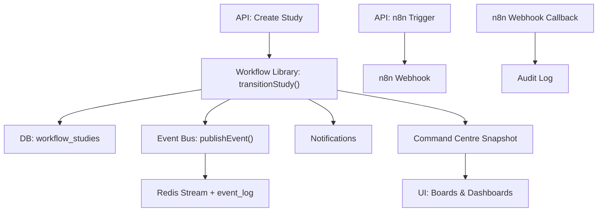
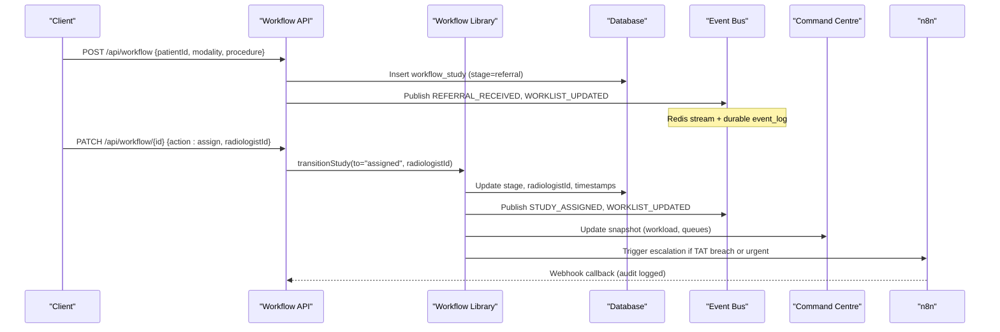
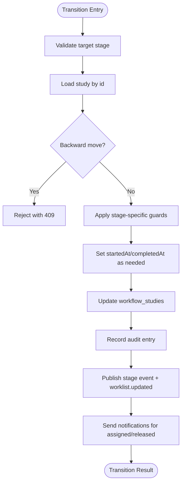
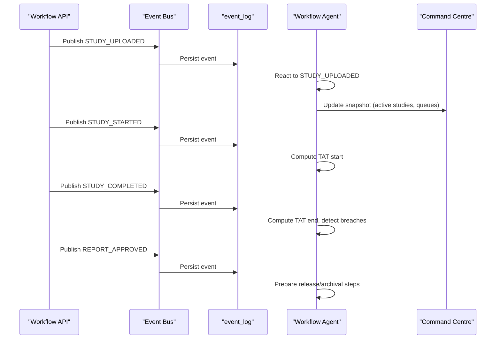
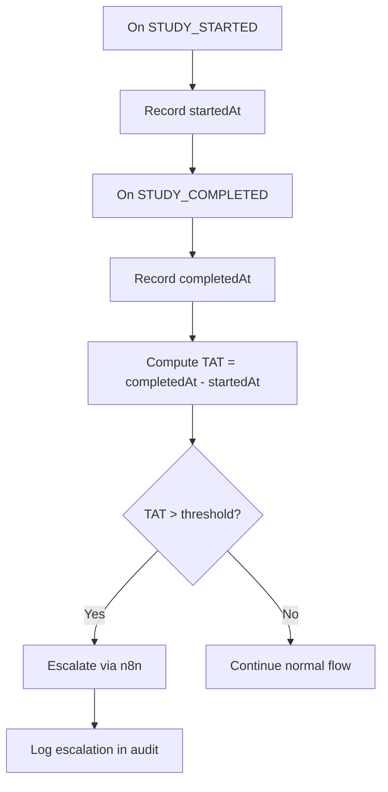
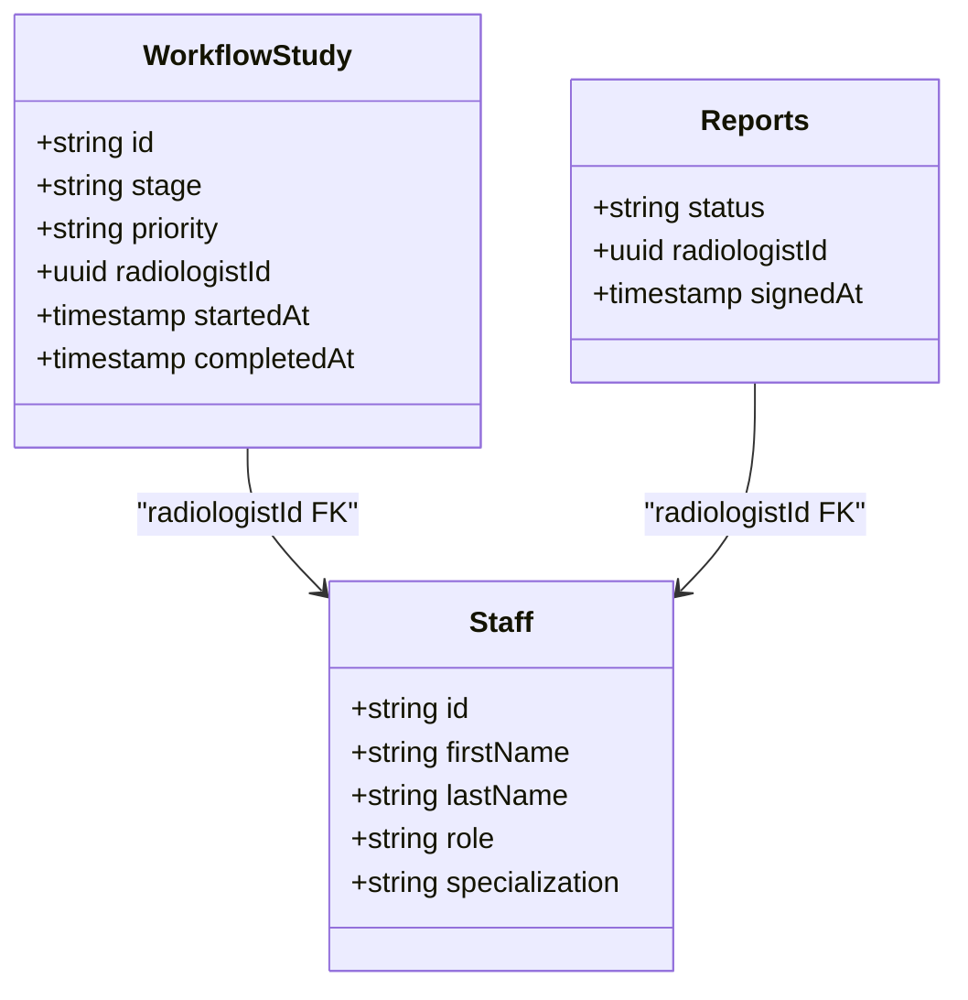
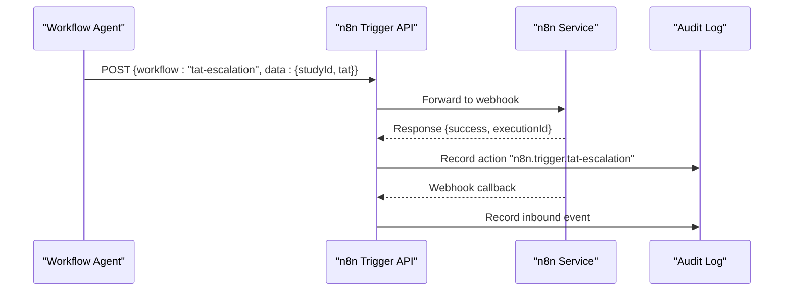
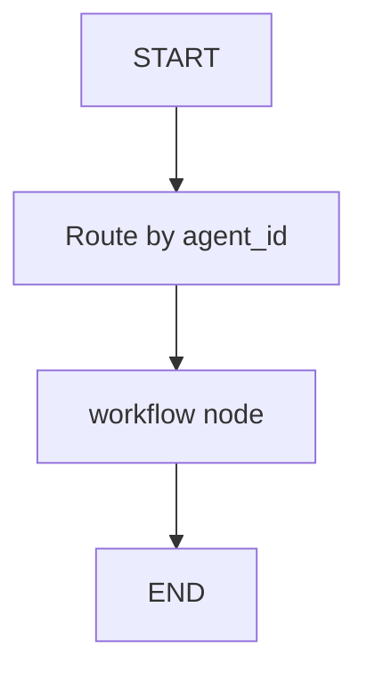
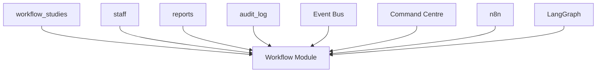

# Workflow Agent

<cite>
**Referenced Files in This Document**
- [workflow.ts](file://src/lib/workflow.ts)
- [events.ts](file://src/lib/events.ts)
- [route.ts (workflow)](file://src/app/api/workflow/route.ts)
- [route.ts (workflow id)](file://src/app/api/workflow/[id]/route.ts)
- [command-centre.ts](file://src/lib/command-centre.ts)
- [schema.ts](file://src/db/schema.ts)
- [route.ts (n8n trigger)](file://src/app/api/n8n/trigger/route.ts)
- [route.ts (webhooks n8n)](file://src/app/api/webhooks/n8n/route.ts)
- [n8n.mjs](file://services/n8n.mjs)
- [orchestration.py](file://backend/app/agents/orchestration.py)
- [langgraph_agent.py](file://services/langgraph_agent.py)
- [agents.ts](file://src/lib/agents.ts)
</cite>

## Table of Contents
1. [Introduction](#introduction)
2. [Project Structure](#project-structure)
3. [Core Components](#core-components)
4. [Architecture Overview](#architecture-overview)
5. [Detailed Component Analysis](#detailed-component-analysis)
6. [Dependency Analysis](#dependency-analysis)
7. [Performance Considerations](#performance-considerations)
8. [Troubleshooting Guide](#troubleshooting-guide)
9. [Conclusion](#conclusion)

## Introduction
The Workflow Agent is responsible for keeping every study moving through the radiology pipeline and flagging anything that stalls. It enforces a strict, forward-only state machine from referral to archive, monitors stage progression, detects bottlenecks and turnaround time (TAT) breaches, suggests radiologist assignments for unallocated studies, and escalates urgent cases to the command centre via n8n workflows. Its memory scope includes per-study stage history and turnaround times, enabling continuous monitoring and actionable insights.

## Project Structure
The Workflow Agent spans several modules:
- State machine and transitions are defined in the workflow library.
- Events are published on an event bus and persisted durably.
- API endpoints expose creation and transition operations.
- Command centre aggregates operational metrics including workload and risks.
- n8n integration provides automation triggers and webhook callbacks.
- LangGraph orchestration defines agent nodes including a workflow agent node.

**Diagram sources**
- [route.ts (workflow):55-101](file://src/app/api/workflow/route.ts#L55-L101)
- [route.ts (workflow id):20-80](file://src/app/api/workflow/[id]/route.ts#L20-L80)
- [workflow.ts:102-233](file://src/lib/workflow.ts#L102-L233)
- [events.ts:102-131](file://src/lib/events.ts#L102-L131)
- [command-centre.ts:54-206](file://src/lib/command-centre.ts#L54-L206)
- [route.ts (n8n trigger):8-46](file://src/app/api/n8n/trigger/route.ts#L8-L46)
- [route.ts (webhooks n8n):10-27](file://src/app/api/webhooks/n8n/route.ts#L10-L27)

**Section sources**
- [workflow.ts:1-246](file://src/lib/workflow.ts#L1-L246)
- [events.ts:1-158](file://src/lib/events.ts#L1-L158)
- [route.ts (workflow):1-107](file://src/app/api/workflow/route.ts#L1-L107)
- [route.ts (workflow id):1-109](file://src/app/api/workflow/[id]/route.ts#L1-L109)
- [command-centre.ts:1-208](file://src/lib/command-centre.ts#L1-L208)
- [schema.ts:102-119](file://src/db/schema.ts#L102-L119)
- [route.ts (n8n trigger):1-47](file://src/app/api/n8n/trigger/route.ts#L1-L47)
- [route.ts (webhooks n8n):1-28](file://src/app/api/webhooks/n8n/route.ts#L1-L28)
- [n8n.mjs:1-42](file://services/n8n.mjs#L1-L42)
- [orchestration.py:1-134](file://backend/app/agents/orchestration.py#L1-L134)
- [langgraph_agent.py:1-35](file://services/langgraph_agent.py#L1-L35)
- [agents.ts:72-86](file://src/lib/agents.ts#L72-L86)

## Core Components
- Stage tracker: The canonical pipeline stages define the allowed flow and associated events. Transitions are validated and audited.
- TAT thresholds: Turnaround times are derived from timestamps set at key milestones (startedAt, completedAt). These enable bottleneck detection and escalation.
- n8n escalation: Outbound triggers call configured n8n webhooks; inbound webhooks log back into the platform audit trail.
- Assignment board: Radiologist assignment is enforced before certain stages; workload data supports optimization.

Memory scope:
- Per-study stage history: Each transition records from/to stages and timestamps, enabling historical analysis.
- Turnaround times: Derived from startedAt/completedAt and other milestone timestamps to compute stage durations and overall TAT.

Event subscriptions:
- study.uploaded: Triggers downstream processing and worklist updates.
- study.started: Marks when review begins; used for TAT calculations.
- study.completed: Marks completion; used for TAT and reporting.
- report.approved: Signals readiness for release or archival steps.

Responsibilities:
- Monitor study progression from referral to archive.
- Detect bottlenecks and TAT breaches.
- Suggest radiologist assignment for unallocated studies.
- Escalate urgent studies to the command centre.

**Section sources**
- [workflow.ts:38-51](file://src/lib/workflow.ts#L38-L51)
- [workflow.ts:102-233](file://src/lib/workflow.ts#L102-L233)
- [events.ts:19-60](file://src/lib/events.ts#L19-L60)
- [route.ts (workflow):55-101](file://src/app/api/workflow/route.ts#L55-L101)
- [route.ts (workflow id):20-80](file://src/app/api/workflow/[id]/route.ts#L20-L80)
- [command-centre.ts:98-112](file://src/lib/command-centre.ts#L98-L112)
- [agents.ts:72-86](file://src/lib/agents.ts#L72-L86)

## Architecture Overview
The Workflow Agent orchestrates study lifecycle management through a robust state machine, event-driven architecture, and integrations with external automation tools.

**Diagram sources**
- [route.ts (workflow):55-101](file://src/app/api/workflow/route.ts#L55-L101)
- [route.ts (workflow id):20-80](file://src/app/api/workflow/[id]/route.ts#L20-L80)
- [workflow.ts:102-233](file://src/lib/workflow.ts#L102-L233)
- [events.ts:102-131](file://src/lib/events.ts#L102-L131)
- [command-centre.ts:54-206](file://src/lib/command-centre.ts#L54-L206)
- [route.ts (n8n trigger):8-46](file://src/app/api/n8n/trigger/route.ts#L8-L46)
- [route.ts (webhooks n8n):10-27](file://src/app/api/webhooks/n8n/route.ts#L10-L27)

## Detailed Component Analysis

### Stage Tracker and Transition Engine
The stage tracker defines the canonical pipeline and enforces forward-only transitions with guards for clinically meaningful stages. It sets timestamps at key milestones and publishes events for each transition.

**Diagram sources**
- [workflow.ts:102-233](file://src/lib/workflow.ts#L102-L233)

**Section sources**
- [workflow.ts:38-51](file://src/lib/workflow.ts#L38-L51)
- [workflow.ts:102-233](file://src/lib/workflow.ts#L102-L233)

### Event Subscriptions and Flow
The event bus publishes domain events for major actions and persists them durably. The Workflow Agent subscribes to study lifecycle events to drive automation and monitoring.

**Diagram sources**
- [events.ts:19-60](file://src/lib/events.ts#L19-L60)
- [events.ts:102-131](file://src/lib/events.ts#L102-L131)
- [workflow.ts:180-204](file://src/lib/workflow.ts#L180-L204)

**Section sources**
- [events.ts:1-158](file://src/lib/events.ts#L1-L158)
- [workflow.ts:180-204](file://src/lib/workflow.ts#L180-L204)

### TAT Thresholds and Bottleneck Detection
Turnaround times are computed using timestamps set during transitions. The Workflow Agent can detect bottlenecks by comparing elapsed times against configured thresholds and escalate accordingly.

**Diagram sources**
- [workflow.ts:167-172](file://src/lib/workflow.ts#L167-L172)
- [route.ts (n8n trigger):8-46](file://src/app/api/n8n/trigger/route.ts#L8-L46)

**Section sources**
- [workflow.ts:167-172](file://src/lib/workflow.ts#L167-L172)
- [command-centre.ts:154-165](file://src/lib/command-centre.ts#L154-L165)

### Radiologist Assignment Optimization
Assignment is required before certain stages. The system tracks radiologist workload and can suggest optimal assignments based on current load and expertise.

**Diagram sources**
- [schema.ts:70-80](file://src/db/schema.ts#L70-L80)
- [schema.ts:102-119](file://src/db/schema.ts#L102-L119)
- [schema.ts:166-180](file://src/db/schema.ts#L166-L180)

Practical example:
- When a study reaches “assigned”, the Workflow Agent queries radiologist workload (assigned count and signed today) and selects the least loaded radiologist with matching specialization.
- If no suitable radiologist is available, it escalates to the command centre via n8n.

**Section sources**
- [route.ts (workflow id):33-59](file://src/app/api/workflow/[id]/route.ts#L33-L59)
- [command-centre.ts:98-112](file://src/lib/command-centre.ts#L98-L112)
- [schema.ts:70-80](file://src/db/schema.ts#L70-L80)
- [schema.ts:102-119](file://src/db/schema.ts#L102-L119)
- [schema.ts:166-180](file://src/db/schema.ts#L166-L180)

### n8n Escalation Workflows
Outbound triggers call configured n8n webhooks; inbound webhooks log back into the platform audit trail. Pre-seeded workflows include TAT escalation and report signing notifications.

**Diagram sources**
- [route.ts (n8n trigger):8-46](file://src/app/api/n8n/trigger/route.ts#L8-L46)
- [route.ts (webhooks n8n):10-27](file://src/app/api/webhooks/n8n/route.ts#L10-L27)
- [n8n.mjs:11-17](file://services/n8n.mjs#L11-L17)

**Section sources**
- [route.ts (n8n trigger):1-47](file://src/app/api/n8n/trigger/route.ts#L1-L47)
- [route.ts (webhooks n8n):1-28](file://src/app/api/webhooks/n8n/route.ts#L1-L28)
- [n8n.mjs:1-42](file://services/n8n.mjs#L1-L42)

### LangGraph Orchestration Integration
LangGraph defines agent nodes including a workflow agent node that supervises state transitions and auditing integrity.

**Diagram sources**
- [langgraph_agent.py:12-32](file://services/langgraph_agent.py#L12-L32)
- [orchestration.py:87-94](file://backend/app/agents/orchestration.py#L87-L94)

**Section sources**
- [langgraph_agent.py:1-35](file://services/langgraph_agent.py#L1-L35)
- [orchestration.py:1-134](file://backend/app/agents/orchestration.py#L1-L134)

## Dependency Analysis
The Workflow Agent depends on:
- Database schema for workflow studies, staff, reports, and audit logs.
- Event bus for publishing and persisting events.
- Command centre for aggregating operational metrics.
- n8n for automation triggers and callbacks.
- LangGraph for multi-agent orchestration.

**Diagram sources**
- [schema.ts:102-119](file://src/db/schema.ts#L102-L119)
- [schema.ts:70-80](file://src/db/schema.ts#L70-L80)
- [schema.ts:166-180](file://src/db/schema.ts#L166-L180)
- [events.ts:102-131](file://src/lib/events.ts#L102-L131)
- [command-centre.ts:54-206](file://src/lib/command-centre.ts#L54-L206)
- [route.ts (n8n trigger):8-46](file://src/app/api/n8n/trigger/route.ts#L8-L46)
- [langgraph_agent.py:12-32](file://services/langgraph_agent.py#L12-L32)

**Section sources**
- [schema.ts:102-119](file://src/db/schema.ts#L102-L119)
- [events.ts:102-131](file://src/lib/events.ts#L102-L131)
- [command-centre.ts:54-206](file://src/lib/command-centre.ts#L54-L206)
- [route.ts (n8n trigger):8-46](file://src/app/api/n8n/trigger/route.ts#L8-L46)
- [langgraph_agent.py:12-32](file://services/langgraph_agent.py#L12-L32)

## Performance Considerations
- Event persistence ensures durability even if Redis is unavailable.
- Batched updates and minimal database round-trips reduce latency.
- Command centre snapshots aggregate counts efficiently using SQL grouping.
- n8n triggers use timeouts to prevent blocking long-running workflows.

[No sources needed since this section provides general guidance]

## Troubleshooting Guide
Common issues and resolutions:
- Invalid stage transitions: Ensure target stage is valid and not backward; check guard conditions for required fields like radiologistId or studyInstanceUid.
- Event bus failures: Events are still persisted to event_log; verify Redis configuration and connectivity.
- n8n unreachable: Check N8N_URL configuration and network connectivity; audit logs capture upstream status.
- Assignment failures: Confirm radiologist exists and is active; verify workload constraints.

**Section sources**
- [workflow.ts:111-165](file://src/lib/workflow.ts#L111-L165)
- [events.ts:72-99](file://src/lib/events.ts#L72-L99)
- [route.ts (n8n trigger):16-46](file://src/app/api/n8n/trigger/route.ts#L16-L46)
- [route.ts (workflow id):33-59](file://src/app/api/workflow/[id]/route.ts#L33-L59)

## Conclusion
The Workflow Agent provides a robust, event-driven framework for managing the radiology study pipeline. It enforces strict state transitions, monitors performance through TAT thresholds, optimizes radiologist assignments, and integrates with n8n for automated escalations. Its design ensures reliability, auditability, and scalability while maintaining clinical safety and operational efficiency.

[No sources needed since this section summarizes without analyzing specific files]