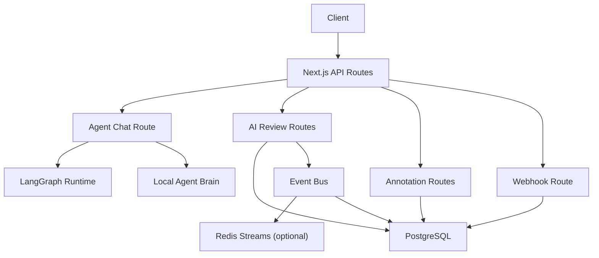
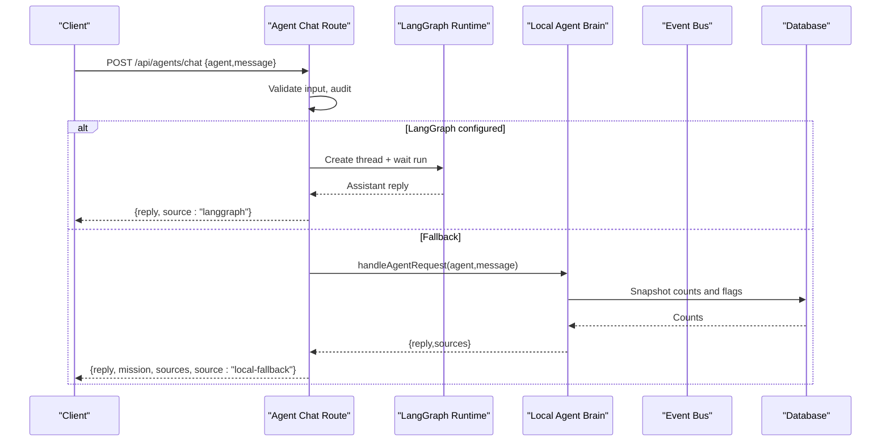
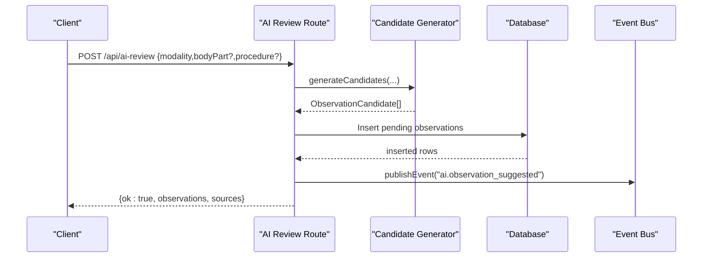
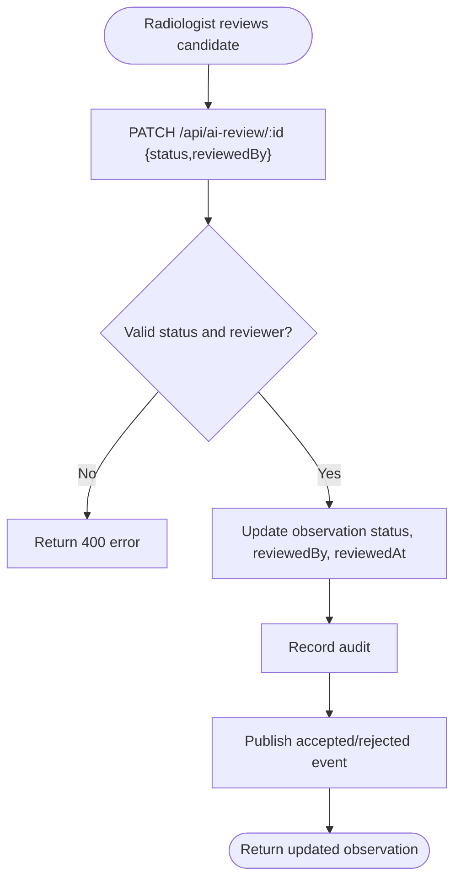
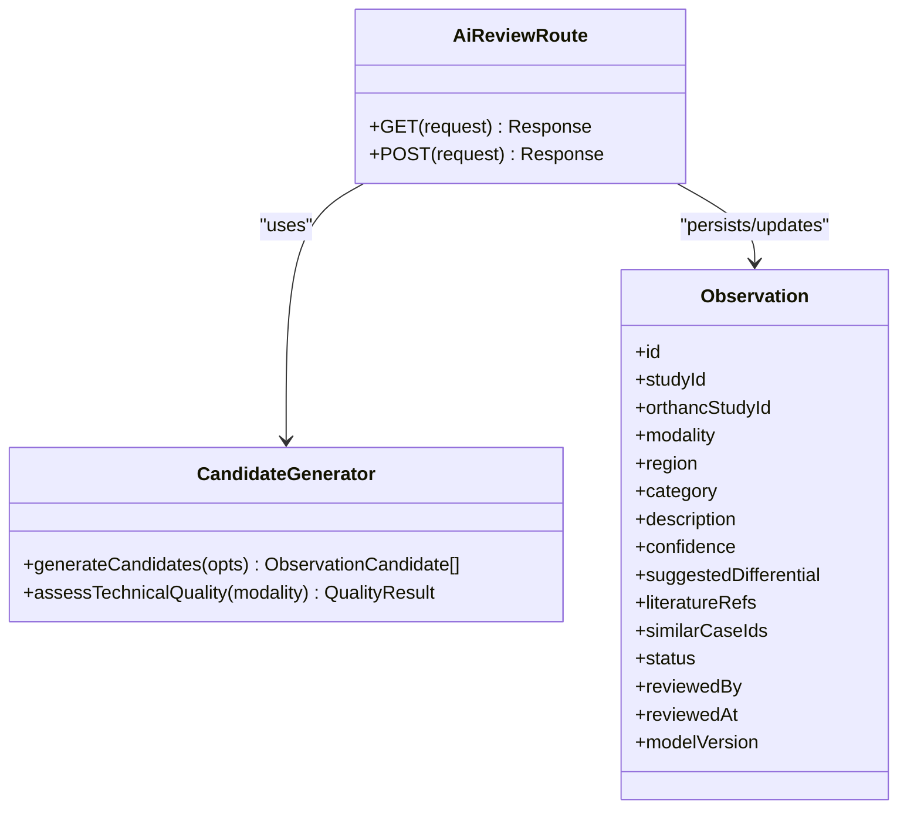
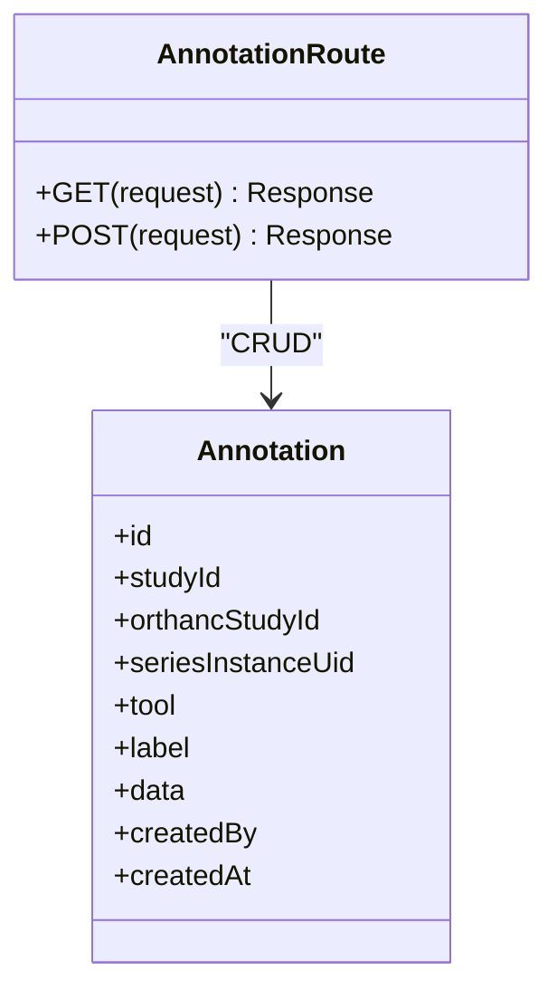
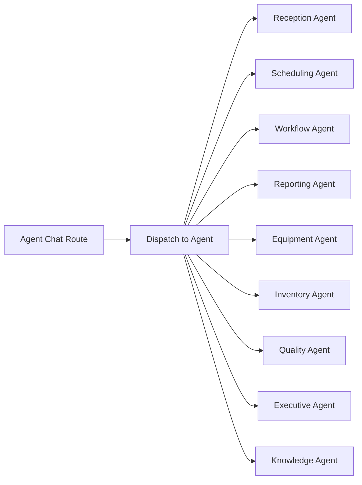
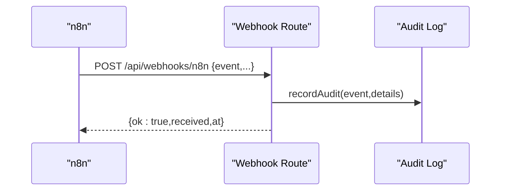
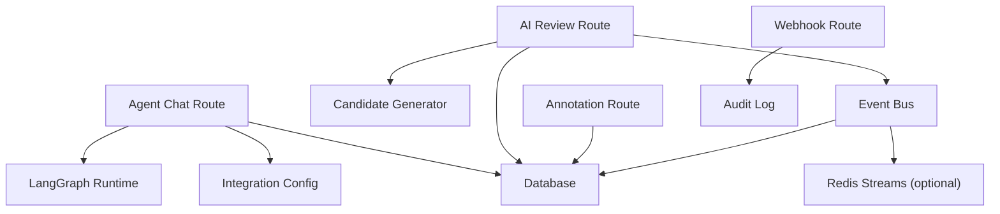
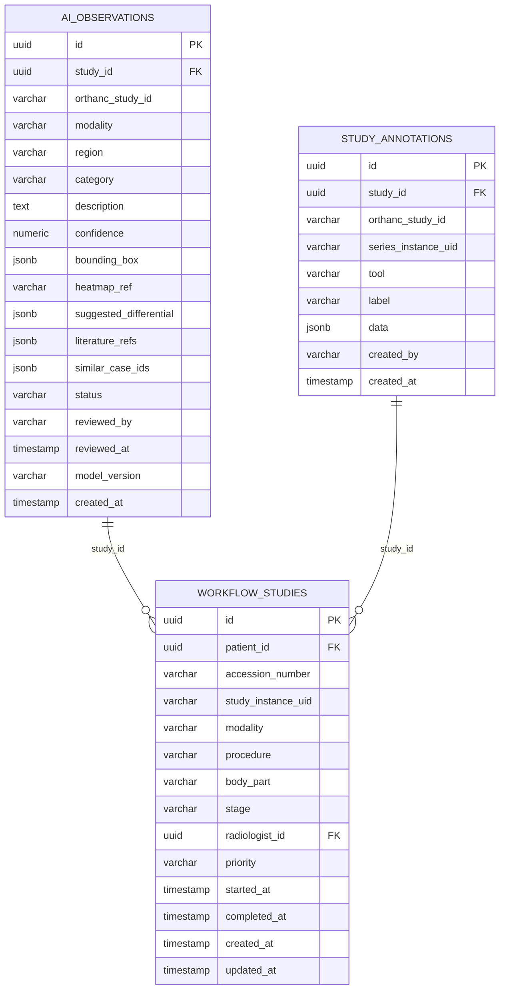

# AI & Intelligence API

<cite>
**Referenced Files in This Document**
- [route.ts](file://src/app/api/agents/chat/route.ts)
- [agents.ts](file://src/lib/agents.ts)
- [orchestration.py](file://backend/app/agents/orchestration.py)
- [langgraph_agent.py](file://services/langgraph_agent.py)
- [route.ts](file://src/app/api/ai-review/route.ts)
- [ai-review.ts](file://src/lib/ai-review.ts)
- [route.ts](file://src/app/api/ai-review/[id]/route.ts)
- [route.ts](file://src/app/api/annotations/route.ts)
- [route.ts](file://src/app/api/annotations/[id]/route.ts)
- [schema.ts](file://src/db/schema.ts)
- [route.ts](file://src/app/api/webhooks/n8n/route.ts)
- [events.ts](file://src/lib/events.ts)
- [config.py](file://backend/app/core/config.py)
</cite>

## Table of Contents
1. Introduction
2. Project Structure
3. Core Components
4. Architecture Overview
5. Detailed Component Analysis
6. Dependency Analysis
7. Performance Considerations
8. Troubleshooting Guide
9. Conclusion
10. Appendices

## Introduction
This document provides comprehensive API documentation for the AI-powered features of the platform, including:
- Multi-agent system with a conversational chat interface
- AI review assistant for multi-modality image analysis with confidence scoring and literature integration
- Annotation management for imaging studies
- Webhook integrations for asynchronous processing and real-time feedback
- Model versioning, event-driven architecture, and performance considerations

The system is designed to assist clinicians and operators without making autonomous clinical decisions. All AI outputs are advisory and require human review.

## Project Structure
The AI capabilities are implemented as Next.js API routes backed by a PostgreSQL database schema and optional external services (LangGraph, Redis). Key areas:
- Agent chat endpoint dispatches to either LangGraph or a local agent brain
- AI review endpoints generate candidate observations and manage radiologist acceptance/rejection
- Annotation endpoints persist user and tool-generated annotations
- Event bus publishes domain events to Redis Streams and persists them to an event log table
- Webhook endpoint records inbound automation events from n8n



**Diagram sources**
- [route.ts:40-84](file://src/app/api/agents/chat/route.ts#L40-L84)
- [route.ts:12-108](file://src/app/api/ai-review/route.ts#L12-L108)
- [route.ts:10-52](file://src/app/api/ai-review/[id]/route.ts#L10-L52)
- [route.ts:10-58](file://src/app/api/annotations/route.ts#L10-L58)
- [route.ts:8-13](file://src/app/api/annotations/[id]/route.ts#L8-L13)
- [route.ts:10-27](file://src/app/api/webhooks/n8n/route.ts#L10-L27)
- [events.ts:102-131](file://src/lib/events.ts#L102-L131)

**Section sources**
- [route.ts:40-84](file://src/app/api/agents/chat/route.ts#L40-L84)
- [route.ts:12-108](file://src/app/api/ai-review/route.ts#L12-L108)
- [route.ts:10-52](file://src/app/api/ai-review/[id]/route.ts#L10-L52)
- [route.ts:10-58](file://src/app/api/annotations/route.ts#L10-L58)
- [route.ts:8-13](file://src/app/api/annotations/[id]/route.ts#L8-L13)
- [route.ts:10-27](file://src/app/api/webhooks/n8n/route.ts#L10-L27)
- [events.ts:102-131](file://src/lib/events.ts#L102-L131)

## Core Components
- Agent Chat Interface: POST /api/agents/chat supports selecting an agent and sending messages. It attempts a remote LangGraph run first; if unavailable, it falls back to a local agent brain that queries live data and returns decision-support text.
- AI Review Assistant: POST /api/ai-review generates candidate observations per modality with confidence scores, suggested differentials, literature references, and similar case IDs. GET /api/ai-review lists observations by study or status. PATCH /api/ai-review/[id] allows radiologists to accept or reject candidates.
- Annotation Management: POST /api/annotations creates persisted annotations linked to studies or series. GET /api/annotations retrieves annotations by study or orthancStudyId. DELETE /api/annotations/[id] removes an annotation.
- Event-Driven Integration: publishEvent writes to Redis Streams (if configured) and persists to event_log. EVENT_TYPES enumerates all emitted events.
- Webhooks: POST /api/webhooks/n8n accepts inbound events from n8n and records them in audit logs.

**Section sources**
- [route.ts:40-84](file://src/app/api/agents/chat/route.ts#L40-L84)
- [agents.ts:216-373](file://src/lib/agents.ts#L216-L373)
- [route.ts:12-108](file://src/app/api/ai-review/route.ts#L12-L108)
- [ai-review.ts:168-220](file://src/lib/ai-review.ts#L168-L220)
- [route.ts:10-52](file://src/app/api/ai-review/[id]/route.ts#L10-L52)
- [route.ts:10-58](file://src/app/api/annotations/route.ts#L10-L58)
- [route.ts:8-13](file://src/app/api/annotations/[id]/route.ts#L8-L13)
- [events.ts:18-60](file://src/lib/events.ts#L18-L60)
- [events.ts:102-131](file://src/lib/events.ts#L102-L131)
- [route.ts:10-27](file://src/app/api/webhooks/n8n/route.ts#L10-L27)

## Architecture Overview
The system combines synchronous REST APIs with asynchronous event-driven flows. The agent chat route orchestrates between a remote LangGraph runtime and a local simulation when needed. AI review generation produces candidate observations stored in the database and emits events for downstream consumers. Annotations are persisted directly. Webhooks allow external systems to push events into the platform.



**Diagram sources**
- [route.ts:40-84](file://src/app/api/agents/chat/route.ts#L40-L84)
- [agents.ts:187-210](file://src/lib/agents.ts#L187-L210)
- [agents.ts:216-373](file://src/lib/agents.ts#L216-L373)



**Diagram sources**
- [route.ts:52-108](file://src/app/api/ai-review/route.ts#L52-L108)
- [ai-review.ts:168-220](file://src/lib/ai-review.ts#L168-L220)
- [events.ts:102-131](file://src/lib/events.ts#L102-L131)



**Diagram sources**
- [route.ts:16-51](file://src/app/api/ai-review/[id]/route.ts#L16-L51)

## Detailed Component Analysis

### Agent Chat Interface
- Endpoint: POST /api/agents/chat
- Behavior:
  - Validates JSON body and required fields
  - Audits interaction
  - Attempts LangGraph execution if configured; otherwise uses local agent brain
  - Returns agent name, mission, reply, sources, and source type
- Supported agents include reception, scheduling, workflow, reporting, equipment, inventory, quality, executive, knowledge

```mermaid
classDiagram
class AgentChatRoute {
+POST(request) Response
-runOnLangGraph(agentId, message) string
}
class AgentBrain {
+handleAgentRequest(agentId, message) {reply, sources}
-snapshot() ContextSnapshot
}
class LangGraphRuntime {
+createThread()
+waitRun(assistant_id, input)
}
AgentChatRoute --> AgentBrain : "fallback"
AgentChatRoute --> LangGraphRuntime : "primary if configured"
```

**Diagram sources**
- [route.ts:9-84](file://src/app/api/agents/chat/route.ts#L9-L84)
- [agents.ts:187-373](file://src/lib/agents.ts#L187-L373)

**Section sources**
- [route.ts:40-84](file://src/app/api/agents/chat/route.ts#L40-L84)
- [agents.ts:41-177](file://src/lib/agents.ts#L41-L177)
- [agents.ts:187-373](file://src/lib/agents.ts#L187-L373)

### AI Review Assistant
- Endpoints:
  - GET /api/ai-review?studyId=&orthancStudyId=&status=
  - POST /api/ai-review
  - PATCH /api/ai-review/[id]
- Candidate generation:
  - Modality-specific regions, differentials, literature references
  - Confidence scoring and technical quality checks
  - Similar case IDs for reference
- Radiologist workflow:
  - Accept or reject each candidate with audit and event publishing



**Diagram sources**
- [route.ts:12-108](file://src/app/api/ai-review/route.ts#L12-L108)
- [ai-review.ts:10-220](file://src/lib/ai-review.ts#L10-L220)
- [schema.ts:358-380](file://src/db/schema.ts#L358-L380)

**Section sources**
- [route.ts:12-108](file://src/app/api/ai-review/route.ts#L12-L108)
- [ai-review.ts:168-220](file://src/lib/ai-review.ts#L168-L220)
- [route.ts:16-51](file://src/app/api/ai-review/[id]/route.ts#L16-L51)
- [schema.ts:358-380](file://src/db/schema.ts#L358-L380)

### Annotation Management
- Endpoints:
  - GET /api/annotations?studyId=&orthancStudyId=
  - POST /api/annotations
  - DELETE /api/annotations/[id]
- Data model includes tool type, label, and structured data payload linked to studies or series



**Diagram sources**
- [route.ts:10-58](file://src/app/api/annotations/route.ts#L10-L58)
- [route.ts:8-13](file://src/app/api/annotations/[id]/route.ts#L8-L13)
- [schema.ts:434-444](file://src/db/schema.ts#L434-L444)

**Section sources**
- [route.ts:10-58](file://src/app/api/annotations/route.ts#L10-L58)
- [route.ts:8-13](file://src/app/api/annotations/[id]/route.ts#L8-L13)
- [schema.ts:434-444](file://src/db/schema.ts#L434-L444)

### Multi-Agent System and Orchestration
- Local agent definitions and dispatch logic provide decision support across operational domains
- Optional LangGraph orchestration defines nodes and routing for multi-step workflows



**Diagram sources**
- [agents.ts:41-177](file://src/lib/agents.ts#L41-L177)
- [agents.ts:216-373](file://src/lib/agents.ts#L216-L373)
- [orchestration.py:100-133](file://backend/app/agents/orchestration.py#L100-L133)
- [langgraph_agent.py:12-34](file://services/langgraph_agent.py#L12-L34)

**Section sources**
- [agents.ts:41-177](file://src/lib/agents.ts#L41-L177)
- [agents.ts:216-373](file://src/lib/agents.ts#L216-L373)
- [orchestration.py:19-133](file://backend/app/agents/orchestration.py#L19-L133)
- [langgraph_agent.py:7-34](file://services/langgraph_agent.py#L7-L34)

### Webhooks and Real-Time Feedback
- Webhook endpoint records inbound events from n8n into audit logs
- Event bus publishes domain events to Redis Streams (optional) and persists to event_log for durability



**Diagram sources**
- [route.ts:10-27](file://src/app/api/webhooks/n8n/route.ts#L10-L27)

**Section sources**
- [route.ts:10-27](file://src/app/api/webhooks/n8n/route.ts#L10-L27)
- [events.ts:102-131](file://src/lib/events.ts#L102-L131)

## Dependency Analysis
- Agent chat depends on:
  - Integration configuration for LangGraph
  - Local agent brain for fallback responses
  - Database for snapshot metrics
- AI review depends on:
  - Candidate generator for modality-specific logic
  - Database for storing observations
  - Event bus for publishing suggestions and outcomes
- Annotations depend on:
  - Database for persistence
- Webhooks depend on:
  - Audit logging
- Configuration:
  - Backend service settings define database, Redis, storage, and integration URLs



**Diagram sources**
- [route.ts:40-84](file://src/app/api/agents/chat/route.ts#L40-L84)
- [route.ts:12-108](file://src/app/api/ai-review/route.ts#L12-L108)
- [route.ts:10-58](file://src/app/api/annotations/route.ts#L10-L58)
- [route.ts:10-27](file://src/app/api/webhooks/n8n/route.ts#L10-L27)
- [events.ts:102-131](file://src/lib/events.ts#L102-L131)
- [config.py:4-19](file://backend/app/core/config.py#L4-L19)

**Section sources**
- [route.ts:40-84](file://src/app/api/agents/chat/route.ts#L40-L84)
- [route.ts:12-108](file://src/app/api/ai-review/route.ts#L12-L108)
- [route.ts:10-58](file://src/app/api/annotations/route.ts#L10-L58)
- [route.ts:10-27](file://src/app/api/webhooks/n8n/route.ts#L10-L27)
- [events.ts:102-131](file://src/lib/events.ts#L102-L131)
- [config.py:4-19](file://backend/app/core/config.py#L4-L19)

## Performance Considerations
- Timeouts:
  - Thread creation timeout for LangGraph
  - Run wait timeout for agent response
- Concurrency:
  - Use dynamic API routes for serverless scalability
- Caching:
  - Redis Streams used for event distribution; consider application-level caching for frequent reads (e.g., agent snapshots)
- Database:
  - Limit query results where applicable (e.g., recent observations and annotations)
- Observability:
  - Audit logs and event logs provide traceability
  - Health checks for integrations (LangGraph, MinIO, Redis)

[No sources needed since this section provides general guidance]

## Troubleshooting Guide
- Invalid JSON payloads:
  - Agent chat and webhooks return 400 errors for malformed requests
- Unknown agent:
  - Agent chat validates agent ID against supported agents
- Missing required fields:
  - AI review requires modality; annotation creation requires tool and data
- Not found:
  - AI review PATCH and annotation DELETE return 404 when entity does not exist
- External service failures:
  - LangGraph unavailability triggers fallback to local agent brain
  - Redis unavailability degrades to durable event_log persistence

**Section sources**
- [route.ts:42-55](file://src/app/api/agents/chat/route.ts#L42-L55)
- [route.ts:52-58](file://src/app/api/ai-review/route.ts#L52-L58)
- [route.ts:30-33](file://src/app/api/annotations/route.ts#L30-L33)
- [route.ts:19-24](file://src/app/api/ai-review/[id]/route.ts#L19-L24)
- [route.ts:11-12](file://src/app/api/annotations/[id]/route.ts#L11-L12)
- [route.ts:67-74](file://src/app/api/agents/chat/route.ts#L67-L74)
- [events.ts:115-130](file://src/lib/events.ts#L115-L130)

## Conclusion
The AI & Intelligence API provides a robust foundation for multi-agent conversations, AI-assisted image review, and annotation management. It emphasizes safety through human-in-the-loop workflows, comprehensive auditing, and resilient event-driven architecture. Integrations with LangGraph and Redis enable scalable, real-time operations while maintaining reliability through fallbacks and durable persistence.

[No sources needed since this section summarizes without analyzing specific files]

## Appendices

### API Reference Summary

- Agent Chat
  - Method: POST
  - Path: /api/agents/chat
  - Body: { agent?: string; message?: string }
  - Response: { agent, mission, reply, sources[], source }
  - Notes: Falls back to local agent brain if LangGraph is unavailable

- AI Review
  - Method: GET
  - Path: /api/ai-review?studyId=&orthancStudyId=&status=
  - Response: { ok, observations[] }
  - Method: POST
  - Path: /api/ai-review
  - Body: { modality, bodyPart?, procedure?, studyId?, orthancStudyId? }
  - Response: { ok, observations[], sources[] }
  - Method: PATCH
  - Path: /api/ai-review/:id
  - Body: { status: "accepted" | "rejected", reviewedBy }
  - Response: { ok, observation }

- Annotations
  - Method: GET
  - Path: /api/annotations?studyId=&orthancStudyId=
  - Response: { ok, annotations[] }
  - Method: POST
  - Path: /api/annotations
  - Body: { studyId?, orthancStudyId?, seriesInstanceUid?, tool, label?, data, createdBy? }
  - Response: { ok, annotation }
  - Method: DELETE
  - Path: /api/annotations/:id
  - Response: { ok }

- Webhooks
  - Method: POST
  - Path: /api/webhooks/n8n
  - Body: { event, entityType?, entityId?, ...details }
  - Response: { ok, received, at }

**Section sources**
- [route.ts:40-84](file://src/app/api/agents/chat/route.ts#L40-L84)
- [route.ts:12-108](file://src/app/api/ai-review/route.ts#L12-L108)
- [route.ts:16-51](file://src/app/api/ai-review/[id]/route.ts#L16-L51)
- [route.ts:10-58](file://src/app/api/annotations/route.ts#L10-L58)
- [route.ts:8-13](file://src/app/api/annotations/[id]/route.ts#L8-L13)
- [route.ts:10-27](file://src/app/api/webhooks/n8n/route.ts#L10-L27)

### Data Models



**Diagram sources**
- [schema.ts:103-119](file://src/db/schema.ts#L103-L119)
- [schema.ts:358-380](file://src/db/schema.ts#L358-L380)
- [schema.ts:434-444](file://src/db/schema.ts#L434-L444)

**Section sources**
- [schema.ts:103-119](file://src/db/schema.ts#L103-L119)
- [schema.ts:358-380](file://src/db/schema.ts#L358-L380)
- [schema.ts:434-444](file://src/db/schema.ts#L434-L444)

### Common AI Use Cases

- Automated findings extraction
  - Trigger AI review generation for a study by modality and body part
  - Retrieve candidate observations and present to radiologist for acceptance/rejection
  - Observe events for audit and downstream processing

- Intelligent recommendations
  - Use agent chat to request operational insights (e.g., scheduling conflicts, equipment downtime)
  - Receive decision-support replies with sources and context
  - Optionally integrate with n8n via webhooks for automated follow-ups

**Section sources**
- [route.ts:52-108](file://src/app/api/ai-review/route.ts#L52-L108)
- [ai-review.ts:168-220](file://src/lib/ai-review.ts#L168-L220)
- [route.ts:40-84](file://src/app/api/agents/chat/route.ts#L40-L84)
- [route.ts:10-27](file://src/app/api/webhooks/n8n/route.ts#L10-L27)