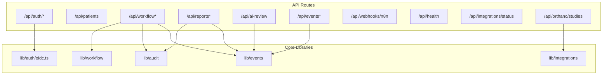
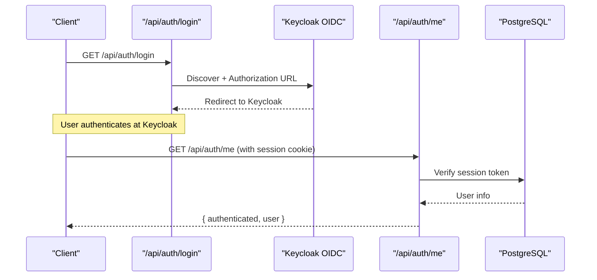
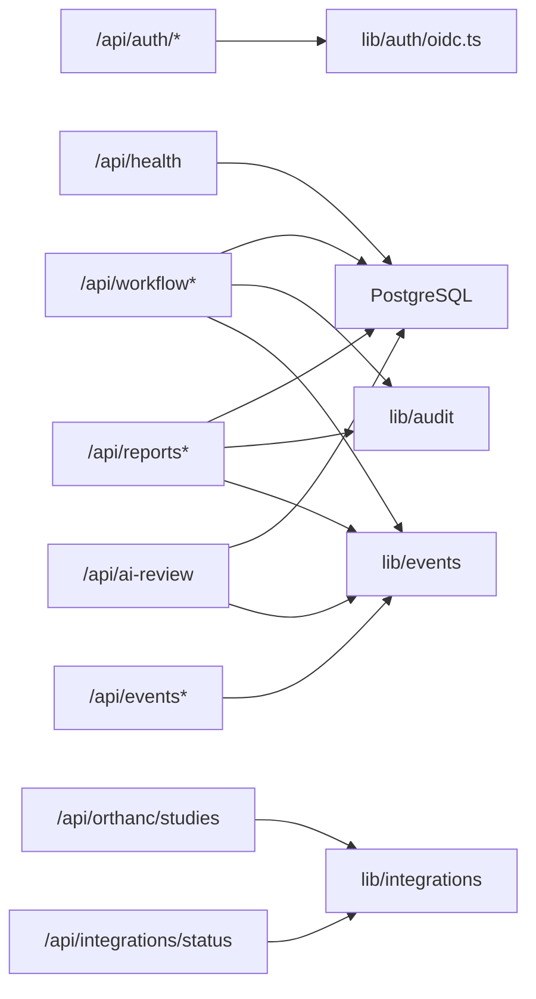

# API Reference

<cite>
**Referenced Files in This Document**
- [route.ts](file://src/app\api\auth\login\route.ts)
- [route.ts](file://src/app\api\auth\me\route.ts)
- [oidc.ts](file://src/lib/auth/oidc.ts)
- [route.ts](file://src/app\api\patients\route.ts)
- [route.ts](file://src/app\api\workflow\route.ts)
- [route.ts](file://src/app\api\workflow\[id]\route.ts)
- [route.ts](file://src/app\api\reports\route.ts)
- [route.ts](file://src/app\api\reports\[id]\route.ts)
- [route.ts](file://src/app\api\ai-review\route.ts)
- [route.ts](file://src/app\api\events\route.ts)
- [route.ts](file://src/app\api\events\stream\route.ts)
- [route.ts](file://src/app\api\webhooks\n8n\route.ts)
- [route.ts](file://src/app\api\health\route.ts)
- [route.ts](file://src/app\api\integrations\status\route.ts)
- [route.ts](file://src/app\api\orthanc\studies\route.ts)
</cite>

## Table of Contents
1. Introduction
2. Project Structure
3. Core Components
4. Architecture Overview
5. Detailed Component Analysis
6. Dependency Analysis
7. Performance Considerations
8. Troubleshooting Guide
9. Conclusion

## Introduction
This document provides a comprehensive API reference for GeraldOS RESTful interfaces. It covers authentication via Keycloak OIDC, patient management, workflow operations, AI review, reporting, events and streaming, integrations status, Orthanc DICOM proxying, webhooks, and health checks. For each endpoint you will find HTTP methods, URL patterns, request/response schemas, required and optional parameters, error codes, and notes on authentication and versioning.

Authentication is performed using Keycloak OIDC with an authorization code flow. The platform issues a session cookie to maintain authenticated state after successful login. Some endpoints enforce role-based access (for example, signing reports requires the radiologist role).

Versioning: All endpoints are served under the Next.js app router without explicit version prefixes. Treat all paths as current stable versions unless otherwise noted.

Rate limiting: No built-in rate limiting is implemented at the application layer. Consumers should implement client-side retry/backoff and respect server responses.

Real-time updates: Server-Sent Events (SSE) are available at /api/events/stream for live event consumption.

Webhooks: An inbound webhook endpoint accepts events from external automation systems such as n8n.

Health and readiness: A simple health check and an integration status endpoint are provided.

## Project Structure
The API surface is implemented as Next.js Route Handlers under src/app/api. Each feature area has its own folder with route files that handle HTTP methods. Authentication logic is centralized in lib/auth, while integrations and shared utilities are in lib/integrations and lib/utils.

**Diagram sources**
- [route.ts:1-31](file://src/app\api\auth\login\route.ts#L1-L31)
- [oidc.ts:1-96](file://src/lib/auth/oidc.ts#L1-L96)
- [route.ts:1-107](file://src/app\api\workflow\route.ts#L1-L107)
- [route.ts:1-125](file://src/app\api\reports\[id]\route.ts#L1-L125)
- [route.ts:1-109](file://src/app\api\ai-review\route.ts#L1-L109)
- [route.ts:1-38](file://src/app\api\events\route.ts#L1-L38)
- [route.ts:1-94](file://src/app\api\events\stream\route.ts#L1-L94)
- [route.ts:1-28](file://src/app\api\webhooks\n8n\route.ts#L1-L28)
- [route.ts:1-14](file://src/app\api\health\route.ts#L1-L14)
- [route.ts:1-43](file://src/app\api\integrations\status\route.ts#L1-L43)
- [route.ts:1-86](file://src/app\api\orthanc\studies\route.ts#L1-L86)

**Section sources**
- [route.ts:1-31](file://src/app\api\auth\login\route.ts#L1-L31)
- [oidc.ts:1-96](file://src/lib/auth/oidc.ts#L1-L96)
- [route.ts:1-107](file://src/app\api\workflow\route.ts#L1-L107)
- [route.ts:1-125](file://src/app\api\reports\[id]\route.ts#L1-L125)
- [route.ts:1-109](file://src/app\api\ai-review\route.ts#L1-L109)
- [route.ts:1-38](file://src/app\api\events\route.ts#L1-L38)
- [route.ts:1-94](file://src/app\api\events\stream\route.ts#L1-L94)
- [route.ts:1-28](file://src/app\api\webhooks\n8n\route.ts#L1-L28)
- [route.ts:1-14](file://src/app\api\health\route.ts#L1-L14)
- [route.ts:1-43](file://src/app\api\integrations\status\route.ts#L1-L43)
- [route.ts:1-86](file://src/app\api\orthanc\studies\route.ts#L1-L86)

## Core Components
- Authentication: Keycloak OIDC discovery, authorization URL generation, token exchange, ID token verification, and role extraction. Session cookies are used to maintain authenticated state.
- Patient Management: List patients with search; create new patients.
- Workflow: Create studies, list studies with context, transition stages, assign radiologists, update fields.
- Reporting: List and fetch reports; draft and sign reports with versioning and audit logging.
- AI Review: Generate candidate observations per modality/body part/procedure; query by study or orthanc study id; filter by status.
- Events: Query recent events; publish manual events; stream events via SSE.
- Integrations: Health and status of configured integrations.
- Orthanc Proxy: Fetch studies and series metadata from Orthanc with auth headers and timeouts.
- Webhooks: Accept inbound events from n8n and record them in the audit log.
- Health: Simple database connectivity check.

**Section sources**
- [oidc.ts:1-96](file://src/lib/auth/oidc.ts#L1-L96)
- [route.ts:1-37](file://src/app\api\patients\route.ts#L1-L37)
- [route.ts:1-107](file://src/app\api\workflow\route.ts#L1-L107)
- [route.ts:1-109](file://src/app\api\workflow\[id]\route.ts#L1-L109)
- [route.ts:1-46](file://src/app\api\reports\route.ts#L1-L46)
- [route.ts:1-125](file://src/app\api\reports\[id]\route.ts#L1-L125)
- [route.ts:1-109](file://src/app\api\ai-review\route.ts#L1-L109)
- [route.ts:1-38](file://src/app\api\events\route.ts#L1-L38)
- [route.ts:1-94](file://src/app\api\events\stream\route.ts#L1-L94)
- [route.ts:1-28](file://src/app\api\webhooks\n8n\route.ts#L1-L28)
- [route.ts:1-14](file://src/app\api\health\route.ts#L1-L14)
- [route.ts:1-43](file://src/app\api\integrations\status\route.ts#L1-L43)
- [route.ts:1-86](file://src/app\api\orthanc\studies\route.ts#L1-L86)

## Architecture Overview
GeraldOS exposes a REST API implemented as Next.js route handlers. Authentication uses Keycloak OIDC. Business modules (patients, workflow, reports, ai-review) interact with a PostgreSQL database via Drizzle ORM. Cross-cutting concerns include audit logging, event publishing, and integration helpers. Real-time updates are delivered via Server-Sent Events. External systems integrate through webhooks and proxied calls to Orthanc.

**Diagram sources**
- [route.ts:1-31](file://src/app\api\auth\login\route.ts#L1-L31)
- [route.ts:1-15](file://src/app\api\auth\me\route.ts#L1-L15)
- [oidc.ts:1-96](file://src/lib/auth/oidc.ts#L1-L96)

## Detailed Component Analysis

### Authentication (Keycloak OIDC)
- POST/GET endpoints:
  - GET /api/auth/login: Initiates OIDC login. If Keycloak is not configured, redirects to login with an error. Otherwise discovers OIDC configuration, generates a state, sets a secure cookie, and redirects to Keycloak.
  - GET /api/auth/me: Returns current session status and user if authenticated via session cookie; indicates whether Keycloak is enabled.

- Request/Response:
  - Login: No request body. Response is a redirect to Keycloak. Sets geraldos_oauth_state cookie.
  - Me: Requires session cookie. Success returns { authenticated: true, user, keycloakEnabled }. Failure returns 401 with { authenticated: false, keycloakEnabled }.

- Error handling:
  - Missing Keycloak configuration: redirect to /login?error=keycloak_not_configured.
  - OIDC errors: redirect to /login?error=<encoded message>.

- Notes:
  - Token exchange and ID token verification are handled in lib/auth/oidc.ts.
  - Roles are extracted from claims for authorization decisions elsewhere.

**Section sources**
- [route.ts:1-31](file://src/app\api\auth\login\route.ts#L1-L31)
- [route.ts:1-15](file://src/app\api\auth\me\route.ts#L1-L15)
- [oidc.ts:1-96](file://src/lib/auth/oidc.ts#L1-L96)

### Patients
- GET /api/patients
  - Query params:
    - search: string (optional) — partial match against firstName, lastName, mrn.
  - Response: Array of patient records sorted by creation date descending.
  - Errors: 500 on database failures.

- POST /api/patients
  - Body: Patient object (fields inferred from schema usage).
  - Response: Created patient record with 201 status.
  - Errors: 500 on database failures.

**Section sources**
- [route.ts:1-37](file://src/app\api\patients\route.ts#L1-L37)

### Workflow
- GET /api/workflow
  - Response: Array of workflow studies joined with patient and radiologist context, including stageLabel derived from stage.

- POST /api/workflow
  - Body requirements:
    - patientId: string (required)
    - modality: string (required)
    - procedure: string (required)
    - Optional: appointmentId, bodyPart, priority (defaults to routine), changedBy
  - Behavior: Creates a study at referral stage, assigns accession number, audits creation, publishes REFERRAL_RECEIVED and WORKLIST_UPDATED events.
  - Response: { ok: true, study } with 201 status.
  - Errors: 400 for invalid body or missing required fields; 500 on failure.

- PATCH /api/workflow/:id
  - Actions:
    - Assign: { action: "assign", radiologistId } — transitions to assigned or reassigns past assigned stage.
    - Transition: { action: "transition", to: <stage> } or legacy { stage: <stage>, studyInstanceUid? }.
    - Field updates: Allowed fields include priority, radiologistId, studyInstanceUid, bodyPart, procedure, modality.
  - Response: { ok: true, study, transitioned?, reassigned?, fromStage?, toStage? }.
  - Errors: 400 for invalid inputs or unsupported fields; 404 if study not found; 500 on failure.

- Notes:
  - Stage validation uses internal workflow module constants.
  - Auditing and events are recorded on transitions and updates.

**Section sources**
- [route.ts:1-107](file://src/app\api\workflow\route.ts#L1-L107)
- [route.ts:1-109](file://src/app\api\workflow\[id]\route.ts#L1-L109)

### Reports
- GET /api/reports
  - Response: Array of reports with patient and radiologist context.

- GET /api/reports/:id
  - Response: { ok: true, report } with full details; 404 if not found.

- POST /api/reports
  - Body: Report fields (findings, impression, recommendation, templateName, etc.).
  - Response: Created report with 201 status.

- PATCH /api/reports/:id
  - Draft updates: findings, impression, recommendation, templateName, status.
  - Signing:
    - Requires status: "signed" and approvedBy field.
    - Role check: Only users with radiologist role can sign (dev/degraded mode may allow signing when roles are absent).
  - Versioning: Previous content snapshot saved into report_versions before mutation; emits report.versioned event.
  - Events: Emits report.signed or report.drafted on status changes.
  - Response: { ok: true, report }.
  - Errors: 400 for invalid body or missing approval; 403 if not authorized to sign; 404 if not found; 500 on failure.

**Section sources**
- [route.ts:1-46](file://src/app\api\reports\route.ts#L1-L46)
- [route.ts:1-125](file://src/app\api\reports\[id]\route.ts#L1-L125)

### AI Review
- GET /api/ai-review
  - Query params:
    - studyId: string (optional)
    - orthancStudyId: string (optional)
    - status: string (optional)
  - Response: { ok: true, observations } array; paginated by limit internally.

- POST /api/ai-review
  - Body:
    - modality: string (required)
    - Optional: studyId, orthancStudyId, bodyPart, procedure
  - Behavior: Generates candidate observations based on modality/body part/procedure; persists as pending; audits and emits ai.observation_suggested event.
  - Response: { ok: true, observations, sources } with 201 status.
  - Errors: 400 if modality missing; 500 on failure.

**Section sources**
- [route.ts:1-109](file://src/app\api\ai-review\route.ts#L1-L109)

### Events and Streaming
- GET /api/events
  - Query params:
    - type: string (optional) — filter by event type
    - limit: number (optional, default 50, max 200)
  - Response: { ok: true, events }

- POST /api/events
  - Body:
    - type: string (required) — must be known or start with custom.
    - aggregate: string (required)
    - aggregateId: string (optional)
    - payload: object (optional)
  - Response: { ok: true }

- GET /api/events/stream
  - Purpose: Server-Sent Events stream for real-time workstation updates.
  - Headers/Query:
    - Last-Event-ID header or lastId query param to resume from last received event.
  - Behavior: Polls event_log every ~5 seconds; sends events in order; keeps connection open until client disconnects; includes keepalive comments on DB errors.
  - Response: text/event-stream with event lines.

**Section sources**
- [route.ts:1-38](file://src/app\api\events\route.ts#L1-L38)
- [route.ts:1-94](file://src/app\api\events\stream\route.ts#L1-L94)

### Webhooks (n8n)
- POST /api/webhooks/n8n
  - Body: JSON with at least an event field; supports entityType and entityId.
  - Behavior: Records inbound event in audit log with module n8n.
  - Response: { ok: true, received, at }
  - Errors: 400 for invalid JSON.

**Section sources**
- [route.ts:1-28](file://src/app\api\webhooks\n8n\route.ts#L1-L28)

### Integrations Status
- GET /api/integrations/status
  - Behavior: Checks PostgreSQL connectivity and all configured integrations; returns summary counts and per-integration status with latency.
  - Response: { summary, integrations }

**Section sources**
- [route.ts:1-43](file://src/app\api\integrations\status\route.ts#L1-L43)

### Orthanc Studies
- GET /api/orthanc/studies
  - Behavior: Proxies to Orthanc to list studies and series; derives modalities from series when missing; filters out studies without patient identity; applies timeouts and auth headers.
  - Response: { ok: true, studies } or { ok: false, reason, studies: [] }

**Section sources**
- [route.ts:1-86](file://src/app\api\orthanc\studies\route.ts#L1-L86)

### Health Check
- GET /api/health
  - Behavior: Executes a simple SQL query to verify database connectivity.
  - Response: { ok: true } on success; { ok: false } with 500 on failure.

**Section sources**
- [route.ts:1-14](file://src/app\api\health\route.ts#L1-L14)

## Dependency Analysis
- Authentication depends on Keycloak OIDC discovery and token verification.
- Workflow and Reporting depend on database models and emit events and audit logs.
- AI Review depends on workflow and Orthanc identifiers to generate candidates.
- Events subsystem is used across modules to decouple side effects.
- Integrations status aggregates health of Postgres and other services.
- Orthanc proxy depends on integration configuration and timeout helpers.

**Diagram sources**
- [oidc.ts:1-96](file://src/lib/auth/oidc.ts#L1-L96)
- [route.ts:1-107](file://src/app\api\workflow\route.ts#L1-L107)
- [route.ts:1-125](file://src/app\api\reports\[id]\route.ts#L1-L125)
- [route.ts:1-109](file://src/app\api\ai-review\route.ts#L1-L109)
- [route.ts:1-38](file://src/app\api\events\route.ts#L1-L38)
- [route.ts:1-86](file://src/app\api\orthanc\studies\route.ts#L1-L86)
- [route.ts:1-14](file://src/app\api\health\route.ts#L1-L14)
- [route.ts:1-43](file://src/app\api\integrations\status\route.ts#L1-L43)

**Section sources**
- [oidc.ts:1-96](file://src/lib/auth/oidc.ts#L1-L96)
- [route.ts:1-107](file://src/app\api\workflow\route.ts#L1-L107)
- [route.ts:1-125](file://src/app\api\reports\[id]\route.ts#L1-L125)
- [route.ts:1-109](file://src/app\api\ai-review\route.ts#L1-L109)
- [route.ts:1-38](file://src/app\api\events\route.ts#L1-L38)
- [route.ts:1-86](file://src/app\api\orthanc\studies\route.ts#L1-L86)
- [route.ts:1-14](file://src/app\api\health\route.ts#L1-L14)
- [route.ts:1-43](file://src/app\api\integrations\status\route.ts#L1-L43)

## Performance Considerations
- Database queries: Many endpoints perform joins and ordering; ensure appropriate indexes exist on frequently filtered columns (e.g., createdAt, patientId, studyId).
- Timeouts: Orthanc calls use timeouts to prevent hanging requests.
- Event streaming: SSE polls every ~5 seconds; consider tuning interval and batch size for high-throughput environments.
- Rate limiting: Not implemented; clients should implement exponential backoff and respect server errors.

[No sources needed since this section provides general guidance]

## Troubleshooting Guide
- Authentication failures:
  - Keycloak not configured: Login redirects to /login with error parameter.
  - OIDC discovery/token exchange errors: Redirects to /login with encoded error messages.
  - Unauthenticated access to protected endpoints: 401 returned by /api/auth/me.

- Workflow errors:
  - Invalid stage or missing radiologistId during assignment: 400 with descriptive error.
  - Study not found: 404.

- Reporting errors:
  - Signing without approvedBy: 400.
  - Unauthorized signer: 403.
  - Report not found: 404.

- AI Review errors:
  - Missing modality: 400.

- Events:
  - Unknown event type: 400.
  - SSE connection drops: Reconnect using Last-Event-ID to resume.

- Integrations:
  - Use /api/integrations/status to diagnose connectivity and latency for Postgres and other services.

- Health:
  - /api/health returns ok:false with 500 when database is unreachable.

**Section sources**
- [route.ts:1-31](file://src/app\api\auth\login\route.ts#L1-L31)
- [route.ts:1-15](file://src/app\api\auth\me\route.ts#L1-L15)
- [route.ts:1-109](file://src/app\api\workflow\[id]\route.ts#L1-L109)
- [route.ts:1-125](file://src/app\api\reports\[id]\route.ts#L1-L125)
- [route.ts:1-109](file://src/app\api\ai-review\route.ts#L1-L109)
- [route.ts:1-38](file://src/app\api\events\route.ts#L1-L38)
- [route.ts:1-94](file://src/app\api\events\stream\route.ts#L1-L94)
- [route.ts:1-43](file://src/app\api\integrations\status\route.ts#L1-L43)
- [route.ts:1-14](file://src/app\api\health\route.ts#L1-L14)

## Conclusion
GeraldOS provides a cohesive set of REST APIs for authentication, patient and workflow management, AI-assisted review, reporting with versioning and signing, event-driven architecture with SSE streaming, integrations diagnostics, and Orthanc interoperability. Authentication relies on Keycloak OIDC with session cookies. Endpoints follow consistent error patterns and integrate audit logging and event publishing for traceability. Clients should handle retries, respect timeouts, and use SSE for real-time updates where applicable.

[No sources needed since this section summarizes without analyzing specific files]