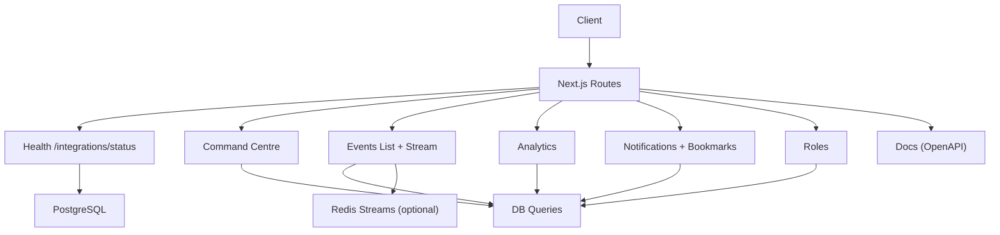
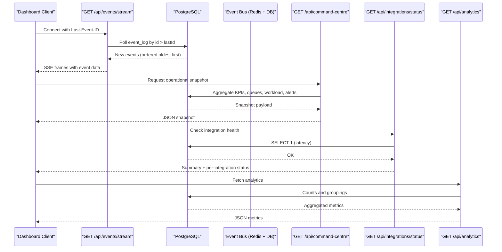
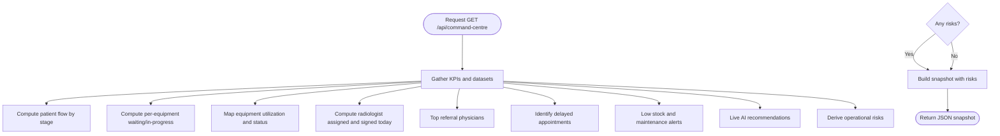
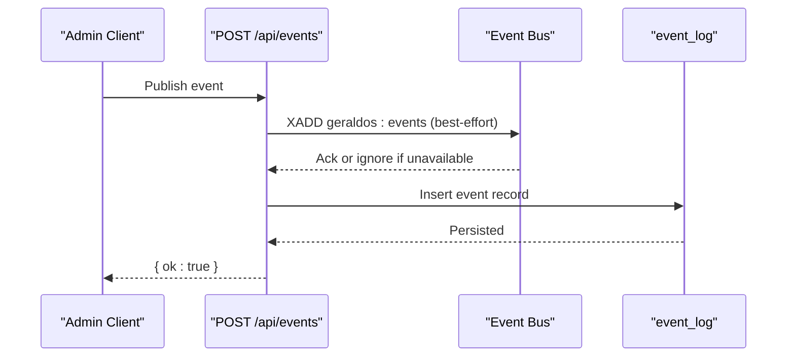
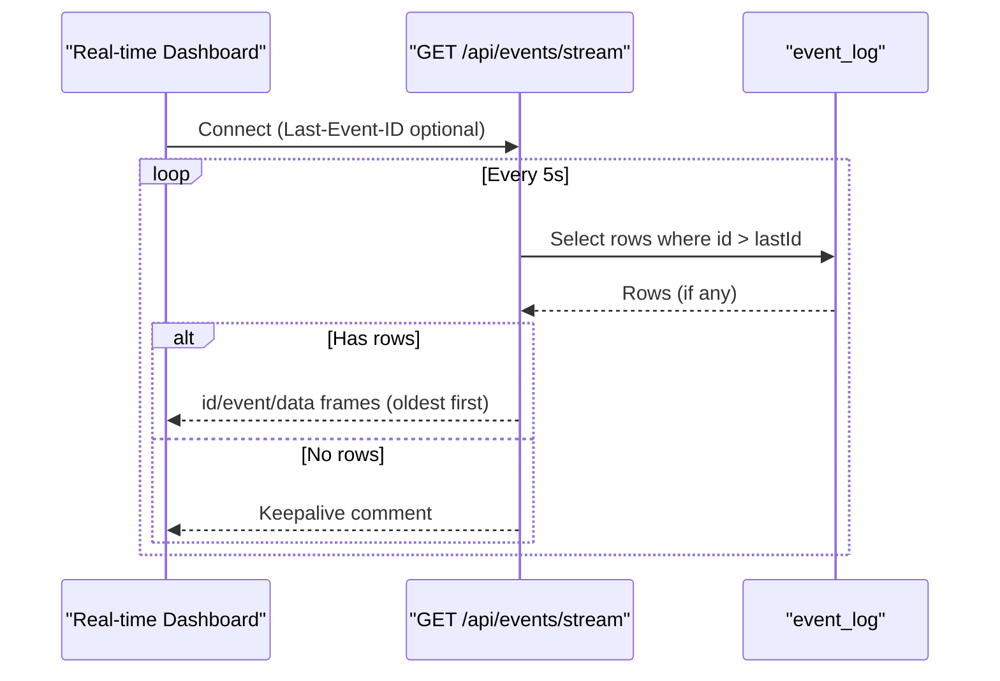
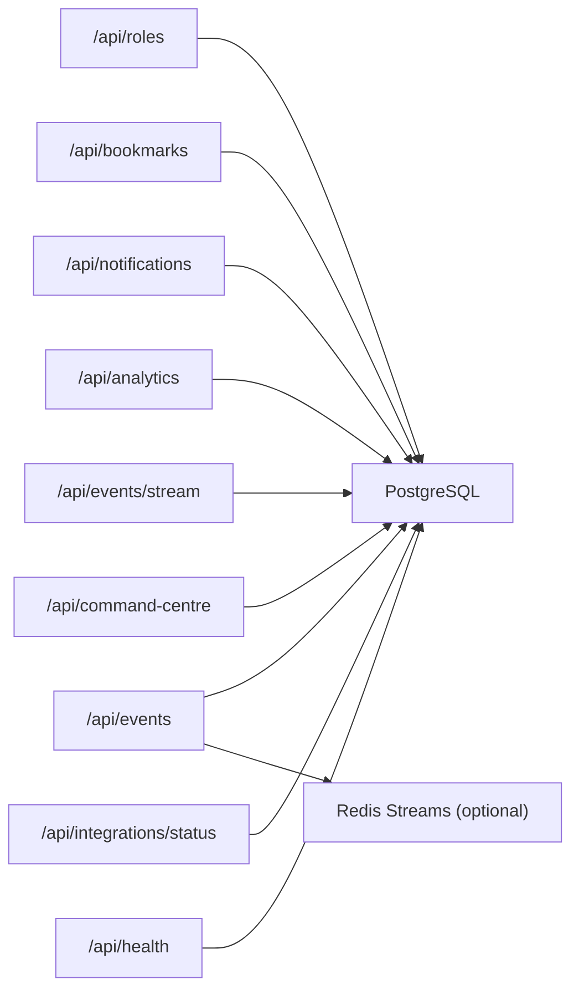

# Administration & System API

<cite>
**Referenced Files in This Document**
- [route.ts](file://src/app/api/health/route.ts)
- [route.ts](file://src/app/api/integrations/status/route.ts)
- [route.ts](file://src/app/api/command-centre/route.ts)
- [command-centre.ts](file://src/lib/command-centre.ts)
- [route.ts](file://src/app/api/events/route.ts)
- [events.ts](file://src/lib/events.ts)
- [route.ts](file://src/app/api/events/stream/route.ts)
- [route.ts](file://src/app/api/analytics/route.ts)
- [route.ts](file://src/app/api/bookmarks/route.ts)
- [route.ts](file://src/app/api/notifications/route.ts)
- [route.ts](file://src/app/api/roles/route.ts)
- [route.ts](file://src/app/api/docs/route.ts)
- [schema.ts](file://src/db/schema.ts)
</cite>

## Table of Contents
1. Introduction
2. Project Structure
3. Core Components
4. Architecture Overview
5. Detailed Component Analysis
6. Dependency Analysis
7. Performance Considerations
8. Troubleshooting Guide
9. Conclusion
10. Appendices

## Introduction
This document provides detailed API documentation for system administration and monitoring endpoints, including role-based access control, notification management, bookmark operations, event streaming via Server-Sent Events (SSE), command centre operations for real-time monitoring, analytics endpoints for reporting, integration status checks, health checks, system diagnostics, and API documentation generation. It also explains the event-driven architecture using Redis Streams with durable persistence to a database table, enabling real-time updates and system monitoring capabilities. Examples are included for administrative tasks, system monitoring, and real-time dashboard integration.

## Project Structure
The relevant endpoints are implemented as Next.js Route Handlers under src/app/api. Key areas include:
- Health and integrations status
- Command centre snapshot
- Event listing and SSE streaming
- Analytics aggregation
- Notifications and bookmarks
- Roles and permissions
- OpenAPI documentation generation

**Diagram sources**
- [route.ts:6-13](file://src/app/api/health/route.ts#L6-L13)
- [route.ts:8-41](file://src/app/api/integrations/status/route.ts#L8-L41)
- [route.ts:7-14](file://src/app/api/command-centre/route.ts#L7-L14)
- [command-centre.ts:54-206](file://src/lib/command-centre.ts#L54-L206)
- [route.ts:7-37](file://src/app/api/events/route.ts#L7-L37)
- [events.ts:101-131](file://src/lib/events.ts#L101-L131)
- [route.ts:20-93](file://src/app/api/events/stream/route.ts#L20-L93)
- [route.ts:6-57](file://src/app/api/analytics/route.ts#L6-L57)
- [route.ts:10-56](file://src/app/api/notifications/route.ts#L10-L56)
- [route.ts:10-52](file://src/app/api/bookmarks/route.ts#L10-L52)
- [route.ts:5-57](file://src/app/api/roles/route.ts#L5-L57)
- [route.ts:11-433](file://src/app/api/docs/route.ts#L11-L433)

**Section sources**
- [route.ts:6-13](file://src/app/api/health/route.ts#L6-L13)
- [route.ts:8-41](file://src/app/api/integrations/status/route.ts#L8-L41)
- [route.ts:7-14](file://src/app/api/command-centre/route.ts#L7-L14)
- [command-centre.ts:54-206](file://src/lib/command-centre.ts#L54-L206)
- [route.ts:7-37](file://src/app/api/events/route.ts#L7-L37)
- [events.ts:101-131](file://src/lib/events.ts#L101-L131)
- [route.ts:20-93](file://src/app/api/events/stream/route.ts#L20-L93)
- [route.ts:6-57](file://src/app/api/analytics/route.ts#L6-L57)
- [route.ts:10-56](file://src/app/api/notifications/route.ts#L10-L56)
- [route.ts:10-52](file://src/app/api/bookmarks/route.ts#L10-L52)
- [route.ts:5-57](file://src/app/api/roles/route.ts#L5-L57)
- [route.ts:11-433](file://src/app/api/docs/route.ts#L11-L433)

## Core Components
- Health check endpoint verifies database connectivity and returns a simple ok flag.
- Integration status endpoint reports health and latency for PostgreSQL and other configured integrations.
- Command centre endpoint aggregates operational KPIs, queues, equipment utilization, radiologist workload, alerts, and risks into a single snapshot.
- Events API supports listing recent events and publishing new ones; SSE stream provides real-time updates based on persisted events.
- Analytics endpoint aggregates counts and distributions across core entities for reporting dashboards.
- Notifications endpoint manages creation and retrieval of notifications with unread-first ordering and publishes an event on creation.
- Bookmarks endpoint allows users to save and retrieve study references with audit logging on creation.
- Roles endpoint lists roles with normalized permissions and supports creating new roles.
- Docs endpoint serves an OpenAPI 3.1 specification describing all routes.

**Section sources**
- [route.ts:6-13](file://src/app/api/health/route.ts#L6-L13)
- [route.ts:8-41](file://src/app/api/integrations/status/route.ts#L8-L41)
- [route.ts:7-14](file://src/app/api/command-centre/route.ts#L7-L14)
- [command-centre.ts:54-206](file://src/lib/command-centre.ts#L54-L206)
- [route.ts:7-37](file://src/app/api/events/route.ts#L7-L37)
- [events.ts:101-131](file://src/lib/events.ts#L101-L131)
- [route.ts:20-93](file://src/app/api/events/stream/route.ts#L20-L93)
- [route.ts:6-57](file://src/app/api/analytics/route.ts#L6-L57)
- [route.ts:10-56](file://src/app/api/notifications/route.ts#L10-L56)
- [route.ts:10-52](file://src/app/api/bookmarks/route.ts#L10-L52)
- [route.ts:5-57](file://src/app/api/roles/route.ts#L5-L57)
- [route.ts:11-433](file://src/app/api/docs/route.ts#L11-L433)

## Architecture Overview
The system uses an event-driven architecture where actions publish events to Redis Streams when available and persist them to a durable event_log table. Real-time clients consume events via SSE from the events stream endpoint, which polls the database for new events since the last received id. The command centre aggregates multiple data sources into a comprehensive operational snapshot. Integrations status reports health and latency for external services.

**Diagram sources**
- [route.ts:20-93](file://src/app/api/events/stream/route.ts#L20-L93)
- [events.ts:101-131](file://src/lib/events.ts#L101-L131)
- [route.ts:7-14](file://src/app/api/command-centre/route.ts#L7-L14)
- [command-centre.ts:54-206](file://src/lib/command-centre.ts#L54-L206)
- [route.ts:8-41](file://src/app/api/integrations/status/route.ts#L8-L41)
- [route.ts:6-57](file://src/app/api/analytics/route.ts#L6-L57)

## Detailed Component Analysis

### Health Check
- Endpoint: GET /api/health
- Purpose: Verify database connectivity and return a simple health indicator.
- Behavior: Executes a minimal query; returns ok true on success or ok false with 500 on failure.

**Section sources**
- [route.ts:6-13](file://src/app/api/health/route.ts#L6-L13)

### Integration Status
- Endpoint: GET /api/integrations/status
- Purpose: Report health and latency for PostgreSQL and other configured integrations.
- Behavior: Tests database connectivity, collects integration statuses, computes summary counts (connected/unreachable/not_configured).

**Section sources**
- [route.ts:8-41](file://src/app/api/integrations/status/route.ts#L8-L41)

### Command Centre
- Endpoint: GET /api/command-centre
- Purpose: Provide a full real-time operational snapshot including KPIs, patient flow, queue, machine utilization, radiologist workload, referral sources, appointment delays, inventory alerts, maintenance alerts, live AI recommendations, and operational risks.
- Behavior: Aggregates data from multiple tables and returns a structured snapshot.

**Diagram sources**
- [command-centre.ts:54-206](file://src/lib/command-centre.ts#L54-L206)

**Section sources**
- [route.ts:7-14](file://src/app/api/command-centre/route.ts#L7-L14)
- [command-centre.ts:54-206](file://src/lib/command-centre.ts#L54-L206)

### Events API (List and Publish)
- Endpoints:
  - GET /api/events?type=...&limit=...
  - POST /api/events { type, aggregate, aggregateId?, payload? }
- Purpose: List recent platform events and publish new events.
- Behavior: Validates event types (known or custom.*), persists events to both Redis Streams (when configured) and the event_log table, and returns results.

**Diagram sources**
- [route.ts:18-37](file://src/app/api/events/route.ts#L18-L37)
- [events.ts:101-131](file://src/lib/events.ts#L101-L131)

**Section sources**
- [route.ts:7-37](file://src/app/api/events/route.ts#L7-L37)
- [events.ts:101-131](file://src/lib/events.ts#L101-L131)

### Events Streaming (SSE)
- Endpoint: GET /api/events/stream
- Purpose: Provide a persistent Server-Sent Events stream for real-time workstation updates.
- Behavior: Maintains a long-lived connection, polls the event_log table every ~5 seconds for new events since the last received id, sends events in order, and handles keepalive comments on errors.

**Diagram sources**
- [route.ts:20-93](file://src/app/api/events/stream/route.ts#L20-L93)

**Section sources**
- [route.ts:20-93](file://src/app/api/events/stream/route.ts#L20-L93)

### Analytics
- Endpoint: GET /api/analytics
- Purpose: Provide aggregated metrics for reporting dashboards.
- Behavior: Returns counts for patients, appointments, studies, equipment, reports; low stock items count; equipment grouped by status; studies grouped by stage and modality.

**Section sources**
- [route.ts:6-57](file://src/app/api/analytics/route.ts#L6-L57)

### Notifications
- Endpoints:
  - GET /api/notifications?limit=...
  - POST /api/notifications { title, body?, type?, severity?, link?, userId? }
- Purpose: Manage notifications with unread-first ordering and publish an event upon creation.
- Behavior: Retrieves unread and recent notifications, returns unread count; creates notifications and emits a notification.sent event.

**Section sources**
- [route.ts:10-56](file://src/app/api/notifications/route.ts#L10-L56)
- [events.ts:101-131](file://src/lib/events.ts#L101-L131)

### Bookmarks
- Endpoints:
  - GET /api/bookmarks?userId=...
  - POST /api/bookmarks { studyId?, orthancStudyId?, label, note, userId? }
- Purpose: Save and retrieve study bookmarks for workspace personalization.
- Behavior: Filters bookmarks by userId; creates bookmarks and records an audit entry for created actions.

**Section sources**
- [route.ts:10-52](file://src/app/api/bookmarks/route.ts#L10-L52)

### Roles and Permissions
- Endpoints:
  - GET /api/roles
  - POST /api/roles { name, description?, permissions[] }
- Purpose: List roles with normalized permissions and create new roles.
- Behavior: Normalizes permissions stored as arrays or JSON objects; creates roles with default isSystem=false.

**Section sources**
- [route.ts:5-57](file://src/app/api/roles/route.ts#L5-L57)

### API Documentation Generation
- Endpoint: GET /api/docs
- Purpose: Serve an OpenAPI 3.1 specification describing all routes, parameters, request/response schemas, tags, and responses.
- Behavior: Returns a complete spec with caching headers for efficient consumption by tools.

**Section sources**
- [route.ts:11-433](file://src/app/api/docs/route.ts#L11-L433)

## Dependency Analysis
Key dependencies and relationships:
- Health and integration status depend on PostgreSQL connectivity.
- Command centre depends on multiple domain tables to compute KPIs and alerts.
- Events API depends on the event bus (Redis Streams optional) and event_log table for durability.
- SSE streaming depends on event_log polling and client-provided Last-Event-ID.
- Analytics depends on core tables for counts and groupings.
- Notifications and bookmarks depend on their respective tables and emit/record side effects.
- Roles depend on the roles table and normalize permissions.

**Diagram sources**
- [route.ts:6-13](file://src/app/api/health/route.ts#L6-L13)
- [route.ts:8-41](file://src/app/api/integrations/status/route.ts#L8-L41)
- [route.ts:7-14](file://src/app/api/command-centre/route.ts#L7-L14)
- [command-centre.ts:54-206](file://src/lib/command-centre.ts#L54-L206)
- [route.ts:7-37](file://src/app/api/events/route.ts#L7-L37)
- [events.ts:101-131](file://src/lib/events.ts#L101-L131)
- [route.ts:20-93](file://src/app/api/events/stream/route.ts#L20-L93)
- [route.ts:6-57](file://src/app/api/analytics/route.ts#L6-L57)
- [route.ts:10-56](file://src/app/api/notifications/route.ts#L10-L56)
- [route.ts:10-52](file://src/app/api/bookmarks/route.ts#L10-L52)
- [route.ts:5-57](file://src/app/api/roles/route.ts#L5-L57)

**Section sources**
- [route.ts:6-13](file://src/app/api/health/route.ts#L6-L13)
- [route.ts:8-41](file://src/app/api/integrations/status/route.ts#L8-L41)
- [route.ts:7-14](file://src/app/api/command-centre/route.ts#L7-L14)
- [command-centre.ts:54-206](file://src/lib/command-centre.ts#L54-L206)
- [route.ts:7-37](file://src/app/api/events/route.ts#L7-L37)
- [events.ts:101-131](file://src/lib/events.ts#L101-L131)
- [route.ts:20-93](file://src/app/api/events/stream/route.ts#L20-L93)
- [route.ts:6-57](file://src/app/api/analytics/route.ts#L6-L57)
- [route.ts:10-56](file://src/app/api/notifications/route.ts#L10-L56)
- [route.ts:10-52](file://src/app/api/bookmarks/route.ts#L10-L52)
- [route.ts:5-57](file://src/app/api/roles/route.ts#L5-L57)

## Performance Considerations
- SSE polling interval is set to approximately 5 seconds to balance freshness and load.
- Command centre performs multiple queries; consider indexing frequently filtered columns (e.g., stage, status, dates) to reduce latency.
- Event publishing writes to Redis Streams (best-effort) and always attempts to persist to event_log; ensure adequate DB throughput.
- Analytics queries use aggregations and groupings; monitor query performance and add indexes as needed.
- Health and integration status endpoints should be lightweight; avoid heavy computations in these paths.

[No sources needed since this section provides general guidance]

## Troubleshooting Guide
Common issues and resolutions:
- Database unreachable: Health endpoint returns ok false; verify PostgreSQL connectivity and credentials.
- Redis not configured or down: Event publishing falls back to event_log only; SSE still works via DB polling.
- SSE connection drops: Clients should reconnect and resume using Last-Event-ID; server sends keepalive comments on transient errors.
- Command centre slow: Review query complexity and add indexes on commonly filtered fields such as stage, status, and date/time columns.
- Analytics stale data: Ensure underlying tables are updated; consider caching strategies at the application layer if needed.

**Section sources**
- [route.ts:6-13](file://src/app/api/health/route.ts#L6-L13)
- [events.ts:101-131](file://src/lib/events.ts#L101-L131)
- [route.ts:20-93](file://src/app/api/events/stream/route.ts#L20-L93)
- [command-centre.ts:54-206](file://src/lib/command-centre.ts#L54-L206)

## Conclusion
The Administration & System API provides robust health checks, integration status, real-time command centre snapshots, event-driven updates via SSE, analytics for reporting, and administrative endpoints for notifications, bookmarks, and roles. The event-driven architecture ensures resilience by persisting events to a durable table while leveraging Redis Streams for high-performance distribution when available. The OpenAPI docs endpoint enables self-documentation and easy integration for partners and tools.

[No sources needed since this section summarizes without analyzing specific files]

## Appendices

### Example Usage Scenarios
- Administrative tasks:
  - Create a notification to alert staff about system maintenance.
  - Create a role with specific permissions for a new admin user.
  - Bookmark important studies for quick access in the radiology workspace.
- System monitoring:
  - Poll /api/health to verify database connectivity.
  - Use /api/integrations/status to monitor all service health and latencies.
  - Consume /api/command-centre to display operational KPIs and alerts.
- Real-time dashboard integration:
  - Connect to /api/events/stream with Last-Event-ID to receive live updates.
  - Subscribe to specific event types via /api/events?filter by type for targeted feeds.
  - Render analytics from /api/analytics to show counts and distributions.

[No sources needed since this section provides conceptual examples]