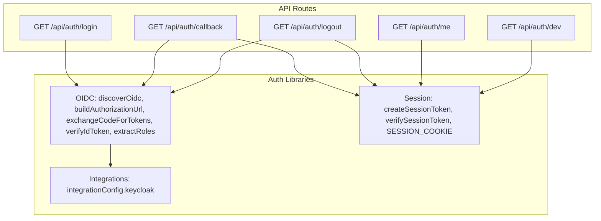
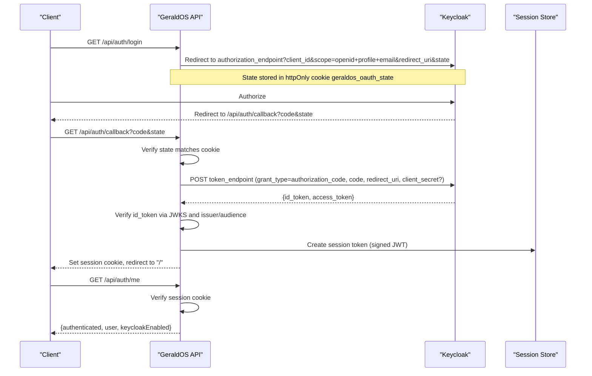
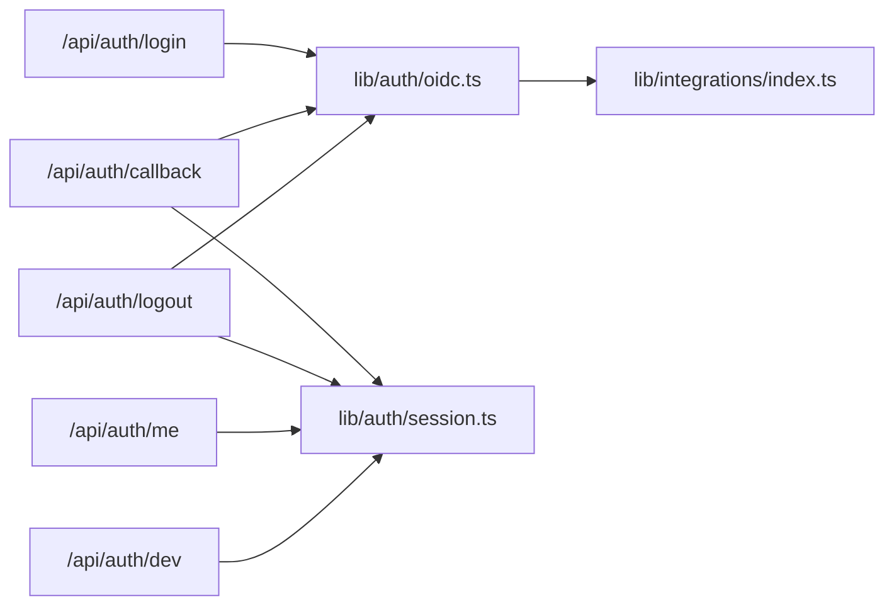

# Authentication API

<cite>
**Referenced Files in This Document**
- [route.ts](file://src/app/api/auth/login/route.ts)
- [route.ts](file://src/app/api/auth/callback/route.ts)
- [route.ts](file://src/app/api/auth/logout/route.ts)
- [route.ts](file://src/app/api/auth/me/route.ts)
- [route.ts](file://src/app/api/auth/dev/route.ts)
- [oidc.ts](file://src/lib/auth/oidc.ts)
- [session.ts](file://src/lib/auth/session.ts)
- [index.ts](file://src/lib/integrations/index.ts)
</cite>

## Table of Contents
1. Introduction
2. Project Structure
3. Core Components
4. Architecture Overview
5. Detailed Component Analysis
6. Dependency Analysis
7. Performance Considerations
8. Troubleshooting Guide
9. Conclusion
10. Appendices

## Introduction
This document provides comprehensive API documentation for GeraldOS authentication endpoints that integrate with Keycloak via OpenID Connect (OIDC). It covers login, logout, session management, and user profile retrieval, including HTTP methods, URL patterns, request/response schemas, OAuth2/OIDC parameters, token handling, and error responses. It also documents development mode authentication and callback handling, along with client implementation examples for web, mobile, and server-to-server scenarios.

## Project Structure
Authentication is implemented as Next.js API routes under src/app/api/auth with supporting libraries for OIDC discovery, token exchange, JWT verification, and session management. Integration configuration for Keycloak is centralized in the integrations module.

**Diagram sources**
- [route.ts:7-30](file://src/app/api/auth/login/route.ts#L7-L30)
- [route.ts:13-59](file://src/app/api/auth/callback/route.ts#L13-L59)
- [route.ts:8-30](file://src/app/api/auth/logout/route.ts#L8-L30)
- [route.ts:7-14](file://src/app/api/auth/me/route.ts#L7-L14)
- [route.ts:12-41](file://src/app/api/auth/dev/route.ts#L12-L41)
- [oidc.ts:18-95](file://src/lib/auth/oidc.ts#L18-L95)
- [session.ts:1-46](file://src/lib/auth/session.ts#L1-L46)
- [index.ts:8-17](file://src/lib/integrations/index.ts#L8-L17)

**Section sources**
- [route.ts:7-30](file://src/app/api/auth/login/route.ts#L7-L30)
- [route.ts:13-59](file://src/app/api/auth/callback/route.ts#L13-L59)
- [route.ts:8-30](file://src/app/api/auth/logout/route.ts#L8-L30)
- [route.ts:7-14](file://src/app/api/auth/me/route.ts#L7-L14)
- [route.ts:12-41](file://src/app/api/auth/dev/route.ts#L12-L41)
- [oidc.ts:18-95](file://src/lib/auth/oidc.ts#L18-L95)
- [session.ts:1-46](file://src/lib/auth/session.ts#L1-L46)
- [index.ts:8-17](file://src/lib/integrations/index.ts#L8-L17)

## Core Components
- OIDC Discovery and Authorization: Discovers Keycloak endpoints, builds authorization URLs, exchanges authorization codes for tokens, verifies ID tokens using JWKS, and extracts roles from claims.
- Session Management: Creates and verifies signed session cookies containing minimal user identity and roles; cookie name and lifetime are defined centrally.
- Integration Configuration: Centralizes Keycloak settings (URL, realm, client id, optional secret) and exposes a computed issuer URL used by OIDC utilities.

Key responsibilities:
- Login initiates an OIDC authorization flow to Keycloak and sets an OAuth state cookie.
- Callback validates state, exchanges code for tokens, verifies ID token, creates a session cookie, and redirects to the application root.
- Logout clears the session cookie and optionally redirects to Keycloak’s end session endpoint.
- Me returns current session status and user info if authenticated.
- Dev provides a local admin session when Keycloak is not configured or DEV_AUTH is enabled.

**Section sources**
- [oidc.ts:14-95](file://src/lib/auth/oidc.ts#L14-L95)
- [session.ts:1-46](file://src/lib/auth/session.ts#L1-L46)
- [index.ts:8-17](file://src/lib/integrations/index.ts#L8-L17)

## Architecture Overview
The authentication architecture follows the standard OIDC Authorization Code flow with PKCE-like state validation and server-side session cookies.

**Diagram sources**
- [route.ts:7-30](file://src/app/api/auth/login/route.ts#L7-L30)
- [route.ts:13-59](file://src/app/api/auth/callback/route.ts#L13-L59)
- [oidc.ts:32-88](file://src/lib/auth/oidc.ts#L32-L88)
- [session.ts:18-45](file://src/lib/auth/session.ts#L18-L45)

## Detailed Component Analysis

### Login Endpoint
- Method: GET
- Path: /api/auth/login
- Behavior:
  - If Keycloak is not configured, redirects to /login with an error.
  - Discovers OIDC configuration from Keycloak.
  - Generates a random state and stores it in an httpOnly cookie named geraldos_oauth_state.
  - Builds an OIDC authorization URL with scope openid profile email and redirects the client to Keycloak.
- Query Parameters: None
- Response: HTTP 302 redirect to Keycloak authorization endpoint
- Error Handling: Redirects to /login with encoded error message on exceptions

**Section sources**
- [route.ts:7-30](file://src/app/api/auth/login/route.ts#L7-L30)
- [oidc.ts:18-46](file://src/lib/auth/oidc.ts#L18-L46)

### Callback Endpoint
- Method: GET
- Path: /api/auth/callback
- Behavior:
  - Validates presence and equality of state parameter against saved cookie.
  - Discovers OIDC configuration and exchanges authorization code for tokens at Keycloak token endpoint.
  - Verifies the ID token using JWKS and checks issuer and audience.
  - Extracts roles from realm and client scopes.
  - Creates a signed session token and sets it as an httpOnly cookie named geraldos_session with an 8-hour max age.
  - Deletes the temporary OAuth state cookie and redirects to /.
- Query Parameters: code, state
- Response: HTTP 302 redirect to application root with session cookie set
- Error Handling: Redirects to /login with encoded error message on failures

**Section sources**
- [route.ts:13-59](file://src/app/api/auth/callback/route.ts#L13-L59)
- [oidc.ts:48-95](file://src/lib/auth/oidc.ts#L48-L95)
- [session.ts:18-45](file://src/lib/auth/session.ts#L18-L45)

### Logout Endpoint
- Method: GET
- Path: /api/auth/logout
- Behavior:
  - Clears the session cookie and redirects to /login with a signed_out flag.
  - If Keycloak is configured and supports end session endpoint, redirects to Keycloak’s end session with post_logout_redirect_uri and client_id.
- Query Parameters: None
- Response: HTTP 302 redirect to Keycloak end session or /login
- Error Handling: Falls back to local logout if Keycloak discovery fails

**Section sources**
- [route.ts:8-30](file://src/app/api/auth/logout/route.ts#L8-L30)
- [oidc.ts:18-29](file://src/lib/auth/oidc.ts#L18-L29)

### Current User Endpoint
- Method: GET
- Path: /api/auth/me
- Behavior:
  - Reads the session cookie and verifies the session token.
  - Returns authenticated status, user payload (sub, name, email, roles), and whether Keycloak is enabled.
- Query Parameters: None
- Response:
  - 200 OK: { authenticated: true, user: { sub, name, email?, roles[], iss }, keycloakEnabled: boolean }
  - 401 Unauthorized: { authenticated: false, keycloakEnabled: boolean }
- Error Handling: Returns 401 when no valid session exists

**Section sources**
- [route.ts:7-14](file://src/app/api/auth/me/route.ts#L7-L14)
- [session.ts:32-45](file://src/lib/auth/session.ts#L32-L45)

### Development Mode Sign-In
- Method: GET
- Path: /api/auth/dev
- Behavior:
  - Allows local sign-in when Keycloak is not configured or when DEV_AUTH=true.
  - Issues a session token with predefined administrator roles and sets the session cookie.
  - Records an audit event for the dev login.
- Query Parameters: None
- Response: HTTP 302 redirect to application root with session cookie set
- Error Handling: Redirects to /login with dev_auth_disabled when dev sign-in is not allowed

**Section sources**
- [route.ts:12-41](file://src/app/api/auth/dev/route.ts#L12-L41)
- [session.ts:18-29](file://src/lib/auth/session.ts#L18-L29)

### OIDC Utilities
- Discovery: Fetches .well-known/openid-configuration from Keycloak issuer with caching per issuer.
- Authorization URL: Constructs authorization_endpoint query with client_id, response_type=code, scope=openid profile email, redirect_uri, state.
- Token Exchange: POST to token_endpoint with grant_type=authorization_code, client_id, code, redirect_uri, and optional client_secret.
- ID Token Verification: Uses JWKS to verify signature and checks issuer and audience.
- Role Extraction: Combines realm_access.roles and resource_access[clientId].roles into a unique list.

**Section sources**
- [oidc.ts:18-95](file://src/lib/auth/oidc.ts#L18-L95)
- [index.ts:8-17](file://src/lib/integrations/index.ts#L8-L17)

### Session Utilities
- Cookie Name: geraldos_session
- Creation: Signs a JWT with HS256 using AUTH_SECRET (or default dev secret), includes name, email, roles, iss, subject=sub, issued-at, and expiration time.
- Verification: Verifies signature and returns normalized user object or null on failure.

**Section sources**
- [session.ts:1-46](file://src/lib/auth/session.ts#L1-L46)

## Dependency Analysis
Authentication routes depend on:
- OIDC utilities for discovery, authorization URL building, token exchange, ID token verification, and role extraction.
- Session utilities for creating and verifying signed session cookies.
- Integration configuration for Keycloak settings and issuer computation.

**Diagram sources**
- [route.ts:7-30](file://src/app/api/auth/login/route.ts#L7-L30)
- [route.ts:13-59](file://src/app/api/auth/callback/route.ts#L13-L59)
- [route.ts:8-30](file://src/app/api/auth/logout/route.ts#L8-L30)
- [route.ts:7-14](file://src/app/api/auth/me/route.ts#L7-L14)
- [route.ts:12-41](file://src/app/api/auth/dev/route.ts#L12-L41)
- [oidc.ts:18-95](file://src/lib/auth/oidc.ts#L18-L95)
- [session.ts:1-46](file://src/lib/auth/session.ts#L1-L46)
- [index.ts:8-17](file://src/lib/integrations/index.ts#L8-L17)

**Section sources**
- [oidc.ts:18-95](file://src/lib/auth/oidc.ts#L18-L95)
- [session.ts:1-46](file://src/lib/auth/session.ts#L1-L46)
- [index.ts:8-17](file://src/lib/integrations/index.ts#L8-L17)

## Performance Considerations
- OIDC discovery results are cached per issuer to avoid repeated network calls during a process lifetime.
- All external requests use timeouts to prevent hanging operations.
- Session cookies are short-lived (8 hours) to balance security and usability.
- Role extraction avoids duplicates by deduplicating arrays.

[No sources needed since this section provides general guidance]

## Troubleshooting Guide
Common issues and resolutions:
- Keycloak not configured: Login redirects to /login with error; ensure KEYCLOAK_URL is set.
- Invalid OAuth state: Callback rejects mismatched state; ensure state cookie is present and matches query parameter.
- Token exchange failed: Check Keycloak token endpoint connectivity and credentials; review error messages returned.
- ID token verification failed: Validate issuer and audience match Keycloak configuration; ensure JWKS URI is reachable.
- Dev auth disabled: When Keycloak is configured and DEV_AUTH is not true, dev route redirects with error; enable DEV_AUTH or configure Keycloak.

**Section sources**
- [route.ts:7-30](file://src/app/api/auth/login/route.ts#L7-L30)
- [route.ts:13-59](file://src/app/api/auth/callback/route.ts#L13-L59)
- [route.ts:12-41](file://src/app/api/auth/dev/route.ts#L12-L41)
- [oidc.ts:18-88](file://src/lib/auth/oidc.ts#L18-L88)

## Conclusion
GeraldOS implements a secure, standards-compliant OIDC authentication flow with Keycloak, using server-side session cookies for subsequent requests. The API provides clear endpoints for login, callback, logout, and current user retrieval, with robust error handling and support for development mode. Clients can integrate using standard OIDC flows for web and mobile apps, while server-to-server clients should rely on the session-based endpoints after initial OIDC login.

[No sources needed since this section summarizes without analyzing specific files]

## Appendices

### API Endpoints Summary
- GET /api/auth/login
  - Purpose: Start OIDC login flow
  - Response: 302 redirect to Keycloak authorization_endpoint
  - Cookies: Sets geraldos_oauth_state (httpOnly, sameSite=lax, path=/, maxAge=600s)
  - Errors: Redirects to /login?error=keycloak_not_configured or /login?error=<encoded_error>

- GET /api/auth/callback
  - Purpose: Complete OIDC login
  - Query: code, state
  - Response: 302 redirect to / with session cookie set
  - Cookies: Sets geraldos_session (httpOnly, sameSite=lax, path=/, maxAge=8h); deletes geraldos_oauth_state
  - Errors: Redirects to /login?error=invalid_oauth_state or /login?error=<encoded_error>

- GET /api/auth/logout
  - Purpose: End session locally and optionally at Keycloak
  - Response: 302 redirect to /login?signed_out=1 or Keycloak end_session_endpoint
  - Cookies: Deletes geraldos_session

- GET /api/auth/me
  - Purpose: Get current session status and user info
  - Response:
    - 200: { authenticated: true, user: { sub, name, email?, roles[], iss }, keycloakEnabled: boolean }
    - 401: { authenticated: false, keycloakEnabled: boolean }

- GET /api/auth/dev
  - Purpose: Local admin session for development
  - Response: 302 redirect to / with session cookie set
  - Conditions: Allowed when Keycloak is not configured or DEV_AUTH=true
  - Errors: Redirects to /login?error=dev_auth_disabled

**Section sources**
- [route.ts:7-30](file://src/app/api/auth/login/route.ts#L7-L30)
- [route.ts:13-59](file://src/app/api/auth/callback/route.ts#L13-L59)
- [route.ts:8-30](file://src/app/api/auth/logout/route.ts#L8-L30)
- [route.ts:7-14](file://src/app/api/auth/me/route.ts#L7-L14)
- [route.ts:12-41](file://src/app/api/auth/dev/route.ts#L12-L41)

### OIDC Parameters and Flow Details
- Authorization Request Parameters:
  - client_id: From integrationConfig.keycloak.clientId
  - response_type: code
  - scope: openid profile email
  - redirect_uri: /api/auth/callback
  - state: Random UUID stored in geraldos_oauth_state cookie
- Token Exchange Parameters:
  - grant_type: authorization_code
  - client_id: From integrationConfig.keycloak.clientId
  - code: Authorization code from callback
  - redirect_uri: /api/auth/callback
  - client_secret: Optional, included if configured
- ID Token Verification:
  - Issuer: integrationConfig.keycloak.issuer
  - Audience: integrationConfig.keycloak.clientId
  - JWKS: Fetched from oidc.jwks_uri

**Section sources**
- [oidc.ts:32-88](file://src/lib/auth/oidc.ts#L32-L88)
- [index.ts:8-17](file://src/lib/integrations/index.ts#L8-L17)

### Client Implementation Examples

- Web Application (Browser SPA)
  - Initiate login by navigating to /api/auth/login
  - Handle redirect to Keycloak and return to /api/auth/callback
  - After callback, read session via GET /api/auth/me
  - On logout, navigate to /api/auth/logout

- Mobile Application (Native or WebView)
  - Use system browser or embedded WebView to open /api/auth/login
  - Configure deep link or custom scheme to handle /api/auth/callback
  - After callback, call GET /api/auth/me to obtain session and user info
  - On logout, call GET /api/auth/logout

- Server-to-Server (Backend Integration)
  - Perform OIDC authorization code flow server-side to Keycloak
  - Exchange code for tokens at token_endpoint
  - Verify ID token using JWKS and issuer/audience
  - Create a session token via createSessionToken and set cookie for subsequent requests
  - Use GET /api/auth/me to validate session and retrieve user context

[No sources needed since this section provides conceptual guidance]