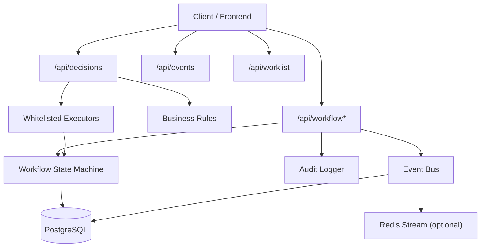
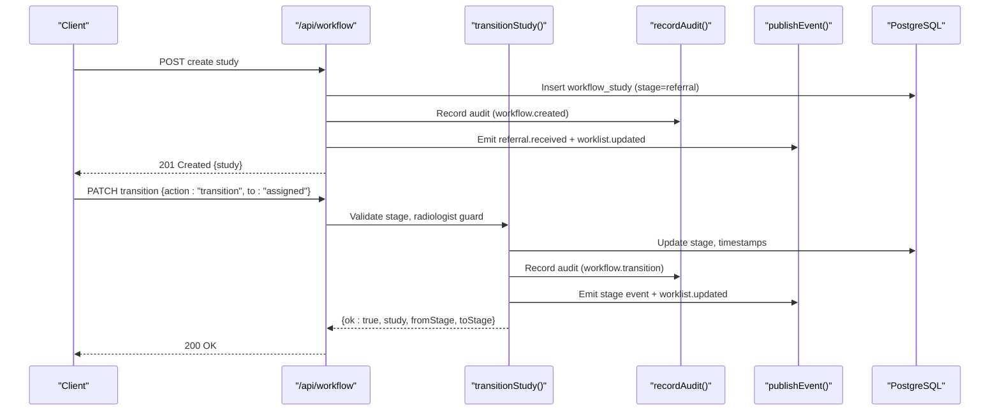
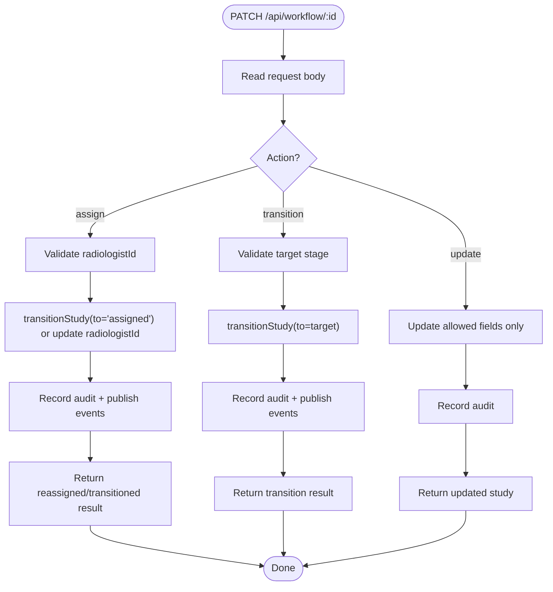
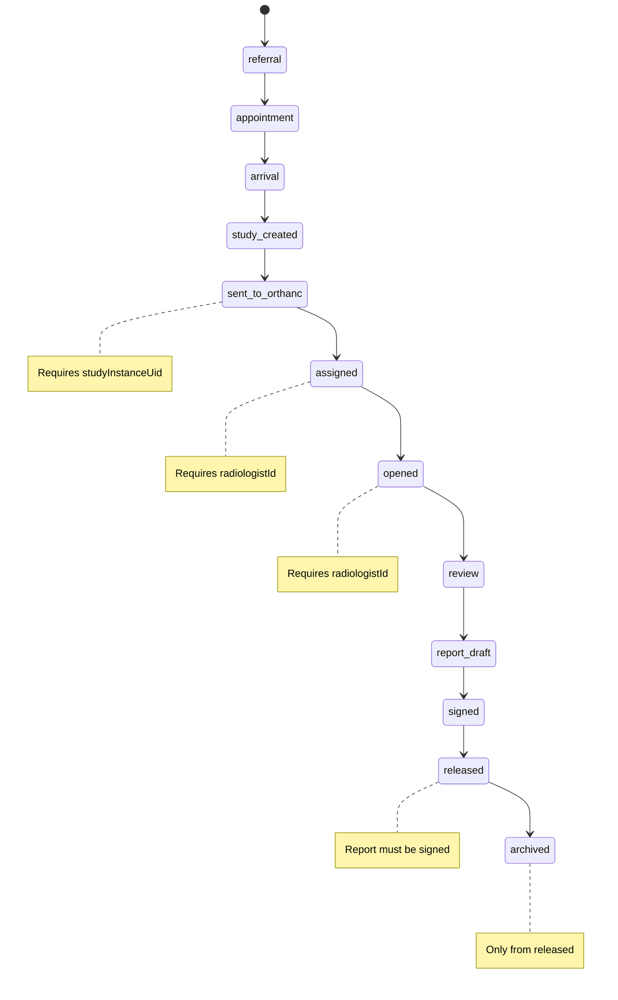
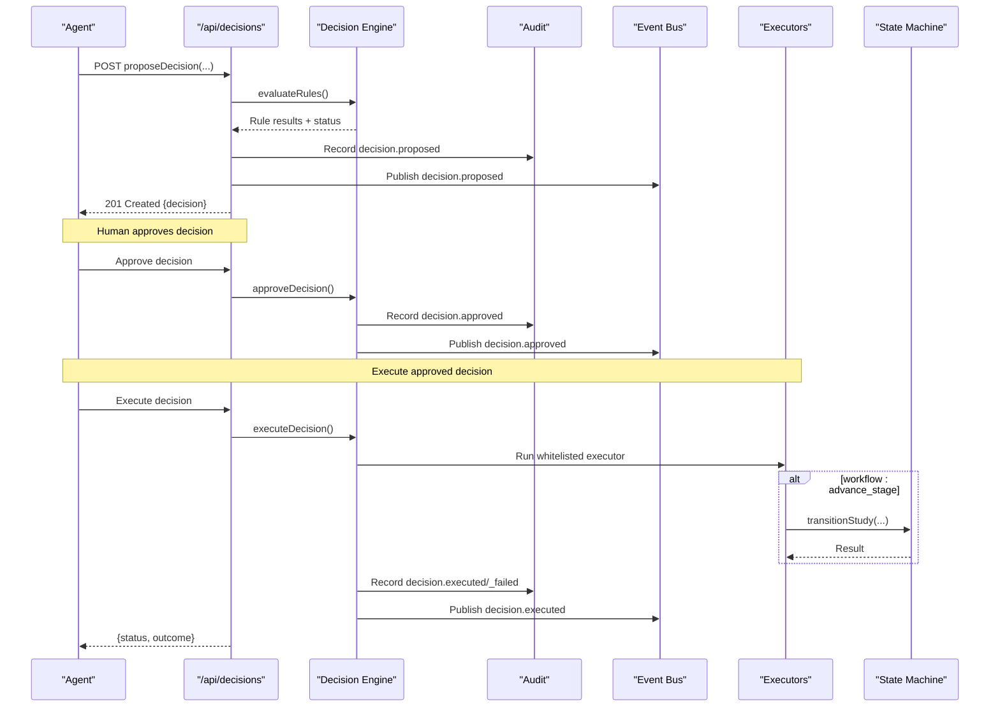
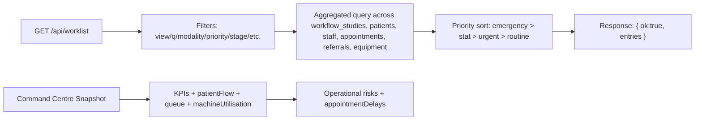
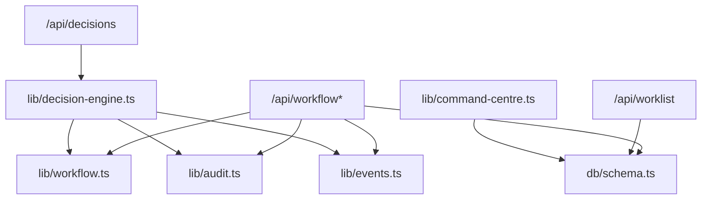

# Clinical Workflow API

<cite>
**Referenced Files in This Document**
- [route.ts](file://src/app/api/workflow/route.ts)
- [route.ts](file://src/app/api/workflow/[id]/route.ts)
- [workflow.ts](file://src/lib/workflow.ts)
- [decision-engine.ts](file://src/lib/decision-engine.ts)
- [events.ts](file://src/lib/events.ts)
- [audit.ts](file://src/lib/audit.ts)
- [schema.ts](file://src/db/schema.ts)
- [route.ts](file://src/app/api/worklist/route.ts)
- [route.ts](file://src/app/api/reports/route.ts)
- [route.ts](file://src/app/api/events/route.ts)
- [route.ts](file://src/app/api/decisions/route.ts)
- [command-centre.ts](file://src/lib/command-centre.ts)
</cite>

## Table of Contents
1. Introduction
2. Project Structure
3. Core Components
4. Architecture Overview
5. Detailed Component Analysis
6. Dependency Analysis
7. Performance Considerations
8. Troubleshooting Guide
9. Conclusion
10. Appendices

## Introduction
This document provides detailed API documentation for clinical workflow management endpoints, focusing on study lifecycle operations, stage transitions, and workflow state management. It explains decision engine integration for business rule validation and approval workflows, and covers monitoring, bottleneck detection, turnaround time tracking, audit logging, compliance checks, and quality assurance processes. Examples are included for automation via the decision engine, manual interventions through PATCH endpoints, and exception handling scenarios.

## Project Structure
The clinical workflow is implemented as a set of Next.js API routes backed by a PostgreSQL database (via Drizzle ORM), with an event-driven architecture using Redis Streams and durable event_log persistence. The core modules include:
- Workflow API routes for listing, creating, and transitioning studies
- A server-side state machine enforcing forward-only transitions and clinical guards
- Decision engine for AI recommendations subject to business rules and human approval
- Event bus for decoupled notifications and worklist updates
- Audit logging for compliance and traceability
- Reporting module for structured report assistance and quality scoring
- Worklist endpoint for querying and filtering active studies
- Command centre snapshot for operational monitoring and bottleneck detection

**Diagram sources**
- [route.ts:12-106](file://src/app/api/workflow/route.ts#L12-L106)
- [route.ts:20-108](file://src/app/api/workflow/[id]/route.ts#L20-L108)
- [workflow.ts:38-243](file://src/lib/workflow.ts#L38-L243)
- [decision-engine.ts:92-244](file://src/lib/decision-engine.ts#L92-L244)
- [events.ts:102-131](file://src/lib/events.ts#L102-L131)
- [audit.ts:4-24](file://src/lib/audit.ts#L4-L24)
- [schema.ts:103-119](file://src/db/schema.ts#L103-L119)

**Section sources**
- [route.ts:12-106](file://src/app/api/workflow/route.ts#L12-L106)
- [route.ts:20-108](file://src/app/api/workflow/[id]/route.ts#L20-L108)
- [workflow.ts:38-243](file://src/lib/workflow.ts#L38-L243)
- [events.ts:102-131](file://src/lib/events.ts#L102-L131)
- [audit.ts:4-24](file://src/lib/audit.ts#L4-L24)
- [schema.ts:103-119](file://src/db/schema.ts#L103-L119)

## Core Components
- Workflow State Machine: Defines canonical stages, validates transitions, enforces clinical guards, timestamps milestones, emits events, and records audits.
- Decision Engine: Proposes decisions from agents, evaluates business rules, requires human approval, and executes whitelisted actions safely.
- Event Bus: Publishes domain events to Redis Streams and persists them durably; supports listing and filtering.
- Audit Logger: Records immutable audit entries for all significant actions.
- Worklist Endpoint: Aggregates patient, scheduling, equipment, and referral context for workstation display.
- Reports Module: Provides templates, draft assistance, terminology checks, and quality scoring for reports.
- Command Centre Snapshot: Aggregates KPIs, bottlenecks, queue lengths, utilization, and operational risks.

**Section sources**
- [workflow.ts:38-243](file://src/lib/workflow.ts#L38-L243)
- [decision-engine.ts:92-244](file://src/lib/decision-engine.ts#L92-L244)
- [events.ts:102-131](file://src/lib/events.ts#L102-L131)
- [audit.ts:4-24](file://src/lib/audit.ts#L4-L24)
- [route.ts:26-118](file://src/app/api/worklist/route.ts#L26-L118)
- [reporting.ts:233-326](file://src/lib/reporting.ts#L233-L326)
- [command-centre.ts:54-206](file://src/lib/command-centre.ts#L54-L206)

## Architecture Overview
The system follows an event-driven architecture with strict server-side validation:
- Clients interact with REST endpoints for workflow and decisions.
- All workflow transitions go through the state machine, which enforces forward-only movement and clinical constraints.
- Decisions proposed by AI or systems pass through business rules and require explicit human approval before execution.
- Every transition and decision action publishes events and writes audit logs.
- Monitoring endpoints expose KPIs and operational risks for bottleneck detection and turnaround time analysis.

**Diagram sources**
- [route.ts:55-101](file://src/app/api/workflow/route.ts#L55-L101)
- [route.ts:20-108](file://src/app/api/workflow/[id]/route.ts#L20-L108)
- [workflow.ts:102-233](file://src/lib/workflow.ts#L102-L233)
- [audit.ts:4-24](file://src/lib/audit.ts#L4-L24)
- [events.ts:102-131](file://src/lib/events.ts#L102-L131)

## Detailed Component Analysis

### Workflow Endpoints
- GET /api/workflow
  - Purpose: List all workflow studies with patient and radiologist context plus stage label.
  - Response: Array of studies including id, accessionNumber, modality, procedure, bodyPart, stage, priority, timestamps, patient details, radiologist details, and stageLabel.
  - Error: 500 if fetch fails.

- POST /api/workflow
  - Purpose: Create a new study at the entry point (stage=referral). Optionally link appointmentId; generates accessionNumber.
  - Request Body: patientId, modality, procedure required; optional appointmentId, bodyPart, priority, changedBy.
  - Side Effects: Creates study, records audit (workflow.created), publishes REFERRAL_RECEIVED and WORKLIST_UPDATED events.
  - Response: 201 Created with ok and study object.
  - Errors: 400 invalid body or missing fields; 500 on failure.

- PATCH /api/workflow/:id
  - Purpose: Perform validated transitions or field updates.
  - Actions:
    - assign: Assign radiologist and move to assigned (or reassign without rolling back if already past assigned).
    - transition: Move to a target stage using action="transition" and to=<stage>.
    - Plain update: Modify allowed fields (priority, radiologistId, studyInstanceUid, bodyPart, procedure, modality).
  - Validation: Enforces known stages, forward-only transitions, required radiologist for assigned/opened, DICOM studyInstanceUid for sent_to_orthanc, signed report requirement for released/archived.
  - Side Effects: Updates study, sets startedAt/completedAt at appropriate milestones, records audit, publishes stage event and worklist.updated, creates notifications for assigned/released.
  - Response: 200 OK with ok, study, transitioned flags, fromStage/toStage when applicable.
  - Errors: 400 invalid inputs; 404 study not found; 409 backward transition; 500 on failure.

**Diagram sources**
- [route.ts:20-108](file://src/app/api/workflow/[id]/route.ts#L20-L108)
- [workflow.ts:102-233](file://src/lib/workflow.ts#L102-L243)

**Section sources**
- [route.ts:12-106](file://src/app/api/workflow/route.ts#L12-L106)
- [route.ts:20-108](file://src/app/api/workflow/[id]/route.ts#L20-L108)
- [workflow.ts:38-243](file://src/lib/workflow.ts#L38-L243)

### Workflow State Machine
- Stages: referral → appointment → arrival → study_created → sent_to_orthanc → assigned → opened → review → report_draft → signed → released → archived.
- Guards:
  - Forward-only transitions enforced by index comparison.
  - sent_to_orthanc requires studyInstanceUid.
  - assigned/opened require radiologistId.
  - signed requires report status signed.
  - released requires signed report.
  - archived reachable only from released.
- Milestones:
  - startedAt set when moving to opened (if not set).
  - completedAt set when moving to released (if not set).
- Side effects:
  - Audit log entry for every transition.
  - Publish stage-specific event and worklist.updated.
  - Notifications created for assigned and released.

**Diagram sources**
- [workflow.ts:38-51](file://src/lib/workflow.ts#L38-L51)
- [workflow.ts:102-165](file://src/lib/workflow.ts#L102-L165)

**Section sources**
- [workflow.ts:38-243](file://src/lib/workflow.ts#L38-L243)

### Decision Engine Integration
- Proposal: Agents propose decisions with recommendation, rationale, priority, targetModule, targetAction, targetPayload.
- Business Rules:
  - no_auto_finalise_reports: Prevents automated signing/finalising reports.
  - no_autonomous_diagnosis: Blocks autonomous diagnosis setting.
  - stat_priority_allowed: STAT priority restricted to scheduling/workflow contexts.
  - reallocation_requires_equipment_context: Slot reallocation must reference equipment or appointments.
- States: proposed → validated → approved → executed/failed; rejected possible from multiple states.
- Execution: Whitelisted executors include workflow:advance_stage, equipment:set_status, notify:staff.
- Audit & Events: Each step records audit and publishes decision events.

**Diagram sources**
- [route.ts:6-38](file://src/app/api/decisions/route.ts#L6-L38)
- [decision-engine.ts:92-244](file://src/lib/decision-engine.ts#L92-L244)
- [workflow.ts:175-190](file://src/lib/workflow.ts#L175-L190)
- [audit.ts:4-24](file://src/lib/audit.ts#L4-L24)
- [events.ts:102-131](file://src/lib/events.ts#L102-L131)

**Section sources**
- [decision-engine.ts:92-244](file://src/lib/decision-engine.ts#L92-L244)
- [route.ts:6-38](file://src/app/api/decisions/route.ts#L6-L38)

### Workflow Monitoring, Bottleneck Detection, Turnaround Time
- Worklist Endpoint:
  - GET /api/worklist supports filters: view (today/unread/stat/emergency/assigned/completed/all), q (search), modality, radiologist, machine, physician, location, priority, stage.
  - Returns enriched entries with patient, radiologist, equipment, referral, and scheduling context.
  - Priority sorting ensures emergency > stat > urgent > routine ordering.

- Command Centre Snapshot:
  - Aggregates KPIs: patients today, appointments checked-in, active studies, pending reports, emergency cases, revenue today, low stock alerts, maintenance open, equipment operational counts.
  - Patient flow counts per stage for bottleneck identification.
  - Queue metrics per equipment: waiting vs in-progress counts.
  - Radiologist workload: assigned counts and signed today.
  - Operational risks: offline/maintenance equipment, low stock, appointment delays, pending reports, claims awaiting response.

- Turnaround Time Tracking:
  - Timestamps captured at key milestones: startedAt (opened), completedAt (released).
  - Use these timestamps to compute TAT for studies and reports.

**Diagram sources**
- [route.ts:26-118](file://src/app/api/worklist/route.ts#L26-L118)
- [command-centre.ts:54-206](file://src/lib/command-centre.ts#L54-L206)

**Section sources**
- [route.ts:26-118](file://src/app/api/worklist/route.ts#L26-L118)
- [command-centre.ts:54-206](file://src/lib/command-centre.ts#L54-L206)

### Audit Logging, Compliance Checks, Quality Assurance
- Audit Logging:
  - recordAudit writes immutable entries capturing userId, action, module, entityType, entityId, details.
  - Used for workflow creation, transitions, decision lifecycle events.

- Compliance Checks:
  - Decision engine rules enforce safety boundaries (no auto-signing, no autonomous diagnosis, STAT restrictions).
  - Workflow state machine enforces clinical handoffs (signed report required before release, archive only from release).

- Quality Assurance:
  - Reporting assistant provides templates, checklists, terminology normalization, critical finding detection, and quality scoring.
  - Incomplete reports flagged for quality gate; suggestions require radiologist confirmation.

**Section sources**
- [audit.ts:4-24](file://src/lib/audit.ts#L4-L24)
- [decision-engine.ts:46-89](file://src/lib/decision-engine.ts#L46-L89)
- [workflow.ts:134-165](file://src/lib/workflow.ts#L134-L165)
- [reporting.ts:233-326](file://src/lib/reporting.ts#L233-L326)

### Examples

#### Automation via Decision Engine
- Scenario: An agent proposes advancing a study to the next stage based on completed imaging.
- Steps:
  - POST /api/decisions with agent, recommendation, targetModule="workflow", targetAction="advance_stage", targetPayload={studyId, stage}.
  - Evaluate rules; if valid, status becomes validated; otherwise remains proposed.
  - Human approves decision; then execute to advance stage through whitelisted executor.
  - State machine validates transition and emits events; audit recorded.

#### Manual Intervention
- Scenario: Reassign a study to another radiologist after initial assignment.
- Steps:
  - PATCH /api/workflow/:id with action="assign" and radiologistId.
  - If already past assigned, updates radiologist without rolling back; otherwise transitions to assigned.
  - Audit and events published; notification created for assignee.

#### Exception Handling
- Backward Transition: Attempting to move from a later stage to an earlier one returns 409 with descriptive error.
- Missing Required Context:
  - sent_to_orthanc without studyInstanceUid returns 400.
  - assigned/opened without radiologistId returns 400.
- Invalid Stage: Unknown or unsupported stage returns 400.
- Study Not Found: PATCH on non-existent id returns 404.

**Section sources**
- [route.ts:20-108](file://src/app/api/workflow/[id]/route.ts#L20-L108)
- [workflow.ts:102-165](file://src/lib/workflow.ts#L102-L165)
- [decision-engine.ts:92-244](file://src/lib/decision-engine.ts#L92-L244)

## Dependency Analysis
- API Routes depend on:
  - Database schema definitions for queries and updates.
  - Workflow state machine for transitions and validations.
  - Decision engine for proposing/executing safe actions.
  - Event bus for publishing domain events.
  - Audit logger for compliance records.
- Command centre depends on aggregated queries across multiple tables to produce KPIs and risk indicators.

**Diagram sources**
- [schema.ts:103-119](file://src/db/schema.ts#L103-L119)
- [workflow.ts:38-243](file://src/lib/workflow.ts#L38-L243)
- [audit.ts:4-24](file://src/lib/audit.ts#L4-L24)
- [events.ts:102-131](file://src/lib/events.ts#L102-L131)
- [decision-engine.ts:92-244](file://src/lib/decision-engine.ts#L92-L244)
- [route.ts:26-118](file://src/app/api/worklist/route.ts#L26-L118)
- [command-centre.ts:54-206](file://src/lib/command-centre.ts#L54-L206)

**Section sources**
- [schema.ts:103-119](file://src/db/schema.ts#L103-L119)
- [workflow.ts:38-243](file://src/lib/workflow.ts#L38-L243)
- [decision-engine.ts:92-244](file://src/lib/decision-engine.ts#L92-L244)
- [events.ts:102-131](file://src/lib/events.ts#L102-L131)
- [audit.ts:4-24](file://src/lib/audit.ts#L4-L24)
- [route.ts:26-118](file://src/app/api/worklist/route.ts#L26-L118)
- [command-centre.ts:54-206](file://src/lib/command-centre.ts#L54-L206)

## Performance Considerations
- Event Bus Resilience:
  - Redis Streams used for real-time distribution with backoff on failures; durable event_log ensures no loss of events even if Redis is down.
- Query Efficiency:
  - Worklist uses selective joins and dynamic conditions to minimize overhead; priority sorting performed in-memory after retrieval.
- State Machine Validation:
  - Server-side validation prevents unnecessary round-trips and client-side inconsistencies; reduces error rates and improves throughput.
- Audit and Events:
  - Non-blocking side effects where possible; failures in notifications do not block transitions.

[No sources needed since this section provides general guidance]

## Troubleshooting Guide
- Common Errors:
  - 400 Invalid body or missing required fields: Ensure POST /api/workflow includes patientId, modality, procedure; ensure PATCH includes valid action or fields.
  - 400 Invalid stage: Verify target stage exists in WORKFLOW_STAGES.
  - 409 Backward transition: Confirm forward-only movement; use state machine helpers to determine next stages.
  - 404 Study not found: Check study id existence before PATCH.
  - 500 Internal errors: Inspect console logs and database connectivity.

- Debugging Tips:
  - Use /api/events to list recent events and verify pipeline progress.
  - Review audit logs for exact actions taken and who initiated them.
  - Use command centre snapshot to identify bottlenecks and operational risks.

**Section sources**
- [route.ts:20-108](file://src/app/api/workflow/[id]/route.ts#L20-L108)
- [route.ts:12-106](file://src/app/api/workflow/route.ts#L12-L106)
- [events.ts:134-157](file://src/lib/events.ts#L134-L157)
- [command-centre.ts:54-206](file://src/lib/command-centre.ts#L54-L206)

## Conclusion
The clinical workflow API provides robust, auditable, and compliant management of study lifecycles through a server-side state machine, decision engine integration, and event-driven architecture. It supports automation via approved decisions, manual interventions with clear validation, and comprehensive monitoring for bottleneck detection and turnaround time tracking. Audit logging and quality assurance processes ensure regulatory compliance and high-quality reporting.

[No sources needed since this section summarizes without analyzing specific files]

## Appendices

### API Reference Summary

- GET /api/workflow
  - Description: List all workflow studies with context and stage labels.
  - Response: Array of study objects with patient and radiologist details.

- POST /api/workflow
  - Description: Create a new study at referral stage.
  - Request Body: patientId, modality, procedure required; optional appointmentId, bodyPart, priority, changedBy.
  - Response: 201 Created with study object.

- PATCH /api/workflow/:id
  - Description: Transition or update study fields.
  - Actions: assign, transition, plain field updates.
  - Response: 200 OK with updated study and transition metadata.

- GET /api/worklist
  - Description: Query worklist with filters and priority sorting.
  - Query Params: view, q, modality, radiologist, machine, physician, location, priority, stage.
  - Response: { ok:true, entries }.

- GET /api/events
  - Description: List recent platform events with optional type filter and limit.
  - Response: { ok:true, events }.

- POST /api/events
  - Description: Publish a manual event (type must be known or custom.).
  - Request Body: type, aggregate, aggregateId, payload.
  - Response: { ok:true }.

- GET /api/decisions
  - Description: List decisions with optional status filter.
  - Response: { ok:true, decisions }.

- POST /api/decisions
  - Description: Propose a decision for evaluation and approval.
  - Request Body: agent, recommendation, rationale, priority, targetModule, targetAction, targetPayload, requestedBy.
  - Response: 201 Created with decision object.

- Reports
  - GET /api/reports: List reports with patient and radiologist context.
  - POST /api/reports: Create a report entry.

**Section sources**
- [route.ts:12-106](file://src/app/api/workflow/route.ts#L12-L106)
- [route.ts:20-108](file://src/app/api/workflow/[id]/route.ts#L20-L108)
- [route.ts:26-118](file://src/app/api/worklist/route.ts#L26-L118)
- [route.ts:6-38](file://src/app/api/events/route.ts#L6-L38)
- [route.ts:6-38](file://src/app/api/decisions/route.ts#L6-L38)
- [route.ts:6-45](file://src/app/api/reports/route.ts#L6-L45)