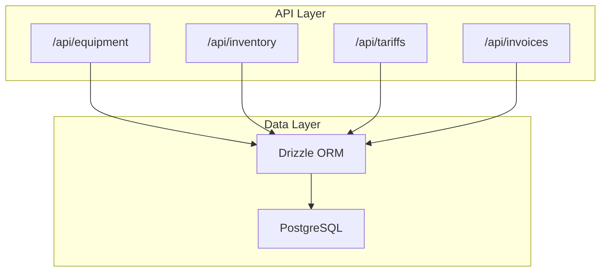
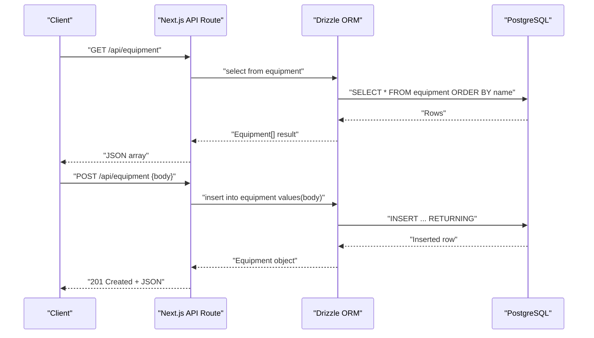
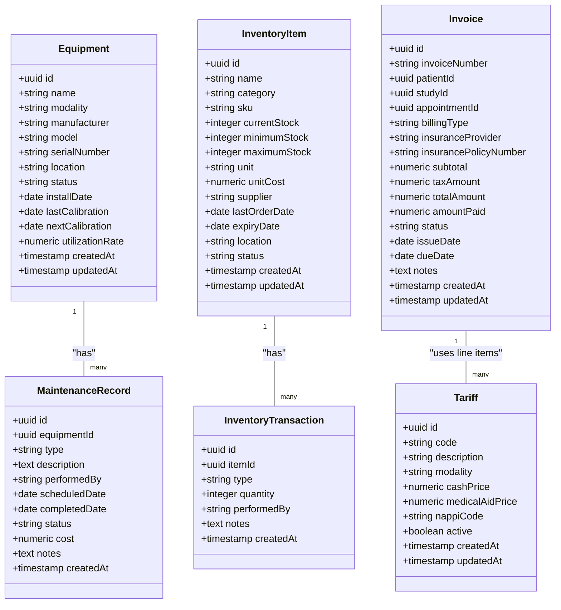

# Equipment & Inventory API

<cite>
**Referenced Files in This Document**
- [route.ts](file://src/app/api/equipment/route.ts)
- [route.ts](file://src/app/api/inventory/route.ts)
- [route.ts](file://src/app/api/tariffs/route.ts)
- [route.ts](file://src/app/api/invoices/route.ts)
- [schema.ts](file://src/db/schema.ts)
- [index.ts](file://src/db/index.ts)
</cite>

## Table of Contents
1. [Introduction](#introduction)
2. [Project Structure](#project-structure)
3. [Core Components](#core-components)
4. [Architecture Overview](#architecture-overview)
5. [Detailed Component Analysis](#detailed-component-analysis)
6. [Dependency Analysis](#dependency-analysis)
7. [Performance Considerations](#performance-considerations)
8. [Troubleshooting Guide](#troubleshooting-guide)
9. [Conclusion](#conclusion)
10. [Appendices](#appendices)

## Introduction
This document provides comprehensive API documentation for equipment and inventory management endpoints, including equipment registry operations, maintenance scheduling, utilization tracking, downtime management, inventory control (stock levels, reorder automation, expiry tracking, supplier management), tariff management for pricing and billing integration, equipment calibration, service history, performance monitoring, and cost tracking scenarios. It also includes examples for equipment allocation, inventory replenishment, and cost tracking workflows.

The current implementation exposes RESTful endpoints using Next.js App Router with Drizzle ORM against a PostgreSQL database. The schema defines the core entities for equipment, maintenance records, inventory items, transactions, tariffs, invoices, and related financial tables.

## Project Structure
The relevant parts of the project structure for this domain include:
- API routes under src/app/api for equipment, inventory, tariffs, and invoices
- Database schema definitions under src/db/schema.ts
- Database connection configuration under src/db/index.ts

**Diagram sources**
- [route.ts:1-24](file://src/app/api/equipment/route.ts#L1-L24)
- [route.ts:1-24](file://src/app/api/inventory/route.ts#L1-L24)
- [route.ts:1-24](file://src/app/api/tariffs/route.ts#L1-L24)
- [route.ts:1-100](file://src/app/api/invoices/route.ts#L1-L100)
- [index.ts:1-25](file://src/db/index.ts#L1-L25)

**Section sources**
- [route.ts:1-24](file://src/app/api/equipment/route.ts#L1-L24)
- [route.ts:1-24](file://src/app/api/inventory/route.ts#L1-L24)
- [route.ts:1-24](file://src/app/api/tariffs/route.ts#L1-L24)
- [route.ts:1-100](file://src/app/api/invoices/route.ts#L1-L100)
- [index.ts:1-25](file://src/db/index.ts#L1-L25)

## Core Components
- Equipment Registry: CRUD for equipment entries; supports modality, manufacturer, model, serial number, location, status, install date, calibration dates, and utilization rate.
- Maintenance Scheduling: Tracks maintenance records linked to equipment, including type, description, performed by, scheduled/completed dates, status, cost, and notes.
- Inventory Control: Manages inventory items with stock thresholds, units, unit costs, suppliers, last order dates, expiry dates, locations, and statuses; tracks inventory transactions for movements.
- Tariff Management: Defines pricing codes per modality with cash and medical aid prices, NAPPi codes, and active flags.
- Billing Integration: Invoices are created with line items referencing tariffs; totals computed and audited.

Key data models used by these components are defined in the schema file.

**Section sources**
- [schema.ts:53-68](file://src/db/schema.ts#L53-L68)
- [schema.ts:122-134](file://src/db/schema.ts#L122-L134)
- [schema.ts:137-164](file://src/db/schema.ts#L137-L164)
- [schema.ts:196-207](file://src/db/schema.ts#L196-L207)
- [schema.ts:209-239](file://src/db/schema.ts#L209-L239)

## Architecture Overview
The API layer exposes simple GET and POST endpoints that query or insert into the database via Drizzle ORM. The database schema defines relationships between equipment and maintenance records, inventory items and transactions, and invoices and tariffs.

**Diagram sources**
- [route.ts:6-23](file://src/app/api/equipment/route.ts#L6-L23)
- [index.ts:14-24](file://src/db/index.ts#L14-L24)

## Detailed Component Analysis

### Equipment Registry API
- Endpoint: GET /api/equipment
  - Behavior: Returns all equipment sorted by name.
  - Response: Array of equipment objects.
  - Error: Returns 500 with error message on failure.
- Endpoint: POST /api/equipment
  - Behavior: Creates a new equipment record from request body.
  - Request Body: Fields must match the equipment table schema.
  - Response: 201 Created with inserted equipment object.
  - Error: Returns 500 with error message on failure.

Notes:
- Utilization tracking is supported via the utilizationRate field in the equipment schema.
- Calibration tracking fields exist (lastCalibration, nextCalibration) but are not exposed by additional endpoints in the current routes.

**Section sources**
- [route.ts:6-23](file://src/app/api/equipment/route.ts#L6-L23)
- [schema.ts:53-68](file://src/db/schema.ts#L53-L68)

### Maintenance Scheduling and Service History
- Data Model: maintenance_records linked to equipment via equipmentId.
- Fields: type, description, performedBy, scheduledDate, completedDate, status, cost, notes.
- Statuses: default "scheduled".
- Cost Tracking: cost field enables maintenance expense recording.

Operational Guidance:
- Create maintenance records to schedule services and track completion.
- Use status transitions to reflect workflow (e.g., scheduled -> completed).
- Link maintenance events to equipment for lifecycle and downtime analysis.

Example Scenarios:
- Schedule preventive maintenance for an MRI scanner with a future scheduledDate and type "preventive".
- Record completed calibration with completedDate and update equipment.nextCalibration accordingly.

**Section sources**
- [schema.ts:122-134](file://src/db/schema.ts#L122-L134)

### Utilization Tracking and Downtime Management
- Utilization Rate: Stored in equipment.utilizationRate to monitor usage intensity.
- Downtime Indicators:
  - equipment.status can indicate operational vs non-operational states.
  - maintenance_records.status and dates help infer downtime windows.
- Performance Monitoring:
  - Combine utilizationRate with maintenance history to assess reliability and availability.
  - Track recurring issues by grouping maintenance.type and frequency.

Operational Guidance:
- Update equipment.status when equipment goes offline/online.
- Log maintenance activities to capture downtime periods.
- Calculate effective uptime by analyzing gaps between completed maintenance and next scheduled maintenance.

**Section sources**
- [schema.ts:53-68](file://src/db/schema.ts#L53-L68)
- [schema.ts:122-134](file://src/db/schema.ts#L122-L134)

### Inventory Control API
- Endpoint: GET /api/inventory
  - Behavior: Returns all inventory items sorted by category and name.
  - Response: Array of inventory item objects.
  - Error: Returns 500 with error message on failure.
- Endpoint: POST /api/inventory
  - Behavior: Creates a new inventory item from request body.
  - Request Body: Fields must match the inventory_items table schema.
  - Response: 201 Created with inserted inventory item object.
  - Error: Returns 500 with error message on failure.

Stock Levels and Reorder Automation:
- minimum_stock and maximum_stock define reorder thresholds.
- current_stock reflects real-time quantity; updates should be accompanied by inventory_transactions entries to maintain auditability.
- Automated triggers can be implemented to alert or create purchase orders when current_stock falls below minimum_stock.

Expiry Tracking:
- expiry_date allows expiration monitoring; alerts can be generated for items nearing expiry.

Supplier Management:
- supplier field associates items with vendors; last_order_date helps track procurement cadence.

Inventory Transactions:
- inventory_transactions records movements (type, quantity, performedBy, notes) for traceability.

**Section sources**
- [route.ts:6-23](file://src/app/api/inventory/route.ts#L6-L23)
- [schema.ts:137-164](file://src/db/schema.ts#L137-L164)

### Tariff Management API
- Endpoint: GET /api/tariffs
  - Behavior: Returns all tariffs sorted by modality and code.
  - Response: Array of tariff objects.
  - Error: Returns 500 with error message on failure.
- Endpoint: POST /api/tariffs
  - Behavior: Creates a new tariff from request body.
  - Request Body: Fields must match the tariffs table schema.
  - Response: 201 Created with inserted tariff object.
  - Error: Returns 500 with error message on failure.

Pricing and Billing Integration:
- cash_price and medical_aid_price support multiple payment types.
- nappi_code links to national pricing references where applicable.
- active flag controls visibility and applicability in billing.

**Section sources**
- [route.ts:6-23](file://src/app/api/tariffs/route.ts#L6-L23)
- [schema.ts:196-207](file://src/db/schema.ts#L196-L207)

### Billing Integration via Invoices
- Endpoint: GET /api/invoices
  - Behavior: Lists invoices joined with patient details, ordered by creation date.
  - Response: Array of invoice summaries including totals and status.
  - Error: Returns 500 with error message on failure.
- Endpoint: POST /api/invoices
  - Behavior: Creates an invoice with optional line items; computes subtotal, tax amount, and total; sets status to "sent"; records audit event.
  - Request Body: Includes patientId, optional studyId/appointmentId, billingType, insurance info, issue/due dates, notes, and lineItems array.
  - Line Items: Each has description, quantity, unitPrice, and optional tariffId.
  - Response: 201 Created with invoice object.
  - Error: Returns 500 with error message on failure.

Cost Tracking:
- invoiceLineItems link to tariffs for standardized pricing.
- Totals are calculated server-side to ensure consistency.
- Audit logging captures invoice creation events for compliance.

**Section sources**
- [route.ts:8-99](file://src/app/api/invoices/route.ts#L8-L99)
- [schema.ts:209-239](file://src/db/schema.ts#L209-L239)

### Examples and Workflows

#### Equipment Allocation Example
- Objective: Assign equipment to an appointment or study to track utilization and availability.
- Steps:
  - Ensure equipment exists and is operational.
  - Create or update an appointment/study linking to equipmentId.
  - Monitor utilizationRate and schedule maintenance if needed.
- Notes:
  - While appointments and studies are modeled in the schema, dedicated endpoints for allocation are not present in the provided routes. You can extend the API to manage allocations through those entities.

**Section sources**
- [schema.ts:82-100](file://src/db/schema.ts#L82-L100)
- [schema.ts:103-119](file://src/db/schema.ts#L103-L119)

#### Inventory Replenishment Example
- Objective: Reorder consumables when stock falls below minimum threshold.
- Steps:
  - Query inventory items and filter where current_stock < minimum_stock.
  - Generate purchase orders or trigger notifications based on supplier and lead times.
  - Record incoming stock via inventory_transactions and update current_stock.
- Notes:
  - Implement automated alerts or background jobs to detect low stock and initiate reorders.

**Section sources**
- [schema.ts:137-164](file://src/db/schema.ts#L137-L164)

#### Cost Tracking Scenario
- Objective: Track costs associated with maintenance and inventory consumption.
- Steps:
  - Record maintenance costs in maintenance_records.cost.
  - Use inventory unit_cost and quantities in transactions to compute consumption costs.
  - Aggregate costs in financial reports or expense modules.
- Notes:
  - Expenses module exists in the schema; integrate with maintenance and inventory to consolidate cost data.

**Section sources**
- [schema.ts:122-134](file://src/db/schema.ts#L122-L134)
- [schema.ts:137-164](file://src/db/schema.ts#L137-L164)
- [schema.ts:273-284](file://src/db/schema.ts#L273-L284)

## Dependency Analysis
The API routes depend on Drizzle ORM and the PostgreSQL database. The schema defines relationships that enforce referential integrity across equipment, maintenance records, inventory items, transactions, tariffs, and invoices.

**Diagram sources**
- [schema.ts:53-68](file://src/db/schema.ts#L53-L68)
- [schema.ts:122-134](file://src/db/schema.ts#L122-L134)
- [schema.ts:137-164](file://src/db/schema.ts#L137-L164)
- [schema.ts:196-207](file://src/db/schema.ts#L196-L207)
- [schema.ts:209-239](file://src/db/schema.ts#L209-L239)

**Section sources**
- [schema.ts:53-68](file://src/db/schema.ts#L53-L68)
- [schema.ts:122-134](file://src/db/schema.ts#L122-L134)
- [schema.ts:137-164](file://src/db/schema.ts#L137-L164)
- [schema.ts:196-207](file://src/db/schema.ts#L196-L207)
- [schema.ts:209-239](file://src/db/schema.ts#L209-L239)

## Performance Considerations
- Indexing: Add indexes on frequently queried columns such as equipment.name, inventory.category, inventory.current_stock, tariffs.modality, and tariffs.code to improve query performance.
- Pagination: Implement pagination for list endpoints to handle large datasets efficiently.
- Caching: Cache static or infrequently changing data like tariffs and equipment catalogs at the application or CDN level.
- Batch Operations: Use batch inserts for inventory transactions and maintenance records to reduce database round trips.
- Connection Pooling: Ensure optimal pool settings in the database configuration to handle concurrent requests.

[No sources needed since this section provides general guidance]

## Troubleshooting Guide
Common Issues and Resolutions:
- Database URL Missing:
  - Symptom: Application fails to start with a missing DATABASE_URL error.
  - Resolution: Set DATABASE_URL environment variable before running the service.
- Permission Errors:
  - Symptom: Insert or select operations fail due to insufficient permissions.
  - Resolution: Verify database user permissions for required tables and schemas.
- Constraint Violations:
  - Symptom: Unique constraint errors on fields like invoice_number or tariff.code.
  - Resolution: Ensure unique values are provided; implement validation in client or API layer.
- Data Type Mismatches:
  - Symptom: Numeric or date parsing errors during insertion.
  - Resolution: Validate input formats and convert types appropriately before inserting.

**Section sources**
- [index.ts:4-8](file://src/db/index.ts#L4-L8)

## Conclusion
The current API provides foundational endpoints for equipment registry, inventory management, tariff management, and invoicing. The schema supports comprehensive tracking of maintenance, utilization, stock levels, and financials. To fully realize the objectives outlined in the documentation goal, consider extending the API with additional endpoints for:
- Detailed maintenance scheduling and status workflows
- Advanced utilization analytics and downtime reporting
- Automated reorder triggers and expiry alerts
- Enhanced calibration and service history APIs
- Robust cost aggregation and reporting integrations

These enhancements will enable proactive fleet management, optimized inventory control, and accurate billing processes.

[No sources needed since this section summarizes without analyzing specific files]

## Appendices

### API Endpoints Summary
- GET /api/equipment: List all equipment
- POST /api/equipment: Create equipment
- GET /api/inventory: List all inventory items
- POST /api/inventory: Create inventory item
- GET /api/tariffs: List all tariffs
- POST /api/tariffs: Create tariff
- GET /api/invoices: List invoices with patient details
- POST /api/invoices: Create invoice with line items

**Section sources**
- [route.ts:6-23](file://src/app/api/equipment/route.ts#L6-L23)
- [route.ts:6-23](file://src/app/api/inventory/route.ts#L6-L23)
- [route.ts:6-23](file://src/app/api/tariffs/route.ts#L6-L23)
- [route.ts:8-99](file://src/app/api/invoices/route.ts#L8-L99)