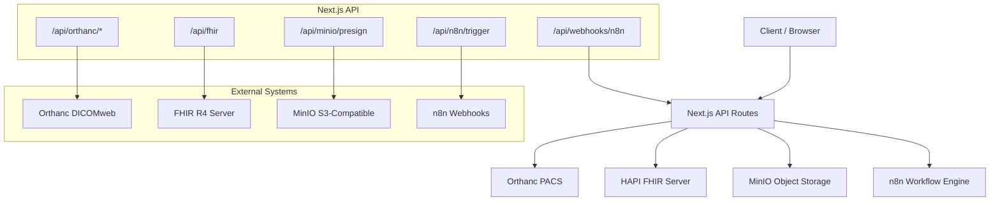
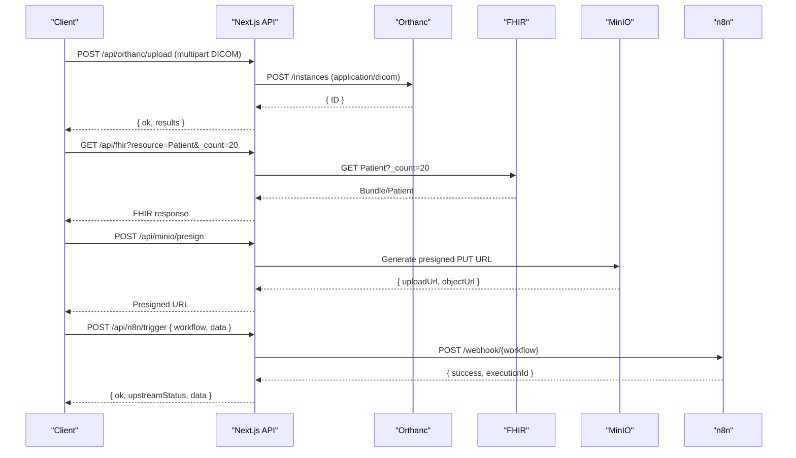
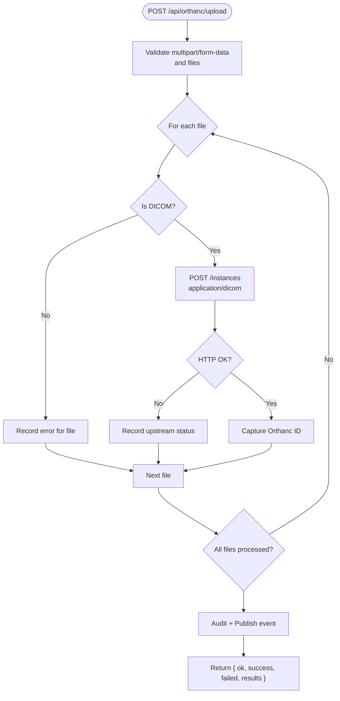
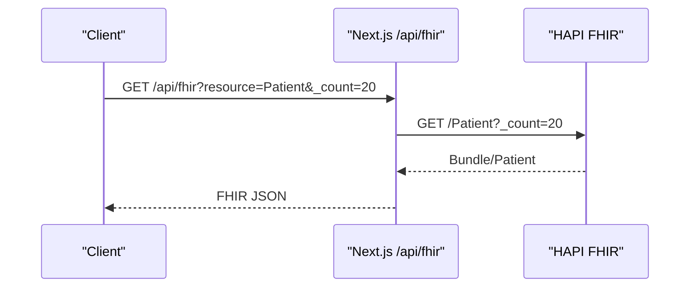
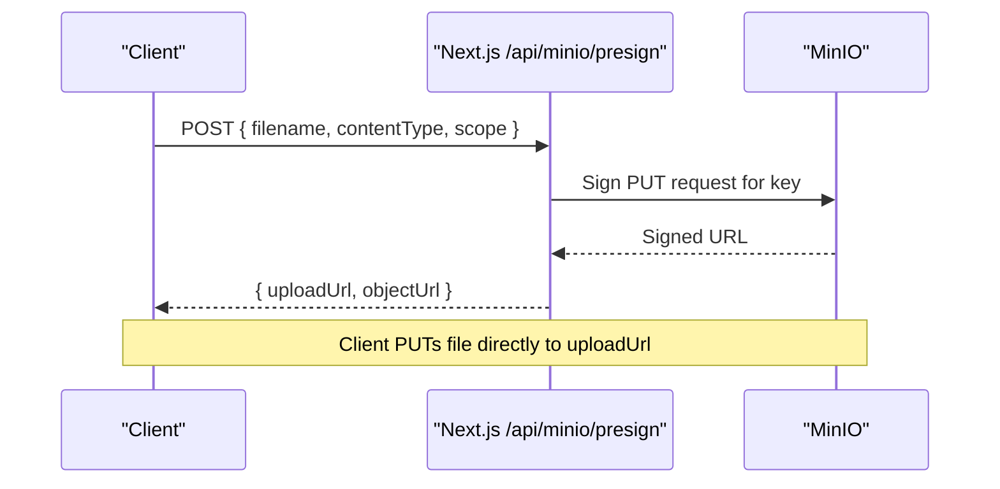
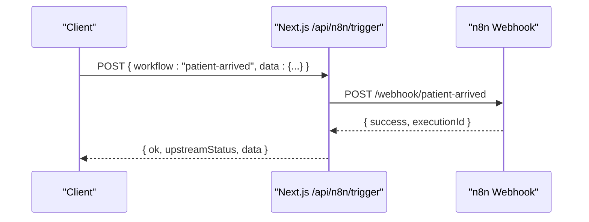
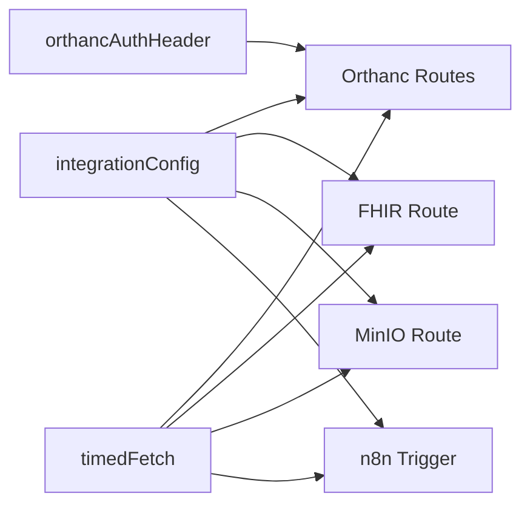

# External Integrations API

<cite>
**Referenced Files in This Document**
- [src/app/api/orthanc/dicom-web/[...path]/route.ts](file://src/app/api/orthanc/dicom-web/[...path]/route.ts)
- [src/app/api/orthanc/upload/route.ts](file://src/app/api/orthanc/upload/route.ts)
- [src/app/api/orthanc/studies/route.ts](file://src/app/api/orthanc/studies/route.ts)
- [src/app/api/orthanc/patients/[id]/route.ts](file://src/app/api/orthanc/patients/[id]/route.ts)
- [src/app/api/orthanc/series/[id]/route.ts](file://src/app/api/orthanc/series/[id]/route.ts)
- [src/app/api/orthanc/worklist/route.ts](file://src/app/api/orthanc/worklist/route.ts)
- [src/app/api/orthanc/routing/route.ts](file://src/app/api/orthanc/routing/route.ts)
- [src/app/api/fhir/route.ts](file://src/app/api/fhir/route.ts)
- [src/app/api/minio/presign/route.ts](file://src/app/api/minio/presign/route.ts)
- [src/lib/integrations/minio.ts](file://src/lib/integrations/minio.ts)
- [src/app/api/n8n/trigger/route.ts](file://src/app/api/n8n/trigger/route.ts)
- [src/app/api/webhooks/n8n/route.ts](file://src/app/api/webhooks/n8n/route.ts)
- [src/lib/integrations/index.ts](file://src/lib/integrations/index.ts)
- [services/fhir.mjs](file://services/fhir.mjs)
- [services/n8n.mjs](file://services/n8n.mjs)
- [docker/orthanc/orthanc.json](file://docker/orthanc/orthanc.json)
</cite>

## Table of Contents
1. Introduction
2. Project Structure
3. Core Components
4. Architecture Overview
5. Detailed Component Analysis
6. Dependency Analysis
7. Performance Considerations
8. Troubleshooting Guide
9. Conclusion

## Introduction
This document provides comprehensive API documentation for external system integrations used by the platform: PACS (Orthanc), FHIR services, object storage (MinIO), and workflow automation (n8n). It covers DICOM web services, medical image upload/download, patient/study/series management, worklist synchronization, FHIR resource operations, MinIO file operations with presigned URLs, and n8n trigger endpoints and webhook handling. Examples are included to illustrate PACS integration, FHIR data exchange, and automated workflows.

## Project Structure
The integration layer is implemented as Next.js API routes that proxy or orchestrate calls to external systems. Configuration and shared utilities live in a central integration module.

**Diagram sources**
- [src/app/api/orthanc/dicom-web/[...path]/route.ts:1-104](file://src/app/api/orthanc/dicom-web/[...path]/route.ts#L1-L104)
- [src/app/api/fhir/route.ts:1-39](file://src/app/api/fhir/route.ts#L1-L39)
- [src/app/api/minio/presign/route.ts:1-29](file://src/app/api/minio/presign/route.ts#L1-L29)
- [src/app/api/n8n/trigger/route.ts:1-47](file://src/app/api/n8n/trigger/route.ts#L1-L47)
- [src/app/api/webhooks/n8n/route.ts:1-28](file://src/app/api/webhooks/n8n/route.ts#L1-L28)

**Section sources**
- [src/lib/integrations/index.ts:8-52](file://src/lib/integrations/index.ts#L8-L52)
- [docker/orthanc/orthanc.json:1-21](file://docker/orthanc/orthanc.json#L1-L21)

## Core Components
- PACS (Orthanc): DICOMweb proxy, study/patient/series metadata, worklist, uploads, routing to modalities/peers.
- FHIR: Proxy to HAPI FHIR for resource search/read/create.
- MinIO: Presigned upload URL generation and bucket management.
- n8n: Trigger outbound webhooks and receive inbound webhooks from n8n flows.

Key responsibilities:
- Centralized configuration and health checks via the integration module.
- Secure credential handling (e.g., Basic auth for Orthanc) on the server side only.
- Timeouts and error normalization across all upstream calls.

**Section sources**
- [src/lib/integrations/index.ts:71-132](file://src/lib/integrations/index.ts#L71-L132)
- [src/lib/integrations/index.ts:134-267](file://src/lib/integrations/index.ts#L134-L267)

## Architecture Overview
The platform exposes a unified API surface that abstracts external integrations. Clients interact with Next.js routes which validate inputs, apply authentication headers where needed, enforce timeouts, and forward requests to downstream systems. Responses are normalized and returned to clients.

**Diagram sources**
- [src/app/api/orthanc/upload/route.ts:1-79](file://src/app/api/orthanc/upload/route.ts#L1-L79)
- [src/app/api/fhir/route.ts:1-39](file://src/app/api/fhir/route.ts#L1-L39)
- [src/app/api/minio/presign/route.ts:1-29](file://src/app/api/minio/presign/route.ts#L1-L29)
- [src/app/api/n8n/trigger/route.ts:1-47](file://src/app/api/n8n/trigger/route.ts#L1-L47)

## Detailed Component Analysis

### PACS (Orthanc) Integration
- DICOMweb pass-through: Proxies QIDO-RS, WADO-RS, STOW-RS to Orthanc with sanitized paths and CORS support for browser-based viewers.
- Upload: Accepts multipart form with .dcm files and forwards to Orthanc instances endpoint; returns per-file results including Orthanc IDs.
- Studies: Lists studies with expanded metadata and derives modalities from series when missing.
- Patient: Retrieves patient metadata and counts associated studies.
- Series: Returns series detail with instance list and expected counts.
- Worklist: Queries Orthanc modality worklist; falls back to local appointments if Orthanc is unavailable.
- Routing: Sends a study to a target modality or peer via Orthanc’s store endpoints; emits audit and events.

**Diagram sources**
- [src/app/api/orthanc/upload/route.ts:1-79](file://src/app/api/orthanc/upload/route.ts#L1-L79)

**Section sources**
- [src/app/api/orthanc/dicom-web/[...path]/route.ts:1-104](file://src/app/api/orthanc/dicom-web/[...path]/route.ts#L1-L104)
- [src/app/api/orthanc/upload/route.ts:1-79](file://src/app/api/orthanc/upload/route.ts#L1-L79)
- [src/app/api/orthanc/studies/route.ts:1-86](file://src/app/api/orthanc/studies/route.ts#L1-L86)
- [src/app/api/orthanc/patients/[id]/route.ts:1-64](file://src/app/api/orthanc/patients/[id]/route.ts#L1-L64)
- [src/app/api/orthanc/series/[id]/route.ts:1-77](file://src/app/api/orthanc/series/[id]/route.ts#L1-L77)
- [src/app/api/orthanc/worklist/route.ts:1-80](file://src/app/api/orthanc/worklist/route.ts#L1-L80)
- [src/app/api/orthanc/routing/route.ts:1-69](file://src/app/api/orthanc/routing/route.ts#L1-L69)
- [docker/orthanc/orthanc.json:1-21](file://docker/orthanc/orthanc.json#L1-L21)

#### Example: PACS Integration
- Upload a DICOM file:
  - Endpoint: POST /api/orthanc/upload
  - Content-Type: multipart/form-data
  - Field: files (one or more .dcm)
  - Response: { ok, success, failed, results[] }
- Retrieve studies:
  - Endpoint: GET /api/orthanc/studies
  - Response: { ok, studies[] }
- Fetch series detail:
  - Endpoint: GET /api/orthanc/series/{id}
  - Response: { ok, series }
- Query worklist:
  - Endpoint: GET /api/orthanc/worklist?modality=CT&date=YYYY-MM-DD
  - Response: { ok, source, date, modality, items[] }

**Section sources**
- [src/app/api/orthanc/upload/route.ts:1-79](file://src/app/api/orthanc/upload/route.ts#L1-L79)
- [src/app/api/orthanc/studies/route.ts:1-86](file://src/app/api/orthanc/studies/route.ts#L1-L86)
- [src/app/api/orthanc/series/[id]/route.ts:1-77](file://src/app/api/orthanc/series/[id]/route.ts#L1-L77)
- [src/app/api/orthanc/worklist/route.ts:1-80](file://src/app/api/orthanc/worklist/route.ts#L1-L80)

### FHIR Services
- Proxy to HAPI FHIR for resource operations:
  - GET /api/fhir?resource={Resource}&[FHIR params]
  - Supports read, search-type, create as exposed by the sample FHIR server.
- The proxy forwards query parameters except resource and sets Accept header to application/fhir+json.

**Diagram sources**
- [src/app/api/fhir/route.ts:1-39](file://src/app/api/fhir/route.ts#L1-L39)
- [services/fhir.mjs:1-55](file://services/fhir.mjs#L1-L55)

**Section sources**
- [src/app/api/fhir/route.ts:1-39](file://src/app/api/fhir/route.ts#L1-L39)
- [services/fhir.mjs:1-55](file://services/fhir.mjs#L1-L55)

#### Example: FHIR Data Exchange
- Search patients:
  - GET /api/fhir?resource=Patient&_count=20
- Read a patient:
  - GET /api/fhir?resource=Patient/{id}
- Create a resource:
  - POST /api/fhir?resource=Patient with FHIR JSON body
- Supported resources (sample server): Patient, ImagingStudy, Coverage, DiagnosticReport, ServiceRequest

**Section sources**
- [services/fhir.mjs:11-55](file://services/fhir.mjs#L11-L55)

### Object Storage (MinIO)
- Presigned upload URLs:
  - POST /api/minio/presign
  - Body: { filename?, contentType?, scope? }
  - Returns: { uploadUrl, objectUrl }
- Bucket management and listing are available via library functions for internal use.

**Diagram sources**
- [src/app/api/minio/presign/route.ts:1-29](file://src/app/api/minio/presign/route.ts#L1-L29)
- [src/lib/integrations/minio.ts:29-47](file://src/lib/integrations/minio.ts#L29-L47)

**Section sources**
- [src/app/api/minio/presign/route.ts:1-29](file://src/app/api/minio/presign/route.ts#L1-L29)
- [src/lib/integrations/minio.ts:1-60](file://src/lib/integrations/minio.ts#L1-L60)

#### Example: MinIO File Operations
- Request presigned upload:
  - POST /api/minio/presign
  - Body: { filename: "study.dcm", contentType: "application/dicom", scope: "imaging" }
  - Response: { uploadUrl, objectUrl }
- Upload file:
  - PUT {uploadUrl} with content-type application/dicom
- Access object:
  - Use {objectUrl} for direct access or construct your own signed URL

**Section sources**
- [src/app/api/minio/presign/route.ts:8-28](file://src/app/api/minio/presign/route.ts#L8-L28)
- [src/lib/integrations/minio.ts:29-47](file://src/lib/integrations/minio.ts#L29-L47)

### Workflow Automation (n8n)
- Outbound triggers:
  - POST /api/n8n/trigger { workflow, data }
  - Forwards to n8n webhook base with encoded workflow name and enriched payload.
- Inbound webhooks:
  - POST /api/webhooks/n8n
  - Records events into the audit log for traceability.

**Diagram sources**
- [src/app/api/n8n/trigger/route.ts:1-47](file://src/app/api/n8n/trigger/route.ts#L1-L47)
- [services/n8n.mjs:20-41](file://services/n8n.mjs#L20-L41)

**Section sources**
- [src/app/api/n8n/trigger/route.ts:1-47](file://src/app/api/n8n/trigger/route.ts#L1-L47)
- [src/app/api/webhooks/n8n/route.ts:1-28](file://src/app/api/webhooks/n8n/route.ts#L1-L28)
- [services/n8n.mjs:1-42](file://services/n8n.mjs#L1-L42)

#### Example: Automated Workflow Scenarios
- Trigger a workflow:
  - POST /api/n8n/trigger
  - Body: { workflow: "report-signed", data: { reportId: "...", author: "..." } }
- Receive an event from n8n:
  - POST /api/webhooks/n8n
  - Body: { event: "report.signed", entityType: "report", entityId: "...", details: {...} }

**Section sources**
- [src/app/api/n8n/trigger/route.ts:7-46](file://src/app/api/n8n/trigger/route.ts#L7-L46)
- [src/app/api/webhooks/n8n/route.ts:6-27](file://src/app/api/webhooks/n8n/route.ts#L6-L27)

## Dependency Analysis
- All routes depend on centralized configuration and helpers:
  - integrationConfig for service endpoints and credentials
  - timedFetch for HTTP calls with timeouts
  - orthancAuthHeader for Basic auth to Orthanc
- Health checks cover all integrations and can be used for readiness probes.

**Diagram sources**
- [src/lib/integrations/index.ts:8-52](file://src/lib/integrations/index.ts#L8-L52)
- [src/lib/integrations/index.ts:71-132](file://src/lib/integrations/index.ts#L71-L132)

**Section sources**
- [src/lib/integrations/index.ts:8-52](file://src/lib/integrations/index.ts#L8-L52)
- [src/lib/integrations/index.ts:71-132](file://src/lib/integrations/index.ts#L71-L132)

## Performance Considerations
- Timeouts:
  - Default timeout is applied via timedFetch; specific routes set custom timeouts for large payloads (e.g., uploads).
- Batching and parallelism:
  - Parallel fetching for patient and studies in patient detail route reduces latency.
- Caching:
  - Explicit no-store caching for proxied requests to avoid stale DICOM/FHIR responses.
- Payload sizes:
  - DICOM uploads may require larger timeouts; ensure client and server timeouts align.
- Network resilience:
  - Graceful fallbacks (e.g., worklist uses local DB when Orthanc is unreachable).

[No sources needed since this section provides general guidance]

## Troubleshooting Guide
Common issues and resolutions:
- Orthanc not configured:
  - Symptom: 503 with reason "not_configured"
  - Action: Set ORTHANC_URL and credentials
- Orthanc unreachable:
  - Symptom: 502 with error "Orthanc unreachable"
  - Action: Verify network, credentials, and plugin availability
- Invalid DICOM upload:
  - Symptom: 400 "invalid multipart body" or "not a DICOM file"
  - Action: Ensure correct Content-Type and .dcm extension
- FHIR not configured:
  - Symptom: 503 with error "HAPI FHIR is not configured"
  - Action: Set FHIR_URL
- MinIO not configured:
  - Symptom: 503 with error "MinIO is not configured"
  - Action: Set MINIO_ENDPOINT and credentials
- n8n not configured:
  - Symptom: 503 with error "n8n is not configured"
  - Action: Set N8N_URL or N8N_WEBHOOK_BASE

Health checks:
- Use the integration health checker to verify connectivity and latency for all services.

**Section sources**
- [src/app/api/orthanc/dicom-web/[...path]/route.ts:15-70](file://src/app/api/orthanc/dicom-web/[...path]/route.ts#L15-L70)
- [src/app/api/orthanc/upload/route.ts:16-57](file://src/app/api/orthanc/upload/route.ts#L16-L57)
- [src/app/api/fhir/route.ts:10-38](file://src/app/api/fhir/route.ts#L10-L38)
- [src/app/api/minio/presign/route.ts:8-28](file://src/app/api/minio/presign/route.ts#L8-L28)
- [src/app/api/n8n/trigger/route.ts:8-46](file://src/app/api/n8n/trigger/route.ts#L8-L46)
- [src/lib/integrations/index.ts:134-267](file://src/lib/integrations/index.ts#L134-L267)

## Conclusion
The platform provides a secure, consistent API surface for integrating with PACS, FHIR, object storage, and workflow automation. Routes handle validation, authentication, timeouts, and error normalization while preserving external system capabilities. Use the provided examples to integrate imaging workflows, exchange healthcare data, and automate processes end-to-end.

[No sources needed since this section summarizes without analyzing specific files]