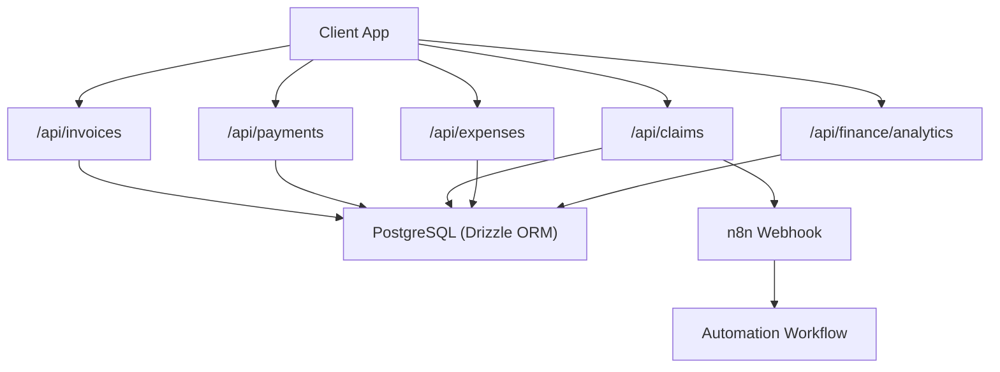
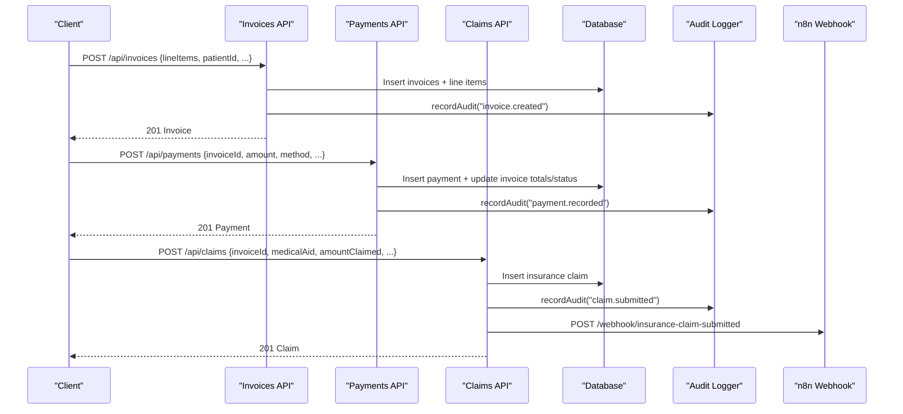
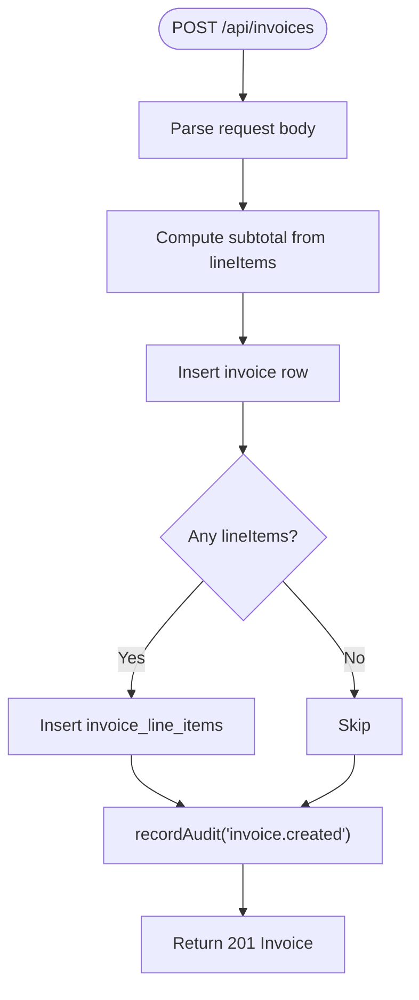
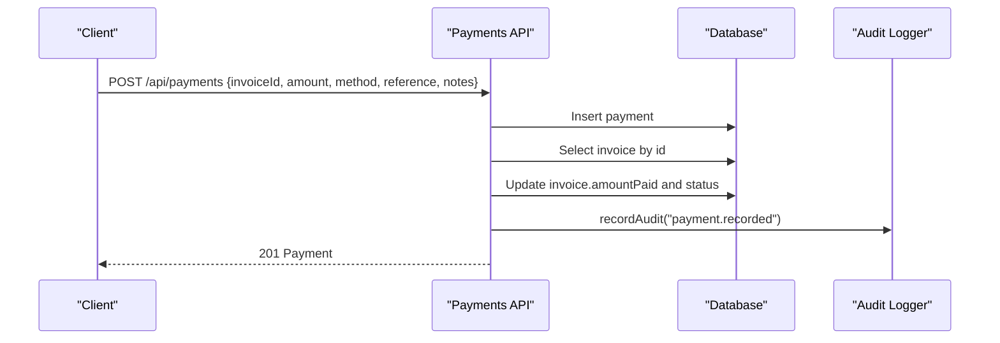
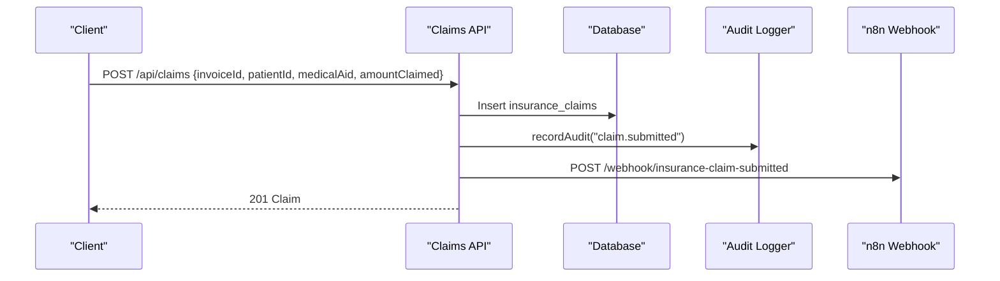
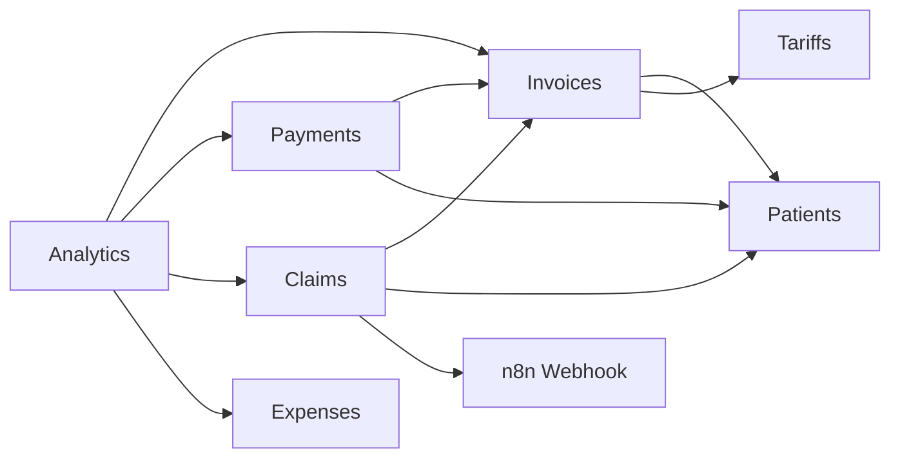

# Financial Management API

<cite>
**Referenced Files in This Document**
- [invoices/route.ts](file://src/app/api/invoices/route.ts)
- [invoices/[id]/route.ts](file://src/app/api/invoices/[id]/route.ts)
- [payments/route.ts](file://src/app/api/payments/route.ts)
- [claims/route.ts](file://src/app/api/claims/route.ts)
- [claims/[id]/route.ts](file://src/app/api/claims/[id]/route.ts)
- [expenses/route.ts](file://src/app/api/expenses/route.ts)
- [finance/analytics/route.ts](file://src/app/api/finance/analytics/route.ts)
- [schema.ts](file://src/db/schema.ts)
- [finance.ts](file://src/lib/finance.ts)
- [audit.ts](file://src/lib/audit.ts)
- [n8n/trigger/route.ts](file://src/app/api/n8n/trigger/route.ts)
- [integrations/index.ts](file://src/lib/integrations/index.ts)
- [config.py](file://backend/app/core/config.py)
- [integrations.py](file://backend/app/core/integrations.py)
</cite>

## Table of Contents
1. Introduction
2. Project Structure
3. Core Components
4. Architecture Overview
5. Detailed Component Analysis
6. Dependency Analysis
7. Performance Considerations
8. Troubleshooting Guide
9. Conclusion
10. Appendices

## Introduction
This document provides comprehensive API documentation for the financial management module, covering invoicing, payments, insurance claims, expenses, and financial analytics. It explains billing workflows, insurance verification and automation, reimbursement tracking, reporting, audit trails, compliance considerations, and integrations with external systems such as n8n for workflow automation and FHIR-based eligibility checks. Examples are included for automated billing, claim processing, and financial reconciliation scenarios.

## Project Structure
The financial APIs are implemented as Next.js API routes under src/app/api, each route handling HTTP methods for a specific domain: invoices, payments, claims, expenses, and finance analytics. Data is persisted using Drizzle ORM against a PostgreSQL database defined in the schema file. Shared utilities generate unique identifiers and define enumerations for statuses and categories. Audit logging is centralized to ensure compliance and traceability. External automation is triggered via n8n webhooks, and integration health checks are provided through a shared integrations utility.

**Diagram sources**
- [invoices/route.ts:1-100](file://src/app/api/invoices/route.ts#L1-L100)
- [payments/route.ts:1-79](file://src/app/api/payments/route.ts#L1-L79)
- [claims/route.ts:1-83](file://src/app/api/claims/route.ts#L1-L83)
- [expenses/route.ts:1-35](file://src/app/api/expenses/route.ts#L1-L35)
- [finance/analytics/route.ts:1-71](file://src/app/api/finance/analytics/route.ts#L1-L71)
- [n8n/trigger/route.ts:1-46](file://src/app/api/n8n/trigger/route.ts#L1-L46)

**Section sources**
- [invoices/route.ts:1-100](file://src/app/api/invoices/route.ts#L1-L100)
- [payments/route.ts:1-79](file://src/app/api/payments/route.ts#L1-L79)
- [claims/route.ts:1-83](file://src/app/api/claims/route.ts#L1-L83)
- [expenses/route.ts:1-35](file://src/app/api/expenses/route.ts#L1-L35)
- [finance/analytics/route.ts:1-71](file://src/app/api/finance/analytics/route.ts#L1-L71)

## Core Components
- Invoicing: Create and retrieve invoices; attach line items; compute totals; set status; record audit events.
- Payments: Record payments; update invoice balances and statuses; join patient and invoice details; record audit events.
- Insurance Claims: Submit claims; track statuses; trigger automation via n8n; record audit events.
- Expenses: Record operational expenses with category, vendor, date, approval, and status.
- Analytics: Aggregate totals for invoiced, paid, outstanding, collected, expenses; breakdowns by status/method; daily revenue trends.
- Audit & Compliance: Centralized audit logging for all financial actions; supports IP capture and JSON details.
- Integrations: Health checks and configuration for Keycloak, Orthanc, FHIR, MinIO, and n8n; webhook triggers for automation.

**Section sources**
- [schema.ts:195-284](file://src/db/schema.ts#L195-L284)
- [finance.ts:1-35](file://src/lib/finance.ts#L1-L35)
- [audit.ts:1-25](file://src/lib/audit.ts#L1-L25)
- [integrations/index.ts:192-216](file://src/lib/integrations/index.ts#L192-L216)

## Architecture Overview
The financial module follows an event-driven, service-oriented architecture:
- API routes handle requests and orchestrate business logic.
- Database interactions use Drizzle ORM with strongly typed schemas.
- Audit logs are recorded for every critical action.
- Automation is triggered via n8n webhooks for tasks like claim submission and notifications.
- Integration health endpoints verify connectivity to external services.

**Diagram sources**
- [invoices/route.ts:46-99](file://src/app/api/invoices/route.ts#L46-L99)
- [payments/route.ts:35-78](file://src/app/api/payments/route.ts#L35-L78)
- [claims/route.ts:38-82](file://src/app/api/claims/route.ts#L38-L82)
- [audit.ts:4-24](file://src/lib/audit.ts#L4-L24)

## Detailed Component Analysis

### Invoicing API
- Endpoints:
  - GET /api/invoices: Lists invoices with patient details, sorted by creation time.
  - POST /api/invoices: Creates an invoice with optional line items; computes subtotal/tax/total; sets initial status to sent; records audit.
  - GET /api/invoices/:id: Retrieves a single invoice with its line items.
  - PATCH /api/invoices/:id: Updates invoice fields.
- Business rules:
  - Tax amount is zero for medical imaging in most jurisdictions.
  - Line items include tariff references, descriptions, quantities, unit prices, and computed line totals.
  - Audit trail captures invoice creation with number and total amount.
- Error handling:
  - Returns 500 on failures; returns 404 when invoice not found.

**Diagram sources**
- [invoices/route.ts:46-99](file://src/app/api/invoices/route.ts#L46-L99)

**Section sources**
- [invoices/route.ts:8-37](file://src/app/api/invoices/route.ts#L8-L37)
- [invoices/route.ts:46-99](file://src/app/api/invoices/route.ts#L46-L99)
- [invoices/[id]/route.ts:6-38](file://src/app/api/invoices/[id]/route.ts#L6-L38)
- [schema.ts:209-239](file://src/db/schema.ts#L209-L239)
- [finance.ts:1-7](file://src/lib/finance.ts#L1-L7)
- [audit.ts:4-24](file://src/lib/audit.ts#L4-L24)

### Payments API
- Endpoints:
  - GET /api/payments: Lists payments joined with invoice and patient data.
  - POST /api/payments: Records a payment; updates invoice amountPaid and recalculates status based on totals.
- Business rules:
  - Generates receipt numbers.
  - Sets default receivedBy to system if not provided.
  - Updates invoice status to partial or paid depending on cumulative payments.
- Error handling:
  - Returns 500 on failures.

**Diagram sources**
- [payments/route.ts:35-78](file://src/app/api/payments/route.ts#L35-L78)

**Section sources**
- [payments/route.ts:8-33](file://src/app/api/payments/route.ts#L8-L33)
- [payments/route.ts:35-78](file://src/app/api/payments/route.ts#L35-L78)
- [schema.ts:241-253](file://src/db/schema.ts#L241-L253)
- [finance.ts:9-15](file://src/lib/finance.ts#L9-L15)
- [audit.ts:4-24](file://src/lib/audit.ts#L4-L24)

### Insurance Claims API
- Endpoints:
  - GET /api/claims: Lists claims with invoice and patient details.
  - POST /api/claims: Submits a new claim; generates claim number; sets status to submitted; records audit; triggers n8n automation.
  - PATCH /api/claims/:id: Updates claim fields; sets respondedAt when moving out of initial states.
- Business rules:
  - Supports medical aid provider and optional membership number.
  - Amount claimed is stored with two decimal precision.
  - Automation sends claim metadata to n8n for downstream processing.
- Error handling:
  - Returns 500 on failures; best-effort automation trigger on errors.

**Diagram sources**
- [claims/route.ts:38-82](file://src/app/api/claims/route.ts#L38-L82)

**Section sources**
- [claims/route.ts:8-36](file://src/app/api/claims/route.ts#L8-L36)
- [claims/route.ts:38-82](file://src/app/api/claims/route.ts#L38-L82)
- [claims/[id]/route.ts:6-23](file://src/app/api/claims/[id]/route.ts#L6-L23)
- [schema.ts:255-271](file://src/db/schema.ts#L255-L271)
- [finance.ts:17-22](file://src/lib/finance.ts#L17-L22)
- [audit.ts:4-24](file://src/lib/audit.ts#L4-L24)

### Expenses API
- Endpoints:
  - GET /api/expenses: Lists expenses ordered by incurred date.
  - POST /api/expenses: Creates expense entries with category, description, amount, vendor, date, approver, and status.
- Business rules:
  - Defaults to pending status if not provided.
  - Stores amounts with two decimal precision.
- Error handling:
  - Returns 500 on failures.

**Section sources**
- [expenses/route.ts:6-13](file://src/app/api/expenses/route.ts#L6-L13)
- [expenses/route.ts:15-34](file://src/app/api/expenses/route.ts#L15-L34)
- [schema.ts:273-284](file://src/db/schema.ts#L273-L284)

### Finance Analytics API
- Endpoint:
  - GET /api/finance/analytics: Aggregates financial metrics including totals, counts, outstanding balances, breakdowns by status/method, and daily revenue trends.
- Metrics:
  - Total invoiced, total paid, invoice count, outstanding balance.
  - Total collected, payment count, payments by method.
  - Expenses total and count.
  - Invoices by status with totals.
  - Claims by status with totals.
  - Revenue by day (last 14 days).
- Error handling:
  - Returns 500 on failures.

**Section sources**
- [finance/analytics/route.ts:6-70](file://src/app/api/finance/analytics/route.ts#L6-L70)
- [schema.ts:209-284](file://src/db/schema.ts#L209-L284)

## Dependency Analysis
- Invoices depend on patients, tariffs (via line items), and audit logging.
- Payments depend on invoices and patients; update invoice totals and status.
- Claims depend on invoices and patients; integrate with n8n for automation.
- Expenses are standalone but contribute to overall financial analytics.
- Analytics aggregates across invoices, payments, claims, and expenses.
- External integrations:
  - n8n webhooks for automation triggers.
  - FHIR for eligibility verification (referenced in agents and integration health checks).
  - Keycloak for authentication (configuration available in backend settings).

**Diagram sources**
- [schema.ts:18-36](file://src/db/schema.ts#L18-L36)
- [schema.ts:196-207](file://src/db/schema.ts#L196-L207)
- [schema.ts:209-284](file://src/db/schema.ts#L209-L284)
- [claims/route.ts:63-76](file://src/app/api/claims/route.ts#L63-L76)

**Section sources**
- [schema.ts:18-36](file://src/db/schema.ts#L18-L36)
- [schema.ts:196-207](file://src/db/schema.ts#L196-L207)
- [schema.ts:209-284](file://src/db/schema.ts#L209-L284)
- [claims/route.ts:63-76](file://src/app/api/claims/route.ts#L63-L76)

## Performance Considerations
- Use indexed queries on frequently filtered fields such as invoiceNumber, receiptNumber, claimNumber, and status.
- Avoid heavy joins in list endpoints unless necessary; consider pagination for large datasets.
- Keep automation triggers asynchronous and non-blocking; current implementation uses timeouts to prevent blocking responses.
- Aggregate analytics queries should be optimized with appropriate indexes on dates and status fields.

[No sources needed since this section provides general guidance]

## Troubleshooting Guide
- Common errors:
  - Failed to fetch/create/update entities: Check database connectivity and query correctness.
  - Claim automation failures: Ensure N8N_URL or N8N_WEBHOOK_BASE is configured; network reachability; webhook endpoint exists.
  - Payment status not updating: Verify invoice totals and cumulative payments; check numeric precision.
- Audit logs:
  - Review audit_log table for actions like invoice.created, payment.recorded, claim.submitted.
- Integration health:
  - Use /api/integrations/status to verify connectivity to Keycloak, Orthanc, FHIR, MinIO, and n8n.

**Section sources**
- [audit.ts:4-24](file://src/lib/audit.ts#L4-L24)
- [integrations/index.ts:192-216](file://src/lib/integrations/index.ts#L192-L216)
- [config.py:4-19](file://backend/app/core/config.py#L4-L19)
- [integrations.py:37-58](file://backend/app/core/integrations.py#L37-L58)

## Conclusion
The financial management API provides robust capabilities for invoicing, payments, insurance claims, expenses, and analytics. It enforces audit trails, integrates with automation tools like n8n, and supports compliance through structured logging and validation. The modular design allows for scalable extensions and reliable operation in healthcare environments.

[No sources needed since this section summarizes without analyzing specific files]

## Appendices

### Billing Workflows
- Automated billing:
  - Create invoice with line items; set billing type (cash, medical_aid, corporate); send invoice; record audit.
  - Trigger n8n workflow for reminders or follow-ups via /api/n8n/trigger.
- Reconciliation:
  - Use analytics to compare total invoiced vs total paid; investigate outstanding balances.
  - Cross-check payments against invoices by invoiceNumber and patient details.

**Section sources**
- [invoices/route.ts:46-99](file://src/app/api/invoices/route.ts#L46-L99)
- [n8n/trigger/route.ts:7-46](file://src/app/api/n8n/trigger/route.ts#L7-L46)
- [finance/analytics/route.ts:6-70](file://src/app/api/finance/analytics/route.ts#L6-L70)

### Insurance Verification and Claim Processing
- Eligibility verification:
  - Leverage FHIR Coverage resources via integration health checks and agent workflows.
- Claim submission:
  - Submit claim with medical aid and membership number; automate downstream processing via n8n.
- Reimbursement tracking:
  - Monitor claim statuses; update respondedAt when moving out of initial states; record audit.

**Section sources**
- [integrations/index.ts:192-216](file://src/lib/integrations/index.ts#L192-L216)
- [claims/route.ts:38-82](file://src/app/api/claims/route.ts#L38-L82)
- [claims/[id]/route.ts:6-23](file://src/app/api/claims/[id]/route.ts#L6-L23)

### Financial Reporting Scenarios
- Daily revenue trends:
  - Query revenue by day for last 14 days to visualize cash flow patterns.
- Status breakdowns:
  - Analyze invoices by status and payments by method to identify bottlenecks.
- Expense monitoring:
  - Track total expenses and counts to manage budgets and approvals.

**Section sources**
- [finance/analytics/route.ts:6-70](file://src/app/api/finance/analytics/route.ts#L6-L70)
- [schema.ts:209-284](file://src/db/schema.ts#L209-L284)