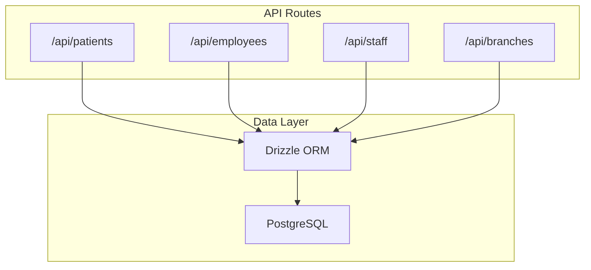
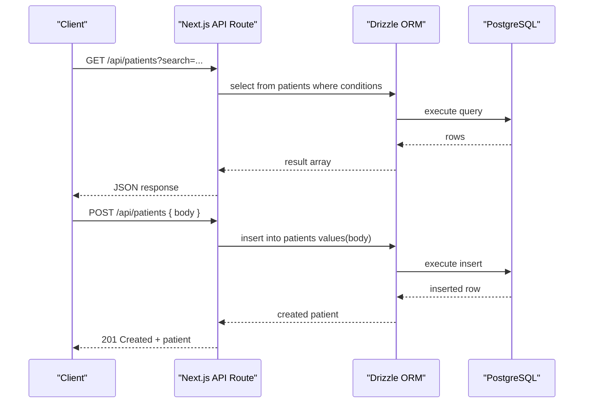
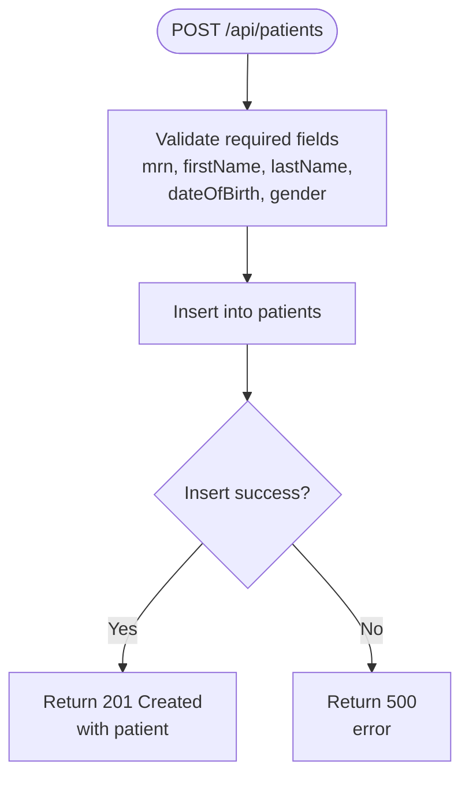
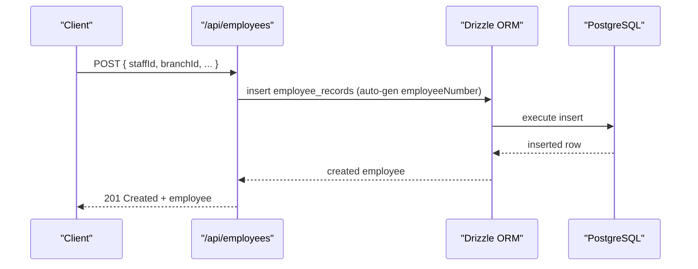
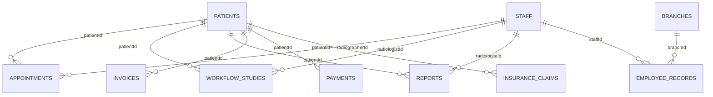

# Patient Management API

<cite>
**Referenced Files in This Document**
- [route.ts](file://src/app/api/patients/route.ts)
- [route.ts](file://src/app/api/employees/route.ts)
- [route.ts](file://src/app/api/staff/route.ts)
- [route.ts](file://src/app/api/branches/route.ts)
- [schema.ts](file://src/db/schema.ts)
- [index.ts](file://src/db/index.ts)
- [finance.ts](file://src/lib/finance.ts)
</cite>

## Table of Contents
1. Introduction
2. Project Structure
3. Core Components
4. Architecture Overview
5. Detailed Component Analysis
6. Dependency Analysis
7. Performance Considerations
8. Troubleshooting Guide
9. Conclusion

## Introduction
This document provides detailed API documentation for patient management endpoints, including CRUD operations for patients, employees, staff members, and organizational branches. It specifies request/response schemas for patient demographics, consent tracking, insurance information, and employee records. It also documents search and filtering capabilities, data validation rules, relationships between patients, staff, and organizational units, and examples for common workflows such as patient registration, demographic updates, and staff assignment.

## Project Structure
The patient management APIs are implemented as Next.js API routes under src/app/api. Each resource has a route file that handles HTTP methods and interacts with the database via Drizzle ORM. The data model is defined in a single schema file.

**Diagram sources**
- [route.ts:6-36](file://src/app/api/patients/route.ts#L6-L36)
- [route.ts:7-56](file://src/app/api/employees/route.ts#L7-L56)
- [route.ts:5-22](file://src/app/api/staff/route.ts#L5-L22)
- [route.ts:9-38](file://src/app/api/branches/route.ts#L9-L38)
- [index.ts:14-24](file://src/db/index.ts#L14-L24)

**Section sources**
- [route.ts:6-36](file://src/app/api/patients/route.ts#L6-L36)
- [route.ts:7-56](file://src/app/api/employees/route.ts#L7-L56)
- [route.ts:5-22](file://src/app/api/staff/route.ts#L5-L22)
- [route.ts:9-38](file://src/app/api/branches/route.ts#L9-L38)
- [index.ts:14-24](file://src/db/index.ts#L14-L24)

## Core Components
- Patients: List and create patients; supports search by first name, last name, or MRN.
- Employees: List employee records joined with staff and branch details; create employee records with auto-generated employee numbers.
- Staff: List and create staff members.
- Branches: List and create branches with required fields validation.

Key behaviors:
- Search and filtering: Patients endpoint supports a query parameter search to filter by first name, last name, or MRN using case-insensitive matching.
- Defaults and generation: Employee creation auto-generates an employee number and sets default employment type and start date if not provided.
- Validation: Branch creation requires name and code; other fields are optional with sensible defaults.

**Section sources**
- [route.ts:6-36](file://src/app/api/patients/route.ts#L6-L36)
- [route.ts:7-56](file://src/app/api/employees/route.ts#L7-L56)
- [route.ts:5-22](file://src/app/api/staff/route.ts#L5-L22)
- [route.ts:9-38](file://src/app/api/branches/route.ts#L9-L38)
- [finance.ts:24-27](file://src/lib/finance.ts#L24-L27)

## Architecture Overview
The APIs follow a simple layered architecture:
- API routes handle HTTP requests, parse parameters, and call database queries.
- Drizzle ORM executes SQL against PostgreSQL.
- Schema definitions enforce field types, constraints, and relationships.

**Diagram sources**
- [route.ts:6-36](file://src/app/api/patients/route.ts#L6-L36)
- [index.ts:14-24](file://src/db/index.ts#L14-L24)

## Detailed Component Analysis

### Patients API
- Endpoints
  - GET /api/patients
    - Query parameters:
      - search: string (optional). Filters by first_name, last_name, or mrn using case-insensitive matching.
    - Response: Array of patient objects.
  - POST /api/patients
    - Request body: Patient object (see schema below).
    - Response: Created patient object with 201 status.

- Data model (patients)
  - id: uuid (primary key)
  - mrn: varchar(20), unique, required
  - firstName: varchar(100), required
  - lastName: varchar(100), required
  - dateOfBirth: date, required
  - gender: varchar(20), required
  - phone: varchar(30), optional
  - email: varchar(255), optional
  - address: text, optional
  - insuranceProvider: varchar(200), optional
  - insurancePolicyNumber: varchar(100), optional
  - emergencyContactName: varchar(200), optional
  - emergencyContactPhone: varchar(30), optional
  - consentSigned: boolean, default false
  - status: varchar(20), default "active", required
  - createdAt: timestamp, default now
  - updatedAt: timestamp, default now

- Search and filtering
  - Supports search by first name, last name, or MRN.
  - Case-insensitive matching across multiple fields.

- Error handling
  - Returns 500 with error message on failures.

- Example workflow: Patient registration
  - Create a new patient record via POST with required fields (mrn, firstName, lastName, dateOfBirth, gender).
  - Optional fields include contact info, insurance details, and consent flag.

**Diagram sources**
- [route.ts:28-36](file://src/app/api/patients/route.ts#L28-L36)
- [schema.ts:18-36](file://src/db/schema.ts#L18-L36)

**Section sources**
- [route.ts:6-36](file://src/app/api/patients/route.ts#L6-L36)
- [schema.ts:18-36](file://src/db/schema.ts#L18-L36)

### Employees API
- Endpoints
  - GET /api/employees
    - Response: Array of employee records joined with staff and branch details.
  - POST /api/employees
    - Request body: Employee record fields (see schema below).
    - Response: Created employee record with 201 status.

- Data model (employee_records)
  - id: uuid (primary key)
  - staffId: uuid, references staff.id, required
  - employeeNumber: varchar(30), unique, required
  - department: varchar(100), optional
  - employmentType: varchar(30), default "full_time", required
  - branchId: uuid, references branches.id, optional
  - startDate: date, optional
  - endDate: date, optional
  - hourlyRate: numeric(10,2), optional
  - monthlySalary: numeric(12,2), optional
  - status: varchar(20), default "active", required
  - createdAt: timestamp, default now

- Relationships
  - staffId links to staff table.
  - branchId links to branches table.

- Defaults and generation
  - employeeNumber is auto-generated on create.
  - employmentType defaults to full_time if not provided.
  - startDate defaults to current date if not provided.

- Error handling
  - Returns 500 with error message on failures.

- Example workflow: Staff assignment to a branch
  - Create a staff member first (via /api/staff).
  - Create an employee record linking staffId and optionally branchId.

**Diagram sources**
- [route.ts:36-56](file://src/app/api/employees/route.ts#L36-L56)
- [schema.ts:299-312](file://src/db/schema.ts#L299-L312)
- [finance.ts:24-27](file://src/lib/finance.ts#L24-L27)

**Section sources**
- [route.ts:7-56](file://src/app/api/employees/route.ts#L7-L56)
- [schema.ts:299-312](file://src/db/schema.ts#L299-L312)
- [finance.ts:24-27](file://src/lib/finance.ts#L24-L27)

### Staff API
- Endpoints
  - GET /api/staff
    - Response: Array of staff members ordered by last name.
  - POST /api/staff
    - Request body: Staff object (see schema below).
    - Response: Created staff member with 201 status.

- Data model (staff)
  - id: uuid (primary key)
  - firstName: varchar(100), required
  - lastName: varchar(100), required
  - role: varchar(50), required
  - specialization: varchar(100), optional
  - email: varchar(255), optional
  - phone: varchar(30), optional
  - status: varchar(20), default "active", required
  - createdAt: timestamp, default now

- Error handling
  - Returns 500 with error message on failures.

**Section sources**
- [route.ts:5-22](file://src/app/api/staff/route.ts#L5-L22)
- [schema.ts:70-80](file://src/db/schema.ts#L70-L80)

### Branches API
- Endpoints
  - GET /api/branches
    - Response: Array of branches ordered by creation date descending.
  - POST /api/branches
    - Request body: Branch object (see schema below).
    - Response: Created branch with 201 status.

- Data model (branches)
  - id: uuid (primary key)
  - name: varchar(200), required
  - code: varchar(20), unique, required
  - address: text, optional
  - phone: varchar(30), optional
  - email: varchar(255), optional
  - managerName: varchar(200), optional
  - status: varchar(20), default "active", required
  - createdAt: timestamp, default now

- Validation
  - name and code are required; returns 400 if missing.

- Error handling
  - Returns 500 with error message on failures.

**Section sources**
- [route.ts:9-38](file://src/app/api/branches/route.ts#L9-L38)
- [schema.ts:287-297](file://src/db/schema.ts#L287-L297)

## Dependency Analysis
- API routes depend on Drizzle ORM configured via src/db/index.ts.
- Schema defines tables and relationships:
  - employee_records.staffId -> staff.id
  - employee_records.branchId -> branches.id
  - appointments.patientId -> patients.id
  - appointments.radiographerId -> staff.id
  - workflow_studies.patientId -> patients.id
  - workflow_studies.radiologistId -> staff.id
  - reports.patientId -> patients.id
  - reports.radiologistId -> staff.id
  - invoices.patientId -> patients.id
  - payments.patientId -> patients.id
  - insurance_claims.patientId -> patients.id

**Diagram sources**
- [schema.ts:18-36](file://src/db/schema.ts#L18-L36)
- [schema.ts:70-80](file://src/db/schema.ts#L70-L80)
- [schema.ts:82-100](file://src/db/schema.ts#L82-L100)
- [schema.ts:103-119](file://src/db/schema.ts#L103-L119)
- [schema.ts:167-180](file://src/db/schema.ts#L167-L180)
- [schema.ts:209-228](file://src/db/schema.ts#L209-L228)
- [schema.ts:241-253](file://src/db/schema.ts#L241-L253)
- [schema.ts:255-271](file://src/db/schema.ts#L255-L271)
- [schema.ts:287-297](file://src/db/schema.ts#L287-L297)
- [schema.ts:299-312](file://src/db/schema.ts#L299-L312)

**Section sources**
- [schema.ts:18-36](file://src/db/schema.ts#L18-L36)
- [schema.ts:70-80](file://src/db/schema.ts#L70-L80)
- [schema.ts:82-100](file://src/db/schema.ts#L82-L100)
- [schema.ts:103-119](file://src/db/schema.ts#L103-L119)
- [schema.ts:167-180](file://src/db/schema.ts#L167-L180)
- [schema.ts:209-228](file://src/db/schema.ts#L209-L228)
- [schema.ts:241-253](file://src/db/schema.ts#L241-L253)
- [schema.ts:255-271](file://src/db/schema.ts#L255-L271)
- [schema.ts:287-297](file://src/db/schema.ts#L287-L297)
- [schema.ts:299-312](file://src/db/schema.ts#L299-L312)

## Performance Considerations
- Use search filters judiciously; large datasets may benefit from pagination (not currently implemented).
- Leverage indexes on frequently searched columns like mrn, firstName, lastName if performance degrades.
- Avoid unnecessary joins in list endpoints; consider splitting queries if needed.
- Batch operations are not implemented; for bulk inserts, consider extending endpoints to accept arrays and process in transactions.

[No sources needed since this section provides general guidance]

## Troubleshooting Guide
- Common errors
  - 500 Internal Server Error: Indicates server-side failure during database operations. Check logs for underlying exceptions.
  - 400 Bad Request: Returned when required fields are missing (e.g., branch name/code).
- Debugging steps
  - Verify DATABASE_URL environment variable is set.
  - Ensure schema is pushed to the database before running the app.
  - Confirm related entities exist when creating records with foreign keys (e.g., staffId must exist before creating an employee record).

**Section sources**
- [index.ts:4-8](file://src/db/index.ts#L4-L8)
- [route.ts:23-25](file://src/app/api/patients/route.ts#L23-L25)
- [route.ts:31-33](file://src/app/api/employees/route.ts#L31-L33)
- [route.ts:9-15](file://src/app/api/branches/route.ts#L9-L15)

## Conclusion
The Patient Management API provides essential CRUD operations for patients, employees, staff, and branches with clear data models and relationships. Search and filtering are supported for patient lookups, while employee creation includes automatic numbering and sensible defaults. Validation ensures data integrity at the API boundary. Future enhancements could include pagination, bulk operations, and more granular search filters.

[No sources needed since this section summarizes without analyzing specific files]