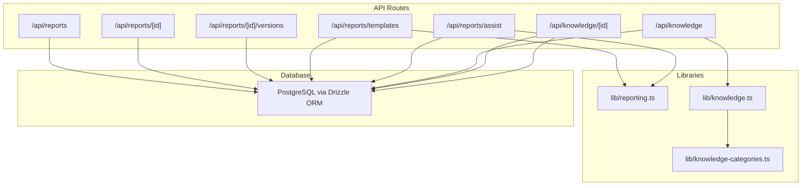
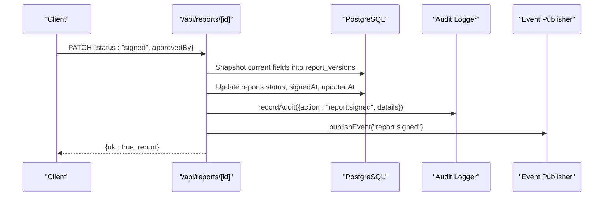
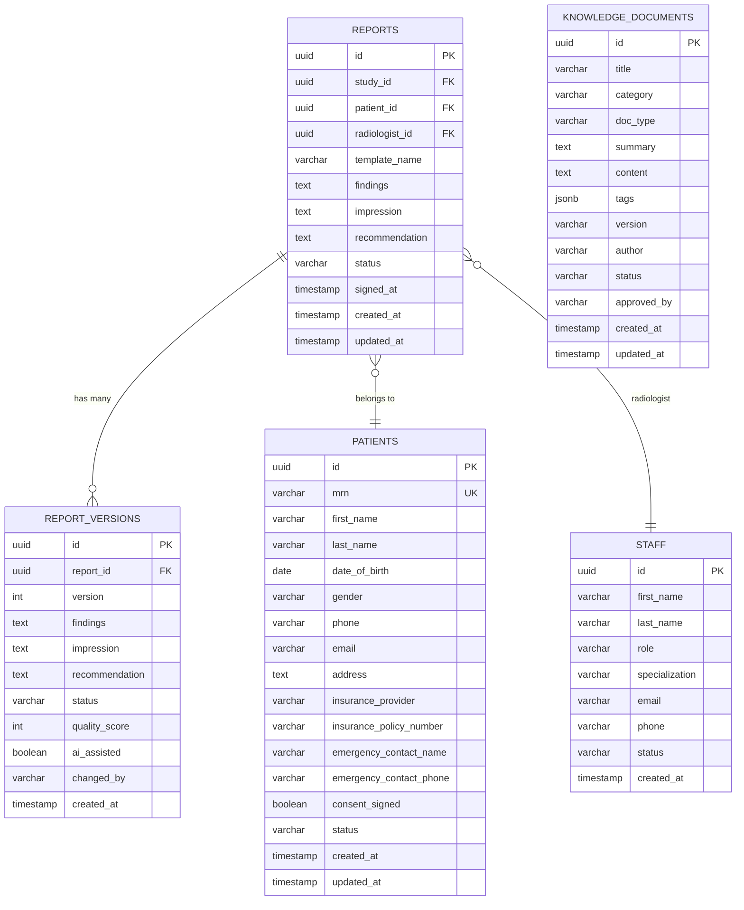
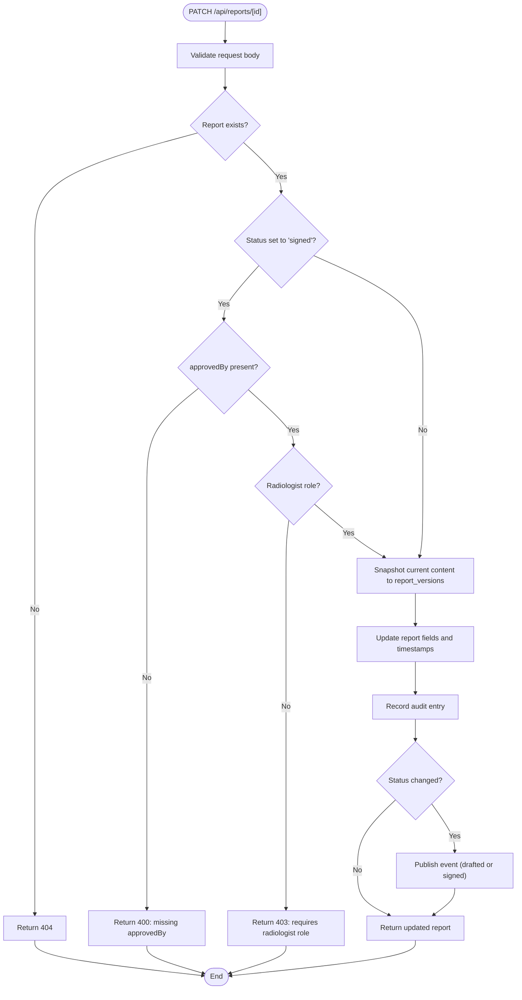
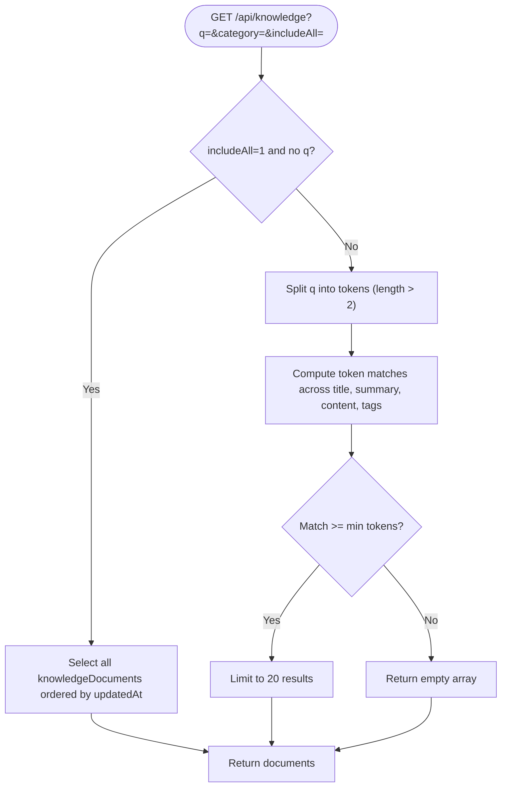

# Reporting & Knowledge API

<cite>
**Referenced Files in This Document**
- [reports route](file://src/app/api/reports/route.ts)
- [report detail route](file://src/app/api/reports/[id]/route.ts)
- [report versions route](file://src/app/api/reports/[id]/versions/route.ts)
- [report templates route](file://src/app/api/reports/templates/route.ts)
- [report assist route](file://src/app/api/reports/assist/route.ts)
- [knowledge route](file://src/app/api/knowledge/route.ts)
- [knowledge item route](file://src/app/api/knowledge/[id]/route.ts)
- [reporting library](file://src/lib/reporting.ts)
- [knowledge library](file://src/lib/knowledge.ts)
- [knowledge categories](file://src/lib/knowledge-categories.ts)
- [database schema](file://src/db/schema.ts)
</cite>

## Table of Contents
1. [Introduction](#introduction)
2. [Project Structure](#project-structure)
3. [Core Components](#core-components)
4. [Architecture Overview](#architecture-overview)
5. [Detailed Component Analysis](#detailed-component-analysis)
6. [Dependency Analysis](#dependency-analysis)
7. [Performance Considerations](#performance-considerations)
8. [Troubleshooting Guide](#troubleshooting-guide)
9. [Conclusion](#conclusion)
10. [Appendices](#appendices)

## Introduction
This document provides detailed API documentation for reporting and knowledge management endpoints. It covers report generation, template management, version control, quality scoring, and knowledge base operations including search, categorization, retrieval, and metadata management. It also includes structured data formats, export considerations, and examples for automated workflows such as report drafting, template customization, and knowledge discovery.

## Project Structure
The reporting and knowledge features are implemented as Next.js API routes under src/app/api with supporting libraries and database schemas:
- Reporting endpoints: /api/reports, /api/reports/[id], /api/reports/[id]/versions, /api/reports/templates, /api/reports/assist
- Knowledge endpoints: /api/knowledge, /api/knowledge/[id]
- Libraries: src/lib/reporting.ts (templates, quality scoring, terminology), src/lib/knowledge.ts (search and listing), src/lib/knowledge-categories.ts (categories and doc types)
- Database schema: src/db/schema.ts defines tables for reports, report templates, report versions, and knowledge documents

**Diagram sources**
- [reports route:1-46](file://src/app/api/reports/route.ts#L1-L46)
- [report detail route:1-125](file://src/app/api/reports/[id]/route.ts#L1-L125)
- [report versions route:1-22](file://src/app/api/reports/[id]/versions/route.ts#L1-L22)
- [report templates route:1-30](file://src/app/api/reports/templates/route.ts#L1-L30)
- [report assist route:1-117](file://src/app/api/reports/assist/route.ts#L1-L117)
- [knowledge route:1-66](file://src/app/api/knowledge/route.ts#L1-L66)
- [knowledge item route:1-55](file://src/app/api/knowledge/[id]/route.ts#L1-L55)
- [reporting library:1-326](file://src/lib/reporting.ts#L1-L326)
- [knowledge library:1-72](file://src/lib/knowledge.ts#L1-L72)
- [knowledge categories:1-23](file://src/lib/knowledge-categories.ts#L1-L23)

**Section sources**
- [reports route:1-46](file://src/app/api/reports/route.ts#L1-L46)
- [report detail route:1-125](file://src/app/api/reports/[id]/route.ts#L1-L125)
- [report versions route:1-22](file://src/app/api/reports/[id]/versions/route.ts#L1-L22)
- [report templates route:1-30](file://src/app/api/reports/templates/route.ts#L1-L30)
- [report assist route:1-117](file://src/app/api/reports/assist/route.ts#L1-L117)
- [knowledge route:1-66](file://src/app/api/knowledge/route.ts#L1-L66)
- [knowledge item route:1-55](file://src/app/api/knowledge/[id]/route.ts#L1-L55)
- [reporting library:1-326](file://src/lib/reporting.ts#L1-L326)
- [knowledge library:1-72](file://src/lib/knowledge.ts#L1-L72)
- [knowledge categories:1-23](file://src/lib/knowledge-categories.ts#L1-L23)
- [database schema:166-421](file://src/db/schema.ts#L166-L421)

## Core Components
- Report lifecycle: create, list, read, update with versioning, sign with role checks, and audit logging
- Template management: built-in templates merged with active custom templates from the database
- Quality scoring: weighted checks on content completeness, terminology consistency, and safety flags
- Knowledge base: CRUD for documents, tokenized search across title, summary, content, and tags, category filtering, and status-based visibility

Key responsibilities:
- /api/reports: list and create reports
- /api/reports/[id]: read and update with version snapshots; enforce signing rules
- /api/reports/[id]/versions: retrieve full version history
- /api/reports/templates: return merged system and custom templates
- /api/reports/assist: decision support payload returning template suggestions, checklist, quality score, critical findings, terminology drift, measurements, and prior studies
- /api/knowledge: search or list all documents (including drafts/archived when requested)
- /api/knowledge/[id]: read, update, delete a single document with audit and events

**Section sources**
- [reports route:1-46](file://src/app/api/reports/route.ts#L1-L46)
- [report detail route:1-125](file://src/app/api/reports/[id]/route.ts#L1-L125)
- [report versions route:1-22](file://src/app/api/reports/[id]/versions/route.ts#L1-L22)
- [report templates route:1-30](file://src/app/api/reports/templates/route.ts#L1-L30)
- [report assist route:1-117](file://src/app/api/reports/assist/route.ts#L1-L117)
- [knowledge route:1-66](file://src/app/api/knowledge/route.ts#L1-L66)
- [knowledge item route:1-55](file://src/app/api/knowledge/[id]/route.ts#L1-L55)
- [reporting library:232-326](file://src/lib/reporting.ts#L232-L326)
- [knowledge library:31-72](file://src/lib/knowledge.ts#L31-L72)

## Architecture Overview
The reporting and knowledge APIs follow an event-driven pattern with audit logging and optional session-based authorization for sensitive actions like signing reports. Data is persisted using Drizzle ORM against PostgreSQL. Templates and knowledge categories are defined in code and extended by database records.

**Diagram sources**
- [report detail route:47-124](file://src/app/api/reports/[id]/route.ts#L47-L124)
- [database schema:166-180](file://src/db/schema.ts#L166-L180)
- [database schema:344-356](file://src/db/schema.ts#L344-L356)

## Detailed Component Analysis

### Reporting Endpoints

#### List and Create Reports
- GET /api/reports
  - Returns all reports joined with patient and radiologist context, ordered by creation date descending
  - Response: array of report objects with patient and staff names
- POST /api/reports
  - Creates a new report from request body
  - Response: created report object with 201 status

Request/response highlights:
- Fields include studyId, patientId, templateName, findings, impression, recommendation, status, signedAt, timestamps
- Patient and radiologist names are included via joins

Error handling:
- 500 on database errors

**Section sources**
- [reports route:6-45](file://src/app/api/reports/route.ts#L6-L45)
- [database schema:166-180](file://src/db/schema.ts#L166-L180)

#### Read and Update Report with Versioning
- GET /api/reports/[id]
  - Returns a single report with patient and radiologist context
  - 404 if not found
- PATCH /api/reports/[id]
  - Updates draft fields and snapshots previous content into report_versions before mutation
  - Signing requires explicit approvedBy and radiologist role verification
  - Emits audit log and events for status changes

Versioning behavior:
- Before updating, if any content exists, a new version is recorded with findings, impression, recommendation, status, qualityScore, aiAssisted, changedBy
- Version number increments based on existing versions

Signing guardrails:
- Requires approvedBy when setting status to signed
- Role check enforces radiologist role unless in dev/degraded auth mode

Audit and events:
- Records audit entry for updates and status transitions
- Publishes events for drafted and signed states

**Section sources**
- [report detail route:10-124](file://src/app/api/reports/[id]/route.ts#L10-L124)
- [database schema:344-356](file://src/db/schema.ts#L344-L356)

#### Report Versions
- GET /api/reports/[id]/versions
  - Returns full version history for a report ordered by version number
  - 500 on failure

**Section sources**
- [report versions route:8-21](file://src/app/api/reports/[id]/versions/route.ts#L8-L21)
- [database schema:344-356](file://src/db/schema.ts#L344-L356)

#### Report Templates
- GET /api/reports/templates
  - Merges built-in templates with active custom templates from the database
  - Marks system templates with isSystem flag
  - Normalizes sections and checklist fields

Response shape:
- { ok: true, templates: [...] }

Error handling:
- 500 with error detail on failure

**Section sources**
- [report templates route:9-29](file://src/app/api/reports/templates/route.ts#L9-L29)
- [reporting library:24-175](file://src/lib/reporting.ts#L24-L175)
- [database schema:331-342](file://src/db/schema.ts#L331-L342)

#### Report Assist (Decision Support)
- POST /api/reports/assist
  - Accepts optional templateId, modality, procedure, clinicalIndication, studyId, reportId, and draft text fields
  - Resolves context from study if provided
  - Selects best matching template (explicit id → modality match → default)
  - Computes quality score, incomplete sections, critical findings, terminology drift, extracted measurements
  - Retrieves prior studies for the same patient (excluding current study)
  - Audits assist usage

Response shape:
- { ok: true, template, suggestedSections, checklist, bodyPartHints, reminder, quality, incomplete, criticalFindings, terminologyDrift, measurements, priorStudies, sources }

Quality scoring:
- Weighted checks for content length, non-generic impression, no placeholder text, terminology consistency, and completion requirements

Terminology and critical findings:
- Flags US English terms and suggests British equivalents
- Detects critical finding keywords to highlight urgent issues

**Section sources**
- [report assist route:18-116](file://src/app/api/reports/assist/route.ts#L18-L116)
- [reporting library:232-326](file://src/lib/reporting.ts#L232-L326)

### Knowledge Base Endpoints

#### Search and Create Documents
- GET /api/knowledge
  - Supports query parameter q, category filter, and includeAll flag
  - When includeAll=1 and no query, returns all documents (including drafts/archived)
  - Otherwise performs tokenized search across title, summary, content, and tags with minimum token match threshold
- POST /api/knowledge
  - Creates a knowledge document with required fields: title, category, content
  - Optional fields: docType, summary, tags, version, author, status, approvedBy
  - Audits creation and publishes event when published

Search behavior:
- Tokenized ranking across multiple fields
- Minimum two tokens matched for relevance
- Limits results to 20 by default

**Section sources**
- [knowledge route:10-65](file://src/app/api/knowledge/route.ts#L10-L65)
- [knowledge library:31-72](file://src/lib/knowledge.ts#L31-L72)
- [database schema:407-421](file://src/db/schema.ts#L407-L421)

#### Read, Update, Delete Document
- GET /api/knowledge/[id]
  - Returns a single document by id
  - 404 if not found
- PATCH /api/knowledge/[id]
  - Updates document fields and sets updatedAt
  - Audits update and publishes event when status becomes published
- DELETE /api/knowledge/[id]
  - Deletes document by id
  - Audits deletion

**Section sources**
- [knowledge item route:10-54](file://src/app/api/knowledge/[id]/route.ts#L10-L54)
- [database schema:407-421](file://src/db/schema.ts#L407-L421)

### Data Models and Relationships

**Diagram sources**
- [database schema:166-180](file://src/db/schema.ts#L166-L180)
- [database schema:344-356](file://src/db/schema.ts#L344-L356)
- [database schema:407-421](file://src/db/schema.ts#L407-L421)
- [database schema:18-36](file://src/db/schema.ts#L18-L36)
- [database schema:70-80](file://src/db/schema.ts#L70-L80)

### Processing Logic and Flows

#### Report Signing Flow

**Diagram sources**
- [report detail route:47-124](file://src/app/api/reports/[id]/route.ts#L47-L124)

#### Knowledge Search Flow

**Diagram sources**
- [knowledge route:10-25](file://src/app/api/knowledge/route.ts#L10-L25)
- [knowledge library:31-59](file://src/lib/knowledge.ts#L31-L59)

## Dependency Analysis
- Reporting endpoints depend on:
  - Database schema for reports, patients, staff, reportTemplates, reportVersions
  - Reporting library for templates, quality scoring, terminology checks, measurement extraction, critical findings detection
  - Audit and event utilities for compliance and observability
- Knowledge endpoints depend on:
  - Database schema for knowledgeDocuments
  - Knowledge library for tokenized search and category listing
  - Knowledge categories constants for UI and validation

Coupling and cohesion:
- High cohesion within each feature area (reporting vs knowledge)
- Low coupling between features except shared infrastructure (db, audit, events)
- External dependencies limited to Drizzle ORM and PostgreSQL

Potential circular dependencies:
- None observed between reporting and knowledge modules

External integrations:
- Session-based authentication used for signing enforcement
- Event publishing for downstream consumers (e.g., notifications, analytics)

**Section sources**
- [report detail route:1-125](file://src/app/api/reports/[id]/route.ts#L1-L125)
- [report assist route:1-117](file://src/app/api/reports/assist/route.ts#L1-L117)
- [knowledge route:1-66](file://src/app/api/knowledge/route.ts#L1-L66)
- [reporting library:1-326](file://src/lib/reporting.ts#L1-L326)
- [knowledge library:1-72](file://src/lib/knowledge.ts#L1-L72)

## Performance Considerations
- Knowledge search uses tokenized queries with ILIKE patterns; ensure appropriate indexes on title, summary, content, and tags for large datasets
- Limiting results to 20 reduces payload size and improves responsiveness
- Report versioning snapshots occur on every update that contains content; consider batching or background processing if high-frequency edits are expected
- Template merging combines built-in and custom templates; caching strategies may be considered if template lists are static for long periods

[No sources needed since this section provides general guidance]

## Troubleshooting Guide
Common issues and resolutions:
- 400 invalid body: Ensure POST/PATCH requests include required fields (e.g., title, category, content for knowledge; findings/impression/recommendation for report updates)
- 404 not found: Verify entity IDs exist before requesting or updating
- 403 unauthorized: Signing a report requires radiologist role; verify session and roles
- 500 server error: Check database connectivity and query correctness; inspect error details in responses

Audit and events:
- All mutations record audit entries; use these logs to trace changes
- Events are emitted for key state transitions; monitor event streams for downstream reactions

**Section sources**
- [report detail route:47-124](file://src/app/api/reports/[id]/route.ts#L47-L124)
- [knowledge item route:17-54](file://src/app/api/knowledge/[id]/route.ts#L17-L54)
- [knowledge route:28-65](file://src/app/api/knowledge/route.ts#L28-L65)

## Conclusion
The Reporting & Knowledge API provides robust capabilities for structured report generation, template management, version control, quality scoring, and comprehensive knowledge base operations. The design emphasizes safety (role-based signing), traceability (audit and events), and usability (decision support and search). Integrators can automate report drafting, customize templates, and build knowledge discovery workflows leveraging the documented endpoints and data models.

[No sources needed since this section summarizes without analyzing specific files]

## Appendices

### API Reference Summary

#### Reporting
- GET /api/reports
  - Response: array of reports with patient and radiologist context
- POST /api/reports
  - Request: report fields (studyId, patientId, templateName, findings, impression, recommendation, status)
  - Response: created report (201)
- GET /api/reports/[id]
  - Response: single report with context
- PATCH /api/reports/[id]
  - Request: partial update; signing requires approvedBy and radiologist role
  - Response: updated report
- GET /api/reports/[id]/versions
  - Response: version history array
- GET /api/reports/templates
  - Response: { ok: true, templates: [...] }
- POST /api/reports/assist
  - Request: templateId/modality/procedure/clinicalIndication/studyId/reportId + draft fields
  - Response: template, suggestedSections, checklist, bodyPartHints, reminder, quality, incomplete, criticalFindings, terminologyDrift, measurements, priorStudies, sources

#### Knowledge
- GET /api/knowledge?q=&category=&includeAll=
  - Query parameters: q (text), category (string), includeAll (boolean string "1")
  - Response: { ok: true, documents: [...] }
- POST /api/knowledge
  - Request: title, category, content (required); optional docType, summary, tags, version, author, status, approvedBy
  - Response: { ok: true, document: ... } (201)
- GET /api/knowledge/[id]
  - Response: { ok: true, document: ... }
- PATCH /api/knowledge/[id]
  - Request: partial update
  - Response: { ok: true, document: ... }
- DELETE /api/knowledge/[id]
  - Response: { ok: true }

### Structured Data Formats

- ReportTemplate
  - Fields: id, name, modality, description, sections (array of { name, hint }), checklist (array of strings), isSystem (boolean)
- Report
  - Fields: id, studyId, patientId, radiologistId, templateName, findings, impression, recommendation, status, signedAt, createdAt, updatedAt
- ReportVersion
  - Fields: id, reportId, version, findings, impression, recommendation, status, qualityScore, aiAssisted, changedBy, createdAt
- KnowledgeDocument
  - Fields: id, title, category, docType, summary, content, tags (array), version, author, status, approvedBy, createdAt, updatedAt

**Section sources**
- [reporting library:9-22](file://src/lib/reporting.ts#L9-L22)
- [database schema:166-180](file://src/db/schema.ts#L166-L180)
- [database schema:344-356](file://src/db/schema.ts#L344-L356)
- [database schema:407-421](file://src/db/schema.ts#L407-L421)

### Examples and Workflows

- Automated report generation
  - Use POST /api/reports/assist with studyId and draft fields to receive template suggestions, checklist, quality score, and prior studies
  - Apply suggestedSections and checklist to structure the report
  - Submit PATCH /api/reports/[id] to save updates; sign only after radiologist confirmation with approvedBy

- Template customization
  - Retrieve templates via GET /api/reports/templates
  - Extend or override built-in templates by inserting custom templates into reportTemplates table with active=true
  - Assist endpoint will merge custom templates with built-ins for selection

- Knowledge discovery workflow
  - Search via GET /api/knowledge?q=<query>&category=<category>
  - For editor views, use includeAll=1 to access drafts and archived documents
  - Create new documents via POST /api/knowledge with appropriate category and docType
  - Update status to published to make documents searchable and available to the Knowledge Agent

[No sources needed since this section provides conceptual guidance]