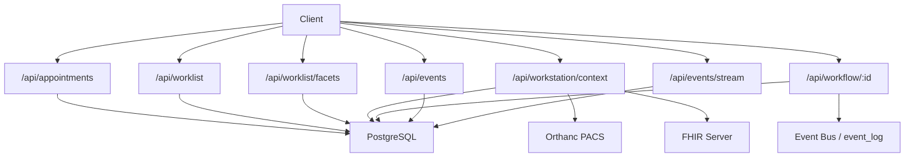
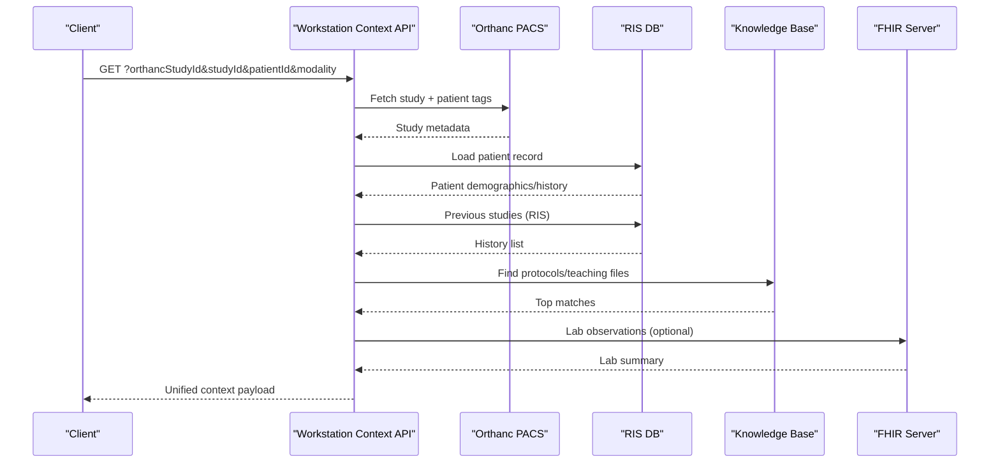
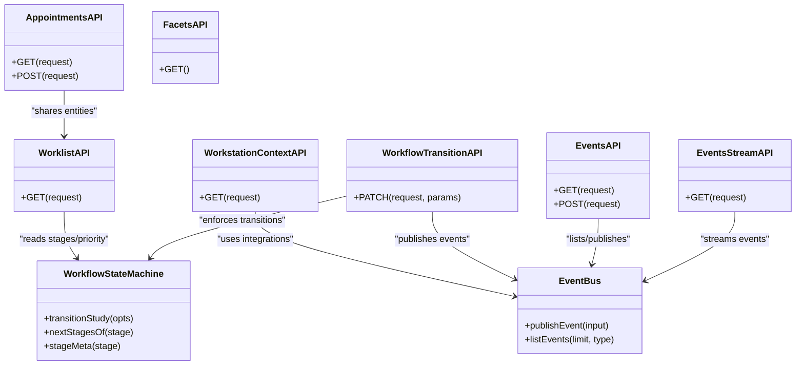

# Scheduling & Worklist API

<cite>
**Referenced Files in This Document**
- [appointments route](file://src/app\api\appointments\route.ts)
- [worklist route](file://src/app\api\worklist\route.ts)
- [worklist facets route](file://src/app\api\worklist\facets\route.ts)
- [workstation context route](file://src/app\api\workstation\context\route.ts)
- [workflow transition route](file://src/app\api\workflow\[id]\route.ts)
- [events route](file://src/app\api\events\route.ts)
- [events stream route](file://src/app\api\events\stream\route.ts)
- [database schema](file://src\db\schema.ts)
- [workflow state machine](file://src\lib\workflow.ts)
- [event bus library](file://src\lib\events.ts)
</cite>

## Table of Contents
1. Introduction
2. Project Structure
3. Core Components
4. Architecture Overview
5. Detailed Component Analysis
6. Dependency Analysis
7. Performance Considerations
8. Troubleshooting Guide
9. Conclusion
10. Appendices

## Introduction
This document provides comprehensive API documentation for scheduling and worklist management endpoints in the radiology platform. It covers appointment creation, modification, cancellation, and status tracking; worklist query operations with filtering by facets and priority handling; equipment allocation; workstation context for radiologist workflows; real-time updates via Server-Sent Events; conflict resolution through a server-side workflow state machine; and resource optimization considerations. Examples are included for emergency cases, routine appointments, and batch processing patterns.

## Project Structure
The scheduling and worklist features are implemented as Next.js API routes backed by a PostgreSQL database using Drizzle ORM. Key modules:
- Appointments: CRUD over scheduled exams and patient-staff-equipment associations.
- Worklist: Queryable view of studies with filters (view, modality, priority, stage, search).
- Facets: Distinct values for dynamic filtering (machines, radiologists, physicians, locations).
- Workstation Context: Aggregates patient, referral, previous studies/reports, protocols, teaching files, similar AI cases, and FHIR lab summaries.
- Workflow Transitions: Enforced forward-only state transitions with audit logging and event publishing.
- Events: Event bus and SSE streaming for real-time updates.

**Diagram sources**
- [appointments route:6-49](file://src/app\api\appointments\route.ts#L6-L49)
- [worklist route:26-117](file://src/app\api\worklist\route.ts#L26-L117)
- [worklist facets route:9-30](file://src/app\api\worklist\facets\route.ts#L9-L30)
- [workstation context route:35-307](file://src/app\api\workstation\context\route.ts#L35-L307)
- [workflow transition route:20-108](file://src/app\api\workflow\[id]\route.ts#L20-L108)
- [events route:6-37](file://src/app\api\events\route.ts#L6-L37)
- [events stream route:20-93](file://src/app\api\events\stream\route.ts#L20-L93)
- [database schema:18-119](file://src\db\schema.ts#L18-L119)

**Section sources**
- [appointments route:6-49](file://src/app\api\appointments\route.ts#L6-L49)
- [worklist route:26-117](file://src/app\api\worklist\route.ts#L26-L117)
- [worklist facets route:9-30](file://src/app\api\worklist\facets\route.ts#L9-L30)
- [workstation context route:35-307](file://src/app\api\workstation\context\route.ts#L35-L307)
- [workflow transition route:20-108](file://src/app\api\workflow\[id]\route.ts#L20-L108)
- [events route:6-37](file://src/app\api\events\route.ts#L6-L37)
- [events stream route:20-93](file://src/app\api\events\stream\route.ts#L20-L93)
- [database schema:18-119](file://src\db\schema.ts#L18-L119)

## Core Components
- Appointments API: List and create appointments; joins patients, equipment, staff to return rich context.
- Worklist API: Filtered queries across modalities, priorities, stages, and free-text search; returns prioritized results.
- Facets API: Provides distinct machines, radiologists, physicians, and locations for UI filters.
- Workstation Context API: Aggregates clinical context from multiple sources (PACS, RIS, knowledge base, FHIR).
- Workflow Transition API: Enforces forward-only stage transitions with validation, audit, events, and notifications.
- Events API: Publish/list events and stream them in real time via SSE.

**Section sources**
- [appointments route:6-49](file://src/app\api\appointments\route.ts#L6-L49)
- [worklist route:26-117](file://src/app\api\worklist\route.ts#L26-L117)
- [worklist facets route:9-30](file://src/app\api\worklist\facets\route.ts#L9-L30)
- [workstation context route:35-307](file://src/app\api\workstation\context\route.ts#L35-L307)
- [workflow transition route:20-108](file://src/app\api\workflow\[id]\route.ts#L20-L108)
- [events route:6-37](file://src/app\api\events\route.ts#L6-L37)
- [events stream route:20-93](file://src/app\api\events\stream\route.ts#L20-L93)

## Architecture Overview
The system uses an event-driven architecture with a durable event log and optional Redis Streams for high-throughput distribution. The workstation context endpoint orchestrates data from PACS (Orthanc), RIS (database), knowledge base, and FHIR servers to present a unified view to radiologists. Workflow transitions are centralized to ensure consistency, auditability, and real-time propagation to clients.

**Diagram sources**
- [workstation context route:35-307](file://src/app\api\workstation\context\route.ts#L35-L307)
- [database schema:18-119](file://src\db\schema.ts#L18-L119)

## Detailed Component Analysis

### Appointments API
- GET /api/appointments
  - Purpose: Retrieve appointments with patient, equipment, and radiographer details.
  - Query params: date (optional filter).
  - Response: Array of appointment records with joined fields.
  - Error handling: Returns 500 on failure.
- POST /api/appointments
  - Purpose: Create a new appointment.
  - Request body: Appointment fields aligned with schema.
  - Response: Created appointment (201).
  - Error handling: Returns 500 on failure.

Notes:
- Status tracking is modeled in the appointments table; typical statuses include scheduled and checked-in variants.
- Equipment allocation is represented by equipmentId linking to the equipment table.

**Section sources**
- [appointments route:6-49](file://src/app\api\appointments\route.ts#L6-L49)
- [database schema:82-100](file://src\db\schema.ts#L82-L100)

### Worklist API
- GET /api/worklist
  - Purpose: Enterprise radiology worklist with full clinical context per entry.
  - Query params:
    - view: today | unread | stat | emergency | assigned | completed | all
    - q: free-text search across patient name, MRN, accession
    - modality: e.g., CT, X-Ray, MRI, Ultrasound
    - radiologist: partial match on first/last name
    - machine: partial match on equipment name
    - physician: partial match on referring physician
    - location: partial match on equipment location
    - priority: stat | urgent | routine
    - stage: referral | scheduled | started | review | completed | released | archived
  - Behavior:
    - Builds SQL conditions based on provided filters.
    - Joins workflow studies, patients, staff, appointments, referrals, equipment.
    - Applies custom priority sort order: emergency > stat > urgent > routine.
  - Response: { ok: true, entries: [...] } or error object on failure.

Priority handling:
- Priority ranking is enforced client-side after retrieval to ensure emergency items surface first.

Equipment allocation:
- Equipment information is joined via appointments to provide machine name, modality, and location.

**Section sources**
- [worklist route:26-117](file://src/app\api\worklist\route.ts#L26-L117)
- [database schema:103-119](file://src\db\schema.ts#L103-L119)

### Worklist Facets API
- GET /api/worklist/facets
  - Purpose: Provide distinct values for dynamic filtering.
  - Response:
    - machines: distinct equipment name, modality, location
    - radiologists: distinct staff with radiologist roles
    - physicians: distinct referring physician names
    - locations: distinct equipment locations

**Section sources**
- [worklist facets route:9-30](file://src/app\api\worklist\facets\route.ts#L9-L30)
- [database schema:53-80](file://src\db\schema.ts#L53-L80)

### Workstation Context API
- GET /api/workstation/context
  - Purpose: Aggregate everything a radiologist needs to interpret a study without leaving the workstation.
  - Query params: orthancStudyId, studyId, patientId, modality.
  - Data sources:
    - Orthanc PACS: current study metadata and patient timeline.
    - RIS (DB): patient demographics, history, previous studies, reports.
    - Knowledge base: protocols and teaching files matched by modality/study description.
    - FHIR: laboratory results summary (best-effort).
  - Response: { ok: true, patient, history, referral, previousStudies, previousReports, protocols, similarCases, teachingFiles, fhirLabSummary }.
  - Graceful degradation: Each external source fails independently without blocking others.

Real-time relevance:
- Similar historical cases are surfaced from accepted AI observations filtered by modality.

**Section sources**
- [workstation context route:35-307](file://src/app\api\workstation\context\route.ts#L35-L307)
- [database schema:167-180](file://src\db\schema.ts#L167-L180)
- [database schema:361-380](file://src\db\schema.ts#L361-L380)

### Workflow Transition API
- PATCH /api/workflow/:id
  - Purpose: Enforce forward-only stage transitions and field updates with validation, audit, events, and notifications.
  - Actions:
    - assign: Assign/reassign a radiologist; may advance to assigned if not already past that stage.
    - transition: Move to a target stage (e.g., sent_to_orthanc, opened, signed, released, archived).
    - Field updates: Allowed fields include priority, radiologistId, studyInstanceUid, bodyPart, procedure, modality.
  - Validation rules:
    - Backward transitions rejected (409).
    - sent_to_orthanc requires a DICOM studyInstanceUid.
    - assigned/opened require a radiologist.
    - signed requires report status signed.
    - released requires report signed.
    - archived only reachable from released.
  - Side effects:
    - Audit log entry created.
    - Stage milestone event published.
    - worklist.updated event published.
    - Notifications issued for assignment and release.

Conflict resolution:
- Centralized transition logic prevents race conditions and ensures consistent state progression.

**Section sources**
- [workflow transition route:20-108](file://src/app\api\workflow\[id]\route.ts#L20-L108)
- [workflow state machine:38-233](file://src\lib\workflow.ts#L38-L233)

### Events API and Real-Time Updates
- GET /api/events
  - Purpose: List recent platform events with optional type filter and limit.
  - Response: { ok: true, events: [...] }.
- POST /api/events
  - Purpose: Publish a manual event (type must be known or custom.*).
  - Response: { ok: true }.
- GET /api/events/stream
  - Purpose: Server-Sent Events stream for real-time workstation updates.
  - Behavior:
    - Polls event_log every ~5 seconds.
    - Sends events ordered oldest-first with id/event/data lines.
    - Supports Last-Event-ID header or lastId query param for resume.
    - Emits keepalive comments when DB temporarily unavailable.

Event types:
- Comprehensive registry includes appointment, study, report, AI, inventory, equipment, and notification events.

**Section sources**
- [events route:6-37](file://src/app\api\events\route.ts#L6-L37)
- [events stream route:20-93](file://src/app\api\events\stream\route.ts#L20-L93)
- [event bus library:19-60](file://src\lib\events.ts#L19-L60)
- [event bus library:101-147](file://src\lib\events.ts#L101-L147)

## Dependency Analysis
Key dependencies and relationships:
- Appointments depend on patients, equipment, staff tables for enriched responses.
- Worklist depends on workflow_studies, patients, staff, appointments, referrals, equipment for comprehensive filtering and sorting.
- Workstation context integrates external systems (Orthanc, FHIR) and internal tables (patients, referrals, reports, workflow_studies, knowledge_documents, ai_observations).
- Workflow transitions rely on the state machine library to enforce rules and publish events.
- Events are persisted to event_log and optionally streamed via Redis Streams.

**Diagram sources**
- [appointments route:6-49](file://src/app\api\appointments\route.ts#L6-L49)
- [worklist route:26-117](file://src/app\api\worklist\route.ts#L26-L117)
- [worklist facets route:9-30](file://src/app\api\worklist\facets\route.ts#L9-L30)
- [workstation context route:35-307](file://src/app\api\workstation\context\route.ts#L35-L307)
- [workflow transition route:20-108](file://src/app\api\workflow\[id]\route.ts#L20-L108)
- [workflow state machine:38-233](file://src\lib\workflow.ts#L38-L233)
- [event bus library:101-147](file://src\lib\events.ts#L101-L147)

**Section sources**
- [database schema:18-119](file://src\db\schema.ts#L18-L119)
- [workflow state machine:38-233](file://src\lib\workflow.ts#L38-L233)
- [event bus library:19-60](file://src\lib\events.ts#L19-L60)

## Performance Considerations
- Worklist queries use selective joins and indexed columns (e.g., createdAt) to optimize sorting and filtering.
- Priority sorting is performed in-memory after retrieval; consider adding computed columns or materialized views for large datasets.
- Workstation context performs multiple external calls; timeouts and graceful degradation prevent cascading failures.
- SSE streaming polls the event_log at fixed intervals; consider Redis Streams for lower latency when available.
- Batch operations should leverage transactional boundaries where possible to maintain consistency.

[No sources needed since this section provides general guidance]

## Troubleshooting Guide
Common issues and resolutions:
- Worklist load failures: Check database connectivity and query parameters; errors return structured objects with detail messages.
- Missing facets: Ensure equipment, staff, and referrals have populated data; facets endpoint filters by role and non-null fields.
- Context aggregation timeouts: External services (Orthanc, FHIR) may be unreachable; verify configuration and network access; responses degrade gracefully.
- Workflow transition conflicts: Backward moves or missing required fields result in 400/409 errors; validate radiologist assignment and report status before transitions.
- Real-time updates not appearing: Confirm SSE connection and Last-Event-ID usage; check event_log writes and Redis availability.

**Section sources**
- [worklist route:112-117](file://src/app\api\worklist\route.ts#L112-L117)
- [worklist facets route:27-30](file://src/app\api\worklist\facets\route.ts#L27-L30)
- [workstation context route:95-98](file://src/app\api\workstation\context\route.ts#L95-L98)
- [workflow transition route:62-80](file://src/app\api\workflow\[id]\route.ts#L62-L80)
- [events stream route:74-80](file://src/app\api\events\stream\route.ts#L74-L80)

## Conclusion
The scheduling and worklist APIs provide a robust foundation for radiology operations, combining flexible querying, strict workflow enforcement, and real-time updates. The workstation context endpoint centralizes clinical information to streamline radiologist workflows. Event-driven design ensures scalability and resilience, while the state machine guarantees consistent lifecycle progression.

[No sources needed since this section summarizes without analyzing specific files]

## Appendices

### Example Scenarios

- Emergency case
  - Use worklist with view=emergency or priority=emergency to surface critical studies.
  - Assign a radiologist via workflow transition action=assign to move to assigned stage.
  - Stream events to update the workstation in real time.

- Routine appointment
  - Create an appointment via POST /api/appointments with scheduledDate, scheduledTime, modality, procedure, priority=routine.
  - Query worklist with view=today to locate upcoming studies.
  - Progress through workflow transitions: sent_to_orthanc -> assigned -> opened -> review -> signed -> released -> archived.

- Batch processing
  - Use worklist filters to select groups (e.g., modality, stage) and apply bulk assignments or transitions via repeated PATCH calls.
  - Monitor progress via /api/events and /api/events/stream for real-time feedback.

[No sources needed since this section provides conceptual examples]