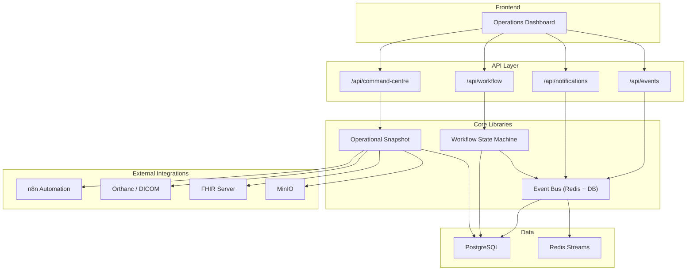
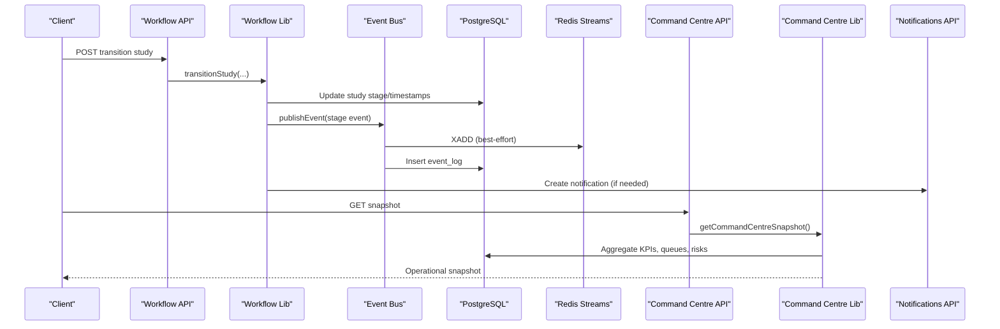
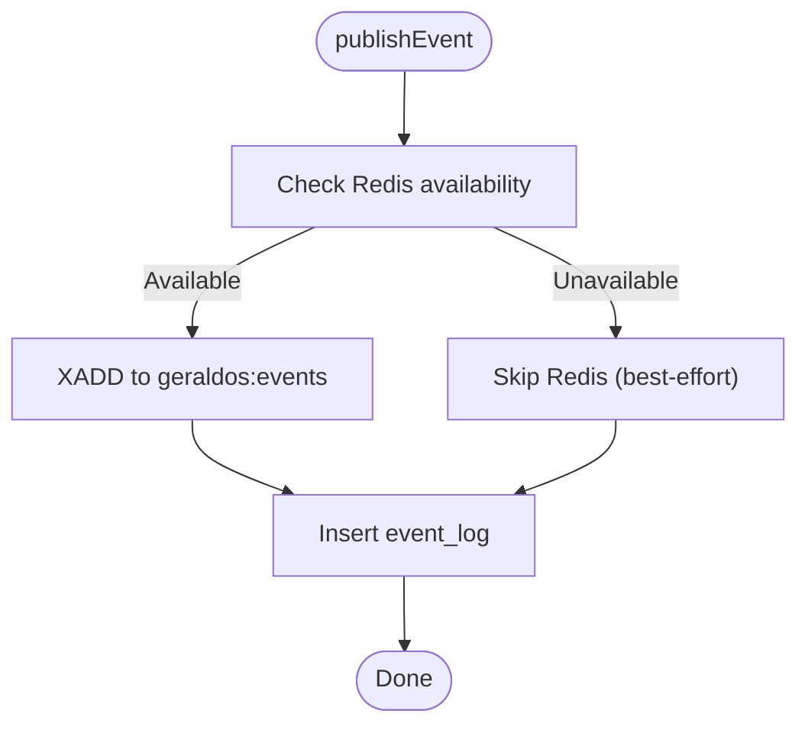
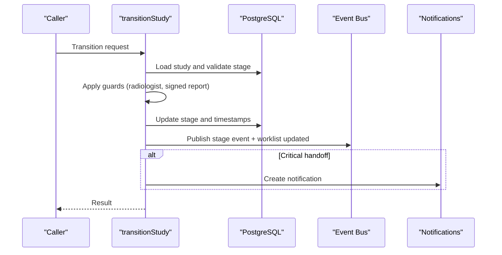
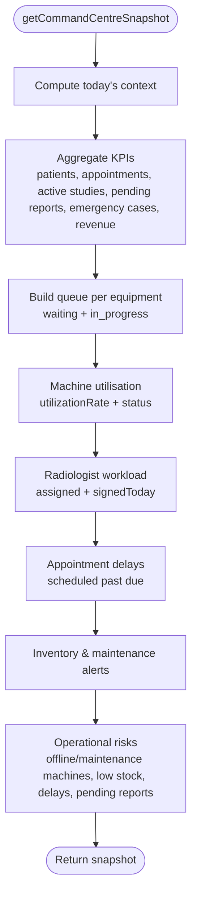
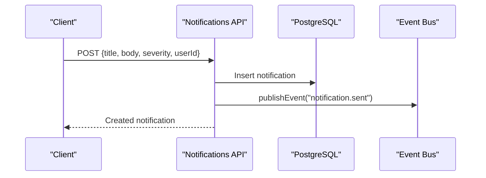
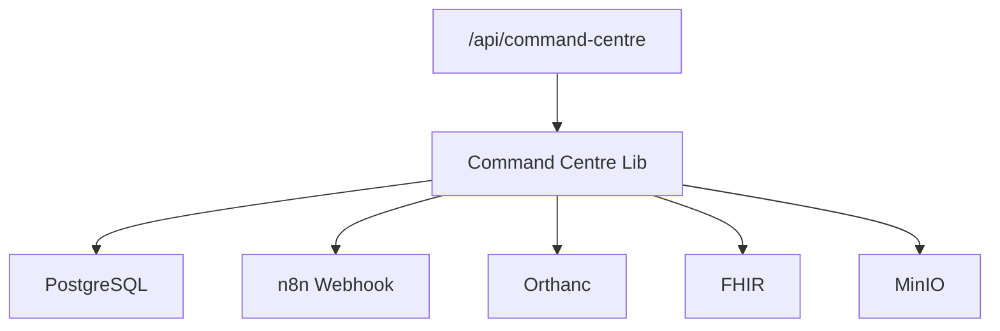
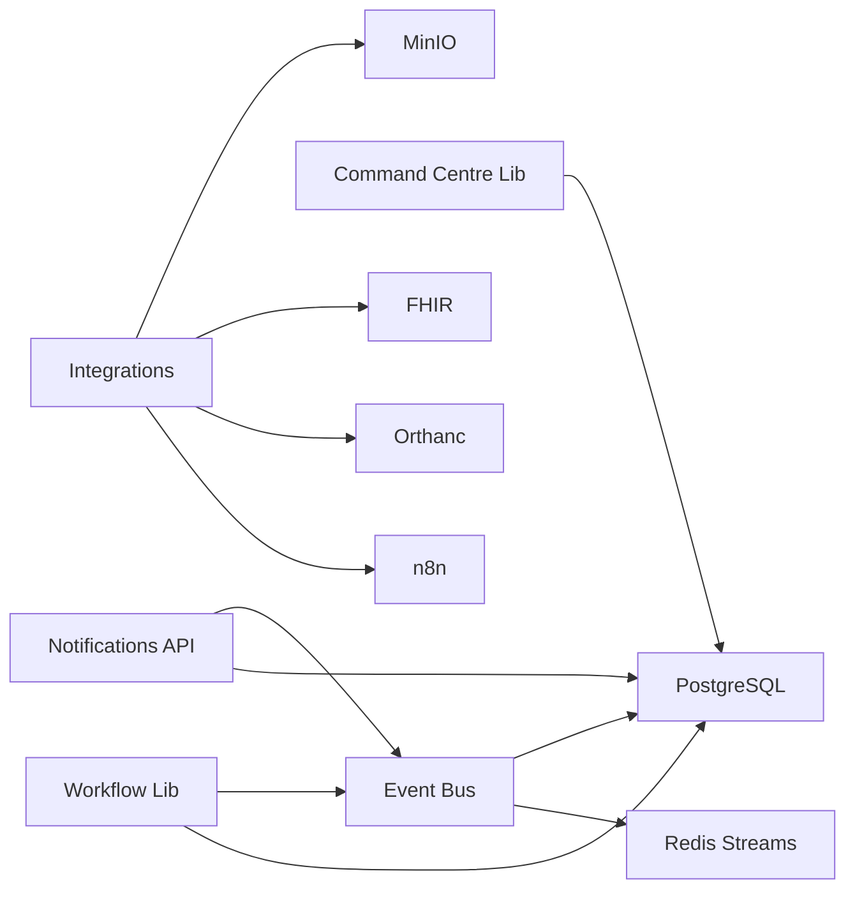

# Bottleneck Detection & Alerting

<cite>
**Referenced Files in This Document**
- [events.ts](file://src/lib/events.ts)
- [workflow.ts](file://src/lib/workflow.ts)
- [command-centre.ts](file://src/lib/command-centre.ts)
- [route.ts (Events API)](file://src/app/api/events/route.ts)
- [route.ts (Command Centre API)](file://src/app/api/command-centre/route.ts)
- [route.ts (Notifications API)](file://src/app/api/notifications/route.ts)
- [route.ts (Workflow API)](file://src/app/api/workflow/route.ts)
- [schema.ts](file://src/db/schema.ts)
- [config.py](file://backend/app/core/config.py)
- [integrations.py](file://backend/app/core/integrations.py)
- [route.ts (Integrations Status)](file://src/app/api/integrations/status/route.ts)
</cite>

## Table of Contents
1. Introduction
2. Project Structure
3. Core Components
4. Architecture Overview
5. Detailed Component Analysis
6. Dependency Analysis
7. Performance Considerations
8. Troubleshooting Guide
9. Conclusion
10. Appendices

## Introduction
This document explains how the clinical workflow system detects bottlenecks and triggers alerts using an event-driven architecture. It covers:
- How stage duration analysis, volume monitoring, and resource utilization tracking identify bottlenecks
- Real-time detection via Redis Streams and durable event persistence
- Automated alerting through notifications and integration with external automation
- Common bottleneck scenarios and their detection patterns
- Integration with the operations command centre, notification systems, and escalation procedures
- Guidance for configuring thresholds, customizing alerts, and implementing proactive optimization

## Project Structure
The bottleneck detection and alerting capabilities are implemented across a small set of focused modules:
- Event bus for real-time and durable event streaming
- Workflow state machine that emits stage events on transitions
- Command centre snapshot aggregating KPIs, queues, equipment health, and operational risks
- Notifications API to persist and broadcast alerts
- External integrations (n8n, Keycloak, Orthanc, FHIR, MinIO) for automation and storage

**Diagram sources**
- [events.ts:102-131](file://src/lib/events.ts#L102-L131)
- [workflow.ts:102-233](file://src/lib/workflow.ts#L102-L233)
- [command-centre.ts:54-206](file://src/lib/command-centre.ts#L54-L206)
- [route.ts (Events API):1-38](file://src/app/api/events/route.ts#L1-L38)
- [route.ts (Command Centre API):1-15](file://src/app/api/command-centre/route.ts#L1-L15)
- [route.ts (Notifications API):1-57](file://src/app/api/notifications/route.ts#L1-L57)
- [route.ts (Workflow API):1-107](file://src/app/api/workflow/route.ts#L1-L107)

**Section sources**
- [events.ts:1-158](file://src/lib/events.ts#L1-L158)
- [workflow.ts:1-246](file://src/lib/workflow.ts#L1-L246)
- [command-centre.ts:1-208](file://src/lib/command-centre.ts#L1-L208)
- [route.ts (Events API):1-38](file://src/app/api/events/route.ts#L1-L38)
- [route.ts (Command Centre API):1-15](file://src/app/api/command-centre/route.ts#L1-L15)
- [route.ts (Notifications API):1-57](file://src/app/api/notifications/route.ts#L1-L57)
- [route.ts (Workflow API):1-107](file://src/app/api/workflow/route.ts#L1-L107)

## Core Components
- Event Bus: Publishes domain events to Redis Streams and persists them to PostgreSQL for durability and auditability.
- Workflow State Machine: Validates and enforces forward-only transitions, records audits, publishes stage events, and raises notifications for critical handoffs.
- Command Centre Snapshot: Aggregates patient flow, queue status, equipment utilization, radiologist workload, appointment delays, inventory alerts, maintenance alerts, live AI recommendations, and operational risks.
- Notifications API: Persists notifications and emits a notification event; supports severity and targeting.
- Integrations: n8n webhooks for automation workflows; health checks for external services; configuration for Redis, database, and other services.

**Section sources**
- [events.ts:18-60](file://src/lib/events.ts#L18-L60)
- [events.ts:102-131](file://src/lib/events.ts#L102-L131)
- [workflow.ts:37-51](file://src/lib/workflow.ts#L37-L51)
- [workflow.ts:102-233](file://src/lib/workflow.ts#L102-L233)
- [command-centre.ts:27-52](file://src/lib/command-centre.ts#L27-L52)
- [command-centre.ts:54-206](file://src/lib/command-centre.ts#L54-L206)
- [route.ts (Notifications API):35-56](file://src/app/api/notifications/route.ts#L35-L56)
- [config.py:1-20](file://backend/app/core/config.py#L1-L20)
- [integrations.py:85-101](file://backend/app/core/integrations.py#L85-L101)

## Architecture Overview
The system uses an event-driven pipeline:
- Every workflow transition emits a stage event and a worklist update event
- The command centre snapshot continuously aggregates data from multiple tables to detect anomalies and generate operational risks
- Notifications are persisted and emitted as events for downstream consumers
- External automation (n8n) can be triggered by events or command centre insights

**Diagram sources**
- [workflow.ts:102-233](file://src/lib/workflow.ts#L102-L233)
- [events.ts:102-131](file://src/lib/events.ts#L102-L131)
- [route.ts (Workflow API):55-101](file://src/app/api/workflow/route.ts#L55-L101)
- [route.ts (Command Centre API):1-15](file://src/app/api/command-centre/route.ts#L1-L15)
- [command-centre.ts:54-206](file://src/lib/command-centre.ts#L54-L206)
- [route.ts (Notifications API):35-56](file://src/app/api/notifications/route.ts#L35-L56)

## Detailed Component Analysis

### Event Bus and Real-Time Detection
- Purpose: Provide reliable, real-time event streaming with durable persistence
- Behavior:
  - Publishes events to Redis Streams with capped length
  - Persists every event to PostgreSQL event_log table
  - Provides listing and counting endpoints for activity feeds
- Bottleneck relevance:
  - Stage events enable duration calculations per stage
  - Volume spikes detected via event counts and timestamps
  - Equipment online/offline events feed operational risk logic

**Diagram sources**
- [events.ts:72-99](file://src/lib/events.ts#L72-L99)
- [events.ts:102-131](file://src/lib/events.ts#L102-L131)

**Section sources**
- [events.ts:18-60](file://src/lib/events.ts#L18-L60)
- [events.ts:102-131](file://src/lib/events.ts#L102-L131)
- [events.ts:134-157](file://src/lib/events.ts#L134-L157)

### Workflow State Machine and Stage Duration Analysis
- Purpose: Enforce forward-only transitions, record audits, emit stage events, and raise notifications
- Behavior:
  - Validates target stage and guards (e.g., requires radiologist assignment, signed report before release)
  - Updates timestamps (startedAt, completedAt) at key milestones
  - Emits stage-specific events and a worklist update event
  - Creates notifications for clinically significant handoffs
- Bottleneck relevance:
  - Duration between stages computed from timestamps
  - Backward moves rejected to maintain integrity
  - Worklist updates trigger real-time board refreshes

**Diagram sources**
- [workflow.ts:102-233](file://src/lib/workflow.ts#L102-L233)

**Section sources**
- [workflow.ts:37-51](file://src/lib/workflow.ts#L37-L51)
- [workflow.ts:102-233](file://src/lib/workflow.ts#L102-L233)

### Command Centre Snapshot and Resource Utilization Tracking
- Purpose: Provide a comprehensive operational snapshot including KPIs, queues, equipment utilization, radiologist workload, appointment delays, inventory/maintenance alerts, and operational risks
- Behavior:
  - Aggregates counts and statuses across patients, appointments, workflow studies, reports, equipment, staff, inventory, maintenance, invoices, referrals, insurance claims
  - Computes appointment delays and flags operational risks based on equipment status, low stock, pending reports, and delayed appointments
  - Exposes machine utilization and queue metrics per equipment
- Bottleneck relevance:
  - Identifies equipment downtime and maintenance impacts
  - Detects high-volume periods via active studies and appointment delays
  - Highlights staff shortages via radiologist workload vs assigned studies

**Diagram sources**
- [command-centre.ts:54-206](file://src/lib/command-centre.ts#L54-L206)

**Section sources**
- [command-centre.ts:27-52](file://src/lib/command-centre.ts#L27-L52)
- [command-centre.ts:54-206](file://src/lib/command-centre.ts#L54-L206)

### Notifications and Escalation Procedures
- Purpose: Persist notifications and emit events for downstream consumption
- Behavior:
  - Accepts title, body, type, severity, link, userId
  - Persists to notifications table
  - Emits a notification.sent event
- Escalation:
  - Severity levels support prioritization
  - Targeted notifications (user-specific or all) enable role-based escalation
  - Can integrate with external automation via n8n triggers

**Diagram sources**
- [route.ts (Notifications API):35-56](file://src/app/api/notifications/route.ts#L35-L56)
- [events.ts:102-131](file://src/lib/events.ts#L102-L131)

**Section sources**
- [route.ts (Notifications API):1-57](file://src/app/api/notifications/route.ts#L1-L57)
- [events.ts:18-60](file://src/lib/events.ts#L18-L60)

### Integration with Operations Command Centre and External Systems
- Command Centre API exposes the full snapshot for dashboards and automated monitoring
- Integrations include:
  - n8n webhooks for automation workflows
  - Health checks for external services
  - Configuration for Redis, database, and other services
- Operational risks are surfaced in the snapshot and can drive automated responses

**Diagram sources**
- [route.ts (Command Centre API):1-15](file://src/app/api/command-centre/route.ts#L1-L15)
- [command-centre.ts:54-206](file://src/lib/command-centre.ts#L54-L206)
- [integrations.py:85-101](file://backend/app/core/integrations.py#L85-L101)

**Section sources**
- [route.ts (Command Centre API):1-15](file://src/app/api/command-centre/route.ts#L1-L15)
- [integrations.py:1-119](file://backend/app/core/integrations.py#L1-L119)
- [config.py:1-20](file://backend/app/core/config.py#L1-L20)

## Dependency Analysis
Key dependencies and relationships:
- Workflow transitions depend on database schema for studies, reports, staff, and appointments
- Event bus depends on Redis for real-time streaming and PostgreSQL for durability
- Command centre depends on multiple tables to compute KPIs and operational risks
- Notifications depend on the event bus for downstream processing
- Integrations depend on environment configuration for connectivity

**Diagram sources**
- [workflow.ts:102-233](file://src/lib/workflow.ts#L102-L233)
- [events.ts:102-131](file://src/lib/events.ts#L102-L131)
- [command-centre.ts:54-206](file://src/lib/command-centre.ts#L54-L206)
- [route.ts (Notifications API):35-56](file://src/app/api/notifications/route.ts#L35-L56)
- [integrations.py:85-101](file://backend/app/core/integrations.py#L85-L101)

**Section sources**
- [schema.ts:102-180](file://src/db/schema.ts#L102-L180)
- [events.ts:102-131](file://src/lib/events.ts#L102-L131)
- [command-centre.ts:54-206](file://src/lib/command-centre.ts#L54-L206)
- [route.ts (Notifications API):35-56](file://src/app/api/notifications/route.ts#L35-L56)
- [integrations.py:85-101](file://backend/app/core/integrations.py#L85-L101)

## Performance Considerations
- Redis Streams are capped and best-effort; ensure Redis is configured for optimal throughput and retention
- PostgreSQL queries in the command centre aggregate large datasets; consider indexing frequently filtered columns (stage, status, dates)
- Event persistence should not block workflow transitions; failures in Redis do not block DB writes
- Notification creation is isolated from core transitions to avoid blocking critical paths
- External integrations (n8n, Orthanc, FHIR) should have timeouts and retries configured to prevent cascading delays

[No sources needed since this section provides general guidance]

## Troubleshooting Guide
Common issues and resolutions:
- Redis unreachable: Events still persist to PostgreSQL; monitor event_log for completeness
- Workflow transition failures: Validate stage requirements (radiologist assignment, signed report); check error messages returned by transitionStudy
- Command centre snapshot errors: Verify database connectivity and permissions; review aggregation queries for performance
- Notification delivery: Ensure notifications table is writable; confirm event publishing succeeds
- Integration health: Use the integrations status endpoint to diagnose connectivity issues

**Section sources**
- [events.ts:72-99](file://src/lib/events.ts#L72-L99)
- [events.ts:102-131](file://src/lib/events.ts#L102-L131)
- [workflow.ts:102-165](file://src/lib/workflow.ts#L102-L165)
- [route.ts (Integrations Status):1-42](file://src/app/api/integrations/status/route.ts#L1-L42)

## Conclusion
The system combines an event-driven architecture with robust workflow validation and a comprehensive command centre snapshot to detect and respond to bottlenecks in real time. By leveraging stage durations, volume monitoring, and resource utilization tracking, it identifies equipment downtime, staff shortages, and high-volume periods. Automated alerting through notifications and external automation enables proactive workflow optimization and effective escalation procedures.

[No sources needed since this section summarizes without analyzing specific files]

## Appendices

### Common Bottleneck Scenarios and Detection Patterns
- Equipment downtime: Detected via equipment status changes and operational risks in the command centre snapshot
- Staff shortages: Identified by comparing radiologist workload against assigned studies and pending reports
- High-volume periods: Recognized through increased active studies, appointment delays, and queue lengths per equipment

[No sources needed since this section doesn't analyze specific files]

### Configuring Thresholds and Customizing Alerts
- Configure Redis URL and connection parameters for real-time event streaming
- Set up n8n webhooks to automate responses to specific events or command centre insights
- Use notification severity and targeting to tailor alerts for different roles and escalation levels
- Monitor integration health via the status endpoint and adjust timeouts/retries as needed

**Section sources**
- [config.py:1-20](file://backend/app/core/config.py#L1-L20)
- [integrations.py:85-101](file://backend/app/core/integrations.py#L85-L101)
- [route.ts (Integrations Status):1-42](file://src/app/api/integrations/status/route.ts#L1-L42)