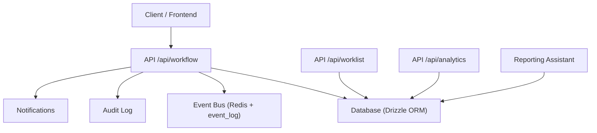
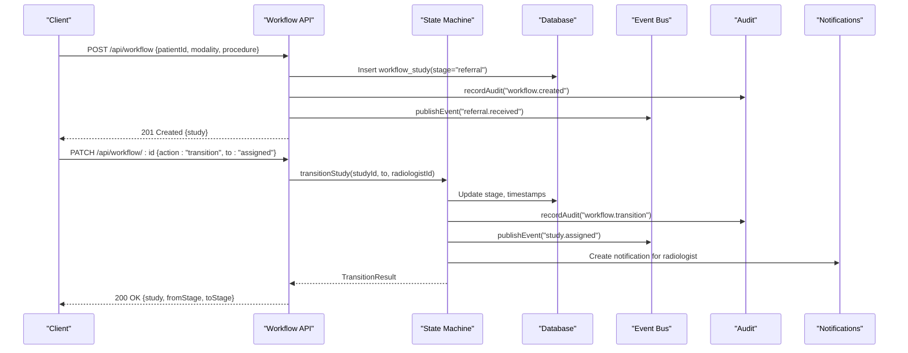
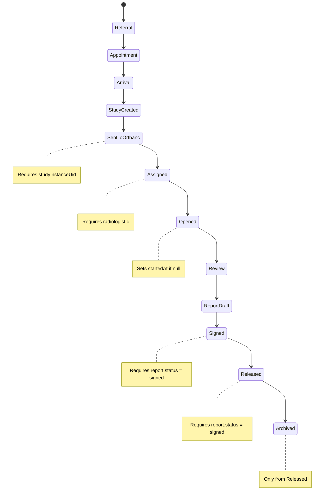
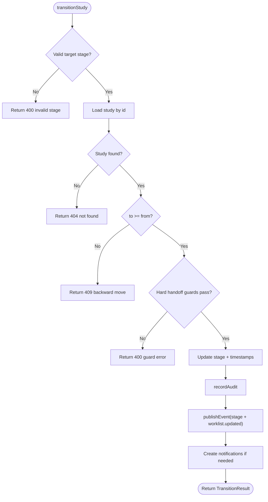
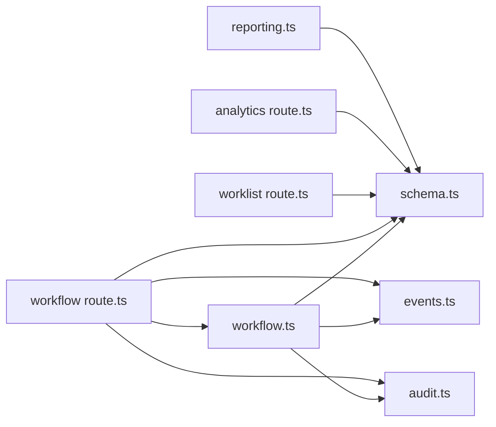

# Clinical Workflow

<cite>
**Referenced Files in This Document**
- [workflow.ts](file://src/lib/workflow.ts)
- [route.ts (workflow)](file://src/app/api/workflow/route.ts)
- [route.ts (workflow id)](file://src/app/api/workflow/[id]/route.ts)
- [schema.ts](file://src/db/schema.ts)
- [events.ts](file://src/lib/events.ts)
- [audit.ts](file://src/lib/audit.ts)
- [route.ts (worklist)](file://src/app/api/worklist/route.ts)
- [route.ts (analytics)](file://src/app/analytics/route.ts)
- [reporting.ts](file://src/lib/reporting.ts)
- [route.ts (reports)](file://src/app/api/reports/route.ts)
- [orchestration.py](file://backend/app/agents/orchestration.py)
</cite>

## Table of Contents
1. Introduction
2. Project Structure
3. Core Components
4. Architecture Overview
5. Detailed Component Analysis
6. Dependency Analysis
7. Performance Considerations
8. Troubleshooting Guide
9. Conclusion
10. Appendices

## Introduction
This document explains the clinical workflow management system for radiology studies. It covers study lifecycle management, stage progression tracking, turnaround time monitoring, and bottleneck detection. It documents the workflow state machine, transition rules, audit trail capabilities, and API endpoints used to create studies, advance stages, update status, and retrieve performance metrics. It also addresses common clinical scenarios such as STAT studies, multi-modality workflows, and quality assurance processes.

## Project Structure
The workflow is implemented as a server-side state machine with event-driven side effects:
- State machine and transitions are defined in the workflow library.
- REST endpoints expose creation, listing, and transitions.
- Database schema defines entities for studies, reports, audit logs, events, and notifications.
- Event bus persists events and optionally publishes to Redis Streams.
- Audit logging records every change immutably.
- Worklist and analytics APIs provide operational visibility.

**Diagram sources**
- [route.ts (workflow):12-106](file://src/app/api/workflow/route.ts#L12-L106)
- [route.ts (workflow id):20-108](file://src/app/api/workflow/[id]/route.ts#L20-L108)
- [workflow.ts:102-233](file://src/lib/workflow.ts#L102-L233)
- [events.ts:101-131](file://src/lib/events.ts#L101-L131)
- [audit.ts:4-24](file://src/lib/audit.ts#L4-L24)
- [schema.ts:103-119](file://src/db/schema.ts#L103-L119)

**Section sources**
- [route.ts (workflow):12-106](file://src/app/api/workflow/route.ts#L12-L106)
- [route.ts (workflow id):20-108](file://src/app/api/workflow/[id]/route.ts#L20-L108)
- [workflow.ts:29-81](file://src/lib/workflow.ts#L29-L81)
- [schema.ts:103-119](file://src/db/schema.ts#L103-L119)

## Core Components
- Workflow state machine: canonical pipeline, validation, and transition logic.
- API layer: study creation, listing, and transitions.
- Data model: workflow studies, reports, audit log, events, notifications.
- Event bus: durable event persistence and optional real-time streaming.
- Audit trail: immutable record of all transitions and updates.
- Worklist and analytics: operational views for queues, counts, and bottlenecks.
- Reporting assistant: structured templates, quality scoring, terminology checks.

Key responsibilities:
- Enforce forward-only transitions with hard handoff guards.
- Record audit entries for every change.
- Publish domain events for downstream consumers.
- Provide worklist filtering by priority, modality, stage, and more.
- Surface analytics for throughput and bottlenecks.

**Section sources**
- [workflow.ts:29-81](file://src/lib/workflow.ts#L29-L81)
- [workflow.ts:102-233](file://src/lib/workflow.ts#L102-L233)
- [route.ts (workflow):55-106](file://src/app/api/workflow/route.ts#L55-L106)
- [route.ts (workflow id):20-108](file://src/app/api/workflow/[id]/route.ts#L20-L108)
- [events.ts:18-60](file://src/lib/events.ts#L18-L60)
- [audit.ts:4-24](file://src/lib/audit.ts#L4-L24)
- [schema.ts:103-119](file://src/db/schema.ts#L103-L119)
- [schema.ts:167-180](file://src/db/schema.ts#L167-L180)
- [schema.ts:447-467](file://src/db/schema.ts#L447-L467)

## Architecture Overview
The system uses an event-driven architecture with a strict state machine at its core. Studies move through a fixed sequence of stages. Transitions are validated server-side, audited, and published as events. Operational dashboards consume events and database queries to monitor throughput and identify bottlenecks.

**Diagram sources**
- [route.ts (workflow):55-106](file://src/app/api/workflow/route.ts#L55-L106)
- [route.ts (workflow id):20-108](file://src/app/api/workflow/[id]/route.ts#L20-L108)
- [workflow.ts:102-233](file://src/lib/workflow.ts#L102-L233)
- [events.ts:101-131](file://src/lib/events.ts#L101-L131)
- [audit.ts:4-24](file://src/lib/audit.ts#L4-L24)

## Detailed Component Analysis

### Study Lifecycle and Stage Progression
The pipeline is ordered and enforced by index. The canonical stages include referral, appointment, patient arrival, study created, sent to Orthanc, radiologist assigned, study opened, AI review, report draft, report signed, report released, and archive. Transitions must be forward-only; backward moves return conflict errors. Hard handoffs require specific preconditions:
- Sent to Orthanc requires a DICOM studyInstanceUid.
- Assigned/Open require a radiologist.
- Signed requires a signed report.
- Released requires a signed report.
- Archived only from released.

Timestamps capture milestones: startedAt when opened, completedAt when released.

**Diagram sources**
- [workflow.ts:38-51](file://src/lib/workflow.ts#L38-L51)
- [workflow.ts:134-172](file://src/lib/workflow.ts#L134-L172)

**Section sources**
- [workflow.ts:38-81](file://src/lib/workflow.ts#L38-L81)
- [workflow.ts:102-172](file://src/lib/workflow.ts#L102-L172)

### Transition Rules and Validation
Transition logic validates:
- Known stage keys.
- Forward-only movement.
- Required context (UID, radiologist).
- Report gating for signing and release.
- Archive only from released.

On success, it:
- Updates stage and relevant timestamps.
- Records audit entry.
- Publishes stage-specific event and worklist refresh event.
- Creates notifications for assignment and release.

**Diagram sources**
- [workflow.ts:102-233](file://src/lib/workflow.ts#L102-L233)

**Section sources**
- [workflow.ts:102-233](file://src/lib/workflow.ts#L102-L233)

### Audit Trail Capabilities
Every transition and creation writes an immutable audit entry including user, action, module, entity type, entity id, and details. This supports compliance and traceability across the entire workflow.

**Section sources**
- [audit.ts:4-24](file://src/lib/audit.ts#L4-L24)
- [workflow.ts:189-197](file://src/lib/workflow.ts#L189-L197)
- [route.ts (workflow):80-93](file://src/app/api/workflow/route.ts#L80-L93)

### Turnaround Time Monitoring
Turnaround time (TAT) can be derived from timestamps on the workflow study:
- Started at: when study opens.
- Completed at: when report releases.
These fields enable calculation of per-study TAT and aggregation across modalities or radiologists.

Operational visibility:
- Worklist filters support STAT and emergency views.
- Analytics endpoint provides counts by stage and modality.
- Command centre aggregates risks like pending reports that may breach TAT.

**Section sources**
- [schema.ts:103-119](file://src/db/schema.ts#L103-L119)
- [route.ts (worklist):26-118](file://src/app/api/worklist/route.ts#L26-L118)
- [route.ts (analytics):6-53](file://src/app/analytics/route.ts#L6-L53)

### Bottleneck Detection
Bottlenecks are identified via:
- Stage counts to see where studies accumulate.
- Modality distribution to spot overloaded modalities.
- Priority-based views (STAT/emergency) to highlight urgent backlogs.
- Pending reports and equipment status to surface operational constraints.

**Section sources**
- [route.ts (analytics):27-41](file://src/app/analytics/route.ts#L27-L41)
- [route.ts (worklist):40-63](file://src/app/api/worklist/route.ts#L40-L63)

### API Endpoints for Workflow Operations

- GET /api/workflow
  - Lists all workflow studies with patient and radiologist context and stage label.
  - Response includes study identifiers, stage, priority, timestamps, and related names.

- POST /api/workflow
  - Creates a new study at the referral stage.
  - Required fields: patientId, modality, procedure. Optional: appointmentId, bodyPart, priority, changedBy.
  - Emits referral received and worklist updated events; records audit.

- PATCH /api/workflow/:id
  - Supports:
    - action: "transition", to: "<stage>" — validated forward move.
    - action: "assign", radiologistId: "<staff-id>" — assigns and advances to assigned if before assigned stage.
    - Plain field updates: priority, radiologistId, studyInstanceUid, bodyPart, procedure, modality.
  - Returns transition result with from/to stages and whether a transition occurred.

**Section sources**
- [route.ts (workflow):12-47](file://src/app/api/workflow/route.ts#L12-L47)
- [route.ts (workflow):55-106](file://src/app/api/workflow/route.ts#L55-L106)
- [route.ts (workflow id):20-108](file://src/app/api/workflow/[id]/route.ts#L20-L108)

### Status Updates and Metrics

- Worklist GET /api/worklist
  - Filters by view (today, unread, stat, emergency, assigned, completed), q (search), modality, radiologist, machine, physician, location, priority, stage.
  - Returns enriched entries with patient, radiologist, equipment, and referral context.

- Analytics GET /api/analytics
  - Returns counts for patients, appointments, studies, equipment, reports.
  - Provides low stock items count, equipment by status, studies by stage, studies by modality.

**Section sources**
- [route.ts (worklist):26-118](file://src/app/api/worklist/route.ts#L26-L118)
- [route.ts (analytics):6-53](file://src/app/analytics/route.ts#L6-L53)

### Concrete Examples from Codebase

- Study creation:
  - Endpoint creates a study with stage "referral", generates accession number, emits events, and records audit.
  - See: [POST /api/workflow:55-106](file://src/app/api/workflow/route.ts#L55-L106)

- Stage transitions:
  - Assign radiologist and advance to assigned:
    - See: [PATCH assign action:33-60](file://src/app/api/workflow/[id]/route.ts#L33-L60)
  - Advance to next stage with validation:
    - See: [PATCH transition action:62-80](file://src/app/api/workflow/[id]/route.ts#L62-L80)

- Completion workflow:
  - Release requires signed report; archived only from released.
  - See: [Hard handoff guards:148-165](file://src/lib/workflow.ts#L148-L165)

**Section sources**
- [route.ts (workflow):55-106](file://src/app/api/workflow/route.ts#L55-L106)
- [route.ts (workflow id):33-80](file://src/app/api/workflow/[id]/route.ts#L33-L80)
- [workflow.ts:148-172](file://src/lib/workflow.ts#L148-L172)

### Common Clinical Scenarios

- STAT studies:
  - Priority field supports "stat" and "emergency".
  - Worklist supports dedicated views for STAT and emergency cases.
  - Decision engine enforces STAT actions only in scheduling/workflow contexts.

- Multi-modality workflows:
  - Studies carry modality and procedure; worklist and analytics group by modality.
  - Hanging protocols and reporting templates are modality-aware.

- Quality assurance processes:
  - Reporting assistant provides structured templates, checklists, terminology normalization, and quality scoring.
  - Critical findings detection flags urgent terms in drafts.
  - AI observations are candidate findings requiring radiologist acceptance or rejection.

**Section sources**
- [route.ts (worklist):40-49](file://src/app/api/worklist/route.ts#L40-L49)
- [decision-engine.ts:45-84](file://src/lib/decision-engine.ts#L45-L84)
- [reporting.ts:25-173](file://src/lib/reporting.ts#L25-L173)
- [reporting.ts:273-326](file://src/lib/reporting.ts#L273-L326)
- [schema.ts:358-380](file://src/db/schema.ts#L358-L380)

## Dependency Analysis
The workflow depends on:
- Database schema for studies, reports, audit, events, and notifications.
- Event bus for publishing domain events and persisting them durably.
- Audit logger for immutable records.
- Worklist and analytics APIs for operational visibility.

**Diagram sources**
- [workflow.ts:23-27](file://src/lib/workflow.ts#L23-L27)
- [route.ts (workflow):2-8](file://src/app/api/workflow/route.ts#L2-L8)
- [route.ts (workflow id):2-7](file://src/app/api/workflow/[id]/route.ts#L2-L7)
- [route.ts (worklist):2-4](file://src/app/api/worklist/route.ts#L2-L4)
- [route.ts (analytics):2-4](file://src/app/analytics/route.ts#L2-L4)
- [reporting.ts:1-7](file://src/lib/reporting.ts#L1-L7)

**Section sources**
- [workflow.ts:23-27](file://src/lib/workflow.ts#L23-L27)
- [route.ts (workflow):2-8](file://src/app/api/workflow/route.ts#L2-L8)
- [route.ts (workflow id):2-7](file://src/app/api/workflow/[id]/route.ts#L2-L7)
- [route.ts (worklist):2-4](file://src/app/api/worklist/route.ts#L2-L4)
- [route.ts (analytics):2-4](file://src/app/analytics/route.ts#L2-L4)

## Performance Considerations
- Use worklist filters to reduce payload size and focus on high-priority queues.
- Leverage analytics endpoints for aggregated counts to avoid heavy client-side computations.
- Event bus writes are best-effort to Redis; durable persistence ensures no loss even if Redis is down.
- Keep transitions minimal and batch updates where possible to reduce round trips.

[No sources needed since this section provides general guidance]

## Troubleshooting Guide
Common issues and resolutions:
- Invalid stage: Ensure target stage is one of the defined keys; use stageLabel for display names.
- Backward transition: Move forward only; reassign radiologist does not roll back stage if already past assigned.
- Missing UID: To mark "Sent to Orthanc", supply a valid studyInstanceUid.
- Missing radiologist: Assign a radiologist before marking "Assigned" or "Opened".
- Report gating: Sign report before releasing; archive only from released.
- Audit failures: Check audit log writes; they are best-effort but logged.

**Section sources**
- [workflow.ts:111-165](file://src/lib/workflow.ts#L111-L165)
- [route.ts (workflow id):33-80](file://src/app/api/workflow/[id]/route.ts#L33-L80)
- [audit.ts:12-23](file://src/lib/audit.ts#L12-L23)

## Conclusion
The clinical workflow system enforces a robust, auditable, and event-driven pipeline for radiology studies. It provides clear stage progression, strong validation, comprehensive audit trails, and operational visibility through worklist and analytics. It supports STAT handling, multi-modality workflows, and quality assurance through structured reporting and AI-assisted observation review.

[No sources needed since this section summarizes without analyzing specific files]

## Appendices

### Workflow State Machine Reference
- Stages: referral, appointment, arrival, study_created, sent_to_orthanc, assigned, opened, review, report_draft, signed, released, archived.
- Index order defines allowed transitions; forward-only enforced.

**Section sources**
- [workflow.ts:38-51](file://src/lib/workflow.ts#L38-L51)

### Data Model Highlights
- workflow_studies: id, appointmentId, patientId, accessionNumber, studyInstanceUid, modality, procedure, bodyPart, stage, radiologistId, priority, startedAt, completedAt, timestamps.
- reports: id, studyId, patientId, radiologistId, templateName, findings, impression, recommendation, status, signedAt, timestamps.
- audit_log: id, userId, action, module, entityType, entityId, details, ipAddress, createdAt.
- event_log: id, eventType, aggregate, aggregateId, payload, source, occurredAt.
- notifications: id, userId, title, body, type, severity, link, read, createdAt.

**Section sources**
- [schema.ts:103-119](file://src/db/schema.ts#L103-L119)
- [schema.ts:167-180](file://src/db/schema.ts#L167-L180)
- [schema.ts:183-193](file://src/db/schema.ts#L183-L193)
- [schema.ts:447-467](file://src/db/schema.ts#L447-L467)

### Agent Orchestration Context
- Agents supervise workflow transitions and auditing integrity.
- Executive agent synthesizes KPIs including turnaround time.

**Section sources**
- [orchestration.py:87-94](file://backend/app/agents/orchestration.py#L87-L94)