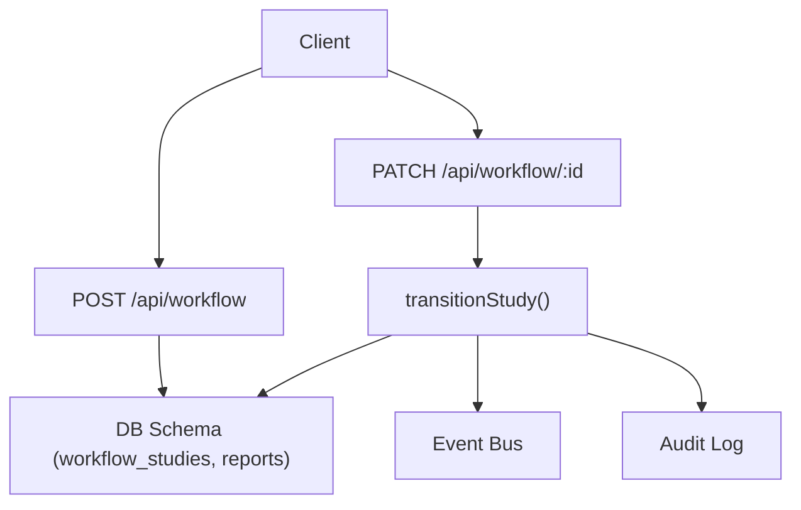
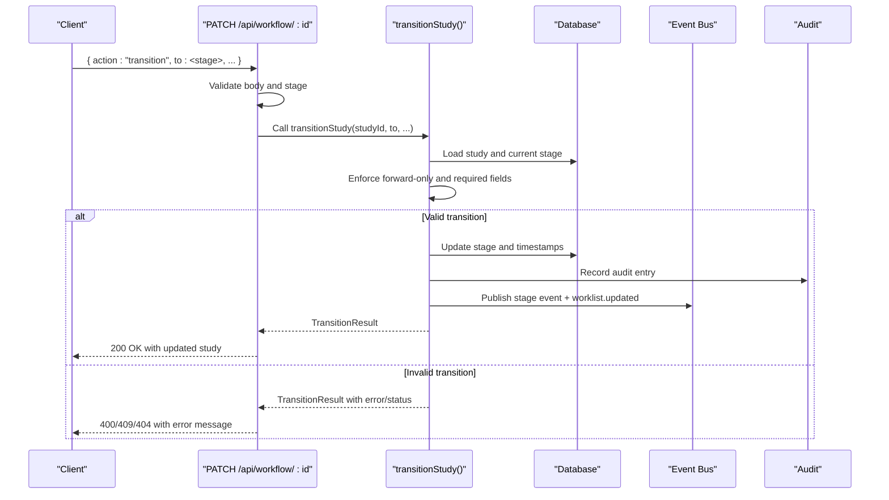
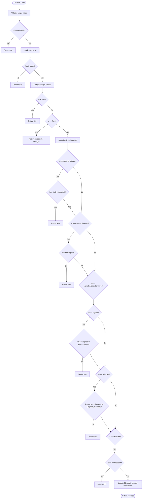
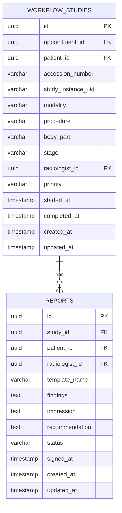
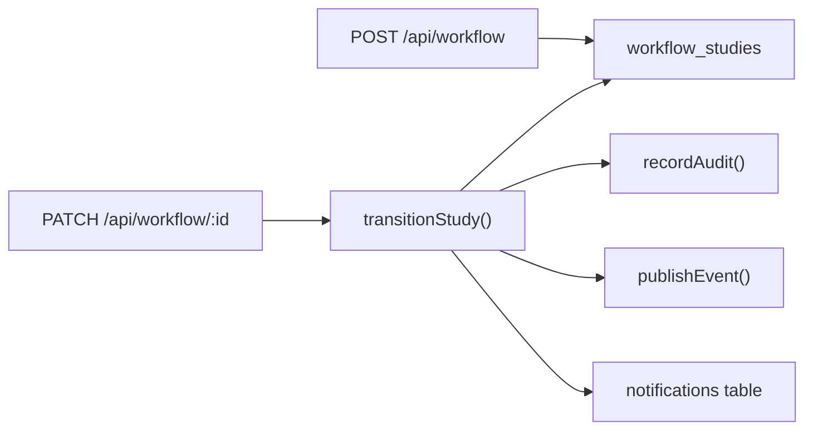

# Stage Transitions & Validation

<cite>
**Referenced Files in This Document**
- [workflow.ts](file://src/lib/workflow.ts)
- [route.ts (PATCH /api/workflow/[id])](file://src/app/api/workflow/[id]/route.ts)
- [route.ts (POST /api/workflow)](file://src/app/api/workflow/route.ts)
- [schema.ts](file://src/db/schema.ts)
</cite>

## Table of Contents
1. Introduction
2. Project Structure
3. Core Components
4. Architecture Overview
5. Detailed Component Analysis
6. Dependency Analysis
7. Performance Considerations
8. Troubleshooting Guide
9. Conclusion

## Introduction
This document explains the workflow stage transitions and validation mechanisms that govern how a radiology study moves through the clinical pipeline. It focuses on the transitionStudy function’s validation logic, including forward-only enforcement, required field checks for Orthanc submission and radiologist assignment, and hard handoff guards around signed reports and released studies. It also documents HTTP status codes for validation failures and provides practical examples of valid and invalid transitions with recovery procedures. The goal is to ensure clinical safety and compliance by enforcing business rules at the server layer.

## Project Structure
The workflow state machine is implemented as a server-side library and exposed via Next.js API routes:
- State machine and validation logic: src/lib/workflow.ts
- API endpoints for creating and transitioning studies: src/app/api/workflow/route.ts and src/app/api/workflow/[id]/route.ts
- Data model definitions: src/db/schema.ts

**Diagram sources**
- [route.ts (POST /api/workflow):55-101](file://src/app/api/workflow/route.ts#L55-L101)
- [route.ts (PATCH /api/workflow/[id]):20-109](file://src/app/api/workflow/[id]/route.ts#L20-L109)
- [workflow.ts:102-234](file://src/lib/workflow.ts#L102-L234)
- [schema.ts:103-119](file://src/db/schema.ts#L103-L119)
- [schema.ts:167-180](file://src/db/schema.ts#L167-L180)

**Section sources**
- [route.ts (POST /api/workflow):55-101](file://src/app/api/workflow/route.ts#L55-L101)
- [route.ts (PATCH /api/workflow/[id]):20-109](file://src/app/api/workflow/[id]/route.ts#L20-L109)
- [workflow.ts:102-234](file://src/lib/workflow.ts#L102-L234)
- [schema.ts:103-119](file://src/db/schema.ts#L103-L119)
- [schema.ts:167-180](file://src/db/schema.ts#L167-L180)

## Core Components
- Workflow stages and metadata define the canonical pipeline order and events.
- transitionStudy enforces all business rules for advancing a study, including:
  - Forward-only transitions
  - Required fields for specific stages
  - Hard handoff guards for reporting milestones
- API routes provide controlled entry points for creating studies and performing transitions.

Key responsibilities:
- src/lib/workflow.ts: Defines stages, validates transitions, updates database, emits events, writes audit logs, and creates notifications.
- src/app/api/workflow/route.ts: Creates new studies at referral and returns enriched lists.
- src/app/api/workflow/[id]/route.ts: Validates input, delegates to transitionStudy, handles reassignment, and returns standardized responses.

**Section sources**
- [workflow.ts:29-81](file://src/lib/workflow.ts#L29-L81)
- [workflow.ts:102-234](file://src/lib/workflow.ts#L102-L234)
- [route.ts (POST /api/workflow):55-101](file://src/app/api/workflow/route.ts#L55-L101)
- [route.ts (PATCH /api/workflow/[id]):20-109](file://src/app/api/workflow/[id]/route.ts#L20-L109)

## Architecture Overview
The system uses a strict server-side state machine. Clients cannot arbitrarily set stages; they must call PATCH /api/workflow/:id with an action or target stage. The route validates inputs and delegates to transitionStudy, which performs all validations and side effects.

**Diagram sources**
- [route.ts (PATCH /api/workflow/[id]):20-109](file://src/app/api/workflow/[id]/route.ts#L20-L109)
- [workflow.ts:102-234](file://src/lib/workflow.ts#L102-L234)

## Detailed Component Analysis

### transitionStudy Validation Logic
transitionStudy implements the following validation and guard rules:

- Stage validity:
  - Rejects unknown target stages with HTTP 400.
  - Rejects unknown current stage with HTTP 400.
- Forward-only enforcement:
  - If the requested target stage index is less than the current stage index, return HTTP 409 (conflict) indicating a backward move is not allowed.
  - If the target equals the current stage, return success without changing state.
- Required fields:
  - sent_to_orthanc requires a DICOM studyInstanceUid. If missing from both the study record and request payload, return HTTP 400.
  - assigned and opened require a radiologistId. If missing from both the study record and request payload, return HTTP 400.
- Hard handoff guards:
  - signed: Requires the report to be signed before marking the study as signed. If the report status is not signed and the previous stage was not signed, return HTTP 400.
  - released: Requires the report to be signed before releasing. If not signed and previous stage was neither signed nor released, return HTTP 400.
  - archived: Only reachable from released. If the previous stage is not released, return HTTP 400.

Side effects after successful transition:
- Updates stage and timestamps (startedAt when opened if not set; completedAt when released if not set).
- Writes an immutable audit log entry.
- Publishes the stage-specific event and a worklist.updated event.
- Emits notifications for clinically significant handoffs (e.g., assignment and release).

**Diagram sources**
- [workflow.ts:102-234](file://src/lib/workflow.ts#L102-L234)

**Section sources**
- [workflow.ts:102-234](file://src/lib/workflow.ts#L102-L234)

### API Route Behavior and Error Mapping
- POST /api/workflow:
  - Creates a new study at the referral stage.
  - Returns 201 on success, 400 for invalid payloads, 500 on errors.
- PATCH /api/workflow/:id:
  - Supports actions:
    - assign: assigns a radiologist and advances to assigned (or reassigns if already past assigned).
    - transition: advances to a specified stage using transitionStudy.
    - Plain field updates: allowed fields include priority, radiologistId, studyInstanceUid, bodyPart, procedure, modality.
  - Returns:
    - 400 for invalid bodies, unsupported fields, or invalid stage values.
    - 404 if the study does not exist.
    - 409 for backward moves enforced by transitionStudy.
    - 500 on unexpected errors.

Error response shape:
- On failure: { error: string }, with appropriate HTTP status.
- On success: { ok: true, study, transitioned, fromStage, toStage, reassigned? }.

**Section sources**
- [route.ts (POST /api/workflow):55-101](file://src/app/api/workflow/route.ts#L55-L101)
- [route.ts (PATCH /api/workflow/[id]):20-109](file://src/app/api/workflow/[id]/route.ts#L20-L109)

### Data Model Relationships
- workflow_studies:
  - Tracks lifecycle via stage, timestamps, and associations to patient and radiologist.
  - Fields relevant to transitions: stage, studyInstanceUid, radiologistId, startedAt, completedAt.
- reports:
  - Linked to workflow_studies via studyId.
  - Status field determines whether a study can proceed to signed and released stages.

**Diagram sources**
- [schema.ts:103-119](file://src/db/schema.ts#L103-L119)
- [schema.ts:167-180](file://src/db/schema.ts#L167-L180)

**Section sources**
- [schema.ts:103-119](file://src/db/schema.ts#L103-L119)
- [schema.ts:167-180](file://src/db/schema.ts#L167-L180)

## Dependency Analysis
- API routes depend on:
  - Database schema for reading/writing workflow studies and related entities.
  - transitionStudy for all validation and side effects.
- transitionStudy depends on:
  - Database queries to load/update workflow studies and read report status.
  - Audit logging and event publishing utilities.
  - Notification insertion for handoffs.

**Diagram sources**
- [route.ts (PATCH /api/workflow/[id]):20-109](file://src/app/api/workflow/[id]/route.ts#L20-L109)
- [route.ts (POST /api/workflow):55-101](file://src/app/api/workflow/route.ts#L55-L101)
- [workflow.ts:102-234](file://src/lib/workflow.ts#L102-L234)

**Section sources**
- [route.ts (PATCH /api/workflow/[id]):20-109](file://src/app/api/workflow/[id]/route.ts#L20-L109)
- [route.ts (POST /api/workflow):55-101](file://src/app/api/workflow/route.ts#L55-L101)
- [workflow.ts:102-234](file://src/lib/workflow.ts#L102-L234)

## Performance Considerations
- Minimal database round-trips: transitionStudy loads the study once and performs a single update.
- Event publishing and audit logging are decoupled; failures in notifications do not block transitions.
- For high-throughput environments, consider batching events and ensuring async handlers are efficient.

[No sources needed since this section provides general guidance]

## Troubleshooting Guide
Common validation failures and recovery steps:

- 400 Bad Request:
  - Invalid stage value: Ensure the target stage is one of the defined pipeline stages.
  - Missing required fields:
    - sent_to_orthanc: Provide a valid studyInstanceUid in the request or ensure it exists on the study.
    - assigned/opened: Provide a radiologistId in the request or ensure it exists on the study.
    - signed/released: Ensure the report status is signed before attempting these transitions.
  - Unsupported fields: Use only allowed plain update fields.
- 409 Conflict:
  - Backward move attempted: Move forward only; correct the target stage to a later stage.
- 404 Not Found:
  - Study not found: Verify the study ID and ensure it exists before attempting transitions.

Recovery procedures:
- For 400 due to missing studyInstanceUid:
  - Submit the study to Orthanc first, then retry the transition with the UID included.
- For 400 due to missing radiologistId:
  - Assign a radiologist using the assign action or update the radiologistId field before proceeding.
- For 400 due to unsigned report:
  - Complete and sign the report before attempting to mark the study as signed or released.
- For 409 due to backward move:
  - Adjust the target stage to a forward-only progression.

**Section sources**
- [route.ts (PATCH /api/workflow/[id]):20-109](file://src/app/api/workflow/[id]/route.ts#L20-L109)
- [workflow.ts:102-234](file://src/lib/workflow.ts#L102-L234)

## Conclusion
The workflow stage transitions are enforced strictly on the server to maintain clinical safety and compliance. transitionStudy centralizes validation, ensuring forward-only movement, required data integrity, and hard handoff guards around reporting milestones. API routes provide clear error semantics with standardized HTTP status codes, enabling predictable client behavior and robust recovery paths. By adhering to these rules, the system guarantees that studies progress safely through the pipeline while maintaining auditability and event-driven consistency.

[No sources needed since this section summarizes without analyzing specific files]