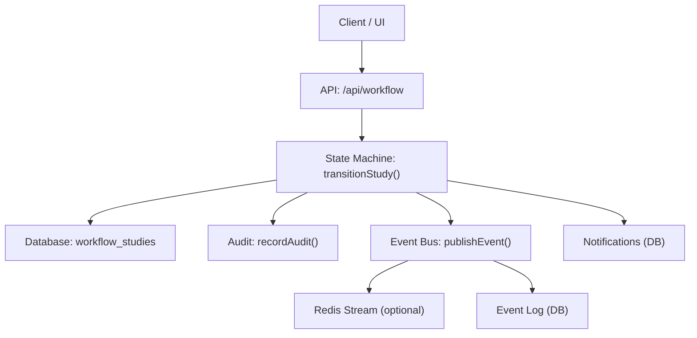
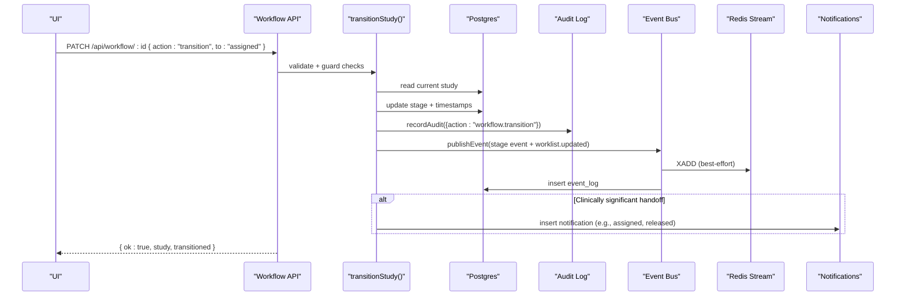
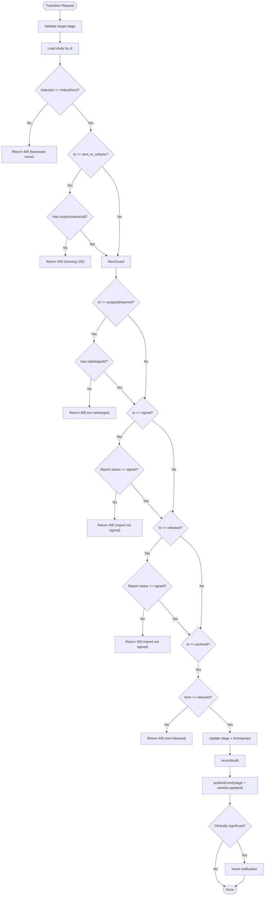
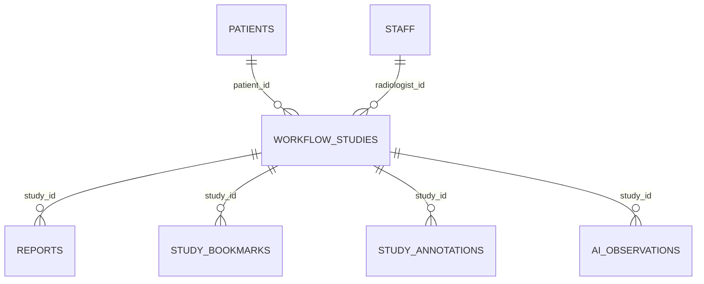
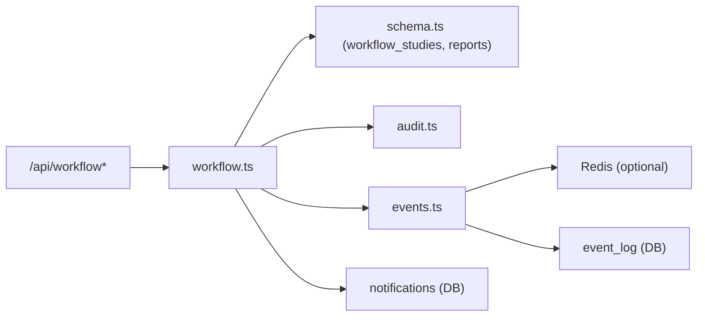

# Study Lifecycle Management

<cite>
**Referenced Files in This Document**
- [workflow.ts](file://src/lib/workflow.ts)
- [events.ts](file://src/lib/events.ts)
- [schema.ts](file://src/db/schema.ts)
- [audit.ts](file://src/lib/audit.ts)
- [route.ts (workflow)](file://src/app/api/workflow/route.ts)
- [route.ts (workflow id)](file://src/app/api/workflow/[id]/route.ts)
- [route.ts (orthanc upload)](file://src/app/api/orthanc/upload/route.ts)
- [route.ts (notifications)](file://src/app/api/notifications/route.ts)
</cite>

## Table of Contents
1. [Introduction](#introduction)
2. [Project Structure](#project-structure)
3. [Core Components](#core-components)
4. [Architecture Overview](#architecture-overview)
5. [Detailed Component Analysis](#detailed-component-analysis)
6. [Dependency Analysis](#dependency-analysis)
7. [Performance Considerations](#performance-considerations)
8. [Troubleshooting Guide](#troubleshooting-guide)
9. [Conclusion](#conclusion)

## Introduction
This document explains the complete study lifecycle management in the clinical workflow system, covering the 12-stage pipeline from Referral to Archive. It details the state machine implementation, forward-only transitions, validation rules, and the end-to-end flow for creating a study, progressing through stages, and completing the workflow. It also documents audit logging, event publishing, and notification generation at each milestone.

## Project Structure
The study lifecycle is implemented as a server-side state machine with clear separation between API routes, domain logic, persistence, events, and audit.

**Diagram sources**
- [route.ts (workflow)](file://src/app/api/workflow/route.ts)
- [route.ts (workflow id)](file://src/app/api/workflow/[id]/route.ts)
- [workflow.ts](file://src/lib/workflow.ts)
- [events.ts](file://src/lib/events.ts)
- [audit.ts](file://src/lib/audit.ts)
- [schema.ts](file://src/db/schema.ts)

**Section sources**
- [route.ts (workflow):12-47](file://src/app/api/workflow/route.ts#L12-L47)
- [route.ts (workflow):49-107](file://src/app/api/workflow/route.ts#L49-L107)
- [route.ts (workflow id):10-109](file://src/app/api/workflow/[id]/route.ts#L10-L109)
- [workflow.ts:1-246](file://src/lib/workflow.ts#L1-L246)
- [events.ts:1-158](file://src/lib/events.ts#L1-L158)
- [audit.ts:1-25](file://src/lib/audit.ts#L1-L25)
- [schema.ts:102-119](file://src/db/schema.ts#L102-L119)

## Core Components
- Workflow state machine: defines the canonical 12-stage pipeline and enforces forward-only transitions with guards.
- API endpoints: create studies and perform validated transitions.
- Event bus: publishes stage milestones and worklist updates; persists events durably.
- Audit log: records every transition and key actions.
- Notifications: auto-generated for clinically significant handoffs.

Key data model highlights:
- workflow_studies: tracks stage, timestamps, radiologist assignment, and DICOM linkage.
- reports: status gating for signed/released/archived transitions.
- event_log: durable event history.
- notifications: user-facing alerts.

**Section sources**
- [workflow.ts:29-51](file://src/lib/workflow.ts#L29-L51)
- [schema.ts:102-119](file://src/db/schema.ts#L102-L119)
- [schema.ts:166-180](file://src/db/schema.ts#L166-L180)
- [schema.ts:446-467](file://src/db/schema.ts#L446-L467)

## Architecture Overview
The system uses an event-driven architecture with a strict state machine governing study progression. All transitions are validated server-side, never client-driven. Each transition writes to the audit log, publishes events (to Redis stream if configured and always to the event_log table), and may generate notifications.

**Diagram sources**
- [route.ts (workflow id):20-80](file://src/app/api/workflow/[id]/route.ts#L20-L80)
- [workflow.ts:102-234](file://src/lib/workflow.ts#L102-L234)
- [events.ts:101-131](file://src/lib/events.ts#L101-L131)
- [audit.ts:4-24](file://src/lib/audit.ts#L4-L24)

## Detailed Component Analysis

### 12-Stage Pipeline and State Machine
The canonical pipeline order defines the only source of truth for allowed transitions. The index order enforces forward-only movement. Utilities provide stage lookup, labels, and next-stage computation.

- Stages: referral → appointment → patient arrival → study created → sent to Orthanc → radiologist assigned → study opened → AI review → report draft → report signed → report released → archive.
- Forward-only: any later stage is allowed; backward moves return 409.
- Guards:
  - sent_to_orthanc requires a valid DICOM studyInstanceUid.
  - assigned/opened require a radiologistId.
  - signed requires the report status to be signed.
  - released requires the report to be signed.
  - archived can only follow released.

**Diagram sources**
- [workflow.ts:55-81](file://src/lib/workflow.ts#L55-L81)
- [workflow.ts:102-165](file://src/lib/workflow.ts#L102-L165)
- [workflow.ts:167-234](file://src/lib/workflow.ts#L167-L234)

**Section sources**
- [workflow.ts:29-51](file://src/lib/workflow.ts#L29-L51)
- [workflow.ts:55-81](file://src/lib/workflow.ts#L55-L81)
- [workflow.ts:102-165](file://src/lib/workflow.ts#L102-L165)

### transitionStudy Function: Parameters, Guards, and Error Handling
- Purpose: The single sanctioned way to advance a study’s stage.
- Parameters:
  - studyId: string
  - to: string (target stage)
  - changedBy?: string (actor or system)
  - studyInstanceUid?: string | null (required when transitioning to sent_to_orthanc)
  - radiologistId?: string | null (required when transitioning to assigned/opened)
- Guards:
  - Unknown stage returns 400.
  - Backward transitions return 409.
  - sent_to_orthanc requires a real DICOM studyInstanceUid.
  - assigned/opened require a radiologistId.
  - signed requires report status to be signed.
  - released requires report status to be signed.
  - archived requires previous stage to be released.
- Side effects on success:
  - Updates stage and relevant timestamps (startedAt, completedAt).
  - Records audit entry.
  - Publishes stage-specific event and worklist.updated event.
  - Inserts notifications for assigned and released.
- Return value: TransitionResult indicating ok, status codes, error messages, and whether a transition occurred.

**Section sources**
- [workflow.ts:83-91](file://src/lib/workflow.ts#L83-L91)
- [workflow.ts:102-165](file://src/lib/workflow.ts#L102-L165)
- [workflow.ts:167-234](file://src/lib/workflow.ts#L167-L234)

### API Endpoints for Study Creation and Transitions
- POST /api/workflow: Creates a new study at stage referral, generates accession number, records audit, and publishes referral.received and worklist.updated events.
- PATCH /api/workflow/:id: Supports:
  - action: "transition" with to: <stage>
  - legacy alias: stage: <stage>, studyInstanceUid: ...
  - action: "assign" with radiologistId (moves to assigned unless already past that stage)
  - plain field updates (priority, radiologistId, etc.) without changing stage

These endpoints enforce validation before calling transitionStudy and handle errors consistently.

**Section sources**
- [route.ts (workflow):49-107](file://src/app/api/workflow/route.ts#L49-L107)
- [route.ts (workflow id):10-109](file://src/app/api/workflow/[id]/route.ts#L10-L109)

### Orthanc Integration and DICOM Upload
- POST /api/orthanc/upload: Accepts DICOM files, forwards to Orthanc via STOW-RS, logs audit, and publishes study.uploaded event.
- Storage commitment endpoint supports verification of stored instances for compliance.

While upload does not directly change the workflow stage, it provides the DICOM studyInstanceUid required to transition to sent_to_orthanc.

**Section sources**
- [route.ts (orthanc upload):1-78](file://src/app/api/orthanc/upload/route.ts#L1-L78)

### Event Publishing and Durable Logging
- publishEvent writes to Redis Streams (best-effort) and always persists to event_log.
- EVENT_TYPES enumerates all domain events used across the system, including stage milestones and worklist updates.
- listEvents and eventCounts support querying recent activity and counts.

**Section sources**
- [events.ts:18-60](file://src/lib/events.ts#L18-L60)
- [events.ts:101-131](file://src/lib/events.ts#L101-L131)
- [events.ts:133-157](file://src/lib/events.ts#L133-L157)

### Audit Logging
- recordAudit inserts immutable entries capturing user, action, module, entity type/id, and details.
- Used for workflow transitions, creation, reassignment, and other key actions.

**Section sources**
- [audit.ts:4-24](file://src/lib/audit.ts#L4-L24)
- [route.ts (workflow):80-99](file://src/app/api/workflow/route.ts#L80-L99)
- [route.ts (workflow id):47-59](file://src/app/api/workflow/[id]/route.ts#L47-L59)

### Notification Generation
- On assigned: creates a notification for the radiologist (or “all” if none specified).
- On released: creates a global notification about report release.
- Notifications are persisted and can be queried via the notifications API.

**Section sources**
- [workflow.ts:206-231](file://src/lib/workflow.ts#L206-L231)
- [route.ts (notifications):35-56](file://src/app/api/notifications/route.ts#L35-L56)

### Data Model Relationships

**Diagram sources**
- [schema.ts:102-119](file://src/db/schema.ts#L102-L119)
- [schema.ts:166-180](file://src/db/schema.ts#L166-L180)
- [schema.ts:423-444](file://src/db/schema.ts#L423-L444)
- [schema.ts:358-380](file://src/db/schema.ts#L358-L380)

## Dependency Analysis
- API routes depend on:
  - workflow.ts for state machine logic and validation.
  - events.ts for publishing stage milestones and worklist updates.
  - audit.ts for immutable audit trails.
  - schema.ts for database entities and relationships.
- Events decouple modules: downstream consumers react to stage milestones without tight coupling.
- Notifications are optional side effects and do not block transitions.

**Diagram sources**
- [route.ts (workflow):1-107](file://src/app/api/workflow/route.ts#L1-L107)
- [route.ts (workflow id):1-109](file://src/app/api/workflow/[id]/route.ts#L1-L109)
- [workflow.ts:1-246](file://src/lib/workflow.ts#L1-L246)
- [events.ts:1-158](file://src/lib/events.ts#L1-L158)
- [audit.ts:1-25](file://src/lib/audit.ts#L1-L25)
- [schema.ts:102-180](file://src/db/schema.ts#L102-L180)

**Section sources**
- [workflow.ts:1-246](file://src/lib/workflow.ts#L1-L246)
- [events.ts:1-158](file://src/lib/events.ts#L1-L158)
- [audit.ts:1-25](file://src/lib/audit.ts#L1-L25)
- [schema.ts:102-180](file://src/db/schema.ts#L102-L180)

## Performance Considerations
- Event publishing is best-effort to Redis; failures do not block transitions because event_log ensures durability.
- Database writes are minimal per transition (single update plus audit/event/notifications).
- Avoid unnecessary retries on Redis; backoff is built-in to prevent storms.
- Batch operations are not used here; keep transitions atomic and small for consistency.

[No sources needed since this section provides general guidance]

## Troubleshooting Guide
Common issues and resolutions:
- Invalid stage: Ensure target stage is one of the defined keys; otherwise expect 400.
- Backward transition: Cannot move to earlier stages; expect 409.
- Missing DICOM UID: To reach sent_to_orthanc, ensure studyInstanceUid exists or is provided; otherwise 400.
- Missing radiologist: For assigned/opened, ensure radiologistId is set; otherwise 400.
- Report signing gate: To sign/release/archive, ensure report status is signed; otherwise 400.
- Redis unavailable: Events still persist to event_log; check event_log for missing stream entries.
- Notifications not delivered: Notification insertion failures do not block transitions; check notifications table.

**Section sources**
- [workflow.ts:111-165](file://src/lib/workflow.ts#L111-L165)
- [events.ts:101-131](file://src/lib/events.ts#L101-L131)

## Conclusion
The study lifecycle is enforced by a robust, forward-only state machine with explicit guards, comprehensive audit logging, durable event publishing, and targeted notifications. The API surface exposes safe, validated transitions while keeping client-side state juggling out of the picture. This design ensures traceability, reliability, and extensibility across the clinical workflow from referral to archive.