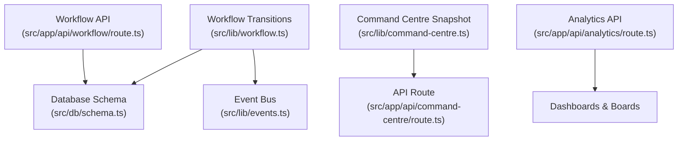
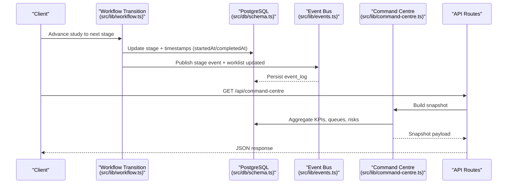
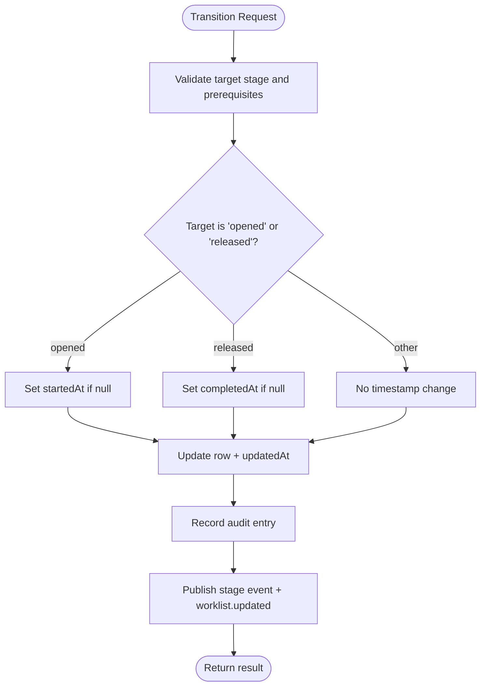
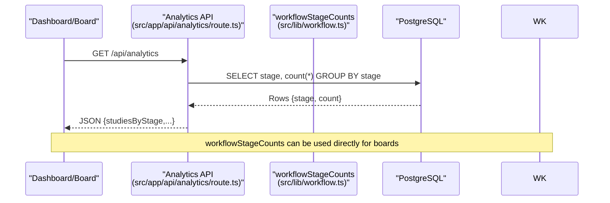
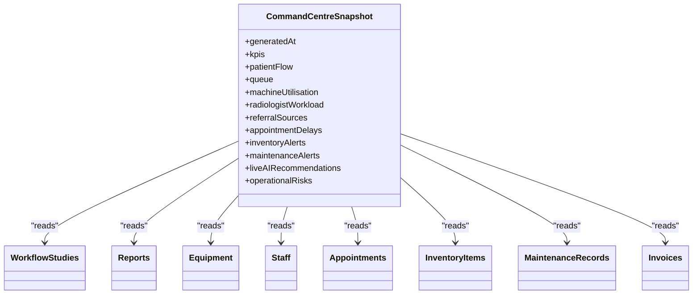
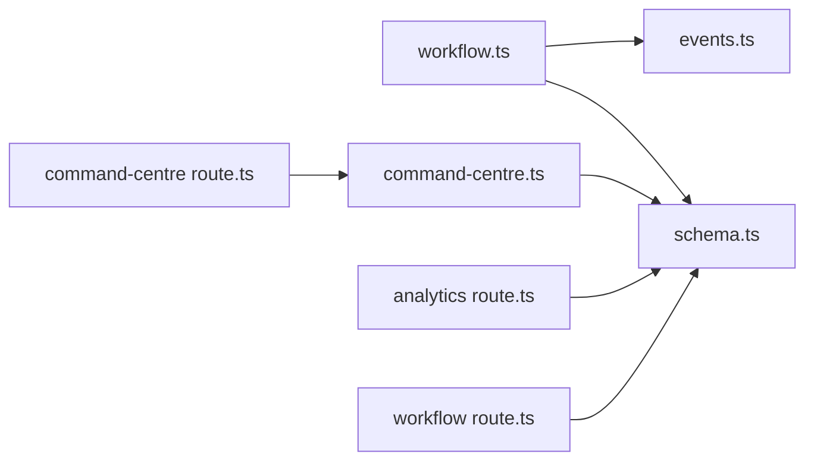

# Turnaround Time Monitoring

<cite>
**Referenced Files in This Document**
- [workflow.ts](file://src/lib/workflow.ts)
- [schema.ts](file://src/db/schema.ts)
- [events.ts](file://src/lib/events.ts)
- [command-centre.ts](file://src/lib/command-centre.ts)
- [route.ts (analytics)](file://src/app/api/analytics/route.ts)
- [route.ts (command-centre)](file://src/app/api/command-centre/route.ts)
- [route.ts (workflow)](file://src/app/api/workflow/route.ts)
</cite>

## Table of Contents
1. [Introduction](#introduction)
2. [Project Structure](#project-structure)
3. [Core Components](#core-components)
4. [Architecture Overview](#architecture-overview)
5. [Detailed Component Analysis](#detailed-component-analysis)
6. [Dependency Analysis](#dependency-analysis)
7. [Performance Considerations](#performance-considerations)
8. [Troubleshooting Guide](#troubleshooting-guide)
9. [Conclusion](#conclusion)
10. [Appendices](#appendices)

## Introduction
This document explains how turnaround time (TAT) monitoring and performance tracking are implemented across the clinical workflow. It covers automatic timestamp capture at key milestones, real-time board metrics via workflow stage counts, bottleneck detection signals, SLA monitoring concepts, alerting for delayed studies, and integration with the operations command centre for live visibility into workflow performance.

## Project Structure
The TAT system is built around a server-side state machine that governs study progression, timestamps, events, and reporting. The main pieces are:
- Workflow state machine and transitions that capture lifecycle timestamps
- Database schema defining study-level timestamps and related entities
- Event bus that publishes milestone events for downstream consumers
- Command centre snapshot API that aggregates operational KPIs and risks
- Analytics endpoints that expose counts by stage and modality for dashboards

**Diagram sources**
- [workflow.ts:93-173](file://src/lib/workflow.ts#L93-L173)
- [schema.ts:102-119](file://src/db/schema.ts#L102-L119)
- [events.ts:101-131](file://src/lib/events.ts#L101-L131)
- [command-centre.ts:54-206](file://src/lib/command-centre.ts#L54-L206)
- [route.ts (command-centre):6-14](file://src/app/api/command-centre/route.ts#L6-L14)
- [route.ts (analytics):6-53](file://src/app/api/analytics/route.ts#L6-L53)
- [route.ts (workflow):12-47](file://src/app/api/workflow/route.ts#L12-L47)

**Section sources**
- [workflow.ts:1-246](file://src/lib/workflow.ts#L1-L246)
- [schema.ts:102-119](file://src/db/schema.ts#L102-L119)
- [events.ts:18-60](file://src/lib/events.ts#L18-L60)
- [command-centre.ts:27-52](file://src/lib/command-centre.ts#L27-L52)
- [route.ts (analytics):6-53](file://src/app/api/analytics/route.ts#L6-L53)
- [route.ts (command-centre):6-14](file://src/app/api/command-centre/route.ts#L6-L14)
- [route.ts (workflow):12-47](file://src/app/api/workflow/route.ts#L12-L47)

## Core Components
- Workflow state machine: Enforces forward-only transitions, validates prerequisites, records audit entries, emits events, and captures milestone timestamps.
- Timestamp fields: startedAt when a study is opened; completedAt when a report is released.
- Real-time board metrics: workflowStageCounts returns current counts per pipeline stage for boards and dashboards.
- Command centre snapshot: Aggregates KPIs, patient flow, queues, workload, delays, inventory/maintenance alerts, and operational risks.
- Analytics API: Provides counts by stage and modality to power dashboards.

Key responsibilities:
- Capture accurate lifecycle timestamps at defined milestones
- Provide reliable stage counts for real-time visualization
- Surface bottlenecks and risks to operators
- Expose data through APIs for dashboards and external systems

**Section sources**
- [workflow.ts:93-173](file://src/lib/workflow.ts#L93-L173)
- [workflow.ts:237-243](file://src/lib/workflow.ts#L237-L243)
- [command-centre.ts:54-206](file://src/lib/command-centre.ts#L54-L206)
- [route.ts (analytics):6-53](file://src/app/api/analytics/route.ts#L6-L53)

## Architecture Overview
The system uses an event-driven architecture with durable persistence. Every transition updates the database, writes an audit log, publishes events (to Redis Streams if available), and persists events to the event_log table. Dashboards and the command centre read from the database to present real-time insights.

**Diagram sources**
- [workflow.ts:167-204](file://src/lib/workflow.ts#L167-L204)
- [events.ts:101-131](file://src/lib/events.ts#L101-L131)
- [command-centre.ts:54-206](file://src/lib/command-centre.ts#L54-L206)
- [route.ts (command-centre):6-14](file://src/app/api/command-centre/route.ts#L6-L14)

## Detailed Component Analysis

### Timestamp Capture and Turnaround Time Calculation
- Milestones:
  - startedAt is set when the study moves to the “opened” stage and was not already set.
  - completedAt is set when the study moves to the “released” stage and was not already set.
- These timestamps enable calculation of:
  - End-to-end TAT: difference between completedAt and startedAt for completed studies.
  - Stage-level dwell times: differences between consecutive stage transitions using audit/event logs or derived queries.
- Data model:
  - workflow_studies includes startedAt and completedAt columns alongside stage, priority, and identifiers.

**Diagram sources**
- [workflow.ts:167-173](file://src/lib/workflow.ts#L167-L173)
- [workflow.ts:189-204](file://src/lib/workflow.ts#L189-L204)

**Section sources**
- [workflow.ts:167-173](file://src/lib/workflow.ts#L167-L173)
- [schema.ts:102-119](file://src/db/schema.ts#L102-L119)

### Real-Time Board Metrics: workflowStageCounts
- Purpose: Provide counts of studies per pipeline stage for boards and dashboards.
- Implementation: Groups workflow_studies by stage and returns counts.
- Usage: Feeds the patient flow pipeline visualization and command centre patientFlow section.

**Diagram sources**
- [route.ts (analytics):27-33](file://src/app/api/analytics/route.ts#L27-L33)
- [workflow.ts:237-243](file://src/lib/workflow.ts#L237-L243)

**Section sources**
- [workflow.ts:237-243](file://src/lib/workflow.ts#L237-L243)
- [route.ts (analytics):27-33](file://src/app/api/analytics/route.ts#L27-L33)

### Command Centre Integration for Real-Time Visibility
- The command centre snapshot aggregates:
  - KPIs: patients today, appointments, checked-in, active studies, pending reports, emergency cases, revenue, equipment status.
  - Patient flow: counts by workflow stage.
  - Queues and utilization: waiting/in-progress per equipment.
  - Radiologist workload: assigned and signed today.
  - Appointment delays: identifies late scheduled appointments and computes delay minutes.
  - Inventory and maintenance alerts.
  - Operational risks: offline machines, low stock, appointment delays, pending reports, claims.
- API exposure: GET /api/command-centre returns the full snapshot.

**Diagram sources**
- [command-centre.ts:27-52](file://src/lib/command-centre.ts#L27-L52)
- [command-centre.ts:54-206](file://src/lib/command-centre.ts#L54-L206)

**Section sources**
- [command-centre.ts:54-206](file://src/lib/command-centre.ts#L54-L206)
- [route.ts (command-centre):6-14](file://src/app/api/command-centre/route.ts#L6-L14)

### Bottleneck Detection Signals
- Indicators surfaced by the command centre:
  - High counts in specific workflow stages (via patientFlow).
  - Pending reports count (may breach TAT).
  - Appointment delays (late scheduled appointments).
  - Equipment offline or in maintenance reducing throughput.
  - Low inventory items limiting capacity.
- These signals help identify where delays accumulate and guide interventions.

**Section sources**
- [command-centre.ts:154-165](file://src/lib/command-centre.ts#L154-L165)
- [command-centre.ts:122-132](file://src/lib/command-centre.ts#L122-L132)

### SLA Monitoring and Alerting Concepts
- SLA monitoring can be implemented by:
  - Defining target TAT thresholds per modality/priority.
  - Computing elapsed time since startedAt for open studies and comparing against thresholds.
  - Flagging studies that exceed thresholds as SLA breaches.
- Alerting pathways:
  - Use the existing notification mechanism to surface warnings for delayed studies.
  - Leverage the operational risks section to highlight potential TAT breaches due to pending reports or equipment issues.
  - Integrate with n8n workflows (as referenced in agent responses) to trigger notifications or reassignments.

Note: The repository provides the foundational data and mechanisms (timestamps, events, notifications, command centre risks) to implement SLA checks and alerts.

**Section sources**
- [workflow.ts:167-173](file://src/lib/workflow.ts#L167-L173)
- [command-centre.ts:154-165](file://src/lib/command-centre.ts#L154-L165)
- [events.ts:101-131](file://src/lib/events.ts#L101-L131)

### Performance Reporting and Dashboards
- Analytics endpoint exposes:
  - Counts by workflow stage and modality.
  - Equipment status distribution.
  - Low stock item counts.
- Command centre snapshot provides:
  - Live KPIs and patient flow.
  - Radiologist workload and signed counts.
  - Queue lengths and utilization rates.
- These outputs feed dashboards and operational boards for real-time visibility.

**Section sources**
- [route.ts (analytics):6-53](file://src/app/api/analytics/route.ts#L6-L53)
- [command-centre.ts:54-206](file://src/lib/command-centre.ts#L54-L206)

## Dependency Analysis
- Workflow transitions depend on:
  - Database schema for workflow_studies, reports, staff, and audit/event tables.
  - Event bus for publishing stage events and worklist updates.
- Command centre depends on multiple tables to aggregate operational metrics.
- Analytics and command centre APIs provide read paths for dashboards.

**Diagram sources**
- [workflow.ts:23-27](file://src/lib/workflow.ts#L23-L27)
- [events.ts:10-13](file://src/lib/events.ts#L10-L13)
- [command-centre.ts:10-25](file://src/lib/command-centre.ts#L10-L25)
- [route.ts (analytics):1-4](file://src/app/api/analytics/route.ts#L1-L4)
- [route.ts (command-centre):1-2](file://src/app/api/command-centre/route.ts#L1-L2)
- [route.ts (workflow):1-7](file://src/app/api/workflow/route.ts#L1-L7)

**Section sources**
- [workflow.ts:23-27](file://src/lib/workflow.ts#L23-L27)
- [command-centre.ts:10-25](file://src/lib/command-centre.ts#L10-L25)
- [events.ts:10-13](file://src/lib/events.ts#L10-L13)

## Performance Considerations
- Efficient aggregation:
  - Use SQL grouping for stage counts and KPIs to minimize application logic overhead.
  - Cache frequently accessed snapshots if needed behind short TTLs.
- Event bus resilience:
  - Redis Streams are best-effort; event_log ensures durability even if Redis is down.
- Timestamp accuracy:
  - Ensure transitions only set timestamps once (guarded by null checks) to avoid skew.
- Query optimization:
  - Index workflow_studies.stage, priority, startedAt, completedAt for common filters and aggregations.
  - Index reports.status and signedAt for workload and pending report queries.

[No sources needed since this section provides general guidance]

## Troubleshooting Guide
- If TAT appears incorrect:
  - Verify that transitions to “opened” and “released” occur and that startedAt/completedAt are set only once.
  - Check audit logs and event_log for missing transitions or failed event publishing.
- If dashboards show stale data:
  - Confirm analytics and command centre endpoints are called regularly.
  - Validate database connectivity and query performance.
- If alerts are not firing:
  - Ensure notifications table receives entries and that downstream consumers process them.
  - Review operational risks generation in the command centre snapshot.

**Section sources**
- [workflow.ts:167-173](file://src/lib/workflow.ts#L167-L173)
- [events.ts:101-131](file://src/lib/events.ts#L101-L131)
- [command-centre.ts:154-165](file://src/lib/command-centre.ts#L154-L165)

## Conclusion
The platform captures critical timestamps at workflow milestones and exposes rich operational data through APIs and a command centre snapshot. These foundations support TAT calculations, bottleneck detection, SLA monitoring, and real-time dashboards. With the provided data model, event bus, and aggregation functions, teams can implement robust performance tracking and alerting tailored to their SLAs and operational needs.

[No sources needed since this section summarizes without analyzing specific files]

## Appendices

### Example: Turnaround Time Calculations
- End-to-end TAT: completedAt minus startedAt for released studies.
- Stage dwell time: compute differences between consecutive stage transitions using audit/event logs or derived queries.
- Priority adjustments: weight TAT targets differently for routine vs stat studies.

[No sources needed since this section provides conceptual examples]

### Example: Bottleneck Detection Algorithm
- Identify stages with disproportionate counts relative to throughput.
- Cross-reference with equipment status and inventory alerts to attribute causes.
- Surface findings in operational risks and recommend actions (e.g., reassign radiologists, address equipment downtime).

[No sources needed since this section provides conceptual examples]

### Example: SLA Monitoring and Alerting
- Define thresholds per modality/priority.
- On each tick, compute elapsed time for open studies and compare to thresholds.
- Emit notifications for breaches and update operational risks accordingly.

[No sources needed since this section provides conceptual examples]