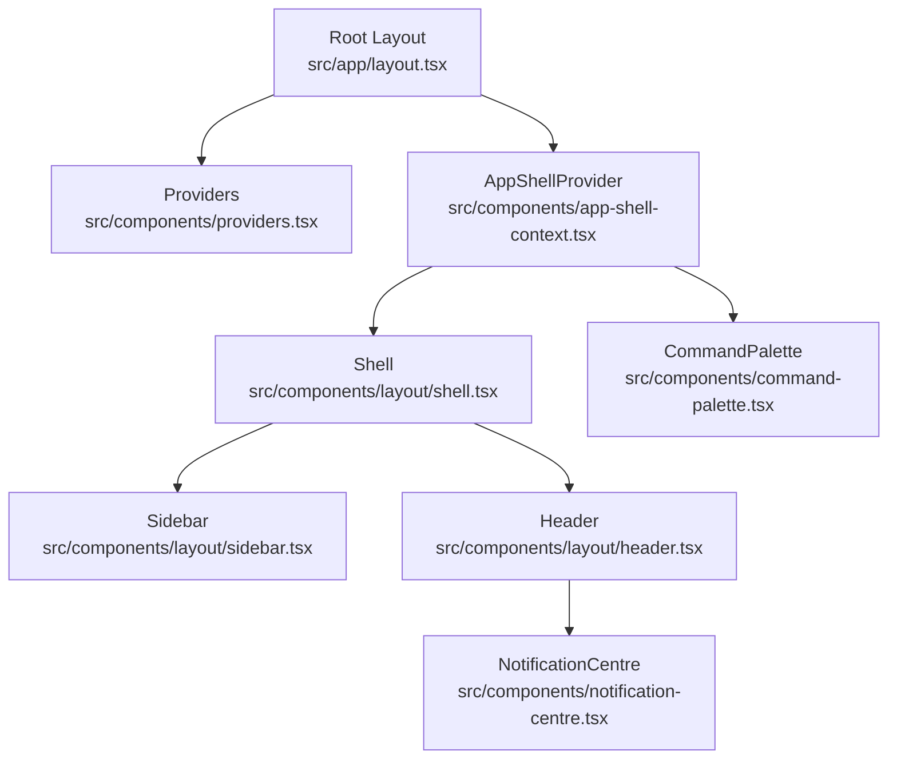
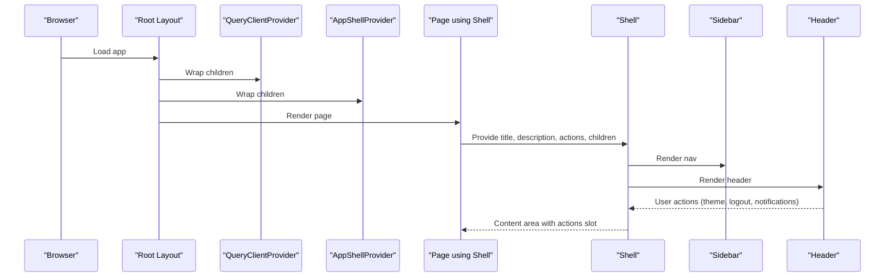
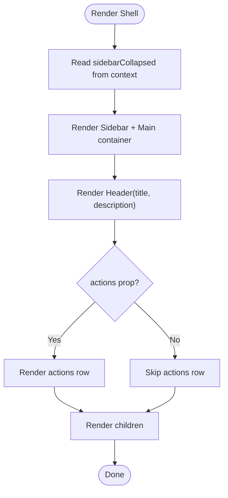
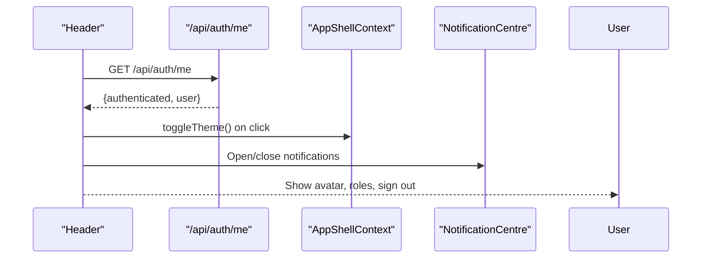
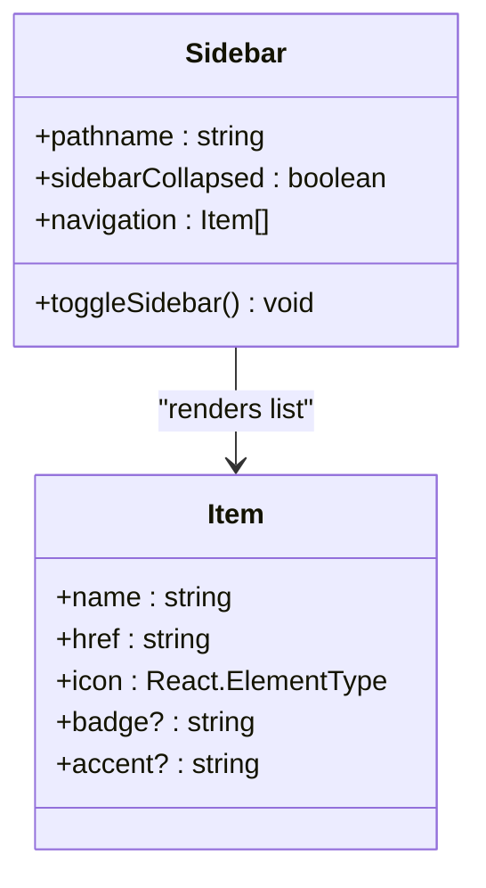
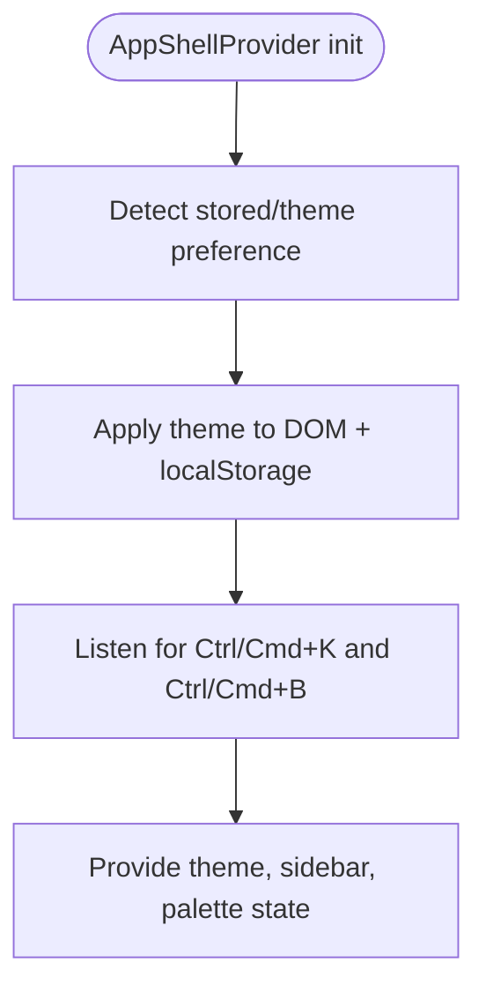
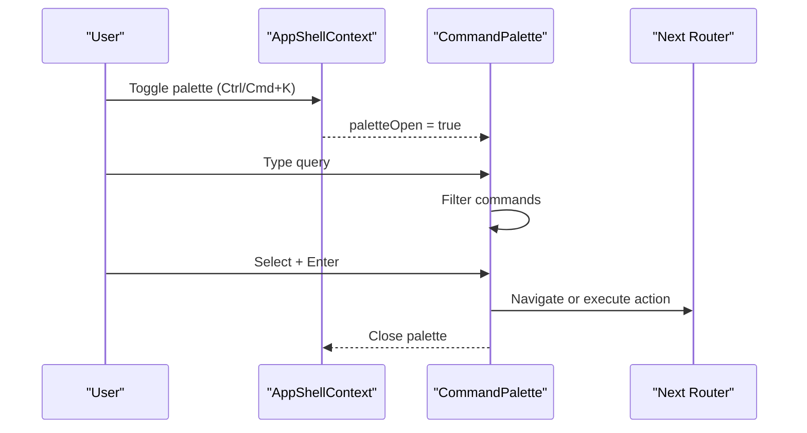
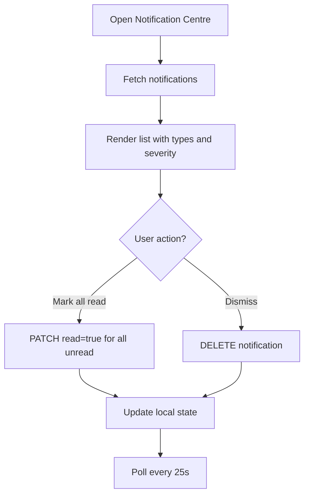
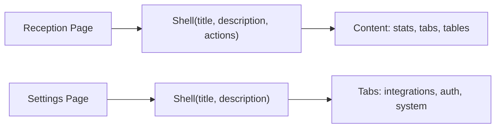
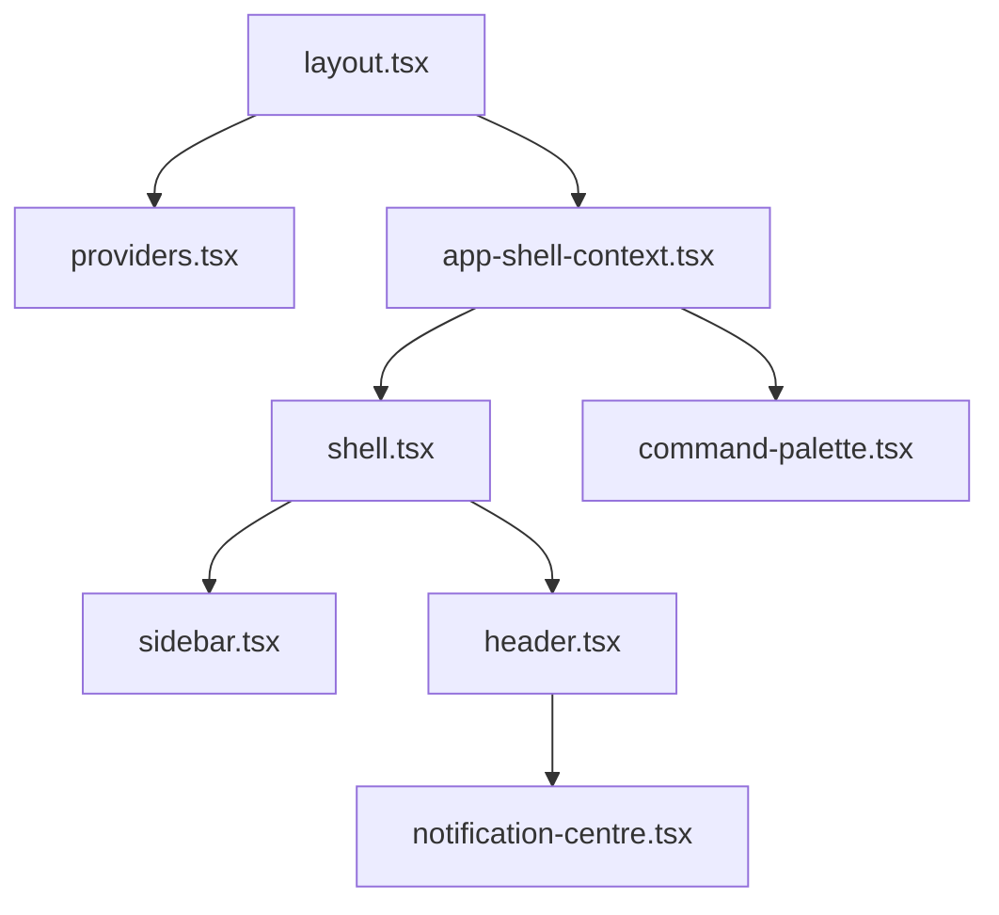

# Application Shell & Layout

<cite>
**Referenced Files in This Document**
- [src/app/layout.tsx](file://src/app/layout.tsx)
- [src/components/providers.tsx](file://src/components/providers.tsx)
- [src/components/app-shell-context.tsx](file://src/components/app-shell-context.tsx)
- [src/components/layout/shell.tsx](file://src/components/layout/shell.tsx)
- [src/components/layout/header.tsx](file://src/components/layout/header.tsx)
- [src/components/layout/sidebar.tsx](file://src/components/layout/sidebar.tsx)
- [src/components/command-palette.tsx](file://src/components/command-palette.tsx)
- [src/components/notification-centre.tsx](file://src/components/notification-centre.tsx)
- [src/app/reception/page.tsx](file://src/app/reception/page.tsx)
- [src/app/settings/page.tsx](file://src/app/settings/page.tsx)
</cite>

## Table of Contents
1. [Introduction](#introduction)
2. [Project Structure](#project-structure)
3. [Core Components](#core-components)
4. [Architecture Overview](#architecture-overview)
5. [Detailed Component Analysis](#detailed-component-analysis)
6. [Dependency Analysis](#dependency-analysis)
7. [Performance Considerations](#performance-considerations)
8. [Troubleshooting Guide](#troubleshooting-guide)
9. [Conclusion](#conclusion)
10. [Appendices](#appendices)

## Introduction
This document explains the GeraldOS application shell and layout system. It covers the main application wrapper that provides a consistent structure across pages, the header with navigation and user controls, the sidebar with dynamic menu generation, providers for context and global state, responsive design patterns, accessibility considerations, layout composition patterns, and how to extend the shell with custom features and third-party components.

## Project Structure
The shell is composed of:
- Root layout that wires up providers and global UI (command palette).
- AppShellProvider that manages theme, sidebar state, and keyboard shortcuts.
- Shell component that composes Sidebar, Header, and page content.
- Header with authentication-aware user menu, theme toggle, command palette trigger, and notifications.
- Sidebar with static navigation items and active-state detection.
- Command Palette and Notification Centre as global overlays.

**Diagram sources**
- [src/app/layout.tsx:13-22](file://src/app/layout.tsx#L13-L22)
- [src/components/providers.tsx:6-22](file://src/components/providers.tsx#L6-L22)
- [src/components/app-shell-context.tsx:25-69](file://src/components/app-shell-context.tsx#L25-L69)
- [src/components/layout/shell.tsx:16-35](file://src/components/layout/shell.tsx#L16-L35)
- [src/components/layout/header.tsx:16-94](file://src/components/layout/header.tsx#L16-L94)
- [src/components/layout/sidebar.tsx:54-143](file://src/components/layout/sidebar.tsx#L54-L143)
- [src/components/command-palette.tsx:37-152](file://src/components/command-palette.tsx#L37-L152)
- [src/components/notification-centre.tsx:25-129](file://src/components/notification-centre.tsx#L25-L129)

**Section sources**
- [src/app/layout.tsx:1-27](file://src/app/layout.tsx#L1-L27)
- [src/components/providers.tsx:1-25](file://src/components/providers.tsx#L1-L25)
- [src/components/app-shell-context.tsx:1-77](file://src/components/app-shell-context.tsx#L1-L77)

## Core Components
- Shell: Wraps each page with consistent Sidebar + Header + main content area. Accepts title, description, optional actions, and children.
- Header: Displays page title/description, command palette trigger, theme toggle, notification centre, and user menu or sign-in link.
- Sidebar: Fixed left navigation with logo, menu items, active state based on current route, collapse/expand toggle, and footer branding.
- Providers: TanStack Query client setup for data fetching.
- AppShellProvider: Global state for theme, sidebar collapsed state, and command palette open state; persists theme preference and applies OS preference.
- CommandPalette: Global overlay for quick navigation and actions, triggered by Ctrl/Cmd+K.
- NotificationCentre: Dropdown panel showing recent notifications with read/unread states and periodic refresh.

**Section sources**
- [src/components/layout/shell.tsx:9-35](file://src/components/layout/shell.tsx#L9-L35)
- [src/components/layout/header.tsx:10-94](file://src/components/layout/header.tsx#L10-L94)
- [src/components/layout/sidebar.tsx:30-143](file://src/components/layout/sidebar.tsx#L30-L143)
- [src/components/providers.tsx:6-22](file://src/components/providers.tsx#L6-L22)
- [src/components/app-shell-context.tsx:5-77](file://src/components/app-shell-context.tsx#L5-L77)
- [src/components/command-palette.tsx:28-152](file://src/components/command-palette.tsx#L28-L152)
- [src/components/notification-centre.tsx:7-129](file://src/components/notification-centre.tsx#L7-L129)

## Architecture Overview
The root layout wraps all pages with Providers and AppShellProvider. Pages that need the standard app chrome import Shell and render their content inside it. The Shell renders Sidebar and Header once per page, ensuring consistent layout and behavior. Global overlays like CommandPalette and NotificationCentre are rendered at the root level and controlled via shared context.

**Diagram sources**
- [src/app/layout.tsx:13-22](file://src/app/layout.tsx#L13-L22)
- [src/components/providers.tsx:6-22](file://src/components/providers.tsx#L6-L22)
- [src/components/app-shell-context.tsx:25-69](file://src/components/app-shell-context.tsx#L25-L69)
- [src/components/layout/shell.tsx:16-35](file://src/components/layout/shell.tsx#L16-L35)
- [src/components/layout/header.tsx:16-94](file://src/components/layout/header.tsx#L16-L94)
- [src/components/layout/sidebar.tsx:54-143](file://src/components/layout/sidebar.tsx#L54-L143)

## Detailed Component Analysis

### Shell: Base Layout Wrapper
- Purpose: Provides consistent chrome (sidebar, header) and a content area with an optional actions bar.
- Props: title, description, children, actions.
- Behavior: Reads sidebarCollapsed from context to adjust main content margin; renders Header with title/description; renders actions slot above children when provided.

**Diagram sources**
- [src/components/layout/shell.tsx:16-35](file://src/components/layout/shell.tsx#L16-L35)

**Section sources**
- [src/components/layout/shell.tsx:9-35](file://src/components/layout/shell.tsx#L9-L35)

### Header: Navigation, User Menu, Global Actions
- Displays page title and optional description.
- Provides:
  - Command palette trigger (Ctrl/Cmd+K hint).
  - Theme toggle (light/dark) via context.
  - Notification centre dropdown.
  - User menu when authenticated: initials avatar, name, roles badges, sign-out link.
  - Sign-in link when not authenticated.
- Fetches current user info from /api/auth/me on mount.

**Diagram sources**
- [src/components/layout/header.tsx:16-94](file://src/components/layout/header.tsx#L16-L94)
- [src/components/notification-centre.tsx:25-129](file://src/components/notification-centre.tsx#L25-L129)
- [src/components/app-shell-context.tsx:25-69](file://src/components/app-shell-context.tsx#L25-L69)

**Section sources**
- [src/components/layout/header.tsx:10-94](file://src/components/layout/header.tsx#L10-L94)

### Sidebar: Dynamic Menu Generation and Active State
- Renders a fixed left navigation with logo, menu items, and footer.
- Navigation items are defined centrally with name, href, icon, optional badge, and accent color.
- Active item detection uses current pathname to match exact or prefix routes.
- Supports collapse/expand via context; shows/hides labels and toggles icons accordingly.
- Footer includes branding and collapse/expand buttons with accessible titles.

**Diagram sources**
- [src/components/layout/sidebar.tsx:30-143](file://src/components/layout/sidebar.tsx#L30-L143)

**Section sources**
- [src/components/layout/sidebar.tsx:30-143](file://src/components/layout/sidebar.tsx#L30-L143)

### Providers and Context: Theme, Query Client, Global State
- Providers: Initializes TanStack Query client with default options for caching and refetch behavior.
- AppShellProvider:
  - Manages theme (light/dark), persisted to localStorage and applied to document root.
  - Manages sidebar collapsed state and command palette open state.
  - Registers global keyboard shortcuts: Ctrl/Cmd+K toggles palette; Ctrl/Cmd+B toggles sidebar.
  - Exposes useAppShell hook for consuming state and actions.

**Diagram sources**
- [src/components/app-shell-context.tsx:18-69](file://src/components/app-shell-context.tsx#L18-L69)
- [src/components/providers.tsx:6-22](file://src/components/providers.tsx#L6-L22)

**Section sources**
- [src/components/providers.tsx:1-25](file://src/components/providers.tsx#L1-L25)
- [src/components/app-shell-context.tsx:1-77](file://src/components/app-shell-context.tsx#L1-L77)

### Command Palette: Global Search and Actions
- Triggered by Ctrl/Cmd+K or header button.
- Groups commands into categories (e.g., Navigate, Actions).
- Filters commands by label, hint, and group.
- Supports keyboard navigation (arrow keys, Enter, Escape).
- Integrates with router for navigation and context for theme toggle.

**Diagram sources**
- [src/components/command-palette.tsx:37-152](file://src/components/command-palette.tsx#L37-L152)
- [src/components/app-shell-context.tsx:47-61](file://src/components/app-shell-context.tsx#L47-L61)

**Section sources**
- [src/components/command-palette.tsx:28-152](file://src/components/command-palette.tsx#L28-L152)

### Notification Centre: Live Updates and Management
- Opens a dropdown panel listing recent notifications.
- Periodically fetches updates from /api/notifications.
- Supports marking all as read and dismissing individual notifications.
- Shows unread count badge and timestamps.

**Diagram sources**
- [src/components/notification-centre.tsx:25-129](file://src/components/notification-centre.tsx#L25-L129)

**Section sources**
- [src/components/notification-centre.tsx:7-129](file://src/components/notification-centre.tsx#L7-L129)

### Page Composition Examples
- Reception page demonstrates wrapping content in Shell with title, description, and actions slot for a dialog-triggered action.
- Settings page demonstrates multiple tabs within Shell for configuration views.

**Diagram sources**
- [src/app/reception/page.tsx:114-341](file://src/app/reception/page.tsx#L114-L341)
- [src/app/settings/page.tsx:69-248](file://src/app/settings/page.tsx#L69-L248)

**Section sources**
- [src/app/reception/page.tsx:114-341](file://src/app/reception/page.tsx#L114-L341)
- [src/app/settings/page.tsx:69-248](file://src/app/settings/page.tsx#L69-L248)

## Dependency Analysis
- Root layout depends on Providers and AppShellProvider to supply global state and data fetching capabilities.
- Shell depends on Sidebar and Header, which both consume AppShellContext.
- Header depends on NotificationCentre and uses AppShellContext for theme control.
- Sidebar depends on AppShellContext for collapse state and uses Next.js routing utilities for active state.
- CommandPalette depends on AppShellContext for palette visibility and theme toggle.

**Diagram sources**
- [src/app/layout.tsx:13-22](file://src/app/layout.tsx#L13-L22)
- [src/components/providers.tsx:6-22](file://src/components/providers.tsx#L6-L22)
- [src/components/app-shell-context.tsx:25-69](file://src/components/app-shell-context.tsx#L25-L69)
- [src/components/layout/shell.tsx:16-35](file://src/components/layout/shell.tsx#L16-L35)
- [src/components/layout/header.tsx:16-94](file://src/components/layout/header.tsx#L16-L94)
- [src/components/layout/sidebar.tsx:54-143](file://src/components/layout/sidebar.tsx#L54-L143)
- [src/components/command-palette.tsx:37-152](file://src/components/command-palette.tsx#L37-L152)
- [src/components/notification-centre.tsx:25-129](file://src/components/notification-centre.tsx#L25-L129)

**Section sources**
- [src/app/layout.tsx:1-27](file://src/app/layout.tsx#L1-L27)
- [src/components/app-shell-context.tsx:1-77](file://src/components/app-shell-context.tsx#L1-L77)

## Performance Considerations
- Theme persistence avoids re-applying preferences on every render by storing in localStorage and applying once on mount.
- QueryClient default options reduce unnecessary refetches and cache stale data appropriately.
- NotificationCentre polls at a reasonable interval; consider debouncing or server-sent events for high-frequency updates.
- Sidebar active-state computation is lightweight but can be memoized if the navigation list grows significantly.
- CommandPalette filters and groups commands using useMemo to avoid recomputation on every keystroke.

[No sources needed since this section provides general guidance]

## Troubleshooting Guide
- Theme not persisting: Ensure AppShellProvider runs in a client component and that localStorage is available. Verify document class toggling and colorScheme assignment.
- Sidebar not collapsing: Confirm useAppShell is used within AppShellProvider and that toggleSidebar is called from Sidebar footer buttons.
- Command palette not opening: Check global keydown listener registration and ensure no other handler prevents default for Ctrl/Cmd+K.
- Notifications not updating: Verify /api/notifications endpoint returns expected shape and that polling timer is active.
- Header user menu missing: Confirm /api/auth/me returns authenticated state and user object; handle errors gracefully.

**Section sources**
- [src/components/app-shell-context.tsx:18-69](file://src/components/app-shell-context.tsx#L18-L69)
- [src/components/layout/sidebar.tsx:109-143](file://src/components/layout/sidebar.tsx#L109-L143)
- [src/components/command-palette.tsx:44-50](file://src/components/command-palette.tsx#L44-L50)
- [src/components/notification-centre.tsx:32-52](file://src/components/notification-centre.tsx#L32-L52)
- [src/components/layout/header.tsx:20-25](file://src/components/layout/header.tsx#L20-L25)

## Conclusion
GeraldOS’s shell provides a robust, reusable foundation for consistent page layouts, global interactions, and cross-cutting concerns like theming and notifications. Pages wrap content in Shell to inherit chrome and actions slots, while global overlays and state are managed through AppShellProvider. The system supports responsive design, keyboard shortcuts, and extensibility for adding new features and third-party integrations.

[No sources needed since this section summarizes without analyzing specific files]

## Appendices

### Extending the Shell with Custom Features
- Add new navigation items: Extend the navigation array in Sidebar with name, href, icon, and optional badge/accent.
- Add global actions: Use the Shell actions prop to inject page-specific controls into the header area.
- Integrate third-party panels: Render additional panels inside Shell’s main area or create dedicated full-screen layouts similar to the workstation page.
- Add new keyboard shortcuts: Register listeners in AppShellProvider or page-level effects, ensuring they do not conflict with existing shortcuts.

**Section sources**
- [src/components/layout/sidebar.tsx:30-52](file://src/components/layout/sidebar.tsx#L30-L52)
- [src/components/layout/shell.tsx:16-35](file://src/components/layout/shell.tsx#L16-L35)
- [src/components/app-shell-context.tsx:47-61](file://src/components/app-shell-context.tsx#L47-L61)

### Responsive Design Patterns
- Sidebar collapses to icon-only width on smaller screens or via toggle; content margin adjusts accordingly.
- Header uses sticky positioning and backdrop blur for readability over content.
- Main content area adapts padding and spacing for various screen sizes.

**Section sources**
- [src/components/layout/sidebar.tsx:58-63](file://src/components/layout/sidebar.tsx#L58-L63)
- [src/components/layout/shell.tsx:20-33](file://src/components/layout/shell.tsx#L20-L33)
- [src/components/layout/header.tsx:37-41](file://src/components/layout/header.tsx#L37-L41)

### Accessibility Considerations
- Keyboard shortcuts: Global Ctrl/Cmd+K and Ctrl/Cmd+B are handled with preventDefault to avoid browser defaults.
- ARIA and semantics: Buttons include titles for tooltips; links have descriptive text; images include alt attributes.
- Focus management: CommandPalette focuses input when opened; Escape closes the palette.
- Color contrast: Uses semantic color classes for light/dark modes to maintain readability.

**Section sources**
- [src/components/app-shell-context.tsx:47-61](file://src/components/app-shell-context.tsx#L47-L61)
- [src/components/command-palette.tsx:104-119](file://src/components/command-palette.tsx#L104-L119)
- [src/components/layout/sidebar.tsx:66-79](file://src/components/layout/sidebar.tsx#L66-L79)
- [src/components/layout/header.tsx:44-60](file://src/components/layout/header.tsx#L44-L60)