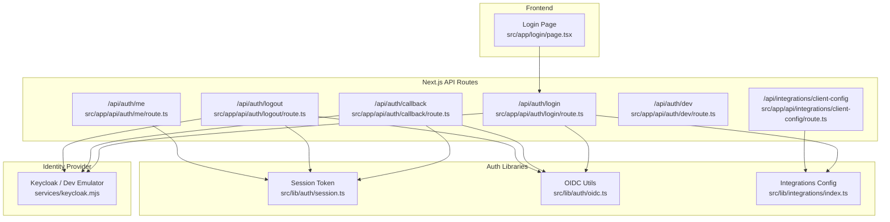
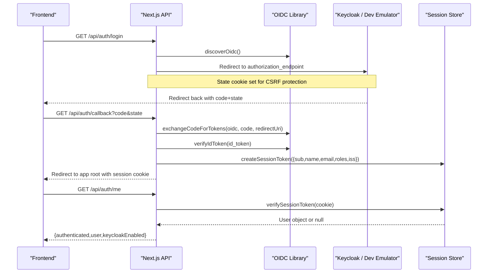
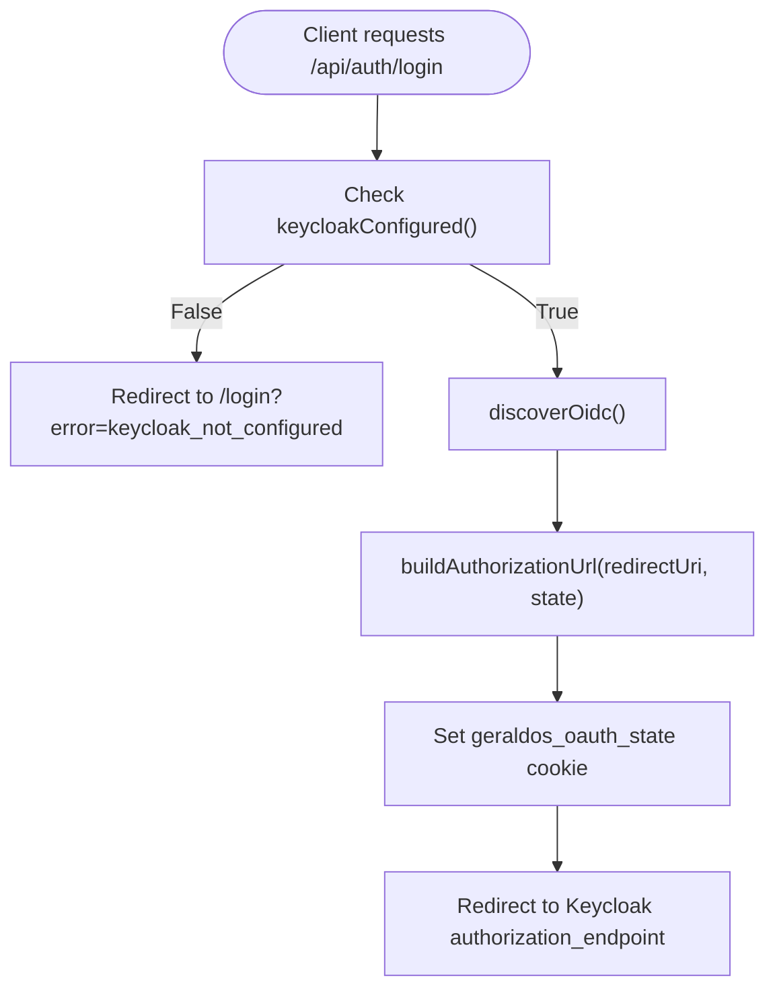
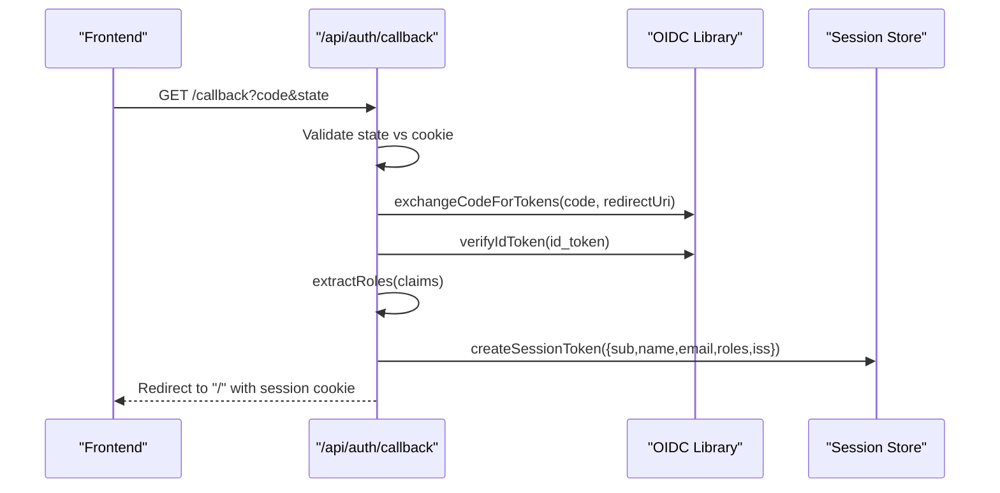
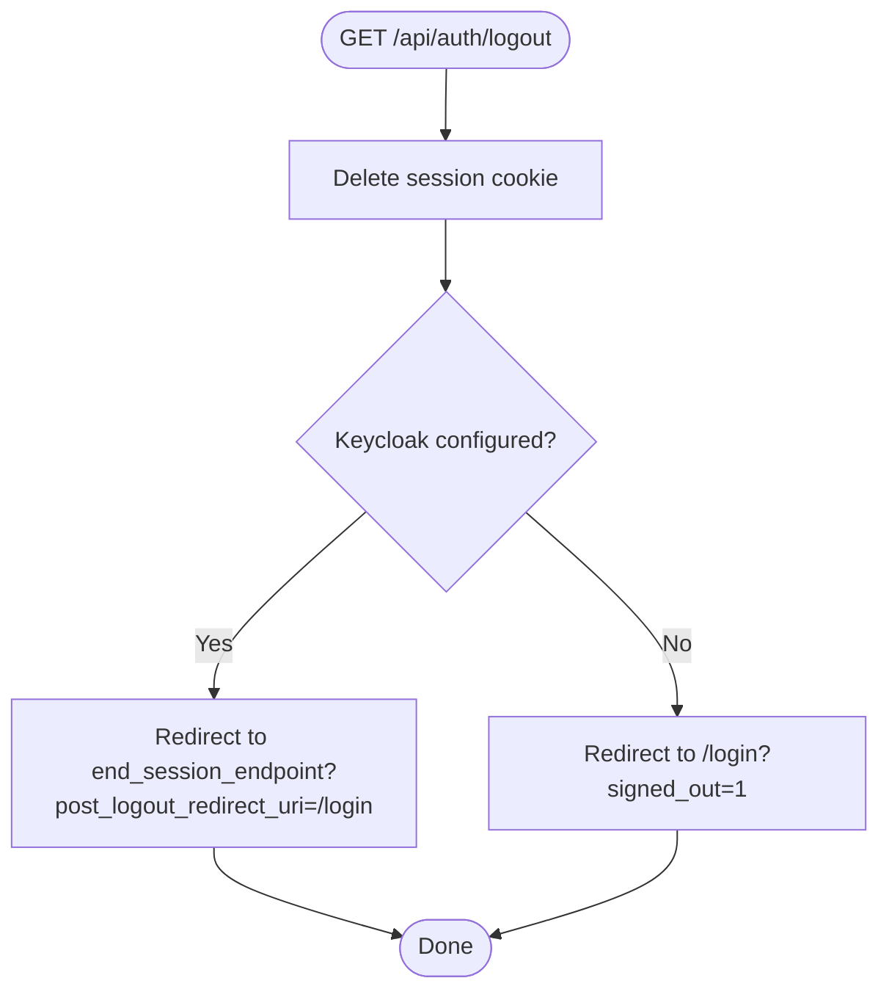
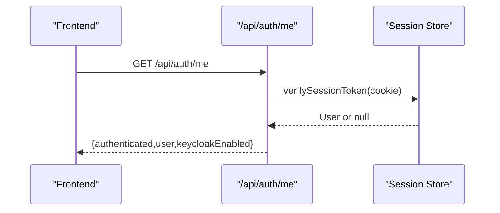
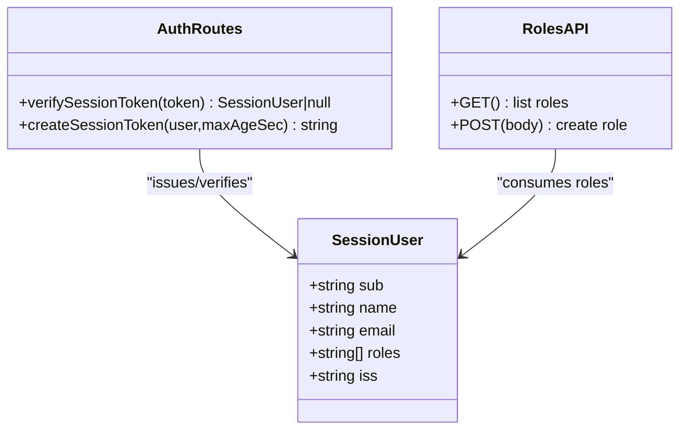
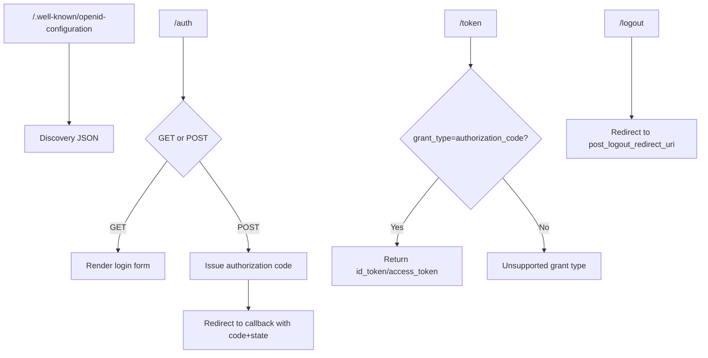
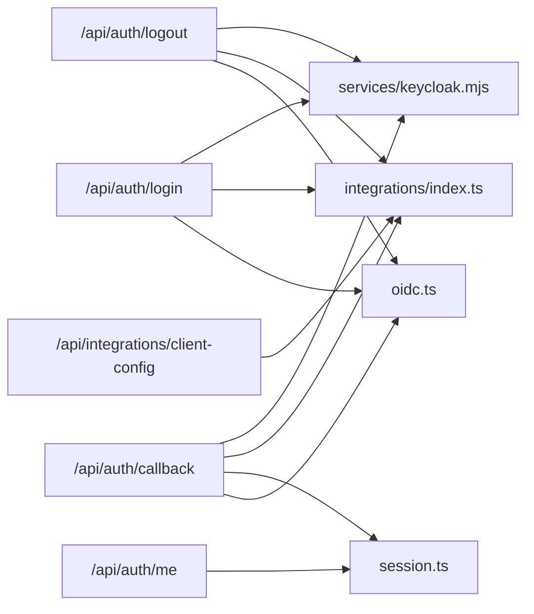

# Authentication & Authorization

<cite>
**Referenced Files in This Document**
- [route.ts](file://src/app/api/auth/callback/route.ts)
- [route.ts](file://src/app/api/auth/login/route.ts)
- [route.ts](file://src/app/api/auth/logout/route.ts)
- [route.ts](file://src/app/api/auth/me/route.ts)
- [route.ts](file://src/app/api/auth/dev/route.ts)
- [oidc.ts](file://src/lib/auth/oidc.ts)
- [session.ts](file://src/lib/auth/session.ts)
- [index.ts](file://src/lib/integrations/index.ts)
- [keycloak.mjs](file://services/keycloak.mjs)
- [page.tsx](file://src/app/login/page.tsx)
- [route.ts](file://src/app/api/integrations/client-config/route.ts)
</cite>

## Table of Contents
1. Introduction
2. Project Structure
3. Core Components
4. Architecture Overview
5. Detailed Component Analysis
6. Dependency Analysis
7. Performance Considerations
8. Troubleshooting Guide
9. Conclusion
10. Appendices

## Introduction
This document explains GeraldOS authentication and authorization with a focus on Keycloak OIDC integration, session management, role-based access control (RBAC), and security best practices. It covers login/logout flows, callback processing, user profile handling, token refresh strategies, and examples for protecting API routes and frontend components. A lightweight development Keycloak emulator is included to demonstrate the full flow without external dependencies.

## Project Structure
GeraldOS implements authentication via Next.js API routes that coordinate with an OIDC provider (Keycloak or the provided dev emulator). The core pieces are:
- Login, logout, callback, and me endpoints under src/app/api/auth
- Session token creation and verification in src/lib/auth/session.ts
- OIDC utilities in src/lib/auth/oidc.ts
- Integration configuration and public client config in src/lib/integrations/index.ts
- A dev Keycloak emulator in services/keycloak.mjs
- Frontend login page in src/app/login/page.tsx

**Diagram sources**
- [route.ts:7-30](file://src/app/api/auth/login/route.ts#L7-L30)
- [route.ts:13-59](file://src/app/api/auth/callback/route.ts#L13-L59)
- [route.ts:8-30](file://src/app/api/auth/logout/route.ts#L8-L30)
- [route.ts:7-14](file://src/app/api/auth/me/route.ts#L7-L14)
- [route.ts:12-41](file://src/app/api/auth/dev/route.ts#L12-L41)
- [session.ts:1-45](file://src/lib/auth/session.ts#L1-L45)
- [oidc.ts:1-200](file://src/lib/auth/oidc.ts#L1-L200)
- [index.ts:8-69](file://src/lib/integrations/index.ts#L8-L69)
- [keycloak.mjs:46-119](file://services/keycloak.mjs#L46-L119)

**Section sources**
- [route.ts:7-30](file://src/app/api/auth/login/route.ts#L7-L30)
- [route.ts:13-59](file://src/app/api/auth/callback/route.ts#L13-L59)
- [route.ts:8-30](file://src/app/api/auth/logout/route.ts#L8-L30)
- [route.ts:7-14](file://src/app/api/auth/me/route.ts#L7-L14)
- [route.ts:12-41](file://src/app/api/auth/dev/route.ts#L12-L41)
- [session.ts:1-45](file://src/lib/auth/session.ts#L1-L45)
- [index.ts:8-69](file://src/lib/integrations/index.ts#L8-L69)
- [keycloak.mjs:46-119](file://services/keycloak.mjs#L46-L119)

## Core Components
- OIDC integration: Discovery, authorization URL building, code exchange, ID token verification, and role extraction are implemented in the OIDC library and used by auth routes.
- Session management: Server-side signed JWTs stored in httpOnly cookies represent authenticated sessions and carry roles for RBAC checks.
- Integration configuration: Centralized environment-driven configuration exposes only safe fields to the browser via a public client config endpoint.
- Dev Keycloak emulator: A minimal HTTP server provides OIDC discovery, authorization, token issuance, and logout endpoints for local development.

**Section sources**
- [oidc.ts:1-200](file://src/lib/auth/oidc.ts#L1-L200)
- [session.ts:1-45](file://src/lib/auth/session.ts#L1-L45)
- [index.ts:8-69](file://src/lib/integrations/index.ts#L8-L69)
- [keycloak.mjs:46-119](file://services/keycloak.mjs#L46-L119)

## Architecture Overview
The authentication architecture follows the OIDC Authorization Code flow with PKCE-like state validation and server-side session establishment.

**Diagram sources**
- [route.ts:7-30](file://src/app/api/auth/login/route.ts#L7-L30)
- [route.ts:13-59](file://src/app/api/auth/callback/route.ts#L13-L59)
- [route.ts:7-14](file://src/app/api/auth/me/route.ts#L7-L14)
- [oidc.ts:1-200](file://src/lib/auth/oidc.ts#L1-L200)
- [session.ts:1-45](file://src/lib/auth/session.ts#L1-L45)

## Detailed Component Analysis

### OIDC Client Configuration and Discovery
- Public client configuration exposes non-secret settings to the browser, including whether Keycloak is enabled and realm name.
- The login route checks if Keycloak is configured before initiating the flow; otherwise it redirects with an error.
- The dev login path issues a local admin session when Keycloak is not configured or when DEV_AUTH is enabled.

**Diagram sources**
- [route.ts:7-30](file://src/app/api/auth/login/route.ts#L7-L30)
- [index.ts:8-69](file://src/lib/integrations/index.ts#L8-L69)

**Section sources**
- [route.ts:7-30](file://src/app/api/auth/login/route.ts#L7-L30)
- [route.ts:12-41](file://src/app/api/auth/dev/route.ts#L12-L41)
- [index.ts:8-69](file://src/lib/integrations/index.ts#L8-L69)

### Callback Processing and Token Management
- The callback validates state against the saved cookie to prevent CSRF.
- Exchanges the authorization code for tokens, verifies the ID token, extracts roles, and creates a server-side session token.
- Records an audit event for login and sets an httpOnly session cookie.

**Diagram sources**
- [route.ts:13-59](file://src/app/api/auth/callback/route.ts#L13-L59)
- [session.ts:18-29](file://src/lib/auth/session.ts#L18-L29)

**Section sources**
- [route.ts:13-59](file://src/app/api/auth/callback/route.ts#L13-L59)

### Logout Flow
- Clears the local session cookie.
- If Keycloak is configured and supports end_session_endpoint, redirects to the provider’s logout endpoint with post_logout_redirect_uri.

**Diagram sources**
- [route.ts:8-30](file://src/app/api/auth/logout/route.ts#L8-L30)

**Section sources**
- [route.ts:8-30](file://src/app/api/auth/logout/route.ts#L8-L30)

### Current User Endpoint
- Reads the session cookie, verifies it, and returns the current user if present.
- Indicates whether Keycloak is enabled for UI branching.

**Diagram sources**
- [route.ts:7-14](file://src/app/api/auth/me/route.ts#L7-L14)
- [session.ts:32-45](file://src/lib/auth/session.ts#L32-L45)

**Section sources**
- [route.ts:7-14](file://src/app/api/auth/me/route.ts#L7-L14)

### Role-Based Access Control (RBAC)
- Roles are extracted from OIDC claims during callback and embedded into the session token.
- Protected routes should call verifySessionToken and enforce permissions based on roles.
- The roles API normalizes permission shapes for consistent consumption by clients.

**Diagram sources**
- [session.ts:5-45](file://src/lib/auth/session.ts#L5-L45)
- [route.ts:22-57](file://src/app/api/roles/route.ts#L22-L57)

**Section sources**
- [session.ts:5-45](file://src/lib/auth/session.ts#L5-L45)
- [route.ts:22-57](file://src/app/api/roles/route.ts#L22-L57)

### Development Keycloak Emulator
- Provides OIDC discovery, authorization form, token issuance, and logout endpoints.
- Issues RS256-signed JWTs with roles in both realm_access and resource_access for compatibility.

**Diagram sources**
- [keycloak.mjs:46-119](file://services/keycloak.mjs#L46-L119)

**Section sources**
- [keycloak.mjs:46-119](file://services/keycloak.mjs#L46-L119)

### Frontend Login Page
- Fetches public client configuration to determine if Keycloak is available.
- Initiates OIDC login by navigating to /api/auth/login.
- Offers a dev sign-in option when Keycloak is unavailable or DEV_AUTH is enabled.

**Section sources**
- [page.tsx:14-19](file://src/app/login/page.tsx#L14-L19)
- [page.tsx:40-65](file://src/app/login/page.tsx#L40-L65)
- [route.ts:6-8](file://src/app/api/integrations/client-config/route.ts#L6-L8)

## Dependency Analysis
- Auth routes depend on:
  - OIDC utilities for discovery, authorization URL construction, token exchange, ID token verification, and role extraction.
  - Session utilities for creating and verifying server-side JWTs.
  - Integrations config for determining Keycloak availability and constructing issuer URLs.
- The dev Keycloak emulator depends on Node crypto to generate RSA keys and sign JWTs.

**Diagram sources**
- [route.ts:7-30](file://src/app/api/auth/login/route.ts#L7-L30)
- [route.ts:13-59](file://src/app/api/auth/callback/route.ts#L13-L59)
- [route.ts:8-30](file://src/app/api/auth/logout/route.ts#L8-L30)
- [route.ts:7-14](file://src/app/api/auth/me/route.ts#L7-L14)
- [oidc.ts:1-200](file://src/lib/auth/oidc.ts#L1-L200)
- [session.ts:1-45](file://src/lib/auth/session.ts#L1-L45)
- [index.ts:8-69](file://src/lib/integrations/index.ts#L8-L69)
- [keycloak.mjs:46-119](file://services/keycloak.mjs#L46-L119)

**Section sources**
- [route.ts:7-30](file://src/app/api/auth/login/route.ts#L7-L30)
- [route.ts:13-59](file://src/app/api/auth/callback/route.ts#L13-L59)
- [route.ts:8-30](file://src/app/api/auth/logout/route.ts#L8-L30)
- [route.ts:7-14](file://src/app/api/auth/me/route.ts#L7-L14)
- [oidc.ts:1-200](file://src/lib/auth/oidc.ts#L1-L200)
- [session.ts:1-45](file://src/lib/auth/session.ts#L1-L45)
- [index.ts:8-69](file://src/lib/integrations/index.ts#L8-L69)
- [keycloak.mjs:46-119](file://services/keycloak.mjs#L46-L119)

## Performance Considerations
- Use short-lived session cookies and implement periodic re-authentication or silent refresh at the application layer to mitigate long-lived sessions.
- Cache OIDC discovery results per process lifecycle to avoid repeated network calls.
- Ensure timeouts on outbound calls to Keycloak to prevent request stalls.
- Minimize payload size in session tokens; store only necessary claims.

[No sources needed since this section provides general guidance]

## Troubleshooting Guide
Common issues and resolutions:
- Invalid OAuth state: Occurs when state mismatch or missing state cookie. Verify that the state cookie is set during login and matches the callback parameter.
- Keycloak not configured: The login route will redirect with an error if Keycloak is not configured. Ensure KEYCLOAK_URL and related env vars are set.
- Token exchange failed: The callback may redirect with an error if token exchange fails. Check network connectivity to Keycloak and correct client credentials.
- Dev auth disabled: The dev login endpoint is gated behind environment flags. Enable DEV_AUTH or configure Keycloak to use it.

**Section sources**
- [route.ts:13-59](file://src/app/api/auth/callback/route.ts#L13-L59)
- [route.ts:7-30](file://src/app/api/auth/login/route.ts#L7-L30)
- [route.ts:12-41](file://src/app/api/auth/dev/route.ts#L12-L41)

## Conclusion
GeraldOS implements a robust OIDC-based authentication system with Keycloak integration, secure server-side sessions, and RBAC-ready role handling. The provided development Keycloak emulator enables full-flow testing without external dependencies. For production, ensure proper Keycloak configuration, secure secrets, and consider token refresh strategies aligned with your security policy.

[No sources needed since this section summarizes without analyzing specific files]

## Appendices

### Protecting API Routes (Implementation Examples)
- Pattern: In any protected route, read the session cookie, verify it, and reject unauthenticated requests.
- Example references:
  - Read and verify session: [session.ts:32-45](file://src/lib/auth/session.ts#L32-L45)
  - Return 401 when unauthenticated: [route.ts:7-14](file://src/app/api/auth/me/route.ts#L7-L14)
- Enforce roles: After verifying the session, check roles against required permissions for the route.

**Section sources**
- [session.ts:32-45](file://src/lib/auth/session.ts#L32-L45)
- [route.ts:7-14](file://src/app/api/auth/me/route.ts#L7-L14)

### Protecting Frontend Components (Implementation Examples)
- Pattern: On mount, fetch /api/auth/me to determine authentication state and render protected content accordingly.
- Example references:
  - Fetch client config and handle Keycloak availability: [page.tsx:14-19](file://src/app/login/page.tsx#L14-L19)
  - Navigate to /api/auth/login to start OIDC flow: [page.tsx:40-65](file://src/app/login/page.tsx#L40-L65)

**Section sources**
- [page.tsx:14-19](file://src/app/login/page.tsx#L14-L19)
- [page.tsx:40-65](file://src/app/login/page.tsx#L40-L65)

### Token Refresh Strategy
- The current session token has a fixed expiration. For long-lived sessions, implement:
  - Silent refresh using a background task that calls /api/auth/me and renews the session if expired.
  - Or integrate with Keycloak’s refresh token flow if you extend the backend to support refresh tokens.
- Avoid storing sensitive tokens in localStorage; prefer httpOnly cookies and server-side renewal.

[No sources needed since this section provides general guidance]

### Security Best Practices
- Keep AUTH_SECRET strong and rotate periodically.
- Use https in production and set appropriate cookie attributes (httpOnly, sameSite, secure).
- Validate all OIDC responses and signatures; rely on the OIDC library for verification.
- Log and audit authentication events for compliance and incident response.

[No sources needed since this section provides general guidance]