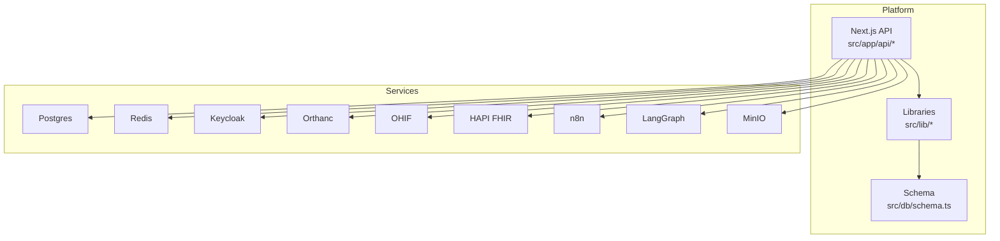
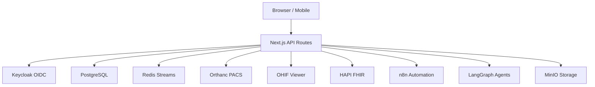
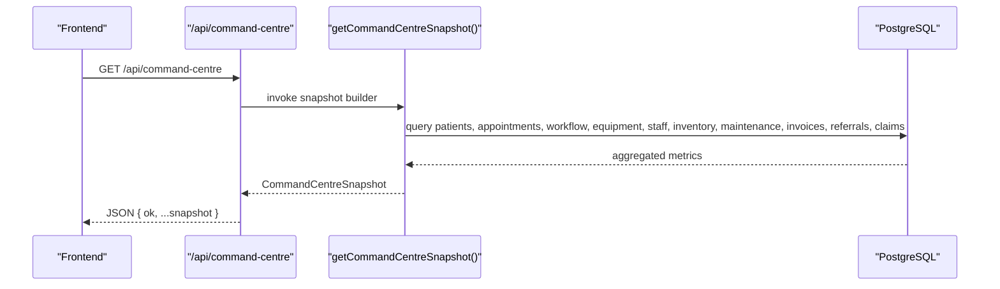
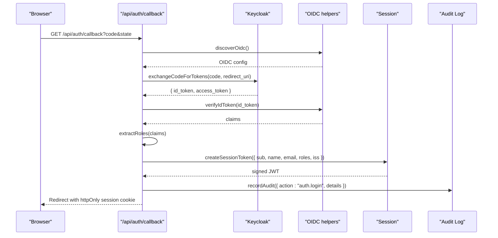
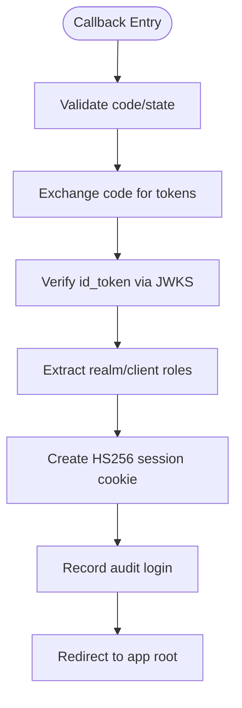
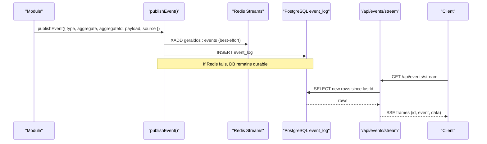
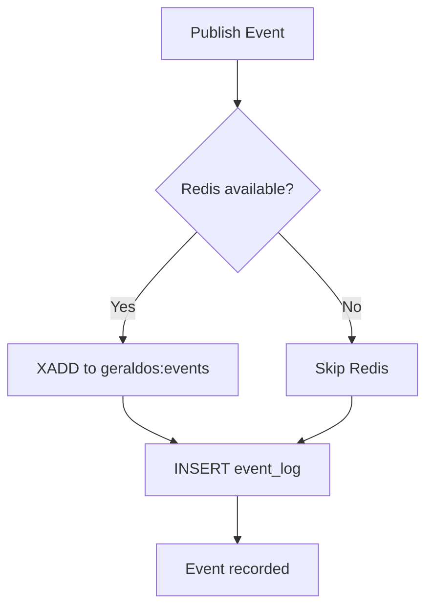
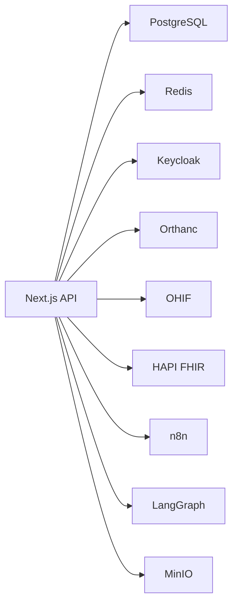
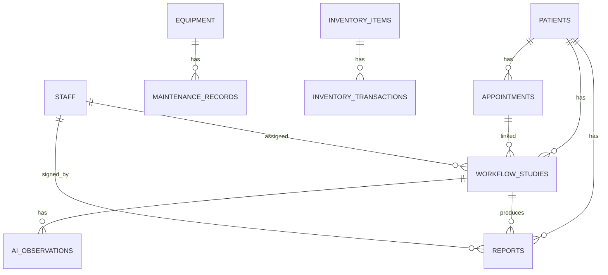

# Core Platform

<cite>
**Referenced Files in This Document**
- [README.md](file://README.md)
- [docker-compose.yml](file://docker-compose.yml)
- [src/app/api/command-centre/route.ts](file://src/app/api/command-centre/route.ts)
- [src/lib/command-centre.ts](file://src/lib/command-centre.ts)
- [src/app/api/events/route.ts](file://src/app/api/events/route.ts)
- [src/app/api/events/stream/route.ts](file://src/app/api/events/stream/route.ts)
- [src/lib/events.ts](file://src/lib/events.ts)
- [src/app/api/auth/callback/route.ts](file://src/app/api/auth/callback/route.ts)
- [src/app/api/auth/me/route.ts](file://src/app/api/auth/me/route.ts)
- [src/lib/auth/oidc.ts](file://src/lib/auth/oidc.ts)
- [src/lib/auth/session.ts](file://src/lib/auth/session.ts)
- [services/keycloak.mjs](file://services/keycloak.mjs)
- [src/db/schema.ts](file://src/db/schema.ts)
- [src/app/api/analytics/route.ts](file://src/app/api/analytics/route.ts)
</cite>

## Table of Contents
1. Introduction
2. Project Structure
3. Core Components
4. Architecture Overview
5. Detailed Component Analysis
6. Dependency Analysis
7. Performance Considerations
8. Troubleshooting Guide
9. Conclusion
10. Appendices

## Introduction
GeraldOS is an AI-native diagnostic imaging operations platform that orchestrates patients, scheduling, workflow, equipment, inventory, reporting, and AI agents while delegating specialized tasks to external services such as Keycloak (identity), Orthanc (PACS), OHIF (viewer), HAPI FHIR, n8n (automation), LangGraph (agents), MinIO (storage), and Redis (queue/cache). The core platform exposes a Next.js API layer with real-time dashboards, event-driven communication, and secure authentication.

Key highlights:
- Operations Command Centre provides a unified snapshot of KPIs, queues, utilization, risks, and live AI recommendations.
- Authentication integrates with Keycloak OIDC and issues secure session cookies with role-based access control.
- Event bus uses Redis Streams for decoupled messaging and persists events to PostgreSQL for auditability and resilience.
- Real-time updates are delivered via Server-Sent Events from the database when Redis is unavailable or as a fallback.

**Section sources**
- [README.md:1-121](file://README.md#L1-L121)

## Project Structure
The repository follows a feature-oriented layout centered around a Next.js application:
- API routes under src/app/api handle authentication, command centre, events, analytics, and integrations.
- Shared libraries under src/lib implement business logic for command centre, events, auth, and domain modules.
- Database schema under src/db defines entities for patients, appointments, workflow, reports, AI review, knowledge, and events.
- Docker Compose provisions Postgres, Redis, MinIO, Orthanc, Keycloak, HAPI FHIR, Dicoogle, n8n, OHIF, and LangGraph.

**Diagram sources**
- [docker-compose.yml:1-118](file://docker-compose.yml#L1-L118)
- [src/app/api/command-centre/route.ts:1-15](file://src/app/api/command-centre/route.ts#L1-L15)
- [src/lib/command-centre.ts:1-208](file://src/lib/command-centre.ts#L1-L208)
- [src/lib/events.ts:1-158](file://src/lib/events.ts#L1-L158)
- [src/app/api/events/stream/route.ts:1-94](file://src/app/api/events/stream/route.ts#L1-L94)

**Section sources**
- [docker-compose.yml:1-118](file://docker-compose.yml#L1-L118)
- [README.md:25-45](file://README.md#L25-L45)

## Core Components
- Operations Command Centre: Aggregates KPIs, patient flow, queue status, machine utilization, radiologist workload, referral sources, appointment delays, inventory alerts, maintenance alerts, live AI recommendations, and operational risks into a single snapshot payload.
- Authentication: Keycloak OIDC integration with token exchange, ID token verification against JWKS, role extraction, and HS256 session cookie issuance.
- Event Bus: Publishes events to Redis Streams and persists them to PostgreSQL; supports listing events and streaming recent events via SSE.
- Analytics: Provides counts and groupings across patients, appointments, studies, equipment, reports, low stock items, and study distributions by stage/modality.

**Section sources**
- [src/lib/command-centre.ts:1-208](file://src/lib/command-centre.ts#L1-L208)
- [src/app/api/command-centre/route.ts:1-15](file://src/app/api/command-centre/route.ts#L1-L15)
- [src/lib/events.ts:1-158](file://src/lib/events.ts#L1-L158)
- [src/app/api/events/route.ts:1-38](file://src/app/api/events/route.ts#L1-L38)
- [src/app/api/analytics/route.ts:1-58](file://src/app/api/analytics/route.ts#L1-L58)

## Architecture Overview
The platform’s runtime architecture connects the Next.js API to identity, storage, PACS, viewer, automation, agent runtime, and data stores.

**Diagram sources**
- [docker-compose.yml:1-118](file://docker-compose.yml#L1-L118)
- [README.md:9-23](file://README.md#L9-L23)

## Detailed Component Analysis

### Operations Command Centre
The Command Centre endpoint builds a comprehensive snapshot by querying multiple tables for KPIs, queues, utilization, workload, referrals, delays, alerts, and risk indicators. It returns a structured payload suitable for dashboard rendering and real-time polling.

**Diagram sources**
- [src/app/api/command-centre/route.ts:1-15](file://src/app/api/command-centre/route.ts#L1-L15)
- [src/lib/command-centre.ts:27-206](file://src/lib/command-centre.ts#L27-L206)

Operational risk assessment rules:
- Critical: machines offline
- High: machines in maintenance; inventory below minimum
- Medium: appointment delays; pending insurance claims; pending reports
- Low: all systems nominal

**Section sources**
- [src/lib/command-centre.ts:154-165](file://src/lib/command-centre.ts#L154-L165)
- [src/lib/command-centre.ts:167-206](file://src/lib/command-centre.ts#L167-L206)

### Authentication System (Keycloak OIDC + Session Management + RBAC)
Authentication flows through Keycloak OIDC Authorization Code flow. The callback route exchanges the authorization code for tokens, verifies the id_token using the realm’s JWKS, extracts roles from realm and client scopes, creates an HS256 session cookie, and records an audit entry.

Role-based access control:
- Roles are extracted from both realm_access and resource_access scopes.
- The session token carries roles and issuer information for downstream checks.

**Diagram sources**
- [src/app/api/auth/callback/route.ts:13-58](file://src/app/api/auth/callback/route.ts#L13-L58)
- [src/lib/auth/oidc.ts:18-95](file://src/lib/auth/oidc.ts#L18-L95)
- [src/lib/auth/session.ts:13-45](file://src/lib/auth/session.ts#L13-L45)

Development and degraded mode:
- When Keycloak is not configured, the system can run in degraded mode with a local dev endpoint issuing admin sessions.

**Section sources**
- [src/app/api/auth/callback/route.ts:1-60](file://src/app/api/auth/callback/route.ts#L1-L60)
- [src/lib/auth/oidc.ts:1-96](file://src/lib/auth/oidc.ts#L1-L96)
- [src/lib/auth/session.ts:1-46](file://src/lib/auth/session.ts#L1-L46)
- [src/app/api/auth/me/route.ts:1-15](file://src/app/api/auth/me/route.ts#L1-L15)
- [services/keycloak.mjs:1-120](file://services/keycloak.mjs#L1-L120)
- [README.md:66-72](file://README.md#L66-L72)

### Event Bus (Redis Streams + PostgreSQL Persistence + SSE)
The event bus publishes domain events to Redis Streams and always persists them to PostgreSQL for durability. Consumers can list recent events or subscribe to a Server-Sent Events stream that polls the database every few seconds.

Event types:
- Patient, referral, appointment, study, worklist, measurement, annotation, AI review, report lifecycle, decision lifecycle, inventory, equipment, maintenance, knowledge, notification.

**Diagram sources**
- [src/lib/events.ts:18-60](file://src/lib/events.ts#L18-L60)
- [src/lib/events.ts:72-131](file://src/lib/events.ts#L72-L131)
- [src/app/api/events/stream/route.ts:20-93](file://src/app/api/events/stream/route.ts#L20-L93)

Real-time workstation updates:
- The SSE endpoint sends initial connection confirmation, polls for new events since Last-Event-ID or lastId parameter, reverses results to ensure chronological order, and emits keepalive comments on errors.

**Section sources**
- [src/lib/events.ts:1-158](file://src/lib/events.ts#L1-L158)
- [src/app/api/events/route.ts:1-38](file://src/app/api/events/route.ts#L1-L38)
- [src/app/api/events/stream/route.ts:1-94](file://src/app/api/events/stream/route.ts#L1-L94)

### Analytics Endpoint
Provides high-level counts and groupings useful for dashboards and reporting:
- Counts: patients, appointments, studies, equipment, reports
- Low stock items count
- Equipment distribution by status
- Studies grouped by stage and modality

**Section sources**
- [src/app/api/analytics/route.ts:1-58](file://src/app/api/analytics/route.ts#L1-L58)

## Dependency Analysis
Core dependencies and their roles:
- PostgreSQL: Primary persistence for all domain entities and event_log.
- Redis: Optional fast path for event streams; graceful degradation to DB if unreachable.
- Keycloak: Identity provider for OIDC; JWKS used to verify id_tokens.
- Orthanc: PACS proxy endpoints for DICOM workflows.
- OHIF: Viewer deep links for studies.
- HAPI FHIR: Proxy for FHIR resources.
- n8n: Outbound triggers and inbound webhooks for automation.
- LangGraph: Agent runtime for reasoning tasks with fallback simulation.
- MinIO: Object storage with presigned URLs.

**Diagram sources**
- [docker-compose.yml:1-118](file://docker-compose.yml#L1-L118)
- [README.md:66-89](file://README.md#L66-L89)

**Section sources**
- [docker-compose.yml:1-118](file://docker-compose.yml#L1-L118)
- [README.md:66-89](file://README.md#L66-L89)

## Performance Considerations
- Command Centre snapshot queries aggregate across many tables; consider indexing frequently filtered columns (e.g., dates, statuses, stages) to reduce latency.
- Redis Streams provide best-effort real-time delivery; ensure MAXLEN cap balances memory usage with retention needs.
- SSE polling interval (5 seconds) balances freshness and server load; tune based on expected event volume.
- Health checks for services enable quick detection of connectivity issues and inform UI status indicators.

[No sources needed since this section provides general guidance]

## Troubleshooting Guide
Common issues and diagnostics:
- Authentication failures:
  - Invalid OAuth state or missing code/state parameters cause redirects to login with error messages.
  - Token exchange errors result in user-friendly error redirects.
- Redis unavailability:
  - Event publishing falls back to PostgreSQL; no loss of audit trail.
  - SSE continues to poll the database for new events.
- Service health:
  - Use health and integration status endpoints to verify connectivity and latency for each service.

**Section sources**
- [src/app/api/auth/callback/route.ts:19-58](file://src/app/api/auth/callback/route.ts#L19-L58)
- [src/lib/events.ts:102-131](file://src/lib/events.ts#L102-L131)
- [src/app/api/events/stream/route.ts:74-80](file://src/app/api/events/stream/route.ts#L74-L80)
- [README.md:64-65](file://README.md#L64-L65)

## Conclusion
GeraldOS core platform delivers a robust, event-driven operations environment with a real-time Command Centre, secure Keycloak-based authentication, and resilient event bus backed by Redis and PostgreSQL. The modular design enables clear separation of concerns, easy integration with external services, and scalable real-time capabilities for clinical and operational workflows.

[No sources needed since this section summarizes without analyzing specific files]

## Appendices

### Data Model Highlights
Key entities relevant to the core platform:
- Patients, Appointments, Workflow Studies, Reports
- Equipment, Maintenance Records, Inventory Items
- AI Observations, AI Recommendations
- Knowledge Documents
- Event Log, Notifications

**Diagram sources**
- [src/db/schema.ts:17-468](file://src/db/schema.ts#L17-L468)

### Practical Examples and Integration Patterns
- Command Centre polling:
  - Call GET /api/command-centre to retrieve a full operational snapshot including KPIs, queues, utilization, risks, and live AI recommendations.
- Event publishing:
  - POST /api/events with a known event type and required fields to publish manual events; the system validates types and persists events.
- Real-time updates:
  - Open GET /api/events/stream with optional lastId to receive new events via SSE; use Last-Event-ID header for resumption.
- Authentication:
  - Initiate Keycloak login flow; after callback, a session cookie is set and subsequent requests include it for authenticated access.
- Analytics:
  - GET /api/analytics for counts and groupings to support dashboards and reporting.

**Section sources**
- [src/app/api/command-centre/route.ts:1-15](file://src/app/api/command-centre/route.ts#L1-L15)
- [src/app/api/events/route.ts:6-36](file://src/app/api/events/route.ts#L6-L36)
- [src/app/api/events/stream/route.ts:1-94](file://src/app/api/events/stream/route.ts#L1-L94)
- [src/app/api/auth/callback/route.ts:13-58](file://src/app/api/auth/callback/route.ts#L13-L58)
- [src/app/api/analytics/route.ts:6-53](file://src/app/api/analytics/route.ts#L6-L53)