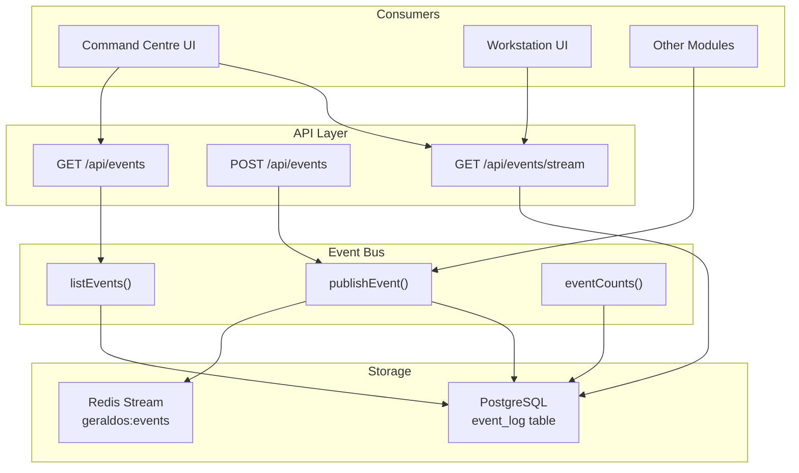
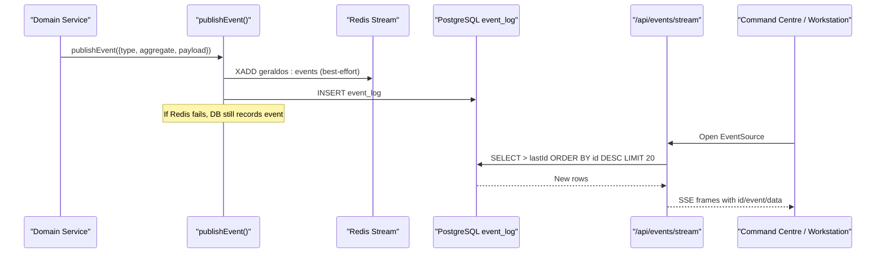
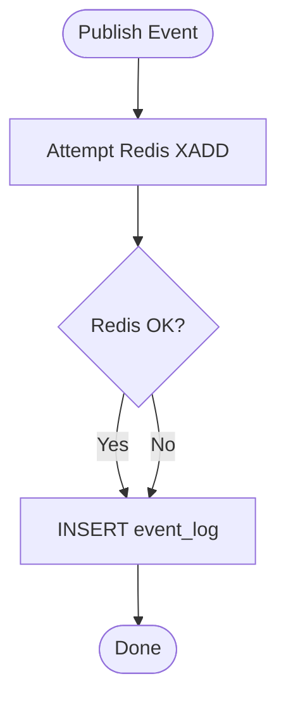
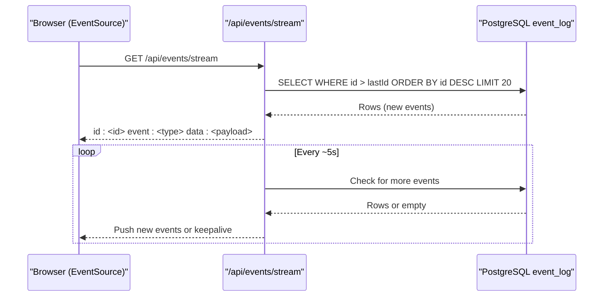
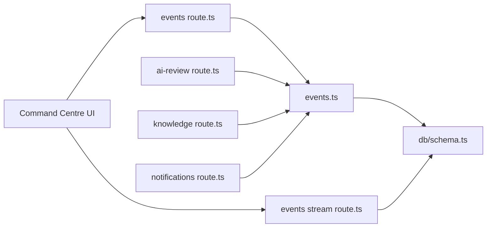

# Event Bus & Real-time Communication

<cite>
**Referenced Files in This Document**
- [events.ts](file://src/lib/events.ts)
- [events route](file://src/app/api/events/route.ts)
- [events stream route](file://src/app/api/events/stream/route.ts)
- [database schema](file://src/db/schema.ts)
- [command centre page](file://src/app/page.tsx)
- [ai-review route](file://src/app/api/ai-review/route.ts)
- [knowledge route](file://src/app/api/knowledge/route.ts)
- [notifications route](file://src/app/api/notifications/route.ts)
- [events test](file://__tests__/lib/events.test.ts)
</cite>

## Table of Contents
1. [Introduction](#introduction)
2. [Project Structure](#project-structure)
3. [Core Components](#core-components)
4. [Architecture Overview](#architecture-overview)
5. [Detailed Component Analysis](#detailed-component-analysis)
6. [Dependency Analysis](#dependency-analysis)
7. [Performance Considerations](#performance-considerations)
8. [Troubleshooting Guide](#troubleshooting-guide)
9. [Conclusion](#conclusion)
10. [Appendices](#appendices)

## Introduction
This document explains GeraldOS’s event bus and real-time communication system. The platform uses a Redis Streams-based event architecture to decouple components while ensuring durability through persistent storage in the database. Events are published by domain services, streamed to UI clients via Server-Sent Events (SSE), and consumed asynchronously by downstream modules. The design guarantees that activity feeds and command centre dashboards remain accurate even when Redis is unavailable.

## Project Structure
The event system spans a small set of focused files:
- Core event bus library for publishing and querying events
- REST endpoints to list and publish events
- SSE endpoint for live streaming to UIs
- Database schema defining the durable event log
- Example producers across AI review, knowledge, and notifications
- Command centre UI consuming events via polling and SSE

**Diagram sources**
- [events.ts:101-131](file://src/lib/events.ts#L101-L131)
- [events route:6-37](file://src/app/api/events/route.ts#L6-L37)
- [events stream route:20-93](file://src/app/api/events/stream/route.ts#L20-L93)
- [database schema:447-455](file://src/db/schema.ts#L447-L455)

**Section sources**
- [events.ts:1-158](file://src/lib/events.ts#L1-L158)
- [events route:1-38](file://src/app/api/events/route.ts#L1-L38)
- [events stream route:1-94](file://src/app/api/events/stream/route.ts#L1-L94)
- [database schema:447-455](file://src/db/schema.ts#L447-L455)

## Core Components
- Event types registry: Centralized constants define all supported event types across domains such as patient, study, report, AI, decision, inventory, equipment, knowledge, and notifications.
- Publish function: Writes events to Redis Streams (when configured) and always persists them to the event_log table for durability.
- Query functions: Retrieve recent events with optional filtering and compute counts grouped by type for dashboards.
- SSE streaming: Polls the event_log table on a fixed interval and pushes new events to connected clients using SSE with idempotent IDs.
- API surface: Exposes GET to list events and POST to publish custom or known events from external callers.

Key responsibilities:
- Decoupling: Producers call publishEvent without knowing consumers.
- Durability: event_log is the source of truth; Redis is an optimization for low-latency streaming.
- Observability: Commands centre and workstations consume events for live updates.

**Section sources**
- [events.ts:18-70](file://src/lib/events.ts#L18-L70)
- [events.ts:101-157](file://src/lib/events.ts#L101-L157)
- [events route:6-37](file://src/app/api/events/route.ts#L6-L37)
- [events stream route:20-93](file://src/app/api/events/stream/route.ts#L20-L93)

## Architecture Overview
GeraldOS implements an event-driven architecture with dual persistence:
- Redis Streams: Optional, best-effort fast path for real-time distribution.
- PostgreSQL event_log: Mandatory durable record used for history, replay, and fallback streaming.

**Diagram sources**
- [events.ts:101-131](file://src/lib/events.ts#L101-L131)
- [events stream route:20-93](file://src/app/api/events/stream/route.ts#L20-L93)
- [database schema:447-455](file://src/db/schema.ts#L447-L455)

## Detailed Component Analysis

### Event Types and Payloads
- Event types are centralized to ensure consistency across producers and consumers. Examples include patient, appointment, study, report, AI observation, decision, inventory, equipment, knowledge, and notification events.
- Each event carries:
  - type: string identifier from the registry or a custom prefix
  - aggregate: logical domain entity name
  - aggregateId: unique ID of the affected entity
  - payload: structured JSON object containing relevant context
  - source: origin of the event (e.g., app, manual)
  - occurredAt: timestamp added at publish time

These fields are persisted in the event_log table and can be queried or streamed.

**Section sources**
- [events.ts:18-70](file://src/lib/events.ts#L18-L70)
- [database schema:447-455](file://src/db/schema.ts#L447-L455)

### Publishing Events
- Producers call publishEvent with a typed event and payload.
- The function attempts to write to Redis Streams first, then writes to the database. Redis failures do not block persistence.
- The API exposes a POST endpoint to publish events manually, validating known types or allowing custom types prefixed with “custom.”

**Diagram sources**
- [events.ts:101-131](file://src/lib/events.ts#L101-L131)
- [events route:18-37](file://src/app/api/events/route.ts#L18-L37)

**Section sources**
- [events.ts:101-131](file://src/lib/events.ts#L101-L131)
- [events route:18-37](file://src/app/api/events/route.ts#L18-L37)

### Listing and Counting Events
- listEvents returns recent events with optional type filtering and limit control.
- eventCounts aggregates counts by event type for dashboards like the command centre activity feed.

**Section sources**
- [events.ts:133-157](file://src/lib/events.ts#L133-L157)

### Real-time Streaming API
- GET /api/events/stream opens a long-lived SSE connection.
- The server polls the event_log table every few seconds, returning only new events since the client’s last seen id.
- Each SSE frame includes id, event type, and data payload. The stream sends keepalive comments if needed and handles client disconnects gracefully.

**Diagram sources**
- [events stream route:20-93](file://src/app/api/events/stream/route.ts#L20-L93)
- [database schema:447-455](file://src/db/schema.ts#L447-L455)

**Section sources**
- [events stream route:1-94](file://src/app/api/events/stream/route.ts#L1-L94)

### Command Centre Integration
- The command centre page fetches recent events periodically and displays them in an activity feed. It also supports SSE for live updates.
- Event labels map internal event types to human-readable titles for display.

**Section sources**
- [command centre page:90-140](file://src/app/page.tsx#L90-L140)
- [command centre page:446-474](file://src/app/page.tsx#L446-L474)

### Example Producers Across Domains
- AI Review: Publishes observation suggestions after generating candidates.
- Knowledge: Publishes when documents are created/published.
- Notifications: Publishes when notifications are sent.

These examples demonstrate consistent usage patterns:
- Call publishEvent with a domain-specific type
- Provide aggregate and aggregateId to identify the affected entity
- Include minimal, meaningful payload for downstream consumers

**Section sources**
- [ai-review route:90-109](file://src/app/api/ai-review/route.ts#L90-L109)
- [knowledge route:50-66](file://src/app/api/knowledge/route.ts#L50-L66)
- [notifications route:35-57](file://src/app/api/notifications/route.ts#L35-L57)

## Dependency Analysis
- The event bus depends on:
  - Database ORM for persistent storage
  - Optional Redis client for high-throughput streaming
- API routes depend on the event bus for publishing and listing
- UI consumes events via REST and SSE

**Diagram sources**
- [events.ts:10-13](file://src/lib/events.ts#L10-L13)
- [events route:1-3](file://src/app/api/events/route.ts#L1-L3)
- [events stream route:11-14](file://src/app/api/events/stream/route.ts#L11-L14)
- [ai-review route:90-109](file://src/app/api/ai-review/route.ts#L90-L109)
- [knowledge route:50-66](file://src/app/api/knowledge/route.ts#L50-L66)
- [notifications route:35-57](file://src/app/api/notifications/route.ts#L35-L57)

**Section sources**
- [events.ts:10-13](file://src/lib/events.ts#L10-L13)
- [events route:1-3](file://src/app/api/events/route.ts#L1-L3)
- [events stream route:11-14](file://src/app/api/events/stream/route.ts#L11-L14)

## Performance Considerations
- Redis backoff: Reconnection attempts are throttled to avoid storms when Redis is down.
- Stream cap: Redis stream is capped to a maximum number of entries to prevent unbounded growth.
- Polling interval: SSE polling occurs at a fixed interval to balance freshness and load.
- Limits: API limits max query size to protect performance.
- Best-effort Redis: Redis failures do not impact persistence; event_log remains authoritative.

Recommendations:
- Monitor Redis connectivity and error rates
- Tune stream cap and poll interval based on workload
- Ensure database indexes support efficient queries by id and eventType
- Use pagination and limits in UI to reduce payload sizes

[No sources needed since this section provides general guidance]

## Troubleshooting Guide
Common issues and diagnostics:
- Redis unavailable: Events still persist to event_log; verify SSE continues to deliver events from DB.
- Missing events in UI: Confirm lastId handling in SSE and check for network interruptions.
- Unknown event type: POST validation rejects unknown types unless prefixed with “custom.”
- High latency: Reduce poll interval or optimize DB queries; consider enabling Redis for faster distribution.

Debugging steps:
- Inspect event_log for recent inserts and ordering
- Validate SSE frames contain correct id, event, and data
- Check API responses for errors and status codes
- Use tests to validate publish/list/count behavior under mocked dependencies

**Section sources**
- [events.ts:72-99](file://src/lib/events.ts#L72-L99)
- [events stream route:20-93](file://src/app/api/events/stream/route.ts#L20-L93)
- [events route:18-37](file://src/app/api/events/route.ts#L18-L37)
- [events test:54-108](file://__tests__/lib/events.test.ts#L54-L108)

## Conclusion
GeraldOS’s event bus provides a robust, decoupled communication layer combining Redis Streams for real-time distribution and PostgreSQL for durable, replayable event history. The SSE streaming API enables live updates to the command centre and workstation UIs, while the API surface allows both programmatic and manual event publishing. With careful configuration and monitoring, this architecture scales to support high-throughput workflows and resilient operations.

[No sources needed since this section summarizes without analyzing specific files]

## Appendices

### Creating Custom Events
- Use the POST /api/events endpoint with a type prefixed by “custom.” to publish domain-specific events.
- Include aggregate and aggregateId to identify the affected entity.
- Attach a concise payload with necessary context for consumers.

**Section sources**
- [events route:18-37](file://src/app/api/events/route.ts#L18-L37)

### Handling Event Consumers
- For live UI updates, connect to /api/events/stream and process SSE frames by id and event type.
- For batch processing or auditing, query /api/events with filters and limits.
- For dashboard metrics, use eventCounts to aggregate by type.

**Section sources**
- [events stream route:20-93](file://src/app/api/events/stream/route.ts#L20-L93)
- [events route:6-16](file://src/app/api/events/route.ts#L6-L16)
- [events.ts:149-157](file://src/lib/events.ts#L149-L157)

### Managing Event Persistence
- All events are persisted to event_log regardless of Redis availability.
- Use listEvents for historical views and eventCounts for aggregated metrics.
- Ensure database maintenance and indexing for optimal performance.

**Section sources**
- [events.ts:101-157](file://src/lib/events.ts#L101-L157)
- [database schema:447-455](file://src/db/schema.ts#L447-L455)