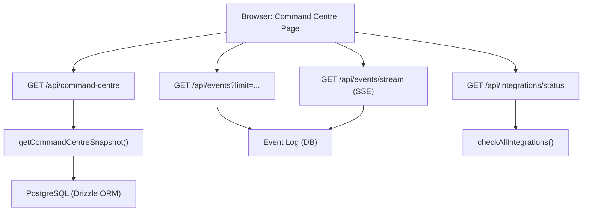
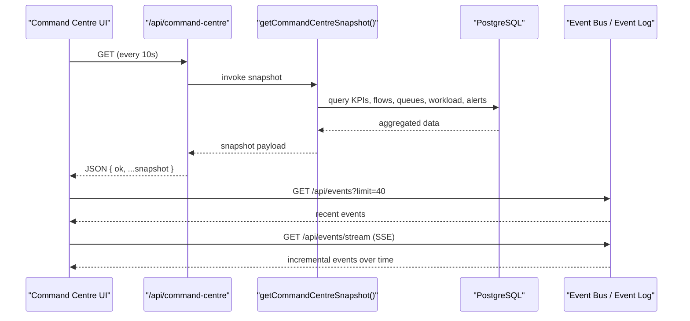
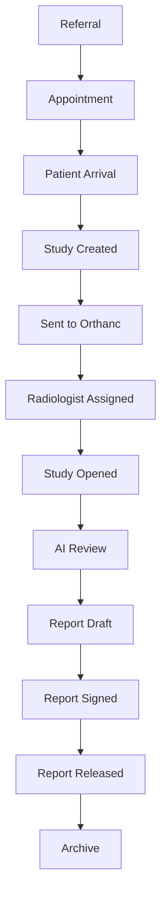
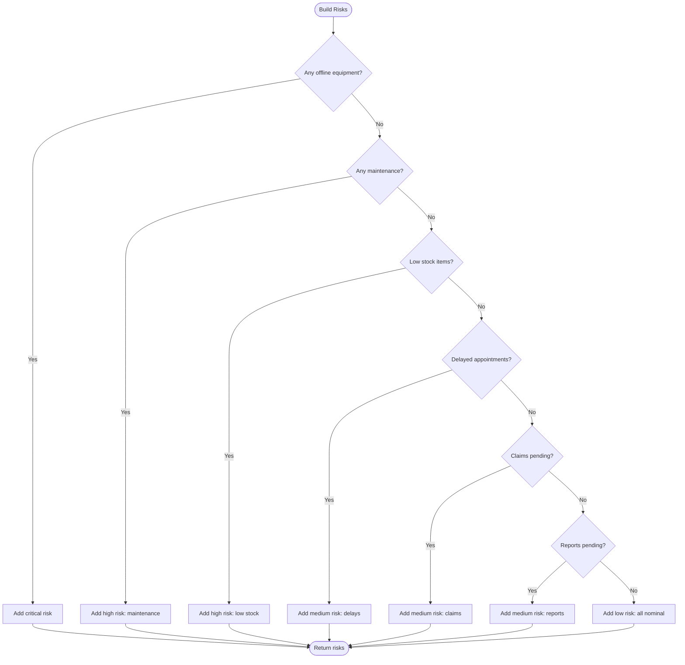
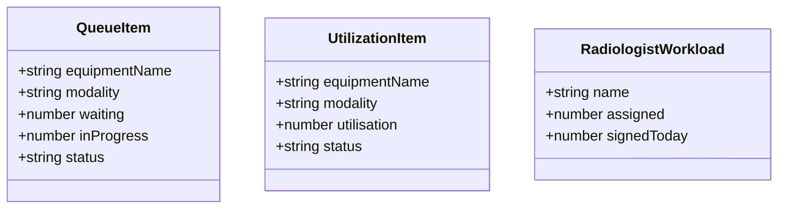
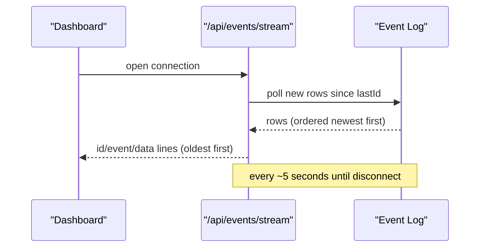
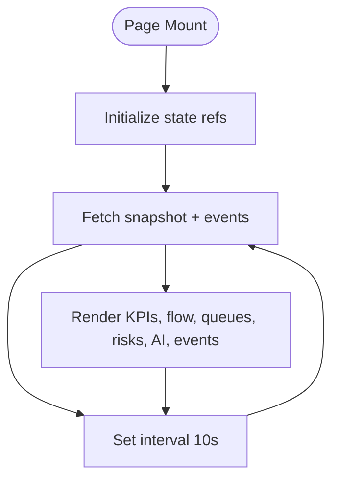
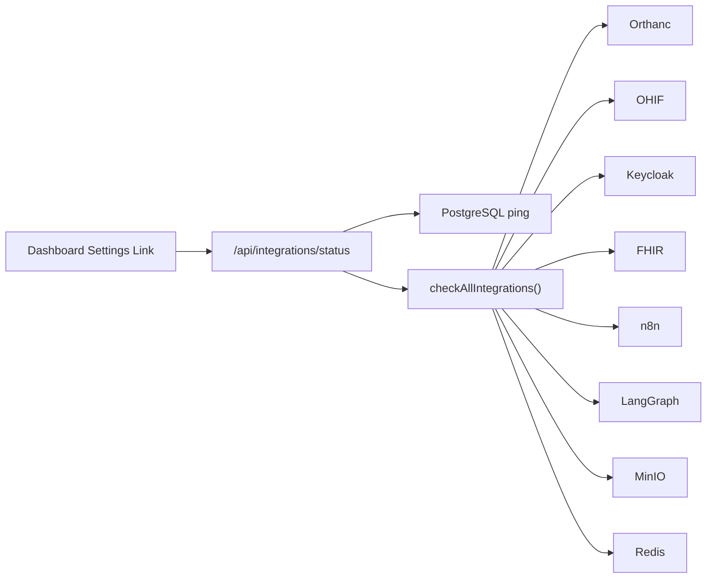
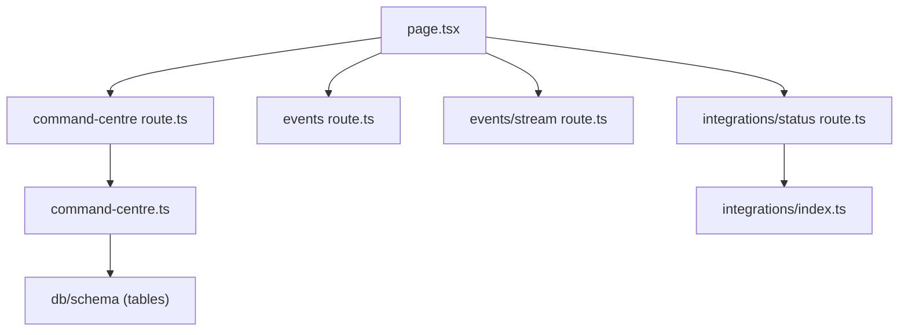

# Operations Command Centre

<cite>
**Referenced Files in This Document**
- [src/app/page.tsx](file://src/app/page.tsx)
- [src/app/api/command-centre/route.ts](file://src/app/api/command-centre/route.ts)
- [src/lib/command-centre.ts](file://src/lib/command-centre.ts)
- [src/lib/workflow.ts](file://src/lib/workflow.ts)
- [src/lib/events.ts](file://src/lib/events.ts)
- [src/app/api/events/route.ts](file://src/app/api/events/route.ts)
- [src/app/api/events/stream/route.ts](file://src/app/api/events/stream/route.ts)
- [src/app/api/integrations/status/route.ts](file://src/app/api/integrations/status/route.ts)
- [src/lib/integrations/index.ts](file://src/lib/integrations/index.ts)
</cite>

## Table of Contents
1. [Introduction](#introduction)
2. [Project Structure](#project-structure)
3. [Core Components](#core-components)
4. [Architecture Overview](#architecture-overview)
5. [Detailed Component Analysis](#detailed-component-analysis)
6. [Dependency Analysis](#dependency-analysis)
7. [Performance Considerations](#performance-considerations)
8. [Troubleshooting Guide](#troubleshooting-guide)
9. [Conclusion](#conclusion)

## Introduction
The Operations Command Centre is a real-time dashboard that consolidates operational KPIs, patient flow, equipment queues, radiologist workload, alerts, AI recommendations, and an activity feed into a single view. It refreshes automatically to reflect current operations across the platform’s database, workflow engine, event bus, and external integrations.

## Project Structure
The command centre is implemented as a client page that polls a server endpoint for a full snapshot and also fetches recent events. The snapshot aggregates data from multiple domain tables and computes risk signals and queue metrics.

**Diagram sources**
- [src/app/page.tsx:122-140](file://src/app/page.tsx#L122-L140)
- [src/app/api/command-centre/route.ts:6-14](file://src/app/api/command-centre/route.ts#L6-L14)
- [src/lib/command-centre.ts:54-206](file://src/lib/command-centre.ts#L54-L206)
- [src/app/api/events/route.ts:6-16](file://src/app/api/events/route.ts#L6-L16)
- [src/app/api/events/stream/route.ts:20-93](file://src/app/api/events/stream/route.ts#L20-L93)
- [src/app/api/integrations/status/route.ts:8-42](file://src/app/api/integrations/status/route.ts#L8-L42)
- [src/lib/integrations/index.ts:134-216](file://src/lib/integrations/index.ts#L134-L216)

**Section sources**
- [src/app/page.tsx:114-140](file://src/app/page.tsx#L114-L140)
- [src/app/api/command-centre/route.ts:1-14](file://src/app/api/command-centre/route.ts#L1-L14)
- [src/lib/command-centre.ts:1-206](file://src/lib/command-centre.ts#L1-L206)

## Core Components
- Real-time KPIs: patients today, appointments today, checked-in, active studies, pending reports, emergency cases, revenue today, machines up.
- Patient Flow Pipeline: counts per workflow stage from referral to archive.
- Queue Status: waiting and in-progress per equipment/modality with status badges.
- Machine Utilisation: per-unit utilisation percentage and status.
- Radiologist Workload: assigned studies and signed reports per radiologist.
- Alerts: inventory low stock, maintenance schedules, appointment delays.
- Operational Risks: severity-tagged risks derived from live data.
- Live AI Recommendations: agent-proposed actions awaiting attention.
- Activity Feed: recent platform events from the event bus.

**Section sources**
- [src/app/page.tsx:154-164](file://src/app/page.tsx#L154-L164)
- [src/app/page.tsx:212-264](file://src/app/page.tsx#L212-L264)
- [src/app/page.tsx:267-329](file://src/app/page.tsx#L267-L329)
- [src/app/page.tsx:331-405](file://src/app/page.tsx#L331-L405)
- [src/app/page.tsx:408-474](file://src/app/page.tsx#L408-L474)
- [src/lib/command-centre.ts:27-52](file://src/lib/command-centre.ts#L27-L52)

## Architecture Overview
The dashboard uses a polling-based real-time model with periodic snapshots and an optional Server-Sent Events stream for live activity.

**Diagram sources**
- [src/app/page.tsx:122-140](file://src/app/page.tsx#L122-L140)
- [src/app/api/command-centre/route.ts:6-14](file://src/app/api/command-centre/route.ts#L6-L14)
- [src/lib/command-centre.ts:54-206](file://src/lib/command-centre.ts#L54-L206)
- [src/app/api/events/route.ts:6-16](file://src/app/api/events/route.ts#L6-L16)
- [src/app/api/events/stream/route.ts:20-93](file://src/app/api/events/stream/route.ts#L20-L93)

## Detailed Component Analysis

### Real-time KPIs
- Patients Today: count of patients created today.
- Appointments Today: appointments scheduled today; includes Checked In subset.
- Active Studies: studies not released or archived.
- Pending Reports: reports in draft or pending review.
- Emergency Cases: stat-priority studies not released/archived.
- Revenue Today: sum of invoice totals issued today.
- Equipment Status: operational vs total units.

These are computed in a single aggregation function and exposed via a REST endpoint consumed by the dashboard.

**Section sources**
- [src/lib/command-centre.ts:54-71](file://src/lib/command-centre.ts#L54-L71)
- [src/lib/command-centre.ts:174-188](file://src/lib/command-centre.ts#L174-L188)
- [src/app/api/command-centre/route.ts:6-14](file://src/app/api/command-centre/route.ts#L6-L14)
- [src/app/page.tsx:154-164](file://src/app/page.tsx#L154-L164)

### Patient Flow Pipeline Visualization
- Stages: referral → appointment → arrival → study created → sent to Orthanc → assigned → opened → AI review → report draft → signed → released → archive.
- Counts per stage are grouped from workflow studies and rendered as a horizontal bar chart with arrows indicating flow direction.

**Diagram sources**
- [src/lib/workflow.ts:37-51](file://src/lib/workflow.ts#L37-L51)
- [src/app/page.tsx:68-81](file://src/app/page.tsx#L68-L81)
- [src/lib/command-centre.ts:189-195](file://src/lib/command-centre.ts#L189-L195)

**Section sources**
- [src/lib/workflow.ts:37-51](file://src/lib/workflow.ts#L37-L51)
- [src/app/page.tsx:212-244](file://src/app/page.tsx#L212-L244)
- [src/lib/command-centre.ts:189-195](file://src/lib/command-centre.ts#L189-L195)

### Operational Risk Assessment System
Risks are synthesized from live data:
- Critical: offline equipment.
- High: equipment under maintenance; low inventory items.
- Medium: delayed appointments; pending insurance claims; pending reports.
- Low: nominal state when no issues detected.

Each risk includes severity, title, and detail string summarizing affected entities.

**Diagram sources**
- [src/lib/command-centre.ts:154-165](file://src/lib/command-centre.ts#L154-L165)

**Section sources**
- [src/lib/command-centre.ts:154-165](file://src/lib/command-centre.ts#L154-L165)
- [src/app/page.tsx:246-264](file://src/app/page.tsx#L246-L264)

### Queue Status Monitoring and Radiologist Workload
- Queue: per equipment, counts of scheduled and in-progress appointments, plus equipment status badge.
- Machine Utilisation: utilization rate and status per unit.
- Radiologist Workload: number of assigned active studies and signed reports per radiologist.

**Diagram sources**
- [src/lib/command-centre.ts:42-45](file://src/lib/command-centre.ts#L42-L45)
- [src/lib/command-centre.ts:72-96](file://src/lib/command-centre.ts#L72-L96)
- [src/lib/command-centre.ts:98-112](file://src/lib/command-centre.ts#L98-L112)
- [src/lib/command-centre.ts:167-172](file://src/lib/command-centre.ts#L167-L172)

**Section sources**
- [src/lib/command-centre.ts:72-96](file://src/lib/command-centre.ts#L72-L96)
- [src/lib/command-centre.ts:98-112](file://src/lib/command-centre.ts#L98-L112)
- [src/lib/command-centre.ts:167-172](file://src/lib/command-centre.ts#L167-L172)
- [src/app/page.tsx:267-329](file://src/app/page.tsx#L267-L329)
- [src/app/page.tsx:331-352](file://src/app/page.tsx#L331-L352)

### Live AI Recommendations Feed
- Displays agent-generated recommendations with priority and status, limited to those requiring attention.
- Provides navigation to the agents workspace.

**Section sources**
- [src/lib/command-centre.ts:134-140](file://src/lib/command-centre.ts#L134-L140)
- [src/app/page.tsx:408-444](file://src/app/page.tsx#L408-L444)

### Activity Event Stream
- Recent events are fetched via a paginated endpoint and displayed in a scrollable feed.
- An SSE endpoint streams new events incrementally using Server-Sent Events with keepalive comments and Last-Event-ID support.

**Diagram sources**
- [src/app/api/events/stream/route.ts:20-93](file://src/app/api/events/stream/route.ts#L20-L93)
- [src/app/api/events/route.ts:6-16](file://src/app/api/events/route.ts#L6-L16)

**Section sources**
- [src/app/api/events/route.ts:6-16](file://src/app/api/events/route.ts#L6-L16)
- [src/app/api/events/stream/route.ts:20-93](file://src/app/api/events/stream/route.ts#L20-L93)
- [src/app/page.tsx:446-474](file://src/app/page.tsx#L446-L474)

### Implementation Details: Polling, Aggregation, and Real-time Updates
- Polling mechanism: the dashboard calls the command centre snapshot endpoint every 10 seconds and also fetches recent events.
- Data aggregation: a single server-side function queries multiple tables (patients, appointments, workflow studies, equipment, staff, inventory, maintenance, reports, invoices, referrals, insurance claims) and composes the snapshot.
- Real-time updates: optional SSE stream provides incremental events; the dashboard can use it alongside polling for near-real-time activity.

**Diagram sources**
- [src/app/page.tsx:122-140](file://src/app/page.tsx#L122-L140)
- [src/lib/command-centre.ts:54-206](file://src/lib/command-centre.ts#L54-L206)
- [src/app/api/events/stream/route.ts:20-93](file://src/app/api/events/stream/route.ts#L20-L93)

**Section sources**
- [src/app/page.tsx:122-140](file://src/app/page.tsx#L122-L140)
- [src/lib/command-centre.ts:54-206](file://src/lib/command-centre.ts#L54-L206)
- [src/app/api/events/stream/route.ts:20-93](file://src/app/api/events/stream/route.ts#L20-L93)

### Integration with External Services and Health Monitoring
- Integration health endpoint checks PostgreSQL and configured services (Orthanc, OHIF, Keycloak, FHIR, n8n, LangGraph, MinIO, Redis).
- Each integration is probed with timeouts and returns status, latency, and details.
- The dashboard links to settings where users can inspect integration health.

**Diagram sources**
- [src/app/api/integrations/status/route.ts:8-42](file://src/app/api/integrations/status/route.ts#L8-L42)
- [src/lib/integrations/index.ts:134-216](file://src/lib/integrations/index.ts#L134-L216)
- [src/app/page.tsx:476-490](file://src/app/page.tsx#L476-L490)

**Section sources**
- [src/app/api/integrations/status/route.ts:8-42](file://src/app/api/integrations/status/route.ts#L8-L42)
- [src/lib/integrations/index.ts:134-216](file://src/lib/integrations/index.ts#L134-L216)
- [src/app/page.tsx:476-490](file://src/app/page.tsx#L476-L490)

## Dependency Analysis
- The command centre page depends on:
  - /api/command-centre for snapshot data.
  - /api/events for recent activity.
  - /api/events/stream for live events.
  - /api/integrations/status for system health.
- The snapshot function depends on Drizzle ORM models for multiple domains and composes results into a unified structure.
- Workflow stages define canonical pipeline order used by both the command centre visualization and the workflow engine.

**Diagram sources**
- [src/app/page.tsx:122-140](file://src/app/page.tsx#L122-L140)
- [src/app/api/command-centre/route.ts:1-14](file://src/app/api/command-centre/route.ts#L1-L14)
- [src/lib/command-centre.ts:10-25](file://src/lib/command-centre.ts#L10-L25)
- [src/app/api/events/route.ts:1-16](file://src/app/api/events/route.ts#L1-L16)
- [src/app/api/events/stream/route.ts:1-16](file://src/app/api/events/stream/route.ts#L1-L16)
- [src/app/api/integrations/status/route.ts:1-6](file://src/app/api/integrations/status/route.ts#L1-L6)
- [src/lib/integrations/index.ts:134-216](file://src/lib/integrations/index.ts#L134-L216)

**Section sources**
- [src/app/page.tsx:122-140](file://src/app/page.tsx#L122-L140)
- [src/lib/command-centre.ts:10-25](file://src/lib/command-centre.ts#L10-L25)
- [src/lib/workflow.ts:37-51](file://src/lib/workflow.ts#L37-L51)

## Performance Considerations
- Polling interval is set to 10 seconds for the snapshot; adjust based on operational needs and backend capacity.
- SSE stream polls every ~5 seconds; ensure database indexing on event log id and eventType for efficient queries.
- Snapshot aggregation performs multiple queries; consider batching or caching if scaling to many concurrent dashboards.
- Use dynamic rendering and minimal re-renders in the UI to avoid unnecessary work during frequent updates.

[No sources needed since this section provides general guidance]

## Troubleshooting Guide
- Empty dashboard: seed demo data to populate initial records before viewing KPIs and flows.
- No events: verify event publishing endpoints and event_log writes; check SSE connection and Last-Event-ID handling.
- Integration health failures: inspect /api/integrations/status for connectivity and latency; confirm configuration URLs and credentials.
- Snapshot errors: check server logs for database connectivity or query failures; validate schema relationships and indexes.

**Section sources**
- [src/app/page.tsx:172-180](file://src/app/page.tsx#L172-L180)
- [src/app/api/events/stream/route.ts:74-81](file://src/app/api/events/stream/route.ts#L74-L81)
- [src/app/api/integrations/status/route.ts:8-42](file://src/app/api/integrations/status/route.ts#L8-L42)
- [src/app/api/command-centre/route.ts:11-13](file://src/app/api/command-centre/route.ts#L11-L13)

## Conclusion
The Operations Command Centre delivers a comprehensive, real-time view of imaging operations through a robust combination of polling, aggregation, and streaming. It surfaces actionable insights via KPIs, workflow visualization, queue monitoring, risk assessment, AI recommendations, and an activity feed, while providing visibility into integration health to maintain operational continuity.