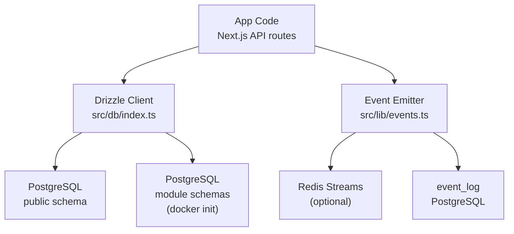
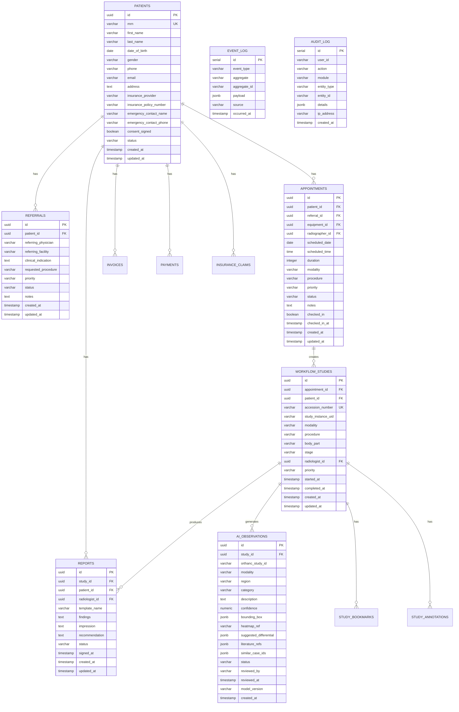
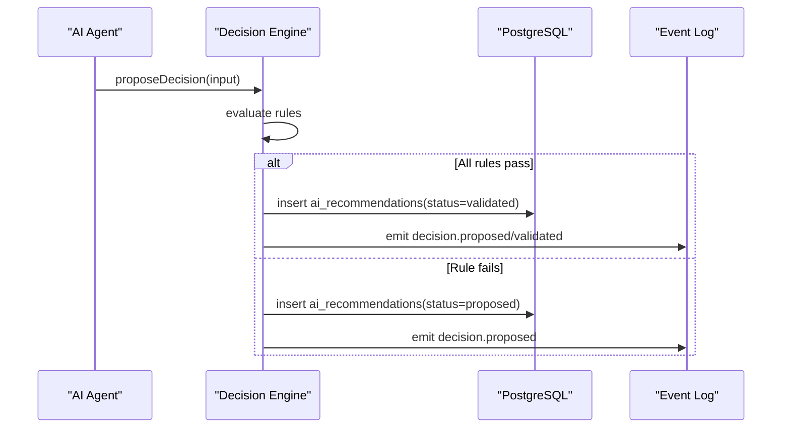
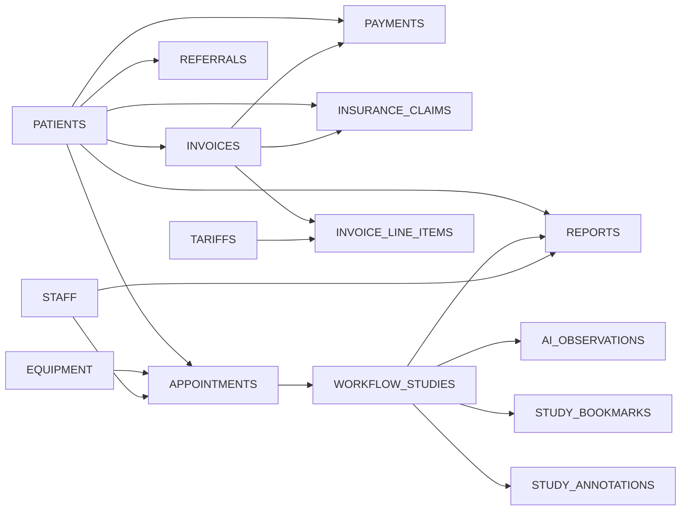

# Database Design

<cite>
**Referenced Files in This Document**
- [schema.ts](file://src/db/schema.ts)
- [0000_redundant_the_twelve.sql](file://drizzle/0000_redundant_the_twelve.sql)
- [init-schemas.sql](file://docker/postgres/init-schemas.sql)
- [index.ts](file://src/db/index.ts)
- [events.ts](file://src/lib/events.ts)
- [decision-engine.ts](file://src/lib/decision-engine.ts)
- [seed-new-modules.ts](file://src/lib/seed-new-modules.ts)
- [0000_snapshot.json](file://drizzle/meta/0000_snapshot.json)
</cite>

## Table of Contents
1. [Introduction](#introduction)
2. [Project Structure](#project-structure)
3. [Core Components](#core-components)
4. [Architecture Overview](#architecture-overview)
5. [Detailed Component Analysis](#detailed-component-analysis)
6. [Dependency Analysis](#dependency-analysis)
7. [Performance Considerations](#performance-considerations)
8. [Troubleshooting Guide](#troubleshooting-guide)
9. [Conclusion](#conclusion)
10. [Appendices](#appendices)

## Introduction
This document provides comprehensive data model documentation for the GeraldOS database schema. It covers entity relationships, field definitions, and data types across major tables including patients, appointments, workflow studies, reports, AI observations, and event logs. It also documents primary/foreign keys, constraints, validation rules enforced at the database level, Drizzle ORM access patterns, caching strategies, performance considerations, and data lifecycle and retention policies relevant to compliance.

## Project Structure
The database is defined using Drizzle ORM in a TypeScript schema file and materialized into PostgreSQL via migrations. A separate Docker initialization script provisions module-scoped schemas (auth, patient, scheduling, workflow, equipment, inventory, reporting, analytics). The application uses a Node.js Postgres pool and Drizzle client for type-safe queries. Event-driven persistence writes durable events to an event_log table with optional Redis Streams buffering.

**Diagram sources**
- [index.ts:1-25](file://src/db/index.ts#L1-L25)
- [events.ts:106-131](file://src/lib/events.ts#L106-L131)
- [init-schemas.sql:1-135](file://docker/postgres/init-schemas.sql#L1-L135)

**Section sources**
- [index.ts:1-25](file://src/db/index.ts#L1-L25)
- [init-schemas.sql:1-135](file://docker/postgres/init-schemas.sql#L1-L135)

## Core Components
GeraldOS organizes its data model around several core domains:

- Patient and Referral Management: patients, referrals
- Scheduling and Staffing: appointments, staff, equipment
- Clinical Workflow: workflow_studies, report_templates, report_versions, reports
- AI-Assisted Reporting: ai_observations, ai_recommendations
- Finance and Billing: tariffs, invoices, invoice_line_items, payments, insurance_claims, expenses
- Administration and Access Control: branches, employee_records, roles, system_settings
- Workspace and Collaboration: study_bookmarks, study_annotations
- Observability and Compliance: audit_log, event_log, notifications

Key characteristics:
- Primary keys are UUIDs for most entities; serial IDs used for append-only logs (audit_log, event_log).
- Many-to-one relationships link operational entities to patients, staff, equipment, and workflow studies.
- JSONB fields store flexible metadata (e.g., suggested_differential, rule_results, tags).
- Status fields enforce state machines through defaults and business rules.

**Section sources**
- [schema.ts:17-468](file://src/db/schema.ts#L17-L468)
- [0000_redundant_the_twelve.sql:1-470](file://drizzle/0000_redundant_the_twelve.sql#L1-L470)

## Architecture Overview
The data architecture combines a normalized relational model with flexible JSONB payloads and an event log for auditability. Drizzle ORM provides type-safe queries against the public schema, while Docker initialization creates module-scoped schemas for future modularization.

**Diagram sources**
- [schema.ts:17-468](file://src/db/schema.ts#L17-L468)
- [0000_redundant_the_twelve.sql:1-470](file://drizzle/0000_redundant_the_twelve.sql#L1-L470)

## Detailed Component Analysis

### Patients and Referrals
- Purpose: Capture demographic and contact information for patients and track referral context for imaging requests.
- Key fields:
  - patients.id (UUID PK), patients.mrn (unique identifier)
  - referrals.patient_id (FK to patients.id)
- Constraints and validation:
  - Not-null fields ensure essential demographics and referral details are always present.
  - Unique constraint on patients.mrn prevents duplicate patient records.
- Data integrity:
  - Foreign key from referrals to patients ensures every referral links to a valid patient.

**Section sources**
- [schema.ts:17-50](file://src/db/schema.ts#L17-L50)
- [0000_redundant_the_twelve.sql:267-315](file://drizzle/0000_redundant_the_twelve.sql#L267-L315)

### Appointments, Staff, and Equipment
- Purpose: Schedule imaging sessions, assign equipment and radiographers, and track check-in status.
- Key fields:
  - appointments.patient_id, appointments.referral_id, appointments.equipment_id, appointments.radiographer_id
  - staff.id (PK) and equipment.id (PK) referenced by appointments
- Constraints and validation:
  - Required fields include scheduled_date, scheduled_time, modality, procedure, priority, status.
  - Default values for duration, priority, and status streamline scheduling workflows.
- Data integrity:
  - Foreign keys enforce referential integrity between appointments and their referenced entities.

**Section sources**
- [schema.ts:53-100](file://src/db/schema.ts#L53-L100)
- [0000_redundant_the_twelve.sql:104-119](file://drizzle/0000_redundant_the_twelve.sql#L104-L119)
- [0000_redundant_the_twelve.sql:369-379](file://drizzle/0000_redundant_the_twelve.sql#L369-L379)
- [0000_redundant_the_twelve.sql:43-61](file://drizzle/0000_redundant_the_twelve.sql#L43-L61)

### Workflow Studies
- Purpose: Track the lifecycle of each imaging study from referral through completion.
- Key fields:
  - workflow_studies.appointment_id, workflow_studies.patient_id, workflow_studies.accession_number (unique)
  - workflow_studies.stage tracks progression; timestamps capture start/completion
- Constraints and validation:
  - Not-null fields for modality, procedure, priority, and stage ensure meaningful workflow entries.
  - Unique constraint on accession_number supports traceability.
- Data integrity:
  - Foreign keys to appointments, patients, and staff (radiologist) maintain consistency.

**Section sources**
- [schema.ts:103-119](file://src/db/schema.ts#L103-L119)
- [0000_redundant_the_twelve.sql:424-441](file://drizzle/0000_redundant_the_twelve.sql#L424-L441)

### Reports and Report Versions
- Purpose: Store radiology reports and version history for auditability and quality tracking.
- Key fields:
  - reports.study_id, reports.patient_id, reports.radiologist_id, reports.status, reports.signed_at
  - report_versions.report_id, report_versions.version, report_versions.ai_assisted
- Constraints and validation:
  - Not-null fields ensure required report content and status.
  - Versioning enables tracking changes and AI-assisted contributions.
- Data integrity:
  - Foreign keys to workflow_studies, patients, and staff ensure linkage to clinical context.

**Section sources**
- [schema.ts:167-180](file://src/db/schema.ts#L167-L180)
- [schema.ts:331-356](file://src/db/schema.ts#L331-L356)
- [0000_redundant_the_twelve.sql:344-357](file://drizzle/0000_redundant_the_twelve.sql#L344-L357)
- [0000_redundant_the_twelve.sql:330-342](file://drizzle/0000_redundant_the_twelve.sql#L330-L342)

### AI Observations and Recommendations
- Purpose: Record candidate findings surfaced by AI and decisions flowing through a governance pipeline.
- Key fields:
  - ai_observations.study_id, modality, category, description, confidence, status
  - ai_recommendations.agent, recommendation, rationale, priority, status, rule_results, validation_results
- Constraints and validation:
  - Not-null fields ensure critical AI metadata and status.
  - JSONB fields store structured suggestions and rule outcomes.
- Business rules:
  - Rules prevent autonomous diagnosis and unauthorized finalization of reports; STAT priority restricted to specific modules.

**Diagram sources**
- [decision-engine.ts:45-84](file://src/lib/decision-engine.ts#L45-L84)
- [0000_redundant_the_twelve.sql:22-41](file://drizzle/0000_redundant_the_twelve.sql#L22-L41)
- [events.ts:106-131](file://src/lib/events.ts#L106-L131)

**Section sources**
- [schema.ts:358-404](file://src/db/schema.ts#L358-L404)
- [0000_redundant_the_twelve.sql:1-41](file://drizzle/0000_redundant_the_twelve.sql#L1-L41)
- [decision-engine.ts:45-84](file://src/lib/decision-engine.ts#L45-L84)

### Finance: Tariffs, Invoices, Line Items, Payments, Claims, Expenses
- Purpose: Manage billing, payments, and insurance claims with detailed line items and tariff codes.
- Key fields:
  - tariffs.code (unique), invoices.invoice_number (unique), payments.receipt_number (unique), insurance_claims.claim_number (unique)
  - Numeric precision for monetary amounts ensures financial accuracy.
- Constraints and validation:
  - Not-null fields for critical financial data and statuses.
  - Unique identifiers prevent duplication of invoices, receipts, and claims.
- Data integrity:
  - Foreign keys link invoices to patients, studies, appointments; payments and claims to invoices and patients.

**Section sources**
- [schema.ts:196-284](file://src/db/schema.ts#L196-L284)
- [0000_redundant_the_twelve.sql:203-223](file://drizzle/0000_redundant_the_twelve.sql#L203-L223)
- [0000_redundant_the_twelve.sql:288-301](file://drizzle/0000_redundant_the_twelve.sql#L288-L301)
- [0000_redundant_the_twelve.sql:144-161](file://drizzle/0000_redundant_the_twelve.sql#L144-L161)

### Administration: Branches, Employee Records, Roles, System Settings
- Purpose: Support multi-branch operations, HR records, role-based permissions, and system configuration.
- Key fields:
  - branches.code (unique), employee_records.employee_number (unique), roles.name (unique)
  - system_settings.key serves as primary key for key-value configuration.
- Constraints and validation:
  - Not-null fields for essential administrative data.
  - Unique constraints ensure consistent identifiers across branches, employees, and roles.

**Section sources**
- [schema.ts:287-328](file://src/db/schema.ts#L287-L328)
- [0000_redundant_the_twelve.sql:75-86](file://drizzle/0000_redundant_the_twelve.sql#L75-L86)
- [0000_redundant_the_twelve.sql:88-102](file://drizzle/0000_redundant_the_twelve.sql#L88-L102)
- [0000_redundant_the_twelve.sql:359-367](file://drizzle/0000_redundant_the_twelve.sql#L359-L367)
- [0000_redundant_the_twelve.sql:403-408](file://drizzle/0000_redundant_the_twelve.sql#L403-L408)

### Workspace: Study Bookmarks and Annotations
- Purpose: Enable radiologists to mark and annotate studies for collaboration and review.
- Key fields:
  - study_bookmarks.user_id, study_id, orthanc_study_id
  - study_annotations.study_id, series_instance_uid, tool, data (JSONB)
- Constraints and validation:
  - Not-null fields for tool and data ensure meaningful annotations.
  - Optional orthanc_study_id links to external DICOM storage.

**Section sources**
- [schema.ts:424-444](file://src/db/schema.ts#L424-L444)
- [0000_redundant_the_twelve.sql:381-391](file://drizzle/0000_redundant_the_twelve.sql#L381-L391)
- [0000_redundant_the_twelve.sql:393-401](file://drizzle/0000_redundant_the_twelve.sql#L393-L401)

### Event Log and Audit Log
- Purpose: Provide durable, append-only records of system events and user actions for observability and compliance.
- Key fields:
  - event_log.event_type, aggregate, aggregate_id, payload (JSONB), source, occurred_at
  - audit_log.action, module, entity_type, entity_id, details (JSONB), ip_address
- Constraints and validation:
  - Not-null fields ensure essential event and audit metadata.
  - Serial IDs support efficient appends and pagination.

**Section sources**
- [schema.ts:183-193](file://src/db/schema.ts#L183-L193)
- [schema.ts:447-455](file://src/db/schema.ts#L447-L455)
- [0000_redundant_the_twelve.sql:63-73](file://drizzle/0000_redundant_the_twelve.sql#L63-L73)
- [0000_redundant_the_twelve.sql:121-129](file://drizzle/0000_redundant_the_twelve.sql#L121-L129)

## Dependency Analysis
Foreign key relationships define the core dependency graph:

**Diagram sources**
- [0000_redundant_the_twelve.sql:443-470](file://drizzle/0000_redundant_the_twelve.sql#L443-L470)

**Section sources**
- [0000_redundant_the_twelve.sql:443-470](file://drizzle/0000_redundant_the_twelve.sql#L443-L470)

## Performance Considerations
- Indexing strategy:
  - Add indexes on frequently queried foreign keys (e.g., appointments.patient_id, workflow_studies.patient_id, reports.patient_id) to optimize joins and filters.
  - Index unique identifiers like invoices.invoice_number, payments.receipt_number, insurance_claims.claim_number for fast lookups.
  - Consider composite indexes on workflow_studies(stage, priority) and appointments(scheduled_date, status) for common worklist queries.
- Query optimization:
  - Use Drizzle’s select with explicit columns to reduce payload size.
  - Leverage LIMIT and ORDER BY on indexed columns for paginated lists.
- Caching:
  - Event stream uses Redis Streams with MAXLEN cap for best-effort real-time delivery; event_log remains durable if Redis is down.
  - Cache read-heavy reference data (tariffs, equipment status) at the application layer with short TTLs.
- Storage:
  - JSONB fields should be used judiciously; addGIN indexes for frequent JSONB queries where appropriate.
- Concurrency:
  - Use transactions for multi-step operations (e.g., creating invoice + line items + payment) to maintain consistency.

[No sources needed since this section provides general guidance]

## Troubleshooting Guide
- Missing DATABASE_URL:
  - The Drizzle client throws an error if DATABASE_URL is not set; ensure environment variables are configured before starting services.
- Event write failures:
  - If event_log insertion fails, errors are logged; verify database connectivity and disk space.
- Decision engine rule violations:
  - When rules fail (e.g., unauthorized report signing), recommendations remain in proposed status; review rule_results and validation_results stored in ai_recommendations.
- Seed data issues:
  - Seeding scripts guard against re-insertion; check existing counts in event_log and other tables before running seed routines.

**Section sources**
- [index.ts:4-8](file://src/db/index.ts#L4-L8)
- [events.ts:106-131](file://src/lib/events.ts#L106-L131)
- [decision-engine.ts:45-84](file://src/lib/decision-engine.ts#L45-L84)
- [seed-new-modules.ts:158-178](file://src/lib/seed-new-modules.ts#L158-L178)

## Conclusion
GeraldOS employs a robust, normalized relational schema augmented by JSONB flexibility and an event-driven audit trail. The design enforces data integrity through foreign keys and unique constraints, while business rules in the decision engine safeguard clinical safety and compliance. Drizzle ORM provides type-safe access, and Redis Streams offer scalable event distribution. For production, implement targeted indexes, caching strategies, and retention policies to meet performance and compliance requirements.

[No sources needed since this section summarizes without analyzing specific files]

## Appendices

### Data Lifecycle and Retention Policies
- Event log:
  - Append-only record of system events; consider periodic archival or partitioning by occurred_at for long-term retention.
  - Redis Streams capped at a fixed length for real-time consumption; durable fallback ensures no loss of events.
- Audit log:
  - Immutable audit trail for user actions; retain per compliance policy (e.g., 7 years) and archive older records.
- Reports and versions:
  - Maintain version history for regulatory compliance; sign-off timestamps indicate finalization.
- Financial records:
  - Invoices, payments, and claims require long-term retention; ensure immutable storage and backup strategies.
- Patient and clinical data:
  - Follow HIPAA/GDPR guidelines; restrict access, encrypt sensitive fields, and implement data minimization.

[No sources needed since this section provides general guidance]

### Drizzle ORM Usage Patterns
- Connection pooling:
  - Pool configured via DATABASE_URL; reuse pool instance across requests in development.
- Type-safe queries:
  - Import schema models and use drizzle client for inserts, selects, updates with full type inference.
- Migrations:
  - Schema defined in TypeScript; migrations generated and applied to PostgreSQL.

**Section sources**
- [index.ts:1-25](file://src/db/index.ts#L1-L25)
- [0000_snapshot.json:1-800](file://drizzle/meta/0000_snapshot.json#L1-L800)