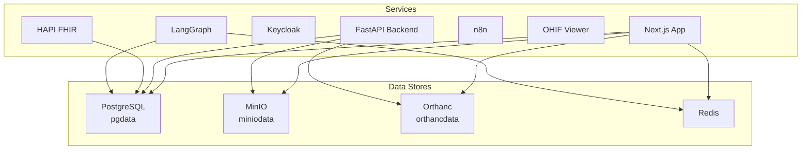
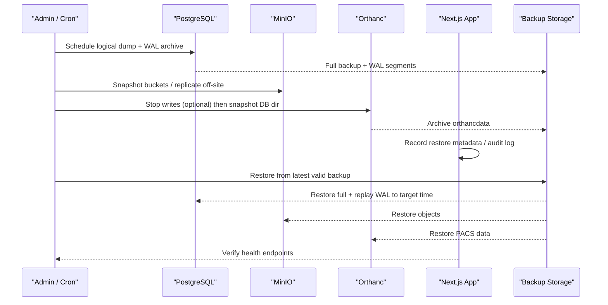
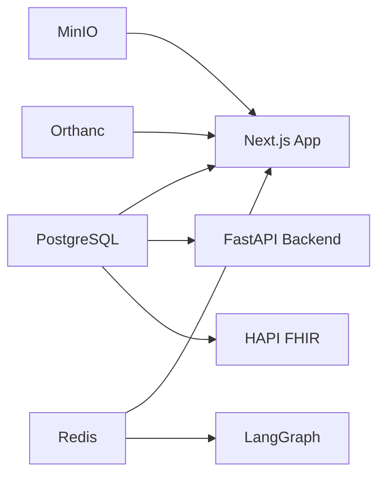

# Backup & Recovery

<cite>
**Referenced Files in This Document**
- [docker-compose.yml](file://docker-compose.yml)
- [init-schemas.sql](file://docker/postgres/init-schemas.sql)
- [config.py](file://backend/app/core/config.py)
- [session.py](file://backend/app/db/session.py)
- [index.ts (integrations)](file://src/lib/integrations/index.ts)
- [minio.ts](file://src/lib/integrations/minio.ts)
- [orthanc.json (production)](file://docker/orthanc/orthanc.json)
- [orthanc.json (services)](file://services/orthanc.json)
- [route.ts (Orthanc upload)](file://src/app/api/orthanc/upload/route.ts)
- [route.ts (Orthanc storage commitment)](file://src/app/api/orthanc/storage-commitment/route.ts)
- [route.ts (Orthanc health)](file://src/app/api/orthanc/health/route.ts)
- [start-all.sh](file://services/start-all.sh)
- [drizzle.config.json](file://drizzle.config.json)
- [0000_redundant_the_twelve.sql](file://drizzle/0000_redundant_the_twelve.sql)
</cite>

## Table of Contents
1. Introduction
2. Project Structure
3. Core Components
4. Architecture Overview
5. Detailed Component Analysis
6. Dependency Analysis
7. Performance Considerations
8. Troubleshooting Guide
9. Conclusion
10. Appendices

## Introduction
This document defines backup and recovery procedures for the GeraldOS platform, focusing on:
- PostgreSQL database backups (automated schedules, incremental backups via WAL archiving, point-in-time recovery)
- DICOM image archival in MinIO and Orthanc PACS data management
- Application state preservation across services
- Disaster recovery procedures, restoration workflows, and integrity testing
- Encryption, off-site storage options, and healthcare compliance considerations
- Runbooks for emergency recovery scenarios and data corruption incidents

## Project Structure
GeraldOS deploys a containerized stack with persistent volumes for critical data stores:
- PostgreSQL: application relational data and audit logs
- MinIO: object storage for DICOM images and related artifacts
- Orthanc: PACS server storing DICOM instances and indexes
- Redis: cache and queues
- Keycloak: identity provider
- HAPI FHIR: clinical interoperability
- n8n: workflow automation
- OHIF: web viewer
- LangGraph: agent runtime

**Diagram sources**
- [docker-compose.yml:4-117](file://docker-compose.yml#L4-L117)

**Section sources**
- [docker-compose.yml:4-117](file://docker-compose.yml#L4-L117)

## Core Components
- PostgreSQL: Relational store for patient, scheduling, workflow, inventory, reporting, analytics, and audit data. Schemas are initialized at startup.
- MinIO: Object storage used by the application to manage DICOM-related files and presigned uploads.
- Orthanc: PACS server configured with plugins; can use PostgreSQL for index/storage or local file storage depending on configuration.
- Integration layer: Central configuration and health checks for all services, including Orthanc authentication headers and MinIO client setup.

**Section sources**
- [init-schemas.sql:1-135](file://docker/postgres/init-schemas.sql#L1-L135)
- [config.py:4-19](file://backend/app/core/config.py#L4-L19)
- [index.ts (integrations):8-52](file://src/lib/integrations/index.ts#L8-L52)
- [minio.ts:4-27](file://src/lib/integrations/minio.ts#L4-L27)
- [orthanc.json (production):1-21](file://docker/orthanc/orthanc.json#L1-L21)
- [orthanc.json (services):1-16](file://services/orthanc.json#L1-L16)

## Architecture Overview
Backup and recovery spans multiple layers:
- Database backups: logical dumps and WAL-based continuous archiving for PITR
- Object storage backups: MinIO bucket snapshots and replication
- PACS backups: Orthanc storage directory and index backups
- Application state: environment configuration and service orchestration scripts

**Diagram sources**
- [docker-compose.yml:4-117](file://docker-compose.yml#L4-L117)
- [index.ts (integrations):134-267](file://src/lib/integrations/index.ts#L134-L267)

## Detailed Component Analysis

### PostgreSQL Backup Strategy
- Logical backups: Use pg_dump to export schemas and data for application databases. Schedule frequent full dumps and periodic schema-only dumps to track DDL changes.
- Incremental backups: Enable WAL archiving to capture every transaction. Combine with base backups to enable point-in-time recovery (PITR).
- Point-in-time recovery: Restore the latest base backup and replay WAL segments up to the desired timestamp.

Operational notes:
- Ensure pg_basebackup is available and WAL level set to "replica".
- Archive WALs to secure off-site storage with encryption.
- Maintain retention policies aligned with healthcare compliance.

**Section sources**
- [init-schemas.sql:1-135](file://docker/postgres/init-schemas.sql#L1-L135)
- [config.py:4-19](file://backend/app/core/config.py#L4-L19)
- [session.py:1-17](file://backend/app/db/session.py#L1-L17)
- [drizzle.config.json:1-7](file://drizzle.config.json#L1-L7)
- [0000_redundant_the_twelve.sql:1-470](file://drizzle/0000_redundant_the_twelve.sql#L1-L470)

### MinIO Data Archival
- Bucket-level snapshots: Periodically snapshot MinIO buckets to off-site storage using S3-compatible tools.
- Replication: Configure cross-cluster replication to an external MinIO cluster or compatible object store for geographic redundancy.
- Integrity verification: Validate checksums and list objects post-restore to ensure completeness.

Operational notes:
- Use presigned URLs for controlled uploads and downloads.
- Apply lifecycle policies to archive older objects to cheaper tiers if supported.

**Section sources**
- [minio.ts:4-27](file://src/lib/integrations/minio.ts#L4-L27)
- [index.ts (integrations):42-48](file://src/lib/integrations/index.ts#L42-L48)

### Orthanc PACS Data Management
- Storage mode: Depending on configuration, Orthanc may store DICOM instances locally or leverage PostgreSQL via plugins.
- Backup approach:
  - If using local storage: Snapshot the Orthanc storage directory consistently while pausing incoming DICOM transfers.
  - If using PostgreSQL storage: Back up the same PostgreSQL instance used by Orthanc along with application data.
- Index consistency: Ensure index and storage directories are backed up together to maintain referential integrity.

Operational notes:
- Use DICOMweb endpoints for verification and retrieval during restore tests.
- Leverage storage commitment endpoints to confirm safe storage before decommissioning modalities.

**Section sources**
- [orthanc.json (production):1-21](file://docker/orthanc/orthanc.json#L1-L21)
- [orthanc.json (services):1-16](file://services/orthanc.json#L1-L16)
- [route.ts (Orthanc upload):1-34](file://src/app/api/orthanc/upload/route.ts#L1-L34)
- [route.ts (Orthanc storage commitment):1-39](file://src/app/api/orthanc/storage-commitment/route.ts#L1-L39)

### Application State Preservation
- Configuration: Environment variables define service endpoints and credentials; preserve these securely.
- Service orchestration: Startup scripts initialize dependencies and verify readiness; include them in recovery runbooks.
- Audit logging: Capture restore events and operational actions for compliance.

**Section sources**
- [config.py:4-19](file://backend/app/core/config.py#L4-L19)
- [index.ts (integrations):8-52](file://src/lib/integrations/index.ts#L8-L52)
- [start-all.sh:1-100](file://services/start-all.sh#L1-L100)

### Disaster Recovery Procedures
- RTO/RPO targets: Define acceptable recovery time objectives and recovery point objectives per data class.
- Orchestration:
  - Restore PostgreSQL from base backup + WAL to target time.
  - Restore MinIO buckets from replicated snapshots.
  - Restore Orthanc storage/index consistent with application expectations.
  - Restart services and validate health endpoints.
- Validation:
  - Run integration health checks against all services.
  - Perform sample queries and DICOM retrievals to confirm data integrity.

**Section sources**
- [index.ts (integrations):134-267](file://src/lib/integrations/index.ts#L134-L267)
- [route.ts (Orthanc health):1-30](file://src/app/api/orthanc/health/route.ts#L1-L30)

### Data Restoration Workflows
- Database restore:
  - Drop or recreate target database/schema.
  - Load logical backup.
  - Replay WAL to exact point-in-time if required.
- Object storage restore:
  - Rehydrate buckets from snapshots.
  - Verify object counts and checksums.
- PACS restore:
  - Restore Orthanc storage and index directories.
  - Confirm DICOMweb availability and study retrieval.

**Section sources**
- [init-schemas.sql:1-135](file://docker/postgres/init-schemas.sql#L1-L135)
- [orthanc.json (production):1-21](file://docker/orthanc/orthanc.json#L1-L21)

### Testing Backup Integrity
- Automated checks:
  - Schedule dry-run restores to isolated environments.
  - Validate database schema and row counts.
  - Test MinIO bucket listing and object access.
  - Exercise Orthanc health and sample study retrieval.
- Reporting:
  - Log results and alert on failures.
  - Track test timestamps and versions for audit trails.

**Section sources**
- [index.ts (integrations):134-267](file://src/lib/integrations/index.ts#L134-L267)
- [route.ts (Orthanc health):1-30](file://src/app/api/orthanc/health/route.ts#L1-L30)

### Backup Encryption and Off-Site Storage
- Encryption:
  - Encrypt backups at rest using OS-level or tool-native encryption.
  - Secure WAL archives and object storage copies with TLS and IAM policies.
- Off-site storage:
  - Replicate MinIO buckets to another region or cloud provider.
  - Store PostgreSQL WAL archives and logical dumps in geographically redundant storage.
- Compliance:
  - Enforce retention periods per healthcare regulations.
  - Maintain immutable backups where possible.

[No sources needed since this section provides general guidance]

### Compliance Requirements for Healthcare Data Retention
- Retention: Align backup retention with legal and regulatory requirements for medical records and audit logs.
- Access control: Restrict backup access to authorized personnel; enforce least privilege.
- Auditability: Record backup and restore activities with timestamps and operator identities.

[No sources needed since this section provides general guidance]

### Runbooks for Emergency Recovery Scenarios

#### Scenario A: Database Corruption
- Steps:
  - Isolate affected services.
  - Identify last known good backup and WAL segment range.
  - Restore PostgreSQL to pre-corruption point-in-time.
  - Validate schema and critical tables.
  - Restart dependent services and re-index if necessary.
- Verification:
  - Run integration health checks.
  - Execute sample queries and workflow validations.

**Section sources**
- [init-schemas.sql:1-135](file://docker/postgres/init-schemas.sql#L1-L135)
- [index.ts (integrations):134-267](file://src/lib/integrations/index.ts#L134-L267)

#### Scenario B: MinIO Data Loss
- Steps:
  - Halt new uploads temporarily.
  - Restore buckets from latest replicated snapshot.
  - Verify object counts and checksums.
  - Resume uploads and notify stakeholders.
- Verification:
  - List buckets and sample object retrieval.

**Section sources**
- [minio.ts:4-27](file://src/lib/integrations/minio.ts#L4-L27)

#### Scenario C: Orthanc PACS Failure
- Steps:
  - Stop incoming DICOM transfers.
  - Restore Orthanc storage and index directories.
  - Start Orthanc and confirm DICOMweb endpoints.
  - Trigger storage commitment checks for recent studies.
- Verification:
  - Retrieve sample studies via DICOMweb.
  - Confirm health endpoint responses.

**Section sources**
- [orthanc.json (production):1-21](file://docker/orthanc/orthanc.json#L1-L21)
- [route.ts (Orthanc storage commitment):1-39](file://src/app/api/orthanc/storage-commitment/route.ts#L1-L39)
- [route.ts (Orthanc health):1-30](file://src/app/api/orthanc/health/route.ts#L1-L30)

#### Scenario D: Full Platform Outage
- Steps:
  - Restore PostgreSQL to latest valid point-in-time.
  - Restore MinIO buckets from off-site replicas.
  - Restore Orthanc storage/index.
  - Start services in dependency order and validate health endpoints.
  - Conduct smoke tests across modules (patient lookup, study retrieval, report generation).
- Verification:
  - End-to-end health checks and sample transactions.

**Section sources**
- [docker-compose.yml:4-117](file://docker-compose.yml#L4-L117)
- [index.ts (integrations):134-267](file://src/lib/integrations/index.ts#L134-L267)

## Dependency Analysis
The platform’s backup surface includes interdependent components:
- PostgreSQL underpins application logic, FHIR, and potentially Orthanc indexing/storage.
- MinIO hosts DICOM artifacts referenced by workflows and reports.
- Orthanc manages DICOM instances and exposes DICOMweb APIs consumed by the app and viewers.
- Health checks provide a unified view of service status to guide recovery sequencing.

**Diagram sources**
- [docker-compose.yml:4-117](file://docker-compose.yml#L4-L117)
- [index.ts (integrations):134-267](file://src/lib/integrations/index.ts#L134-L267)

**Section sources**
- [docker-compose.yml:4-117](file://docker-compose.yml#L4-L117)
- [index.ts (integrations):134-267](file://src/lib/integrations/index.ts#L134-L267)

## Performance Considerations
- Schedule backups during low-traffic windows to minimize impact.
- Use streaming compression for logical dumps to reduce I/O.
- Parallelize object storage replication where supported.
- Monitor WAL generation rates and adjust archiving frequency accordingly.
- Avoid concurrent heavy operations during restore windows.

[No sources needed since this section provides general guidance]

## Troubleshooting Guide
- Health monitoring:
  - Use integration health endpoints to detect unreachable or misconfigured services.
  - Inspect latency and error details returned by health checks.
- Common issues:
  - Missing environment variables for service endpoints or credentials.
  - Network connectivity problems between services.
  - Inconsistent Orthanc storage/index after partial restores.
- Diagnostics:
  - Review service logs and health endpoint outputs.
  - Validate database connectivity and schema presence.
  - Confirm MinIO bucket existence and object accessibility.

**Section sources**
- [index.ts (integrations):134-267](file://src/lib/integrations/index.ts#L134-L267)
- [route.ts (Orthanc health):1-30](file://src/app/api/orthanc/health/route.ts#L1-L30)

## Conclusion
A robust backup and recovery strategy for GeraldOS requires coordinated protection of PostgreSQL, MinIO, and Orthanc, complemented by rigorous testing, encryption, off-site replication, and clear runbooks. By aligning procedures with healthcare compliance and maintaining comprehensive health monitoring, the platform can achieve reliable disaster recovery and minimal downtime.

[No sources needed since this section summarizes without analyzing specific files]

## Appendices

### Appendix A: Backup Schedules and Retention
- PostgreSQL:
  - Daily full logical backups.
  - Continuous WAL archiving with retention aligned to compliance.
- MinIO:
  - Hourly/daily snapshots with off-site replication.
- Orthanc:
  - Consistent snapshots of storage/index directories; frequency based on RPO.

[No sources needed since this section provides general guidance]

### Appendix B: Restore Validation Checklist
- Database: Schema present, critical tables populated, queries succeed.
- Object storage: Buckets restored, object counts match, checksums verified.
- PACS: DICOMweb endpoints reachable, sample studies retrievable.
- Services: All health endpoints return connected status.

[No sources needed since this section provides general guidance]