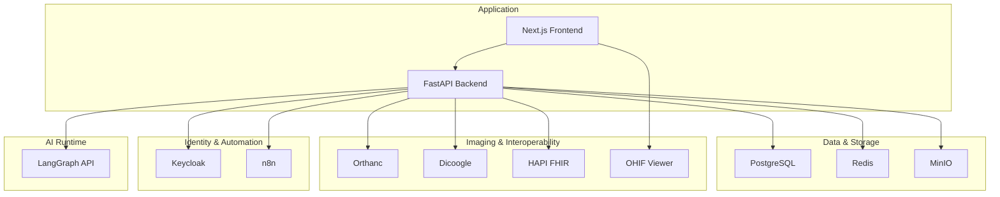
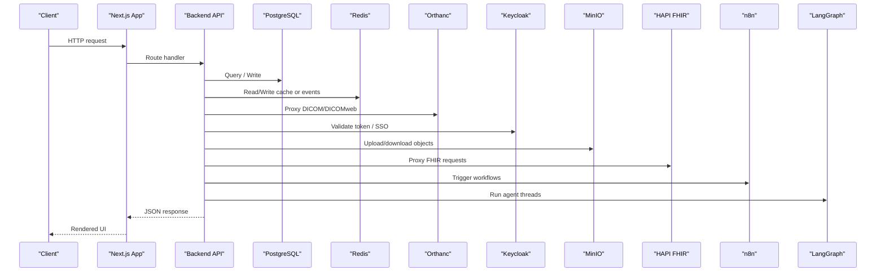
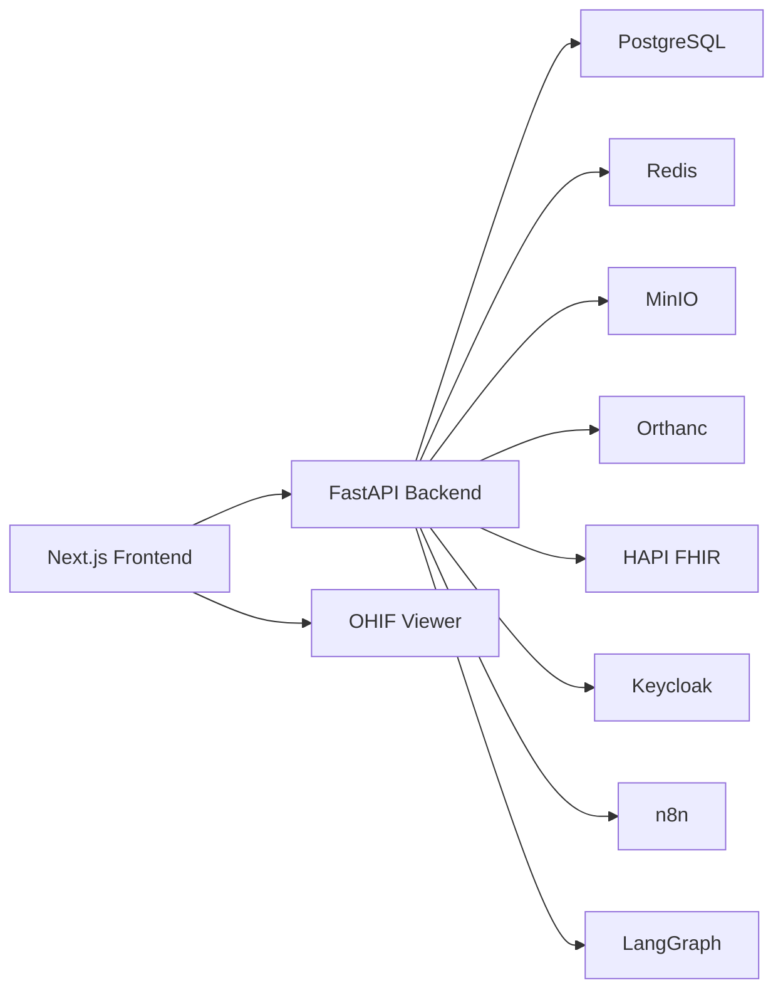

# Deployment & Operations

<cite>
**Referenced Files in This Document**
- [docker-compose.yml](file://docker-compose.yml)
- [backend/Dockerfile](file://backend/Dockerfile)
- [frontend/Dockerfile](file://frontend/Dockerfile)
- [services/start-all.sh](file://services/start-all.sh)
- [scripts/start-services.sh](file://scripts/start-services.sh)
- [backend/app/core/config.py](file://backend/app/core/config.py)
- [src/app/api/health/route.ts](file://src/app/api/health/route.ts)
- [src/app/api/integrations/status/route.ts](file://src/app/api/integrations/status/route.ts)
- [src/lib/integrations/index.ts](file://src/lib/integrations/index.ts)
- [drizzle.config.json](file://drizzle.config.json)
- [package.json](file://package.json)
- [README.md](file://README.md)
</cite>

## Table of Contents
1. Introduction
2. Project Structure
3. Core Components
4. Architecture Overview
5. Detailed Component Analysis
6. Dependency Analysis
7. Performance Considerations
8. Troubleshooting Guide
9. Conclusion
10. Appendices

## Introduction
This document provides deployment and operations guidance for the GeraldOS platform, covering container orchestration with Docker Compose, environment configuration, service dependencies, startup procedures, production strategies, scaling considerations, monitoring, health checks, logging, backups, troubleshooting, performance tuning, operational best practices, security, runbooks, incident response, and disaster recovery.

GeraldOS is an AI-native diagnostic imaging operations platform that orchestrates patient workflows, scheduling, imaging, reporting, and AI agents while delegating storage to Orthanc, image display to OHIF, identity to Keycloak, automation to n8n, and agent reasoning to LangGraph.

**Section sources**
- [README.md:1-23](file://README.md#L1-L23)

## Project Structure
The platform is composed of a Next.js frontend, a FastAPI backend, and multiple integration services (PostgreSQL, Redis, MinIO, Orthanc, Keycloak, HAPI FHIR, Dicoogle, n8n, OHIF, LangGraph). The repository includes:
- Container definitions and volumes via Docker Compose
- Service start scripts for local or embedded environments
- Backend configuration via environment variables
- Health and integration status endpoints for monitoring
- Database schema and migration tooling

**Diagram sources**
- [docker-compose.yml:4-110](file://docker-compose.yml#L4-L110)
- [backend/Dockerfile:1-20](file://backend/Dockerfile#L1-L20)
- [frontend/Dockerfile:1-28](file://frontend/Dockerfile#L1-L28)

**Section sources**
- [docker-compose.yml:1-118](file://docker-compose.yml#L1-L118)
- [backend/Dockerfile:1-20](file://backend/Dockerfile#L1-L20)
- [frontend/Dockerfile:1-28](file://frontend/Dockerfile#L1-L28)

## Core Components
- PostgreSQL: Primary relational database with Drizzle ORM migrations and seed data.
- Redis: Cache and event streaming backbone used by integrations and agents.
- MinIO: Object storage for documents and artifacts; auto-created default bucket on first use.
- Orthanc: PACS server providing DICOM and DICOMweb APIs; authenticated access configured.
- Keycloak: OIDC provider for authentication and session management.
- HAPI FHIR: Clinical interoperability endpoint proxying FHIR R4 resources.
- Dicoogle: Search proxy for indexed studies.
- n8n: Workflow automation with webhooks and triggers.
- OHIF: Web-based medical image viewer deep-linked from the platform.
- LangGraph: Agent runtime for AI-driven workflows and reasoning.

Environment variables drive service connectivity and credentials. The backend reads configuration from environment variables and uses them to connect to all external services.

**Section sources**
- [docker-compose.yml:4-110](file://docker-compose.yml#L4-L110)
- [backend/app/core/config.py:1-20](file://backend/app/core/config.py#L1-L20)
- [README.md:66-89](file://README.md#L66-L89)

## Architecture Overview
The platform exposes a unified Next.js UI and API layer that proxies and orchestrates calls to specialized services. Health and integration status are exposed via dedicated endpoints for liveness/readiness and dependency monitoring.

**Diagram sources**
- [docker-compose.yml:4-110](file://docker-compose.yml#L4-L110)
- [src/app/api/integrations/status/route.ts:1-43](file://src/app/api/integrations/status/route.ts#L1-L43)
- [src/lib/integrations/index.ts:92-266](file://src/lib/integrations/index.ts#L92-L266)

## Detailed Component Analysis

### Docker Compose Orchestration
- Services: PostgreSQL, Redis, MinIO, Orthanc, Keycloak, HAPI FHIR, Dicoogle, n8n, OHIF, LangGraph.
- Health checks: Built-in checks for Postgres, Redis, MinIO, Orthanc, and n8n ensure readiness before dependent services start.
- Volumes: Persistent data for Postgres, MinIO, Orthanc, Keycloak, and n8n.
- Ports: Each service exposes its port for local development; adjust for production ingress.

Operational notes:
- Use secrets management for sensitive values (e.g., MinIO root credentials, Keycloak admin password).
- Pin images to specific versions for reproducibility.
- Configure resource limits and restart policies per service.

**Section sources**
- [docker-compose.yml:4-110](file://docker-compose.yml#L4-L110)

### Environment Variable Configuration
- Backend settings include database URL, Redis URL, MinIO endpoint and keys, Keycloak URL and realm, Orthanc URL, FHIR URL, and optional AI keys.
- The backend loads these via a settings class with an environment file reference.
- Drizzle config points to the PostgreSQL connection string for migrations.

Best practices:
- Store secrets in a secure vault or CI/CD secret store.
- Separate dev/staging/prod environments using distinct .env files or platform secret managers.
- Validate required variables at startup and fail fast if missing.

**Section sources**
- [backend/app/core/config.py:1-20](file://backend/app/core/config.py#L1-L20)
- [drizzle.config.json:1-8](file://drizzle.config.json#L1-L8)

### Service Dependencies and Startup Procedures
- Local/embedded startup scripts start Redis, Orthanc, MinIO, Keycloak, FHIR, Dicoogle, n8n, OHIF, and LangGraph with readiness probes and logs.
- Docker Compose manages lifecycle and health checks for orchestrated deployments.

Recommended procedure:
- For containers: docker compose up -d, then apply schema and seed data.
- For bare metal: execute the provided start script to bootstrap services and verify health endpoints.

**Section sources**
- [services/start-all.sh:1-100](file://services/start-all.sh#L1-L100)
- [scripts/start-services.sh:1-93](file://scripts/start-services.sh#L1-L93)
- [README.md:47-64](file://README.md#L47-L64)

### Monitoring and Health Checks
- Application health: A simple endpoint verifies database connectivity.
- Integration status: Aggregates health of Postgres, Redis, MinIO, Orthanc, FHIR, n8n, and LangGraph with latency metrics and status categories (connected, unreachable, not_configured).

Operational usage:
- Expose /api/health for liveness probes.
- Expose /api/integrations/status for readiness and dependency dashboards.
- Integrate with your monitoring stack to scrape these endpoints.

**Section sources**
- [src/app/api/health/route.ts:1-14](file://src/app/api/health/route.ts#L1-L14)
- [src/app/api/integrations/status/route.ts:1-43](file://src/app/api/integrations/status/route.ts#L1-L43)
- [src/lib/integrations/index.ts:92-266](file://src/lib/integrations/index.ts#L92-L266)

### Logging Strategy
- Each service writes logs to well-known locations or stdout/stderr when containerized.
- Start scripts capture logs under temporary directories for local runs.
- Centralize logs via a log aggregation pipeline (e.g., journald + vector/fluent-bit, or cloud logging).

Recommendations:
- Enable structured logging where supported.
- Correlate logs across services using request IDs or trace IDs.
- Retain logs according to compliance requirements.

**Section sources**
- [services/start-all.sh:1-100](file://services/start-all.sh#L1-L100)
- [scripts/start-services.sh:1-93](file://scripts/start-services.sh#L1-L93)

### Backup Procedures
- PostgreSQL: Use native tools (e.g., pg_dump or WAL archiving) to back up the application database regularly.
- MinIO: Back up buckets containing documents and artifacts; consider versioning and replication.
- Orthanc: Back up the Orthanc database directory for study metadata and indices.
- Keycloak: Export realms and client configurations periodically.
- n8n: Back up workflow definitions and credentials stored within n8n.

Operational tips:
- Automate backups with cron or job schedulers.
- Test restore procedures regularly.
- Encrypt backups at rest and in transit.

[No sources needed since this section provides general guidance]

### Production Deployment Strategies
- Container orchestration: Prefer Kubernetes or managed container platforms for HA, autoscaling, and rolling updates.
- Ingress and TLS: Terminate TLS at the ingress controller; route traffic to the Next.js app and reverse-proxy to internal services.
- Secrets: Use platform-native secret stores; avoid committing secrets to repositories.
- Config management: Externalize configuration via environment variables or config maps/secrets.
- Observability: Deploy metrics, tracing, and centralized logging.

[No sources needed since this section provides general guidance]

### Scaling Considerations
- Stateless services: Next.js and FastAPI can scale horizontally behind a load balancer.
- Stateful services: Ensure PostgreSQL, Redis, MinIO, and Orthanc are provisioned with appropriate capacity and HA configurations.
- Connection pooling: Tune database and Redis connection pools based on workload.
- Caching: Leverage Redis for caching and queues to reduce load on downstream services.

[No sources needed since this section provides general guidance]

### Security Considerations
- Credentials: Keep service credentials server-side; only expose whitelisted non-secret configuration to clients.
- Authentication: Use Keycloak OIDC flows; validate tokens and issue secure sessions.
- Network: Restrict service-to-service communication to necessary ports; use private networks where possible.
- Compliance: Enforce audit logging for sensitive actions and maintain immutable logs.

**Section sources**
- [README.md:115-121](file://README.md#L115-L121)

### Operational Best Practices
- Version pinning: Pin service images and dependencies to known-good versions.
- Health checks: Implement liveness and readiness probes for all services.
- Graceful shutdowns: Handle SIGTERM to finish in-flight requests and flush logs.
- Rollouts: Use blue/green or canary deployments to minimize risk.
- Documentation: Maintain runbooks for common tasks and incidents.

[No sources needed since this section provides general guidance]

## Dependency Analysis
The following diagram shows key runtime dependencies between services as defined in the orchestration and configuration.

**Diagram sources**
- [docker-compose.yml:4-110](file://docker-compose.yml#L4-L110)
- [backend/app/core/config.py:1-20](file://backend/app/core/config.py#L1-L20)

**Section sources**
- [docker-compose.yml:4-110](file://docker-compose.yml#L4-L110)
- [backend/app/core/config.py:1-20](file://backend/app/core/config.py#L1-L20)

## Performance Considerations
- Database: Tune connection limits, query plans, and indexes; monitor slow queries.
- Redis: Set appropriate memory policies and persistence options; monitor hit rates.
- MinIO: Use adequate disk I/O and network bandwidth; enable erasure coding for durability.
- Orthanc: Optimize indexing and storage backends; monitor queue lengths.
- Application: Use connection pooling, caching, and asynchronous processing where applicable.

[No sources needed since this section provides general guidance]

## Troubleshooting Guide
Common issues and diagnostics:
- Database connectivity failures: Check PostgreSQL health and credentials; review connection strings and network policies.
- Redis outages: Verify Redis availability and memory usage; inspect event stream consumers.
- Object storage errors: Confirm MinIO health and bucket existence; validate credentials and CORS if needed.
- PACS/FHIR unreachability: Inspect service endpoints and authentication headers; check proxy routes.
- Identity provider misconfiguration: Validate Keycloak realm URLs, client IDs, and scopes.
- Integration status: Use the integration status endpoint to identify unhealthy dependencies and latencies.

Runbook steps:
- Verify service health via Docker Compose or kubectl.
- Review service logs for errors and stack traces.
- Temporarily disable non-critical integrations to isolate issues.
- Re-run schema migrations if database state drift occurs.

**Section sources**
- [src/app/api/integrations/status/route.ts:1-43](file://src/app/api/integrations/status/route.ts#L1-L43)
- [src/lib/integrations/index.ts:92-266](file://src/lib/integrations/index.ts#L92-L266)

## Conclusion
GeraldOS integrates multiple specialized services into a cohesive platform for diagnostic imaging operations. Robust deployment relies on clear environment configuration, reliable health checks, centralized logging, and disciplined backup and security practices. Use the provided scripts and Docker Compose for local development and adapt to container orchestration for production. Monitor health continuously and follow the runbooks for routine operations and incident response.

[No sources needed since this section summarizes without analyzing specific files]

## Appendices

### Quick Start
- Start the approved stack with Docker Compose.
- Configure environment variables and apply schema.
- Seed demo data and start the application.

**Section sources**
- [README.md:47-64](file://README.md#L47-L64)

### Build and Run Scripts
- Development and build commands are defined in package scripts.

**Section sources**
- [package.json:1-62](file://package.json#L1-L62)