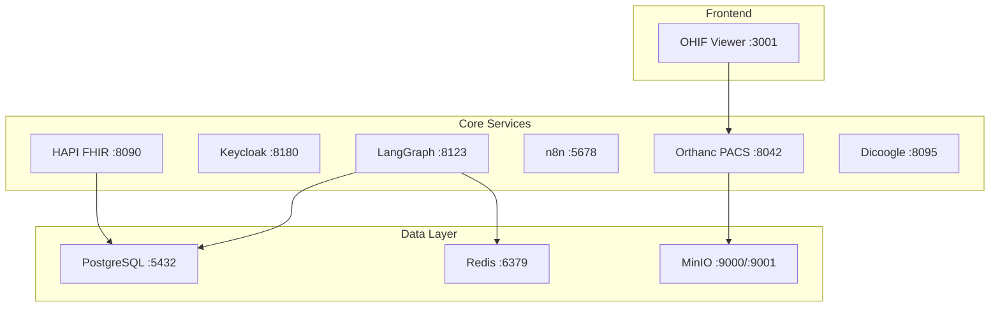
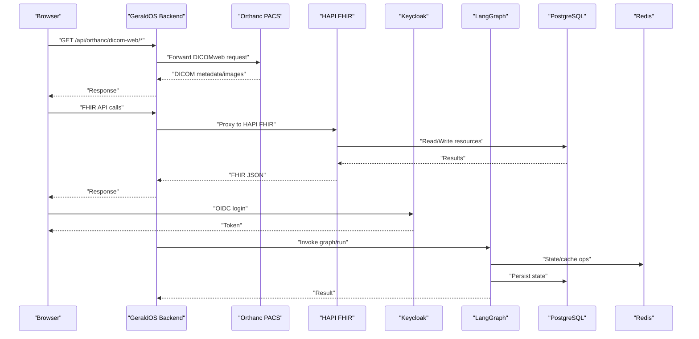
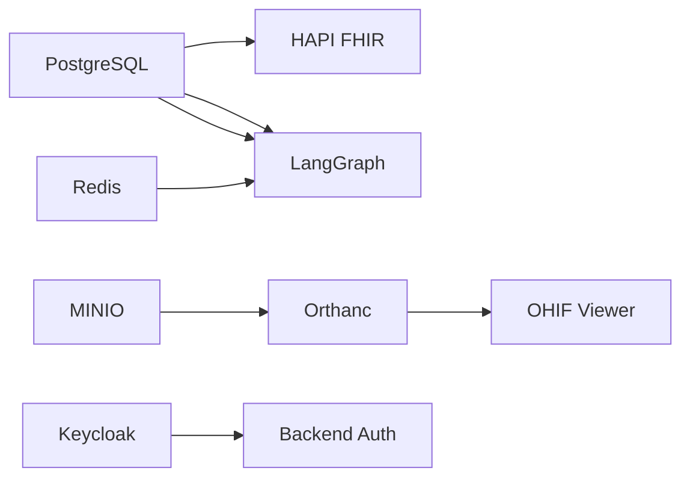

# Docker Configuration

<cite>
**Referenced Files in This Document**
- [docker-compose.yml](file://docker-compose.yml)
- [start-all.sh](file://services/start-all.sh)
- [orthanc.json](file://services/orthanc.json)
- [init-schemas.sql](file://docker/postgres/init-schemas.sql)
- [app-config.js](file://ohif-config/app-config.js)
- [keycloak.mjs](file://services/keycloak.mjs)
- [fhir.mjs](file://services/fhir.mjs)
- [n8n.mjs](file://services/n8n.mjs)
- [dicoogle.mjs](file://services/dicoogle.mjs)
- [ohif.mjs](file://services/ohif.mjs)
- [backend/Dockerfile](file://backend/Dockerfile)
- [frontend/Dockerfile](file://frontend/Dockerfile)
</cite>

## Table of Contents
1. Introduction
2. Project Structure
3. Core Components
4. Architecture Overview
5. Detailed Component Analysis
6. Dependency Analysis
7. Performance Considerations
8. Troubleshooting Guide
9. Conclusion

## Introduction
This document provides comprehensive Docker configuration documentation for the GeraldOS platform. It covers the complete docker-compose setup, service dependencies, networking, volumes, environment variables, health checks, resource limits, and scaling considerations. It also details custom configurations for Orthanc PACS, PostgreSQL initialization scripts, and service-specific environment variables, along with troubleshooting guidance and performance optimization tips.

## Project Structure
The deployment is orchestrated via a single docker-compose file that defines all runtime services: PostgreSQL, Redis, MinIO, Orthanc PACS, Keycloak, HAPI FHIR, n8n, OHIF viewer, LangGraph, and an optional Dicoogle service. Additional helper scripts and configuration files are provided to bootstrap or customize services during development or local runs.

**Diagram sources**
- [docker-compose.yml:4-111](file://docker-compose.yml#L4-L111)

**Section sources**
- [docker-compose.yml:1-118](file://docker-compose.yml#L1-L118)

## Core Components
- PostgreSQL: Primary relational database with schema initialization script. Health-checked via pg_isready.
- Redis: In-memory cache used by LangGraph and other components. Health-checked via redis-cli ping.
- MinIO: Object storage for DICOM and assets. Health-checked via HTTP endpoint.
- Orthanc PACS: DICOM archive and DICOMweb provider. Health-checked via /system.
- Keycloak: Identity provider (development mode). Exposes OIDC endpoints.
- HAPI FHIR: FHIR server backed by PostgreSQL. Depends on healthy Postgres.
- n8n: Workflow automation engine. Health-checked via /healthz.
- OHIF Viewer: DICOM viewer configured to proxy through the application’s DICOMweb routes.
- LangGraph: AI agent runtime using Redis and PostgreSQL. Health-checked via /ok.
- Dicoogle: Optional DICOM search/index service.

Environment variables and ports are defined per service in the compose file. Volumes persist data across restarts.

**Section sources**
- [docker-compose.yml:4-111](file://docker-compose.yml#L4-L111)
- [init-schemas.sql:1-135](file://docker/postgres/init-schemas.sql#L1-L135)

## Architecture Overview
The platform integrates clinical imaging, identity, interoperability, workflow automation, and AI orchestration into a cohesive stack. The browser-based OHIF viewer communicates with the backend proxy for DICOMweb operations, while HAPI FHIR exposes clinical data via FHIR R4. Keycloak provides authentication and authorization. LangGraph orchestrates AI workflows using Redis and PostgreSQL.

**Diagram sources**
- [docker-compose.yml:4-111](file://docker-compose.yml#L4-L111)
- [app-config.js:13-48](file://ohif-config/app-config.js#L13-L48)

## Detailed Component Analysis

### PostgreSQL
- Purpose: Relational store for app data and FHIR persistence.
- Initialization: Schema creation script defines module-scoped schemas and tables for auth, patient, scheduling, workflow, equipment, inventory, reporting, and analytics.
- Health check: Uses pg_isready to detect readiness.
- Networking: Exposed on port 5432 within the Compose network; accessible by name postgres from other services.
- Volumes: Data persisted under pgdata.

Operational notes:
- Ensure the init script is mounted or executed during first run to create schemas.
- Use strong credentials in production and restrict external access.

**Section sources**
- [docker-compose.yml:4-16](file://docker-compose.yml#L4-L16)
- [init-schemas.sql:1-135](file://docker/postgres/init-schemas.sql#L1-L135)

### Redis
- Purpose: Cache and state store for LangGraph and potential future components.
- Health check: redis-cli ping.
- Networking: Exposed on port 6379; reachable as redis.
- Volumes: None defined in compose; consider adding persistent volume if needed.

**Section sources**
- [docker-compose.yml:18-25](file://docker-compose.yml#L18-L25)

### MinIO
- Purpose: Object storage for DICOM and related assets.
- Environment: Root user and password set for console and API.
- Ports: API on 9000, Console on 9001.
- Health check: HTTP live endpoint.
- Volumes: Persisted under miniodata.

**Section sources**
- [docker-compose.yml:27-39](file://docker-compose.yml#L27-L39)

### Orthanc PACS
- Purpose: DICOM archive and DICOMweb provider (QIDO/WADO/STOW).
- Environment: Name, DICOMweb enabled, authentication enabled, registered users.
- Ports: 8042.
- Health check: /system endpoint.
- Volumes: Database directory persisted under orthancdata.
- Custom config: Separate Orthanc configuration available for local runs and plugin usage.

Customization highlights:
- DICOMweb root and WADO root paths are configurable.
- Plugins can be enabled for advanced features (e.g., PostgreSQL index/storage).
- Authentication can be toggled; ensure credentials are managed securely.

**Section sources**
- [docker-compose.yml:41-55](file://docker-compose.yml#L41-L55)
- [orthanc.json:1-16](file://services/orthanc.json#L1-L16)

### Keycloak
- Purpose: Identity provider for SSO and role-based access.
- Mode: Development start command; suitable for local testing.
- Environment: Hostname, admin credentials.
- Ports: 8180 mapped to container 8080.
- Notes: A lightweight Keycloak-compatible mock is also provided for local development.

Security note:
- For production, use proper TLS, realm configuration, and secure client secrets.

**Section sources**
- [docker-compose.yml:57-65](file://docker-compose.yml#L57-L65)
- [keycloak.mjs:1-120](file://services/keycloak.mjs#L1-L120)

### HAPI FHIR
- Purpose: FHIR R4 server for clinical data exchange.
- Dependencies: Requires healthy PostgreSQL.
- Environment: JDBC URL, username, password pointing to Postgres.
- Ports: 8090 mapped to container 8080.

Integration:
- Backend proxies FHIR requests to this service.
- Resources are stored in PostgreSQL.

**Section sources**
- [docker-compose.yml:67-76](file://docker-compose.yml#L67-L76)

### n8n
- Purpose: Workflow automation engine for event-driven processes.
- Environment: Secure cookie flag and webhook base URL.
- Ports: 5678.
- Health check: /healthz endpoint.
- Volumes: Persistent home directory under n8ndata.

Usage:
- Webhooks trigger workflows; executions are tracked via API.

**Section sources**
- [docker-compose.yml:82-93](file://docker-compose.yml#L82-L93)
- [n8n.mjs:1-42](file://services/n8n.mjs#L1-L42)

### OHIF Viewer
- Purpose: DICOM viewer for radiology workstations.
- Ports: 3001 mapped to container 80.
- Configuration: Points to backend-proxied DICOMweb endpoints to avoid CORS and credential exposure.

Configuration highlights:
- Data source uses proxied wado/qido/stow roots under the application domain.
- Viewer settings include worker limits and study list options.

**Section sources**
- [docker-compose.yml:95-97](file://docker-compose.yml#L95-L97)
- [app-config.js:13-48](file://ohif-config/app-config.js#L13-L48)

### LangGraph
- Purpose: AI agent runtime for orchestration and memory/state management.
- Dependencies: Redis and PostgreSQL.
- Environment: Redis URI, database URI, optional LangSmith API key.
- Ports: 8123 mapped to container 8000.
- Health check: /ok endpoint when running locally; in compose, depends_on ensures readiness.

Scaling:
- Stateful components should be scaled carefully; ensure shared Redis and DB connectivity.

**Section sources**
- [docker-compose.yml:99-110](file://docker-compose.yml#L99-L110)

### Dicoogle (Optional)
- Purpose: DICOM search/index service for additional indexing capabilities.
- Ports: 8095 mapped to container 8080.
- Configuration: Properties file controls indexer, storage, and ports.

**Section sources**
- [docker-compose.yml:78-81](file://docker-compose.yml#L78-L81)
- [dicoogle.properties:1-13](file://docker/dicoogle/dicoogle.properties#L1-L13)

## Dependency Analysis
Service dependencies and startup order are enforced via depends_on and health checks.

**Diagram sources**
- [docker-compose.yml:4-111](file://docker-compose.yml#L4-L111)

**Section sources**
- [docker-compose.yml:4-111](file://docker-compose.yml#L4-L111)

## Performance Considerations
- Resource limits: Add CPU/memory limits per service in production to prevent noisy neighbor issues.
- Connection pooling: Configure connection pools for PostgreSQL and Redis where applicable (e.g., HAPI FHIR, LangGraph).
- Caching: Leverage Redis for session/state caching to reduce DB load.
- Storage: Use fast disks for PostgreSQL and MinIO; consider SSD-backed volumes.
- Network: Keep services on the same Docker network to minimize latency; avoid unnecessary NAT.
- Health checks: Tune intervals/timeouts/retries to match expected startup times.
- Scaling: Scale stateless services (e.g., frontend, backend) horizontally; keep stateful services (PostgreSQL, Redis, MinIO) singular or use managed clusters.

[No sources needed since this section provides general guidance]

## Troubleshooting Guide
Common issues and resolutions:

- Service not ready at startup:
  - Verify health checks and increase retries/timeouts if necessary.
  - Check logs for each service container.

- PostgreSQL initialization:
  - Ensure the init script is executed before application startup to create schemas.
  - Confirm database credentials match those used by dependent services.

- Orthanc connectivity:
  - Validate DICOMweb endpoints (/system, /wado, /qido) are reachable.
  - Confirm plugins are loaded if using PostgreSQL index/storage.

- Keycloak authentication:
  - Confirm realm and client configuration match application expectations.
  - For development, verify the mock Keycloak endpoints respond correctly.

- FHIR server:
  - Ensure HAPI FHIR can connect to PostgreSQL and returns capability statement at /fhir/metadata.

- n8n webhooks:
  - Confirm WEBHOOK_URL matches the public-facing address and /healthz responds ok.

- OHIF viewer:
  - Ensure DICOMweb routes are proxied through the backend and CORS is handled server-side.

- LangGraph:
  - Verify Redis and PostgreSQL URIs are correct and services are reachable.
  - Check /ok endpoint availability.

**Section sources**
- [docker-compose.yml:12-16](file://docker-compose.yml#L12-L16)
- [docker-compose.yml:21-25](file://docker-compose.yml#L21-L25)
- [docker-compose.yml:35-39](file://docker-compose.yml#L35-L39)
- [docker-compose.yml:51-55](file://docker-compose.yml#L51-L55)
- [docker-compose.yml:89-93](file://docker-compose.yml#L89-L93)
- [start-all.sh:10-97](file://services/start-all.sh#L10-L97)

## Conclusion
The GeraldOS Docker configuration provides a cohesive, health-checked, and persistent stack integrating imaging, identity, interoperability, workflow automation, and AI orchestration. By following the documented environment variables, volumes, and dependency rules, teams can reliably deploy and scale the platform. For production, strengthen security (TLS, secrets), enforce resource limits, and monitor health endpoints to ensure stability and performance.

[No sources needed since this section summarizes without analyzing specific files]