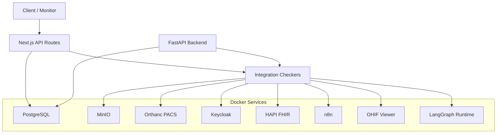
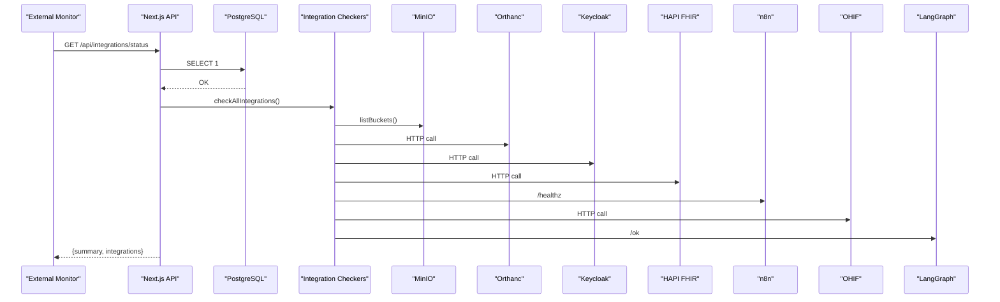
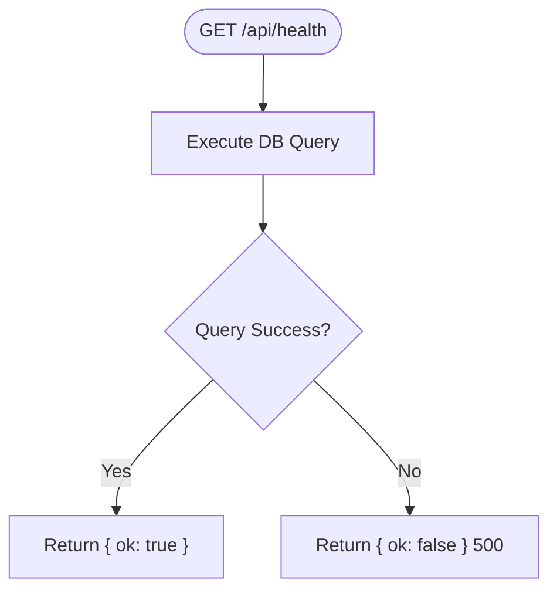
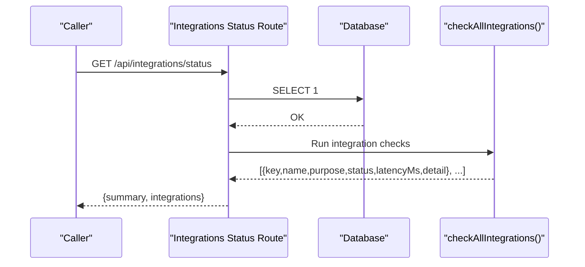
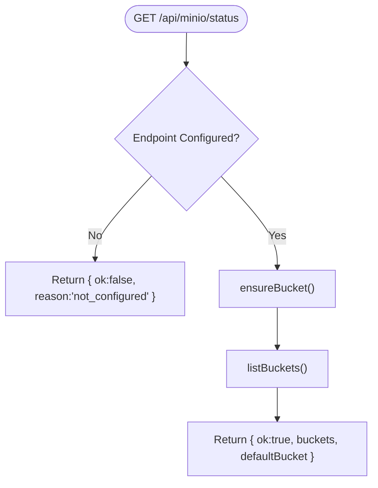
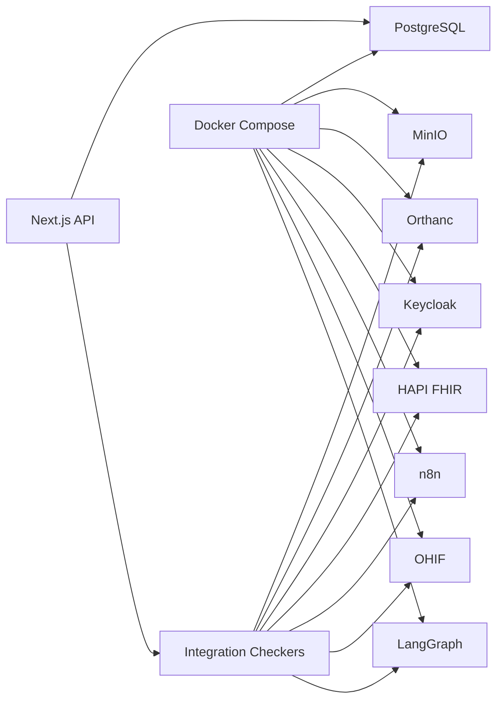

# Monitoring & Health Checks

<cite>
**Referenced Files in This Document**
- [route.ts](file://src/app/api/health/route.ts)
- [route.ts](file://src/app/api/integrations/status/route.ts)
- [route.ts](file://src/app/api/minio/status/route.ts)
- [main.py](file://backend/app/main.py)
- [config.py](file://backend/app/core/config.py)
- [docker-compose.yml](file://docker-compose.yml)
- [Dockerfile](file://backend/Dockerfile)
- [Dockerfile](file://frontend/Dockerfile)
- [start-all.sh](file://services/start-all.sh)
</cite>

## Table of Contents
1. [Introduction](#introduction)
2. [Project Structure](#project-structure)
3. [Core Components](#core-components)
4. [Architecture Overview](#architecture-overview)
5. [Detailed Component Analysis](#detailed-component-analysis)
6. [Dependency Analysis](#dependency-analysis)
7. [Performance Considerations](#performance-considerations)
8. [Troubleshooting Guide](#troubleshooting-guide)
9. [Conclusion](#conclusion)
10. [Appendices](#appendices)

## Introduction
This document provides comprehensive monitoring and health check guidance for the GeraldOS platform. It covers built-in health endpoints, integration status monitoring, system health metrics collection, Docker-based health checks, custom endpoint development, dashboard setup, alerting strategies, log aggregation approaches, performance monitoring tools, and troubleshooting procedures for outages, integration failures, and performance degradation. It also includes guidance on external monitoring solutions and creating custom health indicators.

## Project Structure
GeraldOS exposes health and integration status through Next.js API routes and a FastAPI backend service. The platform orchestrates multiple services (PostgreSQL, Redis, MinIO, Orthanc, Keycloak, HAPI FHIR, Dicoogle, n8n, OHIF, LangGraph) via Docker Compose with container-level health checks. A startup script probes each integration’s readiness before proceeding.

**Diagram sources**
- [route.ts:1-43](file://src/app/api/integrations/status/route.ts#L1-L43)
- [route.ts:1-24](file://src/app/api/minio/status/route.ts#L1-L24)
- [main.py:25-27](file://backend/app/main.py#L25-L27)
- [docker-compose.yml:4-111](file://docker-compose.yml#L4-L111)

**Section sources**
- [docker-compose.yml:4-111](file://docker-compose.yml#L4-L111)
- [start-all.sh:1-100](file://services/start-all.sh#L1-L100)

## Core Components
- Platform Health Endpoint: A lightweight route that verifies database connectivity and returns a simple ok status.
- Integration Status Endpoint: Aggregates health of PostgreSQL and all configured integrations, reporting per-integration status, latency, and summary counts.
- Storage Health Endpoint: Validates MinIO configuration and bucket availability.
- Backend Health Endpoint: FastAPI service exposes a basic health check indicating platform identity and version.
- Container Health Checks: Docker Compose defines health checks for core services to ensure orchestration reliability.
- Startup Readiness Probes: A shell script checks service ports and health endpoints to confirm readiness before use.

**Section sources**
- [route.ts:1-14](file://src/app/api/health/route.ts#L1-L14)
- [route.ts:1-43](file://src/app/api/integrations/status/route.ts#L1-L43)
- [route.ts:1-24](file://src/app/api/minio/status/route.ts#L1-L24)
- [main.py:25-27](file://backend/app/main.py#L25-L27)
- [docker-compose.yml:12-55](file://docker-compose.yml#L12-L55)
- [docker-compose.yml:89-93](file://docker-compose.yml#L89-L93)
- [start-all.sh:6-97](file://services/start-all.sh#L6-L97)

## Architecture Overview
The monitoring architecture combines application-level health endpoints with container-level health checks and readiness probes. External monitors can poll these endpoints to assess system health and trigger alerts.

**Diagram sources**
- [route.ts:1-43](file://src/app/api/integrations/status/route.ts#L1-L43)
- [route.ts:1-24](file://src/app/api/minio/status/route.ts#L1-L24)
- [docker-compose.yml:41-55](file://docker-compose.yml#L41-L55)
- [docker-compose.yml:82-93](file://docker-compose.yml#L82-L93)

## Detailed Component Analysis

### Built-in Health Endpoints
- Platform Health (Next.js): Returns a boolean ok after executing a minimal database query. Suitable for liveness probes.
- Integration Status (Next.js): Returns per-integration health including key, name, purpose, status, latencyMs, detail, plus a summary with total, connected, unreachable, not_configured counts.
- Storage Health (Next.js): Validates MinIO configuration and lists buckets; returns ok or failure reason.
- Backend Health (FastAPI): Returns a JSON object with status, platform, and version.

**Diagram sources**
- [route.ts:1-14](file://src/app/api/health/route.ts#L1-L14)

**Section sources**
- [route.ts:1-14](file://src/app/api/health/route.ts#L1-L14)
- [route.ts:1-43](file://src/app/api/integrations/status/route.ts#L1-L43)
- [route.ts:1-24](file://src/app/api/minio/status/route.ts#L1-L24)
- [main.py:25-27](file://backend/app/main.py#L25-L27)

### Integration Status Monitoring
The integration status endpoint performs:
- Database connectivity test with latency measurement.
- Aggregated checks across configured integrations (storage, PACS, auth, FHIR, workflow automation, viewer, runtime).
- Summary computation for quick health overview.

**Diagram sources**
- [route.ts:1-43](file://src/app/api/integrations/status/route.ts#L1-L43)

**Section sources**
- [route.ts:1-43](file://src/app/api/integrations/status/route.ts#L1-L43)

### Storage Health Endpoint
Validates MinIO by ensuring the configured bucket exists and listing available buckets. If not configured, returns a not_configured reason.

**Diagram sources**
- [route.ts:1-24](file://src/app/api/minio/status/route.ts#L1-L24)

**Section sources**
- [route.ts:1-24](file://src/app/api/minio/status/route.ts#L1-L24)

### Backend Service Health
The FastAPI backend exposes a simple health endpoint returning platform metadata. Useful for service-level liveness checks.

**Section sources**
- [main.py:25-27](file://backend/app/main.py#L25-L27)

### Docker Health Checks and Orchestration
Container-level health checks are defined for critical services:
- PostgreSQL: pg_isready probe.
- Redis: redis-cli ping.
- MinIO: HTTP live health endpoint.
- Orthanc: HTTP system endpoint.
- n8n: HTTP healthz endpoint.

These enable Docker to mark services healthy and coordinate dependencies.

**Section sources**
- [docker-compose.yml:12-16](file://docker-compose.yml#L12-L16)
- [docker-compose.yml:21-25](file://docker-compose.yml#L21-L25)
- [docker-compose.yml:35-39](file://docker-compose.yml#L35-L39)
- [docker-compose.yml:51-55](file://docker-compose.yml#L51-L55)
- [docker-compose.yml:89-93](file://docker-compose.yml#L89-L93)

### Startup Readiness Probes
A shell script starts and validates local services by probing their health endpoints and ports, ensuring readiness before other components proceed.

**Section sources**
- [start-all.sh:6-97](file://services/start-all.sh#L6-L97)

### Custom Health Endpoint Development
To add a new health indicator:
- Create a new Next.js API route under src/app/api/<feature>/health/route.ts.
- Implement a lightweight check (e.g., ping dependency, run a small operation).
- Return a consistent structure with ok, status, latencyMs, and detail fields.
- Optionally aggregate into the integration status endpoint for unified visibility.

Best practices:
- Keep checks fast and idempotent.
- Avoid heavy operations; prefer pings or minimal queries.
- Use timeouts and retries where appropriate.
- Log errors without exposing sensitive details.

[No sources needed since this section provides general guidance]

### Monitoring Dashboard Setup
Recommended approach:
- Poll /api/integrations/status at regular intervals (e.g., every 30–60 seconds).
- Visualize summary.total, summary.connected, summary.unreachable, and per-integration latencyMs.
- Alert when summary.unreachable > 0 or latency exceeds thresholds.
- For storage-specific insights, monitor /api/minio/status to track bucket availability.

[No sources needed since this section provides general guidance]

### Alerting Strategies
- Liveness Alerts: Trigger on non-200 responses from platform health endpoints.
- Readiness Alerts: Trigger when integration status reports unreachable or not_configured.
- Latency Alerts: Trigger when latencyMs exceeds defined thresholds for critical integrations.
- Dependency Alerts: Use Docker health status to detect service outages early.

[No sources needed since this section provides general guidance]

### Log Aggregation Approaches
- Centralize logs from containers using a logging driver (e.g., json-file with rotation, or remote collectors).
- Aggregate logs from Next.js, FastAPI, and third-party services into a single pipeline.
- Correlate events using request IDs and timestamps.
- Retain logs according to compliance requirements.

[No sources needed since this section provides general guidance]

### Performance Monitoring Tools
- Application Metrics: Add counters for request rates, error rates, and latency percentiles.
- Infrastructure Metrics: Monitor CPU, memory, disk I/O, and network for containers.
- Dependency Metrics: Track latency and error rates for each integration.
- Observability Stack: Use time-series databases and dashboards to visualize trends and anomalies.

[No sources needed since this section provides general guidance]

## Dependency Analysis
The monitoring stack depends on:
- Next.js API routes for health and integration status.
- PostgreSQL for database connectivity checks.
- Docker Compose for service orchestration and health checks.
- Shell scripts for readiness validation during startup.

**Diagram sources**
- [route.ts:1-43](file://src/app/api/integrations/status/route.ts#L1-L43)
- [docker-compose.yml:4-111](file://docker-compose.yml#L4-L111)

**Section sources**
- [docker-compose.yml:4-111](file://docker-compose.yml#L4-L111)
- [start-all.sh:6-97](file://services/start-all.sh#L6-L97)

## Performance Considerations
- Keep health endpoints lightweight to avoid impacting application performance.
- Use connection pooling and short-lived connections for database checks.
- Cache integration status results briefly if polling frequency is high.
- Set appropriate timeouts for external service calls to prevent cascading delays.
- Monitor resource usage of containers and scale horizontally if necessary.

[No sources needed since this section provides general guidance]

## Troubleshooting Guide
Common issues and resolutions:
- Database Unreachable:
  - Verify PostgreSQL container health and credentials.
  - Check network connectivity and firewall rules.
  - Review error messages from the integration status endpoint.
- Integration Failures:
  - Confirm service endpoints and authentication settings.
  - Validate container health and readiness via Docker Compose.
  - Use startup probes to ensure services are fully initialized.
- Performance Degradation:
  - Inspect latencyMs values for slow integrations.
  - Check resource utilization and scaling limits.
  - Review logs for errors or bottlenecks.

Operational steps:
- Poll /api/health and /api/integrations/status to identify failing components.
- Use /api/minio/status to validate storage configuration and bucket access.
- Leverage Docker health checks to restart unhealthy services automatically.
- Analyze logs from containers and application layers for root causes.

**Section sources**
- [route.ts:1-43](file://src/app/api/integrations/status/route.ts#L1-L43)
- [route.ts:1-24](file://src/app/api/minio/status/route.ts#L1-L24)
- [docker-compose.yml:12-55](file://docker-compose.yml#L12-L55)
- [docker-compose.yml:89-93](file://docker-compose.yml#L89-L93)

## Conclusion
GeraldOS provides robust health and monitoring capabilities through application-level endpoints, container-level health checks, and readiness probes. By leveraging these endpoints, teams can implement effective alerting, dashboards, and troubleshooting workflows. Extending the monitoring surface with custom health indicators ensures comprehensive observability across all platform components.

[No sources needed since this section summarizes without analyzing specific files]

## Appendices

### Docker Health Check Configuration Reference
- PostgreSQL: Uses pg_isready to verify readiness.
- Redis: Uses redis-cli ping.
- MinIO: Uses HTTP live health endpoint.
- Orthanc: Uses HTTP system endpoint.
- n8n: Uses HTTP healthz endpoint.

**Section sources**
- [docker-compose.yml:12-16](file://docker-compose.yml#L12-L16)
- [docker-compose.yml:21-25](file://docker-compose.yml#L21-L25)
- [docker-compose.yml:35-39](file://docker-compose.yml#L35-L39)
- [docker-compose.yml:51-55](file://docker-compose.yml#L51-L55)
- [docker-compose.yml:89-93](file://docker-compose.yml#L89-L93)

### Backend Service Configuration
Environment-driven configuration for database, cache, storage, auth, PACS, and FHIR endpoints enables flexible deployment and health checks.

**Section sources**
- [config.py:4-19](file://backend/app/core/config.py#L4-L19)

### Container Images and Entrypoints
- Backend: Exposes port 8000 and runs uvicorn.
- Frontend: Exposes port 3000 and runs development server.

**Section sources**
- [Dockerfile:1-20](file://backend/Dockerfile#L1-L20)
- [Dockerfile:1-28](file://frontend/Dockerfile#L1-L28)