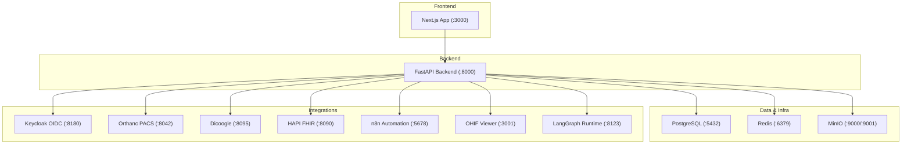
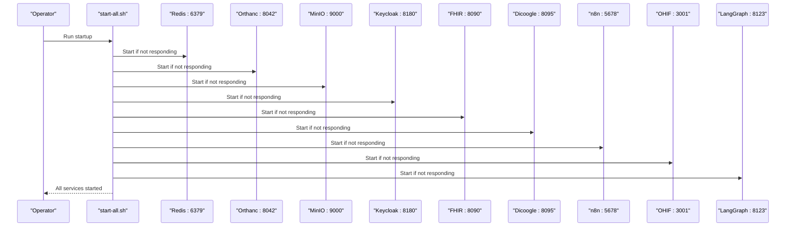
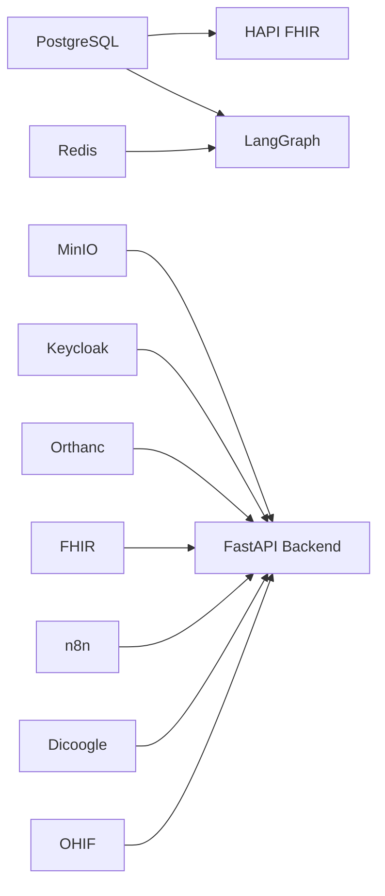

# Service Management

<cite>
**Referenced Files in This Document**
- [start-services.sh](file://scripts/start-services.sh)
- [start-all.sh](file://services/start-all.sh)
- [docker-compose.yml](file://docker-compose.yml)
- [main.py](file://backend/app/main.py)
- [config.py](file://backend/app/core/config.py)
- [Dockerfile (backend)](file://backend/Dockerfile)
- [Dockerfile (frontend)](file://frontend/Dockerfile)
- [orthanc.json](file://services/orthanc.json)
- [keycloak.mjs](file://services/keycloak.mjs)
- [fhir.mjs](file://services/fhir.mjs)
- [dicoogle.mjs](file://services/dicoogle.mjs)
- [n8n.mjs](file://services/n8n.mjs)
- [ohif.mjs](file://services/ohif.mjs)
- [route.ts (integrations status)](file://src/app/api/integrations/status/route.ts)
- [index.ts (integrations health)](file://src/lib/integrations/index.ts)
</cite>

## Table of Contents
1. Introduction
2. Project Structure
3. Core Components
4. Architecture Overview
5. Detailed Component Analysis
6. Dependency Analysis
7. Performance Considerations
8. Troubleshooting Guide
9. Conclusion
10. Appendices

## Introduction
This document provides comprehensive service management guidance for the GeraldOS platform. It covers startup procedures using provided scripts, service dependency ordering, graceful shutdown processes, individual service management commands, logging configuration, and service status monitoring. It also documents updating services, managing restarts, handling failures, the Python backend lifecycle, microservice communication patterns, inter-service health checking, runbooks for routine tasks, and incident response procedures.

## Project Structure
GeraldOS is composed of:
- A Next.js frontend application
- A FastAPI Python backend exposing REST endpoints and integrating with external services
- Integration services for identity (Keycloak), imaging (Orthanc, OHIF, Dicoogle), interoperability (HAPI FHIR), automation (n8n), storage (MinIO), caching/messaging (Redis), and a graph runtime (LangGraph)
- Orchestration via Docker Compose for production-like environments and shell scripts for local development

**Diagram sources**
- [docker-compose.yml:4-111](file://docker-compose.yml#L4-L111)
- [main.py:11-27](file://backend/app/main.py#L11-L27)
- [config.py:4-19](file://backend/app/core/config.py#L4-L19)

**Section sources**
- [docker-compose.yml:1-118](file://docker-compose.yml#L1-L118)
- [main.py:1-325](file://backend/app/main.py#L1-L325)
- [config.py:1-20](file://backend/app/core/config.py#L1-L20)

## Core Components
- Startup scripts:
  - Local dev script to start all integration services with health checks and logs
  - Alternative script under services/ with similar behavior and port checks
- Docker Compose stack:
  - Defines services, ports, volumes, environment variables, healthchecks, and dependencies
- Backend:
  - FastAPI app with health endpoint and module routes that call external services
  - Configuration via settings class reading environment variables
- Integration services:
  - Keycloak (OIDC), Orthanc (PACS), HAPI FHIR, Dicoogle, n8n, OHIF, MinIO, Redis, LangGraph

Operational highlights:
- Health endpoints are used by both scripts and the platform’s own health aggregator
- Logs are written to /tmp for each service during local runs
- Services are started only if not already running on their expected ports

**Section sources**
- [start-services.sh:1-93](file://scripts/start-services.sh#L1-L93)
- [start-all.sh:1-100](file://services/start-all.sh#L1-L100)
- [docker-compose.yml:1-118](file://docker-compose.yml#L1-L118)
- [main.py:25-27](file://backend/app/main.py#L25-L27)
- [config.py:4-19](file://backend/app/core/config.py#L4-L19)

## Architecture Overview
The platform follows a service-oriented architecture:
- Frontend calls the Next.js API routes, which may proxy or call the FastAPI backend
- The FastAPI backend integrates with Postgres, Redis, MinIO, and external services (Orthanc, FHIR, Keycloak, n8n, Dicoogle, OHIF, LangGraph)
- Health checks are exposed at multiple layers: per-service endpoints, the backend’s /health, and an aggregated integrations status endpoint

**Diagram sources**
- [start-all.sh:10-97](file://services/start-all.sh#L10-L97)

**Section sources**
- [start-all.sh:1-100](file://services/start-all.sh#L1-L100)
- [docker-compose.yml:1-118](file://docker-compose.yml#L1-L118)

## Detailed Component Analysis

### Startup Procedures
- Use the local startup script to launch all integration services with health checks and log redirection.
- Alternatively, use the services directory script which includes port-based readiness checks before reporting success.
- For containerized deployments, use Docker Compose to orchestrate services with healthchecks and dependency ordering.

Recommended commands:
- Local development:
  - Execute the startup script from the repository root or services directory
  - Verify health endpoints for each service after startup
- Containerized:
  - Bring up the full stack with Docker Compose
  - Inspect service logs and health status via compose commands

Graceful shutdown:
- Stop containers with Docker Compose to ensure clean teardown
- For local processes, stop services by terminating background processes and verify ports are released

**Section sources**
- [start-services.sh:1-93](file://scripts/start-services.sh#L1-L93)
- [start-all.sh:1-100](file://services/start-all.sh#L1-L100)
- [docker-compose.yml:1-118](file://docker-compose.yml#L1-L118)

### Service Dependency Ordering
- Docker Compose defines explicit depends_on and healthcheck conditions for services like HAPI FHIR depending on PostgreSQL and LangGraph depending on Redis and PostgreSQL.
- Local scripts perform sequential startup with sleeps and health checks to ensure readiness before proceeding.

Dependency summary:
- PostgreSQL is foundational for data persistence
- Redis supports caching and messaging
- MinIO provides object storage
- Orthanc serves DICOM and DICOMweb
- Keycloak provides OIDC authentication
- HAPI FHIR exposes clinical interoperability endpoints
- n8n enables workflow automation
- OHIF provides medical imaging viewer
- LangGraph runtime orchestrates agent workflows

**Section sources**
- [docker-compose.yml:67-111](file://docker-compose.yml#L67-L111)
- [start-all.sh:10-97](file://services/start-all.sh#L10-L97)

### Individual Service Management Commands
- Redis:
  - Start: managed by startup scripts; default port 6379
  - Health: redis-cli ping
  - Logs: /tmp/redis.log
- Orthanc:
  - Start: managed by startup scripts; config in orthanc.json
  - Health: GET /system
  - Logs: /tmp/orthanc.log
- MinIO:
  - Start: managed by startup scripts; console on 9001
  - Health: GET /minio/health/live
  - Logs: /tmp/minio.log
- Keycloak:
  - Start: managed by startup scripts; OIDC discovery available
  - Health: GET /.well-known/openid-configuration
  - Logs: /tmp/keycloak.log
- HAPI FHIR:
  - Start: managed by startup scripts
  - Health: GET /fhir/metadata
  - Logs: /tmp/fhir.log
- Dicoogle:
  - Start: managed by startup scripts
  - Health: GET /search?query=*
  - Logs: /tmp/dicoogle.log
- n8n:
  - Start: managed by startup scripts
  - Health: GET /healthz
  - Logs: /tmp/n8n.log
- OHIF:
  - Start: managed by startup scripts
  - Health: HTTP 200 on root
  - Logs: /tmp/ohif.log
- LangGraph:
  - Start: managed by startup scripts; requires Redis and Postgres
  - Health: GET /ok
  - Logs: /tmp/langgraph.log

**Section sources**
- [start-services.sh:8-90](file://scripts/start-services.sh#L8-L90)
- [start-all.sh:10-97](file://services/start-all.sh#L10-L97)
- [orthanc.json:1-16](file://services/orthanc.json#L1-L16)

### Logging Configuration
- Local scripts redirect stdout/stderr to files under /tmp for each service
- Docker Compose services can be inspected via standard container logging mechanisms
- Backend logs are emitted by Uvicorn when running the FastAPI app

Operational tips:
- Tail logs during incidents to identify startup failures or connectivity issues
- Ensure write permissions to /tmp for local processes
- In containers, use compose logs commands to view service output

**Section sources**
- [start-services.sh:10-90](file://scripts/start-services.sh#L10-L90)
- [start-all.sh:12-97](file://services/start-all.sh#L12-L97)
- [Dockerfile (backend):17-19](file://backend/Dockerfile#L17-L19)

### Service Status Monitoring
- Backend health endpoint:
  - GET /health returns platform-level health
- Aggregated integrations status:
  - GET /api/integrations/status reports connected/unreachable/not_configured for each integration with latency
- Per-service health endpoints are used by startup scripts and can be polled directly

Monitoring approach:
- Periodically poll /api/integrations/status to detect degraded services
- Alert on unreachable or high-latency integrations
- Correlate with service logs for root cause analysis

**Section sources**
- [main.py:25-27](file://backend/app/main.py#L25-L27)
- [route.ts (integrations status):1-42](file://src/app/api/integrations/status/route.ts#L1-L42)
- [index.ts (integrations health):192-216](file://src/lib/integrations/index.ts#L192-L216)

### Updating Services
- Local development:
  - Replace or update service binaries/scripts under services/ and restart via startup script
  - Update configuration files (e.g., orthanc.json) and restart affected services
- Containerized:
  - Update images or environment variables in docker-compose.yml
  - Rebuild and redeploy with Docker Compose
- Backend updates:
  - Rebuild and redeploy the backend image or process
  - Ensure environment variables match updated configuration

Best practices:
- Version control all configuration changes
- Test health endpoints after updates
- Roll back by restoring previous versions if issues arise

**Section sources**
- [docker-compose.yml:1-118](file://docker-compose.yml#L1-L118)
- [Dockerfile (backend):1-20](file://backend/Dockerfile#L1-L20)
- [Dockerfile (frontend):1-28](file://frontend/Dockerfile#L1-L28)
- [orthanc.json:1-16](file://services/orthanc.json#L1-L16)

### Managing Service Restarts
- Local:
  - Stop existing processes if necessary, then re-run startup script to restart services
  - Restart individual services by stopping and starting them manually
- Containers:
  - Restart specific services with Docker Compose commands
  - Use healthchecks to confirm successful restarts

Operational notes:
- Always verify health endpoints post-restart
- Monitor logs for errors during restart
- Coordinate restarts to minimize downtime across dependent services

**Section sources**
- [start-all.sh:10-97](file://services/start-all.sh#L10-L97)
- [docker-compose.yml:1-118](file://docker-compose.yml#L1-L118)

### Handling Service Failures
- Identify failure via:
  - Health endpoints (/health, /api/integrations/status, per-service endpoints)
  - Log inspection (/tmp logs locally, container logs in production)
- Common causes:
  - Port conflicts
  - Missing dependencies (database, cache, storage)
  - Misconfigured environment variables
- Recovery steps:
  - Resolve dependency issues first
  - Clear stale state if needed (e.g., temporary directories)
  - Restart affected services and validate health

Escalation:
- If failures persist, capture logs and configuration diffs
- Engage service owners or consult vendor documentation

**Section sources**
- [route.ts (integrations status):1-42](file://src/app/api/integrations/status/route.ts#L1-L42)
- [index.ts (integrations health):192-216](file://src/lib/integrations/index.ts#L192-L216)
- [start-all.sh:10-97](file://services/start-all.sh#L10-L97)

### Python Backend Service Lifecycle
- Entry point:
  - FastAPI app defined in main.py with middleware and routes
  - Health endpoint at /health
- Configuration:
  - Settings loaded from environment via config.py
- Deployment:
  - Backend Dockerfile exposes port 8000 and runs Uvicorn
  - Environment variables configure database, cache, storage, and integration endpoints

Lifecycle considerations:
- Ensure all dependencies are healthy before starting the backend
- Validate configuration via environment variables
- Monitor backend health and integrate requests to external services

**Section sources**
- [main.py:1-325](file://backend/app/main.py#L1-L325)
- [config.py:1-20](file://backend/app/core/config.py#L1-L20)
- [Dockerfile (backend):1-20](file://backend/Dockerfile#L1-L20)

### Microservice Communication Patterns
- HTTP-based APIs:
  - Backend calls external services via HTTP (e.g., Orthanc studies endpoint)
  - Health checks rely on HTTP endpoints
- Event-driven automation:
  - n8n webhooks trigger workflows based on events
- Interoperability:
  - FHIR endpoints provide standardized clinical data access
- Imaging:
  - Orthanc and OHIF enable DICOM study access and visualization

Patterns observed:
- Synchronous HTTP requests for immediate responses
- Webhook-based asynchronous processing for workflows
- Standardized protocols (DICOMweb, FHIR) for interoperability

**Section sources**
- [main.py:188-197](file://backend/app/main.py#L188-L197)
- [n8n.mjs:20-41](file://services/n8n.mjs#L20-L41)
- [fhir.mjs:23-54](file://services/fhir.mjs#L23-L54)

### Inter-Service Health Checking
- Startup scripts use health endpoints to determine readiness
- Platform aggregates health via /api/integrations/status
- Each service exposes a minimal health endpoint suitable for polling

Health check strategy:
- Poll critical services periodically
- Track latency and status transitions
- Alert on sustained unreachability

**Section sources**
- [start-all.sh:10-97](file://services/start-all.sh#L10-L97)
- [route.ts (integrations status):1-42](file://src/app/api/integrations/status/route.ts#L1-L42)
- [index.ts (integrations health):192-216](file://src/lib/integrations/index.ts#L192-L216)

### Runbooks: Routine Operational Tasks
- Daily checks:
  - Verify /health and /api/integrations/status
  - Review recent logs for errors
  - Confirm disk space and resource usage
- Weekly tasks:
  - Rotate logs if necessary
  - Validate backups for persistent volumes
  - Review service configurations for updates
- Monthly tasks:
  - Plan updates for dependencies and images
  - Perform maintenance windows for upgrades
  - Audit access controls and credentials

Procedures:
- Use startup scripts to reset service states
- Use Docker Compose to manage container lifecycles
- Document any configuration changes with versioning

**Section sources**
- [docker-compose.yml:1-118](file://docker-compose.yml#L1-L118)
- [start-all.sh:1-100](file://services/start-all.sh#L1-L100)

### Incident Response Procedures
- Detection:
  - Alerts from health checks or user reports
- Triage:
  - Check aggregated status and per-service health
  - Identify failing dependencies
- Containment:
  - Isolate affected services
  - Roll back recent changes if applicable
- Resolution:
  - Fix configuration or dependency issues
  - Restart services and validate health
- Post-incident:
  - Capture logs and timeline
  - Update runbooks and add preventive measures

Communication:
- Notify stakeholders of impact and resolution
- Provide status updates until fully resolved

**Section sources**
- [route.ts (integrations status):1-42](file://src/app/api/integrations/status/route.ts#L1-L42)
- [index.ts (integrations health):192-216](file://src/lib/integrations/index.ts#L192-L216)

## Dependency Analysis

**Diagram sources**
- [docker-compose.yml:67-111](file://docker-compose.yml#L67-L111)
- [main.py:188-197](file://backend/app/main.py#L188-L197)

**Section sources**
- [docker-compose.yml:1-118](file://docker-compose.yml#L1-L118)
- [main.py:188-197](file://backend/app/main.py#L188-L197)

## Performance Considerations
- Prefer health-checked startup sequences to avoid race conditions
- Use connection pooling for databases and caches where applicable
- Monitor latency in health checks to detect degradation early
- Scale horizontally for stateless services (e.g., backend, OHIF)
- Optimize storage I/O for MinIO and database volumes

[No sources needed since this section provides general guidance]

## Troubleshooting Guide
Common issues and resolutions:
- Port conflicts:
  - Ensure no other processes bind to expected ports
  - Adjust service ports if necessary
- Database connectivity:
  - Verify PostgreSQL is healthy and accessible
  - Check credentials and network reachability
- Cache connectivity:
  - Confirm Redis is reachable and responds to ping
- Storage availability:
  - Validate MinIO health and credentials
- Authentication:
  - Ensure Keycloak discovery endpoint is reachable
- Imaging services:
  - Confirm Orthanc and Dicoogle respond to health endpoints
- Workflow automation:
  - Check n8n health and webhook routing

Diagnostic steps:
- Poll health endpoints for each service
- Inspect logs in /tmp or container logs
- Reproduce issues with minimal configuration
- Escalate with captured logs and configuration snapshots

**Section sources**
- [start-all.sh:10-97](file://services/start-all.sh#L10-L97)
- [route.ts (integrations status):1-42](file://src/app/api/integrations/status/route.ts#L1-L42)
- [index.ts (integrations health):192-216](file://src/lib/integrations/index.ts#L192-L216)

## Conclusion
GeraldOS provides a robust set of services orchestrated through scripts and Docker Compose. Operators can reliably start, monitor, update, and recover services using documented procedures. Health checks and centralized status reporting enable proactive operations and rapid incident response. Following the runbooks and troubleshooting guides ensures consistent and safe management of the platform.

[No sources needed since this section summarizes without analyzing specific files]

## Appendices

### Quick Reference: Ports and Endpoints
- Redis: 6379 — redis-cli ping
- Orthanc: 8042 — GET /system
- MinIO: 9000/9001 — GET /minio/health/live
- Keycloak: 8180 — GET /.well-known/openid-configuration
- HAPI FHIR: 8090 — GET /fhir/metadata
- Dicoogle: 8095 — GET /search?query=*
- n8n: 5678 — GET /healthz
- OHIF: 3001 — HTTP 200 on root
- LangGraph: 8123 — GET /ok
- Backend: 8000 — GET /health

**Section sources**
- [start-services.sh:8-90](file://scripts/start-services.sh#L8-L90)
- [start-all.sh:10-97](file://services/start-all.sh#L10-L97)
- [main.py:25-27](file://backend/app/main.py#L25-L27)