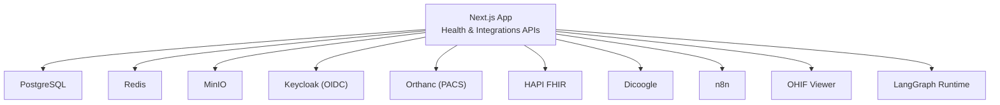
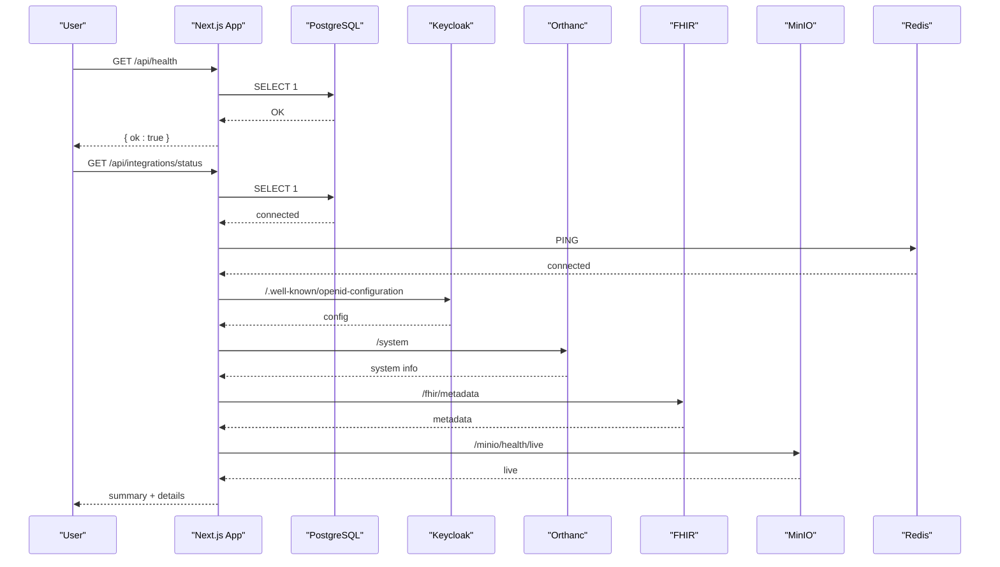
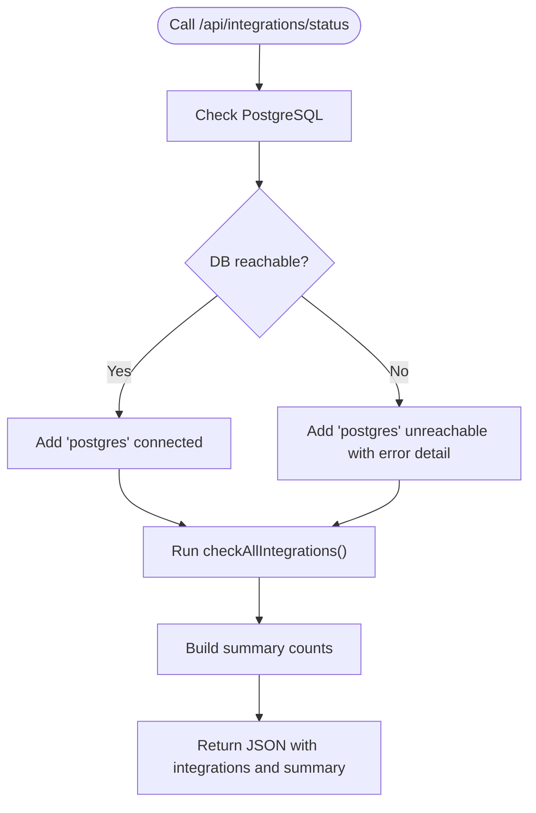
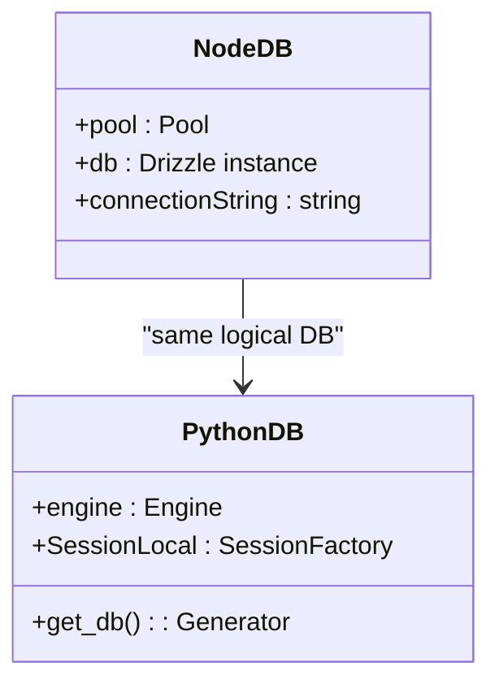
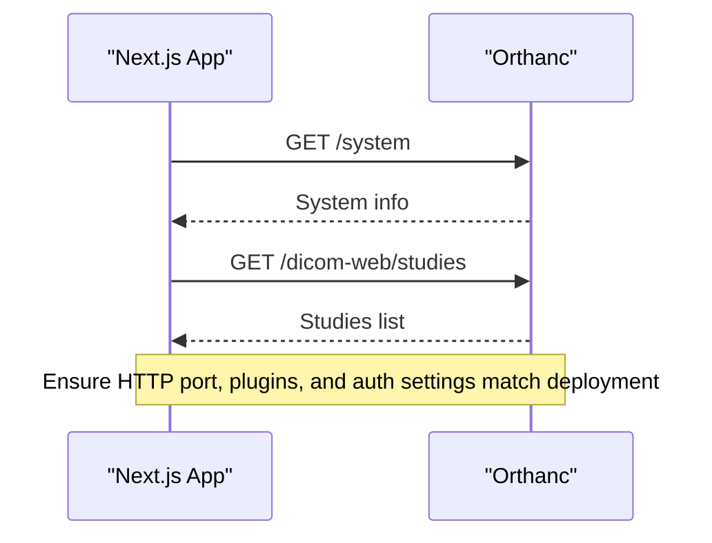
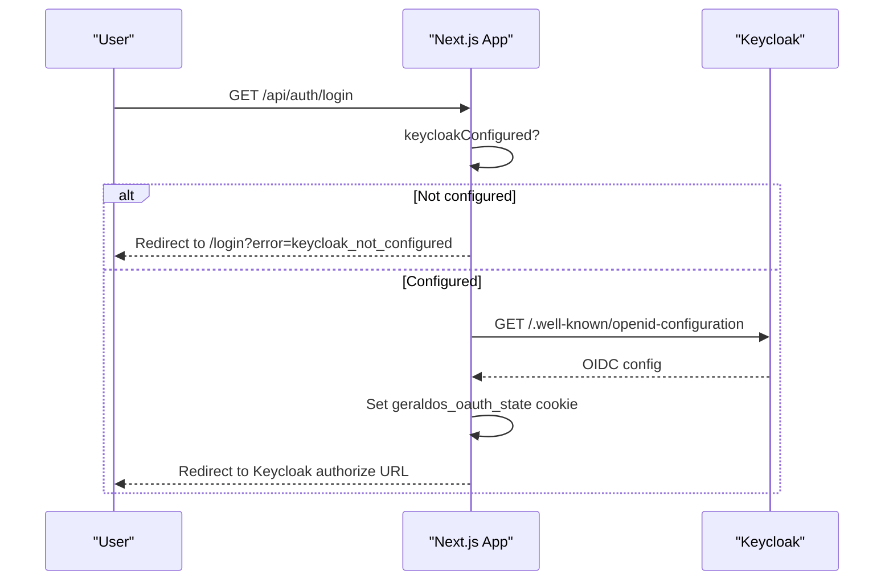
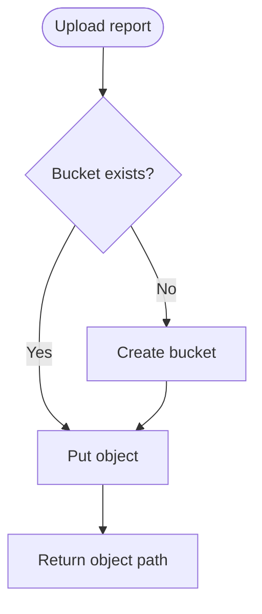
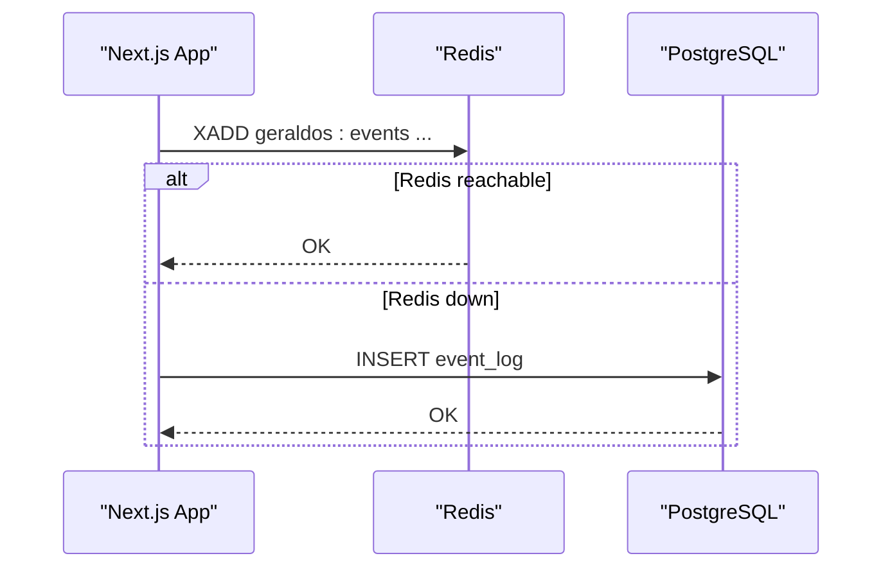
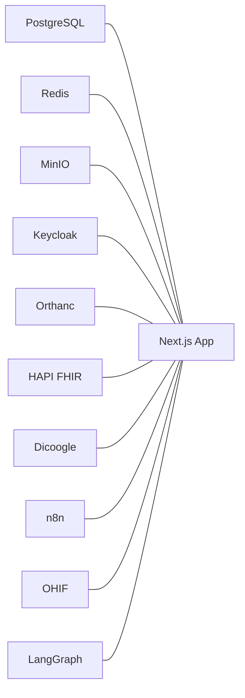

# Troubleshooting Guide

<cite>
**Referenced Files in This Document**
- [README.md](file://README.md)
- [docker-compose.yml](file://docker-compose.yml)
- [src/app/api/health/route.ts](file://src/app/api/health/route.ts)
- [src/app/api/integrations/status/route.ts](file://src/app/api/integrations/status/route.ts)
- [src/db/index.ts](file://src/db/index.ts)
- [backend/app/core/config.py](file://backend/app/core/config.py)
- [backend/app/db/session.py](file://backend/app/db/session.py)
- [backend/app/core/integrations.py](file://backend/app/core/integrations.py)
- [services/start-all.sh](file://services/start-all.sh)
- [scripts/start-services.sh](file://scripts/start-services.sh)
- [services/orthanc.json](file://services/orthanc.json)
- [docker/orthanc/orthanc.json](file://docker/orthanc/orthanc.json)
- [src/app/api/auth/login/route.ts](file://src/app/api/auth/login/route.ts)
- [src/lib/events.ts](file://src/lib/events.ts)
</cite>

## Table of Contents
1. Introduction
2. Project Structure
3. Core Components
4. Architecture Overview
5. Detailed Component Analysis
6. Dependency Analysis
7. Performance Considerations
8. Troubleshooting Guide
9. Conclusion
10. Appendices

## Introduction
This guide provides comprehensive troubleshooting procedures for the GeraldOS platform, focusing on deployment and runtime issues such as service startup failures, database connectivity problems, PACS integration issues, authentication errors, and performance bottlenecks. It explains how to use built-in health endpoints, analyze logs, interpret error messages and stack traces, and apply step-by-step resolutions. It also includes diagnostic checklists and preventive maintenance recommendations to keep the system healthy.

## Project Structure
GeraldOS deploys a Next.js application with multiple integrated services: PostgreSQL, Redis, MinIO, Orthanc (PACS), Keycloak (OIDC), HAPI FHIR, Dicoogle, n8n, OHIF viewer, and LangGraph runtime. The repository includes Docker Compose definitions, service start scripts, configuration files, and API routes that expose health and integration status.

**Diagram sources**
- [docker-compose.yml:4-110](file://docker-compose.yml#L4-L110)
- [README.md:9-23](file://README.md#L9-L23)

**Section sources**
- [docker-compose.yml:1-118](file://docker-compose.yml#L1-L118)
- [README.md:1-121](file://README.md#L1-L121)

## Core Components
- Health endpoint: validates database connectivity and returns a simple ok/unok response.
- Integration status endpoint: checks Postgres and all configured integrations, reporting connected/unreachable/not_configured with latency.
- Database connection: Node-side Drizzle pool and Python backend SQLAlchemy engine using environment-based URLs.
- Service orchestration: shell scripts start or detect running services and probe their health endpoints.
- Authentication: OIDC login flow via Keycloak with state cookie and redirect handling.
- Event bus: Redis Streams with durable fallback to event_log table.

**Section sources**
- [src/app/api/health/route.ts:1-14](file://src/app/api/health/route.ts#L1-L14)
- [src/app/api/integrations/status/route.ts:1-43](file://src/app/api/integrations/status/route.ts#L1-L43)
- [src/db/index.ts:1-25](file://src/db/index.ts#L1-L25)
- [backend/app/db/session.py:1-17](file://backend/app/db/session.py#L1-L17)
- [backend/app/core/config.py:1-20](file://backend/app/core/config.py#L1-L20)
- [services/start-all.sh:1-100](file://services/start-all.sh#L1-L100)
- [scripts/start-services.sh:1-93](file://scripts/start-services.sh#L1-L93)
- [src/app/api/auth/login/route.ts:1-31](file://src/app/api/auth/login/route.ts#L1-L31)
- [src/lib/events.ts:1-147](file://src/lib/events.ts#L1-L147)

## Architecture Overview
The platform uses a layered architecture where the Next.js app orchestrates workflows and delegates specialized tasks to external services. Health and integration endpoints provide visibility into system state. Configuration is centralized in environment variables and per-service config files.

**Diagram sources**
- [src/app/api/health/route.ts:6-12](file://src/app/api/health/route.ts#L6-L12)
- [src/app/api/integrations/status/route.ts:8-41](file://src/app/api/integrations/status/route.ts#L8-L41)
- [docker-compose.yml:4-110](file://docker-compose.yml#L4-L110)

## Detailed Component Analysis

### Health and Integration Diagnostics
- Use /api/health to quickly verify if the application can reach the database.
- Use /api/integrations/status to get a full picture of Postgres and all integrations, including latency and status categories.

**Diagram sources**
- [src/app/api/integrations/status/route.ts:8-41](file://src/app/api/integrations/status/route.ts#L8-L41)

**Section sources**
- [src/app/api/health/route.ts:1-14](file://src/app/api/health/route.ts#L1-L14)
- [src/app/api/integrations/status/route.ts:1-43](file://src/app/api/integrations/status/route.ts#L1-L43)

### Database Connectivity
- Node.js side: Drizzle ORM uses a pooled connection from DATABASE_URL; missing URL causes startup failure.
- Python backend: SQLAlchemy engine created with pool_pre_ping enabled; session factory provided for request-scoped sessions.
- Common symptoms:
  - Startup crash due to missing DATABASE_URL.
  - Intermittent query failures indicating stale connections or network blips.
  - Slow queries causing timeouts in health/status endpoints.

**Diagram sources**
- [src/db/index.ts:1-25](file://src/db/index.ts#L1-L25)
- [backend/app/db/session.py:1-17](file://backend/app/db/session.py#L1-L17)

**Section sources**
- [src/db/index.ts:1-25](file://src/db/index.ts#L1-L25)
- [backend/app/db/session.py:1-17](file://backend/app/db/session.py#L1-L17)
- [backend/app/core/config.py:1-20](file://backend/app/core/config.py#L1-L20)

### PACS (Orthanc) Connectivity
- Orthanc runs with DICOMweb enabled and optional plugins. Health probed via /system.
- Configuration varies between local and containerized deployments; ensure correct ports and plugin paths.
- Proxy routes exist in the app to forward requests while keeping credentials server-side.

**Diagram sources**
- [docker-compose.yml:41-55](file://docker-compose.yml#L41-L55)
- [services/orthanc.json:1-16](file://services/orthanc.json#L1-L16)
- [docker/orthanc/orthanc.json:1-21](file://docker/orthanc/orthanc.json#L1-L21)

**Section sources**
- [docker-compose.yml:41-55](file://docker-compose.yml#L41-L55)
- [services/orthanc.json:1-16](file://services/orthanc.json#L1-L16)
- [docker/orthanc/orthanc.json:1-21](file://docker/orthanc/orthanc.json#L1-L21)

### Authentication (Keycloak)
- Login route discovers OIDC configuration, sets a secure state cookie, and redirects to Keycloak.
- If Keycloak is not configured, users are redirected with an error hint.
- Backend token verification uses JWKS discovery and RS256 algorithm.

**Diagram sources**
- [src/app/api/auth/login/route.ts:7-29](file://src/app/api/auth/login/route.ts#L7-L29)
- [backend/app/core/integrations.py:37-58](file://backend/app/core/integrations.py#L37-L58)

**Section sources**
- [src/app/api/auth/login/route.ts:1-31](file://src/app/api/auth/login/route.ts#L1-L31)
- [backend/app/core/integrations.py:1-119](file://backend/app/core/integrations.py#L1-L119)

### Storage (MinIO) and Object Operations
- Health checked via /minio/health/live.
- Backend uploads reports to buckets and ensures bucket existence before writing.

**Diagram sources**
- [docker-compose.yml:27-39](file://docker-compose.yml#L27-L39)
- [backend/app/core/integrations.py:103-118](file://backend/app/core/integrations.py#L103-L118)

**Section sources**
- [docker-compose.yml:27-39](file://docker-compose.yml#L27-L39)
- [backend/app/core/integrations.py:103-118](file://backend/app/core/integrations.py#L103-L118)

### Automation (n8n) and Events (Redis)
- n8n exposes /healthz; used by startup scripts to detect readiness.
- Event publishing writes to Redis Streams when available and always persists to event_log for durability.

**Diagram sources**
- [docker-compose.yml:82-93](file://docker-compose.yml#L82-L93)
- [src/lib/events.ts:72-131](file://src/lib/events.ts#L72-L131)

**Section sources**
- [docker-compose.yml:82-93](file://docker-compose.yml#L82-L93)
- [src/lib/events.ts:1-147](file://src/lib/events.ts#L1-L147)

## Dependency Analysis
Services depend on each other through environment-configured endpoints and explicit health checks. Docker Compose defines dependencies and health probes for critical services like Postgres, Redis, MinIO, Orthanc, and n8n.

**Diagram sources**
- [docker-compose.yml:4-110](file://docker-compose.yml#L4-L110)

**Section sources**
- [docker-compose.yml:1-118](file://docker-compose.yml#L1-L118)

## Performance Considerations
- Prefer using /api/integrations/status to identify slow or unreachable components; latencyMs indicates relative performance.
- Ensure database connection pooling is adequate for concurrent requests; monitor connection exhaustion.
- Avoid unnecessary retries on downstream calls; implement backoff strategies in custom integrations.
- Cache frequently accessed metadata (e.g., Keycloak OIDC config) at the application layer where appropriate.
- Monitor storage throughput for MinIO during large uploads and batch operations.

[No sources needed since this section provides general guidance]

## Troubleshooting Guide

### Quick Start Checklist
- Verify services are up: docker compose ps or check ports defined in docker-compose.yml.
- Run GET /api/health and GET /api/integrations/status to confirm overall health.
- Confirm environment variables for DATABASE_URL, KEYCLOAK_URL, ORTHANC_URL, FHIR_URL, MINIO_ENDPOINT, and REDIS_URL.
- Validate service-specific configs (e.g., Orthanc plugins, authentication flags).

**Section sources**
- [docker-compose.yml:4-110](file://docker-compose.yml#L4-L110)
- [src/app/api/health/route.ts:6-12](file://src/app/api/health/route.ts#L6-L12)
- [src/app/api/integrations/status/route.ts:8-41](file://src/app/api/integrations/status/route.ts#L8-L41)
- [backend/app/core/config.py:4-19](file://backend/app/core/config.py#L4-L19)

### Service Startup Failures
Symptoms:
- Services do not respond on expected ports.
- Scripts fail to detect readiness.

Resolution steps:
- Use services/start-all.sh or scripts/start-services.sh to start non-managed services and observe logs under /tmp/*.log.
- For containerized environments, run docker compose up -d and inspect logs with docker compose logs <service>.
- Check health endpoints exposed by each service (e.g., Orthanc /system, n8n /healthz, MinIO /minio/health/live).
- Ensure required directories exist (e.g., Orthanc data, MinIO data) and permissions are set.

**Section sources**
- [services/start-all.sh:10-97](file://services/start-all.sh#L10-L97)
- [scripts/start-services.sh:8-90](file://scripts/start-services.sh#L8-L90)
- [docker-compose.yml:12-93](file://docker-compose.yml#L12-L93)

### Database Connection Issues
Symptoms:
- /api/health returns ok: false.
- /api/integrations/status shows postgres unreachable.
- Application crashes on startup.

Resolution steps:
- Confirm DATABASE_URL is set and points to a reachable PostgreSQL instance.
- Verify Postgres service is healthy (docker compose healthcheck or pg_isready).
- Check network connectivity and firewall rules between app and database.
- Inspect connection pool behavior; consider increasing pool size or tuning timeouts.
- Review Python backend engine settings (pool_pre_ping) and session usage.

Error interpretation:
- Missing DATABASE_URL: immediate startup error in Node DB module.
- Connection refused or timeout: network or service availability issue.
- Authentication failed: incorrect username/password or role privileges.

**Section sources**
- [src/db/index.ts:4-8](file://src/db/index.ts#L4-L8)
- [src/app/api/health/route.ts:6-12](file://src/app/api/health/route.ts#L6-L12)
- [src/app/api/integrations/status/route.ts:11-29](file://src/app/api/integrations/status/route.ts#L11-L29)
- [backend/app/db/session.py:7-16](file://backend/app/db/session.py#L7-L16)

### PACS Connectivity Problems (Orthanc)
Symptoms:
- Imaging worklist or study retrieval fails.
- /api/integrations/status shows Orthanc unreachable.

Resolution steps:
- Confirm Orthanc is running and responding to /system.
- Validate DICOMweb plugin is enabled and configured correctly.
- Check authentication settings and registered users if enabled.
- Ensure proxy routes in the app are pointing to the correct Orthanc base URL.
- Inspect Orthanc logs for plugin loading errors or storage issues.

**Section sources**
- [docker-compose.yml:41-55](file://docker-compose.yml#L41-L55)
- [services/orthanc.json:1-16](file://services/orthanc.json#L1-L16)
- [docker/orthanc/orthanc.json:1-21](file://docker/orthanc/orthanc.json#L1-L21)

### Authentication Problems (Keycloak)
Symptoms:
- Login redirects to /login?error=keycloak_not_configured.
- OIDC discovery fails or token validation errors occur.

Resolution steps:
- Ensure KEYCLOAK_URL and realm are correctly configured.
- Verify Keycloak is reachable and .well-known/openid-configuration returns valid data.
- Confirm client audience and issuer values match expectations in token verification.
- Check browser cookies for geraldos_oauth_state and ensure sameSite and httpOnly settings are respected.

**Section sources**
- [src/app/api/auth/login/route.ts:7-29](file://src/app/api/auth/login/route.ts#L7-L29)
- [backend/app/core/integrations.py:37-58](file://backend/app/core/integrations.py#L37-L58)

### Integration Connectivity Issues
Symptoms:
- /api/integrations/status lists one or more services as unreachable or not_configured.

Resolution steps:
- Validate environment variables for each integration (FHIR_URL, N8N_URL, DICOOGLE_URL, MINIO_ENDPOINT, etc.).
- Test endpoints directly (e.g., FHIR /fhir/metadata, n8n /healthz, MinIO /minio/health/live).
- Check network policies and DNS resolution within containers or host networks.
- Review service logs for initialization errors or dependency failures.

**Section sources**
- [backend/app/core/config.py:4-19](file://backend/app/core/config.py#L4-L19)
- [docker-compose.yml:57-110](file://docker-compose.yml#L57-L110)

### Performance Bottlenecks
Symptoms:
- High latency in /api/integrations/status responses.
- Timeouts on database queries or downstream calls.

Resolution steps:
- Identify slow components using latencyMs in integration status.
- Tune database connection pool parameters and query performance.
- Reduce payload sizes and avoid unnecessary retries.
- Enable caching for stable configurations (e.g., OIDC metadata).
- Monitor resource utilization (CPU, memory, disk I/O) on each service.

**Section sources**
- [src/app/api/integrations/status/route.ts:8-41](file://src/app/api/integrations/status/route.ts#L8-L41)

### Error Message Interpretation and Stack Trace Analysis
Common patterns:
- “DATABASE_URL is required”: missing environment variable; set it before starting the app.
- “Token validation failed”: mismatched audience/issuer or invalid JWKS; verify Keycloak configuration.
- “Connection failed” or “unreachable”: network/service down; check health endpoints and logs.
- “event_log write failed”: database write error; inspect DB availability and permissions.

Stack trace tips:
- Locate the failing module (Node vs Python) and trace upstream calls.
- Correlate timestamps with service logs to pinpoint sequence of events.
- Use /api/integrations/status to narrow which component caused the failure.

**Section sources**
- [src/db/index.ts:4-8](file://src/db/index.ts#L4-L8)
- [backend/app/core/integrations.py:37-58](file://backend/app/core/integrations.py#L37-L58)
- [src/lib/events.ts:115-131](file://src/lib/events.ts#L115-L131)

### Escalation Procedures
- If basic checks pass but issues persist, collect:
  - Output of /api/integrations/status.
  - Logs from affected services (docker compose logs or /tmp/*.log).
  - Environment variables (redacted secrets) and relevant config files.
- Reproduce the issue with minimal steps and document exact endpoints called.
- Engage support with collected diagnostics and timeline of events.

[No sources needed since this section provides general guidance]

## Conclusion
Use the health and integration endpoints as your first line of defense. Validate environment configuration, service readiness, and connectivity. Follow the targeted resolution guides for databases, PACS, authentication, storage, and automation. Maintain regular checks and preventive maintenance to minimize downtime and performance degradation.

[No sources needed since this section summarizes without analyzing specific files]

## Appendices

### Diagnostic Endpoints Summary
- GET /api/health: Basic database connectivity check.
- GET /api/integrations/status: Comprehensive integration health with latency and status categories.

**Section sources**
- [src/app/api/health/route.ts:6-12](file://src/app/api/health/route.ts#L6-L12)
- [src/app/api/integrations/status/route.ts:8-41](file://src/app/api/integrations/status/route.ts#L8-L41)

### Preventive Maintenance Recommendations
- Regularly review service health via /api/integrations/status.
- Rotate and secure credentials for Keycloak, MinIO, and database.
- Keep service images updated and monitor for security advisories.
- Back up Orthanc data and PostgreSQL regularly.
- Periodically test disaster recovery procedures and validate backups.

[No sources needed since this section provides general guidance]