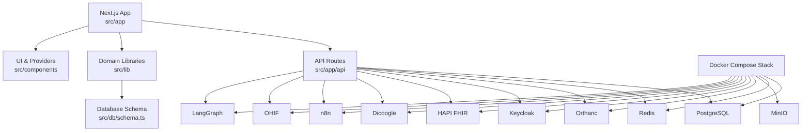
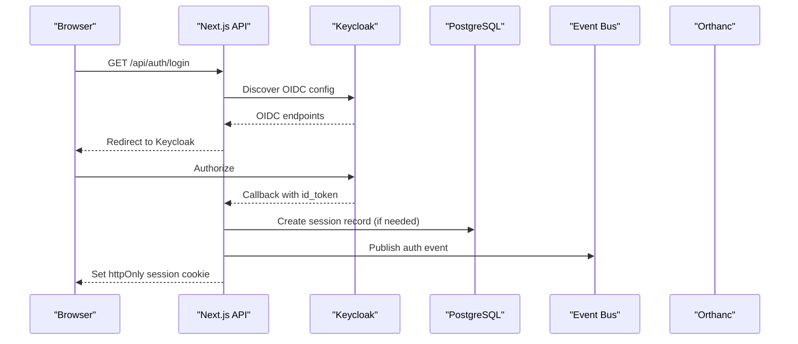
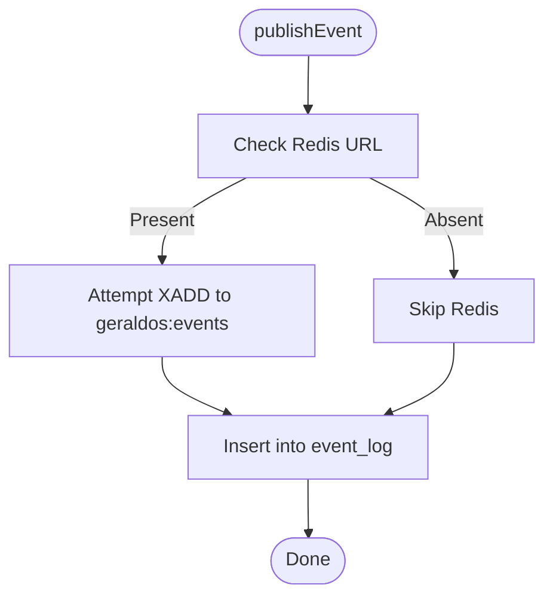
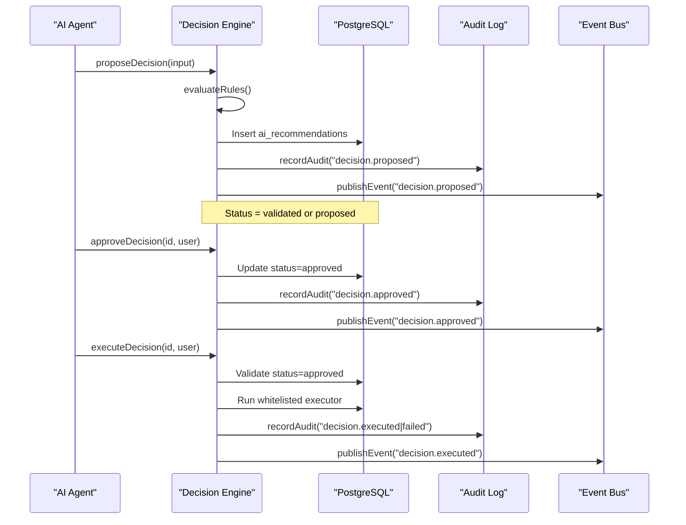
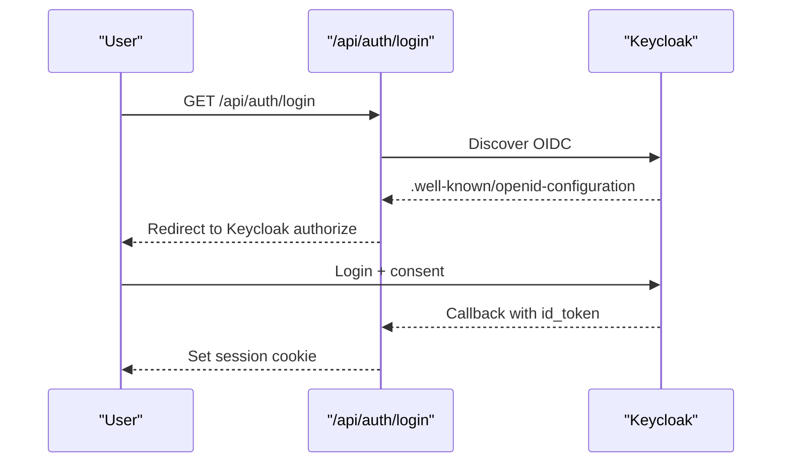
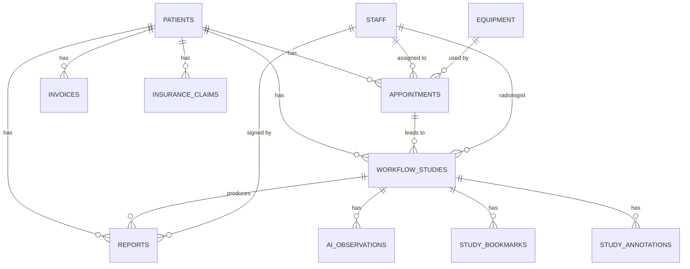
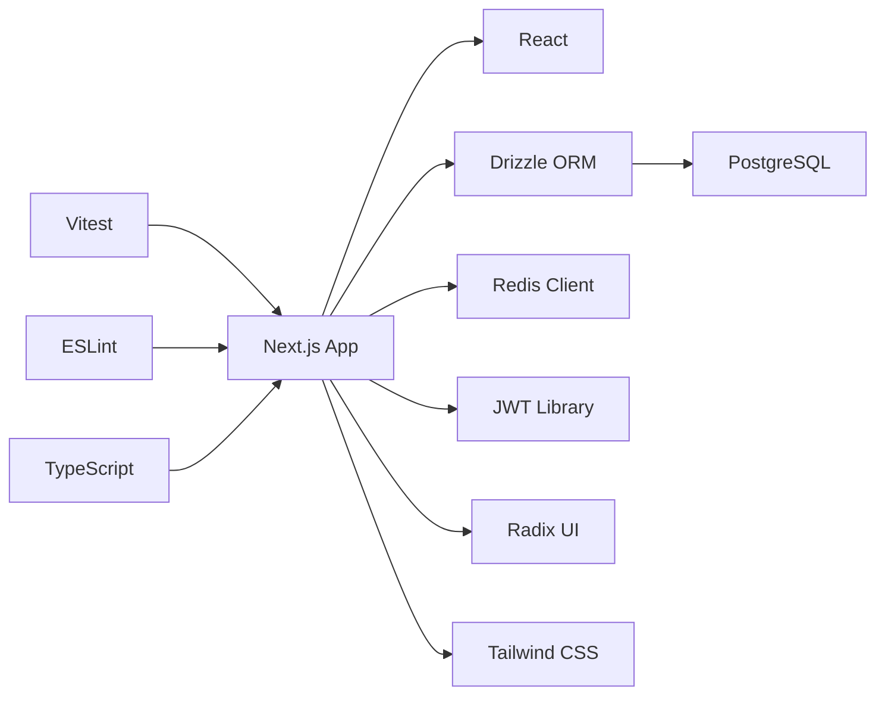

# Development Guide

<cite>
**Referenced Files in This Document**
- [README.md](file://README.md)
- [package.json](file://package.json)
- [tsconfig.json](file://tsconfig.json)
- [eslint.config.mjs](file://eslint.config.mjs)
- [vitest.config.ts](file://vitest.config.ts)
- [docker-compose.yml](file://docker-compose.yml)
- [drizzle.config.json](file://drizzle.config.json)
- [next.config.ts](file://next.config.ts)
- [src/app/layout.tsx](file://src/app/layout.tsx)
- [src/db/schema.ts](file://src/db/schema.ts)
- [src/lib/events.ts](file://src/lib/events.ts)
- [src/lib/decision-engine.ts](file://src/lib/decision-engine.ts)
- [src/app/api/auth/login/route.ts](file://src/app/api/auth/login/route.ts)
- [__tests__/lib/events.test.ts](file://__tests__/lib/events.test.ts)
- [__tests__/lib/decision-engine.test.ts](file://__tests__/lib/decision-engine.test.ts)
- [services/start-all.sh](file://services/start-all.sh)
</cite>

## Table of Contents
1. Introduction
2. Project Structure
3. Core Components
4. Architecture Overview
5. Detailed Component Analysis
6. Dependency Analysis
7. Performance Considerations
8. Troubleshooting Guide
9. Conclusion
10. Appendices

## Introduction
This guide is for contributors building on the GeraldOS platform, an AI-native diagnostic imaging operations platform that orchestrates patients, scheduling, workflow, equipment, inventory, reporting, and AI agents while delegating DICOM storage to Orthanc, image display to OHIF/Weasis, identity to Keycloak, automation to n8n, and agent reasoning to LangGraph. It covers development environment setup, code organization principles, contribution workflows, coding standards, TypeScript configuration, ESLint rules, testing frameworks, adding/modifying features with backward compatibility, debugging/logging strategies, performance profiling, and healthcare-specific best practices (privacy, security, compliance).

**Section sources**
- [README.md:1-121](file://README.md#L1-L121)

## Project Structure
GeraldOS is a Next.js application with server-side API routes under src/app/api, domain libraries under src/lib, database schema under src/db, shared UI components under src/components, and integration orchestration scripts under services. The approved stack runs via Docker Compose and includes PostgreSQL, Redis, MinIO, Orthanc, Keycloak, HAPI FHIR, Dicoogle, n8n, OHIF, and LangGraph.

Key entry points and structure:
- Root layout and providers: src/app/layout.tsx
- API routes: src/app/api/* (Next.js App Router)
- Domain logic: src/lib/* (events, decision engine, integrations, workflow, etc.)
- Database schema: src/db/schema.ts (Drizzle ORM)
- Tests: __tests__/lib/* (Vitest)
- Dev/test tooling: package.json scripts, tsconfig.json, eslint.config.mjs, vitest.config.ts
- Infrastructure: docker-compose.yml, drizzle.config.json, services/start-all.sh

**Diagram sources**
- [docker-compose.yml:1-118](file://docker-compose.yml#L1-L118)
- [src/app/layout.tsx:1-27](file://src/app/layout.tsx#L1-L27)
- [src/db/schema.ts:1-468](file://src/db/schema.ts#L1-L468)

**Section sources**
- [README.md:25-89](file://README.md#L25-L89)
- [docker-compose.yml:1-118](file://docker-compose.yml#L1-L118)
- [src/app/layout.tsx:1-27](file://src/app/layout.tsx#L1-L27)

## Core Components
- Event Bus: Centralized event-driven architecture using Redis Streams when available and always persisting to the event_log table for auditability.
- Decision Engine: Enforces business rules and human approval before any AI-suggested action executes; logs audits and publishes events.
- Authentication: OIDC login flow with Keycloak; fallback dev mode when Keycloak is not configured.
- Database Schema: Drizzle ORM definitions for all domain entities including patients, scheduling, workflow, finance, AI review, knowledge, and events.

**Section sources**
- [src/lib/events.ts:1-158](file://src/lib/events.ts#L1-L158)
- [src/lib/decision-engine.ts:1-245](file://src/lib/decision-engine.ts#L1-L245)
- [src/app/api/auth/login/route.ts:1-31](file://src/app/api/auth/login/route.ts#L1-L31)
- [src/db/schema.ts:1-468](file://src/db/schema.ts#L1-L468)

## Architecture Overview
The platform integrates multiple services through Next.js API routes. All credentials remain server-side; browsers only receive whitelisted non-secret configuration. Health checks are exposed for core services.

**Diagram sources**
- [src/app/api/auth/login/route.ts:1-31](file://src/app/api/auth/login/route.ts#L1-L31)
- [src/lib/events.ts:101-131](file://src/lib/events.ts#L101-L131)
- [docker-compose.yml:57-65](file://docker-compose.yml#L57-L65)

**Section sources**
- [README.md:66-89](file://README.md#L66-L89)
- [README.md:115-121](file://README.md#L115-L121)

## Detailed Component Analysis

### Event Bus
- Purpose: Decouple modules by publishing domain events; durable persistence via event_log; optional real-time distribution via Redis Streams.
- Key behaviors:
  - publishEvent writes to Redis stream if configured and always persists to event_log.
  - listEvents queries recent events from the database.
  - eventCounts aggregates counts by type for activity feeds.
- Error handling: Graceful degradation when Redis is unreachable; non-fatal failures do not block callers.

**Diagram sources**
- [src/lib/events.ts:72-131](file://src/lib/events.ts#L72-L131)

**Section sources**
- [src/lib/events.ts:1-158](file://src/lib/events.ts#L1-L158)
- [__tests__/lib/events.test.ts:1-108](file://__tests__/lib/events.test.ts#L1-L108)

### Decision Engine
- Purpose: Ensure AI suggestions never execute autonomously; enforce business rules, validation, human approval, execution, and audit logging.
- Flow:
  - proposeDecision evaluates rules; sets status to validated or proposed; records audit and publishes event.
  - approveDecision requires explicit human approval; updates status and emits events.
  - rejectDecision transitions to rejected with audit.
  - executeDecision runs whitelisted actions only after approval; records outcome and events.
- Business rules include preventing auto-signing reports, autonomous diagnosis, and restricting STAT priority to specific modules.

**Diagram sources**
- [src/lib/decision-engine.ts:91-235](file://src/lib/decision-engine.ts#L91-L235)

**Section sources**
- [src/lib/decision-engine.ts:1-245](file://src/lib/decision-engine.ts#L1-L245)
- [__tests__/lib/decision-engine.test.ts:1-152](file://__tests__/lib/decision-engine.test.ts#L1-L152)

### Authentication Flow
- OIDC login redirects to Keycloak; callback verifies token and issues an httpOnly, sameSite=lax HS256 session cookie.
- When Keycloak is not configured, the app supports a degraded mode via dev endpoint.

**Diagram sources**
- [src/app/api/auth/login/route.ts:1-31](file://src/app/api/auth/login/route.ts#L1-L31)
- [README.md:68-72](file://README.md#L68-L72)

**Section sources**
- [src/app/api/auth/login/route.ts:1-31](file://src/app/api/auth/login/route.ts#L1-L31)
- [README.md:68-72](file://README.md#L68-L72)

### Database Schema and Migrations
- Drizzle ORM schema defines all tables for patients, scheduling, workflow, finance, AI review, knowledge, bookmarks, annotations, events, and notifications.
- Use drizzle-kit push to apply schema changes locally and in CI.

**Diagram sources**
- [src/db/schema.ts:17-468](file://src/db/schema.ts#L17-L468)

**Section sources**
- [src/db/schema.ts:1-468](file://src/db/schema.ts#L1-L468)
- [drizzle.config.json:1-8](file://drizzle.config.json#L1-L8)

## Dependency Analysis
- Runtime dependencies include Next.js, React, Drizzle ORM, PostgreSQL driver, Redis client, JWT library, and UI primitives.
- Dev dependencies include TypeScript, ESLint, Vitest, Tailwind, PostCSS, and Drizzle Kit.
- Scripts provide standard commands for development, build, lint, typecheck, test, and database migrations.

**Diagram sources**
- [package.json:14-60](file://package.json#L14-L60)

**Section sources**
- [package.json:1-62](file://package.json#L1-L62)

## Performance Considerations
- Prefer server-side data loading in API routes; avoid heavy client-side computation.
- Use pagination and filtering for large datasets (e.g., worklist, events).
- Cache frequently accessed read-only data where appropriate; ensure cache invalidation on writes.
- Profile API routes with built-in metrics and external tools; monitor Redis and PostgreSQL latency.
- Keep event payloads small; use Redis Streams for high-throughput scenarios but rely on event_log for durability.

[No sources needed since this section provides general guidance]

## Troubleshooting Guide
Common issues and resolutions:
- Redis unavailable: Event publishing still persists to event_log; check Redis connectivity and backoff behavior.
- Keycloak not configured: Login redirects to error page; enable dev mode or configure Keycloak endpoints.
- Database migration errors: Re-run drizzle-kit push; verify connection string and schema changes.
- Integration health: Use /api/health and /api/integrations/status to inspect service connectivity and latency.

**Section sources**
- [src/lib/events.ts:72-131](file://src/lib/events.ts#L72-L131)
- [src/app/api/auth/login/route.ts:7-29](file://src/app/api/auth/login/route.ts#L7-L29)
- [README.md:47-64](file://README.md#L47-L64)

## Conclusion
GeraldOS provides a robust, secure, and extensible foundation for healthcare imaging operations. By following the development environment setup, adhering to coding standards and testing practices, and leveraging the event bus and decision engine, contributors can safely add features while maintaining regulatory compliance and system reliability.

[No sources needed since this section summarizes without analyzing specific files]

## Appendices

### Development Environment Setup
- Start the approved stack: docker compose up -d
- Configure environment variables from .env.example
- Push schema and seed demo data: npm run db:push and seed endpoint
- Run the platform: npm install && npm run build && npm start

**Section sources**
- [README.md:47-64](file://README.md#L47-L64)
- [docker-compose.yml:1-118](file://docker-compose.yml#L1-L118)

### Code Organization Principles
- Feature-based routing: Each module has dedicated pages and API routes under src/app.
- Domain libraries: Pure logic resides in src/lib (events, decision engine, workflow, etc.).
- Shared UI: Reusable components in src/components/ui and src/components/workstation.
- Data access: Centralized schema and DB client in src/db.

**Section sources**
- [src/app/layout.tsx:1-27](file://src/app/layout.tsx#L1-L27)
- [src/db/schema.ts:1-468](file://src/db/schema.ts#L1-L468)

### Contribution Workflows
- Create a feature branch and implement changes in src/app and src/lib.
- Add tests under __tests__ mirroring existing patterns.
- Run linter and type checker: npm run lint && npm run typecheck
- Execute tests: npm run test
- Apply schema changes: npm run db:push
- Open a PR with clear description and screenshots if UI changes.

**Section sources**
- [package.json:4-12](file://package.json#L4-L12)
- [vitest.config.ts:1-17](file://vitest.config.ts#L1-L17)

### Coding Standards and Tooling
- TypeScript strict mode enabled; path aliases configured for @/*.
- ESLint extends Next core web vitals; disables a rule to accommodate effect-based async fetch patterns used across the app.
- Vitest configured with node environment and alias resolution for tests.

**Section sources**
- [tsconfig.json:1-43](file://tsconfig.json#L1-L43)
- [eslint.config.mjs:1-20](file://eslint.config.mjs#L1-L20)
- [vitest.config.ts:1-17](file://vitest.config.ts#L1-L17)

### Testing Frameworks
- Unit tests mock database and integrations; validate event publishing and decision engine rules.
- Use beforeEach to reset mocks; assert state transitions and outputs.

**Section sources**
- [__tests__/lib/events.test.ts:1-108](file://__tests__/lib/events.test.ts#L1-L108)
- [__tests__/lib/decision-engine.test.ts:1-152](file://__tests__/lib/decision-engine.test.ts#L1-L152)

### Adding New Features
- Define new API route under src/app/api/<feature>/route.ts.
- Implement domain logic in src/lib/<feature>.ts.
- Extend schema if needed; run drizzle-kit push.
- Add tests under __tests__/lib/<feature>.test.ts.
- Expose health/status endpoints for new integrations.

**Section sources**
- [src/app/api/auth/login/route.ts:1-31](file://src/app/api/auth/login/route.ts#L1-L31)
- [src/lib/events.ts:1-158](file://src/lib/events.ts#L1-L158)
- [drizzle.config.json:1-8](file://drizzle.config.json#L1-L8)

### Modifying Existing Components
- Update component files under src/components and ensure backward compatibility via stable props and interfaces.
- Maintain event contracts; avoid breaking changes to EVENT_TYPES and payload shapes.
- Update decision engine rules only when policy changes require it; document rationale.

**Section sources**
- [src/lib/decision-engine.ts:45-89](file://src/lib/decision-engine.ts#L45-L89)
- [src/lib/events.ts:18-62](file://src/lib/events.ts#L18-L62)

### Maintaining Backward Compatibility
- Version APIs when necessary; deprecate old endpoints gradually.
- Preserve event types and schemas; add new fields as optional.
- Use whitelisted executors in decision engine to constrain changes.

**Section sources**
- [src/lib/decision-engine.ts:171-210](file://src/lib/decision-engine.ts#L171-L210)
- [src/lib/events.ts:18-62](file://src/lib/events.ts#L18-L62)

### Debugging Techniques and Logging Strategies
- Use console.error for non-fatal errors; prefer structured logging in production.
- Inspect event_log for audit trails and activity feed.
- Leverage /api/health and /api/integrations/status for service diagnostics.
- For local development, use services/start-all.sh to bootstrap integrations and observe logs.

**Section sources**
- [src/lib/events.ts:119-131](file://src/lib/events.ts#L119-L131)
- [README.md:47-64](file://README.md#L47-L64)
- [services/start-all.sh:1-100](file://services/start-all.sh#L1-L100)

### Performance Profiling Tools
- Use Next.js built-in performance insights and network tab for API timing.
- Monitor Redis and PostgreSQL metrics; tune connection pools and query plans.
- Profile event throughput and event_log growth; consider archiving strategies.

[No sources needed since this section provides general guidance]

### Healthcare Best Practices: Privacy, Security, Compliance
- Keep credentials server-side; expose only whitelisted configuration to clients.
- Use httpOnly, sameSite=lax session cookies; validate tokens against JWKS.
- Audit all sensitive actions; maintain immutable event_log entries.
- Restrict AI actions through decision engine; require human approval for critical operations.
- Follow HIPAA-like principles: minimize data exposure, enforce least privilege, and ensure secure communications.

**Section sources**
- [README.md:115-121](file://README.md#L115-L121)
- [src/lib/decision-engine.ts:1-11](file://src/lib/decision-engine.ts#L1-L11)

### Common Development Tasks
- Start services: docker compose up -d or services/start-all.sh
- Push schema: npm run db:push
- Run tests: npm run test
- Lint and typecheck: npm run lint && npm run typecheck
- Seed demo data: curl POST to /api/seed

**Section sources**
- [README.md:47-64](file://README.md#L47-L64)
- [package.json:4-12](file://package.json#L4-L12)
- [services/start-all.sh:1-100](file://services/start-all.sh#L1-L100)

### Common Issues and Resolutions
- Redis down: Events still persist to event_log; investigate Redis connectivity and backoff settings.
- Keycloak misconfigured: Verify endpoints and realm; fall back to dev mode temporarily.
- Migration conflicts: Review schema diffs and re-run drizzle-kit push; rollback if necessary.
- Integration health: Check /api/integrations/status; restart services as needed.

**Section sources**
- [src/lib/events.ts:72-131](file://src/lib/events.ts#L72-L131)
- [src/app/api/auth/login/route.ts:7-29](file://src/app/api/auth/login/route.ts#L7-L29)
- [README.md:47-64](file://README.md#L47-L64)