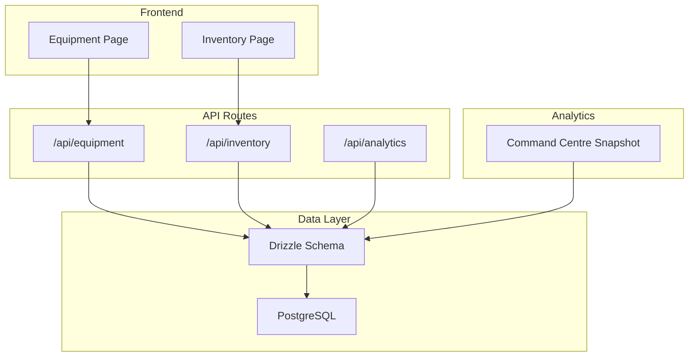
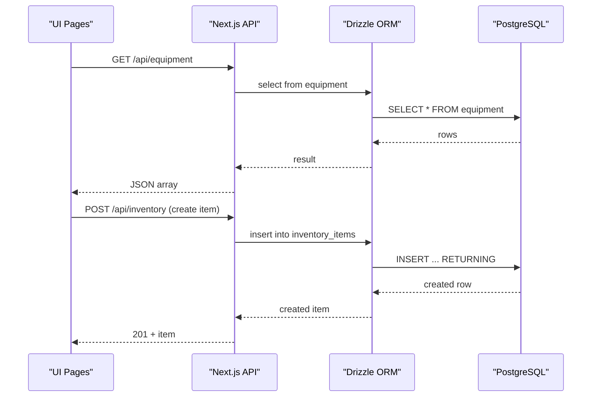
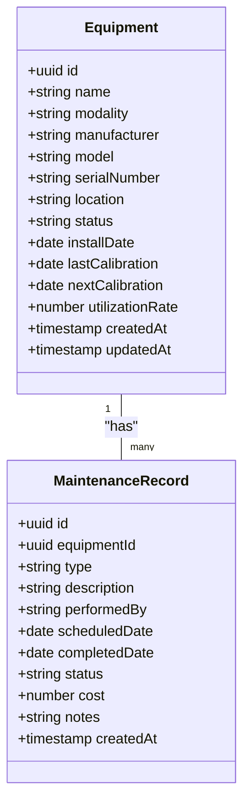
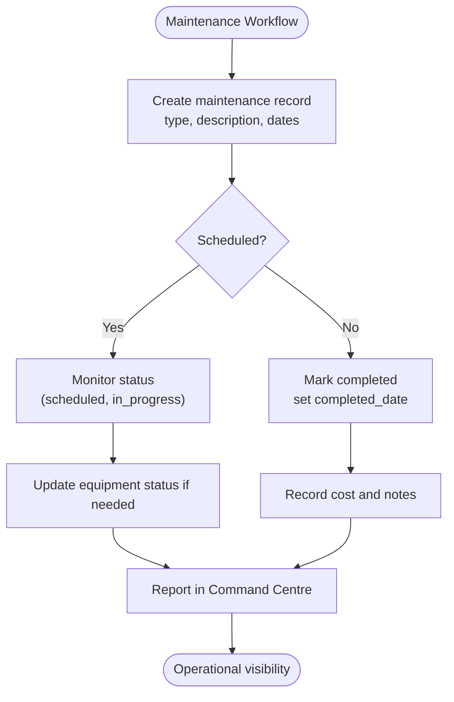
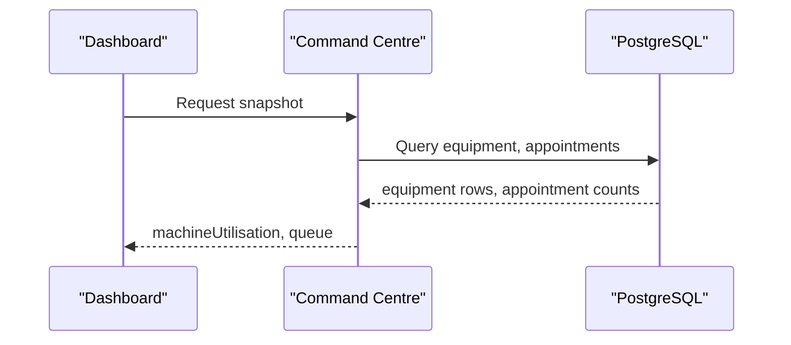
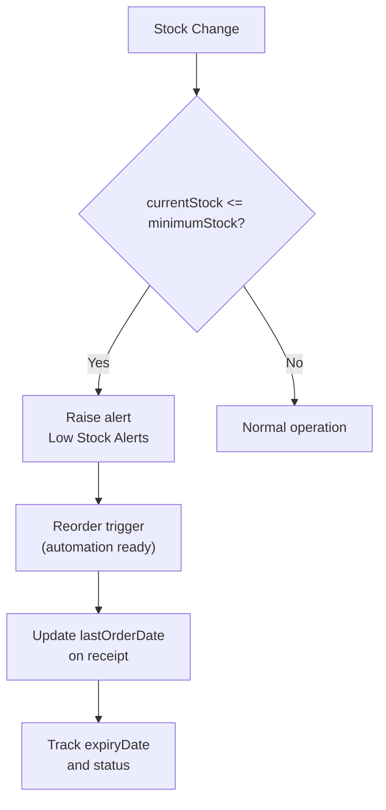
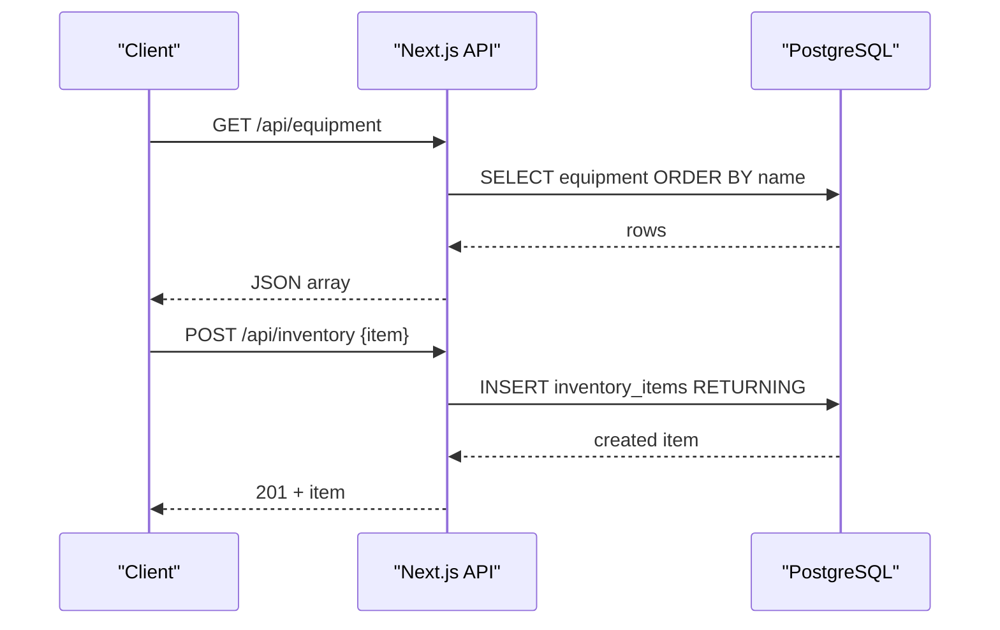
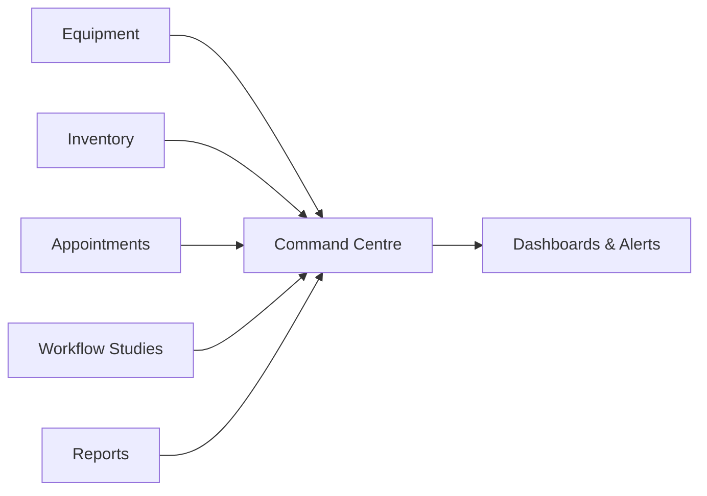
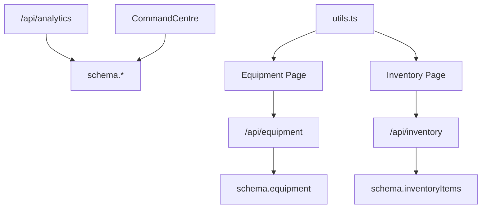

# Equipment & Inventory

<cite>
**Referenced Files in This Document**
- [route.ts](file://src/app/api/equipment/route.ts)
- [route.ts](file://src/app/api/inventory/route.ts)
- [page.tsx](file://src/app/equipment/page.tsx)
- [page.tsx](file://src/app/inventory/page.tsx)
- [schema.ts](file://src/db/schema.ts)
- [utils.ts](file://src/lib/utils.ts)
- [command-centre.ts](file://src/lib/command-centre.ts)
- [route.ts](file://src/app/api/analytics/route.ts)
- [0000_redundant_the_twelve.sql](file://drizzle/0000_redundant_the_twelve.sql)
</cite>

## Table of Contents
1. [Introduction](#introduction)
2. [Project Structure](#project-structure)
3. [Core Components](#core-components)
4. [Architecture Overview](#architecture-overview)
5. [Detailed Component Analysis](#detailed-component-analysis)
6. [Dependency Analysis](#dependency-analysis)
7. [Performance Considerations](#performance-considerations)
8. [Troubleshooting Guide](#troubleshooting-guide)
9. [Conclusion](#conclusion)
10. [Appendices](#appendices)

## Introduction
This document explains the equipment and inventory management capabilities implemented in the platform. It covers:
- Equipment registry, maintenance scheduling, utilization analytics, and downtime management
- Inventory control including stock level monitoring, reorder automation triggers, expiry tracking, and supplier management
- Concrete examples from the codebase showing lifecycle management and inventory optimization
- API endpoints for equipment and inventory operations, alerts, and reporting
- Operational scenarios such as maintenance planning, inventory optimization, and supply chain management

## Project Structure
The system exposes Next.js API routes for equipment and inventory CRUD, a database schema with Drizzle ORM, and UI pages that visualize status, alerts, and metrics. A command centre aggregates operational KPIs across equipment, inventory, and workflow data.

**Diagram sources**
- [route.ts:6-23](file://src/app/api/equipment/route.ts#L6-L23)
- [route.ts:6-23](file://src/app/api/inventory/route.ts#L6-L23)
- [route.ts:6-57](file://src/app/api/analytics/route.ts#L6-L57)
- [schema.ts:53-164](file://src/db/schema.ts#L53-L164)
- [command-centre.ts:54-206](file://src/lib/command-centre.ts#L54-L206)

**Section sources**
- [route.ts:6-23](file://src/app/api/equipment/route.ts#L6-L23)
- [route.ts:6-23](file://src/app/api/inventory/route.ts#L6-L23)
- [schema.ts:53-164](file://src/db/schema.ts#L53-L164)
- [command-centre.ts:54-206](file://src/lib/command-centre.ts#L54-L206)

## Core Components
- Equipment Registry: Stores imaging equipment details, calibration dates, status, and utilization rate.
- Maintenance Scheduling: Tracks planned/completed maintenance per equipment with type, dates, cost, and notes.
- Utilization Analytics: Aggregates machine utilization and queue status to inform capacity planning.
- Downtime Management: Surveys offline/maintenance states and integrates with operational risk reporting.
- Inventory Control: Tracks consumables with stock levels, minimum thresholds, unit costs, suppliers, and expiry dates.
- Reorder Automation: Low-stock detection and alerts; foundation for automated reorder triggers.
- Supplier Management: Supplier association on items and last order date tracking.

**Section sources**
- [schema.ts:53-68](file://src/db/schema.ts#L53-L68)
- [schema.ts:121-134](file://src/db/schema.ts#L121-L134)
- [schema.ts:137-164](file://src/db/schema.ts#L137-L164)
- [command-centre.ts:142-172](file://src/lib/command-centre.ts#L142-L172)

## Architecture Overview
The architecture follows a layered approach:
- UI Pages call Next.js API routes
- API routes use Drizzle ORM to query/update PostgreSQL tables defined in the schema
- Command Centre aggregates cross-domain KPIs (equipment, inventory, workflow) into a single snapshot used by dashboards and alerts

**Diagram sources**
- [route.ts:6-23](file://src/app/api/equipment/route.ts#L6-L23)
- [route.ts:6-23](file://src/app/api/inventory/route.ts#L6-L23)
- [schema.ts:53-68](file://src/db/schema.ts#L53-L68)
- [schema.ts:137-164](file://src/db/schema.ts#L137-L164)

## Detailed Component Analysis

### Equipment Registry and Lifecycle
- Data model includes name, modality, manufacturer, model, serial number, location, status, install date, calibration dates, and utilization rate.
- UI provides add dialog and table view with status badges and utilization bars.
- Statuses include operational, maintenance, and offline. Calibration due dates are highlighted when overdue.

**Diagram sources**
- [schema.ts:53-68](file://src/db/schema.ts#L53-L68)
- [schema.ts:121-134](file://src/db/schema.ts#L121-L134)

**Section sources**
- [page.tsx:23-36](file://src/app/equipment/page.tsx#L23-L36)
- [page.tsx:51-69](file://src/app/equipment/page.tsx#L51-L69)
- [page.tsx:189-259](file://src/app/equipment/page.tsx#L189-L259)
- [schema.ts:53-68](file://src/db/schema.ts#L53-L68)
- [schema.ts:121-134](file://src/db/schema.ts#L121-L134)

### Maintenance Scheduling and Downtime Management
- Maintenance records track type, description, performer, scheduled/completed dates, status, cost, and notes.
- Command Centre surfaces open maintenance and offline equipment as operational risks.
- UI highlights overdue next calibration dates and shows maintenance counts.

**Diagram sources**
- [schema.ts:121-134](file://src/db/schema.ts#L121-L134)
- [command-centre.ts:142-172](file://src/lib/command-centre.ts#L142-L172)

**Section sources**
- [schema.ts:121-134](file://src/db/schema.ts#L121-L134)
- [command-centre.ts:142-172](file://src/lib/command-centre.ts#L142-L172)
- [page.tsx:189-259](file://src/app/equipment/page.tsx#L189-L259)

### Utilization Analytics
- Utilization rate is stored per equipment and surfaced in dashboards and command centre snapshots.
- Queue analysis combines waiting and in-progress appointments per equipment to infer load.

**Diagram sources**
- [command-centre.ts:72-96](file://src/lib/command-centre.ts#L72-L96)
- [command-centre.ts:167-172](file://src/lib/command-centre.ts#L167-L172)

**Section sources**
- [command-centre.ts:72-96](file://src/lib/command-centre.ts#L72-L96)
- [command-centre.ts:167-172](file://src/lib/command-centre.ts#L167-L172)

### Inventory Control: Stock Monitoring, Reorder Automation, Expiry Tracking, Supplier Management
- Inventory items include current stock, minimum stock, maximum stock, unit, unit cost, supplier, last order date, expiry date, and status.
- UI computes low-stock lists and total inventory value; highlights low stock items.
- Command Centre aggregates low-stock alerts and integrates them into operational risks.

**Diagram sources**
- [schema.ts:137-164](file://src/db/schema.ts#L137-L164)
- [page.tsx:76-81](file://src/app/inventory/page.tsx#L76-L81)
- [command-centre.ts:69-70](file://src/lib/command-centre.ts#L69-L70)

**Section sources**
- [schema.ts:137-164](file://src/db/schema.ts#L137-L164)
- [page.tsx:53-74](file://src/app/inventory/page.tsx#L53-L74)
- [page.tsx:157-229](file://src/app/inventory/page.tsx#L157-L229)
- [command-centre.ts:69-70](file://src/lib/command-centre.ts#L69-L70)

### API Endpoints
- GET /api/equipment: Returns all equipment sorted by name.
- POST /api/equipment: Creates a new equipment entry.
- GET /api/inventory: Returns all inventory items sorted by category and name.
- POST /api/inventory: Creates a new inventory item.
- GET /api/analytics: Returns aggregated counts, low-stock count, equipment status distribution, studies by stage/modality.

**Diagram sources**
- [route.ts:6-23](file://src/app/api/equipment/route.ts#L6-L23)
- [route.ts:6-23](file://src/app/api/inventory/route.ts#L6-L23)
- [route.ts:6-57](file://src/app/api/analytics/route.ts#L6-L57)

**Section sources**
- [route.ts:6-23](file://src/app/api/equipment/route.ts#L6-L23)
- [route.ts:6-23](file://src/app/api/inventory/route.ts#L6-L23)
- [route.ts:6-57](file://src/app/api/analytics/route.ts#L6-L57)

### Reporting and Alerts
- Command Centre snapshot includes:
  - KPIs: patients today, appointments today, active studies, pending reports, emergency cases, revenue today, low stock alerts, maintenance open, equipment operational/total
  - Machine utilization and queue per equipment
  - Inventory alerts and maintenance alerts
  - Operational risks derived from offline/maintenance equipment, low stock, delayed appointments, pending claims/reports

**Diagram sources**
- [command-centre.ts:27-52](file://src/lib/command-centre.ts#L27-L52)
- [command-centre.ts:54-206](file://src/lib/command-centre.ts#L54-L206)

**Section sources**
- [command-centre.ts:27-52](file://src/lib/command-centre.ts#L27-L52)
- [command-centre.ts:54-206](file://src/lib/command-centre.ts#L54-L206)

## Dependency Analysis
- Equipment and inventory APIs depend on Drizzle schema definitions and PostgreSQL tables.
- Command Centre depends on multiple schemas (equipment, inventory, appointments, workflow studies, reports, invoices, referrals, insurance claims).
- UI pages depend on API routes and utility functions for formatting and categories.

**Diagram sources**
- [route.ts:6-23](file://src/app/api/equipment/route.ts#L6-L23)
- [route.ts:6-23](file://src/app/api/inventory/route.ts#L6-L23)
- [route.ts:6-57](file://src/app/api/analytics/route.ts#L6-L57)
- [schema.ts:53-164](file://src/db/schema.ts#L53-L164)
- [utils.ts:52-72](file://src/lib/utils.ts#L52-L72)

**Section sources**
- [route.ts:6-23](file://src/app/api/equipment/route.ts#L6-L23)
- [route.ts:6-23](file://src/app/api/inventory/route.ts#L6-L23)
- [route.ts:6-57](file://src/app/api/analytics/route.ts#L6-L57)
- [schema.ts:53-164](file://src/db/schema.ts#L53-L164)
- [utils.ts:52-72](file://src/lib/utils.ts#L52-L72)

## Performance Considerations
- Use indexed queries for frequent filters (e.g., equipment.status, inventoryItems.currentStock vs minimumStock) to improve dashboard responsiveness.
- Batch reads in Command Centre already parallelize per-equipment queue counts; consider adding server-side pagination for large datasets.
- Avoid unnecessary recalculations by caching snapshot results for short intervals where appropriate.

[No sources needed since this section provides general guidance]

## Troubleshooting Guide
Common issues and resolutions:
- API returns 500 errors: Check database connectivity and schema alignment; verify Drizzle migrations applied.
- No equipment or inventory data: Ensure POST endpoints were used to create entries; validate required fields.
- Low stock alerts not appearing: Confirm currentStock and minimumStock values; verify sorting/filtering logic in UI.
- Overdue calibration not highlighted: Ensure nextCalibration is set; check date formatting and comparison logic.

**Section sources**
- [route.ts:6-23](file://src/app/api/equipment/route.ts#L6-L23)
- [route.ts:6-23](file://src/app/api/inventory/route.ts#L6-L23)
- [page.tsx:189-259](file://src/app/equipment/page.tsx#L189-L259)
- [page.tsx:157-229](file://src/app/inventory/page.tsx#L157-L229)

## Conclusion
The platform provides a solid foundation for equipment and inventory management:
- Equipment registry supports lifecycle tracking with calibration and status management
- Maintenance scheduling and downtime visibility integrate with operational risk reporting
- Inventory control offers stock monitoring, reorder readiness, expiry tracking, and supplier linkage
- APIs and command centre enable real-time analytics and actionable insights

[No sources needed since this section summarizes without analyzing specific files]

## Appendices

### Database Schema Highlights
- Equipment fields: id, name, modality, manufacturer, model, serialNumber, location, status, installDate, lastCalibration, nextCalibration, utilizationRate
- MaintenanceRecords fields: id, equipmentId, type, description, performedBy, scheduledDate, completedDate, status, cost, notes
- InventoryItems fields: id, name, category, sku, currentStock, minimumStock, maximumStock, unit, unitCost, supplier, lastOrderDate, expiryDate, location, status

**Section sources**
- [schema.ts:53-68](file://src/db/schema.ts#L53-L68)
- [schema.ts:121-134](file://src/db/schema.ts#L121-L134)
- [schema.ts:137-164](file://src/db/schema.ts#L137-L164)
- [0000_redundant_the_twelve.sql:104-180](file://drizzle/0000_redundant_the_twelve.sql#L104-L180)

### Operational Scenarios
- Equipment maintenance planning:
  - Create maintenance records with scheduled dates
  - Monitor open maintenance via command centre
  - Update equipment status during maintenance windows
- Inventory optimization:
  - Set minimum stock thresholds per item
  - Review low stock alerts and initiate reorders
  - Track last order dates and expiry dates for compliance
- Supply chain management:
  - Associate suppliers and monitor last order dates
  - Use analytics to correlate stock levels with usage patterns

**Section sources**
- [command-centre.ts:69-70](file://src/lib/command-centre.ts#L69-L70)
- [command-centre.ts:142-172](file://src/lib/command-centre.ts#L142-L172)
- [page.tsx:157-229](file://src/app/inventory/page.tsx#L157-L229)