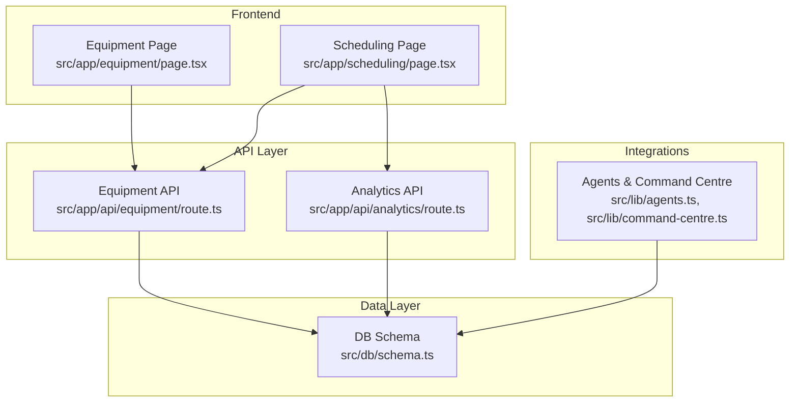
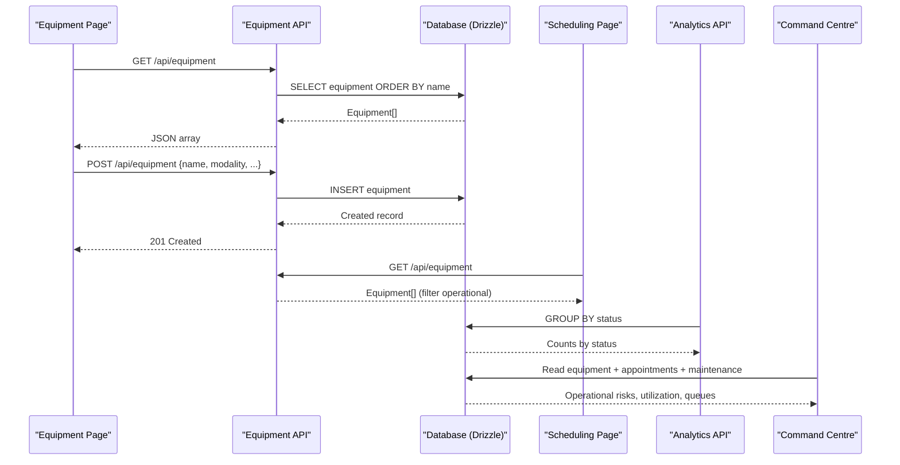
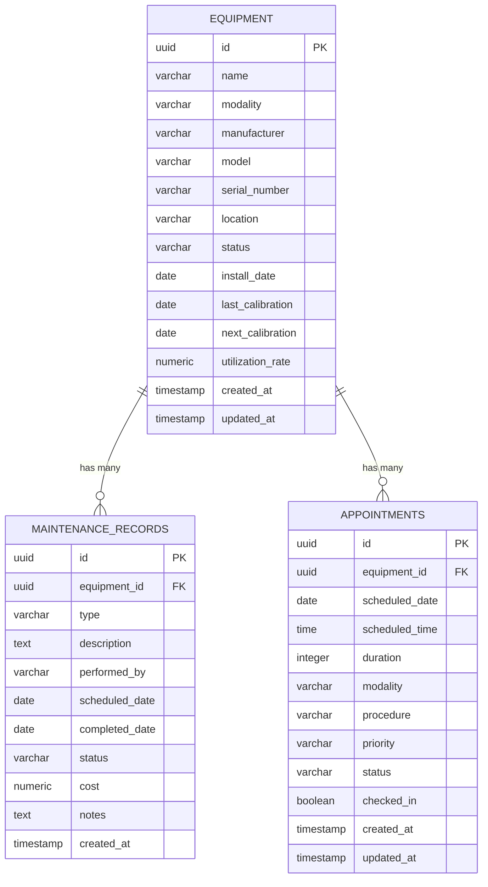
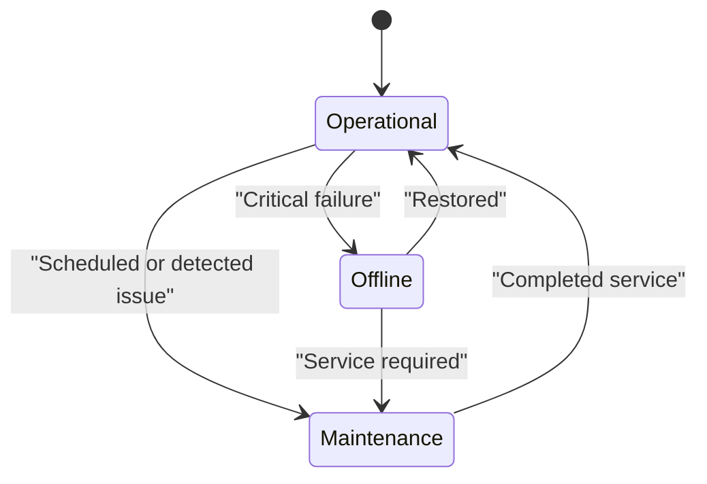
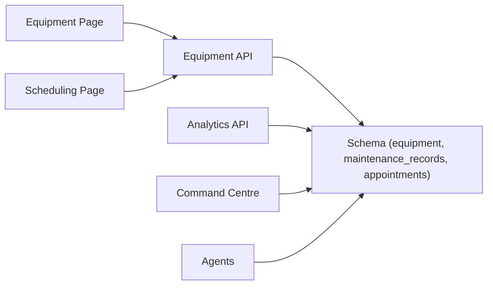

# Equipment Management

<cite>
**Referenced Files in This Document**
- [route.ts](file://src/app/api/equipment/route.ts)
- [page.tsx](file://src/app/equipment/page.tsx)
- [schema.ts](file://src/db/schema.ts)
- [utils.ts](file://src/lib/utils.ts)
- [route.ts](file://src/app/api/analytics/route.ts)
- [agents.ts](file://src/lib/agents.ts)
- [command-centre.ts](file://src/lib/command-centre.ts)
- [page.tsx](file://src/app/scheduling/page.tsx)
</cite>

## Table of Contents
1. [Introduction](#introduction)
2. [Project Structure](#project-structure)
3. [Core Components](#core-components)
4. [Architecture Overview](#architecture-overview)
5. [Detailed Component Analysis](#detailed-component-analysis)
6. [Dependency Analysis](#dependency-analysis)
7. [Performance Considerations](#performance-considerations)
8. [Troubleshooting Guide](#troubleshooting-guide)
9. [Conclusion](#conclusion)
10. [Appendices](#appendices)

## Introduction
This document describes the equipment management system for imaging assets, covering registration, status tracking (operational, maintenance, offline), lifecycle attributes (modality, manufacturer, model, serial number, location, calibration dates), and utilization analytics. It explains how the frontend registry and API endpoints enable CRUD-like operations for creating and listing equipment, how scheduling integrates with equipment availability, and how monitoring and maintenance features are surfaced through analytics and command centre dashboards.

## Project Structure
The equipment feature spans a Next.js App Router API route, a React page for the registry UI, a Drizzle schema defining the database tables, and supporting modules for analytics, agents, and scheduling integration.

**Diagram sources**
- [page.tsx:1-265](file://src/app/equipment/page.tsx#L1-L265)
- [route.ts:1-24](file://src/app/api/equipment/route.ts#L1-L24)
- [schema.ts:53-68](file://src/db/schema.ts#L53-L68)
- [route.ts:1-58](file://src/app/api/analytics/route.ts#L1-L58)
- [agents.ts:103-116](file://src/lib/agents.ts#L103-L116)
- [command-centre.ts:72-206](file://src/lib/command-centre.ts#L72-L206)
- [page.tsx:1-236](file://src/app/scheduling/page.tsx#L1-L236)

**Section sources**
- [page.tsx:1-265](file://src/app/equipment/page.tsx#L1-L265)
- [route.ts:1-24](file://src/app/api/equipment/route.ts#L1-L24)
- [schema.ts:53-68](file://src/db/schema.ts#L53-L68)
- [route.ts:1-58](file://src/app/api/analytics/route.ts#L1-L58)
- [agents.ts:103-116](file://src/lib/agents.ts#L103-L116)
- [command-centre.ts:72-206](file://src/lib/command-centre.ts#L72-L206)
- [page.tsx:1-236](file://src/app/scheduling/page.tsx#L1-L236)

## Core Components
- Equipment Registry UI: Displays total units, operational/maintenance/offline counts, and a table of all equipment with key attributes and utilization visualization. Supports adding new equipment via a dialog form.
- Equipment API: Provides GET to list all equipment and POST to create a new equipment record.
- Database Schema: Defines the equipment table with fields for identity, modality, manufacturer, model, serial number, location, status, install date, calibration dates, utilization rate, and timestamps. Also defines maintenance records linked to equipment.
- Analytics: Aggregates equipment counts by status and other KPIs for dashboards.
- Scheduling Integration: Filters available machines by operational status and displays daily schedule per machine.
- Agents & Command Centre: Surface equipment health, queue impact, and utilization metrics; flag offline or maintenance units as operational risks.

**Section sources**
- [page.tsx:23-89](file://src/app/equipment/page.tsx#L23-L89)
- [route.ts:6-23](file://src/app/api/equipment/route.ts#L6-L23)
- [schema.ts:53-134](file://src/db/schema.ts#L53-L134)
- [route.ts:6-58](file://src/app/api/analytics/route.ts#L6-L58)
- [page.tsx:29-54](file://src/app/scheduling/page.tsx#L29-L54)
- [agents.ts:103-116](file://src/lib/agents.ts#L103-L116)
- [command-centre.ts:154-172](file://src/lib/command-centre.ts#L154-L172)

## Architecture Overview
The equipment management flow starts at the UI, which calls the equipment API to list or create records. The API persists data using Drizzle ORM against the Postgres schema. Dashboards and scheduling pages consume both equipment and related data (appointments, maintenance) to present utilization and availability. Agents and command centre aggregate operational signals such as offline or maintenance statuses into actionable insights.

**Diagram sources**
- [route.ts:6-23](file://src/app/api/equipment/route.ts#L6-L23)
- [page.tsx:42-69](file://src/app/equipment/page.tsx#L42-L69)
- [page.tsx:42-54](file://src/app/scheduling/page.tsx#L42-L54)
- [route.ts:6-58](file://src/app/api/analytics/route.ts#L6-L58)
- [command-centre.ts:72-206](file://src/lib/command-centre.ts#L72-L206)

## Detailed Component Analysis

### Equipment Data Model
The equipment entity captures core asset information and lifecycle metadata.

**Diagram sources**
- [schema.ts:53-68](file://src/db/schema.ts#L53-L68)
- [schema.ts:82-100](file://src/db/schema.ts#L82-L100)
- [schema.ts:121-134](file://src/db/schema.ts#L121-L134)

**Section sources**
- [schema.ts:53-68](file://src/db/schema.ts#L53-L68)
- [schema.ts:82-100](file://src/db/schema.ts#L82-L100)
- [schema.ts:121-134](file://src/db/schema.ts#L121-L134)

### Equipment Registry UI
The Equipment page provides:
- A dialog form to register new equipment with required fields like name and modality, plus optional manufacturer, model, serial number, and location.
- Summary cards showing total units and counts by status (operational, maintenance, offline).
- A table displaying equipment attributes including modality, manufacturer, model, location, serial number, last/next calibration dates, and utilization rate with a visual progress bar.

Status badges and icons differentiate operational, maintenance, and offline states. Utilization is rendered as a percentage-based bar.

**Section sources**
- [page.tsx:23-89](file://src/app/equipment/page.tsx#L23-L89)
- [page.tsx:90-187](file://src/app/equipment/page.tsx#L90-L187)
- [page.tsx:189-261](file://src/app/equipment/page.tsx#L189-L261)
- [utils.ts:8-14](file://src/lib/utils.ts#L8-L14)
- [utils.ts:52-61](file://src/lib/utils.ts#L52-L61)

### Equipment API Endpoints
- GET /api/equipment: Returns all equipment sorted by name.
- POST /api/equipment: Accepts a JSON body matching the equipment schema fields and inserts a new record, returning the created item.

Error handling returns a JSON error object with HTTP 500 on failures.

**Section sources**
- [route.ts:6-23](file://src/app/api/equipment/route.ts#L6-L23)

### Status Tracking and Lifecycle Management
- Status values include operational, maintenance, and offline. Default is operational.
- Lifecycle fields include install date, last calibration, and next calibration.
- Utilization rate is stored as a numeric percentage.

These fields support:
- Monitoring current fleet health (operational vs non-operational).
- Calibration reminders based on next calibration date.
- Utilization analytics for capacity planning.

**Section sources**
- [schema.ts:53-68](file://src/db/schema.ts#L53-L68)
- [page.tsx:71-88](file://src/app/equipment/page.tsx#L71-L88)

### Maintenance Scheduling and Records
Maintenance records link to equipment and capture:
- Type (e.g., preventive, corrective)
- Description and performed by
- Scheduled and completed dates
- Status (scheduled, in_progress, completed)
- Cost and notes

This enables maintenance workflows and visibility into service activities tied to specific equipment.

**Section sources**
- [schema.ts:121-134](file://src/db/schema.ts#L121-L134)

### Scheduling Integration
The scheduling page:
- Fetches equipment and filters to operational units for allocation.
- Displays a daily grid mapping time slots to equipment columns.
- Shows appointments assigned to each machine with patient, procedure, radiographer, and priority.

This ensures only available machines appear in the schedule and helps visualize workload distribution.

**Section sources**
- [page.tsx:29-54](file://src/app/scheduling/page.tsx#L29-L54)
- [page.tsx:126-186](file://src/app/scheduling/page.tsx#L126-L186)

### Monitoring, Maintenance Alerts, and Utilization Analytics
- Analytics endpoint aggregates equipment counts by status and other KPIs for dashboards.
- Command centre reads equipment, appointments, and maintenance to compute:
  - Queue sizes per equipment (waiting and in-progress)
  - Machine utilization from equipment.utilizationRate
  - Operational risks when equipment is offline or in maintenance
  - Maintenance alerts and open tasks

Agents also define an “Equipment Agent” responsible for proactive health monitoring, calibration/maintenance tracking, downtime impact estimation, and lifecycle/utilization tracking.

**Section sources**
- [route.ts:6-58](file://src/app/api/analytics/route.ts#L6-L58)
- [command-centre.ts:72-206](file://src/lib/command-centre.ts#L72-L206)
- [agents.ts:103-116](file://src/lib/agents.ts#L103-L116)

### Status Workflows
Conceptual workflow for equipment status transitions:

[No sources needed since this diagram shows conceptual workflow, not actual code structure]

## Dependency Analysis
The equipment module depends on:
- Drizzle ORM for querying and inserting equipment records.
- The equipment schema for data integrity and relationships.
- Frontend components for user interactions and display.
- Analytics and command centre modules for aggregated insights.
- Scheduling page for operational availability filtering.

**Diagram sources**
- [route.ts:1-24](file://src/app/api/equipment/route.ts#L1-L24)
- [schema.ts:53-134](file://src/db/schema.ts#L53-L134)
- [route.ts:1-58](file://src/app/api/analytics/route.ts#L1-L58)
- [command-centre.ts:72-206](file://src/lib/command-centre.ts#L72-L206)
- [agents.ts:103-116](file://src/lib/agents.ts#L103-L116)
- [page.tsx:1-236](file://src/app/scheduling/page.tsx#L1-L236)

**Section sources**
- [route.ts:1-24](file://src/app/api/equipment/route.ts#L1-L24)
- [schema.ts:53-134](file://src/db/schema.ts#L53-L134)
- [route.ts:1-58](file://src/app/api/analytics/route.ts#L1-L58)
- [command-centre.ts:72-206](file://src/lib/command-centre.ts#L72-L206)
- [agents.ts:103-116](file://src/lib/agents.ts#L103-L116)
- [page.tsx:1-236](file://src/app/scheduling/page.tsx#L1-L236)

## Performance Considerations
- Listing equipment uses a simple SELECT with ordering by name; consider indexing frequently filtered fields (status, modality) if datasets grow large.
- Scheduling queries filter appointments by date/time and equipment; ensure indexes on scheduled_date, scheduled_time, and equipment_id for efficient lookups.
- Analytics aggregations group by status and stages; appropriate indexes can improve performance.
- Command centre performs multiple queries across equipment, appointments, and maintenance; batching or materialized views may help under load.

[No sources needed since this section provides general guidance]

## Troubleshooting Guide
Common issues and resolutions:
- API errors: Both GET and POST endpoints return JSON error objects with HTTP 500 on failures. Check request payloads for POST and verify database connectivity.
- Missing equipment: Ensure the equipment page fetches successfully and that the database contains records. Verify schema definitions match expected fields.
- Scheduling not showing machines: Confirm equipment status is operational; the scheduling page filters to operational units only.
- Maintenance not visible: Ensure maintenance records are linked to equipment IDs and have appropriate statuses.

**Section sources**
- [route.ts:6-23](file://src/app/api/equipment/route.ts#L6-L23)
- [page.tsx:42-69](file://src/app/equipment/page.tsx#L42-L69)
- [page.tsx:42-54](file://src/app/scheduling/page.tsx#L42-L54)

## Conclusion
The equipment management system provides a clear registry for imaging assets with robust attributes for lifecycle tracking, status management, and utilization analytics. The API supports creation and listing, while the UI offers intuitive forms and dashboards. Integration with scheduling ensures only operational equipment is allocated, and analytics/command centre surfaces operational risks and utilization insights. Maintenance records enable structured service workflows tied to equipment.

[No sources needed since this section summarizes without analyzing specific files]

## Appendices

### API Reference
- GET /api/equipment
  - Purpose: List all equipment
  - Response: Array of equipment objects
  - Errors: 500 with JSON error on failure

- POST /api/equipment
  - Purpose: Create new equipment
  - Request Body: Fields matching equipment schema (name, modality, manufacturer, model, serialNumber, location, etc.)
  - Response: Created equipment object
  - Errors: 500 with JSON error on failure

**Section sources**
- [route.ts:6-23](file://src/app/api/equipment/route.ts#L6-L23)

### Data Models Reference
- Equipment fields: id, name, modality, manufacturer, model, serialNumber, location, status, installDate, lastCalibration, nextCalibration, utilizationRate, createdAt, updatedAt
- MaintenanceRecords fields: id, equipmentId, type, description, performedBy, scheduledDate, completedDate, status, cost, notes, createdAt
- Appointments fields: id, equipmentId, scheduledDate, scheduledTime, duration, modality, procedure, priority, status, checkedIn, createdAt, updatedAt

**Section sources**
- [schema.ts:53-68](file://src/db/schema.ts#L53-L68)
- [schema.ts:82-100](file://src/db/schema.ts#L82-L100)
- [schema.ts:121-134](file://src/db/schema.ts#L121-L134)