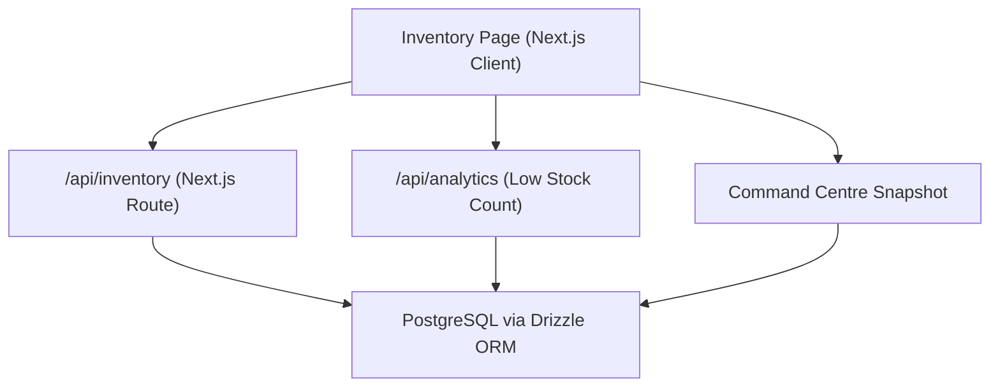
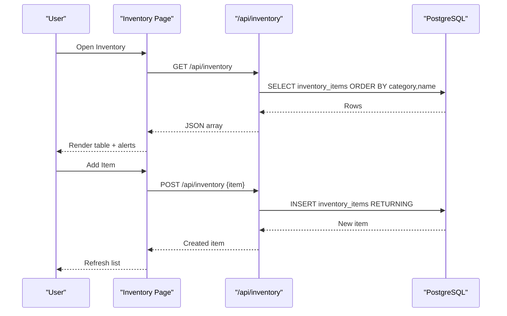
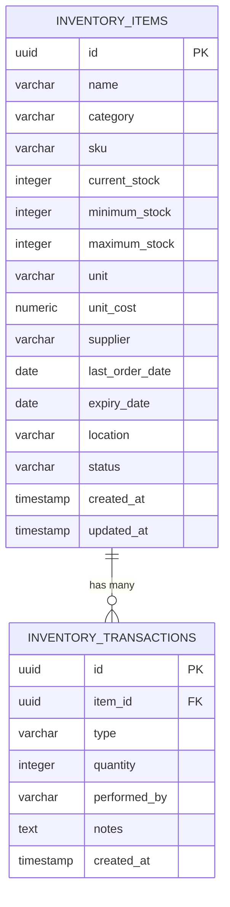
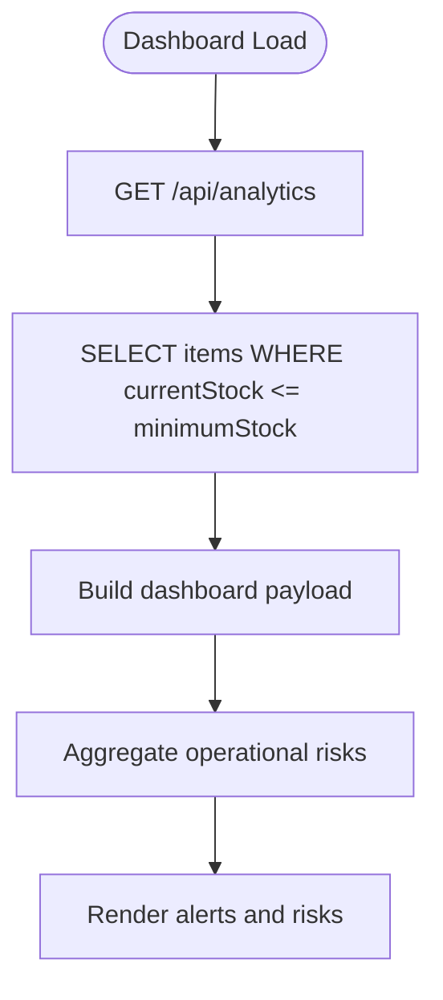
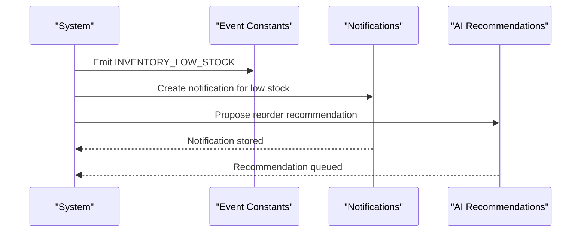
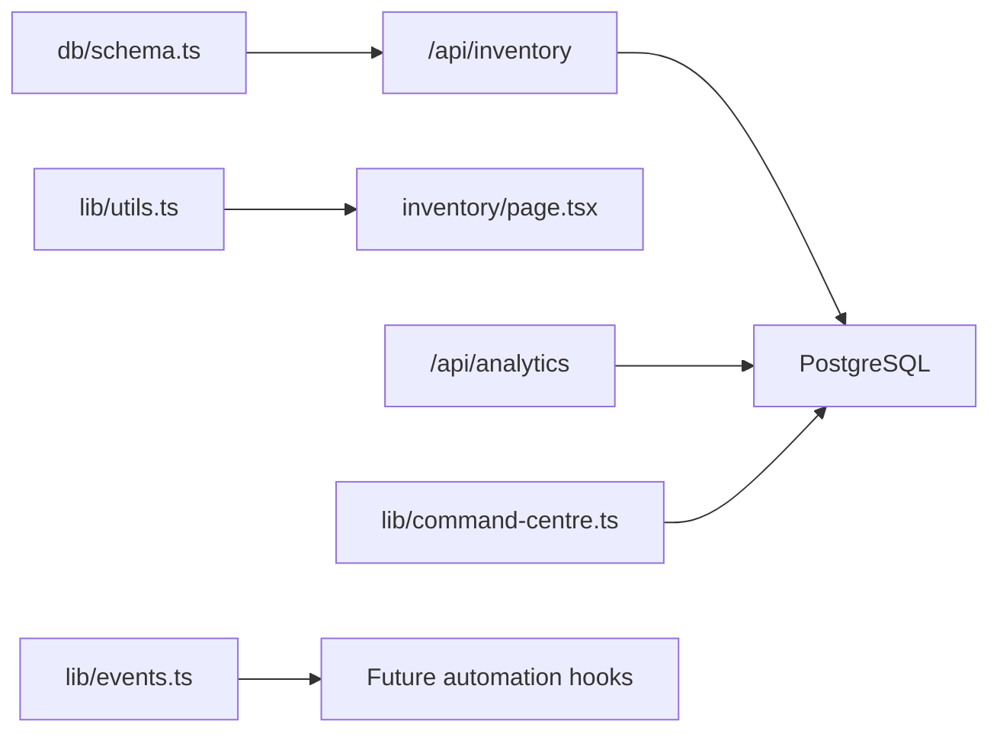

# Inventory Control

<cite>
**Referenced Files in This Document**
- [route.ts](file://src/app/api/inventory/route.ts)
- [page.tsx](file://src/app/inventory/page.tsx)
- [schema.ts](file://src/db/schema.ts)
- [utils.ts](file://src/lib/utils.ts)
- [analytics route.ts](file://src/app/api/analytics/route.ts)
- [seed route.ts](file://src/app/api/seed/route.ts)
- [events.ts](file://src/lib/events.ts)
- [command-centre.ts](file://src/lib/command-centre.ts)
- [0000_redundant_the_twelve.sql](file://drizzle/0000_redundant_the_twelve.sql)
</cite>

## Table of Contents
1. Introduction
2. Project Structure
3. Core Components
4. Architecture Overview
5. Detailed Component Analysis
6. Dependency Analysis
7. Performance Considerations
8. Troubleshooting Guide
9. Conclusion
10. Appendices

## Introduction
This document describes the inventory control system that tracks consumables, contrast media, and supplies across imaging departments. It explains how stock levels are monitored, how low-stock alerts are surfaced, how transactions are recorded, and how supplier information is captured for reorder workflows. It also documents the available API endpoints for listing and creating inventory items, analytics for low-stock counts, and the data model used to persist inventory records and transactions.

## Project Structure
The inventory feature spans a Next.js application with:
- A server-side API route for inventory read/write operations
- A client-side page that lists items, filters by category, shows low-stock alerts, and creates new items
- Database schema definitions for inventory items and transaction logs
- Analytics and command centre integrations that surface low-stock risks
- Seed data that populates realistic inventory items and suppliers

**Diagram sources**
- [route.ts:6-23](file://src/app/api/inventory/route.ts#L6-L23)
- [analytics route.ts:6-53](file://src/app/api/analytics/route.ts#L6-L53)
- [command-centre.ts:154-165](file://src/lib/command-centre.ts#L154-L165)

**Section sources**
- [route.ts:1-24](file://src/app/api/inventory/route.ts#L1-L24)
- [page.tsx:1-296](file://src/app/inventory/page.tsx#L1-L296)
- [schema.ts:136-164](file://src/db/schema.ts#L136-L164)
- [analytics route.ts:1-58](file://src/app/api/analytics/route.ts#L1-L58)
- [command-centre.ts:154-165](file://src/lib/command-centre.ts#L154-L165)

## Core Components
- Inventory Items table: stores item identity, category, SKU, stock quantities, thresholds, unit cost, supplier, location, expiry date, and status.
- Inventory Transactions table: records every stock movement with type, quantity, performer, notes, and timestamp.
- API endpoints:
  - GET /api/inventory: returns all inventory items sorted by category and name
  - POST /api/inventory: creates a new inventory item from JSON body
- Frontend inventory page: displays total items, low-stock alerts, total value, categories, and a filterable table; supports adding new items.
- Analytics endpoint: provides low-stock item count for dashboards.
- Command centre snapshot: aggregates operational risks including low-stock counts.

Key capabilities present in code:
- Stock level monitoring via currentStock vs minimumStock comparisons
- Low-stock alerting on the inventory page and in analytics/command centre
- Supplier capture per item for future reorder workflows
- Expiry date field available on items for future expiry tracking
- Transaction log structure ready for recording receiving and usage events

**Section sources**
- [schema.ts:136-164](file://src/db/schema.ts#L136-L164)
- [route.ts:6-23](file://src/app/api/inventory/route.ts#L6-L23)
- [page.tsx:39-296](file://src/app/inventory/page.tsx#L39-L296)
- [analytics route.ts:14-17](file://src/app/api/analytics/route.ts#L14-L17)
- [command-centre.ts:154-165](file://src/lib/command-centre.ts#L154-L165)

## Architecture Overview
The inventory system follows a simple request/response pattern backed by PostgreSQL through Drizzle ORM. The frontend fetches and updates inventory via Next.js API routes. Analytics and command centre modules consume the same data to surface operational insights.

**Diagram sources**
- [route.ts:6-23](file://src/app/api/inventory/route.ts#L6-L23)
- [page.tsx:44-74](file://src/app/inventory/page.tsx#L44-L74)

## Detailed Component Analysis

### Data Model: Inventory Items and Transactions
- inventoryItems fields include name, category, sku, currentStock, minimumStock, maximumStock, unit, unitCost, supplier, lastOrderDate, expiryDate, location, status, and timestamps.
- inventoryTransactions fields include itemId, type, quantity, performedBy, notes, and createdAt.

These tables support:
- Tracking stock levels and thresholds
- Recording receiving and consumption events
- Associating items with suppliers and locations
- Capturing expiry dates for future expiry tracking

**Diagram sources**
- [schema.ts:136-164](file://src/db/schema.ts#L136-L164)
- [0000_redundant_the_twelve.sql:163-190](file://drizzle/0000_redundant_the_twelve.sql#L163-L190)

**Section sources**
- [schema.ts:136-164](file://src/db/schema.ts#L136-L164)
- [0000_redundant_the_twelve.sql:163-190](file://drizzle/0000_redundant_the_twelve.sql#L163-L190)

### API Endpoints

#### GET /api/inventory
- Purpose: Retrieve all inventory items
- Behavior: Selects all rows from inventoryItems ordered by category then name
- Response: JSON array of inventory items
- Error handling: Returns 500 with error message on failure

**Section sources**
- [route.ts:6-13](file://src/app/api/inventory/route.ts#L6-L13)

#### POST /api/inventory
- Purpose: Create a new inventory item
- Request body: JSON object matching inventoryItems fields
- Behavior: Inserts row into inventoryItems and returns the created record
- Response: 201 with created item
- Error handling: Returns 500 with error message on failure

**Section sources**
- [route.ts:15-23](file://src/app/api/inventory/route.ts#L15-L23)

### Frontend Inventory Page
- Displays summary cards: total items, low stock alerts count, total inventory value, number of categories
- Shows low-stock alerts when currentStock <= minimumStock
- Provides category tabs using predefined categories
- Renders a table with key fields: name, category, SKU, stock, minimum, unit, unit cost, supplier, status badge
- Supports adding new items via a dialog form that posts to /api/inventory

Categories used:
- contrast, gel, ppe, electrodes, consumables

Supplier management:
- Each item can store a supplier string for future ordering workflows

Expiry tracking:
- expiryDate field exists on items; UI does not currently highlight expiring items but the field is available for future features

Stock adjustments and receiving:
- The transaction table exists to record movements; the current UI does not expose explicit receive/use actions, but the schema supports them

Automated reorder alerts:
- Low-stock detection is implemented on the client side using minimumStock thresholds
- Analytics and command centre aggregate low-stock counts for dashboards

**Section sources**
- [page.tsx:23-37](file://src/app/inventory/page.tsx#L23-L37)
- [page.tsx:44-74](file://src/app/inventory/page.tsx#L44-L74)
- [page.tsx:76-92](file://src/app/inventory/page.tsx#L76-L92)
- [page.tsx:157-203](file://src/app/inventory/page.tsx#L157-L203)
- [page.tsx:205-229](file://src/app/inventory/page.tsx#L205-L229)
- [page.tsx:231-296](file://src/app/inventory/page.tsx#L231-L296)
- [utils.ts:66-72](file://src/lib/utils.ts#L66-L72)

### Analytics and Operational Risk Integration
- Analytics endpoint computes lowStockItems count by comparing currentStock to minimumStock
- Command centre snapshot includes an operational risk entry when low-stock items exist, aggregating names and severity

**Diagram sources**
- [analytics route.ts:14-17](file://src/app/api/analytics/route.ts#L14-L17)
- [command-centre.ts:154-165](file://src/lib/command-centre.ts#L154-L165)

**Section sources**
- [analytics route.ts:6-53](file://src/app/api/analytics/route.ts#L6-L53)
- [command-centre.ts:154-165](file://src/lib/command-centre.ts#L154-L165)

### Event System and Notifications
- Event constants define inventory-related events such as inventory.updated and inventory.low_stock
- Seed data includes notifications about low stock and AI recommendations suggesting reorders
- These provide hooks for future automation where low-stock triggers notifications or automated orders

**Diagram sources**
- [events.ts:49-60](file://src/lib/events.ts#L49-L60)
- [seed-new-modules.ts:180-238](file://src/lib/seed-new-modules.ts#L180-L238)

**Section sources**
- [events.ts:49-60](file://src/lib/events.ts#L49-L60)
- [seed-new-modules.ts:180-238](file://src/lib/seed-new-modules.ts#L180-L238)

### Seed Data and Supplier Examples
- Seed route inserts realistic inventory items with suppliers, units, costs, and locations
- Demonstrates typical categories and thresholds
- Includes items flagged as low_stock to exercise alert logic

Examples seeded:
- Contrast media with suppliers like Medical Distributors Botswana and Bayer Botswana
- PPE with SafeCare Botswana
- Electrodes and consumables with local vendors

**Section sources**
- [seed route.ts:234-246](file://src/app/api/seed/route.ts#L234-L246)

## Dependency Analysis
- The inventory API depends on Drizzle ORM and the database schema
- The frontend page depends on utility constants for categories and formats
- Analytics and command centre depend on the same schema to compute metrics
- Event constants provide integration points for future automation

**Diagram sources**
- [schema.ts:136-164](file://src/db/schema.ts#L136-L164)
- [route.ts:1-23](file://src/app/api/inventory/route.ts#L1-L23)
- [utils.ts:66-72](file://src/lib/utils.ts#L66-L72)
- [analytics route.ts:1-58](file://src/app/api/analytics/route.ts#L1-L58)
- [command-centre.ts:154-165](file://src/lib/command-centre.ts#L154-L165)
- [events.ts:49-60](file://src/lib/events.ts#L49-L60)

**Section sources**
- [route.ts:1-23](file://src/app/api/inventory/route.ts#L1-L23)
- [page.tsx:1-296](file://src/app/inventory/page.tsx#L1-L296)
- [schema.ts:136-164](file://src/db/schema.ts#L136-L164)
- [analytics route.ts:1-58](file://src/app/api/analytics/route.ts#L1-L58)
- [command-centre.ts:154-165](file://src/lib/command-centre.ts#L154-L165)
- [events.ts:49-60](file://src/lib/events.ts#L49-L60)

## Performance Considerations
- The GET /api/inventory returns all items; for large inventories, consider pagination and filtering by category or status
- Low-stock queries in analytics use a simple comparison; ensure indexes on currentStock and minimumStock if datasets grow significantly
- Avoid heavy client-side computations on very large arrays; consider server-side aggregation for dashboards

[No sources needed since this section provides general guidance]

## Troubleshooting Guide
Common issues and resolutions:
- Failed to fetch inventory: Check network connectivity and database availability; verify the API route is deployed and accessible
- Failed to create inventory item: Validate request body matches expected fields; check database constraints and permissions
- No low-stock alerts shown: Ensure minimumStock is set correctly and currentStock is below threshold; verify data seeding ran successfully
- Category tabs not rendering: Confirm INVENTORY_CATEGORIES constant is imported and populated

Operational risk visibility:
- If low-stock items are not appearing in command centre, verify analytics and command centre queries execute against the correct schema and environment

**Section sources**
- [route.ts:10-12](file://src/app/api/inventory/route.ts#L10-L12)
- [route.ts:20-22](file://src/app/api/inventory/route.ts#L20-L22)
- [analytics route.ts:54-56](file://src/app/api/analytics/route.ts#L54-L56)
- [command-centre.ts:154-165](file://src/lib/command-centre.ts#L154-L165)

## Conclusion
The inventory control system provides foundational capabilities for tracking stock levels, surfacing low-stock alerts, and capturing supplier information. While advanced features like automated reordering and expiry-based alerts are not fully implemented in the UI, the data model and event system are in place to support future enhancements. The existing API endpoints enable basic inventory management, and analytics integrate low-stock metrics into dashboards and operational risk views.

[No sources needed since this section summarizes without analyzing specific files]

## Appendices

### API Reference Summary
- GET /api/inventory
  - Description: List all inventory items
  - Response: Array of inventory items
  - Errors: 500 on failure

- POST /api/inventory
  - Description: Create a new inventory item
  - Request: JSON object with inventory fields
  - Response: Created item
  - Errors: 500 on failure

- GET /api/analytics
  - Description: Dashboard metrics including lowStockItems count
  - Response: Object with counts and groupings
  - Errors: 500 on failure

**Section sources**
- [route.ts:6-23](file://src/app/api/inventory/route.ts#L6-L23)
- [analytics route.ts:6-53](file://src/app/api/analytics/route.ts#L6-L53)

### Example Operations
- Stock adjustment: Record a transaction in inventoryTransactions with type indicating increase/decrease and quantity moved
- Receiving supplies: Insert a transaction with type "receive", positive quantity, performedBy, and notes
- Managing consumables: Use the inventory page to add items, set minimumStock, and monitor low-stock alerts

**Section sources**
- [schema.ts:156-164](file://src/db/schema.ts#L156-L164)
- [page.tsx:53-74](file://src/app/inventory/page.tsx#L53-L74)