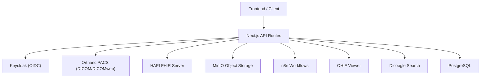
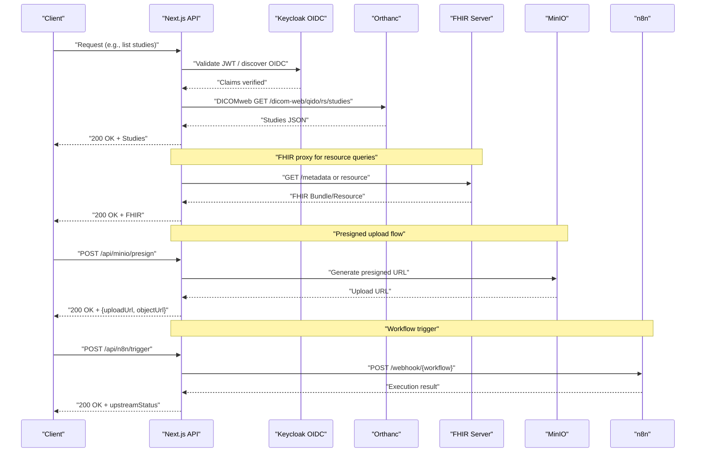
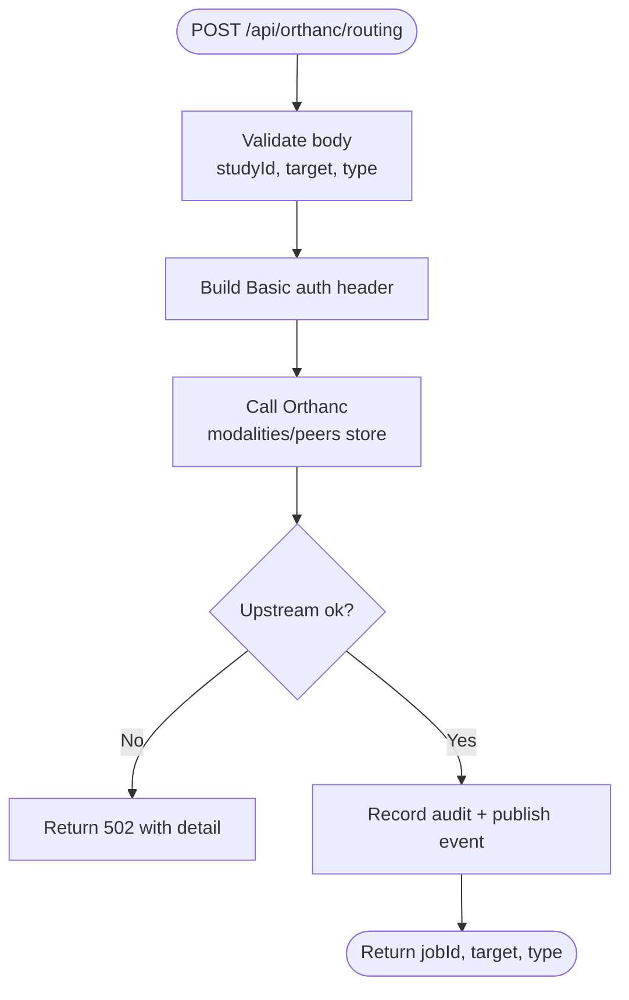
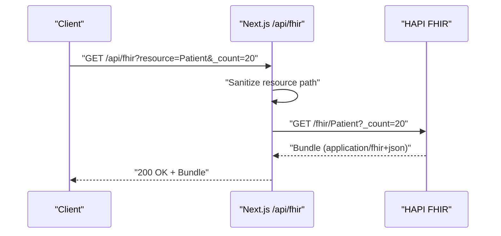
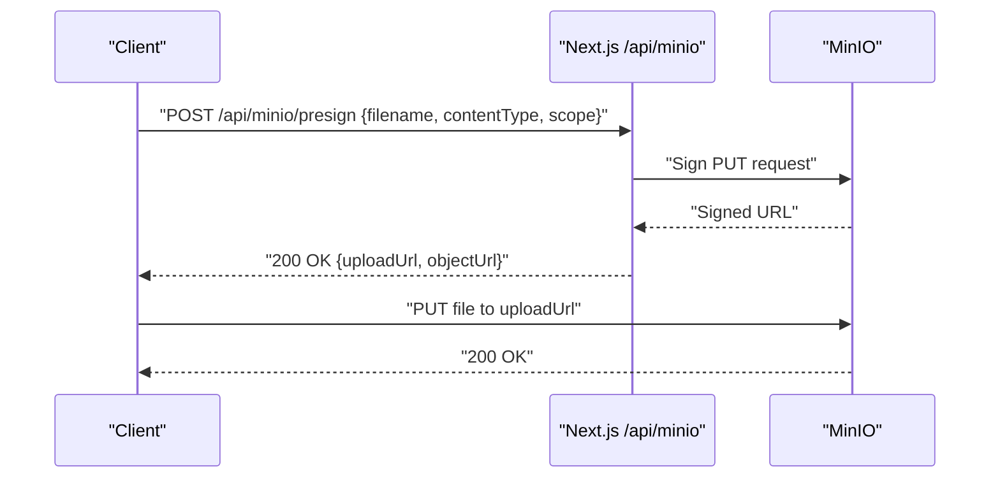
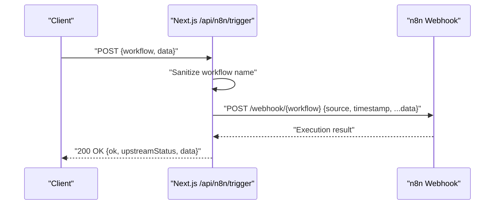
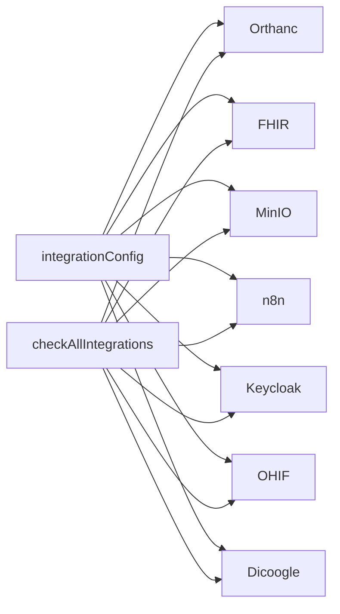

# External Integrations

<cite>
**Referenced Files in This Document**
- [docker-compose.yml](file://docker-compose.yml)
- [services/orthanc.json](file://services/orthanc.json)
- [services/fhir.mjs](file://services/fhir.mjs)
- [services/n8n.mjs](file://services/n8n.mjs)
- [services/ohif.mjs](file://services/ohif.mjs)
- [services/dicoogle.mjs](file://services/dicoogle.mjs)
- [backend/app/core/integrations.py](file://backend/app/core/integrations.py)
- [src/lib/integrations/index.ts](file://src/lib/integrations/index.ts)
- [src/lib/integrations/minio.ts](file://src/lib/integrations/minio.ts)
- [src/lib/auth/oidc.ts](file://src/lib/auth/oidc.ts)
- [src/app/api/orthanc/dicom-web/[...path]/route.ts](file://src/app/api/orthanc/dicom-web/[...path]/route.ts)
- [src/app/api/orthanc/routing/route.ts](file://src/app/api/orthanc/routing/route.ts)
- [src/app/api/orthanc/health/route.ts](file://src/app/api/orthanc/health/route.ts)
- [src/app/api/fhir/route.ts](file://src/app/api/fhir/route.ts)
- [src/app/api/minio/status/route.ts](file://src/app/api/minio/status/route.ts)
- [src/app/api/minio/presign/route.ts](file://src/app/api/minio/presign/route.ts)
- [src/app/api/n8n/trigger/route.ts](file://src/app/api/n8n/trigger/route.ts)
- [src/app/api/integrations/status/route.ts](file://src/app/api/integrations/status/route.ts)
</cite>

## Table of Contents
1. Introduction
2. Project Structure
3. Core Components
4. Architecture Overview
5. Detailed Component Analysis
6. Dependency Analysis
7. Performance Considerations
8. Troubleshooting Guide
9. Conclusion

## Introduction
This document explains how the platform integrates with external systems for medical imaging, clinical data interoperability, object storage, and workflow automation. It covers:
- PACS integration with Orthanc (DICOM/DICOMweb)
- FHIR integration for healthcare data interoperability
- Storage integration with MinIO for object storage
- Automation integration with n8n for workflow orchestration

It documents integration contracts, authentication methods, error handling strategies, API endpoints, health checks, and troubleshooting approaches, with concrete examples mapped to the codebase.

## Project Structure
The platform exposes a Next.js API layer that proxies or orchestrates calls to external services configured via environment variables. The approved stack includes Orthanc (PACS), HAPI FHIR (FHIR server), MinIO (object storage), n8n (automation), OHIF (viewer), Dicoogle (search/indexing), Keycloak (identity), and Redis/LangGraph (optional).

**Diagram sources**
- [docker-compose.yml:41-93](file://docker-compose.yml#L41-L93)
- [src/lib/integrations/index.ts:8-52](file://src/lib/integrations/index.ts#L8-L52)

**Section sources**
- [docker-compose.yml:1-118](file://docker-compose.yml#L1-L118)
- [src/lib/integrations/index.ts:8-52](file://src/lib/integrations/index.ts#L8-L52)

## Core Components
- Integration configuration and health checks are centralized in the integration layer.
- Authentication uses OIDC/JWT via Keycloak; DICOMweb requests to Orthanc use Basic auth headers when configured.
- MinIO uploads use presigned URLs generated server-side.
- n8n triggers are proxied from the platform to external workflows.

Key responsibilities:
- Central config: environment-driven endpoints and credentials
- Timed fetch helper for timeouts and no-store caching
- Health check aggregation across all integrations
- Secure proxying of sensitive operations (e.g., DICOMweb, FHIR)

**Section sources**
- [src/lib/integrations/index.ts:71-132](file://src/lib/integrations/index.ts#L71-L132)
- [src/lib/integrations/index.ts:134-267](file://src/lib/integrations/index.ts#L134-L267)
- [src/lib/auth/oidc.ts:18-88](file://src/lib/auth/oidc.ts#L18-L88)

## Architecture Overview
The system acts as a secure gateway and orchestrator:
- Browser clients call Next.js routes.
- Next.js validates tokens (OIDC), builds authenticated requests, and forwards to external services.
- Responses are returned to clients with appropriate content types and status codes.

**Diagram sources**
- [src/app/api/orthanc/dicom-web/[...path]/route.ts:15-71](file://src/app/api/orthanc/dicom-web/[...path]/route.ts#L15-L71)
- [src/app/api/fhir/route.ts:10-38](file://src/app/api/fhir/route.ts#L10-L38)
- [src/app/api/minio/presign/route.ts:8-28](file://src/app/api/minio/presign/route.ts#L8-L28)
- [src/app/api/n8n/trigger/route.ts:8-46](file://src/app/api/n8n/trigger/route.ts#L8-L46)
- [src/lib/auth/oidc.ts:18-88](file://src/lib/auth/oidc.ts#L18-L88)

## Detailed Component Analysis

### PACS Integration with Orthanc (DICOM/DICOMweb)
- Purpose: Provide secure DICOMweb access for viewers and study routing.
- Authentication: Optional Basic auth header derived from environment; used for all Orthanc calls.
- Endpoints:
  - Proxy: GET/POST /api/orthanc/dicom-web/[...path] — forwards QIDO-RS, WADO-RS, STOW-RS to Orthanc’s /dicom-web.
  - Routing: POST /api/orthanc/routing — route a study to modality or peer via Orthanc C-STORE/Peers.
  - Health: GET /api/orthanc/health — aggregates system, jobs, metrics, plugins, modalities, peers.
- Error handling:
  - Path traversal protection and sanitization before forwarding.
  - Timeouts on upstream calls; returns 502 with detail on failure.
  - Audit logging and event publishing for routing actions.
- Data formats:
  - DICOMweb responses (JSON for QIDO, multipart/related for WADO instances).
  - Routing request body includes studyId, target, type.

**Diagram sources**
- [src/app/api/orthanc/routing/route.ts:15-68](file://src/app/api/orthanc/routing/route.ts#L15-L68)

**Section sources**
- [src/app/api/orthanc/dicom-web/[...path]/route.ts:15-71](file://src/app/api/orthanc/dicom-web/[...path]/route.ts#L15-L71)
- [src/app/api/orthanc/routing/route.ts:15-68](file://src/app/api/orthanc/routing/route.ts#L15-L68)
- [src/app/api/orthanc/health/route.ts:7-67](file://src/app/api/orthanc/health/route.ts#L7-L67)
- [src/lib/integrations/index.ts:125-132](file://src/lib/integrations/index.ts#L125-L132)
- [services/orthanc.json:1-16](file://services/orthanc.json#L1-L16)

### FHIR Integration for Healthcare Interoperability
- Purpose: Proxy FHIR R4 requests to HAPI FHIR server for clinical data access.
- Authentication: Uses Accept header; token validation handled by OIDC layer where applicable.
- Endpoints:
  - GET /api/fhir?resource=Patient&_count=20 — forwards to FHIR server with sanitized resource path.
- Error handling:
  - Validates resource path to prevent traversal.
  - Returns 502 if FHIR is unreachable; preserves upstream content-type.
- Data formats:
  - application/fhir+json; supports metadata, search, read, create patterns.

**Diagram sources**
- [src/app/api/fhir/route.ts:10-38](file://src/app/api/fhir/route.ts#L10-L38)

**Section sources**
- [src/app/api/fhir/route.ts:10-38](file://src/app/api/fhir/route.ts#L10-L38)
- [services/fhir.mjs:1-55](file://services/fhir.mjs#L1-L55)
- [backend/app/core/integrations.py:60-83](file://backend/app/core/integrations.py#L60-L83)

### Storage Integration with MinIO (Object Storage)
- Purpose: Store reports, documents, and other files using S3-compatible APIs.
- Authentication: Presigned URLs generated server-side using AWS SDK client; secrets never exposed to clients.
- Endpoints:
  - GET /api/minio/status — ensures default bucket exists and lists buckets.
  - POST /api/minio/presign — generates presigned upload URL and object URL.
- Error handling:
  - Validates configuration; returns 503 if not configured.
  - Returns 502 with details on connectivity issues.
- Data formats:
  - JSON responses for status and presigned upload info.
  - Direct PUT to MinIO using presigned URL.

**Diagram sources**
- [src/app/api/minio/presign/route.ts:8-28](file://src/app/api/minio/presign/route.ts#L8-L28)
- [src/lib/integrations/minio.ts:29-47](file://src/lib/integrations/minio.ts#L29-L47)

**Section sources**
- [src/app/api/minio/status/route.ts:7-23](file://src/app/api/minio/status/route.ts#L7-L23)
- [src/app/api/minio/presign/route.ts:8-28](file://src/app/api/minio/presign/route.ts#L8-L28)
- [src/lib/integrations/minio.ts:1-60](file://src/lib/integrations/minio.ts#L1-L60)
- [docker-compose.yml:27-40](file://docker-compose.yml#L27-L40)

### Automation Integration with n8n (Workflow Orchestration)
- Purpose: Trigger automated workflows (notifications, escalations, service dispatches).
- Authentication: Platform sends JSON payloads to n8n webhook endpoints; optional API key supported in config.
- Endpoints:
  - POST /api/n8n/trigger — forwards to n8n webhook base with sanitized workflow name.
- Error handling:
  - Sanitizes workflow name to alphanumeric/hyphen/underscore.
  - Returns 503 if n8n is not configured; 502 on unreachable.
  - Records audit with upstream status.
- Data formats:
  - JSON payload including source, timestamp, and custom data.

**Diagram sources**
- [src/app/api/n8n/trigger/route.ts:8-46](file://src/app/api/n8n/trigger/route.ts#L8-L46)

**Section sources**
- [src/app/api/n8n/trigger/route.ts:8-46](file://src/app/api/n8n/trigger/route.ts#L8-L46)
- [services/n8n.mjs:20-41](file://services/n8n.mjs#L20-L41)
- [docker-compose.yml:82-93](file://docker-compose.yml#L82-L93)

### Identity and Access (Keycloak OIDC)
- Purpose: Authenticate users and authorize access to protected resources.
- Methods:
  - OIDC discovery, authorization URL generation, code exchange, ID token verification using JWKS.
- Usage:
  - Backend verifies JWTs against Keycloak JWKS; frontend uses OIDC helpers for login flows.
- Security:
  - Secrets (client secret) only on server side; public client config excludes secrets.

**Section sources**
- [src/lib/auth/oidc.ts:18-88](file://src/lib/auth/oidc.ts#L18-L88)
- [backend/app/core/integrations.py:37-58](file://backend/app/core/integrations.py#L37-L58)
- [docker-compose.yml:57-65](file://docker-compose.yml#L57-L65)

### Supporting Services (OHIF, Dicoogle)
- OHIF: Lightweight viewer page indicating DICOMweb endpoint usage.
- Dicoogle: Search/indexing service exposing a simple search endpoint used by health checks.

**Section sources**
- [services/ohif.mjs:1-20](file://services/ohif.mjs#L1-L20)
- [services/dicoogle.mjs:1-30](file://services/dicoogle.mjs#L1-L30)

## Dependency Analysis
- Configuration is centralized; all integrations read from environment variables.
- Health checks depend on each service’s endpoints and return aggregated status.
- External services are orchestrated via HTTP; timeouts and retries are managed at the API layer.

**Diagram sources**
- [src/lib/integrations/index.ts:8-52](file://src/lib/integrations/index.ts#L8-L52)
- [src/lib/integrations/index.ts:134-267](file://src/lib/integrations/index.ts#L134-L267)

**Section sources**
- [src/lib/integrations/index.ts:8-52](file://src/lib/integrations/index.ts#L8-L52)
- [src/lib/integrations/index.ts:134-267](file://src/lib/integrations/index.ts#L134-L267)

## Performance Considerations
- Use timedFetch to avoid hanging requests; defaults vary per endpoint (e.g., 10s for n8n, 60s for DICOMweb).
- Avoid unnecessary buffering; DICOMweb proxy streams buffers directly to response.
- Prefer presigned uploads to offload large file transfers directly to MinIO.
- Cache OIDC discovery results to reduce overhead during token verification.

[No sources needed since this section provides general guidance]

## Troubleshooting Guide
Common scenarios and resolutions:
- Orthanc unreachable:
  - Check /api/orthanc/health for detailed metrics and job stats.
  - Verify Basic auth credentials and network reachability.
  - Ensure DICOMweb plugin enabled in Orthanc configuration.
- FHIR errors:
  - Confirm FHIR_URL is set; validate Accept header.
  - Inspect upstream status codes and messages from FHIR server.
- MinIO issues:
  - Use /api/minio/status to verify bucket existence and connectivity.
  - Ensure MINIO_ENDPOINT, access keys, and bucket names are correct.
  - For upload failures, re-generate presigned URLs and check CORS/permissions.
- n8n triggers failing:
  - Validate workflow name sanitization and webhook base configuration.
  - Check n8n logs and webhook execution history.
- Health overview:
  - Use /api/integrations/status to get a consolidated view of all integrations and database health.

**Section sources**
- [src/app/api/orthanc/health/route.ts:7-67](file://src/app/api/orthanc/health/route.ts#L7-L67)
- [src/app/api/fhir/route.ts:10-38](file://src/app/api/fhir/route.ts#L10-L38)
- [src/app/api/minio/status/route.ts:7-23](file://src/app/api/minio/status/route.ts#L7-L23)
- [src/app/api/n8n/trigger/route.ts:8-46](file://src/app/api/n8n/trigger/route.ts#L8-L46)
- [src/app/api/integrations/status/route.ts:8-42](file://src/app/api/integrations/status/route.ts#L8-L42)

## Conclusion
The platform provides robust, secure, and observable integrations with Orthanc (PACS), FHIR servers, MinIO, and n8n. By centralizing configuration, enforcing timeouts, sanitizing inputs, and providing comprehensive health endpoints, it enables reliable medical imaging workflows, clinical data interoperability, scalable storage, and automated processes. Use the documented endpoints and health checks to integrate, monitor, and troubleshoot effectively.

[No sources needed since this section summarizes without analyzing specific files]