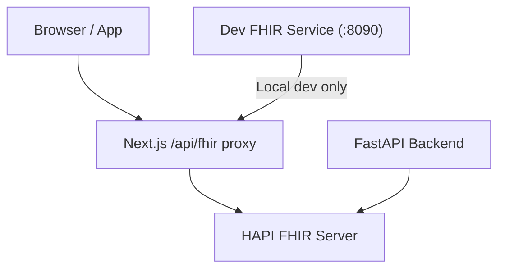
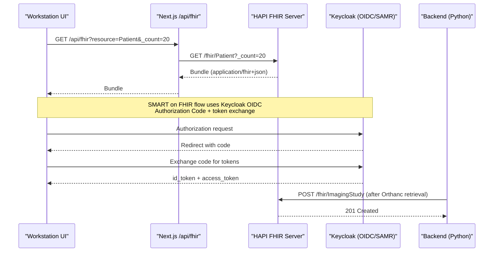
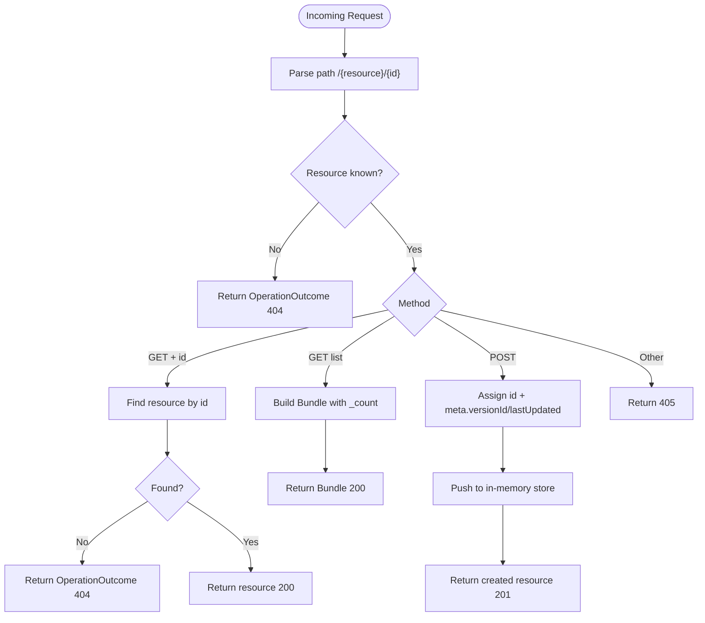
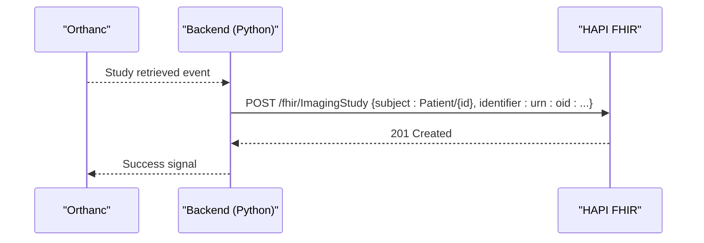
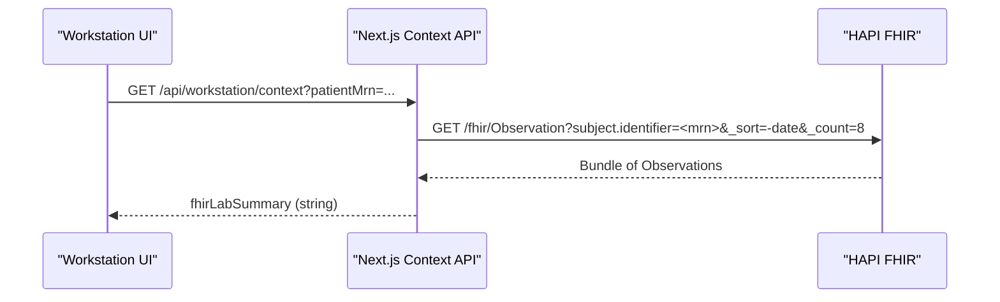
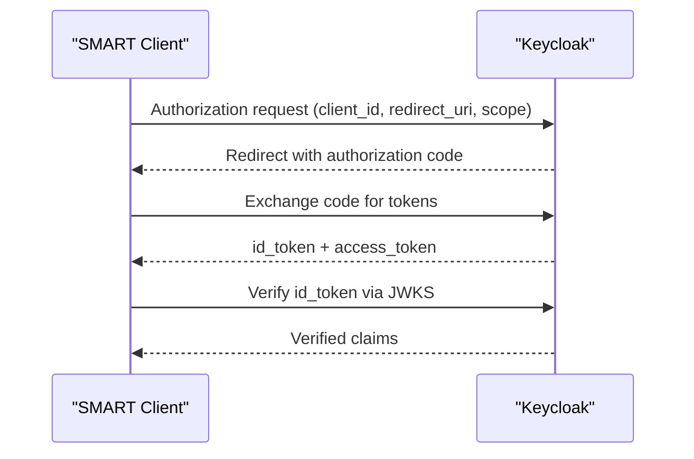
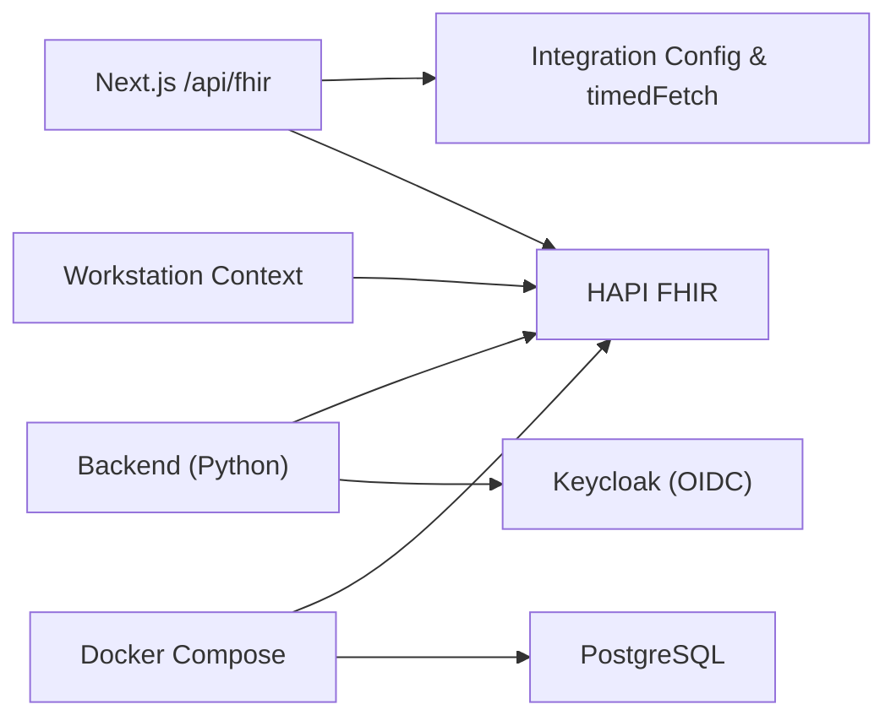

# FHIR Healthcare Integration

<cite>
**Referenced Files in This Document**
- [services/fhir.mjs](file://services/fhir.mjs)
- [src/app/api/fhir/route.ts](file://src/app/api/fhir/route.ts)
- [src/lib/integrations/index.ts](file://src/lib/integrations/index.ts)
- [backend/app/core/integrations.py](file://backend/app/core/integrations.py)
- [backend/app/core/config.py](file://backend/app/core/config.py)
- [docker-compose.yml](file://docker-compose.yml)
- [README.md](file://README.md)
- [src/app/api/workstation/context/route.ts](file://src/app/api/workstation/context/route.ts)
</cite>

## Table of Contents
1. Introduction
2. Project Structure
3. Core Components
4. Architecture Overview
5. Detailed Component Analysis
6. Dependency Analysis
7. Performance Considerations
8. Troubleshooting Guide
9. Conclusion

## Introduction
This document explains how GeraldOS integrates with FHIR for healthcare data interoperability. It covers the FHIR resource types used, search and CRUD operations, mapping between GeraldOS entities and FHIR resources, HAPI FHIR server configuration, authentication via SMART on FHIR (Keycloak), and security considerations for protected health information. It also includes examples of patient record synchronization, clinical observation exchange, workflow state updates, bundle processing, version compatibility, validation rules, error handling, and performance optimization strategies for large dataset exchanges.

## Project Structure
GeraldOS exposes a Next.js API route that proxies FHIR requests to an upstream HAPI FHIR server. A standalone Node service provides a minimal FHIR R4 server for development. The backend Python service demonstrates creating FHIR resources from PACS events. Docker Compose provisions HAPI FHIR backed by PostgreSQL.



**Diagram sources**
- [src/app/api/fhir/route.ts:10-38](file://src/app/api/fhir/route.ts#L10-L38)
- [docker-compose.yml:67-76](file://docker-compose.yml#L67-L76)
- [services/fhir.mjs:23-54](file://services/fhir.mjs#L23-L54)

**Section sources**
- [README.md:9-23](file://README.md#L9-L23)
- [docker-compose.yml:67-76](file://docker-compose.yml#L67-L76)

## Core Components
- Next.js FHIR proxy: Validates inputs, forwards queries to HAPI FHIR, enforces timeouts, and returns FHIR responses.
- HAPI FHIR server: Provisioned via Docker Compose; configured with PostgreSQL for persistence in production-like environments.
- Development FHIR service: In-memory FHIR R4 server supporting read, search-type, and create interactions for Patient, ImagingStudy, Coverage, DiagnosticReport, ServiceRequest.
- Backend integration layer: Creates FHIR resources (e.g., ImagingStudy) after successful DICOM retrieval from Orthanc.
- Workstation context: Best-effort retrieval of FHIR Observations for laboratory summaries in the radiology workstation.

**Section sources**
- [src/app/api/fhir/route.ts:10-38](file://src/app/api/fhir/route.ts#L10-L38)
- [docker-compose.yml:67-76](file://docker-compose.yml#L67-L76)
- [services/fhir.mjs:11-54](file://services/fhir.mjs#L11-L54)
- [backend/app/core/integrations.py:60-83](file://backend/app/core/integrations.py#L60-L83)
- [src/app/api/workstation/context/route.ts:284-305](file://src/app/api/workstation/context/route.ts#L284-L305)

## Architecture Overview
The platform uses Keycloak for identity and SMART on FHIR authorization flows. The Next.js app proxies FHIR calls to HAPI FHIR, while the backend creates FHIR resources triggered by PACS events. The workstation aggregates FHIR observations into a lab summary view.



**Diagram sources**
- [src/app/api/fhir/route.ts:10-38](file://src/app/api/fhir/route.ts#L10-L38)
- [src/lib/integrations/index.ts:192-204](file://src/lib/integrations/index.ts#L192-L204)
- [backend/app/core/integrations.py:60-83](file://backend/app/core/integrations.py#L60-L83)
- [src/lib/auth/oidc.ts:18-88](file://src/lib/auth/oidc.ts#L18-L88)

## Detailed Component Analysis

### FHIR Resource Types and Interactions
- Supported resource types in the development server: Patient, ImagingStudy, Coverage, DiagnosticReport, ServiceRequest.
- Interactions supported by the development server: read, search-type, create.
- Production HAPI FHIR is provisioned via Docker Compose and can be extended to support additional resources and interactions as needed.



**Diagram sources**
- [services/fhir.mjs:23-54](file://services/fhir.mjs#L23-L54)

**Section sources**
- [services/fhir.mjs:11-54](file://services/fhir.mjs#L11-L54)

### Next.js FHIR Proxy
- Accepts GET requests with a resource parameter and forwards all other query parameters unchanged to the upstream HAPI FHIR server.
- Enforces a timeout and sets Accept: application/fhir+json.
- Returns upstream status codes and content type; on errors returns a 502 with details.

```mermaid
sequenceDiagram
participant C as "Client"
participant N as "Next.js /api/fhir"
participant U as "Upstream HAPI FHIR"
C->>N : GET /api/fhir?resource=Patient&_count=20
N->>U : GET /fhir/Patient?_count=20 (Accept : application/fhir+json)
U-->>N : 200 Bundle
N-->>C : 200 Bundle (passthrough content-type)
Note over N,U : Timeout enforced; unreachable returns 502
```

**Diagram sources**
- [src/app/api/fhir/route.ts:10-38](file://src/app/api/fhir/route.ts#L10-L38)

**Section sources**
- [src/app/api/fhir/route.ts:10-38](file://src/app/api/fhir/route.ts#L10-L38)

### Backend FHIR Creation (PACS to FHIR)
- After a successful DICOM study retrieval from Orthanc, the backend posts an ImagingStudy resource to HAPI FHIR with subject reference and DICOM UID identifier.
- Errors are caught and return false to indicate failure without raising exceptions.



**Diagram sources**
- [backend/app/core/integrations.py:60-83](file://backend/app/core/integrations.py#L60-L83)

**Section sources**
- [backend/app/core/integrations.py:60-83](file://backend/app/core/integrations.py#L60-L83)

### Workstation Context: FHIR Observations for Lab Summary
- When a patient MRN is available and FHIR is configured, the workstation context fetches recent Observations filtered by subject.identifier, sorted by date, limited to a small count.
- Results are summarized into a human-readable string for display; missing or unreachable FHIR degrades gracefully.



**Diagram sources**
- [src/app/api/workstation/context/route.ts:284-305](file://src/app/api/workstation/context/route.ts#L284-L305)

**Section sources**
- [src/app/api/workstation/context/route.ts:284-305](file://src/app/api/workstation/context/route.ts#L284-L305)

### SMART on FHIR Authentication via Keycloak
- Identity and authorization are handled by Keycloak using OIDC. The platform discovers the realm configuration, exchanges authorization codes for tokens, verifies id_tokens against JWKS, and extracts roles for RBAC.
- SMART on FHIR clients would use the same Keycloak endpoints to obtain access tokens scoped for FHIR access.



**Diagram sources**
- [src/lib/auth/oidc.ts:18-88](file://src/lib/auth/oidc.ts#L18-L88)

**Section sources**
- [src/lib/auth/oidc.ts:18-88](file://src/lib/auth/oidc.ts#L18-L88)

### Data Mapping Between GeraldOS Entities and FHIR Resources
- Patient: GeraldOS patient records include demographics and identifiers; FHIR Patient resources carry name, gender, birthDate, and identifiers (e.g., MRN).
- ImagingStudy: Derived from Orthanc studies; mapped to FHIR ImagingStudy with subject reference and DICOM UID identifier.
- Observation: Laboratory results retrieved by subject.identifier (MRN) and summarized for display.
- Workflow state transitions are tracked in the backend and can trigger downstream notifications or FHIR updates as needed.

[No sources needed since this section summarizes mappings conceptually]

### HAPI FHIR Server Configuration
- Docker Compose provisions HAPI FHIR with PostgreSQL for persistence. Environment variables configure database connection.
- Health checks ensure dependencies are ready before starting services.

**Section sources**
- [docker-compose.yml:67-76](file://docker-compose.yml#L67-L76)

### Version Compatibility and Validation
- The development FHIR server declares FHIR version 4.0.1 and supports application/fhir+json format.
- The Next.js proxy sets Accept: application/fhir+json when calling upstream.
- Validation rules should be enforced at the FHIR server level; malformed resources will result in OperationOutcome responses.

**Section sources**
- [services/fhir.mjs:3-14](file://services/fhir.mjs#L3-L14)
- [src/app/api/fhir/route.ts:25-31](file://src/app/api/fhir/route.ts#L25-L31)

### Error Handling Strategies
- Proxy errors: Unreachable FHIR returns 502 with detail; not configured returns 503.
- Resource errors: Unknown resource types return OperationOutcome with severity error; missing resources return 404.
- Graceful degradation: Workstation context sets null or informational messages when FHIR is unavailable or empty.

**Section sources**
- [src/app/api/fhir/route.ts:11-38](file://src/app/api/fhir/route.ts#L11-L38)
- [services/fhir.mjs:30-53](file://services/fhir.mjs#L30-L53)
- [src/app/api/workstation/context/route.ts:284-305](file://src/app/api/workstation/context/route.ts#L284-L305)

### Security Considerations for Protected Health Information
- Credentials and secrets remain server-side; browser receives non-secret configuration only.
- OIDC/JWT-based authentication via Keycloak ensures secure access control.
- CORS is enabled in the backend for development; restrict origins in production.
- Use HTTPS in production for all endpoints and enforce secure cookies.

**Section sources**
- [README.md:115-121](file://README.md#L115-L121)
- [backend/app/main.py:17-23](file://backend/app/main.py#L17-L23)

## Dependency Analysis


**Diagram sources**
- [src/app/api/fhir/route.ts:1-38](file://src/app/api/fhir/route.ts#L1-L38)
- [src/lib/integrations/index.ts:1-52](file://src/lib/integrations/index.ts#L1-L52)
- [docker-compose.yml:67-76](file://docker-compose.yml#L67-L76)

**Section sources**
- [src/lib/integrations/index.ts:1-52](file://src/lib/integrations/index.ts#L1-L52)
- [docker-compose.yml:67-76](file://docker-compose.yml#L67-L76)

## Performance Considerations
- Timeouts: Use timedFetch with appropriate timeouts to avoid hanging requests; the proxy uses a longer timeout for FHIR calls.
- Pagination: Leverage FHIR search parameters like _count to limit payload sizes; workstation context limits to small counts for lab summaries.
- Connection reuse: Prefer persistent HTTP clients where possible; the backend uses httpx async client.
- Caching: Avoid caching FHIR responses in the proxy; rely on server-side caching or ETag mechanisms if supported by HAPI FHIR.
- Database-backed FHIR: Ensure HAPI FHIR is configured with a robust database (PostgreSQL) for large datasets and efficient indexing.

[No sources needed since this section provides general guidance]

## Troubleshooting Guide
- FHIR not configured: If FHIR_URL is unset, the proxy returns 503 with a clear error message.
- Upstream unreachable: Network errors or timeouts result in 502 with detailed error messages.
- Unknown resource: Requests to unsupported resource types return OperationOutcome with diagnostics.
- Missing resource: GET by id returns 404 with OperationOutcome.
- Observations empty: Workstation context displays “no laboratory results” when no entries are found.
- Health checks: Use the integration health endpoint to verify connectivity and latency for each service.

**Section sources**
- [src/app/api/fhir/route.ts:11-38](file://src/app/api/fhir/route.ts#L11-L38)
- [services/fhir.mjs:30-53](file://services/fhir.mjs#L30-L53)
- [src/app/api/workstation/context/route.ts:284-305](file://src/app/api/workstation/context/route.ts#L284-L305)
- [src/lib/integrations/index.ts:192-204](file://src/lib/integrations/index.ts#L192-L204)

## Conclusion
GeraldOS integrates FHIR through a secure, configurable proxy to HAPI FHIR, with SMART on FHIR authentication via Keycloak. The platform supports reading and searching FHIR resources, creating resources from PACS events, and displaying clinical observations in the workstation. Robust error handling, timeouts, and graceful degradation ensure reliability. For production, enforce HTTPS, restrict CORS, validate FHIR resources at the server, and optimize queries with pagination and proper indexing.