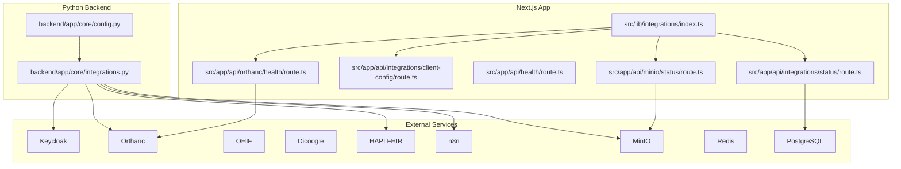
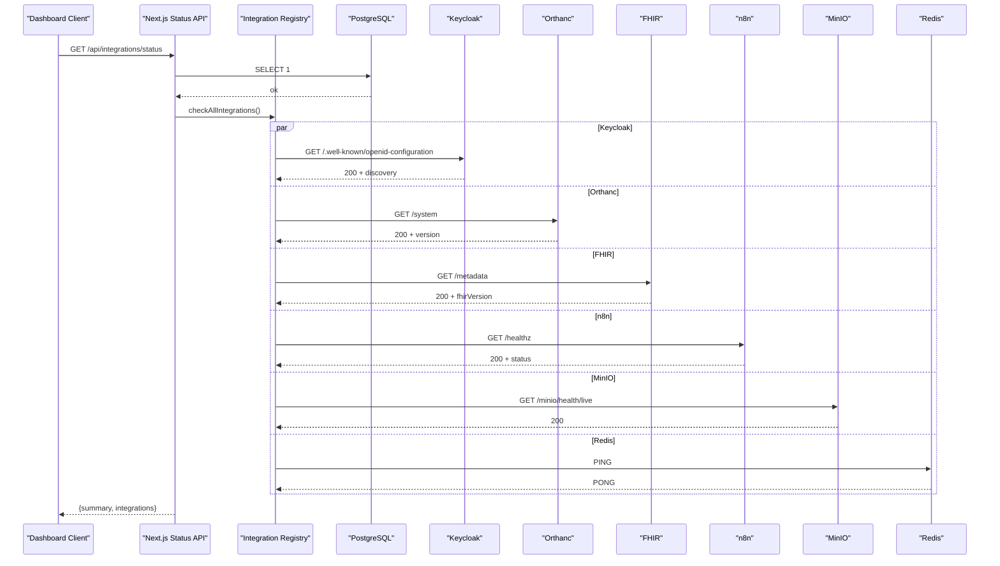
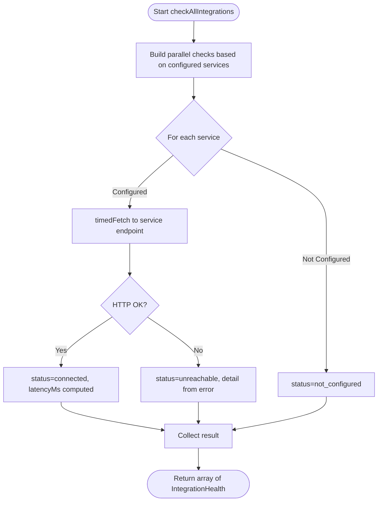
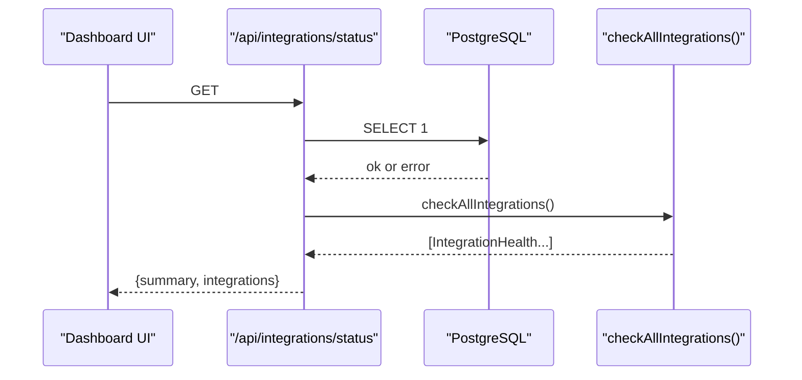
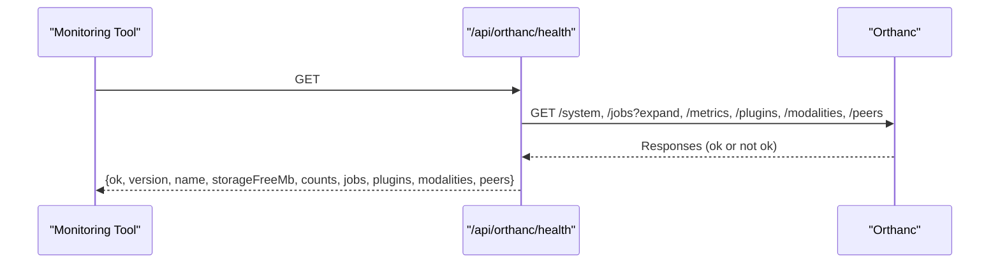
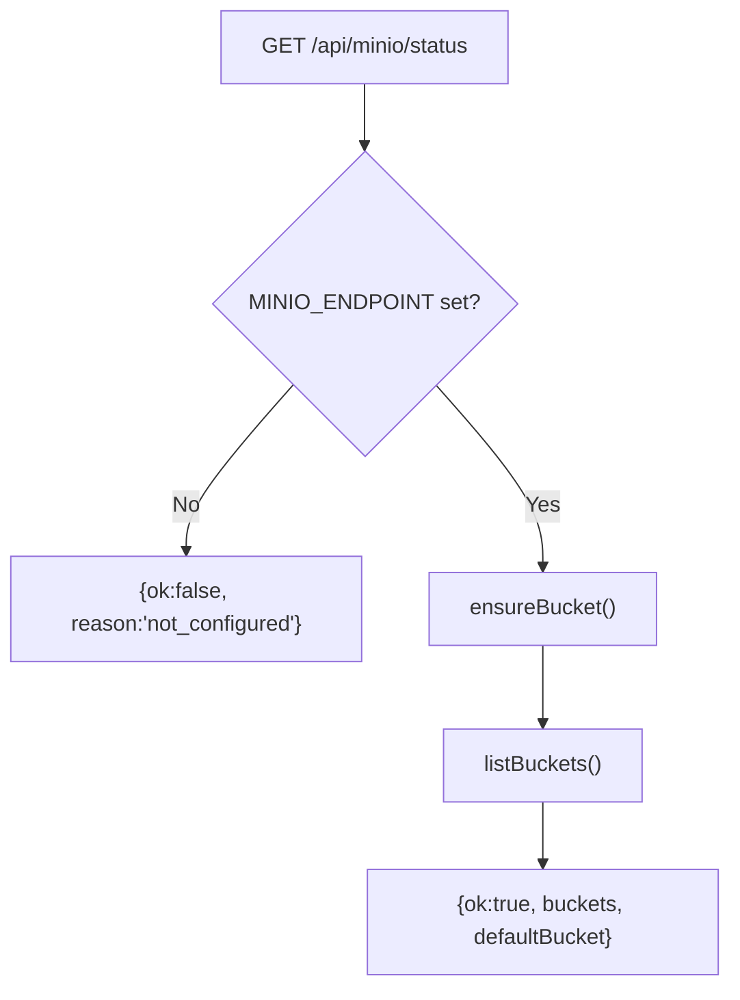
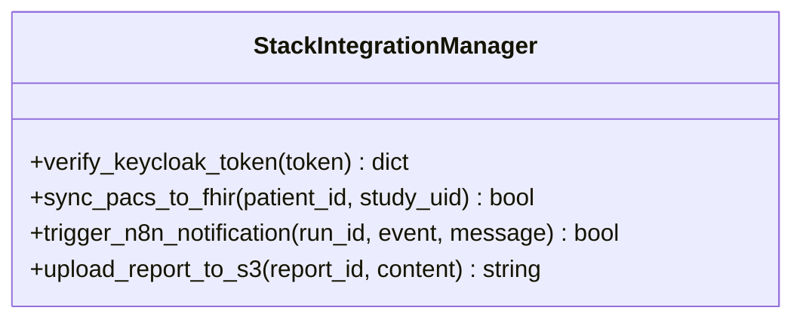
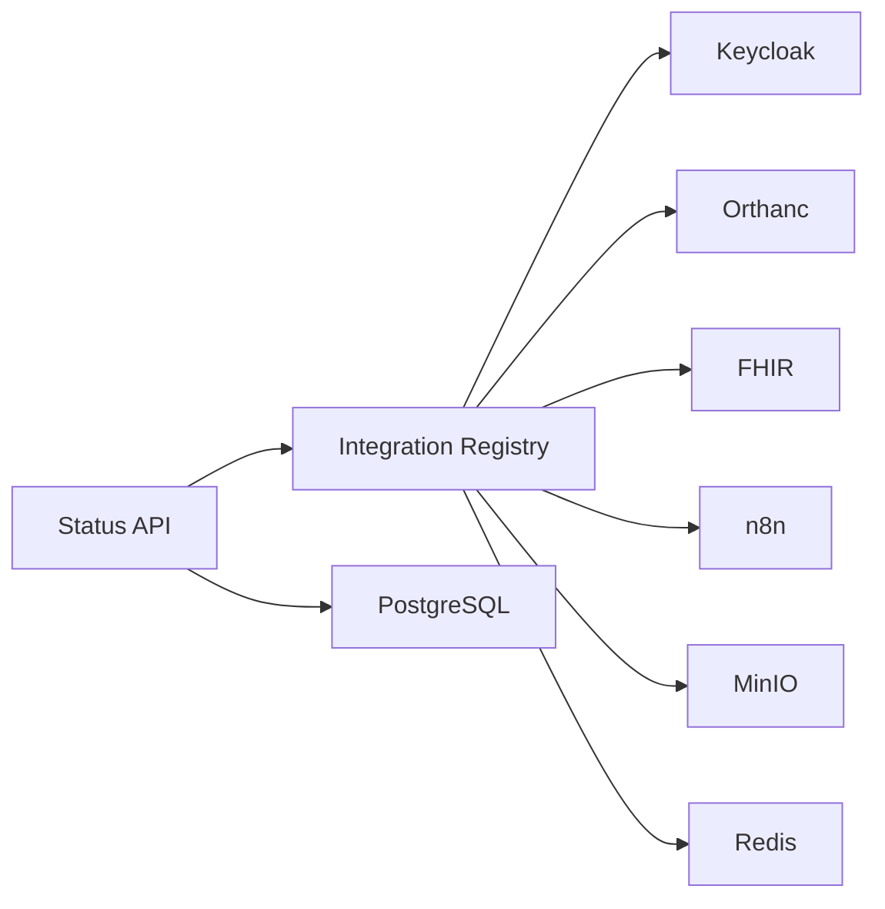

# Integration Management & Monitoring

<cite>
**Referenced Files in This Document**
- [src/lib/integrations/index.ts](file://src/lib/integrations/index.ts)
- [src/app/api/integrations/status/route.ts](file://src/app/api/integrations/status/route.ts)
- [src/app/api/integrations/client-config/route.ts](file://src/app/api/integrations/client-config/route.ts)
- [src/app/api/health/route.ts](file://src/app/api/health/route.ts)
- [src/app/api/minio/status/route.ts](file://src/app/api/minio/status/route.ts)
- [src/app/api/orthanc/health/route.ts](file://src/app/api/orthanc/health/route.ts)
- [backend/app/core/config.py](file://backend/app/core/config.py)
- [backend/app/core/integrations.py](file://backend/app/core/integrations.py)
- [services/dicoogle.mjs](file://services/dicoogle.mjs)
- [services/fhir.mjs](file://services/fhir.mjs)
- [services/keycloak.mjs](file://services/keycloak.mjs)
- [services/n8n.mjs](file://services/n8n.mjs)
- [services/ohif.mjs](file://services/ohif.mjs)
</cite>

## Table of Contents
1. Introduction
2. Project Structure
3. Core Components
4. Architecture Overview
5. Detailed Component Analysis
6. Dependency Analysis
7. Performance Considerations
8. Troubleshooting Guide
9. Conclusion

## Introduction
This document explains the integration management and monitoring capabilities of the platform, focusing on:
- Centralized integration status dashboard and health checks
- Configuration management for external services (environment-specific settings and secrets)
- Integration registry pattern and dynamic service discovery
- Fault tolerance strategies including circuit breaker patterns and automatic failover
- Monitoring, logging, auditing, metrics collection, and alerting thresholds
- Troubleshooting guidance for common integration failures, connectivity issues, and performance bottlenecks

The system integrates identity (Keycloak), PACS/DICOM (Orthanc), viewer (OHIF), search/indexing (Dicoogle), clinical interoperability (HAPI FHIR), automation (n8n), object storage (MinIO), caching/queues (Redis), and a database (PostgreSQL). Health endpoints and a unified status API provide visibility into all components.

## Project Structure
Integration management is implemented primarily in the Next.js frontend/backend layer with a central configuration module that defines clients and health checks for each external service. A Python backend provides additional integration utilities and environment-driven configuration.

**Diagram sources**
- [src/lib/integrations/index.ts:1-267](file://src/lib/integrations/index.ts#L1-L267)
- [src/app/api/integrations/status/route.ts:1-43](file://src/app/api/integrations/status/route.ts#L1-L43)
- [src/app/api/integrations/client-config/route.ts:1-9](file://src/app/api/integrations/client-config/route.ts#L1-L9)
- [src/app/api/health/route.ts:1-14](file://src/app/api/health/route.ts#L1-L14)
- [src/app/api/minio/status/route.ts:1-24](file://src/app/api/minio/status/route.ts#L1-L24)
- [src/app/api/orthanc/health/route.ts:1-68](file://src/app/api/orthanc/health/route.ts#L1-L68)
- [backend/app/core/config.py:1-20](file://backend/app/core/config.py#L1-L20)
- [backend/app/core/integrations.py:1-119](file://backend/app/core/integrations.py#L1-L119)

**Section sources**
- [src/lib/integrations/index.ts:1-267](file://src/lib/integrations/index.ts#L1-L267)
- [backend/app/core/config.py:1-20](file://backend/app/core/config.py#L1-L20)
- [backend/app/core/integrations.py:1-119](file://backend/app/core/integrations.py#L1-L119)

## Core Components
- Central integration registry and client factory: Defines configuration for Keycloak, Orthanc, OHIF, Dicoogle, FHIR, n8n, LangGraph, MinIO, Redis; exposes public client config and health check utilities.
- Unified status endpoint: Aggregates DB health and all integration statuses into a single response with summary counts.
- Service-specific health endpoints: Orthanc detailed health snapshot; MinIO bucket listing and readiness; basic app health via DB ping.
- Python backend integrations: Token verification, FHIR resource sync, n8n webhook triggers, and MinIO uploads.

Key responsibilities:
- Configuration: Environment variables drive service URLs, credentials, and feature flags. Secrets are kept server-side only.
- Discovery: Public client config reveals which features are enabled without exposing secrets.
- Health checks: Each integration has a targeted probe (OIDC discovery, DICOMweb /system, FHIR metadata, n8n /healthz, MinIO live health, Redis PING).
- Aggregation: The status endpoint returns per-integration results plus totals for connected/unreachable/not_configured.

**Section sources**
- [src/lib/integrations/index.ts:8-69](file://src/lib/integrations/index.ts#L8-L69)
- [src/lib/integrations/index.ts:80-123](file://src/lib/integrations/index.ts#L80-L123)
- [src/lib/integrations/index.ts:134-266](file://src/lib/integrations/index.ts#L134-L266)
- [src/app/api/integrations/status/route.ts:8-41](file://src/app/api/integrations/status/route.ts#L8-L41)
- [src/app/api/orthanc/health/route.ts:6-67](file://src/app/api/orthanc/health/route.ts#L6-L67)
- [src/app/api/minio/status/route.ts:7-23](file://src/app/api/minio/status/route.ts#L7-L23)
- [backend/app/core/integrations.py:37-118](file://backend/app/core/integrations.py#L37-L118)

## Architecture Overview
The architecture uses a centralized integration registry to manage connections and health probes across multiple external systems. Health checks run concurrently and return structured results. A unified dashboard can consume these endpoints to present a real-time view of system health.

**Diagram sources**
- [src/app/api/integrations/status/route.ts:8-41](file://src/app/api/integrations/status/route.ts#L8-L41)
- [src/lib/integrations/index.ts:134-266](file://src/lib/integrations/index.ts#L134-L266)

## Detailed Component Analysis

### Integration Registry and Health Checks
- Central configuration object defines service URLs and optional credentials.
- Public client config exposes non-secret feature flags for the browser.
- Health checks use timed fetches with timeouts to avoid hanging requests.
- Each integration returns a standardized health object with key, name, purpose, status, latencyMs, and detail.

**Diagram sources**
- [src/lib/integrations/index.ts:80-123](file://src/lib/integrations/index.ts#L80-L123)
- [src/lib/integrations/index.ts:134-266](file://src/lib/integrations/index.ts#L134-L266)

**Section sources**
- [src/lib/integrations/index.ts:8-69](file://src/lib/integrations/index.ts#L8-L69)
- [src/lib/integrations/index.ts:80-123](file://src/lib/integrations/index.ts#L80-L123)
- [src/lib/integrations/index.ts:134-266](file://src/lib/integrations/index.ts#L134-L266)

### Unified Status Dashboard Endpoint
- Aggregates PostgreSQL connectivity and all integration health results.
- Returns a summary with total, connected, unreachable, and not_configured counts.
- Suitable for dashboards and automated monitoring.

**Diagram sources**
- [src/app/api/integrations/status/route.ts:8-41](file://src/app/api/integrations/status/route.ts#L8-L41)
- [src/lib/integrations/index.ts:134-266](file://src/lib/integrations/index.ts#L134-L266)

**Section sources**
- [src/app/api/integrations/status/route.ts:8-41](file://src/app/api/integrations/status/route.ts#L8-L41)

### Orthanc Detailed Health Snapshot
- Probes multiple Orthanc endpoints concurrently: system, jobs, metrics, plugins, modalities, peers.
- Computes job state distribution and extracts storage and count metrics.
- Returns a rich JSON payload suitable for advanced monitoring and alerting.

**Diagram sources**
- [src/app/api/orthanc/health/route.ts:6-67](file://src/app/api/orthanc/health/route.ts#L6-L67)

**Section sources**
- [src/app/api/orthanc/health/route.ts:6-67](file://src/app/api/orthanc/health/route.ts#L6-L67)

### MinIO Readiness and Bucket Listing
- Ensures default bucket exists and lists buckets when configured.
- Returns readiness and operational details for storage services.

**Diagram sources**
- [src/app/api/minio/status/route.ts:7-23](file://src/app/api/minio/status/route.ts#L7-L23)

**Section sources**
- [src/app/api/minio/status/route.ts:7-23](file://src/app/api/minio/status/route.ts#L7-L23)

### Python Backend Integrations
- Manages Keycloak token verification using JWKS discovery and RS256 decoding.
- Syncs PACS data to FHIR resources upon successful retrieval.
- Triggers n8n webhooks for workflow automation events.
- Uploads reports to MinIO buckets with automatic bucket creation if needed.

**Diagram sources**
- [backend/app/core/integrations.py:9-118](file://backend/app/core/integrations.py#L9-L118)

**Section sources**
- [backend/app/core/integrations.py:37-118](file://backend/app/core/integrations.py#L37-L118)

### Configuration Management and Secrets
- Environment variables define service endpoints, realms, credentials, and feature toggles.
- Public client config exposes only non-secret settings to the browser.
- Python backend reads settings from environment with defaults and an .env file.

Best practices:
- Keep secrets out of client-facing responses.
- Use environment-specific configurations for dev/staging/prod.
- Validate required settings at startup and surface clear errors.

**Section sources**
- [src/lib/integrations/index.ts:8-69](file://src/lib/integrations/index.ts#L8-L69)
- [backend/app/core/config.py:4-19](file://backend/app/core/config.py#L4-L19)

### Dynamic Service Discovery and Feature Flags
- Discovery via OIDC well-known endpoint for Keycloak.
- Capability statements for FHIR metadata.
- Health endpoints for n8n, Orthanc, MinIO, and Redis indicate availability and readiness.
- Public client config acts as a lightweight feature flag mechanism for enabling/disabling UI features based on server configuration.

**Section sources**
- [src/lib/integrations/index.ts:138-150](file://src/lib/integrations/index.ts#L138-L150)
- [src/lib/integrations/index.ts:192-204](file://src/lib/integrations/index.ts#L192-L204)
- [src/lib/integrations/index.ts:206-216](file://src/lib/integrations/index.ts#L206-L216)
- [src/lib/integrations/index.ts:232-241](file://src/lib/integrations/index.ts#L232-L241)
- [src/lib/integrations/index.ts:243-263](file://src/lib/integrations/index.ts#L243-L263)

### Circuit Breaker and Automatic Failover Strategies
Current implementation emphasizes resilience through:
- Timeouts on HTTP calls to prevent long hangs.
- Graceful degradation when services are unreachable or not configured.
- Lazy connection and retry strategy control for Redis to avoid reconnect storms.

Recommended enhancements for circuit breaking and failover:
- Add per-service circuit breaker state (closed/open/half-open) with failure counters and cooldown windows.
- Implement fallback responses or cached last-known-good data when a service is open.
- Introduce retry with exponential backoff for transient failures.
- Route traffic to alternate endpoints or read replicas where available.

[No sources needed since this section proposes enhancements beyond current code]

### Logging, Auditing, Metrics, and Alerting
- Health endpoints produce structured JSON suitable for log aggregation and metrics collection.
- Orthanc health includes job distributions and storage metrics useful for alerting on capacity or backlog.
- Redis events and streams support audit trails and asynchronous processing.

Operational recommendations:
- Emit structured logs for each integration call (start/end, latency, status codes).
- Capture metrics: request rate, error rate, p95/p99 latency, and downstream dependency health.
- Define alert thresholds: e.g., Orthanc storage below threshold, job queue backlog increasing, Redis unresponsive, Keycloak OIDC discovery failures.

**Section sources**
- [src/app/api/orthanc/health/route.ts:15-60](file://src/app/api/orthanc/health/route.ts#L15-L60)
- [src/lib/integrations/index.ts:71-78](file://src/lib/integrations/index.ts#L71-L78)

### Monitoring Examples
- Central dashboard: Poll GET /api/integrations/status to render connected/unreachable/not_configured counts and per-service latency.
- Orthanc deep dive: Use GET /api/orthanc/health to monitor job states, storage free space, and instance counts.
- MinIO readiness: Use GET /api/minio/status to verify bucket availability and list buckets.
- Basic liveness: Use GET /api/health to confirm database connectivity.

**Section sources**
- [src/app/api/integrations/status/route.ts:8-41](file://src/app/api/integrations/status/route.ts#L8-L41)
- [src/app/api/orthanc/health/route.ts:6-67](file://src/app/api/orthanc/health/route.ts#L6-L67)
- [src/app/api/minio/status/route.ts:7-23](file://src/app/api/minio/status/route.ts#L7-L23)
- [src/app/api/health/route.ts:6-12](file://src/app/api/health/route.ts#L6-L12)

## Dependency Analysis
The integration layer depends on environment configuration and external services. Health checks are decoupled and executed in parallel to minimize latency.

**Diagram sources**
- [src/lib/integrations/index.ts:134-266](file://src/lib/integrations/index.ts#L134-L266)
- [src/app/api/integrations/status/route.ts:8-41](file://src/app/api/integrations/status/route.ts#L8-L41)

**Section sources**
- [src/lib/integrations/index.ts:134-266](file://src/lib/integrations/index.ts#L134-L266)
- [src/app/api/integrations/status/route.ts:8-41](file://src/app/api/integrations/status/route.ts#L8-L41)

## Performance Considerations
- Use concurrent health checks to reduce overall latency.
- Apply timeouts to prevent blocking on slow or unresponsive services.
- Avoid heavy payloads in frequent polling; prefer lightweight probes.
- Cache stable configuration values and avoid re-initializing clients per request.
- For Redis, lazy connect and controlled retries reduce overhead during outages.

[No sources needed since this section provides general guidance]

## Troubleshooting Guide
Common issues and resolutions:
- Database connectivity failures:
  - Symptom: /api/health returns not ok.
  - Action: Verify DATABASE_URL, network policies, and credentials.
- Keycloak OIDC discovery failures:
  - Symptom: Keycloak shows unreachable in status.
  - Action: Confirm KEYCLOAK_URL and realm; ensure OIDC endpoints are reachable.
- Orthanc unresponsive:
  - Symptom: Orthanc health shows not ok or high job backlog.
  - Action: Inspect /api/orthanc/health for job states and storage metrics; check disk space and plugin status.
- MinIO not configured or unreachable:
  - Symptom: MinIO status indicates not_configured or error.
  - Action: Set MINIO_ENDPOINT and credentials; ensure bucket exists and network access is allowed.
- FHIR metadata unavailable:
  - Symptom: FHIR shows unreachable.
  - Action: Verify FHIR_URL and Accept headers; check server capability statement.
- n8n webhook failures:
  - Symptom: n8n health ok but workflows not triggered.
  - Action: Validate webhook paths and payloads; inspect executions endpoint.
- Redis connection storms:
  - Symptom: Frequent Redis errors.
  - Action: Use lazy connect and backoff; limit retries; monitor connection errors.

Operational tips:
- Use the unified status endpoint to quickly identify failing dependencies.
- Monitor Orthanc job queues and storage metrics to detect capacity issues early.
- Log and alert on repeated failures or elevated latencies for critical services.

**Section sources**
- [src/app/api/health/route.ts:6-12](file://src/app/api/health/route.ts#L6-L12)
- [src/lib/integrations/index.ts:138-150](file://src/lib/integrations/index.ts#L138-L150)
- [src/app/api/orthanc/health/route.ts:15-60](file://src/app/api/orthanc/health/route.ts#L15-L60)
- [src/app/api/minio/status/route.ts:7-23](file://src/app/api/minio/status/route.ts#L7-L23)
- [src/lib/integrations/index.ts:192-204](file://src/lib/integrations/index.ts#L192-L204)
- [src/lib/integrations/index.ts:206-216](file://src/lib/integrations/index.ts#L206-L216)

## Conclusion
The platform provides a robust integration management and monitoring foundation:
- Centralized registry and health checks deliver consistent visibility across all external services.
- Environment-driven configuration supports secure, scalable deployments.
- Structured health endpoints enable dashboards, alerting, and automated remediation.
- Recommended enhancements include circuit breakers, fallback strategies, and richer metrics to further improve fault tolerance and observability.

[No sources needed since this section summarizes without analyzing specific files]