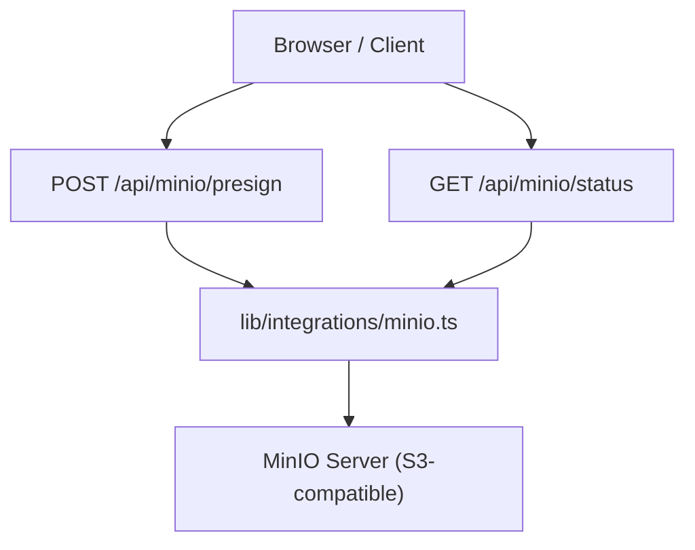
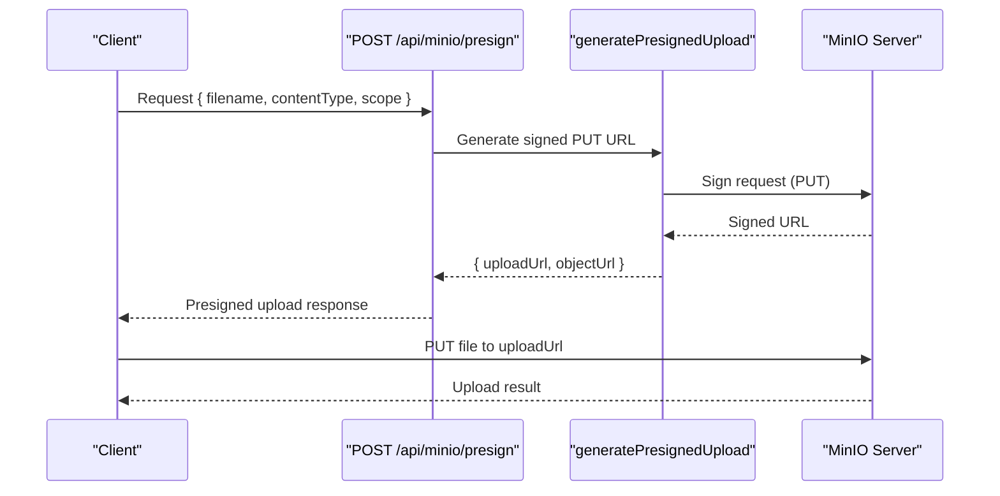
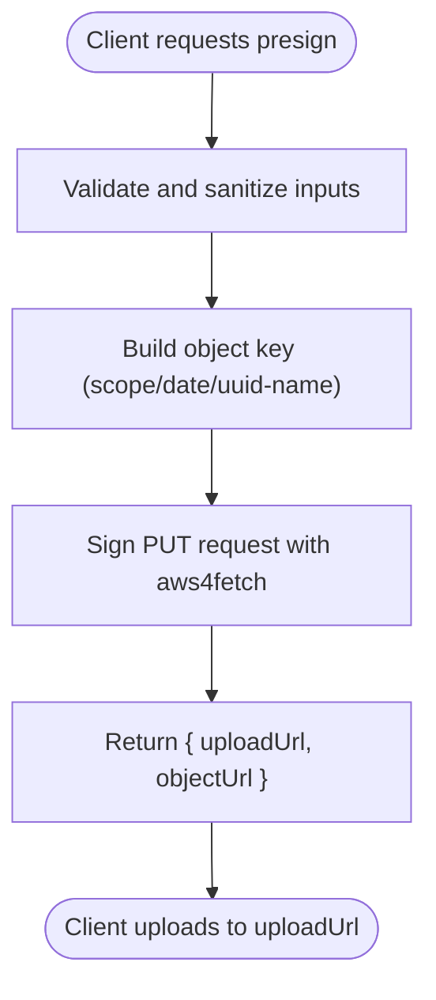
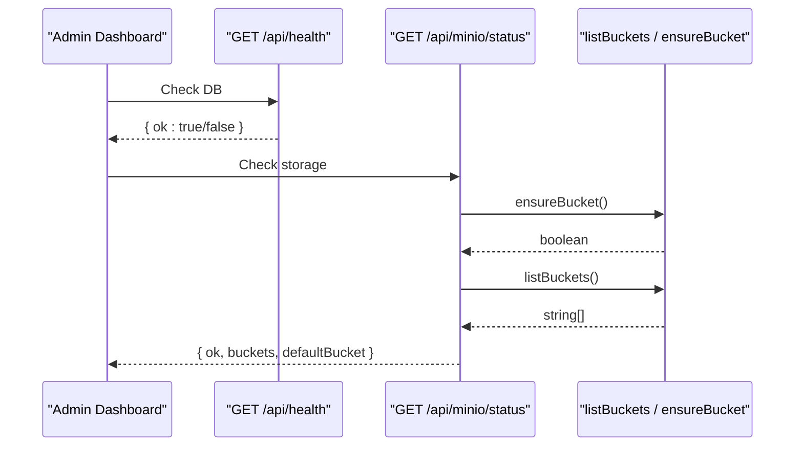
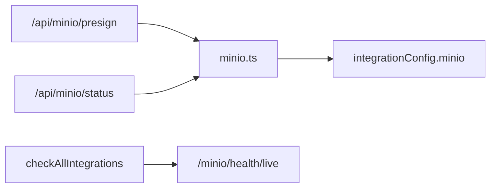

# Object Storage Integration (MinIO)

<cite>
**Referenced Files in This Document**
- [minio.ts](file://src/lib/integrations/minio.ts)
- [index.ts](file://src/lib/integrations/index.ts)
- [route.ts](file://src/app/api/minio/presign/route.ts)
- [route.ts](file://src/app/api/minio/status/route.ts)
- [route.ts](file://src/app/api/health/route.ts)
</cite>

## Table of Contents
1. Introduction
2. Project Structure
3. Core Components
4. Architecture Overview
5. Detailed Component Analysis
6. Dependency Analysis
7. Performance Considerations
8. Troubleshooting Guide
9. Conclusion

## Introduction
This document explains how the application integrates with MinIO object storage for secure, scalable file operations. It covers configuration and credentials, bucket management, presigned URL uploads, health checks, and operational guidance tailored to medical imaging workflows such as storing DICOM images, reports, and audit logs. Where applicable, it also outlines patterns for chunked uploads and concurrent downloads using standard S3-compatible APIs exposed by MinIO.

## Project Structure
The MinIO integration is implemented as a small set of server-side routes and a library module:
- Configuration and health checks are centralized in the integrations layer.
- A dedicated MinIO client module provides S3-compatible operations via aws4fetch.
- API routes expose presigned upload generation and storage status.

**Diagram sources**
- [route.ts:8-28](file://src/app/api/minio/presign/route.ts#L8-L28)
- [route.ts:7-23](file://src/app/api/minio/status/route.ts#L7-L23)
- [minio.ts:15-59](file://src/lib/integrations/minio.ts#L15-L59)

**Section sources**
- [index.ts:42-48](file://src/lib/integrations/index.ts#L42-L48)
- [minio.ts:1-13](file://src/lib/integrations/minio.ts#L1-L13)
- [route.ts:8-28](file://src/app/api/minio/presign/route.ts#L8-L28)
- [route.ts:7-23](file://src/app/api/minio/status/route.ts#L7-L23)

## Core Components
- MinIO client factory: Builds an AWS-compatible client using access key, secret key, and region from environment configuration.
- Bucket utilities: Lists buckets and ensures the default bucket exists.
- Presigned upload generator: Produces time-limited PUT URLs for direct client uploads.
- Health endpoints: Expose system health and MinIO-specific status.

Key responsibilities:
- Centralize secrets and endpoint configuration.
- Provide safe, validated inputs for object keys and content types.
- Return structured responses for success and error cases.

**Section sources**
- [minio.ts:4-13](file://src/lib/integrations/minio.ts#L4-L13)
- [minio.ts:15-27](file://src/lib/integrations/minio.ts#L15-L27)
- [minio.ts:29-47](file://src/lib/integrations/minio.ts#L29-L47)
- [minio.ts:49-59](file://src/lib/integrations/minio.ts#L49-L59)
- [index.ts:42-48](file://src/lib/integrations/index.ts#L42-L48)

## Architecture Overview
The flow uses presigned URLs to offload large file transfers directly to MinIO while keeping sensitive credentials on the server. The application validates inputs, generates short-lived upload URLs, and returns them to clients for direct PUT uploads.

**Diagram sources**
- [route.ts:8-28](file://src/app/api/minio/presign/route.ts#L8-L28)
- [minio.ts:29-47](file://src/lib/integrations/minio.ts#L29-L47)

**Section sources**
- [route.ts:8-28](file://src/app/api/minio/presign/route.ts#L8-L28)
- [minio.ts:29-47](file://src/lib/integrations/minio.ts#L29-L47)

## Detailed Component Analysis

### MinIO Client and Configuration
- Credentials and endpoint are read from environment variables and stored in a central configuration object.
- The client is created per call with explicit service and region settings.
- Missing credentials or endpoint cause immediate errors to prevent misconfiguration.

Operational notes:
- Keep MINIO_ENDPOINT, MINIO_ACCESS_KEY, MINIO_SECRET_KEY, MINIO_BUCKET, and MINIO_REGION configured securely.
- The public client config exposes only non-secret flags (e.g., minioEnabled).

**Section sources**
- [index.ts:42-48](file://src/lib/integrations/index.ts#L42-L48)
- [index.ts:54-69](file://src/lib/integrations/index.ts#L54-L69)
- [minio.ts:4-13](file://src/lib/integrations/minio.ts#L4-L13)

### Bucket Management
- ensureBucket: Checks if the configured bucket exists; creates it if missing.
- listBuckets: Retrieves all bucket names by parsing the S3 ListBuckets XML response.

Usage:
- Call ensureBucket before first write to avoid 404s.
- Use listBuckets for admin dashboards or diagnostics.

**Section sources**
- [minio.ts:15-27](file://src/lib/integrations/minio.ts#L15-L27)
- [minio.ts:49-59](file://src/lib/integrations/minio.ts#L49-L59)
- [route.ts:7-23](file://src/app/api/minio/status/route.ts#L7-L23)

### Presigned Uploads
- Input validation: Sanitizes scope and filename; defaults content type when omitted.
- Key construction: Organizes objects under scope/date/uuid-filename for easy partitioning.
- Signing: Uses aws4fetch to sign a PUT request with query-string signature and optional expiration.

Client workflow:
- POST to /api/minio/presign to obtain uploadUrl and objectUrl.
- PUT the file to uploadUrl.
- Access the object at objectUrl (subject to MinIO permissions).

**Diagram sources**
- [route.ts:8-28](file://src/app/api/minio/presign/route.ts#L8-L28)
- [minio.ts:29-47](file://src/lib/integrations/minio.ts#L29-L47)

**Section sources**
- [route.ts:8-28](file://src/app/api/minio/presign/route.ts#L8-L28)
- [minio.ts:29-47](file://src/lib/integrations/minio.ts#L29-L47)

### Health and Status Endpoints
- System health: Simple database reachability check.
- MinIO status: Ensures bucket existence and lists buckets; returns default bucket name.
- Integration health: Includes MinIO live health probe against MinIO’s /minio/health/live.

**Diagram sources**
- [route.ts:6-13](file://src/app/api/health/route.ts#L6-L13)
- [route.ts:7-23](file://src/app/api/minio/status/route.ts#L7-L23)
- [minio.ts:15-27](file://src/lib/integrations/minio.ts#L15-L27)
- [minio.ts:49-59](file://src/lib/integrations/minio.ts#L49-L59)

**Section sources**
- [route.ts:6-13](file://src/app/api/health/route.ts#L6-L13)
- [route.ts:7-23](file://src/app/api/minio/status/route.ts#L7-L23)
- [index.ts:232-241](file://src/lib/integrations/index.ts#L232-L241)

## Dependency Analysis
- The presign route depends on the MinIO library for signing and on environment configuration for endpoint and bucket.
- The status route depends on the MinIO library for bucket listing and creation.
- The integrations index centralizes configuration and includes a MinIO health check that probes the MinIO live endpoint.

**Diagram sources**
- [route.ts:8-28](file://src/app/api/minio/presign/route.ts#L8-L28)
- [route.ts:7-23](file://src/app/api/minio/status/route.ts#L7-L23)
- [minio.ts:1-13](file://src/lib/integrations/minio.ts#L1-L13)
- [index.ts:232-241](file://src/lib/integrations/index.ts#L232-L241)

**Section sources**
- [minio.ts:1-13](file://src/lib/integrations/minio.ts#L1-L13)
- [index.ts:232-241](file://src/lib/integrations/index.ts#L232-L241)

## Performance Considerations
- Direct uploads via presigned URLs reduce server load and network overhead by streaming data straight to MinIO.
- Timeouts: The implementation uses AbortSignal timeouts for health and bucket operations to avoid hanging requests.
- Concurrency: Clients can perform multiple parallel PUTs to different object keys without contention.
- Large files: For very large files, use multipart upload APIs supported by MinIO/S3-compatible services. The presigned URL approach can be extended to initiate multipart uploads and return part upload URLs.
- Content-Type: Always set appropriate content types (e.g., image/dicom, application/pdf) to enable correct handling downstream.

[No sources needed since this section provides general guidance]

## Troubleshooting Guide
Common issues and resolutions:
- Not configured: If MINIO_ENDPOINT is missing, presign returns a 503 indicating not configured. Ensure environment variables are set.
- Unreachable storage: Errors during presign or status indicate connectivity or authentication problems. Verify network, credentials, and bucket permissions.
- Bucket not found: ensureBucket will attempt to create the bucket; failures may indicate insufficient permissions.
- Health checks: Use /api/health for basic system readiness and /api/minio/status for storage availability. The global integration health endpoint also probes MinIO’s live health.

Operational tips:
- Validate scope and filename on the client side to avoid invalid object keys.
- Monitor presign failure rates and latency to detect upstream issues early.
- Use the status endpoint in dashboards to alert on storage unavailability.

**Section sources**
- [route.ts:8-28](file://src/app/api/minio/presign/route.ts#L8-L28)
- [route.ts:7-23](file://src/app/api/minio/status/route.ts#L7-L23)
- [minio.ts:4-13](file://src/lib/integrations/minio.ts#L4-L13)
- [index.ts:232-241](file://src/lib/integrations/index.ts#L232-L241)

## Conclusion
The MinIO integration provides a secure, efficient mechanism for object storage through presigned uploads, robust health monitoring, and straightforward bucket management. By leveraging direct client uploads and centralized configuration, the platform supports high-throughput scenarios typical in medical imaging workflows. Extend the existing presign logic to support multipart uploads for very large files and integrate with MinIO lifecycle policies for automated archival and retention.

[No sources needed since this section summarizes without analyzing specific files]